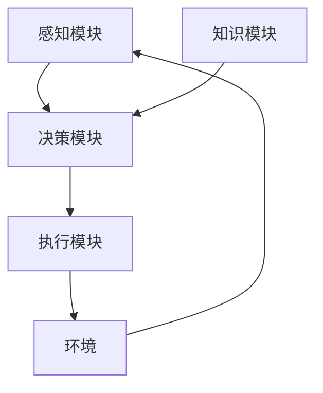

# AI Agent在科学研究辅助中的应用

> 关键词：AI Agent、科学研究辅助、智能体技术、自动化研究、知识推理

> 摘要：本文深入探讨了AI Agent在科学研究辅助中的应用。随着人工智能技术的不断发展，AI Agent作为一种智能的自主实体，在科学研究领域展现出巨大的潜力。文章首先介绍了AI Agent的背景知识，包括其目的、预期读者、文档结构等。接着详细阐述了AI Agent的核心概念、算法原理、数学模型等内容。通过项目实战展示了AI Agent在实际应用中的代码实现和详细解释。同时分析了其实际应用场景，推荐了相关的工具和资源。最后总结了AI Agent在科学研究辅助中的未来发展趋势与挑战，并提供了常见问题解答和参考资料，旨在为科研人员和相关技术人员全面了解和应用AI Agent提供有价值的参考。

## 1. 背景介绍 
### 1.1 目的和范围
在当今科技飞速发展的时代，科学研究的复杂性和规模不断增加。传统的研究方法在处理海量数据、快速获取知识和进行复杂推理等方面面临诸多挑战。AI Agent作为一种新兴的技术手段，能够为科学研究提供智能化的辅助。本文章的目的在于全面介绍AI Agent在科学研究辅助中的应用，包括其原理、实现方法、实际应用场景等，帮助读者深入了解AI Agent如何提升科学研究的效率和质量。文章的范围涵盖了AI Agent的基本概念、相关算法、数学模型，以及在不同科学领域的具体应用案例等内容。

### 1.2 预期读者
本文预期读者包括科研人员，他们可以通过了解AI Agent的应用，探索如何利用这一技术提升自己的研究效率和成果质量；计算机科学和人工智能领域的技术人员，他们可以深入学习AI Agent的技术原理和实现方法；以及对科学研究和人工智能交叉领域感兴趣的爱好者，帮助他们了解前沿技术在科研中的应用。

### 1.3 文档结构概述
本文将按照以下结构进行阐述：首先介绍AI Agent的背景知识，包括目的、预期读者和文档结构等；接着深入讲解AI Agent的核心概念与联系，通过文本示意图和Mermaid流程图进行说明；然后介绍AI Agent的核心算法原理和具体操作步骤，使用Python源代码进行详细阐述；随后讲解AI Agent的数学模型和公式，并举例说明；通过项目实战展示AI Agent在实际应用中的代码实现和详细解释；分析AI Agent在科学研究中的实际应用场景；推荐相关的学习资源、开发工具框架和论文著作；总结AI Agent在科学研究辅助中的未来发展趋势与挑战；提供常见问题解答和参考资料。

### 1.4 术语表
#### 1.4.1 核心术语定义
- **AI Agent（人工智能智能体）**：是一种能够感知环境、根据内部状态和目标进行决策，并通过执行相应动作来影响环境的智能实体。它可以自主地完成特定任务，具有一定的自主性、反应性、社会性和学习能力。
- **科学研究辅助**：指利用各种技术手段和工具，帮助科研人员更高效地进行科学研究，包括数据收集、文献检索、实验设计、结果分析等方面的支持。
- **知识推理**：是指基于已有的知识和规则，通过逻辑推理得出新的知识或结论的过程。AI Agent可以利用知识推理来解决复杂的科学问题。

#### 1.4.2 相关概念解释
- **智能体架构**：描述了AI Agent的内部结构和组织方式，包括感知模块、决策模块、执行模块等。不同的智能体架构适用于不同的应用场景。
- **环境感知**：AI Agent通过各种传感器获取环境信息的过程，这些信息可以帮助智能体了解当前的研究状态和周围环境。
- **目标导向**：AI Agent具有明确的目标，它的决策和行动都是为了实现这些目标。在科学研究辅助中，目标可以是找到特定的研究结果、优化实验方案等。

#### 1.4.3 缩略词列表
- **AI**：Artificial Intelligence（人工智能）
- **ML**：Machine Learning（机器学习）
- **RL**：Reinforcement Learning（强化学习）

## 2. 核心概念与联系 

### 核心概念原理
AI Agent的核心原理基于智能体理论，它将智能体看作是一个能够在环境中自主行动的实体。智能体通过感知器获取环境信息，然后将这些信息传递给决策模块。决策模块根据智能体的内部状态和目标，利用知识推理和机器学习算法进行决策，生成相应的动作。最后，执行器将这些动作作用于环境，从而实现智能体与环境的交互。

### 架构的文本示意图
AI Agent的架构主要包括以下几个部分：
- **感知模块**：负责从环境中获取信息，例如通过传感器收集实验数据、从文献数据库中检索相关文献等。
- **决策模块**：对感知模块获取的信息进行处理和分析，结合智能体的内部状态和目标，做出决策。决策模块可以使用知识推理、机器学习、强化学习等算法。
- **执行模块**：根据决策模块的输出，执行相应的动作，例如调整实验参数、生成研究报告等。
- **知识模块**：存储智能体的知识和规则，为决策模块提供支持。知识模块可以包括领域知识、本体知识、经验知识等。

### Mermaid流程图


## 3. 核心算法原理 & 具体操作步骤 

### 算法原理讲解
AI Agent的决策过程可以使用多种算法，这里以强化学习算法为例进行详细阐述。强化学习是一种通过智能体与环境的交互来学习最优策略的算法。智能体在环境中执行动作，环境会根据智能体的动作返回奖励信号，智能体的目标是最大化累积奖励。

以下是一个简单的强化学习算法（Q - learning）的Python源代码示例：

```python
import numpy as np

# 定义环境参数
num_states = 5
num_actions = 2
gamma = 0.9  # 折扣因子
alpha = 0.1  # 学习率

# 初始化Q表
Q = np.zeros((num_states, num_actions))

# 定义奖励函数
rewards = np.array([
    [0, 1],
    [0, 0],
    [0, 0],
    [0, 0],
    [0, 10]
])

# Q - learning算法
def q_learning(num_episodes):
    for episode in range(num_episodes):
        state = 0  # 初始状态
        done = False
        while not done:
            # 选择动作
            if np.random.uniform(0, 1) < 0.1:  # 探索
                action = np.random.choice(num_actions)
            else:  # 利用
                action = np.argmax(Q[state, :])
            
            # 执行动作，获取下一个状态和奖励
            next_state = np.random.choice(num_states)
            reward = rewards[state, action]
            
            # 更新Q表
            Q[state, action] = Q[state, action] + alpha * (reward + gamma * np.max(Q[next_state, :]) - Q[state, action])
            
            # 判断是否结束
            if state == num_states - 1:
                done = True
            else:
                state = next_state
    
    return Q

# 训练Q表
Q = q_learning(1000)
print("最终的Q表：")
print(Q)
```

### 具体操作步骤
1. **初始化**：初始化Q表、环境参数（如状态数、动作数、折扣因子、学习率等）和奖励函数。
2. **选择动作**：在每个时间步，智能体根据当前状态选择一个动作。可以使用探索 - 利用策略，例如ε - greedy策略，以平衡探索新动作和利用已有知识。
3. **执行动作**：智能体执行选择的动作，环境返回下一个状态和奖励。
4. **更新Q表**：根据Q - learning算法的更新公式，更新Q表中的值。
5. **判断结束条件**：如果达到终止状态，则结束当前回合；否则，继续下一个时间步。
6. **重复训练**：重复执行多个回合，直到Q表收敛。

## 4. 数学模型和公式 & 详细讲解 & 举例说明 

### 数学模型
在强化学习中，智能体与环境的交互可以用马尔可夫决策过程（MDP）来建模。MDP是一个五元组 $(S, A, P, R, \gamma)$，其中：
- $S$ 是状态集合，表示智能体可能处于的所有状态。
- $A$ 是动作集合，表示智能体可以执行的所有动作。
- $P: S \times A \times S \to [0, 1]$ 是状态转移概率函数，表示在状态 $s$ 执行动作 $a$ 后转移到状态 $s'$ 的概率。
- $R: S \times A \to \mathbb{R}$ 是奖励函数，表示在状态 $s$ 执行动作 $a$ 后获得的即时奖励。
- $\gamma \in [0, 1]$ 是折扣因子，用于权衡即时奖励和未来奖励。

### 公式
Q - learning算法的更新公式为：
$$Q(s, a) \leftarrow Q(s, a) + \alpha [r + \gamma \max_{a'} Q(s', a') - Q(s, a)]$$
其中：
- $Q(s, a)$ 是状态 $s$ 下执行动作 $a$ 的Q值。
- $\alpha$ 是学习率，控制每次更新的步长。
- $r$ 是执行动作 $a$ 后获得的即时奖励。
- $\gamma$ 是折扣因子。
- $s'$ 是执行动作 $a$ 后转移到的下一个状态。

### 详细讲解
Q - learning算法的核心思想是通过不断更新Q表，使得Q值逐渐逼近最优Q值。在每个时间步，智能体根据当前状态选择一个动作，执行该动作后获得即时奖励和下一个状态。然后，根据更新公式更新Q表中的值。折扣因子 $\gamma$ 用于权衡即时奖励和未来奖励，当 $\gamma$ 接近1时，智能体更注重未来的奖励；当 $\gamma$ 接近0时，智能体更注重即时奖励。学习率 $\alpha$ 控制每次更新的步长，$\alpha$ 越大，更新速度越快，但可能会导致不稳定；$\alpha$ 越小，更新速度越慢，但可能会更稳定。

### 举例说明
假设一个简单的迷宫环境，智能体的目标是从起点到达终点。迷宫中的每个位置可以看作一个状态，智能体可以执行上下左右四个动作。当智能体到达终点时，获得一个正奖励；当智能体撞到墙壁时，获得一个负奖励。通过Q - learning算法，智能体可以学习到从起点到终点的最优路径。

## 5. 项目实战：代码实际案例和详细解释说明 

### 5.1  开发环境搭建
- **Python环境**：建议使用Python 3.7及以上版本。可以从Python官方网站（https://www.python.org/downloads/）下载安装。
- **依赖库**：需要安装NumPy、Matplotlib等库。可以使用pip命令进行安装：
```sh
pip install numpy matplotlib
```

### 5.2  源代码详细实现和代码解读
以下是一个基于Python的AI Agent在简单科学实验模拟中的应用案例：

```python
import numpy as np
import matplotlib.pyplot as plt

# 定义实验环境
class ExperimentEnv:
    def __init__(self):
        self.state = 0  # 初始状态
        self.num_states = 10
        self.num_actions = 2  # 动作：增加参数或减少参数
        self.goal_state = 8  # 目标状态

    def reset(self):
        self.state = 0
        return self.state

    def step(self, action):
        if action == 0:  # 增加参数
            if self.state < self.num_states - 1:
                self.state += 1
        else:  # 减少参数
            if self.state > 0:
                self.state -= 1
        
        # 判断是否到达目标状态
        if self.state == self.goal_state:
            reward = 10
            done = True
        else:
            reward = -1
            done = False
        
        return self.state, reward, done

# 定义AI Agent
class AI_Agent:
    def __init__(self, num_states, num_actions, gamma=0.9, alpha=0.1):
        self.num_states = num_states
        self.num_actions = num_actions
        self.gamma = gamma
        self.alpha = alpha
        self.Q = np.zeros((num_states, num_actions))

    def choose_action(self, state, epsilon=0.1):
        if np.random.uniform(0, 1) < epsilon:
            action = np.random.choice(self.num_actions)
        else:
            action = np.argmax(self.Q[state, :])
        return action

    def update(self, state, action, reward, next_state):
        self.Q[state, action] = self.Q[state, action] + self.alpha * (reward + self.gamma * np.max(self.Q[next_state, :]) - self.Q[state, action])

# 训练AI Agent
def train_agent(num_episodes):
    env = ExperimentEnv()
    agent = AI_Agent(env.num_states, env.num_actions)
    rewards = []

    for episode in range(num_episodes):
        state = env.reset()
        episode_reward = 0
        done = False

        while not done:
            action = agent.choose_action(state)
            next_state, reward, done = env.step(action)
            agent.update(state, action, reward, next_state)
            state = next_state
            episode_reward += reward

        rewards.append(episode_reward)

    return rewards

# 运行训练
num_episodes = 500
rewards = train_agent(num_episodes)

# 绘制奖励曲线
plt.plot(rewards)
plt.xlabel('Episode')
plt.ylabel('Reward')
plt.title('Training Rewards')
plt.show()
```

### 5.3  代码解读与分析
- **ExperimentEnv类**：定义了实验环境，包括初始状态、状态数、动作数和目标状态。`reset` 方法用于重置环境，`step` 方法用于执行动作并返回下一个状态、奖励和是否结束的标志。
- **AI_Agent类**：定义了AI Agent，包括Q表、选择动作的方法和更新Q表的方法。`choose_action` 方法使用ε - greedy策略选择动作，`update` 方法根据Q - learning算法更新Q表。
- **train_agent函数**：用于训练AI Agent，在每个回合中，智能体与环境进行交互，更新Q表，并记录每个回合的奖励。
- **绘制奖励曲线**：使用Matplotlib库绘制训练过程中的奖励曲线，直观地展示智能体的学习过程。

通过分析奖励曲线，可以判断智能体是否在学习和逐渐优化策略。如果奖励曲线逐渐上升，说明智能体在不断改进，能够更好地完成任务。

## 6. 实际应用场景 
### 文献检索与知识发现
AI Agent可以自动从海量的学术文献中检索相关信息，帮助科研人员快速找到所需的文献。它可以根据科研人员的研究主题和需求，利用自然语言处理技术对文献进行筛选、分类和摘要提取，提高文献检索的效率和准确性。同时，AI Agent还可以通过知识推理，发现文献之间的潜在联系和新知识，为科研人员提供新的研究思路。

### 实验设计与优化
在科学实验中，AI Agent可以根据实验目的和已有知识，自动设计实验方案。它可以考虑各种实验因素和约束条件，优化实验参数，提高实验的效率和成功率。例如，在化学实验中，AI Agent可以根据化学反应的原理和目标产物，选择合适的反应物、反应条件和实验设备，设计出最优的实验方案。

### 数据处理与分析
科研过程中会产生大量的数据，AI Agent可以帮助科研人员对这些数据进行处理和分析。它可以使用机器学习和数据挖掘算法，对数据进行清洗、特征提取和分类，发现数据中的规律和模式。例如，在生物医学研究中，AI Agent可以对基因数据、蛋白质数据等进行分析，帮助科研人员理解生物分子的结构和功能，发现疾病的诊断标志物和治疗靶点。

### 科研协作与交流
AI Agent可以作为科研团队的智能助手，促进团队成员之间的协作和交流。它可以自动分配任务、跟踪项目进度、提醒团队成员重要事项等。同时，AI Agent还可以利用自然语言处理技术，实现科研人员之间的智能对话和知识共享，提高团队的协作效率和创新能力。

## 7. 工具和资源推荐
### 7.1 学习资源推荐
#### 7.1.1 书籍推荐
- 《人工智能：一种现代的方法》：全面介绍了人工智能的基本概念、算法和应用，是人工智能领域的经典教材。
- 《强化学习：原理与Python实现》：详细讲解了强化学习的原理和算法，并通过Python代码进行实现，适合初学者学习。
- 《知识图谱：方法、实践与应用》：介绍了知识图谱的构建、推理和应用，对于理解AI Agent中的知识表示和推理有很大帮助。

#### 7.1.2 在线课程
- Coursera上的“人工智能基础”课程：由知名大学的教授授课，系统地介绍了人工智能的基础知识和技术。
- edX上的“强化学习”课程：深入讲解了强化学习的理论和实践，通过案例分析帮助学习者掌握强化学习的应用。
- 中国大学MOOC上的“自然语言处理”课程：介绍了自然语言处理的基本概念、算法和应用，对于AI Agent中的文本处理有很大帮助。

#### 7.1.3 技术博客和网站
- Medium：有很多关于人工智能和AI Agent的技术博客文章，涵盖了最新的研究成果和应用案例。
- arXiv：是一个预印本服务器，提供了大量的人工智能相关的研究论文，可以及时了解最新的研究动态。
- 机器之心：专注于人工智能领域的资讯和技术解读，提供了很多有价值的技术文章和分析报告。

### 7.2 开发工具框架推荐
#### 7.2.1 IDE和编辑器
- PyCharm：是一款专业的Python集成开发环境，提供了丰富的代码编辑、调试和分析功能，适合开发AI Agent相关的Python代码。
- Visual Studio Code：是一款轻量级的代码编辑器，支持多种编程语言和插件，具有良好的扩展性，适合快速开发和调试。

#### 7.2.2 调试和性能分析工具
- PDB：是Python自带的调试工具，可以帮助开发者逐步调试代码，查找问题。
- cProfile：是Python的性能分析工具，可以分析代码的执行时间和函数调用关系，帮助开发者优化代码性能。

#### 7.2.3 相关框架和库
- OpenAI Gym：是一个开源的强化学习环境库，提供了各种模拟环境，方便开发者进行强化学习算法的实验和验证。
- NLTK：是一个自然语言处理工具包，提供了丰富的文本处理功能，如分词、词性标注、命名实体识别等，适合AI Agent中的文本处理任务。
- TensorFlow和PyTorch：是深度学习领域的两个主流框架，提供了强大的深度学习模型训练和推理功能，适合AI Agent中的机器学习任务。

### 7.3 相关论文著作推荐
#### 7.3.1 经典论文
- “Reinforcement Learning: A Survey”：对强化学习的发展历程、算法和应用进行了全面的综述，是强化学习领域的经典论文。
- “Knowledge Representation and Reasoning”：介绍了知识表示和推理的基本概念、方法和技术，对于理解AI Agent中的知识处理有重要意义。
- “Natural Language Processing: An Overview”：对自然语言处理的发展现状、技术和应用进行了概述，是自然语言处理领域的经典论文。

#### 7.3.2 最新研究成果
- 关注顶级学术会议，如NeurIPS（神经信息处理系统大会）、ICML（国际机器学习会议）、ACL（计算语言学协会年会）等，这些会议上的论文反映了人工智能领域的最新研究成果。
- 查阅相关领域的顶级期刊，如Journal of Artificial Intelligence Research（JAIR）、Artificial Intelligence等，这些期刊发表了很多高质量的研究论文。

#### 7.3.3 应用案例分析
- 可以参考一些实际应用案例的论文，如AI Agent在医疗诊断、金融预测、智能交通等领域的应用案例。这些案例可以帮助我们更好地理解AI Agent的实际应用场景和效果。

## 8. 总结：未来发展趋势与挑战
### 未来发展趋势
- **多智能体协作**：未来的AI Agent将不仅仅是单个智能体的应用，而是多个智能体之间的协作。多个AI Agent可以通过通信和协调，共同完成复杂的科学研究任务，提高研究效率和质量。
- **与其他技术的融合**：AI Agent将与物联网、大数据、云计算等技术深度融合。例如，通过物联网设备获取更多的环境信息，利用大数据进行知识挖掘和分析，借助云计算提供强大的计算资源，从而更好地服务于科学研究。
- **个性化服务**：根据科研人员的不同需求和研究习惯，AI Agent将提供个性化的服务。例如，为不同领域的科研人员提供定制化的文献检索、实验设计和数据分析方案。

### 挑战
- **知识表示与推理的局限性**：目前的知识表示和推理方法还存在一定的局限性，难以处理复杂的领域知识和不确定性信息。如何提高知识表示和推理的能力，是AI Agent在科学研究辅助中面临的一个重要挑战。
- **数据隐私和安全问题**：在科学研究中，涉及到大量的敏感数据，如患者的医疗数据、企业的商业机密等。AI Agent在处理这些数据时，需要保证数据的隐私和安全，防止数据泄露和滥用。
- **伦理和法律问题**：随着AI Agent在科学研究中的应用越来越广泛，伦理和法律问题也日益凸显。例如，AI Agent的决策责任如何界定，如何避免AI Agent的偏见和歧视等。

## 9. 附录：常见问题与解答
### 问题1：AI Agent和传统的软件程序有什么区别？
解答：传统的软件程序通常是按照预先定义的规则和流程执行任务，缺乏自主性和适应性。而AI Agent具有感知环境、决策和行动的能力，能够根据环境的变化和自身的目标自主地调整行为，具有更强的智能性和灵活性。

### 问题2：AI Agent在科学研究中的应用是否会取代科研人员？
解答：不会。AI Agent在科学研究中主要起到辅助作用，帮助科研人员提高研究效率和质量。科学研究需要科研人员的创造力、洞察力和判断力，这些是AI Agent目前无法替代的。AI Agent可以为科研人员提供更多的信息和支持，帮助他们更好地完成研究任务。

### 问题3：如何评估AI Agent在科学研究辅助中的效果？
解答：可以从多个方面评估AI Agent的效果，如研究效率的提高、研究成果的质量、用户满意度等。例如，可以比较使用AI Agent前后的文献检索时间、实验设计的成功率、数据分析的准确性等指标。同时，也可以通过用户调查和反馈来了解科研人员对AI Agent的满意度和使用体验。

## 10. 扩展阅读 & 参考资料
### 扩展阅读
- 可以进一步阅读关于智能体理论、机器学习、自然语言处理等方面的书籍和论文，深入了解AI Agent的技术原理和应用。
- 关注人工智能领域的前沿研究动态，如量子计算与人工智能的结合、脑机接口与AI Agent的交互等，探索AI Agent的未来发展方向。

### 参考资料
- 《人工智能：一种现代的方法》，Stuart Russell、Peter Norvig著
- 《强化学习：原理与Python实现》，Richard S. Sutton、Andrew G. Barto著
- 相关学术论文和技术报告，如在NeurIPS、ICML、ACL等会议上发表的论文。
- 在线资源，如OpenAI Gym文档、NLTK文档、TensorFlow和PyTorch官方文档等。