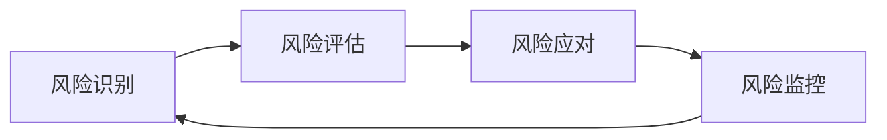

# AI Agent在风险管理中的应用

> 关键词：AI Agent、风险管理、智能决策、自动化、风险评估

> 摘要：本文深入探讨了AI Agent在风险管理领域的应用。首先介绍了相关背景，包括目的、预期读者等内容。接着阐述了AI Agent和风险管理的核心概念及联系，通过示意图和流程图进行清晰展示。详细讲解了AI Agent在风险管理中涉及的核心算法原理和具体操作步骤，并结合Python代码进行说明。同时给出了相关的数学模型和公式，辅以举例阐释。通过项目实战，展示了代码的实际案例并进行详细解释。分析了AI Agent在风险管理中的实际应用场景，推荐了相关的学习资源、开发工具框架以及论文著作。最后总结了未来发展趋势与挑战，提供了常见问题解答和扩展阅读参考资料，旨在全面呈现AI Agent在风险管理中应用的全貌和价值。

## 1. 背景介绍 
### 1.1 目的和范围
随着科技的飞速发展，风险管理领域面临着越来越复杂的挑战。传统的风险管理方法在处理海量数据、实时决策等方面逐渐显得力不从心。AI Agent作为一种智能化的软件实体，具有自主学习、决策和执行任务的能力，为风险管理带来了新的思路和方法。本文的目的在于全面探讨AI Agent在风险管理中的应用，包括其原理、算法、实际案例等方面，范围涵盖金融、企业运营、工程建设等多个领域的风险管理场景。

### 1.2 预期读者
本文预期读者包括风险管理领域的专业人士，如风险分析师、风险管理经理等，他们可以从文中了解AI Agent在风险管理中的具体应用方法和优势，为实际工作提供参考；也适合对人工智能和风险管理交叉领域感兴趣的科研人员，帮助他们深入研究相关理论和技术；同时，对于相关专业的学生，本文可以作为学习资料，加深对这一领域的理解。

### 1.3 文档结构概述
本文首先介绍背景信息，让读者对AI Agent在风险管理中的应用有一个初步的认识。接着阐述核心概念与联系，帮助读者理解AI Agent和风险管理的基本原理和相互关系。然后详细讲解核心算法原理和具体操作步骤，结合Python代码进行说明。通过数学模型和公式进一步深入分析，辅以举例帮助读者理解。项目实战部分展示代码实际案例并进行详细解释。随后分析实际应用场景，让读者了解AI Agent在不同领域的具体应用。推荐相关的工具和资源，方便读者进一步学习和实践。最后总结未来发展趋势与挑战，提供常见问题解答和扩展阅读参考资料，为读者提供一个全面的学习和研究框架。

### 1.4 术语表
#### 1.4.1 核心术语定义
- **AI Agent**：即人工智能智能体，是一种能够感知环境、自主决策并采取行动以实现特定目标的软件实体。它可以根据环境的变化动态调整自己的行为，具有一定的自主性、反应性和社会性。
- **风险管理**：指如何在项目或者企业一个肯定有风险的环境里把风险可能造成的不良影响减至最低的管理过程。包括风险识别、风险评估、风险应对等环节。

#### 1.4.2 相关概念解释
- **智能决策**：AI Agent基于对环境信息的感知和分析，运用一定的算法和模型，做出最优的决策以实现目标。在风险管理中，智能决策可以帮助选择最合适的风险应对策略。
- **自动化**：指AI Agent能够自动执行风险管理的相关任务，如数据收集、风险评估等，减少人工干预，提高效率和准确性。

#### 1.4.3 缩略词列表
- **AI**：Artificial Intelligence，人工智能
- **ML**：Machine Learning，机器学习
- **DL**：Deep Learning，深度学习

## 2. 核心概念与联系 

### 2.1 AI Agent的原理和架构
AI Agent的基本原理是通过感知器感知环境信息，将其传递给决策模块。决策模块根据内部的知识和算法对信息进行分析和处理，做出决策。然后通过执行器将决策转化为具体的行动，作用于环境。其架构可以分为以下几个部分：
- **感知层**：负责收集环境中的各种信息，如传感器数据、文本数据等。
- **决策层**：根据感知层提供的信息，运用机器学习、深度学习等算法进行分析和推理，做出决策。
- **执行层**：将决策层的决策转化为具体的行动，如发送指令、控制设备等。

以下是AI Agent架构的文本示意图：

```plaintext
+----------------+
|    感知层      |
|  (收集信息)    |
+----------------+
       |
       v
+----------------+
|    决策层      |
|  (分析推理)    |
+----------------+
       |
       v
+----------------+
|    执行层      |
|  (执行行动)    |
+----------------+
```

### 2.2 风险管理的原理和流程
风险管理的基本原理是识别可能影响项目或企业目标实现的风险因素，对其进行评估和分析，然后采取相应的措施来降低风险的影响。其流程一般包括以下几个步骤：
- **风险识别**：通过各种方法和技术，找出可能存在的风险因素。
- **风险评估**：对识别出的风险因素进行定量或定性的评估，确定其发生的可能性和影响程度。
- **风险应对**：根据风险评估的结果，选择合适的风险应对策略，如风险规避、风险减轻、风险转移等。
- **风险监控**：对风险应对措施的执行情况进行监控，及时调整策略。

以下是风险管理流程的Mermaid流程图：



### 2.3 AI Agent与风险管理的联系
AI Agent在风险管理中具有重要的作用。它可以利用其强大的感知和分析能力，帮助识别潜在的风险因素。通过智能决策，为风险应对提供最优的策略。同时，AI Agent可以自动化地执行风险监控任务，及时发现风险的变化并做出调整。例如，在金融风险管理中，AI Agent可以实时监测市场数据，识别潜在的风险，为投资者提供决策建议。

## 3. 核心算法原理 & 具体操作步骤 

### 3.1 核心算法原理
在AI Agent应用于风险管理中，常用的算法包括机器学习算法和深度学习算法。以机器学习中的决策树算法为例，决策树是一种基于树结构进行决策的算法。它通过对数据的学习，构建一棵决策树，每个内部节点是一个属性上的测试，每个分支是一个测试输出，每个叶节点是一个类别或值。

以下是决策树算法的Python源代码实现：

```python
from sklearn.datasets import load_iris
from sklearn.model_selection import train_test_split
from sklearn.tree import DecisionTreeClassifier
from sklearn.metrics import accuracy_score

# 加载数据集
iris = load_iris()
X = iris.data
y = iris.target

# 划分训练集和测试集
X_train, X_test, y_train, y_test = train_test_split(X, y, test_size=0.3, random_state=42)

# 创建决策树分类器
clf = DecisionTreeClassifier()

# 训练模型
clf.fit(X_train, y_train)

# 预测
y_pred = clf.predict(X_test)

# 计算准确率
accuracy = accuracy_score(y_test, y_pred)
print(f"Accuracy: {accuracy}")
```

### 3.2 具体操作步骤
#### 3.2.1 数据收集
首先需要收集与风险管理相关的数据，如市场数据、企业运营数据等。数据可以来自各种渠道，如数据库、传感器、网络爬虫等。

#### 3.2.2 数据预处理
对收集到的数据进行预处理，包括数据清洗、数据转换、特征选择等。数据清洗是去除数据中的噪声和缺失值；数据转换是将数据转换为适合算法处理的格式；特征选择是选择与风险相关的重要特征。

#### 3.2.3 模型训练
选择合适的算法，如决策树、神经网络等，对预处理后的数据进行训练。训练过程中需要调整模型的参数，以提高模型的性能。

#### 3.2.4 模型评估
使用测试数据对训练好的模型进行评估，计算模型的准确率、召回率、F1值等指标，评估模型的性能。

#### 3.2.5 风险决策
根据模型的预测结果，做出风险决策。例如，如果模型预测某个投资项目的风险较高，可以选择规避该项目。

## 4. 数学模型和公式 & 详细讲解 & 举例说明 

### 4.1 风险评估的数学模型
在风险管理中，常用的风险评估数学模型是风险矩阵模型。风险矩阵通过两个维度来评估风险：风险发生的可能性 $P$ 和风险影响的程度 $I$。风险等级 $R$ 可以通过以下公式计算：

$$R = P \times I$$

其中，$P$ 和 $I$ 通常采用等级划分，如 $P$ 可以分为低、中、高三个等级，分别对应不同的概率区间；$I$ 也可以分为低、中、高三个等级，分别对应不同的影响程度。

### 4.2 详细讲解
风险矩阵模型的优点是简单直观，易于理解和应用。通过将风险发生的可能性和影响程度进行量化，可以快速评估风险的等级，为风险应对提供依据。例如，当 $P$ 为高（概率为 0.8），$I$ 为高（影响程度为 10）时，$R = 0.8 \times 10 = 8$，表示该风险等级较高，需要采取相应的措施进行应对。

### 4.3 举例说明
假设某企业在进行市场推广活动时，面临着竞争对手推出类似产品的风险。通过市场调研和分析，估计该风险发生的可能性 $P$ 为中（概率为 0.5），风险影响的程度 $I$ 为中（影响程度为 6）。则该风险的等级 $R = 0.5 \times 6 = 3$，根据企业的风险偏好和策略，可以选择采取风险减轻的措施，如加大市场推广力度，提高产品的竞争力。

## 5. 项目实战：代码实际案例和详细解释说明 

### 5.1  开发环境搭建
#### 5.1.1 安装Python
首先需要安装Python环境，建议使用Python 3.7及以上版本。可以从Python官方网站（https://www.python.org/downloads/）下载安装包，按照安装向导进行安装。

#### 5.1.2 安装必要的库
在风险管理项目中，需要安装一些必要的Python库，如NumPy、Pandas、Scikit-learn等。可以使用以下命令进行安装：

```sh
pip install numpy pandas scikit-learn
```

### 5.2  源代码详细实现和代码解读
以下是一个简单的基于Python的风险管理项目示例，用于预测客户的信用风险。

```python
import pandas as pd
from sklearn.model_selection import train_test_split
from sklearn.linear_model import LogisticRegression
from sklearn.metrics import accuracy_score

# 加载数据集
data = pd.read_csv('credit_data.csv')

# 数据预处理
X = data.drop('credit_risk', axis=1)
y = data['credit_risk']

# 划分训练集和测试集
X_train, X_test, y_train, y_test = train_test_split(X, y, test_size=0.2, random_state=42)

# 创建逻辑回归模型
model = LogisticRegression()

# 训练模型
model.fit(X_train, y_train)

# 预测
y_pred = model.predict(X_test)

# 计算准确率
accuracy = accuracy_score(y_test, y_pred)
print(f"Accuracy: {accuracy}")
```

#### 5.2.1 代码解读
- **数据加载**：使用 `pandas` 库的 `read_csv` 函数加载信用风险数据集。
- **数据预处理**：将特征变量和目标变量分离，`X` 为特征变量，`y` 为目标变量。
- **划分训练集和测试集**：使用 `train_test_split` 函数将数据集划分为训练集和测试集，测试集占比为 20%。
- **模型创建**：创建一个逻辑回归模型。
- **模型训练**：使用训练集对模型进行训练。
- **预测**：使用测试集进行预测。
- **准确率计算**：使用 `accuracy_score` 函数计算模型的准确率。

### 5.3  代码解读与分析
通过上述代码，我们可以看到如何使用Python和Scikit-learn库进行信用风险预测。逻辑回归是一种常用的分类算法，适用于二分类问题。在实际应用中，我们可以根据需要选择不同的算法，如决策树、支持向量机等。同时，还可以对模型进行调优，如调整模型的参数、进行特征工程等，以提高模型的性能。

## 6. 实际应用场景 
### 6.1 金融风险管理
在金融领域，AI Agent可以用于信用风险评估、市场风险监测、欺诈检测等方面。例如，银行可以使用AI Agent对客户的信用状况进行评估，预测客户的违约概率，从而决定是否给予贷款。同时，AI Agent可以实时监测市场数据，识别潜在的市场风险，为投资者提供决策建议。在欺诈检测方面，AI Agent可以分析交易数据，识别异常交易行为，及时发现欺诈风险。

### 6.2 企业运营风险管理
在企业运营中，AI Agent可以用于供应链风险管理、项目风险管理等方面。在供应链风险管理中，AI Agent可以监测供应商的交货时间、质量等信息，识别潜在的供应链中断风险，提前采取措施进行应对。在项目风险管理中，AI Agent可以对项目的进度、成本、质量等方面进行监控，及时发现项目中的风险因素，为项目管理者提供决策支持。

### 6.3 工程建设风险管理
在工程建设领域，AI Agent可以用于工程质量风险管理、安全风险管理等方面。例如，AI Agent可以通过传感器收集工程建设过程中的数据，如温度、湿度、应力等，对工程质量进行实时监测，及时发现质量问题。在安全风险管理方面，AI Agent可以分析施工现场的视频监控数据，识别潜在的安全隐患，提醒施工人员采取措施进行防范。

## 7. 工具和资源推荐
### 7.1 学习资源推荐
#### 7.1.1 书籍推荐
- 《人工智能：一种现代的方法》：这本书全面介绍了人工智能的基本概念、算法和应用，是学习人工智能的经典教材。
- 《Python机器学习》：详细介绍了Python在机器学习中的应用，包括各种机器学习算法的原理和实现。
- 《风险管理与金融机构》：深入探讨了金融风险管理的理论和实践，对于理解金融风险管理有很大的帮助。

#### 7.1.2 在线课程
- Coursera上的“人工智能基础”课程：由知名高校的教授授课，系统地介绍了人工智能的基础知识和应用。
- edX上的“机器学习”课程：提供了丰富的机器学习算法的讲解和实践案例。
- Udemy上的“风险管理实战”课程：结合实际案例，介绍了风险管理的方法和技巧。

#### 7.1.3 技术博客和网站
- 机器之心：提供了人工智能领域的最新技术和研究成果，以及相关的技术博客和分析文章。
- 数据派THU：专注于数据科学和机器学习领域，分享了很多实用的技术和案例。
- 风险管理协会官网：提供了风险管理领域的最新资讯、研究报告和行业标准。

### 7.2 开发工具框架推荐
#### 7.2.1 IDE和编辑器
- PyCharm：一款功能强大的Python集成开发环境，提供了代码编辑、调试、版本控制等功能。
- Jupyter Notebook：一个交互式的开发环境，适合进行数据探索和模型实验。
- Visual Studio Code：一款轻量级的代码编辑器，支持多种编程语言，具有丰富的插件扩展功能。

#### 7.2.2 调试和性能分析工具
- PDB：Python自带的调试工具，可以帮助开发者调试代码，定位问题。
- cProfile：Python的性能分析工具，可以分析代码的运行时间和内存使用情况。
- TensorBoard：TensorFlow的可视化工具，可以帮助开发者可视化模型的训练过程和性能指标。

#### 7.2.3 相关框架和库
- Scikit-learn：一个简单易用的机器学习库，提供了各种机器学习算法的实现和工具。
- TensorFlow：一个开源的深度学习框架，广泛应用于图像识别、自然语言处理等领域。
- PyTorch：另一个流行的深度学习框架，具有动态计算图的特点，适合进行研究和开发。

### 7.3 相关论文著作推荐
#### 7.3.1 经典论文
- “A Logical Calculus of the Ideas Immanent in Nervous Activity”：这篇论文提出了人工神经网络的基本概念，是人工智能领域的经典之作。
- “Learning Representations by Back-propagating Errors”：介绍了反向传播算法，为深度学习的发展奠定了基础。
- “Risk Management and Financial Institutions”：深入探讨了金融风险管理的理论和方法，是金融风险管理领域的经典论文。

#### 7.3.2 最新研究成果
- 关注顶级学术会议如NeurIPS、ICML、KDD等的最新论文，了解AI Agent和风险管理领域的最新研究动态。
- 查阅知名学术期刊如《Journal of Artificial Intelligence Research》、《Risk Analysis》等的相关研究成果。

#### 7.3.3 应用案例分析
- 一些行业报告和案例分析书籍，如《金融科技风险管理案例集》等，提供了AI Agent在风险管理中的实际应用案例和分析。

## 8. 总结：未来发展趋势与挑战
### 8.1 未来发展趋势
- **深度融合**：AI Agent将与风险管理的各个环节进行更深度的融合，实现从风险识别、评估到应对的全流程自动化和智能化。
- **多领域应用拓展**：除了金融、企业运营、工程建设等领域，AI Agent在医疗、能源、交通等领域的风险管理中也将得到广泛应用。
- **与新兴技术结合**：AI Agent将与区块链、物联网等新兴技术结合，提高风险管理的效率和安全性。例如，区块链技术可以提供不可篡改的交易记录，为风险评估提供更可靠的数据；物联网技术可以实时收集各种设备和环境的数据，为风险监测提供更全面的信息。

### 8.2 挑战
- **数据质量和隐私问题**：AI Agent的性能依赖于大量高质量的数据，但数据的收集、存储和使用过程中可能存在数据质量不高、隐私泄露等问题。
- **算法可解释性**：一些复杂的AI算法，如深度学习算法，具有很强的预测能力，但缺乏可解释性，这在风险管理中可能会导致决策的可信度受到质疑。
- **伦理和法律问题**：AI Agent的应用可能会引发一系列伦理和法律问题，如责任认定、算法歧视等，需要建立相应的法律法规和伦理准则来规范其应用。

## 9. 附录：常见问题与解答
### 9.1 如何选择适合风险管理的AI Agent算法？
选择适合风险管理的AI Agent算法需要考虑多个因素，如数据类型、问题复杂度、可解释性要求等。如果数据是结构化的，且问题相对简单，可以选择传统的机器学习算法，如决策树、逻辑回归等；如果数据是非结构化的，如文本、图像等，可以选择深度学习算法，如卷积神经网络、循环神经网络等。同时，如果对算法的可解释性要求较高，可以选择一些具有可解释性的算法，如决策树、线性回归等。

### 9.2 AI Agent在风险管理中会完全取代人类吗？
不会。虽然AI Agent具有强大的计算和分析能力，但风险管理不仅仅是数据处理和决策，还涉及到人类的经验、判断力和价值观。在风险管理中，AI Agent可以作为辅助工具，帮助人类更高效地处理数据和做出决策，但最终的决策还需要人类的参与和判断。

### 9.3 如何确保AI Agent在风险管理中的安全性？
确保AI Agent在风险管理中的安全性需要从多个方面入手。首先，要加强数据的安全保护，采用加密技术对数据进行加密存储和传输，防止数据泄露。其次，要对AI Agent的算法进行安全审计，确保算法的正确性和可靠性。此外，还需要建立应急响应机制，当出现安全问题时能够及时采取措施进行处理。

## 10. 扩展阅读 & 参考资料
- 《人工智能及其应用》，蔡自兴等著，清华大学出版社
- 《Python数据分析实战》，Sebastian Raschka著，人民邮电出版社
- 相关学术论文：“AI-based Risk Management in Financial Markets”、“Application of AI Agents in Enterprise Risk Management” 等
- 行业报告：《全球风险管理行业发展报告》、《AI在风险管理中的应用趋势报告》等
- 相关网站：https://www.ai.org、https://www.rma.org 等