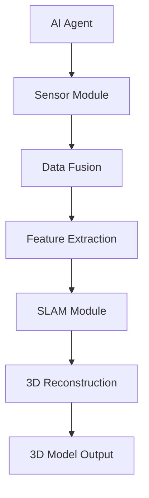

# AI Agent的3D场景重建能力实现

> 关键词：AI Agent、3D场景重建、计算机视觉、深度学习、SLAM、多传感器融合、三维建模

> 摘要：本文围绕AI Agent的3D场景重建能力实现展开深入探讨。首先介绍了相关背景知识，包括目的、预期读者、文档结构和术语表等。接着阐述了核心概念与联系，通过文本示意图和Mermaid流程图进行清晰展示。详细讲解了核心算法原理和具体操作步骤，结合Python源代码进行说明。对数学模型和公式进行了深入剖析并举例。通过项目实战给出代码实际案例和详细解释。探讨了实际应用场景，推荐了相关的工具和资源。最后总结了未来发展趋势与挑战，提供了常见问题解答和扩展阅读参考资料，旨在全面深入地阐述AI Agent实现3D场景重建能力的技术要点和方法。

## 1. 背景介绍 
### 1.1 目的和范围
随着人工智能和计算机视觉技术的不断发展，3D场景重建在诸多领域展现出了巨大的应用价值，如虚拟现实、增强现实、机器人导航、自动驾驶等。AI Agent作为具有一定智能和自主决策能力的实体，具备3D场景重建能力可以使其更好地感知和理解周围环境，从而做出更准确的决策和行动。本文的目的在于深入探讨AI Agent如何实现3D场景重建能力，涵盖了从基本概念、算法原理、数学模型到实际项目实现等多个方面的内容，旨在为相关领域的研究人员和开发者提供全面且深入的技术参考。

### 1.2 预期读者
本文预期读者包括计算机科学、人工智能、计算机视觉等相关专业的学生、研究人员，以及从事3D场景重建、机器人开发、虚拟现实等领域的开发者和工程师。对于对3D场景重建技术感兴趣，希望深入了解AI Agent如何实现这一能力的技术爱好者也具有一定的参考价值。

### 1.3 文档结构概述
本文首先介绍背景知识，包括目的、预期读者、文档结构和术语表。接着阐述核心概念与联系，通过文本示意图和流程图展示相关原理。详细讲解核心算法原理和具体操作步骤，结合Python代码说明。深入剖析数学模型和公式并举例。通过项目实战给出代码案例和详细解释。探讨实际应用场景，推荐相关工具和资源。最后总结未来发展趋势与挑战，提供常见问题解答和扩展阅读参考资料。

### 1.4 术语表
#### 1.4.1 核心术语定义
- **AI Agent（人工智能代理）**：能够感知环境、进行决策并采取行动以实现特定目标的智能实体。
- **3D场景重建**：从二维图像或其他传感器数据中恢复出三维场景的几何结构和外观信息的过程。
- **计算机视觉**：让计算机从图像或视频中获取有意义信息的领域，是3D场景重建的重要基础。
- **深度学习**：一类基于人工神经网络的机器学习方法，在3D场景重建中被广泛应用。
- **SLAM（同时定位与地图构建）**：机器人在未知环境中通过传感器数据同时确定自身位置和构建环境地图的技术。

#### 1.4.2 相关概念解释
- **多传感器融合**：将来自不同类型传感器（如相机、激光雷达等）的数据进行整合，以获取更全面、准确的环境信息。
- **三维建模**：创建三维物体或场景的数学模型的过程，是3D场景重建的最终目标之一。
- **特征提取**：从图像或其他数据中提取具有代表性的特征，用于后续的匹配和重建。

#### 1.4.3 缩略词列表
- **CNN（Convolutional Neural Network）**：卷积神经网络
- **RGB（Red, Green, Blue）**：红绿蓝，代表彩色图像的三个颜色通道
- **RGBD（Red, Green, Blue, Depth）**：包含彩色和深度信息的图像
- **SIFT（Scale-Invariant Feature Transform）**：尺度不变特征变换
- **ORB（Oriented FAST and Rotated BRIEF）**：一种快速特征点检测和描述算法

## 2. 核心概念与联系 

### 核心概念原理
AI Agent的3D场景重建涉及多个核心概念和技术，主要包括计算机视觉、深度学习、SLAM等。计算机视觉技术是3D场景重建的基础，通过对图像或视频的处理和分析，提取出场景的特征信息。深度学习则为3D场景重建提供了强大的模型和算法支持，例如卷积神经网络（CNN）可以用于图像的特征提取和深度估计。SLAM技术可以帮助AI Agent在未知环境中确定自身的位置和姿态，同时构建环境的地图。

多传感器融合也是3D场景重建中的重要概念，不同类型的传感器（如相机、激光雷达等）具有各自的优缺点，通过将它们的数据进行融合，可以获取更全面、准确的环境信息。例如，相机可以提供丰富的纹理信息，而激光雷达可以提供高精度的深度信息，将两者的数据融合可以得到更完整的3D场景模型。

### 架构的文本示意图
```plaintext
+---------------------+
|      AI Agent       |
|                     |
|  +----------------+ |
|  |  Sensor Module | |
|  | (Camera, LiDAR) | |
|  +----------------+ |
|                     |
|  +----------------+ |
|  |   Data Fusion  | |
|  +----------------+ |
|                     |
|  +----------------+ |
|  | Feature Extraction | |
|  +----------------+ |
|                     |
|  +----------------+ |
|  |    SLAM Module  | |
|  +----------------+ |
|                     |
|  +----------------+ |
|  |  3D Reconstruction | |
|  +----------------+ |
|                     |
|  +----------------+ |
|  |   3D Model Output | |
|  +----------------+ |
+---------------------+
```

### Mermaid流程图


## 3. 核心算法原理 & 具体操作步骤 

### 特征提取算法原理（以SIFT为例）
SIFT（Scale-Invariant Feature Transform）是一种经典的特征提取算法，具有尺度、旋转和光照不变性。其主要步骤包括：
1. **尺度空间极值检测**：通过高斯差分函数（Difference of Gaussians, DoG）在不同尺度空间中寻找图像的极值点，这些极值点就是可能的特征点。
2. **关键点定位**：对检测到的极值点进行精确定位，去除低对比度和边缘响应的点。
3. **方向分配**：为每个关键点分配一个或多个方向，以实现旋转不变性。
4. **关键点描述符生成**：在关键点周围的邻域内计算梯度方向直方图，生成特征描述符。

以下是使用Python和OpenCV实现SIFT特征提取的代码示例：
```python
import cv2
import numpy as np

# 读取图像
image = cv2.imread('example.jpg')
gray = cv2.cvtColor(image, cv2.COLOR_BGR2GRAY)

# 创建SIFT对象
sift = cv2.SIFT_create()

# 检测关键点和计算描述符
keypoints, descriptors = sift.detectAndCompute(gray, None)

# 在图像上绘制关键点
image_with_keypoints = cv2.drawKeypoints(image, keypoints, None, color=(0, 255, 0))

# 显示结果
cv2.imshow('Image with Keypoints', image_with_keypoints)
cv2.waitKey(0)
cv2.destroyAllWindows()
```

### 深度估计算法原理（以基于深度学习的方法为例）
基于深度学习的深度估计方法通常使用卷积神经网络（CNN）来学习图像和深度之间的映射关系。一种常见的方法是使用编码器 - 解码器结构的网络，编码器将输入图像压缩为特征表示，解码器则从特征表示中恢复出深度图。

以下是一个简单的基于PyTorch的深度估计网络示例：
```python
import torch
import torch.nn as nn

class DepthEstimationNet(nn.Module):
    def __init__(self):
        super(DepthEstimationNet, self).__init__()
        # 编码器部分
        self.encoder = nn.Sequential(
            nn.Conv2d(3, 64, kernel_size=3, stride=1, padding=1),
            nn.ReLU(inplace=True),
            nn.MaxPool2d(kernel_size=2, stride=2)
        )
        # 解码器部分
        self.decoder = nn.Sequential(
            nn.ConvTranspose2d(64, 1, kernel_size=2, stride=2),
            nn.Sigmoid()
        )

    def forward(self, x):
        x = self.encoder(x)
        x = self.decoder(x)
        return x

# 创建网络实例
net = DepthEstimationNet()

# 随机生成输入图像
input_image = torch.randn(1, 3, 256, 256)

# 前向传播
depth_map = net(input_image)
print(depth_map.shape)
```

### 具体操作步骤
1. **数据采集**：使用相机、激光雷达等传感器采集场景的图像、深度等数据。
2. **数据预处理**：对采集到的数据进行预处理，如去噪、归一化等。
3. **特征提取**：使用SIFT、ORB等算法提取图像的特征点和描述符。
4. **深度估计**：使用基于深度学习或传统方法进行深度估计。
5. **数据融合**：将不同传感器的数据进行融合，得到更全面的环境信息。
6. **SLAM处理**：通过SLAM算法确定AI Agent的位置和姿态，同时构建环境地图。
7. **3D重建**：根据融合后的数据和SLAM结果进行3D场景重建，生成3D模型。

## 4. 数学模型和公式 & 详细讲解 & 举例说明 

### 相机模型
相机模型描述了三维空间中的点如何投影到二维图像平面上。常见的相机模型有针孔相机模型，其数学公式如下：

设三维空间中的点 $P = [X, Y, Z]^T$，相机的内参矩阵为 $K$，外参矩阵为 $[R|t]$，其中 $R$ 是旋转矩阵，$t$ 是平移向量。则点 $P$ 在图像平面上的投影点 $p = [u, v]^T$ 可以通过以下公式计算：

$$
\begin{bmatrix}
u \\
v \\
1
\end{bmatrix}
\sim
K
\begin{bmatrix}
R & t
\end{bmatrix}
\begin{bmatrix}
X \\
Y \\
Z \\
1
\end{bmatrix}
$$

其中 $\sim$ 表示齐次坐标下的等价关系。

相机内参矩阵 $K$ 通常表示为：

$$
K = 
\begin{bmatrix}
f_x & 0 & c_x \\
0 & f_y & c_y \\
0 & 0 & 1
\end{bmatrix}
$$

其中 $f_x$ 和 $f_y$ 分别是相机在 $x$ 和 $y$ 方向上的焦距，$c_x$ 和 $c_y$ 是图像平面的主点坐标。

举例说明：假设相机的内参矩阵 $K = \begin{bmatrix} 1000 & 0 & 320 \\ 0 & 1000 & 240 \\ 0 & 0 & 1 \end{bmatrix}$，外参矩阵 $[R|t] = \begin{bmatrix} I & [0, 0, 1]^T \end{bmatrix}$（其中 $I$ 是单位矩阵），三维空间中的点 $P = [1, 1, 2]^T$。则点 $P$ 在图像平面上的投影点 $p$ 可以计算如下：

首先计算 $[R|t] \begin{bmatrix} X \\ Y \\ Z \\ 1 \end{bmatrix} = \begin{bmatrix} 1 \\ 1 \\ 3 \end{bmatrix}$，然后计算 $K \begin{bmatrix} 1 \\ 1 \\ 3 \end{bmatrix} = \begin{bmatrix} 1000\times1 + 0\times1 + 320\times3 \\ 0\times1 + 1000\times1 + 240\times3 \\ 0\times1 + 0\times1 + 1\times3 \end{bmatrix} = \begin{bmatrix} 1960 \\ 1720 \\ 3 \end{bmatrix}$，最后得到投影点 $p = [\frac{1960}{3}, \frac{1720}{3}]^T \approx [653.33, 573.33]^T$。

### 深度估计的损失函数
在基于深度学习的深度估计中，常用的损失函数有均方误差（Mean Squared Error, MSE）损失和绝对误差（Mean Absolute Error, MAE）损失。

均方误差损失的数学公式为：

$$
L_{MSE} = \frac{1}{N} \sum_{i=1}^{N} (d_{i}^{gt} - d_{i}^{pred})^2
$$

其中 $N$ 是像素点的数量，$d_{i}^{gt}$ 是真实深度值，$d_{i}^{pred}$ 是预测深度值。

绝对误差损失的数学公式为：

$$
L_{MAE} = \frac{1}{N} \sum_{i=1}^{N} |d_{i}^{gt} - d_{i}^{pred}|
$$

举例说明：假设真实深度图和预测深度图分别为 $d^{gt} = [1, 2, 3]$ 和 $d^{pred} = [1.1, 1.9, 3.1]$，则均方误差损失为：

$$
L_{MSE} = \frac{1}{3} ((1 - 1.1)^2 + (2 - 1.9)^2 + (3 - 3.1)^2) = \frac{1}{3} (0.01 + 0.01 + 0.01) = 0.01
$$

绝对误差损失为：

$$
L_{MAE} = \frac{1}{3} (|1 - 1.1| + |2 - 1.9| + |3 - 3.1|) = \frac{1}{3} (0.1 + 0.1 + 0.1) = 0.1
$$

## 5. 项目实战：代码实际案例和详细解释说明 

### 5.1  开发环境搭建
1. **安装Python**：建议使用Python 3.7及以上版本，可以从Python官方网站（https://www.python.org/downloads/）下载安装。
2. **安装深度学习框架**：本文使用PyTorch和OpenCV，可通过以下命令进行安装：
```bash
pip install torch torchvision
pip install opencv-python
```
3. **安装其他依赖库**：根据具体需求安装其他相关库，如NumPy、Matplotlib等。
```bash
pip install numpy matplotlib
```

### 5.2  源代码详细实现和代码解读
以下是一个简单的基于RGB-D图像的3D场景重建项目示例：

```python
import cv2
import numpy as np
import open3d as o3d

# 读取RGB和深度图像
color_image = cv2.imread('color_image.jpg')
depth_image = cv2.imread('depth_image.png', cv2.IMREAD_UNCHANGED)

# 相机内参
fx = 525.0
fy = 525.0
cx = 319.5
cy = 239.5
intrinsic = o3d.camera.PinholeCameraIntrinsic(640, 480, fx, fy, cx, cy)

# 将OpenCV图像转换为Open3D图像
color = o3d.geometry.Image(color_image)
depth = o3d.geometry.Image(depth_image)

# 创建RGBD图像
rgbd_image = o3d.geometry.RGBDImage.create_from_color_and_depth(
    color, depth, depth_scale=1000.0, depth_trunc=3.0, convert_rgb_to_intensity=False)

# 创建点云
pcd = o3d.geometry.PointCloud.create_from_rgbd_image(rgbd_image, intrinsic)

# 可视化点云
o3d.visualization.draw_geometries([pcd])
```

### 代码解读与分析
1. **图像读取**：使用OpenCV读取RGB图像和深度图像。
2. **相机内参设置**：设置相机的内参，包括焦距和主点坐标。
3. **图像转换**：将OpenCV图像转换为Open3D图像格式。
4. **RGBD图像创建**：使用Open3D的`create_from_color_and_depth`函数创建RGBD图像，同时设置深度尺度和截断距离。
5. **点云创建**：使用`create_from_rgbd_image`函数从RGBD图像和相机内参创建点云。
6. **可视化**：使用Open3D的`draw_geometries`函数可视化点云。

## 6. 实际应用场景 
### 虚拟现实和增强现实
在虚拟现实（VR）和增强现实（AR）应用中，3D场景重建可以为用户提供更加真实和沉浸式的体验。通过AI Agent的3D场景重建能力，可以实时获取周围环境的3D模型，将虚拟物体与真实场景进行融合，实现更加自然和逼真的交互效果。例如，在AR游戏中，AI Agent可以重建游戏场景，将虚拟角色和道具准确地放置在真实环境中，让玩家感受到更加身临其境的游戏体验。

### 机器人导航和自主探索
对于机器人来说，3D场景重建是实现自主导航和探索的关键技术之一。AI Agent可以通过3D场景重建获取周围环境的地图，从而规划路径、避开障碍物，实现自主移动和任务执行。例如，在仓库物流机器人中，AI Agent可以重建仓库的3D场景，准确识别货物的位置和状态，提高物流效率。

### 文化遗产保护和数字化
3D场景重建可以用于文化遗产的保护和数字化。通过AI Agent对古建筑、文物等进行3D重建，可以记录其详细的几何结构和外观信息，为文化遗产的保护、修复和研究提供重要的数据支持。例如，对故宫等古建筑进行3D重建，可以让人们更加直观地了解古建筑的历史和文化价值。

### 自动驾驶
在自动驾驶领域，3D场景重建可以帮助车辆感知周围环境，识别道路、车辆、行人等目标，为自动驾驶决策提供依据。AI Agent可以通过多个传感器（如相机、激光雷达等）的数据进行3D场景重建，实时获取道路和交通状况的信息，提高自动驾驶的安全性和可靠性。

## 7. 工具和资源推荐
### 7.1 学习资源推荐
#### 7.1.1 书籍推荐
- 《计算机视觉：算法与应用》（Richard Szeliski著）：全面介绍了计算机视觉的基本算法和应用，包括3D场景重建相关内容。
- 《深度学习》（Ian Goodfellow、Yoshua Bengio和Aaron Courville著）：深度学习领域的经典教材，对理解基于深度学习的3D场景重建方法有很大帮助。
- 《视觉SLAM十四讲：从理论到实践》（高翔、张涛等著）：详细介绍了视觉SLAM的原理和实践，是学习SLAM技术的优秀书籍。

#### 7.1.2 在线课程
- Coursera上的“Computer Vision Specialization”：由华盛顿大学的教授授课，涵盖了计算机视觉的多个方面，包括3D重建。
- edX上的“Deep Learning Specialization”：由Andrew Ng教授授课，深入介绍了深度学习的原理和应用。
- B站的“泡泡机器人SLAM学习公开课”：提供了丰富的SLAM学习资源和讲解视频。

#### 7.1.3 技术博客和网站
- OpenCV官方文档（https://docs.opencv.org/）：OpenCV是计算机视觉领域的重要库，其官方文档提供了详细的API文档和示例代码。
- PyTorch官方文档（https://pytorch.org/docs/stable/index.html）：PyTorch是深度学习领域的流行框架，其官方文档对理解和使用PyTorch进行3D场景重建有很大帮助。
- arXiv（https://arxiv.org/）：一个预印本平台，提供了大量关于3D场景重建、计算机视觉和深度学习的最新研究论文。

### 7.2 开发工具框架推荐
#### 7.2.1 IDE和编辑器
- PyCharm：一款专门为Python开发设计的集成开发环境，具有强大的代码编辑、调试和自动补全功能。
- Visual Studio Code：一款轻量级的代码编辑器，支持多种编程语言，通过安装相关插件可以方便地进行Python开发。

#### 7.2.2 调试和性能分析工具
- PySnooper：一个简单易用的Python调试工具，可以自动记录函数的调用过程和变量的值。
- TensorBoard：PyTorch和TensorFlow都支持的可视化工具，可以用于查看模型的训练过程和性能指标。

#### 7.2.3 相关框架和库
- Open3D：一个开源的3D数据处理库，提供了丰富的3D场景重建、点云处理等功能。
- Scikit-Image：一个用于图像处理的Python库，提供了多种图像处理算法和工具。
- ROS（Robot Operating System）：一个机器人开发的开源框架，提供了丰富的机器人开发工具和库，对实现AI Agent的3D场景重建和机器人导航有很大帮助。

### 7.3 相关论文著作推荐
#### 7.3.1 经典论文
- “Distinctive Image Features from Scale-Invariant Keypoints”（David G. Lowe著）：介绍了SIFT特征提取算法，是计算机视觉领域的经典论文。
- “ORB: An Efficient Alternative to SIFT or SURF”（Ethan Rublee等著）：提出了ORB特征提取算法，具有快速、高效的特点。
- “Bundle Adjustment in the Large”（Noah Snavely等著）：介绍了大规模束调整算法，在3D场景重建中具有重要应用。

#### 7.3.2 最新研究成果
- 关注CVPR（Computer Vision and Pattern Recognition）、ICCV（International Conference on Computer Vision）、ECCV（European Conference on Computer Vision）等计算机视觉领域的顶级会议，了解3D场景重建的最新研究成果。
- 关注顶级学术期刊如IEEE Transactions on Pattern Analysis and Machine Intelligence（PAMI）、International Journal of Computer Vision（IJCV）等，获取相关领域的前沿研究论文。

#### 7.3.3 应用案例分析
- 可以参考一些实际应用案例的论文和报告，如谷歌的Project Tango、苹果的ARKit等，了解3D场景重建技术在实际产品中的应用和实现方法。

## 8. 总结：未来发展趋势与挑战
### 未来发展趋势
1. **多传感器融合的深度和广度不断拓展**：未来的AI Agent将越来越多地融合多种类型的传感器数据，如相机、激光雷达、毫米波雷达等，以获取更全面、准确的环境信息，提高3D场景重建的精度和可靠性。
2. **深度学习与传统方法的结合更加紧密**：深度学习在3D场景重建中已经取得了显著的成果，但传统方法也有其独特的优势。未来，将深度学习与传统方法相结合，充分发挥两者的优势，将是3D场景重建技术的发展方向之一。
3. **实时性和高效性的提升**：随着硬件技术的不断发展和算法的优化，AI Agent的3D场景重建能力将越来越注重实时性和高效性，以满足更多实际应用场景的需求。
4. **跨领域应用的不断拓展**：3D场景重建技术将在更多领域得到应用，如医疗、教育、娱乐等，为这些领域带来新的发展机遇和变革。

### 挑战
1. **数据处理和存储的挑战**：3D场景重建需要处理大量的传感器数据，对数据的存储和处理能力提出了很高的要求。如何高效地处理和存储这些数据是一个亟待解决的问题。
2. **复杂环境下的适应性挑战**：在复杂环境下，如光照变化、遮挡、动态场景等，3D场景重建的精度和可靠性会受到很大影响。如何提高AI Agent在复杂环境下的3D场景重建能力是一个具有挑战性的问题。
3. **算法的可解释性和鲁棒性挑战**：深度学习算法在3D场景重建中取得了很好的效果，但这些算法往往缺乏可解释性，并且在某些情况下可能会出现不稳定的情况。如何提高算法的可解释性和鲁棒性是未来研究的重点之一。
4. **隐私和安全问题**：3D场景重建涉及到对环境和物体的详细信息的采集和处理，可能会涉及到隐私和安全问题。如何在保证3D场景重建效果的同时，保护用户的隐私和数据安全是一个需要重视的问题。

## 9. 附录：常见问题与解答
### 问题1：3D场景重建的精度受哪些因素影响？
答：3D场景重建的精度受多种因素影响，包括传感器的精度、数据的质量、算法的性能、环境的复杂性等。例如，相机的分辨率、激光雷达的测量精度等会直接影响数据的质量，从而影响重建的精度；光照变化、遮挡等环境因素会增加算法的难度，降低重建的精度。

### 问题2：如何选择合适的特征提取算法？
答：选择合适的特征提取算法需要考虑多个因素，如算法的复杂度、计算效率、特征的稳定性和独特性等。SIFT算法具有尺度、旋转和光照不变性，但计算复杂度较高；ORB算法则具有快速、高效的特点，适合实时应用场景。在实际应用中，需要根据具体需求和场景选择合适的特征提取算法。

### 问题3：基于深度学习的深度估计方法有哪些优点和缺点？
答：优点：基于深度学习的深度估计方法可以自动学习图像和深度之间的复杂映射关系，具有较高的精度和适应性。缺点：需要大量的训练数据和计算资源，并且缺乏可解释性，在某些情况下可能会出现过拟合等问题。

### 问题4：如何提高3D场景重建的实时性？
答：可以从以下几个方面提高3D场景重建的实时性：选择高效的算法，如使用轻量级的神经网络模型；优化算法的实现，如采用并行计算技术；使用高性能的硬件设备，如GPU加速等。

## 10. 扩展阅读 & 参考资料
### 扩展阅读
- 《3D计算机视觉：理论与算法》（Richard Hartley和Andrew Zisserman著）：深入介绍了3D计算机视觉的理论和算法，包括3D场景重建的相关内容。
- 《深度学习实战：基于Python的计算机视觉应用》（Adrian Rosebrock著）：通过实际项目案例介绍了深度学习在计算机视觉中的应用，包括3D场景重建的实践。

### 参考资料
1. OpenCV官方文档：https://docs.opencv.org/
2. PyTorch官方文档：https://pytorch.org/docs/stable/index.html
3. Open3D官方文档：http://www.open3d.org/docs/release/
4. ROS官方网站：https://www.ros.org/
5. CVPR会议论文集：https://openaccess.thecvf.com/CVPR
6. ICCV会议论文集：https://openaccess.thecvf.com/ICCV
7. ECCV会议论文集：https://eccv2022.ecva.net/