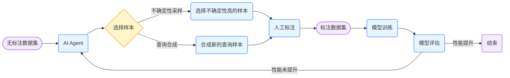

# AI Agent的主动学习策略

> 关键词：AI Agent、主动学习策略、机器学习、不确定性采样、查询合成

> 摘要：本文围绕AI Agent的主动学习策略展开深入探讨。首先介绍了AI Agent主动学习策略的背景，包括其目的、预期读者和文档结构等。接着阐述了核心概念与联系，详细说明了主动学习在AI Agent中的原理和架构。核心算法原理部分使用Python代码进行详细讲解，同时给出了相关的数学模型和公式。通过项目实战，展示了代码的实际案例并进行详细解释。还探讨了实际应用场景，推荐了学习资源、开发工具框架和相关论文著作。最后总结了未来发展趋势与挑战，并提供了常见问题解答和扩展阅读参考资料，旨在为读者全面深入地理解AI Agent的主动学习策略提供指导。

## 1. 背景介绍 
### 1.1 目的和范围
在当今的人工智能领域，数据是驱动模型发展的关键因素。然而，获取大量有标注的数据往往代价高昂且耗时费力。AI Agent的主动学习策略旨在解决这一问题，通过让AI Agent主动选择最有价值的数据进行标注，从而以较少的标注数据达到较好的模型性能。本文的范围涵盖了AI Agent主动学习策略的核心概念、算法原理、数学模型、实际应用以及相关的工具和资源推荐等方面，旨在为读者提供一个全面而深入的了解。

### 1.2 预期读者
本文预期读者包括人工智能领域的研究人员、开发者、学生以及对AI Agent主动学习策略感兴趣的技术爱好者。对于研究人员，本文可以提供最新的研究思路和方法；对于开发者，能够帮助他们在实际项目中应用主动学习策略；对于学生，有助于他们深入理解人工智能的相关理论和技术；对于技术爱好者，则可以拓宽他们在人工智能领域的知识面。

### 1.3 文档结构概述
本文将按照以下结构进行阐述：首先介绍核心概念与联系，明确主动学习在AI Agent中的原理和架构；接着讲解核心算法原理，并使用Python代码详细说明具体操作步骤；然后给出数学模型和公式，并结合实例进行详细讲解；通过项目实战展示代码的实际应用并进行解读；探讨实际应用场景；推荐相关的工具和资源；最后总结未来发展趋势与挑战，提供常见问题解答和扩展阅读参考资料。

### 1.4 术语表
#### 1.4.1 核心术语定义
- **AI Agent**：指能够感知环境、做出决策并采取行动的人工智能实体。它可以是一个软件程序、机器人等，具有一定的自主性和智能性。
- **主动学习**：是一种机器学习范式，在这种范式中，学习算法主动地从无标注的数据集中选择最有价值的数据进行标注，然后使用这些标注数据进行模型训练，以提高模型的性能。
- **不确定性采样**：主动学习中的一种采样策略，基于模型对样本的预测不确定性来选择样本。模型对某个样本的预测不确定性越高，该样本就越有可能被选中进行标注。
- **查询合成**：主动学习中的另一种策略，通过合成新的查询样本，让模型对这些样本进行预测，从而选择有价值的样本进行标注。

#### 1.4.2 相关概念解释
- **标注数据**：指带有标签或标记的数据集，标签可以是分类信息、数值信息等。标注数据是监督学习模型训练的基础。
- **无标注数据**：没有标签或标记的数据集，在主动学习中，AI Agent需要从无标注数据集中选择有价值的样本进行标注。
- **模型性能**：通常用准确率、召回率、F1值等指标来衡量模型在测试集上的表现。主动学习的目标是通过选择有价值的样本进行标注，提高模型的性能。

#### 1.4.3 缩略词列表
- **ML**：Machine Learning，机器学习
- **AL**：Active Learning，主动学习
- **SVM**：Support Vector Machine，支持向量机
- **CNN**：Convolutional Neural Network，卷积神经网络

## 2. 核心概念与联系 

### 核心概念原理
AI Agent的主动学习策略基于这样一个基本思想：在机器学习过程中，并不是所有的数据对模型的训练都具有相同的价值。主动学习允许AI Agent主动选择那些对模型性能提升最有帮助的数据进行标注，从而减少对大量标注数据的依赖。

其原理主要包括以下几个方面：
- **不确定性原理**：模型对某些样本的预测存在较大的不确定性，这些样本往往包含更多的信息，选择这些样本进行标注可以让模型学习到更多的知识，从而提高模型的性能。
- **代表性原理**：选择那些能够代表整个数据集分布的样本进行标注，有助于模型更好地学习到数据的整体特征。

### 架构示意图
下面是一个简单的AI Agent主动学习策略的架构示意图：



这个架构图展示了AI Agent主动学习的基本流程：AI Agent从无标注数据集中选择样本，通过不确定性采样或查询合成的方法确定要标注的样本，然后将这些样本交给人工进行标注，标注后的数据用于模型训练，训练后的模型进行评估，如果性能提升则结束学习过程，否则继续选择样本进行标注和训练。

## 3. 核心算法原理 & 具体操作步骤 

### 不确定性采样算法原理
不确定性采样是主动学习中最常用的一种策略，其核心思想是选择模型对其预测不确定性最高的样本进行标注。常见的不确定性采样方法有以下几种：
- **最小置信度**：选择模型预测概率最低的样本进行标注。假设模型对样本 $x$ 的预测类别概率为 $p_1, p_2, \cdots, p_n$，则选择 $\min_{i=1}^{n} p_i$ 最小的样本。
- **最小边际**：选择模型预测的前两个最大概率之差最小的样本进行标注。即选择 $\max_{i=1}^{n} p_i - \max_{j\neq i} p_j$ 最小的样本。
- **熵**：选择样本预测概率分布的熵最大的样本进行标注。样本 $x$ 的预测概率分布为 $p_1, p_2, \cdots, p_n$，则其熵为 $H(x) = -\sum_{i=1}^{n} p_i \log p_i$，选择 $H(x)$ 最大的样本。

### Python代码实现
以下是一个使用Python和Scikit-learn库实现最小置信度不确定性采样的示例代码：

```python
import numpy as np
from sklearn.datasets import make_classification
from sklearn.model_selection import train_test_split
from sklearn.svm import SVC

# 生成一个分类数据集
X, y = make_classification(n_samples=1000, n_features=20, n_informative=10, n_redundant=5, random_state=42)

# 划分训练集和测试集
X_train, X_test, y_train, y_test = train_test_split(X, y, test_size=0.2, random_state=42)

# 初始化一个小的标注数据集
n_initial = 100
X_labeled = X_train[:n_initial]
y_labeled = y_train[:n_initial]
X_unlabeled = X_train[n_initial:]

# 初始化SVM模型
model = SVC(probability=True)

# 训练模型
model.fit(X_labeled, y_labeled)

# 不确定性采样函数
def uncertainty_sampling(model, X_unlabeled):
    # 预测概率
    probabilities = model.predict_proba(X_unlabeled)
    # 计算最小置信度
    min_confidences = np.min(probabilities, axis=1)
    # 选择最小置信度最大的样本索引
    query_index = np.argmax(min_confidences)
    return query_index

# 主动学习循环
n_queries = 10
for i in range(n_queries):
    # 选择样本
    query_index = uncertainty_sampling(model, X_unlabeled)
    # 获取选择的样本
    X_new = X_unlabeled[query_index]
    y_new = y_train[n_initial + query_index]
    # 更新标注数据集
    X_labeled = np.vstack((X_labeled, X_new))
    y_labeled = np.hstack((y_labeled, y_new))
    # 移除已标注的样本
    X_unlabeled = np.delete(X_unlabeled, query_index, axis=0)
    # 重新训练模型
    model.fit(X_labeled, y_labeled)
    # 评估模型性能
    accuracy = model.score(X_test, y_test)
    print(f"Query {i+1}: Accuracy = {accuracy}")
```

### 代码解释
1. **数据生成和划分**：使用 `make_classification` 函数生成一个分类数据集，并将其划分为训练集和测试集。
2. **初始化标注数据集**：从训练集中选取一部分数据作为初始标注数据集，其余数据作为无标注数据集。
3. **模型初始化和训练**：初始化一个SVM模型，并使用初始标注数据集进行训练。
4. **不确定性采样函数**：定义一个 `uncertainty_sampling` 函数，该函数根据模型的预测概率计算最小置信度，并选择最小置信度最大的样本索引。
5. **主动学习循环**：在循环中，使用不确定性采样函数选择样本，将其添加到标注数据集中，移除无标注数据集中的该样本，然后重新训练模型并评估性能。

## 4. 数学模型和公式 & 详细讲解 & 举例说明 

### 熵的数学模型
熵是信息论中的一个重要概念，用于衡量随机变量的不确定性。在主动学习中，我们可以使用熵来衡量模型对样本预测的不确定性。

设样本 $x$ 的预测概率分布为 $p_1, p_2, \cdots, p_n$，其中 $p_i$ 表示样本 $x$ 属于第 $i$ 类的概率，且 $\sum_{i=1}^{n} p_i = 1$。则样本 $x$ 的熵定义为：

$$H(x) = -\sum_{i=1}^{n} p_i \log p_i$$

### 详细讲解
熵的值越大，表示随机变量的不确定性越高。在主动学习中，如果模型对某个样本的预测概率分布比较均匀，即各个类别的概率相近，那么该样本的熵就会比较大，说明模型对该样本的预测不确定性较高，我们可以选择该样本进行标注。

### 举例说明
假设一个二分类问题，模型对样本 $x$ 的预测概率为 $p_1 = 0.5$，$p_2 = 0.5$。则该样本的熵为：

$$H(x) = - (0.5 \log 0.5 + 0.5 \log 0.5) = - (0.5 \times (-0.693) + 0.5 \times (-0.693)) = 0.693$$

如果模型对另一个样本 $y$ 的预测概率为 $p_1 = 0.9$，$p_2 = 0.1$。则该样本的熵为：

$$H(y) = - (0.9 \log 0.9 + 0.1 \log 0.1) = - (0.9 \times (-0.105) + 0.1 \times (-2.303)) = 0.325$$

由于 $H(x) > H(y)$，说明模型对样本 $x$ 的预测不确定性更高，在主动学习中，我们更倾向于选择样本 $x$ 进行标注。

## 5. 项目实战：代码实际案例和详细解释说明 

### 5.1  开发环境搭建
- **Python环境**：建议使用Python 3.7及以上版本。可以从Python官方网站（https://www.python.org/downloads/）下载并安装。
- **依赖库安装**：本项目需要使用Scikit-learn、NumPy等库。可以使用以下命令进行安装：
```sh
pip install scikit-learn numpy
```

### 5.2  源代码详细实现和代码解读
以下是一个完整的AI Agent主动学习项目的源代码：

```python
import numpy as np
from sklearn.datasets import make_classification
from sklearn.model_selection import train_test_split
from sklearn.svm import SVC
from sklearn.metrics import accuracy_score

# 生成一个分类数据集
X, y = make_classification(n_samples=1000, n_features=20, n_informative=10, n_redundant=5, random_state=42)

# 划分训练集和测试集
X_train, X_test, y_train, y_test = train_test_split(X, y, test_size=0.2, random_state=42)

# 初始化一个小的标注数据集
n_initial = 100
X_labeled = X_train[:n_initial]
y_labeled = y_train[:n_initial]
X_unlabeled = X_train[n_initial:]

# 初始化SVM模型
model = SVC(probability=True)

# 不确定性采样函数
def uncertainty_sampling(model, X_unlabeled):
    # 预测概率
    probabilities = model.predict_proba(X_unlabeled)
    # 计算最小置信度
    min_confidences = np.min(probabilities, axis=1)
    # 选择最小置信度最大的样本索引
    query_index = np.argmax(min_confidences)
    return query_index

# 主动学习循环
n_queries = 10
accuracies = []
for i in range(n_queries):
    # 训练模型
    model.fit(X_labeled, y_labeled)
    # 预测测试集
    y_pred = model.predict(X_test)
    # 计算准确率
    accuracy = accuracy_score(y_test, y_pred)
    accuracies.append(accuracy)
    print(f"Query {i+1}: Accuracy = {accuracy}")
    # 选择样本
    query_index = uncertainty_sampling(model, X_unlabeled)
    # 获取选择的样本
    X_new = X_unlabeled[query_index]
    y_new = y_train[n_initial + query_index]
    # 更新标注数据集
    X_labeled = np.vstack((X_labeled, X_new))
    y_labeled = np.hstack((y_labeled, y_new))
    # 移除已标注的样本
    X_unlabeled = np.delete(X_unlabeled, query_index, axis=0)

# 绘制准确率曲线
import matplotlib.pyplot as plt
plt.plot(range(1, n_queries + 1), accuracies)
plt.xlabel('Number of Queries')
plt.ylabel('Accuracy')
plt.title('Active Learning Performance')
plt.show()
```

### 代码解读与分析
1. **数据生成和划分**：使用 `make_classification` 函数生成一个包含1000个样本、20个特征的分类数据集，并将其划分为训练集和测试集。
2. **初始化标注数据集**：从训练集中选取100个样本作为初始标注数据集，其余样本作为无标注数据集。
3. **模型初始化**：初始化一个SVM模型，并设置 `probability=True` 以允许模型输出预测概率。
4. **不确定性采样函数**：定义一个 `uncertainty_sampling` 函数，该函数根据模型的预测概率计算最小置信度，并选择最小置信度最大的样本索引。
5. **主动学习循环**：在循环中，首先训练模型并评估其在测试集上的准确率，然后使用不确定性采样函数选择样本，将其添加到标注数据集中，移除无标注数据集中的该样本，最后绘制准确率曲线，展示主动学习过程中模型性能的变化。

## 6. 实际应用场景 
### 医疗诊断
在医疗诊断领域，获取大量有标注的医疗数据是非常困难的，因为需要专业的医生进行标注，成本高且耗时。AI Agent的主动学习策略可以帮助选择最有价值的医疗影像数据（如X光、CT等）进行标注，从而提高疾病诊断模型的性能。例如，在肺癌诊断中，主动学习可以选择那些模型难以判断的影像数据进行标注，让模型学习到更多的特征，提高诊断的准确率。

### 自然语言处理
在自然语言处理任务中，如文本分类、情感分析等，标注大量的文本数据需要大量的人力和时间。主动学习策略可以让AI Agent选择那些语义模糊、模型预测不确定性高的文本进行标注，从而提高模型的性能。例如，在社交媒体情感分析中，主动学习可以选择那些包含讽刺、隐喻等复杂情感表达的文本进行标注，让模型更好地理解这些复杂的情感。

### 图像识别
在图像识别领域，标注大量的图像数据是一项艰巨的任务。AI Agent的主动学习策略可以选择那些模型难以识别的图像进行标注，如模糊图像、光照条件不好的图像等。例如，在自动驾驶汽车的图像识别中，主动学习可以选择那些在复杂环境下拍摄的图像进行标注，提高模型在复杂场景下的识别能力。

## 7. 工具和资源推荐
### 7.1 学习资源推荐
#### 7.1.1 书籍推荐
- 《机器学习》（周志华著）：这本书全面介绍了机器学习的基本概念、算法和应用，对主动学习也有一定的介绍，适合初学者和有一定基础的读者。
- 《深度学习》（Ian Goodfellow、Yoshua Bengio和Aaron Courville著）：深度学习是人工智能领域的热门方向，这本书深入介绍了深度学习的原理和方法，对于理解主动学习在深度学习中的应用有很大帮助。

#### 7.1.2 在线课程
- Coursera上的“机器学习”课程（Andrew Ng教授主讲）：这是一门非常经典的机器学习课程，涵盖了机器学习的基本概念、算法和应用，对主动学习也有一定的讲解。
- edX上的“深度学习基础”课程：该课程由微软提供，深入介绍了深度学习的原理和实践，对于学习主动学习在深度学习中的应用有很大帮助。

#### 7.1.3 技术博客和网站
- Medium：Medium上有很多关于人工智能和机器学习的技术博客，其中不乏关于主动学习的文章，可以帮助读者了解最新的研究成果和应用案例。
- arXiv：arXiv是一个开放的预印本平台，上面有很多关于主动学习的研究论文，可以帮助读者深入了解主动学习的理论和算法。

### 7.2 开发工具框架推荐
#### 7.2.1 IDE和编辑器
- PyCharm：是一款专门为Python开发设计的集成开发环境，具有代码自动补全、调试、版本控制等功能，非常适合开发AI Agent主动学习项目。
- Jupyter Notebook：是一个交互式的开发环境，可以将代码、文本、图表等内容整合在一起，方便进行数据分析和模型训练，也适用于主动学习项目的开发。

#### 7.2.2 调试和性能分析工具
- TensorBoard：是TensorFlow提供的一个可视化工具，可以用于可视化模型的训练过程、性能指标等，帮助开发者调试和优化模型。
- Scikit-learn的模型评估工具：Scikit-learn提供了丰富的模型评估工具，如准确率、召回率、F1值等，可以帮助开发者评估主动学习模型的性能。

#### 7.2.3 相关框架和库
- Scikit-learn：是一个开源的机器学习库，提供了丰富的机器学习算法和工具，包括分类、回归、聚类等算法，也支持主动学习。
- PyTorch：是一个开源的深度学习框架，具有动态计算图、自动求导等功能，适用于开发深度学习模型，也可以用于实现主动学习策略。

### 7.3 相关论文著作推荐
#### 7.3.1 经典论文
- “Active Learning Literature Survey”（Burr Settles著）：这是一篇关于主动学习的综述论文，全面介绍了主动学习的基本概念、算法和应用，是主动学习领域的经典文献。
- “Query by Committee”（Yoav Freund等著）：该论文提出了一种基于委员会查询的主动学习算法，是主动学习领域的重要研究成果之一。

#### 7.3.2 最新研究成果
- 在arXiv和顶级学术会议（如NeurIPS、ICML等）上可以找到关于主动学习的最新研究成果，这些研究成果通常涉及到新的算法、应用场景和理论分析。

#### 7.3.3 应用案例分析
- 一些学术期刊和会议论文集中会有关于主动学习在实际应用中的案例分析，如医疗诊断、自然语言处理等领域的应用案例，可以帮助读者了解主动学习在实际项目中的应用方法和效果。

## 8. 总结：未来发展趋势与挑战
### 未来发展趋势
- **与深度学习的结合**：随着深度学习的发展，主动学习与深度学习的结合将成为未来的一个重要趋势。深度学习模型通常需要大量的标注数据，而主动学习可以帮助选择最有价值的数据进行标注，从而提高深度学习模型的性能。
- **多模态主动学习**：未来的主动学习将不仅仅局限于单一模态的数据，如文本、图像等，而是会涉及到多模态数据的处理，如文本和图像的联合处理。多模态主动学习可以利用不同模态数据之间的互补信息，提高模型的性能。
- **强化学习与主动学习的融合**：强化学习可以让AI Agent在环境中进行自主探索和学习，而主动学习可以帮助选择有价值的数据进行标注。将强化学习与主动学习融合，可以让AI Agent更加智能地选择数据，提高学习效率。

### 挑战
- **样本选择策略的优化**：目前的主动学习样本选择策略还存在一些问题，如容易陷入局部最优、对数据分布的适应性不够等。未来需要进一步优化样本选择策略，提高主动学习的性能。
- **标注成本的降低**：虽然主动学习可以减少标注数据的数量，但标注仍然是一个成本较高的过程。未来需要探索如何降低标注成本，如使用半监督学习、弱监督学习等方法。
- **模型的可解释性**：随着AI Agent的主动学习策略越来越复杂，模型的可解释性变得越来越重要。未来需要研究如何提高主动学习模型的可解释性，让用户更好地理解模型的决策过程。

## 9. 附录：常见问题与解答
### 主动学习与传统机器学习有什么区别？
传统机器学习通常使用大量的标注数据进行模型训练，而主动学习则是让AI Agent主动选择最有价值的数据进行标注，以较少的标注数据达到较好的模型性能。主动学习可以减少标注数据的数量，降低标注成本。

### 主动学习一定能提高模型的性能吗？
不一定。主动学习的效果取决于多种因素，如样本选择策略、数据分布、模型类型等。如果样本选择策略不合理，可能会导致选择的样本对模型性能提升没有帮助，甚至会降低模型的性能。

### 如何选择合适的主动学习样本选择策略？
选择合适的主动学习样本选择策略需要考虑数据的特点、模型的类型和任务的需求等因素。一般来说，不确定性采样是一种常用的策略，但在某些情况下，查询合成或其他策略可能更合适。可以通过实验比较不同策略的性能，选择最适合的策略。

## 10. 扩展阅读 & 参考资料
- Settles, Burr. "Active learning literature survey." University of Wisconsin-Madison Department of Computer Sciences 52.55-66 (2009).
- Freund, Yoav, et al. "Query by committee." Proceedings of the fifth annual workshop on Computational learning theory. 1992.
- Goodfellow, Ian, Yoshua Bengio, and Aaron Courville. Deep learning. MIT press, 2016.
- Zhou, Zhihua. Machine learning. Tsinghua University Press, 2016.