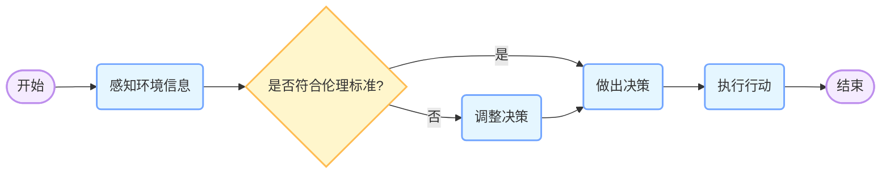

# AI Agent的伦理设计：原则与实践

> 关键词：AI Agent、伦理设计、原则、实践、人工智能伦理

> 摘要：本文围绕AI Agent的伦理设计展开，深入探讨其原则与实践。首先介绍了相关背景，包括目的、预期读者等内容。接着阐述了AI Agent及伦理设计的核心概念与联系，详细讲解了核心算法原理及操作步骤，并通过数学模型和公式进行理论支持。在项目实战部分，给出代码实际案例及详细解读。分析了AI Agent伦理设计在不同场景的实际应用，推荐了学习资源、开发工具框架以及相关论文著作。最后总结了未来发展趋势与挑战，解答常见问题并提供扩展阅读与参考资料，旨在为AI Agent的伦理设计提供全面且深入的指导。

## 1. 背景介绍 
### 1.1 目的和范围
随着人工智能技术的飞速发展，AI Agent在各个领域的应用日益广泛。AI Agent是指能够感知环境、做出决策并执行行动的智能实体，如智能客服、自动驾驶汽车等。然而，AI Agent的广泛应用也带来了一系列伦理问题，如隐私侵犯、偏见与歧视、责任归属等。本文章的目的在于探讨AI Agent伦理设计的原则与实践，为开发者、研究者和决策者提供指导，以确保AI Agent的开发和应用符合伦理标准。
本文的范围涵盖了AI Agent伦理设计的各个方面，包括核心概念、算法原理、数学模型、项目实践、应用场景等。通过对这些方面的深入研究，我们试图建立一个全面的AI Agent伦理设计框架。

### 1.2 预期读者
本文的预期读者包括人工智能领域的开发者、研究者、伦理学家、政策制定者以及对AI Agent伦理问题感兴趣的普通读者。对于开发者和研究者来说，本文可以为他们在AI Agent的设计和开发过程中提供伦理指导；对于伦理学家和政策制定者来说，本文可以为他们制定相关伦理准则和政策提供参考；对于普通读者来说，本文可以帮助他们了解AI Agent伦理问题的重要性和复杂性。

### 1.3 文档结构概述
本文将按照以下结构进行组织：
- 核心概念与联系：介绍AI Agent和伦理设计的核心概念，以及它们之间的联系。
- 核心算法原理 & 具体操作步骤：讲解AI Agent伦理设计的核心算法原理，并给出具体的操作步骤。
- 数学模型和公式 & 详细讲解 & 举例说明：建立AI Agent伦理设计的数学模型，给出相关公式，并通过具体例子进行说明。
- 项目实战：代码实际案例和详细解释说明：通过一个实际的项目案例，展示AI Agent伦理设计的具体实现过程。
- 实际应用场景：分析AI Agent伦理设计在不同场景下的应用。
- 工具和资源推荐：推荐一些学习资源、开发工具框架和相关论文著作。
- 总结：未来发展趋势与挑战：总结AI Agent伦理设计的未来发展趋势和面临的挑战。
- 附录：常见问题与解答：解答一些常见的问题。
- 扩展阅读 & 参考资料：提供一些扩展阅读的资料和参考文献。

### 1.4 术语表
#### 1.4.1 核心术语定义
- **AI Agent**：能够感知环境、做出决策并执行行动的智能实体。
- **伦理设计**：在AI Agent的设计和开发过程中，考虑伦理因素，确保其行为符合伦理标准。
- **公平性**：AI Agent的决策和行为不应该基于种族、性别、年龄等敏感因素产生偏见。
- **透明度**：AI Agent的决策过程应该是可解释的，用户能够理解其决策的依据。
- **责任归属**：当AI Agent的行为导致不良后果时，应该明确责任的归属。

#### 1.4.2 相关概念解释
- **人工智能伦理**：研究人工智能技术的开发和应用中涉及的伦理问题，如隐私、公平、责任等。
- **机器学习**：一种让计算机通过数据学习模式和规律的技术，是AI Agent的重要实现方式之一。
- **深度学习**：一种基于神经网络的机器学习技术，在图像识别、自然语言处理等领域取得了显著成果。

#### 1.4.3 缩略词列表
- **AI**：Artificial Intelligence，人工智能
- **ML**：Machine Learning，机器学习
- **DL**：Deep Learning，深度学习

## 2. 核心概念与联系 

### 2.1 AI Agent的核心概念
AI Agent是一个能够自主感知环境、处理信息、做出决策并执行行动的智能实体。它通常由感知模块、决策模块和执行模块组成。感知模块负责收集环境信息，决策模块根据感知到的信息进行分析和决策，执行模块则根据决策结果采取相应的行动。

从架构上看，AI Agent可以分为反应式Agent、基于模型的Agent、基于目标的Agent和基于效用的Agent等不同类型。反应式Agent根据当前的感知信息直接做出反应，不考虑历史信息和未来目标；基于模型的Agent则会维护一个环境模型，根据模型进行决策；基于目标的Agent会设定一些目标，并通过行动来实现这些目标；基于效用的Agent则会在决策时考虑不同行动的效用，选择效用最大的行动。

下面是一个简单的AI Agent架构的文本示意图：

```plaintext
+----------------+
|  感知模块       |
|  (收集环境信息) |
+----------------+
       |
       v
+----------------+
|  决策模块       |
|  (分析信息并决策) |
+----------------+
       |
       v
+----------------+
|  执行模块       |
|  (执行决策行动) |
+----------------+
```

### 2.2 伦理设计的核心概念
伦理设计是指在AI Agent的设计和开发过程中，考虑伦理因素，确保其行为符合伦理标准。伦理设计的目标是避免AI Agent带来的负面社会影响，如隐私侵犯、偏见与歧视、责任归属不明确等问题。

伦理设计的核心原则包括公平性、透明度、可解释性、责任性等。公平性要求AI Agent的决策和行为不应该基于种族、性别、年龄等敏感因素产生偏见；透明度要求AI Agent的决策过程是可解释的，用户能够理解其决策的依据；可解释性则是透明度的进一步要求，不仅要让用户知道决策结果，还要让用户理解决策是如何做出的；责任性要求当AI Agent的行为导致不良后果时，能够明确责任的归属。

### 2.3 AI Agent与伦理设计的联系
AI Agent的广泛应用使得伦理设计变得尤为重要。如果AI Agent的设计和开发不考虑伦理因素，可能会导致严重的社会问题。例如，一个用于招聘的AI Agent如果在决策过程中存在性别偏见，可能会导致女性求职者受到不公平的待遇；一个自动驾驶汽车的AI Agent如果在发生事故时责任归属不明确，可能会引发法律纠纷。

因此，在AI Agent的设计和开发过程中，必须将伦理设计融入其中。通过合理的算法设计、数据选择和模型评估等手段，确保AI Agent的行为符合伦理标准。同时，伦理设计也可以提高AI Agent的可信度和可接受性，促进其在各个领域的更广泛应用。

### 2.4 Mermaid流程图


这个流程图展示了AI Agent在决策过程中如何考虑伦理因素。首先，AI Agent感知环境信息，然后判断当前的决策是否符合伦理标准。如果符合，则直接做出决策并执行行动；如果不符合，则调整决策，直到符合伦理标准为止。

## 3. 核心算法原理 & 具体操作步骤 

### 3.1 核心算法原理

在AI Agent的伦理设计中，一个重要的算法原理是公平性算法。公平性算法的目标是确保AI Agent的决策不基于敏感因素（如种族、性别等）产生偏见。这里我们以一个简单的线性分类器为例，介绍公平性算法的原理。

假设我们有一个数据集 $D = \{(x_1, y_1), (x_2, y_2), \cdots, (x_n, y_n)\}$，其中 $x_i$ 是输入特征向量，$y_i$ 是对应的标签。我们的目标是训练一个线性分类器 $f(x) = w^T x + b$，使得分类错误率最小。

然而，在传统的训练过程中，可能会因为数据集中存在的偏差而导致分类器产生偏见。为了避免这种情况，我们可以引入公平性约束。一种常见的公平性约束是人口均等（Demographic Parity），即要求对于不同的敏感群体，分类器的预测结果的分布应该相同。

具体来说，假设我们有一个敏感特征 $s$，它可以取 $k$ 个不同的值 $s_1, s_2, \cdots, s_k$。人口均等要求对于每个 $s_j$，分类器预测为正类的概率应该相等，即：

$$P(\hat{y} = 1 | s = s_j) = P(\hat{y} = 1), \quad j = 1, 2, \cdots, k$$

其中 $\hat{y}$ 是分类器的预测结果。

为了实现这个约束，我们可以在损失函数中加入一个惩罚项。假设我们使用的是交叉熵损失函数 $L(w, b)$，那么加入公平性惩罚项后的损失函数可以表示为：

$$L'(w, b) = L(w, b) + \lambda \sum_{j = 1}^{k} \left|P(\hat{y} = 1 | s = s_j) - P(\hat{y} = 1)\right|$$

其中 $\lambda$ 是一个超参数，用于控制公平性惩罚项的权重。

### 3.2 Python源代码实现

下面是一个使用Python和Scikit-learn库实现的简单示例代码：

```python
import numpy as np
from sklearn.linear_model import LogisticRegression
from sklearn.metrics import accuracy_score

# 生成一些示例数据
np.random.seed(42)
n_samples = 1000
n_features = 10
X = np.random.randn(n_samples, n_features)
y = np.random.randint(0, 2, n_samples)
# 假设第0个特征是敏感特征
s = np.random.randint(0, 2, n_samples)

# 定义一个函数来计算人口均等差异
def demographic_parity_difference(model, X, s):
    y_pred = model.predict(X)
    p_y1 = np.mean(y_pred)
    p_y1_s0 = np.mean(y_pred[s == 0])
    p_y1_s1 = np.mean(y_pred[s == 1])
    return np.abs(p_y1_s0 - p_y1) + np.abs(p_y1_s1 - p_y1)

# 传统的逻辑回归模型
model = LogisticRegression()
model.fit(X, y)
y_pred = model.predict(X)
accuracy = accuracy_score(y, y_pred)
dp_diff = demographic_parity_difference(model, X, s)
print(f"传统模型 - 准确率: {accuracy}, 人口均等差异: {dp_diff}")

# 加入公平性约束的逻辑回归模型
lambda_ = 0.1
n_iter = 100
w = np.random.randn(n_features)
b = 0
learning_rate = 0.01

for _ in range(n_iter):
    # 计算预测值
    z = np.dot(X, w) + b
    y_pred_proba = 1 / (1 + np.exp(-z))
    y_pred = (y_pred_proba > 0.5).astype(int)
    
    # 计算交叉熵损失
    loss = -np.mean(y * np.log(y_pred_proba) + (1 - y) * np.log(1 - y_pred_proba))
    
    # 计算公平性惩罚项
    p_y1 = np.mean(y_pred)
    p_y1_s0 = np.mean(y_pred[s == 0])
    p_y1_s1 = np.mean(y_pred[s == 1])
    dp_penalty = lambda_ * (np.abs(p_y1_s0 - p_y1) + np.abs(p_y1_s1 - p_y1))
    
    # 计算总损失
    total_loss = loss + dp_penalty
    
    # 计算梯度
    grad_w = np.dot(X.T, (y_pred_proba - y)) / n_samples
    grad_b = np.mean(y_pred_proba - y)
    
    # 更新参数
    w = w - learning_rate * grad_w
    b = b - learning_rate * grad_b

# 创建一个新的模型对象并设置参数
fair_model = LogisticRegression()
fair_model.coef_ = np.array([w])
fair_model.intercept_ = np.array([b])
y_pred_fair = fair_model.predict(X)
accuracy_fair = accuracy_score(y, y_pred_fair)
dp_diff_fair = demographic_parity_difference(fair_model, X, s)
print(f"公平模型 - 准确率: {accuracy_fair}, 人口均等差异: {dp_diff_fair}")
```

### 3.3 具体操作步骤

#### 3.3.1 数据准备
首先，我们需要准备好数据集。数据集应该包含输入特征、标签和敏感特征。在上述代码中，我们使用 `np.random` 生成了一些示例数据。在实际应用中，你需要根据具体问题选择合适的数据集。

#### 3.3.2 定义公平性度量
选择合适的公平性度量，如人口均等差异。在代码中，我们定义了 `demographic_parity_difference` 函数来计算人口均等差异。

#### 3.3.3 训练传统模型
使用传统的机器学习算法（如逻辑回归）训练一个模型，并计算其准确率和公平性度量。

#### 3.3.4 加入公平性约束
在损失函数中加入公平性惩罚项，并使用梯度下降等优化算法更新模型参数。

#### 3.3.5 评估公平模型
训练完公平模型后，计算其准确率和公平性度量，并与传统模型进行比较。

通过以上步骤，我们可以在AI Agent的设计中引入公平性约束，确保其决策更加公平。

## 4. 数学模型和公式 & 详细讲解 & 举例说明 

### 4.1 公平性数学模型

#### 4.1.1 人口均等（Demographic Parity）
人口均等要求对于不同的敏感群体，分类器预测为正类的概率应该相等。设 $S$ 为敏感特征，$Y$ 为真实标签，$\hat{Y}$ 为预测标签。则人口均等可以表示为：

$$P(\hat{Y} = 1 | S = s) = P(\hat{Y} = 1), \quad \forall s \in \mathcal{S}$$

其中 $\mathcal{S}$ 是敏感特征 $S$ 的取值集合。

为了在训练过程中实现人口均等，我们可以引入一个惩罚项。假设我们使用的是交叉熵损失函数 $L(\theta)$，其中 $\theta$ 是模型的参数。加入人口均等惩罚项后的损失函数可以表示为：

$$L'(\theta) = L(\theta) + \lambda \sum_{s \in \mathcal{S}} \left|P(\hat{Y} = 1 | S = s) - P(\hat{Y} = 1)\right|$$

其中 $\lambda$ 是一个超参数，用于控制公平性惩罚项的权重。

#### 4.1.2 平等机会（Equal Opportunity）
平等机会要求对于不同的敏感群体，在真实标签为正类的情况下，分类器预测为正类的概率应该相等。即：

$$P(\hat{Y} = 1 | S = s, Y = 1) = P(\hat{Y} = 1 | Y = 1), \quad \forall s \in \mathcal{S}$$

同样，我们可以在损失函数中加入平等机会惩罚项：

$$L''(\theta) = L(\theta) + \mu \sum_{s \in \mathcal{S}} \left|P(\hat{Y} = 1 | S = s, Y = 1) - P(\hat{Y} = 1 | Y = 1)\right|$$

其中 $\mu$ 是控制平等机会惩罚项权重的超参数。

### 4.2 透明度和可解释性数学模型

#### 4.2.1 局部可解释性模型
局部可解释性模型的目标是解释模型在某个特定输入点的决策。一种常见的方法是使用局部线性近似。设 $f(x)$ 是一个复杂的模型，我们可以在输入点 $x_0$ 附近用一个线性模型 $g(x) = w^T (x - x_0) + f(x_0)$ 来近似 $f(x)$。

为了找到合适的 $w$，我们可以最小化以下损失函数：

$$\min_w \sum_{i = 1}^{n} \pi(x_i) (f(x_i) - g(x_i))^2$$

其中 $\pi(x_i)$ 是一个权重函数，用于衡量输入点 $x_i$ 与 $x_0$ 的距离。通常，$\pi(x_i)$ 可以定义为：

$$\pi(x_i) = \exp\left(-\frac{\|x_i - x_0\|^2}{2\sigma^2}\right)$$

其中 $\sigma$ 是一个超参数，控制局部性的范围。

#### 4.2.2 全局可解释性模型
全局可解释性模型的目标是提供一个对整个模型的解释。一种常见的方法是使用特征重要性。设 $X = [x_1, x_2, \cdots, x_d]$ 是输入特征矩阵，$y$ 是标签向量。我们可以通过计算每个特征对模型输出的影响来评估其重要性。

例如，在决策树模型中，我们可以使用基尼不纯度（Gini impurity）来计算特征的重要性。设 $I(t)$ 是节点 $t$ 的基尼不纯度，$N$ 是节点 $t$ 的样本数，$N_{left}$ 和 $N_{right}$ 分别是节点 $t$ 的左子节点和右子节点的样本数。则特征 $j$ 在节点 $t$ 的重要性可以表示为：

$$imp_j(t) = \frac{N}{N_{total}} \left[I(t) - \frac{N_{left}}{N} I(t_{left}) - \frac{N_{right}}{N} I(t_{right})\right]$$

其中 $N_{total}$ 是整个数据集的样本数。

### 4.3 举例说明

#### 4.3.1 公平性举例
假设我们有一个银行贷款审批的AI Agent，它根据申请人的收入、信用记录等特征来决定是否批准贷款。敏感特征是申请人的性别。我们希望确保该AI Agent在审批贷款时不会因为性别而产生偏见。

我们可以使用人口均等来评估公平性。假设男性申请人的批准率为 $P(\hat{Y} = 1 | S = male) = 0.6$，女性申请人的批准率为 $P(\hat{Y} = 1 | S = female) = 0.4$，而总体批准率为 $P(\hat{Y} = 1) = 0.5$。则人口均等差异为：

$$\left|P(\hat{Y} = 1 | S = male) - P(\hat{Y} = 1)\right| + \left|P(\hat{Y} = 1 | S = female) - P(\hat{Y} = 1)\right| = |0.6 - 0.5| + |0.4 - 0.5| = 0.2$$

如果我们在训练模型时加入人口均等惩罚项，调整模型参数，使得男性和女性申请人的批准率更加接近总体批准率，就可以提高模型的公平性。

#### 4.3.2 透明度和可解释性举例
假设我们有一个图像分类模型，用于识别猫和狗的图片。我们可以使用局部可解释性模型来解释模型对某一张图片的分类决策。

例如，对于一张猫的图片，我们可以在该图片附近找到一些相似的图片，并训练一个局部线性模型。通过分析局部线性模型的权重，我们可以了解哪些像素区域对模型的分类决策影响最大。如果某些像素区域的权重较大，说明这些区域在模型的分类决策中起到了重要作用。

同样，我们可以使用全局可解释性模型来评估整个模型的特征重要性。在图像分类模型中，我们可以通过计算每个像素的重要性，了解哪些像素区域对模型的整体性能影响最大。

## 5. 项目实战：代码实际案例和详细解释说明 

### 5.1 开发环境搭建

#### 5.1.1 安装Python
首先，确保你已经安装了Python。建议使用Python 3.7及以上版本。你可以从Python官方网站（https://www.python.org/downloads/）下载并安装Python。

#### 5.1.2 安装必要的库
在本项目中，我们将使用以下Python库：
- `numpy`：用于数值计算。
- `pandas`：用于数据处理和分析。
- `scikit-learn`：用于机器学习算法。
- `matplotlib`：用于数据可视化。

你可以使用以下命令来安装这些库：

```sh
pip install numpy pandas scikit-learn matplotlib
```

#### 5.1.3 下载数据集
我们将使用一个简单的贷款审批数据集作为示例。你可以从相关的数据仓库（如Kaggle）下载该数据集，或者使用以下代码生成一些示例数据：

```python
import numpy as np
import pandas as pd

# 生成示例数据
np.random.seed(42)
n_samples = 1000
income = np.random.randint(20000, 100000, n_samples)
credit_score = np.random.randint(300, 850, n_samples)
gender = np.random.randint(0, 2, n_samples)  # 0: female, 1: male
loan_approved = (income > 50000) & (credit_score > 600)

data = {
    'income': income,
    'credit_score': credit_score,
    'gender': gender,
    'loan_approved': loan_approved.astype(int)
}

df = pd.DataFrame(data)
df.to_csv('loan_data.csv', index=False)
```

### 5.2 源代码详细实现和代码解读

```python
import numpy as np
import pandas as pd
from sklearn.model_selection import train_test_split
from sklearn.linear_model import LogisticRegression
from sklearn.metrics import accuracy_score

# 读取数据
data = pd.read_csv('loan_data.csv')

# 分离特征和标签
X = data.drop('loan_approved', axis=1)
y = data['loan_approved']

# 分离敏感特征
s = X['gender']
X = X.drop('gender', axis=1)

# 划分训练集和测试集
X_train, X_test, y_train, y_test, s_train, s_test = train_test_split(X, y, s, test_size=0.2, random_state=42)

# 定义一个函数来计算人口均等差异
def demographic_parity_difference(model, X, s):
    y_pred = model.predict(X)
    p_y1 = np.mean(y_pred)
    p_y1_s0 = np.mean(y_pred[s == 0])
    p_y1_s1 = np.mean(y_pred[s == 1])
    return np.abs(p_y1_s0 - p_y1) + np.abs(p_y1_s1 - p_y1)

# 传统的逻辑回归模型
model = LogisticRegression()
model.fit(X_train, y_train)
y_pred = model.predict(X_test)
accuracy = accuracy_score(y_test, y_pred)
dp_diff = demographic_parity_difference(model, X_test, s_test)
print(f"传统模型 - 准确率: {accuracy}, 人口均等差异: {dp_diff}")

# 加入公平性约束的逻辑回归模型
lambda_ = 0.1
n_iter = 100
w = np.random.randn(X_train.shape[1])
b = 0
learning_rate = 0.01

for _ in range(n_iter):
    # 计算预测值
    z = np.dot(X_train, w) + b
    y_pred_proba = 1 / (1 + np.exp(-z))
    y_pred = (y_pred_proba > 0.5).astype(int)
    
    # 计算交叉熵损失
    loss = -np.mean(y_train * np.log(y_pred_proba) + (1 - y_train) * np.log(1 - y_pred_proba))
    
    # 计算公平性惩罚项
    p_y1 = np.mean(y_pred)
    p_y1_s0 = np.mean(y_pred[s_train == 0])
    p_y1_s1 = np.mean(y_pred[s_train == 1])
    dp_penalty = lambda_ * (np.abs(p_y1_s0 - p_y1) + np.abs(p_y1_s1 - p_y1))
    
    # 计算总损失
    total_loss = loss + dp_penalty
    
    # 计算梯度
    grad_w = np.dot(X_train.T, (y_pred_proba - y_train)) / X_train.shape[0]
    grad_b = np.mean(y_pred_proba - y_train)
    
    # 更新参数
    w = w - learning_rate * grad_w
    b = b - learning_rate * grad_b

# 创建一个新的模型对象并设置参数
fair_model = LogisticRegression()
fair_model.coef_ = np.array([w])
fair_model.intercept_ = np.array([b])
y_pred_fair = fair_model.predict(X_test)
accuracy_fair = accuracy_score(y_test, y_pred_fair)
dp_diff_fair = demographic_parity_difference(fair_model, X_test, s_test)
print(f"公平模型 - 准确率: {accuracy_fair}, 人口均等差异: {dp_diff_fair}")
```

### 5.3 代码解读与分析

#### 5.3.1 数据读取和预处理
- 使用 `pandas` 库的 `read_csv` 函数读取贷款审批数据集。
- 分离特征和标签，将 `loan_approved` 列作为标签，其余列作为特征。
- 分离敏感特征 `gender`，并将其从特征矩阵中移除。
- 使用 `train_test_split` 函数将数据集划分为训练集和测试集。

#### 5.3.2 传统模型训练和评估
- 使用 `LogisticRegression` 类创建一个传统的逻辑回归模型。
- 使用训练集对模型进行训练。
- 使用测试集对模型进行预测，并计算准确率和人口均等差异。

#### 5.3.3 公平模型训练和评估
- 定义一个公平性惩罚项，使用人口均等差异作为公平性度量。
- 在损失函数中加入公平性惩罚项，并使用梯度下降算法更新模型参数。
- 创建一个新的逻辑回归模型对象，并设置训练好的参数。
- 使用测试集对公平模型进行预测，并计算准确率和人口均等差异。

#### 5.3.4 结果分析
通过比较传统模型和公平模型的准确率和人口均等差异，我们可以评估公平性约束对模型性能的影响。通常情况下，加入公平性约束可能会导致准确率略有下降，但可以显著提高模型的公平性。

## 6. 实际应用场景 

### 6.1 金融领域
在金融领域，AI Agent被广泛应用于贷款审批、信用评估、投资决策等方面。然而，这些应用可能会因为数据偏差或算法缺陷而产生不公平的结果。例如，在贷款审批中，如果AI Agent基于历史数据学习到某些群体（如女性或少数族裔）的违约率较高，可能会在审批过程中对这些群体产生歧视。

为了避免这种情况，金融机构可以在AI Agent的设计中引入公平性约束，确保贷款审批过程对不同群体是公平的。同时，提高模型的透明度和可解释性，让申请人能够理解贷款审批的决策依据。

### 6.2 医疗领域
在医疗领域，AI Agent可以用于疾病诊断、治疗方案推荐等方面。然而，医疗数据可能存在偏差，例如某些疾病在不同性别、种族群体中的发病率和症状表现可能不同。如果AI Agent不考虑这些差异，可能会导致诊断和治疗的不公平。

为了确保医疗AI Agent的公平性，开发者可以在数据收集和预处理阶段尽量减少偏差，同时在模型训练过程中加入公平性约束。此外，提高模型的可解释性也非常重要，医生和患者需要了解AI Agent的诊断和推荐是如何做出的。

### 6.3 交通领域
在交通领域，自动驾驶汽车是AI Agent的一个典型应用。自动驾驶汽车的决策直接关系到乘客和行人的安全。因此，确保自动驾驶汽车的决策符合伦理标准至关重要。

例如，在遇到紧急情况时，自动驾驶汽车应该如何做出决策？是优先保护乘客还是行人？这就需要在AI Agent的设计中考虑伦理原则，如功利主义、义务论等。同时，提高自动驾驶汽车的透明度和可解释性，让公众能够理解其决策过程，增强公众对自动驾驶技术的信任。

### 6.4 教育领域
在教育领域，AI Agent可以用于个性化学习、智能辅导等方面。然而，教育数据也可能存在偏差，例如不同地区、不同社会经济背景的学生在学习资源和成绩表现上可能存在差异。如果AI Agent不考虑这些差异，可能会导致教育机会的不公平。

为了确保教育AI Agent的公平性，教育机构可以在数据收集和分析过程中关注不同群体的需求，同时在模型训练过程中加入公平性约束。此外，提高模型的可解释性，让教师和学生能够理解AI Agent的推荐和评价是如何做出的。

## 7. 工具和资源推荐
### 7.1 学习资源推荐
#### 7.1.1 书籍推荐
- 《人工智能伦理》：本书全面介绍了人工智能伦理的各个方面，包括隐私、公平、责任等问题，适合对人工智能伦理感兴趣的读者阅读。
- 《机器学习》：这是一本经典的机器学习教材，详细介绍了机器学习的基本算法和原理，对于理解AI Agent的技术基础非常有帮助。
- 《深度学习》：由深度学习领域的三位领军人物撰写，系统地介绍了深度学习的理论和实践，是深度学习领域的权威著作。

#### 7.1.2 在线课程
- Coursera上的“人工智能伦理”课程：由知名教授授课，深入探讨人工智能伦理的前沿问题。
- edX上的“机器学习基础”课程：提供了机器学习的基础知识和实践经验，适合初学者学习。
- Udemy上的“深度学习实战”课程：通过实际项目，帮助学员掌握深度学习的应用技能。

#### 7.1.3 技术博客和网站
- Medium上的人工智能伦理专栏：汇集了众多专家和学者的文章，讨论人工智能伦理的最新研究成果和实践经验。
- arXiv.org：一个免费的学术预印本服务器，提供了大量关于人工智能伦理的研究论文。
- AI Ethics Institute网站：专注于人工智能伦理的研究和推广，提供了丰富的资源和案例。

### 7.2 开发工具框架推荐
#### 7.2.1 IDE和编辑器
- PyCharm：一款专业的Python集成开发环境，提供了丰富的功能和插件，适合开发AI Agent项目。
- Jupyter Notebook：一个交互式的开发环境，方便进行数据探索、模型训练和可视化，是数据科学和人工智能领域常用的工具。
- Visual Studio Code：一款轻量级的代码编辑器，支持多种编程语言和插件，可用于快速开发和调试AI Agent代码。

#### 7.2.2 调试和性能分析工具
- TensorBoard：TensorFlow的可视化工具，可用于监控模型训练过程、查看模型结构和性能指标。
- PyTorch Profiler：PyTorch的性能分析工具，帮助开发者找出代码中的性能瓶颈，优化模型训练和推理速度。
- Scikit-learn的交叉验证工具：用于评估模型的性能和稳定性，选择最佳的模型参数。

#### 7.2.3 相关框架和库
- TensorFlow：一个开源的机器学习框架，提供了丰富的工具和库，可用于构建和训练各种AI Agent模型。
- PyTorch：另一个流行的深度学习框架，具有动态图和易于使用的特点，适合快速开发和实验。
- Scikit-learn：一个简单易用的机器学习库，提供了各种机器学习算法和工具，可用于数据预处理、模型选择和评估。

### 7.3 相关论文著作推荐
#### 7.3.1 经典论文
- "Fairness in Machine Learning"：这篇论文对机器学习中的公平性问题进行了系统的研究，提出了多种公平性度量和算法。
- "Explaining and Harnessing Adversarial Examples"：介绍了对抗样本的概念和生成方法，对于理解模型的鲁棒性和可解释性具有重要意义。
- "The Ethical Algorithm: The Science of Socially Aware Algorithm Design"：探讨了如何在算法设计中考虑伦理因素，提出了一些伦理算法的设计原则。

#### 7.3.2 最新研究成果
- 每年的NeurIPS、ICML、CVPR等顶级人工智能会议上都会有大量关于AI Agent伦理设计的研究论文，关注这些会议的论文可以了解最新的研究动态。
- arXiv.org上也会不断更新关于AI Agent伦理设计的预印本论文，及时关注这些论文可以获取最新的研究成果。

#### 7.3.3 应用案例分析
- 一些知名企业和研究机构会发布关于AI Agent伦理设计的应用案例，例如谷歌、微软等公司的技术博客。通过分析这些案例，可以了解AI Agent伦理设计在实际应用中的具体做法和经验教训。

## 8. 总结：未来发展趋势与挑战

### 8.1 未来发展趋势
#### 8.1.1 更加注重伦理设计的标准化
随着AI Agent在各个领域的广泛应用，对伦理设计的标准化需求越来越迫切。未来，可能会出现更多的国际标准和行业规范，指导AI Agent的开发和应用。例如，制定统一的公平性度量标准、透明度要求和责任归属原则等。

#### 8.1.2 集成伦理决策模块
未来的AI Agent可能会集成专门的伦理决策模块，在决策过程中自动考虑伦理因素。这些模块可以根据预设的伦理原则和规则，对决策进行评估和调整，确保AI Agent的行为符合伦理标准。

#### 8.1.3 跨学科研究的加强
AI Agent的伦理设计涉及到计算机科学、伦理学、法学、社会学等多个学科领域。未来，跨学科研究将得到进一步加强，不同学科的专家将共同合作，解决AI Agent伦理设计中的复杂问题。

#### 8.1.4 公众参与度的提高
公众对AI Agent伦理问题的关注度越来越高，未来公众将更多地参与到AI Agent的开发和决策过程中。例如，通过公众咨询、听证会等方式，听取公众的意见和建议，确保AI Agent的设计和应用符合社会的价值观和利益。

### 8.2 挑战
#### 8.2.1 伦理原则的多样性和冲突
不同的文化、宗教和社会群体可能有不同的伦理原则和价值观，这使得在AI Agent的伦理设计中难以确定统一的伦理标准。此外，不同的伦理原则之间可能会存在冲突，例如公平性和效率之间的冲突，如何在这些冲突中做出权衡是一个挑战。

#### 8.2.2 技术实现的难度
将伦理原则转化为具体的算法和技术实现是一个具有挑战性的任务。例如，如何在复杂的机器学习模型中实现公平性约束、如何提高模型的可解释性等。目前的技术还存在一定的局限性，需要进一步的研究和创新。

#### 8.2.3 责任归属的界定
当AI Agent的行为导致不良后果时，如何界定责任的归属是一个复杂的问题。由于AI Agent的决策过程往往是自动化的，很难确定是开发者、使用者还是AI Agent本身应该承担责任。这需要建立相应的法律和制度框架来解决。

#### 8.2.4 数据隐私和安全问题
AI Agent的训练和运行需要大量的数据，这些数据可能包含用户的敏感信息。如何保护数据的隐私和安全，防止数据泄露和滥用，是AI Agent伦理设计中需要解决的重要问题。

## 9. 附录：常见问题与解答

### 9.1 什么是AI Agent的伦理设计？
AI Agent的伦理设计是指在AI Agent的设计和开发过程中，考虑伦理因素，确保其行为符合伦理标准。伦理设计的目标是避免AI Agent带来的负面社会影响，如隐私侵犯、偏见与歧视、责任归属不明确等问题。

### 9.2 为什么AI Agent的伦理设计很重要？
随着AI Agent在各个领域的广泛应用，其行为可能会对个人和社会产生重大影响。如果AI Agent的设计和开发不考虑伦理因素，可能会导致严重的社会问题，如不公平的决策、隐私泄露、责任纠纷等。因此，AI Agent的伦理设计对于保障社会公平、安全和可持续发展具有重要意义。

### 9.3 如何在AI Agent的设计中实现公平性？
可以通过以下几种方式在AI Agent的设计中实现公平性：
- **数据预处理**：在数据收集和预处理阶段，尽量减少数据偏差，确保数据的代表性和公正性。
- **公平性算法**：在模型训练过程中，引入公平性约束，如人口均等、平等机会等，调整模型参数，使模型的决策更加公平。
- **模型评估**：使用公平性度量指标对模型进行评估，及时发现和纠正模型中的不公平问题。

### 9.4 如何提高AI Agent的透明度和可解释性？
可以通过以下方法提高AI Agent的透明度和可解释性：
- **使用可解释的模型**：选择结构简单、易于理解的模型，如决策树、线性回归等，避免使用过于复杂的黑盒模型。
- **局部解释方法**：使用局部可解释性模型，如LIME、SHAP等，解释模型在某个特定输入点的决策。
- **全局解释方法**：使用全局可解释性模型，如特征重要性分析、模型可视化等，提供对整个模型的解释。

### 9.5 当AI Agent的行为导致不良后果时，责任应该由谁承担？
当AI Agent的行为导致不良后果时，责任的归属是一个复杂的问题，需要根据具体情况进行判断。一般来说，开发者、使用者和AI Agent本身都可能承担一定的责任。开发者可能需要承担设计和开发过程中的疏忽责任；使用者可能需要承担使用不当的责任；在某些情况下，AI Agent本身也可能被视为具有一定的责任能力。目前，相关的法律和制度还在不断完善中。

## 10. 扩展阅读 & 参考资料

### 10.1 扩展阅读
- 《人工智能时代的伦理与治理》：深入探讨了人工智能时代的伦理挑战和治理对策，提供了更广泛的视角和思考。
- 《算法霸权：数学杀伤性武器的威胁与不公》：揭示了算法在社会中可能带来的不公平和危害，引发对算法伦理的深入思考。
- 《智能时代的人类价值》：探讨了在智能时代如何保护人类的价值和尊严，与AI Agent的伦理设计密切相关。

### 10.2 参考资料
- IEEE Global Initiative on Ethics of Autonomous and Intelligent Systems：提供了关于人工智能伦理的最新研究成果和标准制定情况。
- The Partnership on AI：一个由科技公司、研究机构和非营利组织组成的联盟，致力于推动人工智能的负责任发展，其网站上有丰富的资源和案例。
- European Commission's High-Level Expert Group on Artificial Intelligence：发布了关于人工智能伦理的相关报告和建议，为欧洲的人工智能发展提供了指导。

通过以上的文章，我们全面探讨了AI Agent的伦理设计的原则与实践，从背景介绍到核心概念，再到算法原理、项目实战、应用场景等方面进行了深入分析，并对未来发展趋势和挑战进行了总结，同时解答了常见问题并提供了扩展阅读和参考资料，希望能够为读者在AI Agent的伦理设计方面提供有价值的指导。