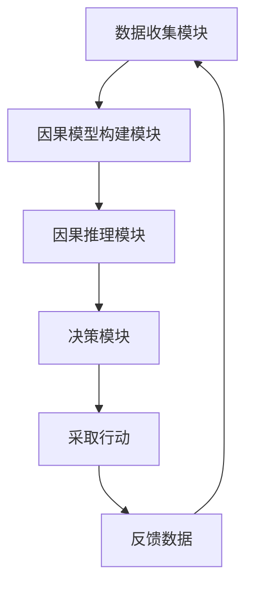

# AI Agent的因果推理能力构建

> 关键词：AI Agent、因果推理、因果模型、机器学习、人工智能、算法原理、实际应用

> 摘要：本文围绕AI Agent的因果推理能力构建展开深入探讨。首先介绍了相关背景，包括目的范围、预期读者等内容。接着阐述了核心概念与联系，明确因果推理在AI Agent中的重要性和架构关系。详细讲解了核心算法原理及具体操作步骤，结合Python代码进行说明。通过数学模型和公式进一步剖析因果推理的理论基础，并举例说明。在项目实战部分，从开发环境搭建到源代码实现及解读，完整呈现了构建过程。还探讨了实际应用场景，推荐了相关的工具和资源。最后总结了未来发展趋势与挑战，提供了常见问题解答和扩展阅读参考资料，旨在为AI Agent因果推理能力的研究和实践提供全面且深入的指导。

## 1. 背景介绍 
### 1.1 目的和范围
在当今人工智能飞速发展的时代，AI Agent已经在众多领域得到广泛应用。然而，现有的AI Agent大多基于相关性进行决策和推理，缺乏真正的因果理解能力。构建AI Agent的因果推理能力的目的在于使AI Agent能够像人类一样理解事件之间的因果关系，从而做出更加准确、合理和可解释的决策。

本文章的范围涵盖了从因果推理的基本概念、算法原理到实际应用的整个过程，旨在为读者全面介绍如何构建AI Agent的因果推理能力，包括理论知识的讲解和实践操作的指导。

### 1.2 预期读者
本文预期读者包括对人工智能领域感兴趣的研究人员、开发者、学生以及相关从业者。对于研究人员，本文提供了深入的理论探讨和最新的研究方向；对于开发者，文中包含了详细的代码实现和实践指导；对于学生，有助于他们系统地学习因果推理和AI Agent的相关知识；对于从业者，能够帮助他们了解如何将因果推理能力融入到实际的AI应用中。

### 1.3 文档结构概述
本文首先介绍背景知识，为后续内容奠定基础。接着阐述核心概念与联系，明确因果推理与AI Agent的关系和架构。然后详细讲解核心算法原理和具体操作步骤，结合Python代码进行说明。通过数学模型和公式进一步剖析因果推理的理论基础。在项目实战部分，从开发环境搭建到源代码实现及解读，完整呈现构建过程。之后探讨实际应用场景，推荐相关的工具和资源。最后总结未来发展趋势与挑战，提供常见问题解答和扩展阅读参考资料。

### 1.4 术语表
#### 1.4.1 核心术语定义
- **AI Agent（人工智能智能体）**：是一种能够感知环境、进行决策并采取行动以实现特定目标的人工智能实体。
- **因果推理（Causal Reasoning）**：是指从原因到结果或者从结果反推原因的逻辑推理过程，旨在理解事件之间的因果关系。
- **因果模型（Causal Model）**：是对因果关系进行形式化表示的数学模型，用于描述变量之间的因果结构和关系。

#### 1.4.2 相关概念解释
- **相关性（Correlation）**：是指两个或多个变量之间的统计关联程度，但相关性并不意味着因果关系。例如，冰淇淋销量和太阳镜销量可能呈现正相关，但它们之间并没有因果关系，而是都受到天气炎热这一共同因素的影响。
- **干预（Intervention）**：是指在因果模型中对某个变量进行人为的改变，以观察其对其他变量的影响，从而确定因果关系。

#### 1.4.3 缩略词列表
- **AI（Artificial Intelligence）**：人工智能
- **ML（Machine Learning）**：机器学习

## 2. 核心概念与联系 

### 核心概念原理
因果推理的核心原理在于区分相关性和因果关系。在传统的机器学习中，模型主要基于数据中的相关性进行学习和预测。然而，相关性可能是由多种因素导致的，并不一定反映真正的因果关系。因果推理则试图通过构建因果模型来揭示变量之间的因果结构，从而更好地理解和预测事件的发生。

例如，在医疗领域，观察到某种药物的使用和患者症状改善之间存在相关性，但这并不一定意味着药物是导致症状改善的原因。可能存在其他因素，如患者自身的免疫力、心理因素等也对症状改善产生影响。通过因果推理，可以构建因果模型，控制其他因素的影响，从而确定药物与症状改善之间的真正因果关系。

### 架构的文本示意图
AI Agent的因果推理能力构建架构主要包括以下几个部分：
1. **数据收集模块**：负责收集与问题相关的各种数据，包括观测数据和实验数据。
2. **因果模型构建模块**：根据收集到的数据，使用因果发现算法构建因果模型，确定变量之间的因果结构。
3. **因果推理模块**：基于构建好的因果模型，进行因果推理，预测干预效果和反事实情况。
4. **决策模块**：根据因果推理的结果，AI Agent做出决策并采取相应的行动。

### Mermaid 流程图


## 3. 核心算法原理 & 具体操作步骤 

### 因果发现算法原理
因果发现算法的目标是从观测数据中发现变量之间的因果结构。其中一种常用的算法是PC算法（Peter-Clark算法）。PC算法的基本思想是通过条件独立性测试来逐步确定变量之间的因果关系。

### Python代码实现
```python
import numpy as np
import pandas as pd
from causalgraphicalmodels import CausalGraphicalModel
from causalgraphicalmodels.test import independence_test

# 生成示例数据
np.random.seed(0)
n_samples = 1000
X = np.random.normal(0, 1, n_samples)
Y = 2 * X + np.random.normal(0, 1, n_samples)
Z = 3 * Y + np.random.normal(0, 1, n_samples)
data = pd.DataFrame({'X': X, 'Y': Y, 'Z': Z})

# 定义变量集合
variables = list(data.columns)

# 初始化完全连接的图
graph = CausalGraphicalModel(nodes=variables, edges=[(i, j) for i in variables for j in variables if i != j])

# PC算法的具体实现
def pc_algorithm(data, alpha=0.05):
    variables = list(data.columns)
    graph = CausalGraphicalModel(nodes=variables, edges=[(i, j) for i in variables for j in variables if i != j])
    while True:
        changed = False
        for edge in graph.edges:
            i, j = edge
            # 寻找所有可能的条件集合
            possible_conditions = [set() for _ in range(len(variables) - 2)]
            for k in range(len(variables)):
                if variables[k] != i and variables[k] != j:
                    for condition in possible_conditions:
                        if len(condition) < len(variables) - 2:
                            new_condition = condition.copy()
                            new_condition.add(variables[k])
                            possible_conditions[len(new_condition)].append(new_condition)
            # 进行条件独立性测试
            for condition in possible_conditions:
                p_value = independence_test(data, i, j, condition)
                if p_value > alpha:
                    graph = graph.remove_edge(i, j)
                    changed = True
                    break
        if not changed:
            break
    return graph

# 运行PC算法
result_graph = pc_algorithm(data)
print(result_graph)
```

### 具体操作步骤
1. **数据收集**：收集与问题相关的观测数据，确保数据的准确性和完整性。
2. **数据预处理**：对收集到的数据进行清洗、归一化等预处理操作，以提高算法的性能。
3. **选择因果发现算法**：根据数据的特点和问题的需求，选择合适的因果发现算法，如PC算法、FCI算法等。
4. **运行因果发现算法**：使用选择的算法对预处理后的数据进行处理，得到变量之间的因果结构。
5. **验证因果模型**：使用交叉验证等方法对得到的因果模型进行验证，确保模型的可靠性。

## 4. 数学模型和公式 & 详细讲解 & 举例说明 

### 因果图模型
因果图模型是一种用图来表示因果关系的数学模型。在因果图中，节点表示变量，有向边表示因果关系。例如，假设有三个变量 $X$、$Y$ 和 $Z$，如果 $X$ 是 $Y$ 的原因，$Y$ 是 $Z$ 的原因，则因果图可以表示为 $X \rightarrow Y \rightarrow Z$。

### 结构方程模型
结构方程模型是另一种常用的因果模型，它用一组方程来表示变量之间的因果关系。例如，对于上述因果图 $X \rightarrow Y \rightarrow Z$，可以用以下结构方程模型表示：
$$
\begin{cases}
Y = f_X(X, U_Y) \\
Z = f_Y(Y, U_Z)
\end{cases}
$$
其中，$f_X$ 和 $f_Y$ 是函数，$U_Y$ 和 $U_Z$ 是误差项，表示未被观测到的因素。

### 举例说明
假设有一个简单的因果关系：吸烟（$X$）导致肺癌（$Y$），并且空气污染（$Z$）也会影响肺癌的发生。可以用以下结构方程模型表示：
$$
\begin{cases}
Y = \beta_1 X + \beta_2 Z + U_Y \\
\end{cases}
$$
其中，$\beta_1$ 和 $\beta_2$ 是系数，表示吸烟和空气污染对肺癌的影响程度，$U_Y$ 是误差项。

通过观测数据，可以估计出 $\beta_1$ 和 $\beta_2$ 的值，从而确定吸烟和空气污染对肺癌的因果效应。

## 5. 项目实战：代码实际案例和详细解释说明 

### 5.1  开发环境搭建
- **操作系统**：推荐使用 Linux 或 macOS 系统，也可以使用 Windows 系统。
- **编程语言**：Python 3.6 及以上版本。
- **开发工具**：推荐使用 PyCharm 或 Jupyter Notebook。
- **相关库**：安装 `numpy`、`pandas`、`causalgraphicalmodels` 等库。可以使用以下命令进行安装：
```sh
pip install numpy pandas causalgraphicalmodels
```

### 5.2  源代码详细实现和代码解读
```python
import numpy as np
import pandas as pd
from causalgraphicalmodels import CausalGraphicalModel
from causalgraphicalmodels.test import independence_test

# 生成示例数据
np.random.seed(0)
n_samples = 1000
X = np.random.normal(0, 1, n_samples)
Y = 2 * X + np.random.normal(0, 1, n_samples)
Z = 3 * Y + np.random.normal(0, 1, n_samples)
data = pd.DataFrame({'X': X, 'Y': Y, 'Z': Z})

# 定义变量集合
variables = list(data.columns)

# 初始化完全连接的图
graph = CausalGraphicalModel(nodes=variables, edges=[(i, j) for i in variables for j in variables if i != j])

# PC算法的具体实现
def pc_algorithm(data, alpha=0.05):
    variables = list(data.columns)
    graph = CausalGraphicalModel(nodes=variables, edges=[(i, j) for i in variables for j in variables if i != j])
    while True:
        changed = False
        for edge in graph.edges:
            i, j = edge
            # 寻找所有可能的条件集合
            possible_conditions = [set() for _ in range(len(variables) - 2)]
            for k in range(len(variables)):
                if variables[k] != i and variables[k] != j:
                    for condition in possible_conditions:
                        if len(condition) < len(variables) - 2:
                            new_condition = condition.copy()
                            new_condition.add(variables[k])
                            possible_conditions[len(new_condition)].append(new_condition)
            # 进行条件独立性测试
            for condition in possible_conditions:
                p_value = independence_test(data, i, j, condition)
                if p_value > alpha:
                    graph = graph.remove_edge(i, j)
                    changed = True
                    break
        if not changed:
            break
    return graph

# 运行PC算法
result_graph = pc_algorithm(data)
print(result_graph)
```

### 代码解读与分析
1. **数据生成**：使用 `numpy` 库生成示例数据，模拟变量之间的因果关系。
2. **图的初始化**：使用 `causalgraphicalmodels` 库初始化一个完全连接的图，表示所有变量之间都可能存在因果关系。
3. **PC算法实现**：在 `pc_algorithm` 函数中，通过不断进行条件独立性测试，逐步删除不满足条件的边，最终得到变量之间的因果结构。
4. **结果输出**：运行 PC 算法并输出最终的因果图。

## 6. 实际应用场景 
### 医疗领域
在医疗领域，因果推理可以帮助医生更好地理解疾病的病因和治疗效果。例如，通过分析患者的基因数据、临床症状和治疗方案等信息，构建因果模型，确定不同治疗方法对疾病治愈的因果效应，从而为患者提供更加个性化的治疗方案。

### 金融领域
在金融领域，因果推理可以用于风险评估和投资决策。例如，通过分析市场因素、公司财务数据和宏观经济指标等信息，构建因果模型，确定不同因素对股票价格的因果影响，从而帮助投资者做出更加明智的投资决策。

### 交通领域
在交通领域，因果推理可以用于交通流量预测和交通管理。例如，通过分析道路状况、天气条件和交通信号等信息，构建因果模型，确定不同因素对交通流量的因果关系，从而优化交通信号控制，减少交通拥堵。

## 7. 工具和资源推荐
### 7.1 学习资源推荐
#### 7.1.1 书籍推荐
- 《因果论：模型、推理和推断》（*Causality: Models, Reasoning, and Inference*）：由 Judea Pearl 所著，是因果推理领域的经典著作，系统地介绍了因果推理的理论和方法。
- 《为什么：关于因果关系的新科学》（*The Book of Why: The New Science of Cause and Effect*）：同样由 Judea Pearl 所著，以通俗易懂的语言介绍了因果推理的基本概念和应用。

#### 7.1.2 在线课程
- Coursera 上的 “因果推理”（*Causal Inference*）课程：由知名教授授课，详细介绍了因果推理的理论和实践。
- edX 上的 “数据科学中的因果推理”（*Causal Inference in Data Science*）课程：结合实际案例，讲解如何在数据科学中应用因果推理。

#### 7.1.3 技术博客和网站
- Medium 上的因果推理相关博客：有很多研究人员和开发者分享因果推理的最新研究成果和实践经验。
- Causal Inference Initiative 网站：提供了因果推理领域的最新研究动态和资源。

### 7.2 开发工具框架推荐
#### 7.2.1 IDE和编辑器
- PyCharm：功能强大的 Python 集成开发环境，适合开发大型项目。
- Jupyter Notebook：交互式的开发环境，适合快速验证想法和进行数据分析。

#### 7.2.2 调试和性能分析工具
- `pdb`：Python 内置的调试工具，方便调试代码。
- `cProfile`：Python 内置的性能分析工具，用于分析代码的性能瓶颈。

#### 7.2.3 相关框架和库
- `causalgraphicalmodels`：用于构建和分析因果图模型的 Python 库。
- `dowhy`：用于进行因果推理的 Python 库，提供了多种因果发现和推理算法。

### 7.3 相关论文著作推荐
#### 7.3.1 经典论文
- Judea Pearl 的 “Causal Diagrams for Empirical Research”：提出了因果图模型的基本概念和方法，对因果推理领域产生了深远的影响。
- Peter Spirtes、Clark Glymour 和 Richard Scheines 的 “Causation, Prediction, and Search”：介绍了 PC 算法等因果发现算法，是因果推理领域的重要文献。

#### 7.3.2 最新研究成果
- 关注顶级学术会议如 NeurIPS、ICML、KDD 等上关于因果推理的最新研究论文，了解该领域的前沿动态。

#### 7.3.3 应用案例分析
- 一些实际应用案例的论文，如医疗、金融等领域的因果推理应用案例，有助于了解如何将因果推理应用到实际问题中。

## 8. 总结：未来发展趋势与挑战
### 未来发展趋势
- **与深度学习的融合**：将因果推理与深度学习相结合，使深度学习模型能够更好地理解数据中的因果关系，提高模型的可解释性和泛化能力。
- **多源数据的因果推理**：随着数据来源的多样化，如何从多源数据中进行有效的因果推理将成为未来的研究热点。
- **因果推理在强化学习中的应用**：在强化学习中引入因果推理，使智能体能够更好地理解环境中的因果关系，从而做出更加合理的决策。

### 挑战
- **数据的局限性**：因果推理需要大量高质量的数据，然而在实际应用中，数据往往存在缺失、噪声等问题，这给因果推理带来了挑战。
- **因果模型的可扩展性**：随着变量数量的增加，因果模型的复杂度会急剧上升，如何构建可扩展的因果模型是一个亟待解决的问题。
- **因果推理的可解释性**：虽然因果推理的目的之一是提高模型的可解释性，但目前的因果推理方法在解释性方面还存在一定的不足，需要进一步改进。

## 9. 附录：常见问题与解答
### 问题1：因果推理和相关性分析有什么区别？
相关性分析主要关注变量之间的统计关联程度，而因果推理则试图确定变量之间的因果关系。相关性并不意味着因果关系，例如两个变量可能因为共同受到其他因素的影响而呈现相关性，但它们之间并没有直接的因果联系。

### 问题2：如何选择合适的因果发现算法？
选择合适的因果发现算法需要考虑数据的特点和问题的需求。例如，如果数据是观测数据且变量之间的关系较为复杂，可以选择 PC 算法等基于条件独立性测试的算法；如果数据包含实验数据，可以选择基于干预的因果发现算法。

### 问题3：因果推理在实际应用中存在哪些困难？
因果推理在实际应用中存在数据局限性、因果模型的可扩展性和可解释性等困难。数据可能存在缺失、噪声等问题，影响因果推理的准确性；随着变量数量的增加，因果模型的复杂度会急剧上升；目前的因果推理方法在解释性方面还存在一定的不足。

## 10. 扩展阅读 & 参考资料
- Pearl, J. (2009). Causality: Models, Reasoning, and Inference. Cambridge University Press.
- Pearl, J., & Mackenzie, D. (2018). The Book of Why: The New Science of Cause and Effect. Basic Books.
- Spirtes, P., Glymour, C. N., & Scheines, R. (2000). Causation, Prediction, and Search. MIT Press.
- Causal Inference Initiative website: https://causalinference.org/
- Medium blogs on causal inference: https://medium.com/topics/causal-inference