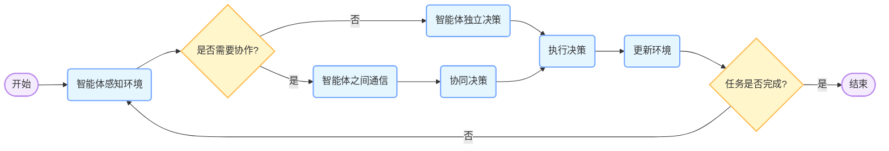

# AI Agent的多智能体协同决策机制

> 关键词：AI Agent、多智能体系统、协同决策机制、智能算法、应用场景

> 摘要：本文围绕AI Agent的多智能体协同决策机制展开深入探讨。首先介绍了相关背景，包括目的范围、预期读者等内容。接着阐述了核心概念及联系，通过文本示意图和Mermaid流程图直观展示。详细讲解了核心算法原理，结合Python源代码进行说明，同时给出数学模型和公式并举例。在项目实战部分，提供了开发环境搭建、源代码实现及解读。分析了实际应用场景，推荐了学习资源、开发工具框架和相关论文著作。最后总结了未来发展趋势与挑战，解答常见问题并给出扩展阅读与参考资料，旨在为读者全面呈现多智能体协同决策机制的技术全貌。

## 1. 背景介绍 
### 1.1 目的和范围
随着人工智能技术的飞速发展，单个智能体在处理复杂任务时往往存在局限性。多智能体协同决策机制旨在通过多个智能体之间的协作，实现更高效、更智能的决策过程。本文章的目的是深入剖析AI Agent的多智能体协同决策机制，包括其核心概念、算法原理、实际应用等方面。范围涵盖了多智能体协同决策机制的理论基础、技术实现以及在不同领域的应用案例。

### 1.2 预期读者
本文预期读者包括人工智能领域的研究人员、开发者、学生以及对多智能体系统感兴趣的技术爱好者。对于希望深入了解多智能体协同决策机制的原理和应用的人群，本文将提供有价值的参考。

### 1.3 文档结构概述
本文共分为十个部分。第一部分为背景介绍，阐述文章的目的、范围、预期读者和文档结构。第二部分介绍核心概念与联系，通过文本示意图和Mermaid流程图展示多智能体协同决策机制的原理和架构。第三部分讲解核心算法原理，并使用Python源代码详细阐述具体操作步骤。第四部分给出数学模型和公式，并进行详细讲解和举例说明。第五部分是项目实战，包括开发环境搭建、源代码实现和代码解读。第六部分分析实际应用场景。第七部分推荐学习资源、开发工具框架和相关论文著作。第八部分总结未来发展趋势与挑战。第九部分解答常见问题。第十部分提供扩展阅读与参考资料。

### 1.4 术语表
#### 1.4.1 核心术语定义
- **AI Agent**：人工智能智能体，是一种能够感知环境、进行决策并采取行动的软件或硬件实体。
- **多智能体系统（Multi - Agent System, MAS）**：由多个智能体组成的系统，智能体之间通过交互和协作来完成共同的任务。
- **协同决策机制**：多智能体系统中，智能体之间通过信息共享、协商等方式，共同制定决策的机制。

#### 1.4.2 相关概念解释
- **智能体的自主性**：智能体能够独立地感知环境、进行决策和采取行动，不受其他智能体的直接控制。
- **智能体的交互性**：智能体之间能够进行信息交换和通信，以实现协作和协调。
- **任务分解与分配**：将复杂的任务分解为多个子任务，并将这些子任务分配给不同的智能体来完成。

#### 1.4.3 缩略词列表
- **MAS**：Multi - Agent System，多智能体系统
- **Q - learning**：Q学习，一种强化学习算法

## 2. 核心概念与联系 

### 核心概念原理
在多智能体协同决策机制中，每个AI Agent都具有一定的自主性和智能性。它们能够感知周围环境的信息，根据自身的目标和规则进行决策，并采取相应的行动。智能体之间通过交互和通信，共享信息、协调行动，以实现共同的目标。

例如，在一个物流配送系统中，多个物流机器人（智能体）需要协同工作，完成货物的分拣、运输和配送任务。每个机器人能够感知自身的位置、货物的状态等信息，根据任务分配和环境情况进行路径规划和行动决策。同时，机器人之间通过无线通信网络进行信息交换，协调彼此的行动，避免碰撞和冲突。

### 架构的文本示意图
以下是一个简单的多智能体协同决策机制的架构示意图：

```plaintext
         环境
          |
  +------+------+
  |             |
智能体1        智能体2
  |             |
  +------+------+
          |
      通信网络
          |
      协同决策中心
```

在这个架构中，多个智能体与环境进行交互，感知环境信息并采取行动。智能体之间通过通信网络进行信息共享和交流。协同决策中心负责协调智能体之间的行动，根据智能体提供的信息和共同的目标，制定最优的决策方案。

### Mermaid流程图


这个流程图展示了多智能体协同决策的基本过程。首先，智能体感知环境信息，然后判断是否需要协作。如果需要协作，智能体之间进行通信并进行协同决策；如果不需要协作，智能体独立决策。接着，智能体执行决策并更新环境。最后，判断任务是否完成，如果未完成则继续循环，完成则结束。

## 3. 核心算法原理 & 具体操作步骤 

### 核心算法原理
在多智能体协同决策中，常用的算法包括强化学习算法（如Q - learning）、博弈论算法等。这里我们以Q - learning算法为例，介绍其在多智能体协同决策中的应用。

Q - learning是一种无模型的强化学习算法，其目标是学习一个最优的动作价值函数$Q(s, a)$，表示在状态$s$下采取动作$a$的预期累积奖励。智能体通过不断地与环境交互，尝试不同的动作，并根据获得的奖励来更新$Q$值，最终找到最优的策略。

在多智能体系统中，每个智能体都有自己的$Q$表，记录不同状态下采取不同动作的$Q$值。智能体之间通过通信共享部分信息，如状态、动作和奖励等，以实现协同学习和决策。

### 具体操作步骤及Python源代码
以下是一个简单的多智能体Q - learning的Python实现示例：

```python
import numpy as np

# 定义智能体类
class Agent:
    def __init__(self, num_states, num_actions, learning_rate=0.1, discount_factor=0.9):
        self.num_states = num_states
        self.num_actions = num_actions
        self.learning_rate = learning_rate
        self.discount_factor = discount_factor
        # 初始化Q表
        self.q_table = np.zeros((num_states, num_actions))

    def choose_action(self, state, epsilon=0.1):
        # epsilon - greedy策略选择动作
        if np.random.uniform(0, 1) < epsilon:
            action = np.random.choice(self.num_actions)
        else:
            action = np.argmax(self.q_table[state, :])
        return action

    def update_q_table(self, state, action, reward, next_state):
        # 更新Q表
        max_q_next = np.max(self.q_table[next_state, :])
        self.q_table[state, action] += self.learning_rate * (
            reward + self.discount_factor * max_q_next - self.q_table[state, action]
        )

# 定义多智能体系统类
class MultiAgentSystem:
    def __init__(self, num_agents, num_states, num_actions):
        self.num_agents = num_agents
        self.agents = [Agent(num_states, num_actions) for _ in range(num_agents)]

    def train(self, num_episodes, env):
        for episode in range(num_episodes):
            # 初始化环境
            states = env.reset()
            done = False
            while not done:
                actions = []
                # 每个智能体选择动作
                for i in range(self.num_agents):
                    action = self.agents[i].choose_action(states[i])
                    actions.append(action)
                # 执行动作，获取奖励和下一个状态
                next_states, rewards, done = env.step(actions)
                # 每个智能体更新Q表
                for i in range(self.num_agents):
                    self.agents[i].update_q_table(states[i], actions[i], rewards[i], next_states[i])
                states = next_states

# 简单的环境类示例
class SimpleEnvironment:
    def __init__(self, num_states, num_agents):
        self.num_states = num_states
        self.num_agents = num_agents
        self.current_states = [np.random.randint(0, num_states) for _ in range(num_agents)]

    def reset(self):
        self.current_states = [np.random.randint(0, num_states) for _ in range(num_agents)]
        return self.current_states

    def step(self, actions):
        next_states = []
        rewards = []
        for i in range(self.num_agents):
            # 简单的状态转移和奖励计算
            next_state = (self.current_states[i] + actions[i]) % self.num_states
            reward = 1 if next_state == 0 else -1
            next_states.append(next_state)
            rewards.append(reward)
        done = all([state == 0 for state in next_states])
        self.current_states = next_states
        return next_states, rewards, done

# 主程序
if __name__ == "__main__":
    num_agents = 2
    num_states = 5
    num_actions = 2
    mas = MultiAgentSystem(num_agents, num_states, num_actions)
    env = SimpleEnvironment(num_states, num_agents)
    num_episodes = 1000
    mas.train(num_episodes, env)
    print("训练完成")
```

### 代码解释
1. **Agent类**：表示单个智能体，包含Q表的初始化、动作选择和Q表更新的方法。
2. **MultiAgentSystem类**：表示多智能体系统，包含多个智能体，并实现了训练方法，通过循环让智能体与环境交互，更新Q表。
3. **SimpleEnvironment类**：表示一个简单的环境，包含状态重置、动作执行和奖励计算的方法。
4. **主程序**：创建多智能体系统和环境，进行训练。

## 4. 数学模型和公式 & 详细讲解 & 举例说明 

### 数学模型和公式
在Q - learning算法中，动作价值函数$Q(s, a)$的更新公式为：

$$Q(s_t, a_t) \leftarrow Q(s_t, a_t) + \alpha [r_{t+1} + \gamma \max_{a} Q(s_{t+1}, a) - Q(s_t, a_t)]$$

其中：
- $s_t$ 表示在时间步 $t$ 的状态。
- $a_t$ 表示在时间步 $t$ 采取的动作。
- $r_{t+1}$ 表示在时间步 $t+1$ 获得的奖励。
- $s_{t+1}$ 表示在时间步 $t+1$ 的下一个状态。
- $\alpha$ 是学习率，控制每次更新的步长。
- $\gamma$ 是折扣因子，用于权衡当前奖励和未来奖励的重要性。

### 详细讲解
这个公式的核心思想是通过不断地与环境交互，根据获得的奖励来更新$Q$值，使得$Q$值逐渐逼近最优的动作价值。具体来说：
1. $r_{t+1} + \gamma \max_{a} Q(s_{t+1}, a)$ 表示在状态 $s_t$ 采取动作 $a_t$ 后，获得的即时奖励 $r_{t+1}$ 加上未来预期的最大累积奖励 $\gamma \max_{a} Q(s_{t+1}, a)$。
2. $Q(s_t, a_t)$ 是当前状态动作对的$Q$值。
3. $r_{t+1} + \gamma \max_{a} Q(s_{t+1}, a) - Q(s_t, a_t)$ 表示当前估计值与旧估计值之间的误差。
4. $\alpha$ 乘以这个误差，得到更新的步长，用于更新$Q(s_t, a_t)$。

### 举例说明
假设我们有一个简单的网格世界环境，智能体可以在网格中上下左右移动。状态 $s$ 表示智能体在网格中的位置，动作 $a$ 表示移动的方向（上、下、左、右）。

初始时，$Q$表中的所有值都为0。假设智能体在状态 $s_1$ 采取动作 $a_1$ 移动到状态 $s_2$，获得奖励 $r = 1$。学习率 $\alpha = 0.1$，折扣因子 $\gamma = 0.9$。

假设 $\max_{a} Q(s_2, a) = 0$（因为初始时$Q$表都为0），则根据更新公式：

$$Q(s_1, a_1) \leftarrow Q(s_1, a_1) + 0.1 [1 + 0.9 \times 0 - 0] = 0 + 0.1 \times 1 = 0.1$$

经过多次交互和更新，$Q$表中的值会逐渐收敛到最优值，智能体可以根据$Q$表选择最优的动作。

## 5. 项目实战：代码实际案例和详细解释说明 

### 5.1  开发环境搭建
要运行上述的多智能体Q - learning代码，需要搭建以下开发环境：
1. **Python环境**：建议使用Python 3.6及以上版本。可以从Python官方网站（https://www.python.org/downloads/）下载并安装。
2. **NumPy库**：用于数值计算。可以使用以下命令安装：
```sh
pip install numpy
```

### 5.2  源代码详细实现和代码解读
以下是对上述代码的详细解读：

```python
import numpy as np

# 定义智能体类
class Agent:
    def __init__(self, num_states, num_actions, learning_rate=0.1, discount_factor=0.9):
        # 初始化智能体的状态数、动作数、学习率和折扣因子
        self.num_states = num_states
        self.num_actions = num_actions
        self.learning_rate = learning_rate
        self.discount_factor = discount_factor
        # 初始化Q表，大小为状态数乘以动作数，初始值都为0
        self.q_table = np.zeros((num_states, num_actions))

    def choose_action(self, state, epsilon=0.1):
        # epsilon - greedy策略选择动作
        if np.random.uniform(0, 1) < epsilon:
            # 以epsilon的概率随机选择一个动作
            action = np.random.choice(self.num_actions)
        else:
            # 以1 - epsilon的概率选择Q值最大的动作
            action = np.argmax(self.q_table[state, :])
        return action

    def update_q_table(self, state, action, reward, next_state):
        # 更新Q表
        # 找到下一个状态的最大Q值
        max_q_next = np.max(self.q_table[next_state, :])
        # 根据Q - learning更新公式更新当前状态动作对的Q值
        self.q_table[state, action] += self.learning_rate * (
            reward + self.discount_factor * max_q_next - self.q_table[state, action]
        )

# 定义多智能体系统类
class MultiAgentSystem:
    def __init__(self, num_agents, num_states, num_actions):
        # 初始化智能体数量、状态数和动作数
        self.num_agents = num_agents
        # 创建多个智能体实例
        self.agents = [Agent(num_states, num_actions) for _ in range(num_agents)]

    def train(self, num_episodes, env):
        for episode in range(num_episodes):
            # 初始化环境，获取初始状态
            states = env.reset()
            done = False
            while not done:
                actions = []
                # 每个智能体选择动作
                for i in range(self.num_agents):
                    action = self.agents[i].choose_action(states[i])
                    actions.append(action)
                # 执行动作，获取奖励和下一个状态
                next_states, rewards, done = env.step(actions)
                # 每个智能体更新Q表
                for i in range(self.num_agents):
                    self.agents[i].update_q_table(states[i], actions[i], rewards[i], next_states[i])
                states = next_states

# 简单的环境类示例
class SimpleEnvironment:
    def __init__(self, num_states, num_agents):
        # 初始化状态数和智能体数量
        self.num_states = num_states
        self.num_agents = num_agents
        # 随机初始化每个智能体的当前状态
        self.current_states = [np.random.randint(0, num_states) for _ in range(num_agents)]

    def reset(self):
        # 重置环境，随机初始化每个智能体的状态
        self.current_states = [np.random.randint(0, num_states) for _ in range(num_agents)]
        return self.current_states

    def step(self, actions):
        next_states = []
        rewards = []
        for i in range(self.num_agents):
            # 简单的状态转移，根据当前状态和动作计算下一个状态
            next_state = (self.current_states[i] + actions[i]) % self.num_states
            # 简单的奖励计算，如果下一个状态为0则奖励为1，否则为 - 1
            reward = 1 if next_state == 0 else -1
            next_states.append(next_state)
            rewards.append(reward)
        # 判断是否所有智能体都到达目标状态
        done = all([state == 0 for state in next_states])
        self.current_states = next_states
        return next_states, rewards, done

# 主程序
if __name__ == "__main__":
    num_agents = 2
    num_states = 5
    num_actions = 2
    # 创建多智能体系统实例
    mas = MultiAgentSystem(num_agents, num_states, num_actions)
    # 创建环境实例
    env = SimpleEnvironment(num_states, num_agents)
    num_episodes = 1000
    # 训练多智能体系统
    mas.train(num_episodes, env)
    print("训练完成")
```

### 5.3  代码解读与分析
1. **Agent类**：
    - `__init__` 方法：初始化智能体的状态数、动作数、学习率、折扣因子和Q表。
    - `choose_action` 方法：使用epsilon - greedy策略选择动作，以一定的概率随机选择动作，以保证探索性，否则选择Q值最大的动作。
    - `update_q_table` 方法：根据Q - learning更新公式更新Q表。
2. **MultiAgentSystem类**：
    - `__init__` 方法：初始化智能体数量，并创建多个智能体实例。
    - `train` 方法：通过多个回合的训练，让智能体与环境交互，选择动作、获取奖励并更新Q表。
3. **SimpleEnvironment类**：
    - `__init__` 方法：初始化状态数、智能体数量和当前状态。
    - `reset` 方法：重置环境，随机初始化每个智能体的状态。
    - `step` 方法：执行动作，计算下一个状态和奖励，判断是否完成任务。
4. **主程序**：创建多智能体系统和环境实例，设置训练回合数，调用训练方法进行训练。

通过这个简单的示例，我们可以看到多智能体协同决策的基本实现过程。每个智能体独立地学习和决策，同时通过与环境的交互和奖励反馈，逐渐优化自己的策略，最终实现协同完成任务的目标。

## 6. 实际应用场景 
多智能体协同决策机制在许多领域都有广泛的应用，以下是一些常见的应用场景：

### 物流配送领域
在物流配送系统中，多个物流机器人或无人机可以协同工作，完成货物的分拣、运输和配送任务。每个机器人或无人机可以根据自身的位置、负载能力和任务优先级等信息，自主地选择最优的路径和任务。同时，它们之间通过通信网络进行信息共享和协调，避免碰撞和冲突，提高物流效率。

### 智能交通领域
在智能交通系统中，多个自动驾驶车辆可以组成车队，通过协同决策实现高效的交通流控制。车辆之间可以实时交换速度、位置、行驶意图等信息，根据路况和交通规则，共同制定行驶策略，如加速、减速、变道等，以减少交通拥堵，提高交通安全。

### 工业制造领域
在工业制造过程中，多个机器人或自动化设备可以协同工作，完成复杂的生产任务。例如，在汽车制造生产线中，不同的机器人可以分别负责焊接、涂装、组装等工作，它们通过协同决策，合理安排工作顺序和时间，提高生产效率和产品质量。

### 军事作战领域
在军事作战中，多个作战单元（如飞机、舰艇、坦克等）可以组成多智能体系统，通过协同决策实现作战目标。作战单元之间可以共享情报信息，根据战场态势和任务要求，共同制定作战计划，合理分配资源，提高作战效能。

### 智能家居领域
在智能家居系统中，多个智能设备（如智能灯光、智能空调、智能门锁等）可以协同工作，实现智能化的家居控制。智能设备可以感知用户的行为和环境信息，根据用户的需求和预设的规则，共同调节家居环境，提供舒适、便捷的生活体验。

## 7. 工具和资源推荐
### 7.1 学习资源推荐
#### 7.1.1 书籍推荐
- 《Multiagent Systems: Algorithmic, Game - Theoretic, and Logical Foundations》：这本书全面介绍了多智能体系统的理论基础，包括算法、博弈论和逻辑等方面的内容，是学习多智能体系统的经典教材。
- 《Reinforcement Learning: An Introduction》：强化学习是多智能体协同决策中常用的技术，这本书详细介绍了强化学习的基本概念、算法和应用，是强化学习领域的权威著作。

#### 7.1.2 在线课程
- Coursera上的“Multi - Agent Artificial Intelligence”课程：由知名高校的教授授课，系统地介绍了多智能体系统的理论和实践。
- edX上的“Reinforcement Learning”课程：深入讲解了强化学习的算法和应用，对于理解多智能体协同决策中的强化学习技术有很大帮助。

#### 7.1.3 技术博客和网站
- Medium上的“Towards Data Science”：有许多关于人工智能和多智能体系统的高质量文章，涵盖了最新的研究成果和实践经验。
- AI Stack Exchange：一个专门讨论人工智能问题的问答社区，可以在这里获取多智能体系统相关的技术支持和解决方案。

### 7.2 开发工具框架推荐
#### 7.2.1 IDE和编辑器
- PyCharm：一款功能强大的Python集成开发环境，提供了代码编辑、调试、版本控制等丰富的功能，适合开发多智能体系统的Python代码。
- Visual Studio Code：一款轻量级的代码编辑器，支持多种编程语言，通过安装插件可以方便地进行Python开发和调试。

#### 7.2.2 调试和性能分析工具
- PySnooper：一个简单易用的Python调试工具，可以自动记录函数的调用过程和变量的值，方便调试多智能体系统的代码。
- cProfile：Python标准库中的性能分析工具，可以分析代码的运行时间和函数调用次数，帮助优化多智能体系统的性能。

#### 7.2.3 相关框架和库
- OpenAI Gym：一个开源的强化学习环境库，提供了多种不同类型的环境，可以用于测试和验证多智能体协同决策算法。
- Mesa：一个用于构建基于智能体的模型的Python库，提供了丰富的工具和接口，方便开发多智能体系统。

### 7.3 相关论文著作推荐
#### 7.3.1 经典论文
- “Distributed Problem Solving and Planning”：这篇论文介绍了分布式问题求解和规划的基本概念和方法，对多智能体协同决策的发展产生了重要影响。
- “Q - learning”：Q - learning算法的原始论文，详细阐述了Q - learning算法的原理和实现。

#### 7.3.2 最新研究成果
- 可以通过IEEE Xplore、ACM Digital Library等学术数据库搜索关于多智能体协同决策的最新研究论文，了解该领域的前沿技术和发展趋势。

#### 7.3.3 应用案例分析
- 一些知名企业和研究机构会发布多智能体协同决策在实际应用中的案例分析报告，可以通过它们的官方网站或相关技术博客获取这些资料，学习实际应用中的经验和技巧。

## 8. 总结：未来发展趋势与挑战
### 未来发展趋势
1. **与其他技术的融合**：多智能体协同决策机制将与区块链、物联网、大数据等技术深度融合。例如，结合区块链技术可以实现智能体之间的可信通信和数据共享；与物联网结合可以让智能体更好地感知和控制物理世界；利用大数据可以为智能体提供更丰富的信息和决策依据。
2. **应用领域的拓展**：随着技术的不断发展，多智能体协同决策机制将在更多领域得到应用，如医疗保健、农业、能源管理等。在医疗保健领域，多个智能医疗设备和医生智能助手可以协同工作，为患者提供更精准的诊断和治疗方案。
3. **智能体的智能化提升**：未来的智能体将具有更高的智能水平，能够进行更复杂的推理、学习和决策。例如，智能体可以通过深度学习和自然语言处理技术，更好地理解人类的意图和环境信息，实现更高效的协同。

### 挑战
1. **通信与协调问题**：在多智能体系统中，智能体之间的通信和协调是一个关键问题。当智能体数量增多、通信环境复杂时，如何保证信息的及时、准确传输，以及如何协调智能体之间的行动，避免冲突和混乱，是需要解决的难题。
2. **安全与隐私问题**：多智能体系统涉及大量的信息共享和交互，安全和隐私问题至关重要。如何保护智能体之间传输的数据不被泄露和篡改，如何防止恶意智能体的攻击和干扰，是需要重点关注的问题。
3. **计算资源需求**：多智能体协同决策通常需要大量的计算资源，尤其是在处理复杂任务和大规模智能体系统时。如何优化算法，降低计算复杂度，提高系统的效率和可扩展性，是面临的挑战之一。

## 9. 附录：常见问题与解答
### 问题1：多智能体协同决策和单智能体决策有什么区别？
解答：单智能体决策只考虑单个智能体的目标和环境信息，独立地进行决策。而多智能体协同决策需要考虑多个智能体之间的交互和协作，智能体之间需要共享信息、协调行动，以实现共同的目标。多智能体协同决策通常能够处理更复杂的任务，但也面临着通信、协调等方面的挑战。

### 问题2：在多智能体系统中，智能体之间如何进行通信？
解答：智能体之间的通信方式有多种，常见的包括无线通信（如Wi - Fi、蓝牙等）、有线通信（如以太网）和网络通信（如HTTP、MQTT等）。通信协议也有很多种，如TCP/IP、UDP等。在实际应用中，需要根据具体的场景和需求选择合适的通信方式和协议。

### 问题3：多智能体协同决策算法的收敛性如何保证？
解答：保证多智能体协同决策算法的收敛性是一个复杂的问题。不同的算法有不同的收敛条件和方法。例如，在Q - learning算法中，可以通过合理选择学习率和折扣因子，以及足够的训练时间，来保证Q表的收敛。此外，还可以采用一些优化技术，如经验回放、目标网络等，来提高算法的收敛速度和稳定性。

### 问题4：如何评估多智能体协同决策系统的性能？
解答：评估多智能体协同决策系统的性能可以从多个方面进行，如任务完成时间、资源利用率、决策准确率等。可以通过实验和模拟的方法，对比不同算法和参数设置下系统的性能指标，选择最优的方案。同时，还可以考虑系统的鲁棒性、可扩展性等因素。

## 10. 扩展阅读 & 参考资料
### 扩展阅读
- 《Artificial Intelligence: A Modern Approach》：这本书是人工智能领域的经典教材，涵盖了多智能体系统、机器学习、自然语言处理等多个方面的内容，对于深入理解人工智能技术有很大帮助。
- 《Game Theory: An Introduction》：博弈论是多智能体协同决策中的重要理论基础，这本书详细介绍了博弈论的基本概念、模型和应用，适合进一步学习博弈论在多智能体系统中的应用。

### 参考资料
- 相关学术论文：可以通过IEEE Xplore、ACM Digital Library、ScienceDirect等学术数据库搜索关于多智能体协同决策的学术论文，获取最新的研究成果和技术方法。
- 开源代码库：如GitHub上有许多关于多智能体系统的开源项目，可以参考这些项目的代码实现和文档，学习实际开发中的经验和技巧。