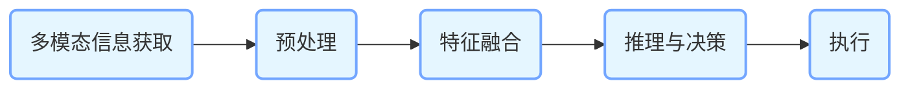

# AI Agent的多模态情境理解与推理

> 关键词：AI Agent、多模态、情境理解、推理、深度学习、感知融合、决策智能

> 摘要：本文围绕AI Agent的多模态情境理解与推理展开深入探讨。随着人工智能技术的不断发展，单一模态的信息处理已难以满足复杂情境下的任务需求，多模态技术成为提升AI Agent智能水平的关键。文章首先介绍了相关背景知识，包括目的、预期读者、文档结构和术语表等。接着阐述了核心概念与联系，通过文本示意图和Mermaid流程图展示多模态情境理解与推理的架构。详细讲解了核心算法原理，并用Python源代码进行说明，同时给出数学模型和公式并举例。通过项目实战，展示了多模态情境理解与推理在实际中的应用及代码实现。还探讨了其实际应用场景，推荐了相关的学习资源、开发工具框架和论文著作。最后总结了未来发展趋势与挑战，并提供了常见问题与解答及参考资料，旨在为读者全面深入地理解AI Agent的多模态情境理解与推理提供有价值的参考。

## 1. 背景介绍 
### 1.1 目的和范围
在当今复杂多变的现实环境中，智能体需要具备更强大的感知和理解能力，以应对多样化的任务和场景。AI Agent的多模态情境理解与推理旨在让智能体能够综合利用多种不同类型的信息，如视觉、听觉、语言等，更全面、准确地理解所处的情境，并基于此进行合理的推理和决策。本文章的范围涵盖了多模态情境理解与推理的基本概念、核心算法、数学模型、实际应用等多个方面，旨在为读者提供一个系统、全面的知识体系。

### 1.2 预期读者
本文预期读者包括人工智能领域的研究人员、开发者、学生，以及对多模态技术和AI Agent感兴趣的技术爱好者。对于研究人员，本文可以提供新的研究思路和方法；对于开发者，能够帮助他们在实际项目中应用多模态情境理解与推理技术；对于学生，可以作为学习相关知识的参考资料；对于技术爱好者，则可以拓宽他们对人工智能前沿技术的认知。

### 1.3 文档结构概述
本文将按照以下结构展开：首先介绍相关背景知识，包括目的、预期读者、文档结构和术语表等；接着阐述核心概念与联系，展示多模态情境理解与推理的架构；详细讲解核心算法原理，并用Python源代码进行说明；给出数学模型和公式并举例；通过项目实战，展示多模态情境理解与推理在实际中的应用及代码实现；探讨其实际应用场景；推荐相关的学习资源、开发工具框架和论文著作；最后总结未来发展趋势与挑战，并提供常见问题与解答及参考资料。

### 1.4 术语表
#### 1.4.1 核心术语定义
- **AI Agent**：人工智能智能体，是一种能够感知环境、进行决策并执行相应动作的实体。
- **多模态**：指包含多种不同类型信息的模式，如视觉、听觉、语言等。
- **情境理解**：智能体对所处环境的综合认知和分析，包括环境中的物体、事件、关系等。
- **推理**：基于已有的信息和知识，通过逻辑或概率等方法得出新的结论或决策的过程。

#### 1.4.2 相关概念解释
- **感知融合**：将不同模态的感知信息进行整合，以获得更全面、准确的环境信息。
- **深度学习**：一种基于人工神经网络的机器学习方法，在多模态处理中具有重要应用。
- **决策智能**：智能体根据情境理解和推理结果，做出合理决策的能力。

#### 1.4.3 缩略词列表
- **CNN**：Convolutional Neural Network，卷积神经网络
- **RNN**：Recurrent Neural Network，循环神经网络
- **LSTM**：Long Short-Term Memory，长短期记忆网络
- **Transformer**：一种基于注意力机制的深度学习模型

## 2. 核心概念与联系 
### 核心概念原理
AI Agent的多模态情境理解与推理涉及多个关键概念和原理。首先，多模态信息的获取是基础，智能体通过不同的传感器收集视觉、听觉、语言等多种类型的信息。然后，对这些信息进行预处理，包括数据清洗、特征提取等操作。接着，将不同模态的特征进行融合，以获得更全面、准确的情境表示。最后，基于融合后的情境表示进行推理和决策。

### 架构的文本示意图
AI Agent的多模态情境理解与推理架构主要包括以下几个部分：
1. **多模态信息获取模块**：通过各种传感器获取视觉、听觉、语言等信息。
2. **预处理模块**：对获取的信息进行清洗、特征提取等操作。
3. **特征融合模块**：将不同模态的特征进行融合，得到综合的情境表示。
4. **推理与决策模块**：基于融合后的情境表示进行推理和决策。
5. **执行模块**：根据决策结果执行相应的动作。

### Mermaid流程图


## 3. 核心算法原理 & 具体操作步骤 
### 多模态特征提取算法
在多模态情境理解与推理中，首先需要对不同模态的信息进行特征提取。以视觉和语言模态为例，我们可以使用卷积神经网络（CNN）提取视觉特征，使用循环神经网络（RNN）或Transformer提取语言特征。

#### Python代码示例
```python
import torch
import torch.nn as nn
import torchvision.models as models

# 定义视觉特征提取模型
class VisualFeatureExtractor(nn.Module):
    def __init__(self):
        super(VisualFeatureExtractor, self).__init__()
        self.resnet = models.resnet18(pretrained=True)
        self.resnet.fc = nn.Identity()  # 移除最后一层全连接层

    def forward(self, images):
        features = self.resnet(images)
        return features

# 定义语言特征提取模型
class LanguageFeatureExtractor(nn.Module):
    def __init__(self, vocab_size, embedding_dim, hidden_dim):
        super(LanguageFeatureExtractor, self).__init__()
        self.embedding = nn.Embedding(vocab_size, embedding_dim)
        self.rnn = nn.LSTM(embedding_dim, hidden_dim, batch_first=True)

    def forward(self, texts):
        embedded = self.embedding(texts)
        _, (h_n, _) = self.rnn(embedded)
        return h_n.squeeze(0)

# 示例使用
visual_extractor = VisualFeatureExtractor()
language_extractor = LanguageFeatureExtractor(vocab_size=1000, embedding_dim=128, hidden_dim=256)

# 模拟输入
images = torch.randn(4, 3, 224, 224)  # 4张图片
texts = torch.randint(0, 1000, (4, 10))  # 4个文本序列

visual_features = visual_extractor(images)
language_features = language_extractor(texts)

print("Visual features shape:", visual_features.shape)
print("Language features shape:", language_features.shape)
```

### 特征融合算法
在提取不同模态的特征后，需要将它们进行融合。常见的融合方法包括早期融合、晚期融合和混合融合等。这里我们介绍一种简单的晚期融合方法，即将不同模态的特征在全连接层进行拼接。

#### Python代码示例
```python
class FeatureFusion(nn.Module):
    def __init__(self, visual_dim, language_dim, hidden_dim):
        super(FeatureFusion, self).__init__()
        self.fc1 = nn.Linear(visual_dim + language_dim, hidden_dim)
        self.relu = nn.ReLU()

    def forward(self, visual_features, language_features):
        combined_features = torch.cat((visual_features, language_features), dim=1)
        fused_features = self.fc1(combined_features)
        fused_features = self.relu(fused_features)
        return fused_features

# 示例使用
fusion_model = FeatureFusion(visual_dim=512, language_dim=256, hidden_dim=512)
fused_features = fusion_model(visual_features, language_features)
print("Fused features shape:", fused_features.shape)
```

### 推理与决策算法
基于融合后的特征，我们可以构建一个分类器或回归器进行推理和决策。这里我们以一个简单的分类任务为例。

#### Python代码示例
```python
class DecisionMaker(nn.Module):
    def __init__(self, input_dim, num_classes):
        super(DecisionMaker, self).__init__()
        self.fc2 = nn.Linear(input_dim, num_classes)
        self.softmax = nn.Softmax(dim=1)

    def forward(self, fused_features):
        logits = self.fc2(fused_features)
        probabilities = self.softmax(logits)
        return probabilities

# 示例使用
decision_maker = DecisionMaker(input_dim=512, num_classes=10)
output = decision_maker(fused_features)
print("Output shape:", output.shape)
```

## 4. 数学模型和公式 & 详细讲解 & 举例说明 
### 特征提取的数学模型
#### 视觉特征提取
对于卷积神经网络（CNN），其基本的卷积操作可以表示为：
$$y_{i,j}^k = \sum_{m=0}^{M - 1}\sum_{n=0}^{N - 1}x_{i + m, j + n}w_{m,n}^k + b^k$$
其中，$x$ 是输入图像，$w$ 是卷积核，$b$ 是偏置，$y$ 是卷积输出，$k$ 表示卷积核的索引，$M$ 和 $N$ 是卷积核的尺寸。

#### 语言特征提取
对于循环神经网络（RNN），其状态更新公式为：
$$h_t = \sigma(W_{hh}h_{t - 1} + W_{xh}x_t + b_h)$$
其中，$h_t$ 是时刻 $t$ 的隐藏状态，$x_t$ 是时刻 $t$ 的输入，$W_{hh}$ 和 $W_{xh}$ 是权重矩阵，$b_h$ 是偏置，$\sigma$ 是激活函数。

### 特征融合的数学模型
晚期融合的拼接操作可以表示为：
$$f_{fused} = [f_{visual}; f_{language}]$$
其中，$f_{fused}$ 是融合后的特征，$f_{visual}$ 是视觉特征，$f_{language}$ 是语言特征。

### 推理与决策的数学模型
对于分类任务，使用 softmax 函数将输出转换为概率分布：
$$P(y = j|x) = \frac{e^{z_j}}{\sum_{k = 1}^{K}e^{z_k}}$$
其中，$P(y = j|x)$ 是输入 $x$ 属于类别 $j$ 的概率，$z_j$ 是分类器的输出，$K$ 是类别数。

### 举例说明
假设我们有一张图像和一段描述该图像的文本，图像的视觉特征 $f_{visual} = [0.2, 0.3, 0.5]$，文本的语言特征 $f_{language} = [0.4, 0.6]$。通过晚期融合，将它们拼接得到融合特征 $f_{fused} = [0.2, 0.3, 0.5, 0.4, 0.6]$。然后将融合特征输入到分类器中，得到输出 $z = [1.2, 2.3, 3.4, 4.5, 5.6]$。使用 softmax 函数计算概率分布：
$$P(y = 1|x) = \frac{e^{1.2}}{e^{1.2}+e^{2.3}+e^{3.4}+e^{4.5}+e^{5.6}} \approx 0.01$$
$$P(y = 2|x) = \frac{e^{2.3}}{e^{1.2}+e^{2.3}+e^{3.4}+e^{4.5}+e^{5.6}} \approx 0.03$$
$$P(y = 3|x) = \frac{e^{3.4}}{e^{1.2}+e^{2.3}+e^{3.4}+e^{4.5}+e^{5.6}} \approx 0.09$$
$$P(y = 4|x) = \frac{e^{4.5}}{e^{1.2}+e^{2.3}+e^{3.4}+e^{4.5}+e^{5.6}} \approx 0.27$$
$$P(y = 5|x) = \frac{e^{5.6}}{e^{1.2}+e^{2.3}+e^{3.4}+e^{4.5}+e^{5.6}} \approx 0.60$$

根据概率分布，我们可以判断输入的图像和文本最有可能属于类别 5。

## 5. 项目实战：代码实际案例和详细解释说明 
### 5.1  开发环境搭建
#### 硬件环境
- **CPU**：Intel Core i7 及以上
- **GPU**：NVIDIA GPU（如 GTX 1080 及以上），以加速深度学习训练过程
- **内存**：16GB 及以上

#### 软件环境
- **操作系统**：Ubuntu 18.04 及以上或 Windows 10
- **Python**：3.7 及以上
- **深度学习框架**：PyTorch 1.7 及以上

#### 安装依赖库
```bash
pip install torch torchvision
pip install numpy pandas matplotlib
```

### 5.2  源代码详细实现和代码解读
#### 数据集准备
我们使用一个简单的多模态数据集，包含图像和对应的文本描述，以及分类标签。

```python
import torch
from torch.utils.data import Dataset, DataLoader
import numpy as np
from PIL import Image

class MultiModalDataset(Dataset):
    def __init__(self, image_paths, texts, labels):
        self.image_paths = image_paths
        self.texts = texts
        self.labels = labels

    def __len__(self):
        return len(self.image_paths)

    def __getitem__(self, idx):
        image_path = self.image_paths[idx]
        image = Image.open(image_path).convert('RGB')
        image = np.array(image)
        image = torch.from_numpy(image).permute(2, 0, 1).float()

        text = self.texts[idx]
        label = self.labels[idx]

        return image, text, label

# 示例数据
image_paths = ['image1.jpg', 'image2.jpg', 'image3.jpg']
texts = ['This is a cat', 'This is a dog', 'This is a bird']
labels = [0, 1, 2]

dataset = MultiModalDataset(image_paths, texts, labels)
dataloader = DataLoader(dataset, batch_size=2, shuffle=True)
```

#### 模型定义
我们使用之前定义的视觉特征提取器、语言特征提取器、特征融合模型和决策模型。

```python
import torch.nn as nn
import torchvision.models as models

# 视觉特征提取器
class VisualFeatureExtractor(nn.Module):
    def __init__(self):
        super(VisualFeatureExtractor, self).__init__()
        self.resnet = models.resnet18(pretrained=True)
        self.resnet.fc = nn.Identity()

    def forward(self, images):
        features = self.resnet(images)
        return features

# 语言特征提取器
class LanguageFeatureExtractor(nn.Module):
    def __init__(self, vocab_size, embedding_dim, hidden_dim):
        super(LanguageFeatureExtractor, self).__init__()
        self.embedding = nn.Embedding(vocab_size, embedding_dim)
        self.rnn = nn.LSTM(embedding_dim, hidden_dim, batch_first=True)

    def forward(self, texts):
        embedded = self.embedding(texts)
        _, (h_n, _) = self.rnn(embedded)
        return h_n.squeeze(0)

# 特征融合模型
class FeatureFusion(nn.Module):
    def __init__(self, visual_dim, language_dim, hidden_dim):
        super(FeatureFusion, self).__init__()
        self.fc1 = nn.Linear(visual_dim + language_dim, hidden_dim)
        self.relu = nn.ReLU()

    def forward(self, visual_features, language_features):
        combined_features = torch.cat((visual_features, language_features), dim=1)
        fused_features = self.fc1(combined_features)
        fused_features = self.relu(fused_features)
        return fused_features

# 决策模型
class DecisionMaker(nn.Module):
    def __init__(self, input_dim, num_classes):
        super(DecisionMaker, self).__init__()
        self.fc2 = nn.Linear(input_dim, num_classes)
        self.softmax = nn.Softmax(dim=1)

    def forward(self, fused_features):
        logits = self.fc2(fused_features)
        probabilities = self.softmax(logits)
        return probabilities

# 初始化模型
visual_extractor = VisualFeatureExtractor()
language_extractor = LanguageFeatureExtractor(vocab_size=1000, embedding_dim=128, hidden_dim=256)
feature_fusion = FeatureFusion(visual_dim=512, language_dim=256, hidden_dim=512)
decision_maker = DecisionMaker(input_dim=512, num_classes=3)
```

#### 训练过程
```python
import torch.optim as optim

# 定义损失函数和优化器
criterion = nn.CrossEntropyLoss()
optimizer = optim.Adam(list(visual_extractor.parameters()) + list(language_extractor.parameters()) +
                       list(feature_fusion.parameters()) + list(decision_maker.parameters()), lr=0.001)

# 训练循环
num_epochs = 10
for epoch in range(num_epochs):
    running_loss = 0.0
    for images, texts, labels in dataloader:
        optimizer.zero_grad()

        visual_features = visual_extractor(images)
        language_features = language_extractor(texts)
        fused_features = feature_fusion(visual_features, language_features)
        outputs = decision_maker(fused_features)

        loss = criterion(outputs, labels)
        loss.backward()
        optimizer.step()

        running_loss += loss.item()

    print(f'Epoch {epoch + 1}, Loss: {running_loss / len(dataloader)}')
```

### 5.3  代码解读与分析
#### 数据集部分
`MultiModalDataset` 类继承自 `torch.utils.data.Dataset`，用于加载多模态数据。`__getitem__` 方法负责读取图像、文本和标签，并将图像转换为 PyTorch 张量。`DataLoader` 用于批量加载数据，方便训练过程。

#### 模型部分
- **VisualFeatureExtractor**：使用预训练的 ResNet18 提取图像特征，移除最后一层全连接层以获取特征表示。
- **LanguageFeatureExtractor**：使用嵌入层和 LSTM 提取文本特征。
- **FeatureFusion**：将视觉和语言特征拼接后通过全连接层进行融合。
- **DecisionMaker**：将融合后的特征输入到全连接层，使用 softmax 函数输出分类概率。

#### 训练部分
使用交叉熵损失函数和 Adam 优化器进行训练。在每个 epoch 中，遍历数据集，计算损失并进行反向传播和参数更新。

## 6. 实际应用场景 
### 智能安防
在智能安防领域，AI Agent 的多模态情境理解与推理技术可以综合利用视频监控（视觉模态）和音频传感器（听觉模态）的数据。例如，通过分析监控画面中人员的行为动作和声音信息，判断是否存在异常情况，如暴力冲突、盗窃等。如果监控画面中出现人员激烈争吵的场景，同时音频中检测到高分贝的呼喊声，系统可以及时发出警报，通知安保人员进行处理。

### 智能交通
在智能交通系统中，多模态技术可以帮助自动驾驶汽车更好地理解周围环境。车辆可以通过摄像头获取视觉信息，如道路标识、交通信号灯、其他车辆和行人的位置；通过雷达和激光雷达获取距离和速度信息；通过麦克风获取交通声音，如汽车喇叭声、刹车声等。综合这些多模态信息，自动驾驶汽车可以更准确地做出决策，如加速、减速、转弯等，提高行车安全性。

### 智能医疗
在智能医疗领域，多模态情境理解与推理可以辅助医生进行疾病诊断。例如，结合医学影像（如 X 光、CT 等视觉模态）和患者的症状描述（语言模态），AI Agent 可以对疾病进行更准确的诊断和预测。同时，还可以通过监测患者的生命体征（如心率、血压等数值模态）和语音信息（如呼吸声音等听觉模态），实时评估患者的健康状况，为医疗决策提供支持。

### 智能客服
智能客服系统可以利用多模态技术提高服务质量。除了处理用户的文本输入（语言模态），还可以通过语音识别技术处理用户的语音问题（听觉模态）。同时，结合用户的历史聊天记录、购买行为等信息，更好地理解用户的需求和意图，提供更个性化、准确的服务。

## 7. 工具和资源推荐
### 7.1 学习资源推荐
#### 7.1.1 书籍推荐
- 《深度学习》（Deep Learning）：由 Ian Goodfellow、Yoshua Bengio 和 Aaron Courville 合著，是深度学习领域的经典教材，涵盖了神经网络、卷积神经网络、循环神经网络等多个方面的内容。
- 《Python 深度学习》（Deep Learning with Python）：作者是 Francois Chollet，以 Keras 框架为例，详细介绍了深度学习的基本概念和实践方法，适合初学者。
- 《多模态机器学习：原理与应用》（Multimodal Machine Learning: Principles and Applications）：全面介绍了多模态机器学习的理论和方法，包括多模态数据的表示、融合和分析等内容。

#### 7.1.2 在线课程
- Coursera 上的“深度学习专项课程”（Deep Learning Specialization）：由 Andrew Ng 教授授课，包括神经网络和深度学习、改善深层神经网络、结构化机器学习项目等多个课程，是学习深度学习的优质资源。
- edX 上的“人工智能基础”（Introduction to Artificial Intelligence）：介绍了人工智能的基本概念、算法和应用，对多模态技术的学习有一定的帮助。
- B 站等平台上的一些开源课程，如李宏毅的机器学习课程，以通俗易懂的方式讲解机器学习和深度学习的知识。

#### 7.1.3 技术博客和网站
- arXiv：一个预印本服务器，提供了大量的最新学术论文，包括多模态机器学习、人工智能等领域的研究成果。
- Medium：上面有很多技术专家分享的关于深度学习、多模态技术的文章和经验。
- AI 研习社：专注于人工智能领域的知识分享和交流，有很多关于多模态技术的案例分析和技术解读。

### 7.2 开发工具框架推荐
#### 7.2.1 IDE和编辑器
- PyCharm：一款功能强大的 Python 集成开发环境，提供代码编辑、调试、版本控制等多种功能，适合开发深度学习项目。
- Visual Studio Code：轻量级的代码编辑器，支持多种编程语言和插件，可通过安装相关插件来进行深度学习开发。
- Jupyter Notebook：交互式的开发环境，适合进行数据探索、模型调试和可视化等工作，在深度学习研究中广泛使用。

#### 7.2.2 调试和性能分析工具
- TensorBoard：TensorFlow 提供的可视化工具，可用于查看模型训练过程中的损失曲线、准确率、参数分布等信息，帮助调试和优化模型。
- PyTorch Profiler：PyTorch 自带的性能分析工具，可用于分析模型的运行时间、内存使用等情况，找出性能瓶颈。
- NVIDIA Nsight Systems：用于分析 GPU 应用程序的性能，帮助优化深度学习模型在 GPU 上的运行效率。

#### 7.2.3 相关框架和库
- PyTorch：一个开源的深度学习框架，提供了丰富的神经网络模块和优化算法，支持多模态数据的处理和模型训练。
- TensorFlow：另一个广泛使用的深度学习框架，具有强大的分布式训练和部署能力，也可用于多模态技术的开发。
- Transformers：Hugging Face 开发的自然语言处理库，提供了多种预训练的语言模型，如 BERT、GPT 等，可用于文本特征提取。
- TorchVision：PyTorch 的视觉库，提供了多种预训练的视觉模型和数据处理工具，方便进行图像特征提取。

### 7.3 相关论文著作推荐
#### 7.3.1 经典论文
- "Attention Is All You Need"：提出了 Transformer 模型，引入了注意力机制，在自然语言处理和多模态领域有广泛应用。
- "Multimodal Deep Learning"：介绍了多模态深度学习的基本概念和方法，为多模态技术的发展奠定了基础。
- "Fusing Multimodal Information in Deep Neural Networks"：研究了多模态信息融合的方法和策略，对多模态特征融合有重要参考价值。

#### 7.3.2 最新研究成果
可以通过 arXiv、ACM Digital Library、IEEE Xplore 等学术数据库查找多模态情境理解与推理领域的最新研究论文，关注该领域的前沿进展。

#### 7.3.3 应用案例分析
一些知名学术会议（如 CVPR、ICCV、ACL 等）的论文集中包含了很多多模态技术在实际应用中的案例分析，可以从中学习如何将多模态技术应用到不同的领域中。

## 8. 总结：未来发展趋势与挑战
### 未来发展趋势
#### 更强大的多模态融合方法
未来将不断探索和发展更高效、更强大的多模态融合方法，能够更好地捕捉不同模态之间的内在联系和互补信息，提高多模态情境理解与推理的准确性和性能。

#### 跨领域应用拓展
多模态技术将在更多领域得到应用，如教育、娱乐、金融等。例如，在教育领域，结合视频、音频和文本等多模态信息，开发更智能的教学系统，提高学习效果；在娱乐领域，实现更加沉浸式的虚拟现实和增强现实体验。

#### 与其他技术的融合
多模态技术将与区块链、物联网、5G 等技术深度融合。例如，物联网设备可以提供更多的多模态数据，5G 技术可以实现数据的快速传输，区块链技术可以保证数据的安全性和可信度，从而推动多模态技术在更复杂场景下的应用。

#### 自主学习和进化能力
未来的 AI Agent 将具备更强的自主学习和进化能力，能够在不断变化的环境中自动调整和优化多模态情境理解与推理的策略，提高适应性和智能水平。

### 挑战
#### 数据获取和标注难题
多模态数据的获取和标注是一个具有挑战性的问题。不同模态的数据来源不同，数据格式和质量也存在差异，需要花费大量的时间和精力进行数据收集、清洗和标注。

#### 计算资源和效率问题
多模态数据的处理和分析需要大量的计算资源，尤其是在处理大规模数据和复杂模型时，计算效率成为一个关键问题。如何优化算法和模型结构，提高计算效率，是亟待解决的问题。

#### 语义理解和知识融合困难
不同模态的数据具有不同的语义表示，如何实现跨模态的语义理解和知识融合是一个难题。需要研究更加有效的语义表示方法和知识图谱技术，以提高多模态情境理解的准确性和深度。

#### 伦理和安全问题
随着多模态技术的广泛应用，伦理和安全问题也日益凸显。例如，多模态数据可能包含个人隐私信息，如何保护用户的隐私和数据安全是一个重要问题。同时，AI Agent 的决策和行为也需要符合伦理道德规范，避免对人类造成不良影响。

## 9. 附录：常见问题与解答
### 问题 1：多模态特征融合有哪些常见方法？
常见的多模态特征融合方法包括早期融合、晚期融合和混合融合。早期融合是在特征提取之前将不同模态的数据进行融合；晚期融合是在特征提取之后将不同模态的特征进行融合；混合融合则结合了早期融合和晚期融合的优点。

### 问题 2：如何选择合适的深度学习模型进行多模态情境理解与推理？
选择合适的模型需要考虑多个因素，如数据类型、任务需求、计算资源等。对于视觉模态，可以选择卷积神经网络（CNN）；对于语言模态，可以选择循环神经网络（RNN）、长短期记忆网络（LSTM）或 Transformer 模型。在进行特征融合和推理时，可以根据具体情况构建合适的全连接网络或其他模型。

### 问题 3：多模态技术在实际应用中面临哪些困难？
多模态技术在实际应用中面临数据获取和标注难题、计算资源和效率问题、语义理解和知识融合困难、伦理和安全问题等。需要不断研究和探索新的方法和技术，以解决这些问题。

### 问题 4：如何评估多模态情境理解与推理模型的性能？
可以使用多种指标来评估模型的性能，如准确率、召回率、F1 值、均方误差等。具体选择哪种指标需要根据任务的类型和需求来确定。同时，还可以进行可视化分析和案例分析，直观地评估模型的性能和效果。

## 10. 扩展阅读 & 参考资料
### 扩展阅读
- 《人工智能：现代方法》（Artificial Intelligence: A Modern Approach）：全面介绍了人工智能的基本概念、算法和应用，对多模态技术的学习有一定的帮助。
- 《计算机视觉：算法与应用》（Computer Vision: Algorithms and Applications）：详细介绍了计算机视觉的基本算法和应用，对于理解多模态技术中的视觉处理部分有重要参考价值。
- 《自然语言处理入门》（Natural Language Processing: An Introduction）：介绍了自然语言处理的基本概念和方法，有助于了解多模态技术中的语言处理部分。

### 参考资料
- Goodfellow, I., Bengio, Y., & Courville, A. (2016). Deep Learning. MIT Press.
- Chollet, F. (2017). Deep Learning with Python. Manning Publications.
- Ng, A. (2017). Deep Learning Specialization. Coursera.
- Vaswani, A., Shazeer, N., Parmar, N., Uszkoreit, J., Jones, L., Gomez, A. N., ... & Polosukhin, I. (2017). Attention is all you need. In Advances in neural information processing systems (pp. 5998-6008).
- Baltrušaitis, T., Ahuja, C., & Morency, L. P. (2018). Multimodal machine learning: A survey and taxonomy. IEEE transactions on pattern analysis and machine intelligence, 41(2), 423-443.