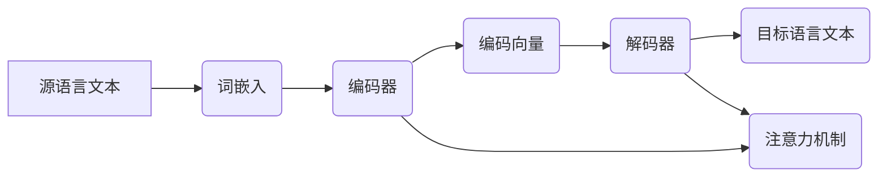

# AI Agent的多语言翻译能力：突破语言障碍

> 关键词：AI Agent、多语言翻译、语言障碍、翻译算法、应用场景

> 摘要：本文深入探讨了AI Agent的多语言翻译能力，旨在帮助读者全面了解其原理、实现方法以及在实际应用中的价值。首先介绍了相关背景知识，包括目的、预期读者、文档结构和术语表。接着阐述了核心概念与联系，通过文本示意图和Mermaid流程图展示其架构。详细讲解了核心算法原理和具体操作步骤，并使用Python代码进行说明。同时给出了数学模型和公式，结合实例进行解释。通过项目实战，展示了开发环境搭建、源代码实现和代码解读。分析了实际应用场景，推荐了学习资源、开发工具框架和相关论文著作。最后总结了未来发展趋势与挑战，提供了常见问题解答和扩展阅读参考资料。

## 1. 背景介绍 
### 1.1 目的和范围
在全球化的今天，语言障碍成为了信息交流和文化传播的一大阻碍。AI Agent的多语言翻译能力为解决这一问题提供了有效的途径。本文的目的在于深入剖析AI Agent实现多语言翻译的技术原理、方法和应用，涵盖从基础概念到实际项目的各个方面，让读者对这一领域有全面而深入的了解。范围包括核心算法、数学模型、开发实践以及实际应用场景等。

### 1.2 预期读者
本文预期读者包括对人工智能、自然语言处理和翻译技术感兴趣的技术人员、研究人员，以及希望了解AI Agent多语言翻译能力应用的企业管理人员和创业者。对于初学者，本文可以作为入门学习的资料；对于有一定基础的人员，本文可以提供深入研究的参考。

### 1.3 文档结构概述
本文首先介绍背景知识，让读者了解文章的目的和适用范围。接着阐述核心概念与联系，构建整体的知识框架。详细讲解核心算法原理和具体操作步骤，结合Python代码进行说明。给出数学模型和公式，并举例解释。通过项目实战，展示开发过程和代码实现。分析实际应用场景，为读者提供应用思路。推荐学习资源、开发工具框架和相关论文著作，帮助读者进一步深入学习。最后总结未来发展趋势与挑战，解答常见问题，并提供扩展阅读参考资料。

### 1.4 术语表
#### 1.4.1 核心术语定义
- **AI Agent**：人工智能代理，是一种能够感知环境、自主决策并采取行动以实现特定目标的智能实体。
- **多语言翻译**：将一种语言的文本准确、流畅地转换为另一种或多种语言的过程。
- **神经机器翻译（NMT）**：基于神经网络的机器翻译方法，通过学习大量的双语语料来实现翻译任务。
- **编码器 - 解码器架构**：一种常见的神经网络架构，用于处理序列到序列的任务，如翻译、文本生成等。

#### 1.4.2 相关概念解释
- **注意力机制**：在神经机器翻译中，注意力机制用于动态地分配输入序列中不同部分的权重，从而更好地捕捉输入和输出之间的对应关系。
- **词嵌入**：将单词转换为低维向量的表示方法，使得单词在向量空间中具有语义和语法信息。
- **语言模型**：用于预测语言序列中下一个单词的概率分布，在翻译中可以帮助生成更自然的译文。

#### 1.4.3 缩略词列表
- **NMT**：神经机器翻译（Neural Machine Translation）
- **RNN**：循环神经网络（Recurrent Neural Network）
- **LSTM**：长短期记忆网络（Long Short - Term Memory）
- **GRU**：门控循环单元（Gated Recurrent Unit）
- **Transformer**：一种基于注意力机制的神经网络架构

## 2. 核心概念与联系 

### 核心概念原理
AI Agent的多语言翻译主要基于神经机器翻译（NMT）技术。NMT使用神经网络模型来学习源语言和目标语言之间的映射关系。其核心思想是通过大量的双语语料训练一个端到端的模型，使得模型能够直接将源语言文本转换为目标语言文本。

常见的NMT架构是编码器 - 解码器架构。编码器负责将输入的源语言文本编码为一个固定长度的向量表示，解码器则根据这个向量表示生成目标语言文本。在这个过程中，注意力机制起到了关键作用，它允许解码器在生成每个目标单词时，动态地关注源语言文本中的不同部分。

### 架构的文本示意图
```plaintext
源语言文本 -> 编码器 -> 编码向量 -> 解码器 -> 目标语言文本
  |                     |
  |                     |
  v                     v
词嵌入               注意力机制
```

### Mermaid流程图


## 3. 核心算法原理 & 具体操作步骤 

### 核心算法原理
我们以Transformer架构为例，Transformer是一种基于注意力机制的神经网络架构，它在神经机器翻译中取得了很好的效果。Transformer的核心组件包括多头注意力机制和前馈神经网络。

多头注意力机制允许模型在不同的表示子空间中关注输入序列的不同部分。其数学公式如下：

$$
\text{MultiHead}(Q, K, V) = \text{Concat}(\text{head}_1, \cdots, \text{head}_h)W^O
$$

其中，$\text{head}_i = \text{Attention}(QW_i^Q, KW_i^K, VW_i^V)$，$\text{Attention}(Q, K, V) = \text{softmax}(\frac{QK^T}{\sqrt{d_k}})V$

前馈神经网络由两个线性层和一个激活函数组成，用于对注意力机制的输出进行进一步的变换。

### 具体操作步骤
#### 步骤1：数据预处理
将双语语料进行清洗、分词等操作，并将单词转换为词嵌入向量。
```python
import torch
import torch.nn as nn
from torchtext.data.utils import get_tokenizer
from torchtext.vocab import build_vocab_from_iterator

# 定义分词器
tokenizer = get_tokenizer('basic_english')

# 示例双语语料
src_texts = ["Hello, how are you?", "I am fine, thank you."]
tgt_texts = ["Bonjour, comment ça va ?", "Je vais bien, merci."]

# 构建词汇表
def yield_tokens(texts):
    for text in texts:
        yield tokenizer(text)

src_vocab = build_vocab_from_iterator(yield_tokens(src_texts), specials=['<unk>', '<pad>', '<bos>', '<eos>'])
tgt_vocab = build_vocab_from_iterator(yield_tokens(tgt_texts), specials=['<unk>', '<pad>', '<bos>', '<eos>'])

# 定义词嵌入层
src_embedding = nn.Embedding(len(src_vocab), 512)
tgt_embedding = nn.Embedding(len(tgt_vocab), 512)

# 分词并转换为词索引
src_tokens = [src_vocab(tokenizer(text)) for text in src_texts]
tgt_tokens = [tgt_vocab(tokenizer(text)) for text in tgt_texts]

# 转换为张量
src_tensor = torch.tensor(src_tokens, dtype=torch.long)
tgt_tensor = torch.tensor(tgt_tokens, dtype=torch.long)

# 词嵌入
src_embedded = src_embedding(src_tensor)
tgt_embedded = tgt_embedding(tgt_tensor)
```

#### 步骤2：编码器处理
使用Transformer编码器对源语言的词嵌入向量进行编码。
```python
from torch.nn import TransformerEncoder, TransformerEncoderLayer

# 定义编码器层
encoder_layer = TransformerEncoderLayer(d_model=512, nhead=8)
encoder = TransformerEncoder(encoder_layer, num_layers=6)

# 编码器处理
src_encoded = encoder(src_embedded)
```

#### 步骤3：解码器处理
使用Transformer解码器根据编码器的输出和目标语言的词嵌入向量生成目标语言文本。
```python
from torch.nn import TransformerDecoder, TransformerDecoderLayer

# 定义解码器层
decoder_layer = TransformerDecoderLayer(d_model=512, nhead=8)
decoder = TransformerDecoder(decoder_layer, num_layers=6)

# 解码器处理
tgt_mask = nn.Transformer.generate_square_subsequent_mask(tgt_embedded.size(1))
tgt_encoded = decoder(tgt_embedded, src_encoded, tgt_mask=tgt_mask)
```

#### 步骤4：生成目标语言文本
通过线性层将解码器的输出转换为词汇表中的概率分布，然后选择概率最大的单词作为输出。
```python
# 定义线性层
linear = nn.Linear(512, len(tgt_vocab))

# 生成概率分布
output = linear(tgt_encoded)
probabilities = torch.softmax(output, dim=-1)

# 选择概率最大的单词
predicted_indices = torch.argmax(probabilities, dim=-1)

# 转换为单词
predicted_texts = []
for indices in predicted_indices:
    words = [tgt_vocab.lookup_token(index.item()) for index in indices]
    predicted_texts.append(" ".join(words))

print(predicted_texts)
```

## 4. 数学模型和公式 & 详细讲解 & 举例说明 

### 词嵌入
词嵌入将单词转换为低维向量，使得单词在向量空间中具有语义和语法信息。假设词汇表大小为 $V$，词嵌入维度为 $d$，则词嵌入矩阵 $E$ 是一个 $V \times d$ 的矩阵。对于一个单词的索引 $i$，其词嵌入向量为 $E_i$。

例如，假设词汇表为 `['hello', 'world', 'how', 'are', 'you']`，词嵌入维度为 3，则词嵌入矩阵可能为：

$$
E = \begin{bmatrix}
0.1 & 0.2 & 0.3 \\
0.4 & 0.5 & 0.6 \\
0.7 & 0.8 & 0.9 \\
1.0 & 1.1 & 1.2 \\
1.3 & 1.4 & 1.5
\end{bmatrix}
$$

如果单词 `'hello'` 的索引为 0，则其词嵌入向量为 $[0.1, 0.2, 0.3]$。

### 注意力机制
注意力机制的核心公式为：

$$
\text{Attention}(Q, K, V) = \text{softmax}(\frac{QK^T}{\sqrt{d_k}})V
$$

其中，$Q$ 是查询矩阵，$K$ 是键矩阵，$V$ 是值矩阵，$d_k$ 是键向量的维度。

假设 $Q$ 是一个 $n \times d_k$ 的矩阵，$K$ 是一个 $m \times d_k$ 的矩阵，$V$ 是一个 $m \times d_v$ 的矩阵。则 $QK^T$ 是一个 $n \times m$ 的矩阵，通过除以 $\sqrt{d_k}$ 来缩放，然后使用 softmax 函数将其转换为概率分布，最后与 $V$ 相乘得到注意力输出。

例如，假设 $Q = \begin{bmatrix} 1 & 2 \\ 3 & 4 \end{bmatrix}$，$K = \begin{bmatrix} 5 & 6 \\ 7 & 8 \end{bmatrix}$，$V = \begin{bmatrix} 9 & 10 \\ 11 & 12 \end{bmatrix}$，$d_k = 2$。

首先计算 $QK^T$：

$$
QK^T = \begin{bmatrix} 1 & 2 \\ 3 & 4 \end{bmatrix} \begin{bmatrix} 5 & 7 \\ 6 & 8 \end{bmatrix} = \begin{bmatrix} 1\times5 + 2\times6 & 1\times7 + 2\times8 \\ 3\times5 + 4\times6 & 3\times7 + 4\times8 \end{bmatrix} = \begin{bmatrix} 17 & 23 \\ 39 & 53 \end{bmatrix}
$$

然后缩放：

$$
\frac{QK^T}{\sqrt{d_k}} = \frac{1}{\sqrt{2}} \begin{bmatrix} 17 & 23 \\ 39 & 53 \end{bmatrix} \approx \begin{bmatrix} 12.02 & 16.26 \\ 27.58 & 37.48 \end{bmatrix}
$$

接着使用 softmax 函数：

$$
\text{softmax}(\frac{QK^T}{\sqrt{d_k}}) \approx \begin{bmatrix} 0.0003 & 0.9997 \\ 0.0000 & 1.0000 \end{bmatrix}
$$

最后计算注意力输出：

$$
\text{Attention}(Q, K, V) = \text{softmax}(\frac{QK^T}{\sqrt{d_k}})V \approx \begin{bmatrix} 0.0003 & 0.9997 \\ 0.0000 & 1.0000 \end{bmatrix} \begin{bmatrix} 9 & 10 \\ 11 & 12 \end{bmatrix} \approx \begin{bmatrix} 10.9974 & 11.9964 \\ 11.0000 & 12.0000 \end{bmatrix}
$$

### 多头注意力机制
多头注意力机制将注意力机制应用多次，并将结果拼接起来。其公式为：

$$
\text{MultiHead}(Q, K, V) = \text{Concat}(\text{head}_1, \cdots, \text{head}_h)W^O
$$

其中，$\text{head}_i = \text{Attention}(QW_i^Q, KW_i^K, VW_i^V)$，$W_i^Q$，$W_i^K$，$W_i^V$ 是投影矩阵，$W^O$ 是输出投影矩阵。

### 前馈神经网络
前馈神经网络由两个线性层和一个激活函数组成，其公式为：

$$
FFN(x) = \text{max}(0, xW_1 + b_1)W_2 + b_2
$$

其中，$W_1$，$W_2$ 是权重矩阵，$b_1$，$b_2$ 是偏置向量。

## 5. 项目实战：代码实际案例和详细解释说明 

### 5.1  开发环境搭建
#### 安装Python
首先需要安装Python，建议使用Python 3.7及以上版本。可以从Python官方网站（https://www.python.org/downloads/）下载安装包进行安装。

#### 安装深度学习框架
我们使用PyTorch作为深度学习框架，可以通过以下命令安装：
```bash
pip install torch torchvision
```

#### 安装其他依赖库
还需要安装一些其他的依赖库，如 `torchtext` 用于数据处理：
```bash
pip install torchtext
```

### 5.2  源代码详细实现和代码解读
```python
import torch
import torch.nn as nn
from torchtext.data.utils import get_tokenizer
from torchtext.vocab import build_vocab_from_iterator
from torch.nn import TransformerEncoder, TransformerEncoderLayer, TransformerDecoder, TransformerDecoderLayer

# 定义分词器
tokenizer = get_tokenizer('basic_english')

# 示例双语语料
src_texts = ["Hello, how are you?", "I am fine, thank you."]
tgt_texts = ["Bonjour, comment ça va ?", "Je vais bien, merci."]

# 构建词汇表
def yield_tokens(texts):
    for text in texts:
        yield tokenizer(text)

src_vocab = build_vocab_from_iterator(yield_tokens(src_texts), specials=['<unk>', '<pad>', '<bos>', '<eos>'])
tgt_vocab = build_vocab_from_iterator(yield_tokens(tgt_texts), specials=['<unk>', '<pad>', '<bos>', '<eos>'])

# 定义词嵌入层
src_embedding = nn.Embedding(len(src_vocab), 512)
tgt_embedding = nn.Embedding(len(tgt_vocab), 512)

# 分词并转换为词索引
src_tokens = [src_vocab(tokenizer(text)) for text in src_texts]
tgt_tokens = [tgt_vocab(tokenizer(text)) for text in tgt_texts]

# 转换为张量
src_tensor = torch.tensor(src_tokens, dtype=torch.long)
tgt_tensor = torch.tensor(tgt_tokens, dtype=torch.long)

# 词嵌入
src_embedded = src_embedding(src_tensor)
tgt_embedded = tgt_embedding(tgt_tensor)

# 定义编码器层
encoder_layer = TransformerEncoderLayer(d_model=512, nhead=8)
encoder = TransformerEncoder(encoder_layer, num_layers=6)

# 编码器处理
src_encoded = encoder(src_embedded)

# 定义解码器层
decoder_layer = TransformerDecoderLayer(d_model=512, nhead=8)
decoder = TransformerDecoder(decoder_layer, num_layers=6)

# 解码器处理
tgt_mask = nn.Transformer.generate_square_subsequent_mask(tgt_embedded.size(1))
tgt_encoded = decoder(tgt_embedded, src_encoded, tgt_mask=tgt_mask)

# 定义线性层
linear = nn.Linear(512, len(tgt_vocab))

# 生成概率分布
output = linear(tgt_encoded)
probabilities = torch.softmax(output, dim=-1)

# 选择概率最大的单词
predicted_indices = torch.argmax(probabilities, dim=-1)

# 转换为单词
predicted_texts = []
for indices in predicted_indices:
    words = [tgt_vocab.lookup_token(index.item()) for index in indices]
    predicted_texts.append(" ".join(words))

print(predicted_texts)
```

### 代码解读与分析
#### 数据预处理部分
- `get_tokenizer('basic_english')`：使用基本的英语分词器对文本进行分词。
- `build_vocab_from_iterator`：根据分词后的文本构建词汇表，并添加特殊标记 `<unk>`（未知单词）、`<pad>`（填充标记）、`<bos>`（句子开始标记）和 `<eos>`（句子结束标记）。
- `nn.Embedding`：定义词嵌入层，将单词索引转换为词嵌入向量。

#### 编码器部分
- `TransformerEncoderLayer`：定义Transformer编码器层，包含多头注意力机制和前馈神经网络。
- `TransformerEncoder`：将多个编码器层堆叠起来，对源语言的词嵌入向量进行编码。

#### 解码器部分
- `TransformerDecoderLayer`：定义Transformer解码器层，包含多头注意力机制和前馈神经网络。
- `TransformerDecoder`：将多个解码器层堆叠起来，根据编码器的输出和目标语言的词嵌入向量生成目标语言文本。

#### 生成目标语言文本部分
- `nn.Linear`：定义线性层，将解码器的输出转换为词汇表中的概率分布。
- `torch.softmax`：将线性层的输出转换为概率分布。
- `torch.argmax`：选择概率最大的单词作为输出。

## 6. 实际应用场景 
### 跨境电商
在跨境电商中，AI Agent的多语言翻译能力可以帮助商家将商品信息、产品描述等内容翻译成多种语言，方便不同国家和地区的消费者了解商品。同时，也可以帮助客服人员与国外客户进行沟通，解决客户的问题。

### 国际会议
在国际会议中，AI Agent可以实时将演讲内容翻译成多种语言，让不同语言背景的参会者能够理解演讲内容。此外，还可以帮助参会者进行交流，打破语言障碍。

### 旅游行业
在旅游行业中，AI Agent的多语言翻译能力可以为游客提供翻译服务，帮助他们在国外旅游时更好地与当地人交流，了解当地的文化和风俗习惯。例如，在景点介绍、餐厅点餐、酒店入住等场景中都可以发挥作用。

### 教育领域
在教育领域，AI Agent可以将教材、学术论文等内容翻译成多种语言，促进国际学术交流和教育资源的共享。同时，也可以为学生提供翻译学习工具，帮助他们提高语言能力。

## 7. 工具和资源推荐
### 7.1 学习资源推荐
#### 7.1.1 书籍推荐
- 《深度学习》（Deep Learning）：由Ian Goodfellow、Yoshua Bengio和Aaron Courville所著，是深度学习领域的经典教材，涵盖了神经网络、卷积神经网络、循环神经网络等多个方面的内容。
- 《自然语言处理入门》（Natural Language Processing with Python）：介绍了使用Python进行自然语言处理的基本方法和技术，包括分词、词性标注、命名实体识别等。
- 《Attention Is All You Need》：这篇论文介绍了Transformer架构，是神经机器翻译领域的重要文献。

#### 7.1.2 在线课程
- Coursera上的“深度学习专项课程”（Deep Learning Specialization）：由Andrew Ng教授讲授，包括神经网络、卷积神经网络、循环神经网络等多个方面的内容。
- edX上的“自然语言处理基础”（Foundations of Natural Language Processing）：介绍了自然语言处理的基本概念、方法和技术。

#### 7.1.3 技术博客和网站
- Medium：上面有很多关于人工智能和自然语言处理的技术博客文章，可以了解到最新的研究成果和应用案例。
- arXiv：是一个预印本平台，上面可以找到很多关于人工智能和自然语言处理的最新研究论文。

### 7.2 开发工具框架推荐
#### 7.2.1 IDE和编辑器
- PyCharm：是一款专门用于Python开发的集成开发环境，具有代码编辑、调试、代码分析等功能。
- Jupyter Notebook：是一个交互式的开发环境，适合进行数据探索、模型训练和实验。

#### 7.2.2 调试和性能分析工具
- TensorBoard：是TensorFlow的可视化工具，可以用于可视化模型的训练过程、损失函数、准确率等指标。
- PyTorch Profiler：可以用于分析PyTorch模型的性能，找出性能瓶颈。

#### 7.2.3 相关框架和库
- PyTorch：是一个开源的深度学习框架，具有动态图和静态图两种模式，适合进行研究和开发。
- Hugging Face Transformers：提供了一系列预训练的模型和工具，方便进行自然语言处理任务，如翻译、文本生成等。

### 7.3 相关论文著作推荐
#### 7.3.1 经典论文
- 《Neural Machine Translation by Jointly Learning to Align and Translate》：提出了基于注意力机制的神经机器翻译模型。
- 《Sequence to Sequence Learning with Neural Networks》：介绍了编码器 - 解码器架构在序列到序列任务中的应用。

#### 7.3.2 最新研究成果
- 可以关注arXiv上关于神经机器翻译和多语言处理的最新论文，了解最新的研究进展。

#### 7.3.3 应用案例分析
- 可以参考一些企业的技术博客，了解AI Agent的多语言翻译能力在实际应用中的案例和经验。

## 8. 总结：未来发展趋势与挑战
### 未来发展趋势
- **多模态翻译**：未来的AI Agent可能不仅能够处理文本翻译，还能够处理图像、音频等多模态信息的翻译，实现更加全面的信息交流。
- **个性化翻译**：根据用户的语言习惯、背景知识等因素，提供个性化的翻译服务，提高翻译的准确性和满意度。
- **低资源语言翻译**：目前的翻译技术主要集中在高资源语言上，未来将更加关注低资源语言的翻译，促进全球语言的交流和传播。

### 挑战
- **语义理解**：虽然目前的神经机器翻译技术在很多情况下能够生成流畅的译文，但在语义理解方面还存在一定的不足，特别是对于一些复杂的语言表达和文化背景。
- **数据质量和数量**：高质量的双语语料是训练翻译模型的关键，但获取和标注大规模的双语语料是一个挑战。此外，不同语言的数据分布不均衡也会影响模型的性能。
- **计算资源需求**：神经机器翻译模型通常需要大量的计算资源进行训练和推理，这对于一些资源有限的设备和场景来说是一个挑战。

## 9. 附录：常见问题与解答
### 问题1：AI Agent的多语言翻译准确率如何？
答：AI Agent的多语言翻译准确率受到多种因素的影响，如语料质量、模型架构、训练方法等。在一些常见的语言对和领域中，翻译准确率已经达到了较高的水平，但在一些专业领域和复杂语言表达上，还存在一定的提升空间。

### 问题2：如何提高AI Agent的多语言翻译能力？
答：可以从以下几个方面提高AI Agent的多语言翻译能力：
- 使用更多高质量的双语语料进行训练。
- 采用更先进的模型架构和训练方法。
- 结合上下文信息和领域知识进行翻译。

### 问题3：AI Agent的多语言翻译是否能够替代人工翻译？
答：虽然AI Agent的多语言翻译能力在不断提高，但目前还不能完全替代人工翻译。在一些对翻译质量要求较高的场景，如文学翻译、法律文件翻译等，仍然需要人工翻译的专业知识和创造力。

## 10. 扩展阅读 & 参考资料
- 《Neural Machine Translation: Foundations and Models》
- 《Advances in Neural Information Processing Systems》
- Hugging Face官方文档（https://huggingface.co/docs/transformers/index）
- PyTorch官方文档（https://pytorch.org/docs/stable/index.html）