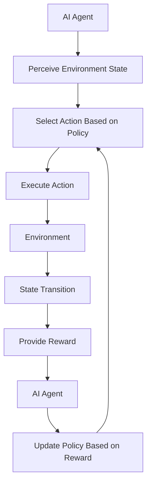

# AI Agent的强化学习在游戏AI中的进阶应用

> 关键词：AI Agent、强化学习、游戏AI、进阶应用、马尔可夫决策过程、策略梯度算法

> 摘要：本文深入探讨了AI Agent的强化学习在游戏AI中的进阶应用。首先介绍了相关背景知识，包括目的范围、预期读者等。接着阐述了核心概念与联系，通过文本示意图和Mermaid流程图进行说明。详细讲解了核心算法原理，并用Python代码进行阐述，同时给出了数学模型和公式。通过项目实战展示了代码的实际应用并进行详细解读。分析了实际应用场景，推荐了学习、开发相关的工具和资源。最后总结了未来发展趋势与挑战，并给出常见问题解答和扩展阅读参考资料，旨在为读者全面呈现AI Agent强化学习在游戏AI领域的深入应用。

## 1. 背景介绍 
### 1.1 目的和范围
在当今的游戏开发领域，游戏AI的质量和智能程度对于游戏的趣味性和玩家体验起着至关重要的作用。传统的游戏AI设计方法往往依赖于硬编码规则，难以应对复杂多变的游戏环境和玩家行为。而强化学习作为一种强大的机器学习技术，能够使AI Agent通过与环境的交互不断学习最优策略，从而在游戏中表现出更加智能和灵活的行为。

本文的目的在于深入探讨AI Agent的强化学习在游戏AI中的进阶应用，不仅涵盖了基本的强化学习概念和算法，还会涉及到一些前沿的技术和方法，如深度强化学习、多智能体强化学习等。通过详细的理论讲解、代码实现和实际案例分析，帮助读者全面了解如何将强化学习应用于游戏AI的开发中，提升游戏AI的性能和智能水平。

### 1.2 预期读者
本文适合以下几类读者：
- **游戏开发者**：希望通过引入强化学习技术来提升游戏AI的智能程度，为玩家带来更加丰富和有趣的游戏体验。
- **机器学习爱好者**：对强化学习在实际应用中的表现感兴趣，尤其是在游戏领域的应用。
- **研究人员**：从事强化学习、游戏AI等相关领域的研究工作，希望了解最新的技术进展和应用案例。

### 1.3 文档结构概述
本文将按照以下结构进行组织：
- **核心概念与联系**：介绍AI Agent、强化学习和游戏AI的基本概念，以及它们之间的联系，通过文本示意图和Mermaid流程图进行详细说明。
- **核心算法原理 & 具体操作步骤**：讲解强化学习中的核心算法，如Q学习、策略梯度算法等，并使用Python代码进行详细实现和解释。
- **数学模型和公式 & 详细讲解 & 举例说明**：介绍强化学习中的数学模型，如马尔可夫决策过程（MDP），并给出相关的公式和详细的解释，通过具体的例子进行说明。
- **项目实战：代码实际案例和详细解释说明**：通过一个具体的游戏AI项目，展示如何使用强化学习来训练AI Agent，包括开发环境搭建、源代码实现和代码解读。
- **实际应用场景**：分析强化学习在不同类型游戏中的应用场景，如策略游戏、动作游戏等。
- **工具和资源推荐**：推荐一些学习强化学习和开发游戏AI的工具和资源，包括书籍、在线课程、开发工具框架等。
- **总结：未来发展趋势与挑战**：总结强化学习在游戏AI中的应用现状，分析未来的发展趋势和面临的挑战。
- **附录：常见问题与解答**：解答读者在学习和应用强化学习过程中常见的问题。
- **扩展阅读 & 参考资料**：提供一些扩展阅读的建议和相关的参考资料。

### 1.4 术语表
#### 1.4.1 核心术语定义
- **AI Agent**：指能够感知环境、做出决策并与环境进行交互的智能体。在游戏AI中，AI Agent可以是游戏中的角色、敌人等。
- **强化学习**：一种机器学习范式，通过智能体与环境的交互，根据环境反馈的奖励信号来学习最优策略。
- **游戏AI**：指游戏中用于控制非玩家角色（NPC）行为的人工智能技术。
- **马尔可夫决策过程（MDP）**：一种用于描述强化学习问题的数学模型，由状态、动作、奖励和转移概率组成。
- **策略**：指智能体在每个状态下选择动作的规则。
- **价值函数**：用于评估智能体在某个状态下的价值，分为状态价值函数和动作价值函数。

#### 1.4.2 相关概念解释
- **状态**：指游戏环境在某一时刻的描述，包括游戏角色的位置、状态、游戏场景等信息。
- **动作**：指AI Agent在某个状态下可以采取的行为，如移动、攻击、防御等。
- **奖励**：指环境在AI Agent采取某个动作后给予的反馈信号，用于表示该动作的好坏。
- **策略梯度**：一种用于优化策略的算法，通过计算策略的梯度来更新策略参数。

#### 1.4.3 缩略词列表
- **MDP**：Markov Decision Process（马尔可夫决策过程）
- **Q-learning**：Q学习
- **DQN**：Deep Q-Network（深度Q网络）
- **A2C**：Advantage Actor-Critic（优势演员-评论家算法）
- **PPO**：Proximal Policy Optimization（近端策略优化算法）

## 2. 核心概念与联系 
### 核心概念原理
#### AI Agent
AI Agent是一个能够感知环境、做出决策并与环境进行交互的实体。在游戏AI中，AI Agent可以是游戏中的角色、敌人等。AI Agent通过传感器感知游戏环境的状态，然后根据一定的策略选择合适的动作，最后执行动作并与环境进行交互。环境会根据AI Agent的动作给出相应的奖励信号，AI Agent根据奖励信号来调整自己的策略，以获得更多的奖励。

#### 强化学习
强化学习是一种机器学习范式，其核心思想是智能体通过与环境的交互，根据环境反馈的奖励信号来学习最优策略。在强化学习中，智能体在每个时间步观察环境的状态，选择一个动作执行，环境根据智能体的动作转移到下一个状态，并给予智能体一个奖励。智能体的目标是通过不断地与环境交互，学习到一个最优策略，使得长期累积奖励最大化。

#### 游戏AI
游戏AI是指游戏中用于控制非玩家角色（NPC）行为的人工智能技术。传统的游戏AI设计方法往往依赖于硬编码规则，如有限状态机（FSM）、行为树等。这些方法虽然简单有效，但缺乏灵活性和适应性，难以应对复杂多变的游戏环境和玩家行为。而强化学习技术可以使游戏AI通过与环境的交互不断学习最优策略，从而在游戏中表现出更加智能和灵活的行为。

### 架构的文本示意图
```plaintext
+----------------+          +----------------+          +----------------+
|    AI Agent    |          |   Environment  |          |    Reward      |
+----------------+          +----------------+          +----------------+
| - Perception   | -------> | - State        |          | - Feedback     |
| - Decision     | <------- | - Transition   | <------- |                |
| - Action       |          |                |          |                |
+----------------+          +----------------+          +----------------+
```
在这个示意图中，AI Agent通过感知（Perception）获取环境的状态（State），然后根据一定的决策（Decision）选择一个动作（Action）执行。环境根据AI Agent的动作进行状态转移（Transition），并给予AI Agent一个奖励（Reward）作为反馈。AI Agent根据奖励信号来调整自己的决策策略，以获得更多的奖励。

### Mermaid流程图

这个流程图展示了AI Agent与环境的交互过程。AI Agent首先感知环境的状态，然后根据当前的策略选择一个动作执行。环境根据AI Agent的动作进行状态转移，并给予AI Agent一个奖励。AI Agent根据奖励信号更新自己的策略，然后重复这个过程，不断学习和优化自己的行为。

## 3. 核心算法原理 & 具体操作步骤 
### Q学习算法原理
Q学习是一种基于值函数的强化学习算法，其目标是学习一个最优的动作价值函数 $Q(s, a)$，表示在状态 $s$ 下采取动作 $a$ 的预期累积奖励。Q学习算法通过不断地更新 $Q$ 值来逼近最优动作价值函数。

Q学习的更新公式如下：
$$Q(s_t, a_t) \leftarrow Q(s_t, a_t) + \alpha [r_{t+1} + \gamma \max_{a} Q(s_{t+1}, a) - Q(s_t, a_t)]$$
其中，$s_t$ 是当前状态，$a_t$ 是当前动作，$r_{t+1}$ 是执行动作 $a_t$ 后获得的奖励，$s_{t+1}$ 是下一个状态，$\alpha$ 是学习率，$\gamma$ 是折扣因子。

### Q学习算法的Python实现
```python
import numpy as np

class QLearningAgent:
    def __init__(self, state_size, action_size, learning_rate=0.1, discount_factor=0.9):
        self.state_size = state_size
        self.action_size = action_size
        self.learning_rate = learning_rate
        self.discount_factor = discount_factor
        self.q_table = np.zeros((state_size, action_size))

    def choose_action(self, state, epsilon=0.1):
        if np.random.uniform(0, 1) < epsilon:
            # 探索：随机选择一个动作
            action = np.random.choice(self.action_size)
        else:
            # 利用：选择Q值最大的动作
            action = np.argmax(self.q_table[state, :])
        return action

    def update_q_table(self, state, action, reward, next_state):
        # 根据Q学习更新公式更新Q表
        max_q_next = np.max(self.q_table[next_state, :])
        self.q_table[state, action] += self.learning_rate * (reward + self.discount_factor * max_q_next - self.q_table[state, action])

# 示例使用
state_size = 10
action_size = 4
agent = QLearningAgent(state_size, action_size)

state = 0
action = agent.choose_action(state)
next_state = 1
reward = 1
agent.update_q_table(state, action, reward, next_state)
```
### 代码解释
- `__init__` 方法：初始化Q学习代理，包括状态空间大小、动作空间大小、学习率、折扣因子和Q表。
- `choose_action` 方法：根据当前状态选择一个动作，使用 $\epsilon$-贪心策略进行探索和利用的平衡。
- `update_q_table` 方法：根据Q学习的更新公式更新Q表。

### 策略梯度算法原理
策略梯度算法是一种基于策略的强化学习算法，其目标是直接优化策略 $\pi(a|s)$，即智能体在状态 $s$ 下选择动作 $a$ 的概率分布。策略梯度算法通过计算策略的梯度来更新策略参数，使得长期累积奖励最大化。

策略梯度的更新公式如下：
$$\theta \leftarrow \theta + \alpha \nabla_{\theta} J(\theta)$$
其中，$\theta$ 是策略的参数，$\alpha$ 是学习率，$J(\theta)$ 是策略的目标函数，通常定义为长期累积奖励的期望。

### 策略梯度算法的Python实现
```python
import torch
import torch.nn as nn
import torch.optim as optim

class PolicyNetwork(nn.Module):
    def __init__(self, state_size, action_size):
        super(PolicyNetwork, self).__init__()
        self.fc1 = nn.Linear(state_size, 128)
        self.fc2 = nn.Linear(128, action_size)
        self.softmax = nn.Softmax(dim=-1)

    def forward(self, x):
        x = torch.relu(self.fc1(x))
        x = self.fc2(x)
        action_probs = self.softmax(x)
        return action_probs

class PolicyGradientAgent:
    def __init__(self, state_size, action_size, learning_rate=0.001):
        self.state_size = state_size
        self.action_size = action_size
        self.policy_network = PolicyNetwork(state_size, action_size)
        self.optimizer = optim.Adam(self.policy_network.parameters(), lr=learning_rate)

    def choose_action(self, state):
        state = torch.FloatTensor(state).unsqueeze(0)
        action_probs = self.policy_network(state)
        action = torch.multinomial(action_probs, 1).item()
        return action

    def update_policy(self, states, actions, rewards):
        states = torch.FloatTensor(states)
        actions = torch.LongTensor(actions)
        rewards = torch.FloatTensor(rewards)

        action_probs = self.policy_network(states)
        log_probs = torch.log(action_probs.gather(1, actions.unsqueeze(1)).squeeze(1))
        loss = -(log_probs * rewards).mean()

        self.optimizer.zero_grad()
        loss.backward()
        self.optimizer.step()

# 示例使用
state_size = 10
action_size = 4
agent = PolicyGradientAgent(state_size, action_size)

states = [np.random.rand(state_size) for _ in range(10)]
actions = [agent.choose_action(state) for state in states]
rewards = [np.random.rand() for _ in range(10)]

agent.update_policy(states, actions, rewards)
```
### 代码解释
- `PolicyNetwork` 类：定义了一个简单的神经网络，用于表示策略 $\pi(a|s)$。
- `PolicyGradientAgent` 类：初始化策略网络和优化器，提供选择动作和更新策略的方法。
- `choose_action` 方法：根据当前状态选择一个动作，使用多项式采样从策略分布中选择动作。
- `update_policy` 方法：根据策略梯度的更新公式更新策略网络的参数。

## 4. 数学模型和公式 & 详细讲解 & 举例说明 
### 马尔可夫决策过程（MDP）
马尔可夫决策过程（MDP）是一种用于描述强化学习问题的数学模型，由以下几个部分组成：
- **状态空间 $S$**：表示环境的所有可能状态。
- **动作空间 $A$**：表示智能体在每个状态下可以采取的所有可能动作。
- **转移概率 $P(s'|s, a)$**：表示在状态 $s$ 下采取动作 $a$ 后转移到状态 $s'$ 的概率。
- **奖励函数 $R(s, a, s')$**：表示在状态 $s$ 下采取动作 $a$ 并转移到状态 $s'$ 后获得的奖励。
- **折扣因子 $\gamma$**：用于权衡当前奖励和未来奖励的重要性，取值范围为 $[0, 1]$。

MDP的目标是找到一个最优策略 $\pi^*(a|s)$，使得长期累积奖励最大化。长期累积奖励可以表示为：
$$G_t = \sum_{k=0}^{\infty} \gamma^k r_{t+k+1}$$
其中，$r_{t+k+1}$ 是在时间步 $t + k + 1$ 获得的奖励。

### 状态价值函数和动作价值函数
- **状态价值函数 $V^{\pi}(s)$**：表示在策略 $\pi$ 下，从状态 $s$ 开始的长期累积奖励的期望。
$$V^{\pi}(s) = \mathbb{E}_{\pi} [G_t | s_t = s]$$
- **动作价值函数 $Q^{\pi}(s, a)$**：表示在策略 $\pi$ 下，从状态 $s$ 开始采取动作 $a$ 后的长期累积奖励的期望。
$$Q^{\pi}(s, a) = \mathbb{E}_{\pi} [G_t | s_t = s, a_t = a]$$

状态价值函数和动作价值函数之间的关系为：
$$V^{\pi}(s) = \sum_{a \in A} \pi(a|s) Q^{\pi}(s, a)$$

### 贝尔曼方程
贝尔曼方程是强化学习中的核心方程，用于描述状态价值函数和动作价值函数的递归关系。
- **状态价值函数的贝尔曼方程**：
$$V^{\pi}(s) = \sum_{a \in A} \pi(a|s) \sum_{s' \in S} P(s'|s, a) [R(s, a, s') + \gamma V^{\pi}(s')]$$
- **动作价值函数的贝尔曼方程**：
$$Q^{\pi}(s, a) = \sum_{s' \in S} P(s'|s, a) [R(s, a, s') + \gamma \sum_{a' \in A} \pi(a'|s') Q^{\pi}(s', a')]$$

### 举例说明
考虑一个简单的格子世界游戏，智能体在一个 $3 \times 3$ 的格子中移动，目标是从起点 $(0, 0)$ 移动到终点 $(2, 2)$。智能体可以采取四个动作：上、下、左、右。如果智能体移动到终点，获得奖励 $+1$，否则获得奖励 $-0.1$。

- **状态空间 $S$**：共有 $9$ 个状态，每个状态表示智能体在格子中的位置。
- **动作空间 $A$**：共有 $4$ 个动作，分别表示上、下、左、右。
- **转移概率 $P(s'|s, a)$**：如果动作合法，转移到目标状态的概率为 $1$，否则停留在当前状态。
- **奖励函数 $R(s, a, s')$**：如果 $s'$ 是终点，奖励为 $+1$，否则为 $-0.1$。
- **折扣因子 $\gamma$**：设为 $0.9$。

假设智能体采取随机策略 $\pi$，即每个动作的选择概率相等。我们可以使用贝尔曼方程来计算状态价值函数 $V^{\pi}(s)$。

以状态 $(0, 0)$ 为例，智能体可以采取四个动作：上、下、左、右。如果采取上动作，由于越界，停留在当前状态，奖励为 $-0.1$；如果采取下动作，转移到状态 $(1, 0)$，奖励为 $-0.1$；如果采取左动作，越界停留在当前状态，奖励为 $-0.1$；如果采取右动作，转移到状态 $(0, 1)$，奖励为 $-0.1$。

根据状态价值函数的贝尔曼方程：
$$V^{\pi}((0, 0)) = \frac{1}{4} \sum_{a \in A} \sum_{s' \in S} P(s'|(0, 0), a) [R((0, 0), a, s') + \gamma V^{\pi}(s')]$$

通过不断迭代贝尔曼方程，可以收敛到最优状态价值函数 $V^*(s)$ 和最优动作价值函数 $Q^*(s, a)$，从而得到最优策略 $\pi^*(a|s)$。

## 5. 项目实战：代码实际案例和详细解释说明 
### 5.1  开发环境搭建
#### 安装Python
首先，确保你已经安装了Python 3.x版本。可以从Python官方网站（https://www.python.org/downloads/）下载并安装。

#### 安装必要的库
我们将使用一些常见的Python库来实现游戏AI，包括 `numpy`、`torch` 等。可以使用以下命令来安装这些库：
```sh
pip install numpy torch gym
```
其中，`gym` 是一个用于开发和比较强化学习算法的工具包，提供了许多经典的游戏环境。

### 5.2  源代码详细实现和代码解读
我们将使用OpenAI Gym中的 `CartPole-v1` 环境来展示如何使用强化学习训练一个AI Agent。`CartPole-v1` 是一个经典的控制问题，智能体需要控制一个小车在轨道上左右移动，以保持杆子的平衡。

```python
import gym
import torch
import torch.nn as nn
import torch.optim as optim
import numpy as np

# 定义策略网络
class PolicyNetwork(nn.Module):
    def __init__(self, state_size, action_size):
        super(PolicyNetwork, self).__init__()
        self.fc1 = nn.Linear(state_size, 128)
        self.fc2 = nn.Linear(128, action_size)
        self.softmax = nn.Softmax(dim=-1)

    def forward(self, x):
        x = torch.relu(self.fc1(x))
        x = self.fc2(x)
        action_probs = self.softmax(x)
        return action_probs

# 定义策略梯度代理
class PolicyGradientAgent:
    def __init__(self, state_size, action_size, learning_rate=0.001, discount_factor=0.99):
        self.state_size = state_size
        self.action_size = action_size
        self.policy_network = PolicyNetwork(state_size, action_size)
        self.optimizer = optim.Adam(self.policy_network.parameters(), lr=learning_rate)
        self.discount_factor = discount_factor

    def choose_action(self, state):
        state = torch.FloatTensor(state).unsqueeze(0)
        action_probs = self.policy_network(state)
        action = torch.multinomial(action_probs, 1).item()
        return action

    def update_policy(self, states, actions, rewards):
        states = torch.FloatTensor(states)
        actions = torch.LongTensor(actions)

        # 计算折扣奖励
        discounted_rewards = []
        running_add = 0
        for r in reversed(rewards):
            running_add = r + self.discount_factor * running_add
            discounted_rewards.insert(0, running_add)
        discounted_rewards = torch.FloatTensor(discounted_rewards)

        # 归一化折扣奖励
        discounted_rewards = (discounted_rewards - discounted_rewards.mean()) / (discounted_rewards.std() + 1e-9)

        action_probs = self.policy_network(states)
        log_probs = torch.log(action_probs.gather(1, actions.unsqueeze(1)).squeeze(1))
        loss = -(log_probs * discounted_rewards).mean()

        self.optimizer.zero_grad()
        loss.backward()
        self.optimizer.step()

# 训练代理
def train_agent():
    env = gym.make('CartPole-v1')
    state_size = env.observation_space.shape[0]
    action_size = env.action_space.n
    agent = PolicyGradientAgent(state_size, action_size)

    num_episodes = 1000
    for episode in range(num_episodes):
        state = env.reset()
        states, actions, rewards = [], [], []
        done = False

        while not done:
            action = agent.choose_action(state)
            next_state, reward, done, _ = env.step(action)

            states.append(state)
            actions.append(action)
            rewards.append(reward)

            state = next_state

        agent.update_policy(states, actions, rewards)

        total_reward = sum(rewards)
        print(f"Episode {episode}: Total Reward = {total_reward}")

    env.close()

if __name__ == "__main__":
    train_agent()
```
### 5.3  代码解读与分析
- **PolicyNetwork类**：定义了一个简单的神经网络，用于表示策略 $\pi(a|s)$。网络包含两个全连接层，最后一层使用Softmax函数输出动作概率分布。
- **PolicyGradientAgent类**：初始化策略网络和优化器，提供选择动作和更新策略的方法。
    - `choose_action` 方法：根据当前状态选择一个动作，使用多项式采样从策略分布中选择动作。
    - `update_policy` 方法：根据策略梯度的更新公式更新策略网络的参数。在更新过程中，首先计算折扣奖励并进行归一化处理，然后计算损失函数并进行反向传播更新参数。
- **train_agent函数**：训练代理的主函数，创建环境和代理，进行多轮训练。在每一轮训练中，代理与环境进行交互，记录状态、动作和奖励，然后根据这些信息更新策略。

通过不断训练，代理可以学习到一个最优策略，使得在 `CartPole-v1` 环境中获得更高的累积奖励。

## 6. 实际应用场景 
### 策略游戏
在策略游戏中，如《文明》系列、《全面战争》系列等，AI Agent需要制定长期的战略和战术决策，包括资源管理、领土扩张、军事行动等。强化学习可以帮助AI Agent通过与环境的交互不断学习最优策略，从而在复杂的游戏环境中表现出更加智能的决策能力。例如，AI Agent可以学习如何合理分配资源，选择最佳的攻击时机和目标，以及如何应对不同的对手策略。

### 动作游戏
在动作游戏中，如《街头霸王》、《英雄联盟》等，AI Agent需要在短时间内做出快速的反应和决策，包括攻击、防御、躲避等。强化学习可以使AI Agent通过不断的训练学习到最优的动作策略，提高其在战斗中的表现。例如，AI Agent可以学习如何根据对手的动作和状态选择最佳的攻击和防御时机，以及如何在复杂的战斗场景中灵活应对。

### 角色扮演游戏
在角色扮演游戏中，如《魔兽世界》、《塞尔达传说》系列等，AI Agent需要模拟人类角色的行为和决策，包括任务选择、技能使用、社交互动等。强化学习可以帮助AI Agent学习到如何根据不同的游戏情境和玩家行为做出合理的决策，从而为玩家提供更加真实和丰富的游戏体验。例如，AI Agent可以学习如何根据任务的难度和奖励选择合适的任务，以及如何与其他角色进行有效的社交互动。

### 模拟游戏
在模拟游戏中，如《模拟城市》、《过山车之星》等，AI Agent需要管理和控制复杂的系统，包括城市建设、资源分配、人口管理等。强化学习可以使AI Agent通过与环境的交互学习到最优的管理策略，提高系统的效率和稳定性。例如，AI Agent可以学习如何合理规划城市布局，优化资源分配，以及应对各种突发事件。

## 7. 工具和资源推荐
### 7.1 学习资源推荐
#### 7.1.1 书籍推荐
- 《强化学习：原理与Python实现》：本书系统地介绍了强化学习的基本原理和算法，并通过Python代码进行详细实现和解释，适合初学者入门。
- 《Reinforcement Learning: An Introduction》（《强化学习：入门》）：由强化学习领域的两位权威学者Richard S. Sutton和Andrew G. Barto所著，是强化学习领域的经典教材，涵盖了强化学习的基本概念、算法和应用。
- 《Deep Reinforcement Learning Hands-On》（《深度强化学习实战》）：本书详细介绍了深度强化学习的原理和应用，通过大量的实例和代码帮助读者掌握深度强化学习的技术。

#### 7.1.2 在线课程
- Coursera上的《Reinforcement Learning Specialization》：由University of Alberta开设的强化学习专项课程，包括多门课程，涵盖了强化学习的基本概念、算法和应用。
- edX上的《Introduction to Reinforcement Learning》：由UC Berkeley开设的强化学习入门课程，介绍了强化学习的基本原理和算法。
- OpenAI Gym官方文档和教程：OpenAI Gym是一个用于开发和比较强化学习算法的工具包，其官方文档和教程提供了丰富的学习资源和示例代码。

#### 7.1.3 技术博客和网站
- OpenAI博客：OpenAI是人工智能领域的领先研究机构，其博客发布了许多关于强化学习和人工智能的最新研究成果和技术文章。
- DeepMind博客：DeepMind是一家专注于人工智能研究的公司，其博客发布了许多关于强化学习和深度学习的研究成果和应用案例。
- Medium上的强化学习相关文章：Medium是一个技术博客平台，上面有许多关于强化学习的优秀文章和教程。

### 7.2 开发工具框架推荐
#### 7.2.1 IDE和编辑器
- PyCharm：一款功能强大的Python集成开发环境，提供了代码编辑、调试、版本控制等功能，适合开发强化学习项目。
- Jupyter Notebook：一个交互式的开发环境，支持Python代码的编写、运行和可视化，适合进行强化学习算法的实验和验证。
- Visual Studio Code：一款轻量级的代码编辑器，支持多种编程语言和插件，适合快速开发和调试强化学习代码。

#### 7.2.2 调试和性能分析工具
- TensorBoard：TensorFlow的可视化工具，可以用于可视化训练过程中的损失函数、奖励曲线等指标，帮助开发者调试和优化模型。
- PyTorch Profiler：PyTorch提供的性能分析工具，可以帮助开发者分析模型的运行时间和内存使用情况，优化模型性能。
- cProfile：Python标准库中的性能分析工具，可以用于分析Python代码的运行时间和函数调用情况。

#### 7.2.3 相关框架和库
- OpenAI Gym：一个用于开发和比较强化学习算法的工具包，提供了许多经典的游戏环境和基准测试。
- Stable Baselines3：一个基于PyTorch的强化学习库，提供了许多常用的强化学习算法的实现，如A2C、PPO等，方便开发者快速搭建和训练强化学习模型。
- Ray RLlib：一个可扩展的强化学习库，支持多种深度学习框架，如TensorFlow和PyTorch，提供了分布式训练和多智能体学习的功能。

### 7.3 相关论文著作推荐
#### 7.3.1 经典论文
- “Q-learning”（Watkins, 1989）：提出了Q学习算法，是基于值函数的强化学习算法的经典之作。
- “Policy Gradient Methods for Reinforcement Learning with Function Approximation”（Sutton et al., 2000）：提出了策略梯度算法，为基于策略的强化学习算法奠定了基础。
- “Playing Atari with Deep Reinforcement Learning”（Mnih et al., 2013）：提出了深度Q网络（DQN）算法，将深度学习与强化学习相结合，在Atari游戏上取得了显著的成果。

#### 7.3.2 最新研究成果
- “Proximal Policy Optimization Algorithms”（Schulman et al., 2017）：提出了近端策略优化（PPO）算法，是一种高效的策略梯度算法，在许多强化学习任务中取得了优异的性能。
- “Soft Actor-Critic: Off-Policy Maximum Entropy Deep Reinforcement Learning with a Stochastic Actor”（Haarnoja et al., 2018）：提出了软演员-评论家（SAC）算法，是一种基于最大熵原理的离线强化学习算法，具有良好的稳定性和样本效率。
- “Mastering the Game of Go without Human Knowledge”（Silver et al., 2017）：介绍了AlphaGo Zero的研究成果，通过强化学习和自学习的方式在围棋游戏中取得了超越人类的表现。

#### 7.3.3 应用案例分析
- “Using Deep Reinforcement Learning to Play StarCraft II”（Vinyals et al., 2019）：介绍了DeepMind团队使用深度强化学习训练AI Agent在《星际争霸II》游戏中取得优异成绩的研究成果。
- “Deep Reinforcement Learning for Autonomous Driving”（Lillicrap et al., 2016）：探讨了深度强化学习在自动驾驶领域的应用，通过强化学习训练自动驾驶车辆的决策策略。
- “Reinforcement Learning in Robotics: A Survey”（Kober et al., 2013）：对强化学习在机器人领域的应用进行了综述，介绍了强化学习在机器人控制、运动规划等方面的应用案例。

## 8. 总结：未来发展趋势与挑战
### 未来发展趋势
#### 多智能体强化学习
随着游戏的复杂性不断增加，多智能体系统在游戏中的应用越来越广泛。多智能体强化学习可以使多个AI Agent在游戏中进行协作和竞争，从而模拟更加真实和复杂的游戏场景。未来，多智能体强化学习将在策略游戏、团队竞技游戏等领域得到更深入的应用。

#### 深度强化学习与其他技术的融合
深度强化学习与其他技术的融合将是未来的一个重要发展趋势。例如，将深度强化学习与计算机视觉、自然语言处理等技术相结合，可以使AI Agent在游戏中具备更强的感知和理解能力。此外，将深度强化学习与元学习、迁移学习等技术相结合，可以提高AI Agent的学习效率和泛化能力。

#### 可解释性强化学习
在游戏AI中，可解释性是一个重要的问题。玩家和开发者需要了解AI Agent的决策过程和行为动机，以便更好地与AI Agent进行交互和调试。未来，可解释性强化学习将成为一个研究热点，通过开发可解释的强化学习算法和模型，提高AI Agent的可解释性和透明度。

#### 基于真实世界数据的强化学习
目前，大部分强化学习研究都是基于模拟环境进行的。未来，基于真实世界数据的强化学习将得到更多的关注。通过收集和利用真实世界的游戏数据，如玩家行为数据、游戏日志数据等，可以训练更加真实和有效的AI Agent，提高游戏AI的性能和智能水平。

### 面临的挑战
#### 样本效率问题
强化学习通常需要大量的样本才能学习到有效的策略，这在实际应用中往往是一个挑战。特别是在复杂的游戏环境中，收集和存储大量的样本需要耗费大量的时间和资源。因此，提高强化学习的样本效率是一个亟待解决的问题。

#### 环境建模问题
在实际游戏中，环境往往是复杂和不确定的，很难进行精确的建模。此外，游戏环境可能会随着时间的推移而发生变化，如游戏规则的更新、新角色的加入等。如何在不确定和动态的环境中训练有效的AI Agent是一个挑战。

#### 伦理和安全问题
随着AI Agent在游戏中的应用越来越广泛，伦理和安全问题也越来越受到关注。例如，AI Agent的行为可能会对玩家造成不良影响，如过度暴力、欺诈等。此外，AI Agent的决策过程可能会受到攻击和干扰，导致安全问题。因此，如何确保AI Agent的行为符合伦理和安全标准是一个重要的问题。

#### 计算资源问题
深度强化学习通常需要大量的计算资源来训练模型，特别是在处理大规模的游戏环境和复杂的神经网络时。如何在有限的计算资源下提高强化学习的训练效率和性能是一个挑战。

## 9. 附录：常见问题与解答
### 1. 强化学习和监督学习有什么区别？
监督学习是一种基于标记数据的机器学习方法，通过给定输入和对应的输出标签，训练模型来预测新的输入对应的输出。而强化学习是一种通过智能体与环境的交互，根据环境反馈的奖励信号来学习最优策略的机器学习方法。监督学习的目标是最小化预测误差，而强化学习的目标是最大化长期累积奖励。

### 2. 如何选择合适的强化学习算法？
选择合适的强化学习算法需要考虑多个因素，如问题的复杂度、环境的类型、样本效率要求等。一般来说，如果问题的状态空间和动作空间较小，可以考虑使用基于值函数的算法，如Q学习；如果问题的状态空间和动作空间较大，可以考虑使用基于策略的算法，如策略梯度算法。此外，还可以根据问题的特点选择合适的算法变体，如深度Q网络（DQN）、近端策略优化（PPO）等。

### 3. 如何设置强化学习中的超参数？
设置强化学习中的超参数是一个经验性的过程，需要根据具体的问题和算法进行调整。常见的超参数包括学习率、折扣因子、探索率等。一般来说，可以通过网格搜索、随机搜索等方法来寻找最优的超参数组合。此外，还可以参考相关的研究论文和开源代码，借鉴他人的经验和设置。

### 4. 强化学习在实际游戏开发中的应用有哪些难点？
强化学习在实际游戏开发中的应用面临着一些难点，如样本效率问题、环境建模问题、伦理和安全问题等。此外，游戏开发通常需要考虑性能、可维护性等因素，如何将强化学习算法集成到现有的游戏开发框架中也是一个挑战。

### 5. 如何评估强化学习模型的性能？
评估强化学习模型的性能可以使用多种指标，如累积奖励、胜率、平均步数等。一般来说，可以在训练过程中记录这些指标的变化，观察模型的学习效果。此外，还可以使用测试集或验证集来评估模型的泛化能力。

## 10. 扩展阅读 & 参考资料
### 扩展阅读
- 《Artificial Intelligence: A Modern Approach》（《人工智能：一种现代的方法》）：这本书是人工智能领域的经典教材，涵盖了人工智能的各个方面，包括搜索算法、知识表示、机器学习、自然语言处理等。对于理解强化学习的背景和应用有很大的帮助。
- 《Deep Learning》（《深度学习》）：由Ian Goodfellow、Yoshua Bengio和Aaron Courville所著，是深度学习领域的经典教材，详细介绍了深度学习的基本原理、算法和应用。对于深入理解深度强化学习有很大的帮助。
- 《Game AI Pro》系列书籍：这是一套关于游戏AI开发的专业书籍，涵盖了游戏AI的各个方面，包括路径规划、行为树、状态机、强化学习等。对于游戏开发者来说是一本很好的参考书籍。

### 参考资料
- OpenAI官方网站：https://openai.com/
- DeepMind官方网站：https://deepmind.com/
- OpenAI Gym官方文档：https://gym.openai.com/docs/
- Stable Baselines3官方文档：https://stable-baselines3.readthedocs.io/en/master/
- Ray RLlib官方文档：https://docs.ray.io/en/latest/rllib.html