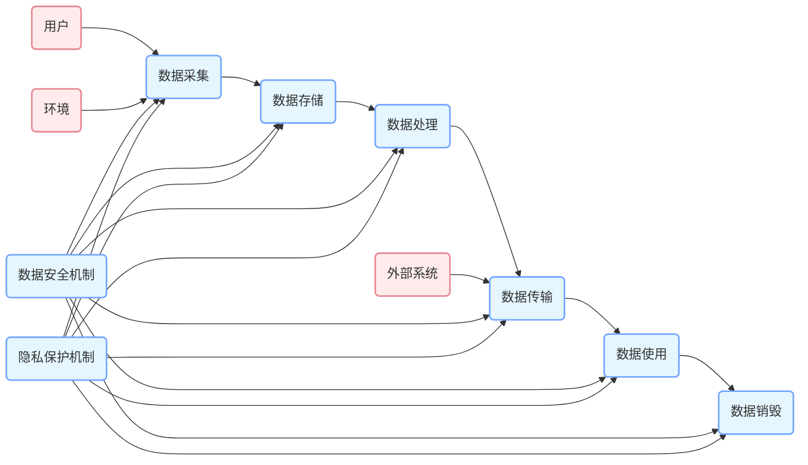

# AI Agent的数据安全与隐私保护措施

> 关键词：AI Agent、数据安全、隐私保护、加密算法、访问控制、匿名化处理、安全审计

> 摘要：本文聚焦于AI Agent的数据安全与隐私保护措施。随着AI Agent在各个领域的广泛应用，其处理和存储的数据量不断增加，数据安全与隐私问题变得尤为重要。文章首先介绍了相关背景，包括目的范围、预期读者等内容。接着阐述了AI Agent、数据安全、隐私保护等核心概念及其联系，给出了相应的原理和架构示意图与流程图。详细讲解了核心算法原理和具体操作步骤，并用Python代码进行了阐述。同时介绍了相关数学模型和公式，并举例说明。通过项目实战展示了代码实际案例及详细解释。分析了AI Agent在不同场景下的数据安全与隐私保护需求及应对措施。推荐了学习资源、开发工具框架以及相关论文著作。最后总结了未来发展趋势与挑战，并提供了常见问题与解答以及扩展阅读和参考资料，旨在为保障AI Agent的数据安全与隐私提供全面、深入的技术指导。

## 1. 背景介绍 
### 1.1 目的和范围
AI Agent（人工智能代理）作为一种能够感知环境、做出决策并采取行动的智能实体，在现代社会的各个领域中得到了广泛的应用，如智能客服、自动驾驶、金融风险评估等。随着其应用的不断拓展，AI Agent处理和存储的数据量急剧增加，这些数据包含了大量的个人敏感信息和商业机密。因此，确保AI Agent的数据安全与隐私保护变得至关重要。

本文的目的在于全面探讨AI Agent的数据安全与隐私保护措施，涵盖从数据的采集、存储、处理到传输的整个生命周期。我们将研究各种技术手段和管理策略，以确保数据在各个阶段都能得到有效的保护，防止数据泄露、篡改和滥用。

### 1.2 预期读者
本文预期读者包括但不限于以下几类人群：
- **AI开发者**：希望了解如何在开发AI Agent的过程中融入数据安全与隐私保护机制，提高AI系统的安全性和可靠性。
- **数据安全专家**：关注AI领域的数据安全挑战，寻求新的技术和方法来应对日益复杂的安全威胁。
- **企业管理人员**：需要了解AI Agent数据安全与隐私保护的重要性，以便制定相应的企业安全策略和合规措施。
- **研究人员**：对AI Agent的数据安全与隐私保护进行学术研究，探索新的理论和技术。

### 1.3 文档结构概述
本文将按照以下结构进行组织：
- **核心概念与联系**：介绍AI Agent、数据安全、隐私保护等核心概念，阐述它们之间的联系，并给出相应的原理和架构示意图与流程图。
- **核心算法原理 & 具体操作步骤**：详细讲解用于数据安全与隐私保护的核心算法，如加密算法、匿名化算法等，并给出Python代码实现。
- **数学模型和公式 & 详细讲解 & 举例说明**：介绍相关的数学模型和公式，如信息论模型、密码学公式等，并通过具体例子进行说明。
- **项目实战：代码实际案例和详细解释说明**：通过一个实际的项目案例，展示如何在AI Agent中实现数据安全与隐私保护，包括开发环境搭建、源代码实现和代码解读。
- **实际应用场景**：分析AI Agent在不同应用场景下的数据安全与隐私保护需求及应对措施。
- **工具和资源推荐**：推荐相关的学习资源、开发工具框架和论文著作，帮助读者进一步深入学习和研究。
- **总结：未来发展趋势与挑战**：总结AI Agent数据安全与隐私保护的未来发展趋势，并分析面临的挑战。
- **附录：常见问题与解答**：解答读者在学习和实践过程中常见的问题。
- **扩展阅读 & 参考资料**：提供相关的扩展阅读材料和参考资料，方便读者进一步探索。

### 1.4 术语表
#### 1.4.1 核心术语定义
- **AI Agent（人工智能代理）**：一种能够感知环境、根据预定义的规则或学习到的策略做出决策，并采取相应行动的智能实体。
- **数据安全**：保护数据免受未经授权的访问、破坏、更改或泄露，确保数据的完整性、可用性和保密性。
- **隐私保护**：保护个人或组织的敏感信息不被非法获取、使用或披露，尊重用户的隐私权利。
- **加密算法**：一种将明文数据转换为密文数据的算法，只有使用正确的密钥才能将密文还原为明文。
- **匿名化处理**：对数据进行处理，使得数据中的个人身份信息无法被识别或关联到特定的个人。

#### 1.4.2 相关概念解释
- **数据生命周期**：指数据从产生、采集、存储、处理、传输到销毁的整个过程。
- **访问控制**：一种安全机制，用于限制对数据和系统资源的访问，确保只有授权的用户或进程能够访问敏感信息。
- **安全审计**：对系统的活动和操作进行记录、监控和分析，以便发现潜在的安全威胁和违规行为。

#### 1.4.3 缩略词列表
- **AI**：Artificial Intelligence（人工智能）
- **SSL/TLS**：Secure Sockets Layer/Transport Layer Security（安全套接层/传输层安全协议）
- **AES**：Advanced Encryption Standard（高级加密标准）
- **DP**：Differential Privacy（差分隐私）

## 2. 核心概念与联系 

### 2.1 核心概念原理

#### 2.1.1 AI Agent原理
AI Agent通常由感知模块、决策模块和行动模块组成。感知模块负责收集环境信息，决策模块根据感知到的信息和预定义的规则或学习到的策略做出决策，行动模块则根据决策采取相应的行动。例如，在一个智能客服AI Agent中，感知模块可以通过自然语言处理技术接收用户的问题，决策模块根据问题的类型和知识库中的信息做出回答决策，行动模块则将回答发送给用户。

#### 2.1.2 数据安全原理
数据安全的核心目标是确保数据的完整性、可用性和保密性。完整性是指数据在存储和传输过程中不被篡改；可用性是指数据在需要时能够被授权用户正常访问；保密性是指数据不被未经授权的用户获取。为了实现这些目标，数据安全采用了多种技术手段，如加密、访问控制、备份恢复等。

#### 2.1.3 隐私保护原理
隐私保护的原理是通过对个人敏感信息的保护，防止其被非法获取、使用或披露。常见的隐私保护技术包括匿名化处理、差分隐私、同态加密等。匿名化处理是将数据中的个人身份信息去除或替换，使得数据无法被关联到特定的个人；差分隐私是通过在数据中添加噪声来保护个人隐私；同态加密则允许在加密数据上进行计算，而无需解密数据，从而保护数据的隐私性。

### 2.2 核心概念架构

下面是AI Agent的数据安全与隐私保护架构示意图：



该架构图展示了数据从采集到销毁的整个生命周期，以及数据安全机制和隐私保护机制在各个阶段的作用。数据安全机制和隐私保护机制贯穿于数据生命周期的每一个环节，确保数据的安全和隐私。

### 2.3 核心概念联系
AI Agent的数据安全与隐私保护是相互关联、相互影响的。一方面，数据安全是隐私保护的基础，只有确保数据的安全性，才能有效保护用户的隐私。例如，如果数据在传输过程中被泄露，那么用户的隐私信息就可能被非法获取。另一方面，隐私保护也对数据安全提出了更高的要求。为了保护用户的隐私，需要采用更加先进的加密算法和匿名化技术，这也增加了数据安全管理的难度。

同时，AI Agent的决策和行动也会受到数据安全与隐私保护的影响。例如，在进行数据挖掘和分析时，需要在保护用户隐私的前提下进行，否则可能会导致用户的隐私泄露，从而引发法律和道德问题。

## 3. 核心算法原理 & 具体操作步骤 

### 3.1 加密算法原理及Python实现

#### 3.1.1 AES加密算法原理
AES（Advanced Encryption Standard）是一种对称加密算法，它使用相同的密钥进行加密和解密。AES算法的核心是分组密码，它将明文数据分成固定长度的分组，然后对每个分组进行加密。AES算法支持128位、192位和256位的密钥长度，密钥长度越长，加密的安全性越高。

#### 3.1.2 AES加密算法Python实现
```python
from Crypto.Cipher import AES
from Crypto.Util.Padding import pad, unpad
import os

# 生成随机密钥
key = os.urandom(16)  # 128位密钥

# 初始化加密器
cipher = AES.new(key, AES.MODE_CBC)

# 待加密的明文
plaintext = b"Hello, this is a secret message."

# 填充明文
padded_plaintext = pad(plaintext, AES.block_size)

# 加密
ciphertext = cipher.encrypt(padded_plaintext)

# 初始化解密器
decipher = AES.new(key, AES.MODE_CBC, cipher.iv)

# 解密
decrypted_data = decipher.decrypt(ciphertext)

# 去除填充
unpadded_decrypted_data = unpad(decrypted_data, AES.block_size)

print("Original plaintext:", plaintext)
print("Decrypted plaintext:", unpadded_decrypted_data)
```

### 3.2 匿名化算法原理及Python实现

#### 3.2.1 k - 匿名算法原理
k - 匿名是一种常用的匿名化算法，它的目标是确保数据集中的每个记录都至少与其他 $k - 1$ 个记录在某些属性上是不可区分的。这样可以防止攻击者通过关联外部信息来识别出特定的个人。

#### 3.2.2 k - 匿名算法Python实现
```python
import pandas as pd

# 示例数据集
data = {
    'Name': ['Alice', 'Bob', 'Charlie', 'David', 'Eve'],
    'Age': [25, 30, 35, 40, 45],
    'City': ['New York', 'Los Angeles', 'Chicago', 'Houston', 'Phoenix']
}

df = pd.DataFrame(data)

# 选择准标识符属性
quasi_identifiers = ['Age', 'City']

# 定义k值
k = 2

# 实现k - 匿名
def k_anonymize(df, quasi_identifiers, k):
    groups = df.groupby(quasi_identifiers)
    anonymized_df = pd.DataFrame()
    for name, group in groups:
        if len(group) >= k:
            anonymized_df = pd.concat([anonymized_df, group])
    return anonymized_df

anonymized_df = k_anonymize(df, quasi_identifiers, k)
print("Original DataFrame:")
print(df)
print("Anonymized DataFrame:")
print(anonymized_df)
```

### 3.3 具体操作步骤
#### 3.3.1 数据采集阶段
- 明确数据采集的目的和范围，只采集必要的数据。
- 对采集的数据进行初步的验证和清洗，去除无效和重复的数据。
- 采用加密技术对采集的数据进行加密，确保数据在传输过程中的安全性。

#### 3.3.2 数据存储阶段
- 选择安全可靠的存储系统，如数据库管理系统或云存储服务。
- 对存储的数据进行加密，使用不同的密钥对不同级别的数据进行加密。
- 实施访问控制策略，限制只有授权的用户或进程能够访问存储的数据。

#### 3.3.3 数据处理阶段
- 在处理数据之前，对数据进行匿名化处理，保护用户的隐私。
- 采用安全的计算环境，如安全沙箱或可信执行环境，确保数据处理过程的安全性。
- 对处理过程进行监控和审计，及时发现和处理潜在的安全问题。

#### 3.3.4 数据传输阶段
- 使用安全的传输协议，如SSL/TLS，对数据进行加密传输。
- 对传输的数据进行完整性验证，确保数据在传输过程中没有被篡改。
- 限制数据传输的范围和权限，只允许授权的用户或系统进行数据传输。

#### 3.3.5 数据使用阶段
- 明确数据使用的目的和范围，确保数据的使用符合法律法规和用户的授权。
- 对使用的数据进行脱敏处理，保护用户的隐私。
- 对数据使用过程进行记录和审计，以便追溯和监管。

#### 3.3.6 数据销毁阶段
- 采用安全的销毁方法，如数据擦除或物理销毁，确保数据无法被恢复。
- 对数据销毁过程进行记录和审计，证明数据已经被安全销毁。

## 4. 数学模型和公式 & 详细讲解 & 举例说明 

### 4.1 信息论模型
信息论是研究信息的度量、传输、存储和处理的理论。在数据安全与隐私保护中，信息论可以用来衡量数据的信息量和隐私泄露的风险。

#### 4.1.1 熵的定义
熵是信息论中一个重要的概念，它用来衡量随机变量的不确定性。对于一个离散随机变量 $X$，其熵 $H(X)$ 定义为：
$$H(X)=-\sum_{i = 1}^{n}p(x_i)\log_2p(x_i)$$
其中，$p(x_i)$ 是随机变量 $X$ 取值为 $x_i$ 的概率，$n$ 是随机变量 $X$ 的取值个数。

#### 4.1.2 举例说明
假设有一个抛硬币的实验，硬币正面朝上的概率为 $p = 0.5$，反面朝上的概率也为 $p = 0.5$。则抛硬币结果的熵为：
$$H(X)=-0.5\log_20.5 - 0.5\log_20.5=1$$
这表示抛硬币结果的不确定性为 1 比特。

### 4.2 差分隐私模型
差分隐私是一种强大的隐私保护技术，它通过在数据中添加噪声来保护个人隐私。

#### 4.2.1 差分隐私的定义
一个算法 $\mathcal{M}$ 满足 $\epsilon$-差分隐私，如果对于任意两个相邻的数据集 $D$ 和 $D'$（它们只相差一个记录），以及任意的输出集合 $S$，有：
$$\Pr[\mathcal{M}(D)\in S]\leq e^{\epsilon}\Pr[\mathcal{M}(D')\in S]$$
其中，$\epsilon$ 是差分隐私的参数，它控制着隐私保护的程度。$\epsilon$ 越小，隐私保护的程度越高，但数据的可用性也会相应降低。

#### 4.2.2 举例说明
假设我们有一个数据集 $D$，其中包含用户的年龄信息。我们想要计算数据集的年龄平均值，但又不想泄露每个用户的具体年龄信息。我们可以使用差分隐私算法在计算平均值的过程中添加噪声。例如，我们可以使用拉普拉斯机制来添加噪声，拉普拉斯机制的噪声服从拉普拉斯分布：
$$\mathcal{M}(D)=\text{mean}(D)+\text{Lap}(\frac{\Delta f}{\epsilon})$$
其中，$\Delta f$ 是函数 $f$（这里是平均值计算函数）的敏感度，$\epsilon$ 是差分隐私参数。

### 4.3 密码学公式
密码学是数据安全的重要基础，它涉及到许多数学公式和算法。

#### 4.3.1 RSA算法原理
RSA算法是一种非对称加密算法，它基于大整数分解的困难性。RSA算法的密钥生成过程如下：
1. 选择两个大素数 $p$ 和 $q$。
2. 计算 $n = p\times q$ 和 $\varphi(n)=(p - 1)(q - 1)$。
3. 选择一个整数 $e$，使得 $1\lt e\lt\varphi(n)$ 且 $\gcd(e,\varphi(n)) = 1$。
4. 计算 $d$，使得 $d\times e\equiv1\pmod{\varphi(n)}$。

公钥为 $(n, e)$，私钥为 $(n, d)$。加密过程为 $c = m^e\pmod{n}$，解密过程为 $m = c^d\pmod{n}$，其中 $m$ 是明文，$c$ 是密文。

#### 4.3.2 举例说明
假设 $p = 3$，$q = 11$，则 $n = p\times q = 33$，$\varphi(n)=(p - 1)(q - 1)=20$。选择 $e = 3$，则可以计算出 $d = 7$（因为 $3\times7\equiv1\pmod{20}$）。公钥为 $(33, 3)$，私钥为 $(33, 7)$。假设明文 $m = 5$，则加密后的密文 $c = 5^3\pmod{33}=125\pmod{33}=26$。解密时，$m = 26^7\pmod{33}=8031810176\pmod{33}=5$，成功恢复出明文。

## 5. 项目实战：代码实际案例和详细解释说明 

### 5.1  开发环境搭建
#### 5.1.1 操作系统
我们选择使用Ubuntu 20.04作为开发环境的操作系统，它是一个开源的、稳定的Linux发行版，广泛应用于开发和生产环境。

#### 5.1.2 Python环境
安装Python 3.8及以上版本，可以使用以下命令进行安装：
```bash
sudo apt update
sudo apt install python3 python3-pip
```

#### 5.1.3 安装必要的库
我们需要安装一些必要的Python库，如`pycryptodome`用于加密操作，`pandas`用于数据处理。可以使用以下命令进行安装：
```bash
pip3 install pycryptodome pandas
```

### 5.2  源代码详细实现和代码解读
#### 5.2.1 数据加密模块
```python
from Crypto.Cipher import AES
from Crypto.Util.Padding import pad, unpad
import os

class DataEncryptor:
    def __init__(self):
        # 生成128位随机密钥
        self.key = os.urandom(16)
        # 初始化加密器，使用CBC模式
        self.cipher = AES.new(self.key, AES.MODE_CBC)

    def encrypt(self, plaintext):
        # 填充明文
        padded_plaintext = pad(plaintext.encode('utf-8'), AES.block_size)
        # 加密
        ciphertext = self.cipher.encrypt(padded_plaintext)
        # 返回密文和初始化向量
        return ciphertext, self.cipher.iv

    def decrypt(self, ciphertext, iv):
        # 初始化解密器
        decipher = AES.new(self.key, AES.MODE_CBC, iv)
        # 解密
        decrypted_data = decipher.decrypt(ciphertext)
        # 去除填充
        unpadded_decrypted_data = unpad(decrypted_data, AES.block_size)
        # 返回解密后的明文
        return unpadded_decrypted_data.decode('utf-8')
```
**代码解读**：
- `__init__`方法：生成一个128位的随机密钥，并初始化一个AES加密器，使用CBC模式。
- `encrypt`方法：将明文进行填充，然后使用加密器进行加密，返回密文和初始化向量。
- `decrypt`方法：使用解密器对密文进行解密，去除填充后返回解密后的明文。

#### 5.2.2 数据匿名化模块
```python
import pandas as pd

class DataAnonymizer:
    def __init__(self, quasi_identifiers, k):
        self.quasi_identifiers = quasi_identifiers
        self.k = k

    def anonymize(self, df):
        # 分组
        groups = df.groupby(self.quasi_identifiers)
        anonymized_df = pd.DataFrame()
        for name, group in groups:
            if len(group) >= self.k:
                anonymized_df = pd.concat([anonymized_df, group])
        return anonymized_df
```
**代码解读**：
- `__init__`方法：初始化准标识符属性和k值。
- `anonymize`方法：对数据集进行分组，只保留满足k - 匿名条件的组，返回匿名化后的数据集。

#### 5.2.3 主程序
```python
# 数据加密示例
encryptor = DataEncryptor()
plaintext = "This is a sensitive message."
ciphertext, iv = encryptor.encrypt(plaintext)
decrypted_text = encryptor.decrypt(ciphertext, iv)
print("Original plaintext:", plaintext)
print("Decrypted plaintext:", decrypted_text)

# 数据匿名化示例
data = {
    'Name': ['Alice', 'Bob', 'Charlie', 'David', 'Eve'],
    'Age': [25, 30, 35, 40, 45],
    'City': ['New York', 'Los Angeles', 'Chicago', 'Houston', 'Phoenix']
}
df = pd.DataFrame(data)
anonymizer = DataAnonymizer(['Age', 'City'], 2)
anonymized_df = anonymizer.anonymize(df)
print("Original DataFrame:")
print(df)
print("Anonymized DataFrame:")
print(anonymized_df)
```
**代码解读**：
- 首先创建一个`DataEncryptor`对象，对一个敏感消息进行加密和解密操作，并打印原始明文和解密后的明文。
- 然后创建一个`DataAnonymizer`对象，对一个示例数据集进行匿名化处理，并打印原始数据集和匿名化后的数据集。

### 5.3  代码解读与分析
#### 5.3.1 数据加密模块分析
- **安全性**：使用AES加密算法，128位密钥和CBC模式，提供了较高的安全性。但需要注意的是，密钥的管理非常重要，密钥泄露会导致数据的安全性受到威胁。
- **性能**：AES加密算法的性能较高，适用于大规模数据的加密。但填充和去填充操作会增加一定的开销。

#### 5.3.2 数据匿名化模块分析
- **隐私保护效果**：k - 匿名算法可以在一定程度上保护用户的隐私，但对于某些攻击者可能仍然存在隐私泄露的风险。可以结合其他匿名化技术，如l - 多样性、t - 近似等，提高隐私保护效果。
- **数据可用性**：k - 匿名算法可能会导致数据的可用性降低，因为一些不满足k - 匿名条件的记录会被删除。在实际应用中，需要根据具体情况平衡隐私保护和数据可用性。

## 6. 实际应用场景 

### 6.1 智能客服
在智能客服场景中，AI Agent需要处理大量的用户咨询信息，这些信息可能包含用户的个人身份信息、联系方式、业务需求等敏感信息。为了保护用户的隐私和数据安全，可以采取以下措施：
- **数据采集阶段**：明确告知用户数据采集的目的和范围，只采集必要的信息。对采集的信息进行加密传输，使用SSL/TLS协议确保数据在传输过程中的安全性。
- **数据存储阶段**：将用户信息存储在安全的数据库中，对数据进行加密存储。实施严格的访问控制策略，只有授权的客服人员才能访问用户信息。
- **数据处理阶段**：在处理用户咨询时，对用户的个人身份信息进行匿名化处理，只保留与业务相关的信息。使用安全的自然语言处理模型，确保模型的训练和推理过程不会泄露用户的隐私信息。
- **数据使用阶段**：严格按照用户的授权和法律法规的要求使用用户信息，不得将用户信息用于其他目的。对数据使用过程进行记录和审计，以便追溯和监管。

### 6.2 自动驾驶
在自动驾驶场景中，AI Agent需要处理大量的传感器数据，如摄像头图像、雷达数据等，这些数据可能包含道路信息、车辆信息、行人信息等。为了保护数据安全和隐私，可以采取以下措施：
- **数据采集阶段**：对传感器数据进行实时加密，确保数据在采集过程中的安全性。采用匿名化技术对行人信息进行处理，避免行人身份信息的泄露。
- **数据存储阶段**：将传感器数据存储在车辆的本地存储设备或云端存储系统中，对数据进行加密存储。实施访问控制策略，限制只有授权的人员或系统才能访问数据。
- **数据处理阶段**：在车辆的安全计算环境中对传感器数据进行处理，确保数据处理过程的安全性。采用差分隐私技术对数据进行处理，保护数据的隐私性。
- **数据传输阶段**：使用安全的通信协议，如V2X（Vehicle - to - Everything）通信协议，对数据进行加密传输。对传输的数据进行完整性验证，确保数据在传输过程中没有被篡改。

### 6.3 金融风险评估
在金融风险评估场景中，AI Agent需要处理大量的用户金融信息，如账户信息、交易记录、信用评分等。为了保护用户的隐私和数据安全，可以采取以下措施：
- **数据采集阶段**：获得用户的明确授权后采集金融信息，对采集的信息进行加密传输。采用多因素身份验证技术，确保只有合法用户才能提供金融信息。
- **数据存储阶段**：将用户金融信息存储在安全的金融数据库中，对数据进行加密存储。实施严格的访问控制策略，只有授权的金融分析师才能访问用户信息。
- **数据处理阶段**：在处理用户金融信息时，对用户的个人身份信息进行脱敏处理，只保留与风险评估相关的信息。使用安全的机器学习模型，确保模型的训练和推理过程不会泄露用户的隐私信息。
- **数据使用阶段**：严格按照用户的授权和法律法规的要求使用用户金融信息，不得将用户信息用于其他目的。对数据使用过程进行记录和审计，以便追溯和监管。

## 7. 工具和资源推荐
### 7.1 学习资源推荐
#### 7.1.1 书籍推荐
- 《人工智能：现代方法》：全面介绍了人工智能的基本概念、算法和应用，包括AI Agent的相关内容。
- 《数据安全与隐私保护技术》：详细介绍了数据安全和隐私保护的各种技术和方法，适合深入学习。
- 《密码学原理与实践》：系统介绍了密码学的基本原理和算法，是密码学领域的经典教材。

#### 7.1.2 在线课程
- Coursera上的“Artificial Intelligence”课程：由知名高校教授授课，系统讲解人工智能的理论和实践。
- edX上的“Data Privacy and Security”课程：专门介绍数据隐私和安全的相关知识和技术。
- Udemy上的“Python for Data Science and Machine Learning Bootcamp”课程：通过Python学习数据科学和机器学习，包括数据安全和隐私保护的实践。

#### 7.1.3 技术博客和网站
- Medium上的AI和数据安全相关博客：有许多行业专家和学者分享的最新技术和研究成果。
- 开源中国（OSChina）：提供了丰富的开源项目和技术文章，包括数据安全和隐私保护方面的内容。
- 中国计算机学会（CCF）官网：发布计算机领域的最新研究动态和学术成果，包括AI Agent的数据安全与隐私保护相关内容。

### 7.2 开发工具框架推荐
#### 7.2.1 IDE和编辑器
- PyCharm：功能强大的Python集成开发环境，提供代码编辑、调试、版本控制等功能，适合开发AI Agent和相关的数据安全与隐私保护应用。
- Visual Studio Code：轻量级的代码编辑器，支持多种编程语言和插件扩展，可用于快速开发和调试。

#### 7.2.2 调试和性能分析工具
- pdb：Python自带的调试器，可以帮助开发者定位和解决代码中的问题。
- cProfile：Python的性能分析工具，可以分析代码的执行时间和资源消耗，帮助优化代码性能。

#### 7.2.3 相关框架和库
- PyTorch：开源的深度学习框架，提供了丰富的深度学习模型和工具，可用于开发AI Agent。
- TensorFlow：另一个流行的深度学习框架，广泛应用于人工智能领域。
- Scikit - learn：用于机器学习的Python库，提供了各种机器学习算法和工具，可用于数据处理和分析。

### 7.3 相关论文著作推荐
#### 7.3.1 经典论文
- “A Cryptographic Approach to Privacy - Preserving Data Mining”：介绍了一种基于密码学的隐私保护数据挖掘方法。
- “Differential Privacy: A Survey of Results”：对差分隐私技术进行了全面的综述。
- “k - Anonymity: A Model for Protecting Privacy”：提出了k - 匿名的概念和算法。

#### 7.3.2 最新研究成果
- 关注ACM SIGKDD、IEEE Transactions on Information Forensics and Security等学术会议和期刊，了解AI Agent数据安全与隐私保护的最新研究进展。

#### 7.3.3 应用案例分析
- 参考一些知名企业和研究机构发布的AI Agent数据安全与隐私保护应用案例，如谷歌、微软等公司的相关报告，学习实际应用中的经验和方法。

## 8. 总结：未来发展趋势与挑战

### 8.1 未来发展趋势
#### 8.1.1 融合多种技术
未来，AI Agent的数据安全与隐私保护将融合多种技术，如密码学、机器学习、区块链等。例如，利用区块链的去中心化和不可篡改特性，可以实现数据的可信存储和共享；利用机器学习算法可以自动检测和防范数据安全威胁。

#### 8.1.2 隐私计算技术的发展
隐私计算技术将得到更广泛的应用，如同态加密、多方安全计算等。这些技术可以在不泄露数据隐私的前提下进行数据的计算和分析，满足日益增长的数据分析需求。

#### 8.1.3 法规和标准的完善
随着AI Agent应用的不断普及，相关的法规和标准将不断完善。例如，欧盟的《通用数据保护条例》（GDPR）对数据隐私保护提出了严格的要求，未来各国可能会出台更多类似的法规和标准，促使企业更加重视AI Agent的数据安全与隐私保护。

### 8.2 挑战
#### 8.2.1 技术挑战
- **复杂的攻击手段**：攻击者不断发展新的攻击手段，如对抗攻击、数据投毒攻击等，给AI Agent的数据安全与隐私保护带来了巨大的挑战。
- **技术的复杂性**：融合多种技术的安全解决方案增加了系统的复杂性，如何有效地管理和维护这些技术，确保系统的安全性和可靠性是一个难题。

#### 8.2.2 管理挑战
- **数据治理难度大**：AI Agent处理和存储的数据量巨大，数据来源广泛，如何进行有效的数据治理，确保数据的质量和安全性是一个挑战。
- **人员安全意识不足**：企业内部人员的安全意识不足可能导致数据泄露等安全事故的发生，如何提高人员的安全意识是一个长期的任务。

#### 8.2.3 社会挑战
- **隐私与数据利用的平衡**：在保护用户隐私的同时，如何充分利用数据的价值，促进AI Agent的发展和应用，是一个需要平衡的问题。
- **公众对AI的信任**：数据安全与隐私问题可能影响公众对AI Agent的信任，如何提高公众对AI的信任度，是AI Agent发展面临的一个重要挑战。

## 9. 附录：常见问题与解答
### 9.1 如何选择合适的加密算法？
选择合适的加密算法需要考虑多个因素，如数据的敏感性、加密的性能要求、算法的安全性等。对于一般的敏感数据，可以选择对称加密算法，如AES；对于需要进行密钥交换和数字签名的场景，可以选择非对称加密算法，如RSA。同时，要确保选择的算法是经过广泛验证和认可的，避免使用不安全的算法。

### 9.2 k - 匿名算法有哪些局限性？
k - 匿名算法的局限性主要包括：
- **隐私泄露风险**：k - 匿名算法不能完全防止隐私泄露，攻击者可能通过关联外部信息或利用数据的背景知识来识别出特定的个人。
- **数据可用性降低**：为了满足k - 匿名条件，可能需要删除一些不满足条件的记录，导致数据的可用性降低。
- **缺乏对属性值分布的考虑**：k - 匿名算法只考虑了记录之间的不可区分性，没有考虑属性值的分布情况，可能导致一些隐私泄露问题。

### 9.3 如何确保密钥的安全管理？
确保密钥的安全管理可以采取以下措施：
- **密钥生成**：使用安全的随机数生成器生成密钥，确保密钥的随机性和唯一性。
- **密钥存储**：将密钥存储在安全的设备或系统中，如硬件安全模块（HSM），并对密钥进行加密存储。
- **密钥传输**：使用安全的通信协议传输密钥，如SSL/TLS，确保密钥在传输过程中的安全性。
- **密钥更新**：定期更新密钥，避免密钥被长时间使用而被破解。
- **密钥备份和恢复**：对密钥进行备份，以便在需要时进行恢复，但要确保备份的安全性。

### 9.4 差分隐私技术的应用场景有哪些？
差分隐私技术的应用场景包括：
- **数据发布**：在发布数据集时，使用差分隐私技术对数据进行处理，保护数据中个人的隐私信息。
- **机器学习**：在机器学习模型的训练过程中，使用差分隐私技术添加噪声，保护训练数据的隐私性。
- **数据分析**：在进行数据分析时，使用差分隐私技术对数据进行处理，确保分析结果不会泄露个人的隐私信息。

## 10. 扩展阅读 & 参考资料
### 10.1 扩展阅读
- 《隐私计算：原理、技术与应用》：深入介绍了隐私计算的原理、技术和应用场景，包括同态加密、多方安全计算等。
- 《人工智能安全与隐私》：全面探讨了人工智能领域的安全与隐私问题，包括AI Agent的数据安全与隐私保护。
- 《数据安全治理实战》：结合实际案例，介绍了数据安全治理的方法和实践经验，对企业的数据安全管理有很大的参考价值。

### 10.2 参考资料
- 欧盟《通用数据保护条例》（GDPR）：https://gdpr.eu/
- 中国《网络安全法》：http://www.npc.gov.cn/npc/c30834/201611/1276a98c301348c09d2a2dc6a6a3d9d4.shtml
- 美国国家标准与技术研究院（NIST）关于数据安全和隐私的相关标准和指南：https://www.nist.gov/
- 相关学术会议和期刊的官方网站，如ACM SIGKDD、IEEE Transactions on Information Forensics and Security等。