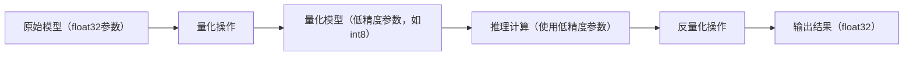

# AI Agent的模型量化：优化LLM的计算效率与存储

> 关键词：AI Agent、模型量化、大语言模型（LLM）、计算效率、存储优化

> 摘要：本文围绕AI Agent的模型量化展开，旨在探讨如何通过模型量化技术优化大语言模型（LLM）的计算效率与存储。首先介绍了相关背景知识，包括目的范围、预期读者等。接着阐述了模型量化的核心概念与联系，给出原理和架构的示意图及流程图。详细讲解了核心算法原理并给出Python代码示例，同时介绍了相关数学模型和公式。通过项目实战展示代码的实际应用和解读。分析了模型量化在实际场景中的应用，推荐了学习、开发工具等相关资源。最后总结了未来发展趋势与挑战，还设置了常见问题解答和扩展阅读参考资料部分，为读者全面深入了解AI Agent的模型量化提供了系统的知识体系。

## 1. 背景介绍 
### 1.1 目的和范围
随着大语言模型（LLM）的不断发展，其在自然语言处理、智能问答等领域展现出了强大的能力。然而，LLM通常具有庞大的参数数量，这导致了高计算成本和大量的存储需求，限制了其在资源受限环境中的应用。本文的目的是深入探讨AI Agent的模型量化技术，该技术能够在不显著损失模型性能的前提下，有效降低LLM的计算复杂度和存储需求。我们将详细介绍模型量化的核心概念、算法原理、数学模型，并通过实际项目案例展示其应用，同时分析其在不同场景下的实际应用和未来发展趋势。

### 1.2 预期读者
本文主要面向对人工智能、自然语言处理、机器学习等领域感兴趣的技术人员，包括但不限于AI开发者、数据科学家、算法工程师等。同时，也适合对模型优化、计算效率提升有需求的研究人员和技术爱好者阅读。对于那些希望深入了解如何在资源受限环境中部署LLM的人员，本文将提供有价值的参考。

### 1.3 文档结构概述
本文将按照以下结构展开：首先介绍核心概念与联系，让读者对模型量化有一个初步的认识；接着详细讲解核心算法原理和具体操作步骤，并给出Python代码示例；然后介绍相关的数学模型和公式，并举例说明；通过项目实战展示代码的实际应用和详细解释；分析模型量化在实际场景中的应用；推荐学习、开发工具等相关资源；总结未来发展趋势与挑战；设置常见问题解答和扩展阅读参考资料部分，方便读者进一步深入学习。

### 1.4 术语表
#### 1.4.1 核心术语定义
- **AI Agent**：人工智能代理，是一种能够感知环境、进行决策并采取行动以实现特定目标的智能实体。在本文中，主要指使用LLM进行任务处理的智能代理。
- **模型量化**：将模型中的浮点数参数转换为低精度数据类型（如整数）的过程，以减少模型的存储需求和计算复杂度。
- **大语言模型（LLM）**：具有大量参数和强大语言理解与生成能力的深度学习模型，如GPT、BERT等。
- **计算效率**：指模型在计算过程中所消耗的计算资源（如CPU、GPU时间）与完成任务的速度之间的关系。
- **存储优化**：通过各种技术手段减少模型所需的存储空间，以便更高效地存储和传输模型。

#### 1.4.2 相关概念解释
- **量化粒度**：指在模型量化过程中，对参数进行量化的单位。常见的量化粒度有层粒度、通道粒度和张量粒度等。
- **量化误差**：由于将浮点数参数转换为低精度数据类型而引入的误差。量化误差可能会影响模型的性能，因此需要在量化过程中进行控制。
- **量化策略**：指选择合适的量化方法和参数，以在降低计算成本和存储需求的同时，尽量减少对模型性能的影响。

#### 1.4.3 缩略词列表
- **LLM**：Large Language Model，大语言模型
- **CPU**：Central Processing Unit，中央处理器
- **GPU**：Graphics Processing Unit，图形处理器

## 2. 核心概念与联系 
### 核心概念原理
模型量化的核心原理是将模型中的浮点数参数转换为低精度数据类型，如8位整数（int8）或4位整数（int4）。在深度学习模型中，参数通常以32位浮点数（float32）的形式存储和计算，这需要大量的存储空间和计算资源。通过量化，可以将这些参数转换为低精度数据类型，从而减少存储需求和计算复杂度。

例如，假设一个模型中的某个参数为 $w = 1.234$，在float32格式下，它需要32位来存储。如果将其量化为8位整数，我们可以通过一个缩放因子 $s$ 和一个零点 $z$ 将其映射到整数范围。假设缩放因子 $s = 0.1$，零点 $z = 0$，则量化后的整数为 $q = \lfloor\frac{w}{s}\rfloor = \lfloor\frac{1.234}{0.1}\rfloor = 12$。在推理过程中，我们可以使用量化后的整数进行计算，然后通过反量化操作将结果转换回浮点数。

### 架构的文本示意图
```plaintext
原始模型（float32参数）
|
| 量化操作
|
量化模型（低精度参数，如int8）
|
| 推理计算（使用低精度参数）
|
反量化操作
|
输出结果（float32）
```

### Mermaid流程图


## 3. 核心算法原理 & 具体操作步骤 
### 核心算法原理
常见的模型量化算法有线性量化和非线性量化。这里我们主要介绍线性量化，其核心思想是通过线性映射将浮点数参数转换为整数。具体来说，对于一个浮点数参数 $w$，其量化公式为：

$q = \lfloor\frac{w - z}{s}\rfloor$

其中，$q$ 是量化后的整数，$s$ 是缩放因子，$z$ 是零点。反量化公式为：

$w' = s \times q + z$

### 具体操作步骤
1. **确定量化范围**：首先需要确定模型参数的取值范围，通常可以通过统计训练数据上参数的最大值和最小值来确定。
2. **计算缩放因子和零点**：根据量化范围，计算缩放因子 $s$ 和零点 $z$。缩放因子 $s$ 可以通过以下公式计算：

$s = \frac{max - min}{2^b - 1}$

其中，$max$ 和 $min$ 分别是参数的最大值和最小值，$b$ 是量化位数（如8位量化时 $b = 8$）。零点 $z$ 可以通过以下公式计算：

$z = \lfloor\frac{min}{s}\rfloor$

3. **量化参数**：将模型中的每个浮点数参数 $w$ 按照量化公式转换为整数 $q$。
4. **反量化参数**：在推理过程中，将量化后的整数 $q$ 按照反量化公式转换回浮点数 $w'$。

### Python源代码示例
```python
import numpy as np

def quantize(w, bitwidth=8):
    # 确定量化范围
    max_val = np.max(w)
    min_val = np.min(w)
    
    # 计算缩放因子和零点
    s = (max_val - min_val) / (2**bitwidth - 1)
    z = np.floor(min_val / s)
    
    # 量化参数
    q = np.floor((w - z) / s).astype(np.int8)
    
    return q, s, z

def dequantize(q, s, z):
    # 反量化参数
    w = s * q + z
    return w

# 示例数据
w = np.random.randn(10)

# 量化
q, s, z = quantize(w)

# 反量化
w_dequantized = dequantize(q, s, z)

print("Original weights:", w)
print("Quantized weights:", q)
print("Dequantized weights:", w_dequantized)
```

## 4. 数学模型和公式 & 详细讲解 & 举例说明 
### 线性量化公式
如前面所述，线性量化的公式为：

$q = \lfloor\frac{w - z}{s}\rfloor$

$w' = s \times q + z$

其中，$w$ 是原始的浮点数参数，$q$ 是量化后的整数，$w'$ 是反量化后的浮点数，$s$ 是缩放因子，$z$ 是零点。

### 缩放因子和零点的计算
缩放因子 $s$ 和零点 $z$ 的计算公式为：

$s = \frac{max - min}{2^b - 1}$

$z = \lfloor\frac{min}{s}\rfloor$

其中，$max$ 和 $min$ 分别是参数的最大值和最小值，$b$ 是量化位数。

### 详细讲解
线性量化的核心思想是通过线性映射将浮点数参数映射到一个有限的整数范围内。缩放因子 $s$ 控制了浮点数和整数之间的比例关系，零点 $z$ 则用于调整映射的起点。在量化过程中，我们将浮点数减去零点，然后除以缩放因子，最后取整得到量化后的整数。在反量化过程中，我们将量化后的整数乘以缩放因子，再加上零点，得到反量化后的浮点数。

### 举例说明
假设我们有一个参数 $w$ 的取值范围是 $[-1, 1]$，我们要进行8位量化（$b = 8$）。

1. **计算缩放因子**：

$max = 1$，$min = -1$

$s = \frac{1 - (-1)}{2^8 - 1} = \frac{2}{255} \approx 0.00784$

2. **计算零点**：

$z = \lfloor\frac{-1}{0.00784}\rfloor = -128$

3. **量化参数**：

假设 $w = 0.5$，则 $q = \lfloor\frac{0.5 - (-128)}{0.00784}\rfloor = \lfloor\frac{128.5}{0.00784}\rfloor = 16390$（超出了8位整数的范围，实际会进行截断）

在实际应用中，我们会将量化后的整数限制在 $[-128, 127]$ 的范围内。

## 5. 项目实战：代码实际案例和详细解释说明 
### 5.1  开发环境搭建
#### 安装Python
首先需要安装Python，建议使用Python 3.7及以上版本。可以从Python官方网站（https://www.python.org/downloads/）下载并安装。

#### 安装必要的库
我们需要安装一些必要的库，如`numpy`、`torch`等。可以使用以下命令进行安装：

```sh
pip install numpy torch
```

### 5.2  源代码详细实现和代码解读
```python
import torch
import torch.nn as nn
import torch.optim as optim
from torch.utils.data import DataLoader, Dataset

# 定义一个简单的神经网络模型
class SimpleNet(nn.Module):
    def __init__(self):
        super(SimpleNet, self).__init__()
        self.fc1 = nn.Linear(10, 20)
        self.fc2 = nn.Linear(20, 1)

    def forward(self, x):
        x = torch.relu(self.fc1(x))
        x = self.fc2(x)
        return x

# 定义一个简单的数据集
class SimpleDataset(Dataset):
    def __init__(self, num_samples):
        self.data = torch.randn(num_samples, 10)
        self.labels = torch.randn(num_samples, 1)

    def __len__(self):
        return len(self.data)

    def __getitem__(self, idx):
        return self.data[idx], self.labels[idx]

# 训练模型
def train_model(model, dataloader, criterion, optimizer, epochs):
    model.train()
    for epoch in range(epochs):
        running_loss = 0.0
        for inputs, labels in dataloader:
            optimizer.zero_grad()
            outputs = model(inputs)
            loss = criterion(outputs, labels)
            loss.backward()
            optimizer.step()
            running_loss += loss.item()
        print(f'Epoch {epoch + 1}/{epochs}, Loss: {running_loss / len(dataloader)}')

# 量化模型
def quantize_model(model):
    quantized_model = torch.quantization.quantize_dynamic(
        model, {nn.Linear}, dtype=torch.qint8
    )
    return quantized_model

# 主函数
def main():
    # 创建数据集和数据加载器
    dataset = SimpleDataset(num_samples=1000)
    dataloader = DataLoader(dataset, batch_size=32, shuffle=True)

    # 创建模型、损失函数和优化器
    model = SimpleNet()
    criterion = nn.MSELoss()
    optimizer = optim.Adam(model.parameters(), lr=0.001)

    # 训练模型
    train_model(model, dataloader, criterion, optimizer, epochs=10)

    # 量化模型
    quantized_model = quantize_model(model)

    # 测试量化模型
    model.eval()
    quantized_model.eval()
    inputs, _ = next(iter(dataloader))
    with torch.no_grad():
        outputs = model(inputs)
        quantized_outputs = quantized_model(inputs)

    print("Original model outputs:", outputs)
    print("Quantized model outputs:", quantized_outputs)

if __name__ == "__main__":
    main()
```

### 5.3  代码解读与分析
1. **定义模型**：`SimpleNet` 是一个简单的两层全连接神经网络，包含一个输入层、一个隐藏层和一个输出层。
2. **定义数据集**：`SimpleDataset` 是一个简单的数据集，包含随机生成的数据和标签。
3. **训练模型**：`train_model` 函数用于训练模型，使用均方误差损失函数和Adam优化器。
4. **量化模型**：`quantize_model` 函数使用 `torch.quantization.quantize_dynamic` 函数对模型进行动态量化，将 `nn.Linear` 层的参数量化为8位整数。
5. **主函数**：在主函数中，我们创建数据集和数据加载器，训练模型，量化模型，并测试量化模型的输出。

通过量化模型，我们可以减少模型的存储需求和计算复杂度，同时在一定程度上保持模型的性能。

## 6. 实际应用场景 
### 边缘设备部署
在边缘设备（如智能手机、智能手表、物联网设备等）上部署LLM时，由于设备的计算资源和存储容量有限，模型量化技术可以显著降低模型的存储需求和计算复杂度，使得LLM能够在这些设备上运行。例如，通过将模型量化为8位整数，可以将模型的存储空间减少到原来的四分之一，同时减少计算量，延长设备的电池续航时间。

### 云计算场景
在云计算场景中，模型量化可以提高服务器的计算效率和资源利用率。通过将模型量化，可以减少服务器的内存占用和计算时间，从而降低云计算成本。同时，量化后的模型可以在更便宜的硬件上运行，提高了云计算的性价比。

### 实时推理
在需要实时响应的应用场景中，如语音识别、机器翻译等，模型量化可以提高推理速度，满足实时性要求。通过减少计算量，量化后的模型可以更快地完成推理任务，提高用户体验。

## 7. 工具和资源推荐
### 7.1 学习资源推荐
#### 7.1.1 书籍推荐
- 《深度学习》（Deep Learning）：由Ian Goodfellow、Yoshua Bengio和Aaron Courville所著，是深度学习领域的经典教材，涵盖了深度学习的基本概念、算法和应用。
- 《动手学深度学习》（Dive into Deep Learning）：由李沐等人所著，提供了丰富的代码示例和实验，适合初学者快速上手深度学习。

#### 7.1.2 在线课程
- Coursera上的“深度学习专项课程”（Deep Learning Specialization）：由Andrew Ng教授授课，系统地介绍了深度学习的各个方面。
- edX上的“使用Python进行数据科学”（Data Science with Python）：涵盖了数据分析、机器学习和深度学习等内容，适合有一定编程基础的学习者。

#### 7.1.3 技术博客和网站
- arXiv：一个开放获取的预印本服务器，提供了大量的学术论文，包括模型量化领域的最新研究成果。
- Medium：一个技术博客平台，有很多关于人工智能、深度学习的优质文章。

### 7.2 开发工具框架推荐
#### 7.2.1 IDE和编辑器
- PyCharm：一款功能强大的Python集成开发环境，提供了代码编辑、调试、版本控制等功能。
- Jupyter Notebook：一个交互式的开发环境，适合进行数据分析和模型实验。

#### 7.2.2 调试和性能分析工具
- TensorBoard：一个用于可视化深度学习模型训练过程的工具，可以帮助我们分析模型的性能和训练情况。
- PyTorch Profiler：PyTorch提供的性能分析工具，可以帮助我们找出模型中的性能瓶颈。

#### 7.2.3 相关框架和库
- PyTorch：一个开源的深度学习框架，提供了丰富的模型量化工具和接口。
- TensorFlow：另一个流行的深度学习框架，也支持模型量化功能。

### 7.3 相关论文著作推荐
#### 7.3.1 经典论文
- “Deep Compression: Compressing Deep Neural Networks with Pruning, Trained Quantization and Huffman Coding”：提出了模型剪枝、量化和霍夫曼编码等技术，用于压缩深度学习模型。
- “Quantization and Training of Neural Networks for Efficient Integer-Arithmetic-Only Inference”：介绍了一种训练量化模型的方法，使得模型可以仅使用整数运算进行推理。

#### 7.3.2 最新研究成果
- 关注arXiv上关于模型量化的最新论文，了解该领域的最新研究动态。

#### 7.3.3 应用案例分析
- 一些知名的科技公司（如Google、Microsoft等）会在其官方博客上分享模型量化的应用案例，可以参考学习。

## 8. 总结：未来发展趋势与挑战
### 未来发展趋势
- **更细粒度的量化**：未来的模型量化技术可能会朝着更细粒度的方向发展，如逐通道量化、逐元素量化等，以进一步提高量化效果。
- **自适应量化**：根据模型的不同部分和输入数据的特点，自适应地选择合适的量化方法和参数，以在保证模型性能的前提下，最大程度地降低计算成本和存储需求。
- **与其他优化技术的结合**：模型量化可能会与模型剪枝、知识蒸馏等其他优化技术相结合，形成更强大的模型优化方案。

### 挑战
- **量化误差控制**：如何在降低模型精度的同时，有效控制量化误差，保证模型的性能是一个挑战。需要研究更先进的量化算法和训练方法，以减少量化误差对模型性能的影响。
- **硬件支持**：目前，一些硬件设备对低精度计算的支持还不够完善，需要进一步优化硬件架构，以提高量化模型的计算效率。
- **模型兼容性**：不同的模型和框架对模型量化的支持程度不同，需要解决模型量化的兼容性问题，使得量化技术能够更广泛地应用于各种模型和场景。

## 9. 附录：常见问题与解答
### 模型量化会显著降低模型性能吗？
模型量化在一定程度上会引入量化误差，可能会导致模型性能的下降。但是，通过合理选择量化方法和参数，以及采用一些训练技巧（如量化感知训练），可以在不显著损失模型性能的前提下，实现模型的量化。

### 如何选择合适的量化位数？
选择合适的量化位数需要考虑模型的复杂度、应用场景和硬件支持等因素。一般来说，8位量化是比较常用的选择，它可以在降低计算成本和存储需求的同时，较好地保持模型的性能。对于一些对精度要求不高的场景，也可以考虑使用4位量化。

### 模型量化和模型剪枝有什么区别？
模型量化是将模型中的浮点数参数转换为低精度数据类型，以减少存储需求和计算复杂度；而模型剪枝是通过去除模型中不重要的参数，来减少模型的规模和计算量。两者可以结合使用，以实现更高效的模型优化。

## 10. 扩展阅读 & 参考资料
- Goodfellow, I., Bengio, Y., & Courville, A. (2016). Deep Learning. MIT Press.
- Li, M., Zhang, A., Li, Z., & Smola, A. J. (2020). Dive into Deep Learning.
- Han, S., Mao, H., & Dally, W. J. (2015). Deep Compression: Compressing Deep Neural Networks with Pruning, Trained Quantization and Huffman Coding. arXiv preprint arXiv:1510.00149.
- Jacob, B., Kligys, S., Chen, B., Zhu, M., Tang, M., Howard, A.,... & Adam, H. (2017). Quantization and Training of Neural Networks for Efficient Integer-Arithmetic-Only Inference. arXiv preprint arXiv:1712.05877.