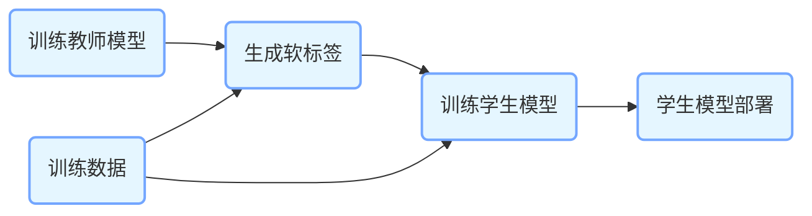

# AI Agent的知识蒸馏在模型轻量化中的应用

> 关键词：AI Agent、知识蒸馏、模型轻量化、深度学习、知识迁移、计算资源优化、模型压缩

> 摘要：本文围绕AI Agent的知识蒸馏在模型轻量化中的应用展开深入探讨。首先介绍了研究的背景、目的、预期读者以及文档结构，明确了相关术语。接着阐述了核心概念，包括AI Agent、知识蒸馏和模型轻量化的原理及它们之间的联系，并给出了相应的架构示意图和Mermaid流程图。详细讲解了知识蒸馏的核心算法原理，通过Python代码示例进行说明，同时介绍了相关的数学模型和公式。通过项目实战，展示了如何搭建开发环境、实现源代码并进行解读分析。探讨了知识蒸馏在模型轻量化中的实际应用场景，推荐了学习资源、开发工具框架以及相关论文著作。最后总结了未来发展趋势与挑战，提供了常见问题解答和扩展阅读参考资料，旨在为读者全面深入地理解和应用AI Agent的知识蒸馏技术实现模型轻量化提供指导。

## 1. 背景介绍 
### 1.1 目的和范围
在当今的人工智能领域，深度学习模型的规模和复杂度不断增加，这虽然带来了更高的性能，但也带来了一系列问题。一方面，大型模型需要大量的计算资源和存储空间，这对于资源受限的设备（如移动设备、嵌入式系统等）来说是难以承受的；另一方面，模型的推理速度也会受到影响，无法满足实时性要求较高的应用场景。因此，模型轻量化成为了一个重要的研究方向。

知识蒸馏作为一种有效的模型压缩技术，通过将大型教师模型的知识迁移到小型学生模型中，使得学生模型能够在保持较高性能的同时，大大减少模型的参数数量和计算量。而AI Agent作为一种能够自主感知环境、做出决策并采取行动的智能体，在许多领域都有广泛的应用。将知识蒸馏技术应用于AI Agent的模型轻量化中，不仅可以提高AI Agent在资源受限环境下的运行效率，还可以降低成本，拓展其应用范围。

本文的范围主要涵盖了AI Agent的知识蒸馏技术的原理、算法、数学模型，以及如何将其应用于模型轻量化的具体步骤和实际案例。同时，还将探讨该技术在不同领域的应用场景、相关的工具和资源，以及未来的发展趋势和挑战。

### 1.2 预期读者
本文的预期读者包括人工智能领域的研究人员、工程师、开发者，以及对深度学习、模型压缩和AI Agent技术感兴趣的学生和爱好者。对于希望了解如何在资源受限环境下提高AI Agent性能的从业者，本文将提供详细的技术指导和实践经验；对于初学者，本文将通过通俗易懂的语言和具体的代码示例，帮助他们理解知识蒸馏和模型轻量化的基本概念和方法。

### 1.3 文档结构概述
本文的文档结构如下：
- 核心概念与联系：介绍AI Agent、知识蒸馏和模型轻量化的核心概念，以及它们之间的联系，并给出相应的架构示意图和Mermaid流程图。
- 核心算法原理 & 具体操作步骤：详细讲解知识蒸馏的核心算法原理，通过Python代码示例说明具体的操作步骤。
- 数学模型和公式 & 详细讲解 & 举例说明：介绍知识蒸馏的数学模型和公式，并通过具体的例子进行详细讲解。
- 项目实战：代码实际案例和详细解释说明：通过一个实际的项目案例，展示如何搭建开发环境、实现源代码并进行解读分析。
- 实际应用场景：探讨知识蒸馏在模型轻量化中的实际应用场景。
- 工具和资源推荐：推荐学习资源、开发工具框架以及相关论文著作。
- 总结：未来发展趋势与挑战：总结知识蒸馏在模型轻量化中的应用现状，分析未来的发展趋势和面临的挑战。
- 附录：常见问题与解答：提供常见问题的解答，帮助读者更好地理解和应用本文介绍的技术。
- 扩展阅读 & 参考资料：提供扩展阅读的建议和相关的参考资料，方便读者进一步深入研究。

### 1.4 术语表
#### 1.4.1 核心术语定义
- **AI Agent**：一种能够自主感知环境、做出决策并采取行动的智能体。它可以是软件程序、机器人或其他形式的智能实体，通过与环境进行交互来实现特定的目标。
- **知识蒸馏**：一种模型压缩技术，通过将大型教师模型的知识迁移到小型学生模型中，使得学生模型能够在保持较高性能的同时，减少模型的参数数量和计算量。
- **模型轻量化**：通过各种技术手段，如模型压缩、量化、剪枝等，减少深度学习模型的参数数量和计算量，从而降低模型的存储需求和推理成本，提高模型在资源受限环境下的运行效率。
- **教师模型**：在知识蒸馏中，通常是一个大型、复杂且性能较高的模型，它拥有丰富的知识和信息，用于指导小型学生模型的学习。
- **学生模型**：在知识蒸馏中，是一个小型、简单的模型，通过学习教师模型的知识来提高自身的性能。

#### 1.4.2 相关概念解释
- **软标签**：在知识蒸馏中，教师模型输出的概率分布称为软标签。与传统的硬标签（只有一个类别为1，其余为0）不同，软标签包含了更多的类别之间的关系信息，可以帮助学生模型更好地学习。
- **温度参数**：在知识蒸馏中，温度参数用于控制软标签的平滑程度。较高的温度会使软标签更加平滑，使得学生模型能够学习到更多的类别之间的关系；较低的温度会使软标签更加接近硬标签。
- **蒸馏损失**：知识蒸馏的目标是最小化学生模型的预测结果与教师模型的软标签之间的差异，这个差异通常用蒸馏损失来衡量。常见的蒸馏损失函数包括KL散度、交叉熵损失等。

#### 1.4.3 缩略词列表
- **DNN**：Deep Neural Network，深度神经网络
- **CNN**：Convolutional Neural Network，卷积神经网络
- **RNN**：Recurrent Neural Network，循环神经网络
- **KL**：Kullback-Leibler，KL散度

## 2. 核心概念与联系 
### 核心概念原理
#### AI Agent
AI Agent是人工智能领域中的一个重要概念，它可以看作是一个具有自主能力的智能体，能够感知环境的状态，并根据自身的目标和策略做出决策，采取相应的行动。AI Agent的核心组成部分包括感知模块、决策模块和行动模块。感知模块用于获取环境的信息，决策模块根据感知到的信息和自身的目标进行决策，行动模块则根据决策结果执行相应的动作。

在深度学习中，AI Agent通常由神经网络模型来实现。例如，在强化学习中，AI Agent通过与环境进行交互，不断学习最优的策略，以最大化累积奖励。在图像识别、自然语言处理等领域，AI Agent可以利用深度学习模型对输入的数据进行分类、生成等操作。

#### 知识蒸馏
知识蒸馏的核心思想是将大型教师模型的知识迁移到小型学生模型中。教师模型通常是一个经过充分训练的、性能较高的模型，它在训练过程中学习到了丰富的知识和信息。学生模型则是一个相对较小、较简单的模型，其目标是通过学习教师模型的知识来提高自身的性能。

知识蒸馏的过程通常包括以下几个步骤：
1. 训练教师模型：使用大量的训练数据对教师模型进行训练，使其达到较高的性能。
2. 生成软标签：将训练数据输入到教师模型中，得到教师模型的输出概率分布，即软标签。
3. 训练学生模型：在训练学生模型时，不仅使用真实的标签，还使用教师模型的软标签。通过最小化学生模型的预测结果与软标签之间的差异，使学生模型学习到教师模型的知识。

#### 模型轻量化
模型轻量化是为了解决深度学习模型在资源受限环境下的应用问题而提出的技术。随着深度学习模型的规模和复杂度不断增加，模型的存储需求和计算量也越来越大，这对于资源有限的设备（如移动设备、嵌入式系统等）来说是一个巨大的挑战。

模型轻量化的主要方法包括模型压缩、量化、剪枝等。模型压缩通过减少模型的参数数量来降低模型的存储需求；量化通过将模型的参数从高精度数据类型转换为低精度数据类型，减少计算量和存储需求；剪枝则通过去除模型中不重要的连接或神经元，简化模型结构。

### 架构的文本示意图
```plaintext
+---------------------+       +---------------------+
|      教师模型       |       |      学生模型       |
| (大型、高性能模型) |       | (小型、简单模型)    |
+---------------------+       +---------------------+
           |                          |
           | 生成软标签               | 学习软标签
           v                          v
+---------------------+       +---------------------+
|      训练数据       |       |      训练数据       |
+---------------------+       +---------------------+
```

### Mermaid流程图


## 3. 核心算法原理 & 具体操作步骤 
### 核心算法原理
知识蒸馏的核心算法主要基于损失函数的设计，其目标是让学生模型学习到教师模型的知识。常见的知识蒸馏损失函数是基于KL散度的损失函数。

假设教师模型的输出概率分布为 $p_T$，学生模型的输出概率分布为 $p_S$，温度参数为 $T$。在知识蒸馏中，通常会对教师模型和学生模型的输出进行软化处理，即将输出的logits除以温度参数 $T$ 后再进行softmax操作。

软化后的教师模型输出概率分布为：
$$p_T^s = \text{softmax}(\frac{z_T}{T})$$
其中，$z_T$ 是教师模型的logits输出。

软化后的学生模型输出概率分布为：
$$p_S^s = \text{softmax}(\frac{z_S}{T})$$
其中，$z_S$ 是学生模型的logits输出。

知识蒸馏的损失函数通常由两部分组成：一部分是学生模型的预测结果与真实标签之间的交叉熵损失 $L_{CE}$，另一部分是学生模型的软化输出与教师模型的软化输出之间的KL散度损失 $L_{KL}$。

$$L_{KD} = \alpha L_{CE} + (1 - \alpha) T^2 L_{KL}(p_T^s, p_S^s)$$
其中，$\alpha$ 是一个超参数，用于控制两部分损失的权重。

### 具体操作步骤
以下是使用Python和PyTorch实现知识蒸馏的具体步骤：

```python
import torch
import torch.nn as nn
import torch.optim as optim

# 定义教师模型
class TeacherModel(nn.Module):
    def __init__(self):
        super(TeacherModel, self).__init__()
        self.fc1 = nn.Linear(10, 20)
        self.fc2 = nn.Linear(20, 2)

    def forward(self, x):
        x = torch.relu(self.fc1(x))
        x = self.fc2(x)
        return x

# 定义学生模型
class StudentModel(nn.Module):
    def __init__(self):
        super(StudentModel, self).__init__()
        self.fc1 = nn.Linear(10, 10)
        self.fc2 = nn.Linear(10, 2)

    def forward(self, x):
        x = torch.relu(self.fc1(x))
        x = self.fc2(x)
        return x

# 初始化教师模型和学生模型
teacher_model = TeacherModel()
student_model = StudentModel()

# 定义损失函数和优化器
criterion_ce = nn.CrossEntropyLoss()
criterion_kl = nn.KLDivLoss(reduction='batchmean')
optimizer = optim.Adam(student_model.parameters(), lr=0.001)

# 超参数设置
alpha = 0.5
T = 2.0

# 模拟训练数据
inputs = torch.randn(32, 10)
labels = torch.randint(0, 2, (32,))

# 训练学生模型
for epoch in range(100):
    # 教师模型前向传播
    teacher_outputs = teacher_model(inputs)
    teacher_soft_labels = torch.softmax(teacher_outputs / T, dim=1)

    # 学生模型前向传播
    student_outputs = student_model(inputs)
    student_soft_outputs = torch.softmax(student_outputs / T, dim=1)

    # 计算损失
    loss_ce = criterion_ce(student_outputs, labels)
    loss_kl = criterion_kl(torch.log(student_soft_outputs), teacher_soft_labels)
    loss_kd = alpha * loss_ce + (1 - alpha) * T * T * loss_kl

    # 反向传播和优化
    optimizer.zero_grad()
    loss_kd.backward()
    optimizer.step()

    if (epoch + 1) % 10 == 0:
        print(f'Epoch [{epoch + 1}/100], Loss: {loss_kd.item():.4f}')
```

### 代码解释
1. **模型定义**：定义了教师模型 `TeacherModel` 和学生模型 `StudentModel`，它们都是简单的全连接神经网络。
2. **损失函数和优化器**：使用 `CrossEntropyLoss` 作为学生模型的预测结果与真实标签之间的损失函数，使用 `KLDivLoss` 作为学生模型的软化输出与教师模型的软化输出之间的损失函数。使用 `Adam` 优化器对学生模型的参数进行优化。
3. **超参数设置**：设置了超参数 $\alpha$ 和温度参数 $T$。
4. **模拟训练数据**：生成了随机的输入数据 `inputs` 和标签 `labels`。
5. **训练过程**：在每个训练周期中，首先让教师模型进行前向传播，得到软化后的软标签；然后让学生模型进行前向传播，得到软化后的输出；接着计算知识蒸馏损失 $L_{KD}$；最后进行反向传播和参数更新。

## 4. 数学模型和公式 & 详细讲解 & 举例说明 
### 数学模型和公式
#### KL散度
KL散度（Kullback-Leibler divergence）是一种衡量两个概率分布之间差异的度量。对于两个离散概率分布 $p$ 和 $q$，KL散度的定义为：
$$D_{KL}(p || q) = \sum_{i} p(i) \log \frac{p(i)}{q(i)}$$

在知识蒸馏中，我们使用KL散度来衡量学生模型的软化输出与教师模型的软化输出之间的差异。假设教师模型的软化输出概率分布为 $p_T^s$，学生模型的软化输出概率分布为 $p_S^s$，则KL散度损失为：
$$L_{KL}(p_T^s, p_S^s) = \sum_{i} p_T^s(i) \log \frac{p_T^s(i)}{p_S^s(i)}$$

#### 交叉熵损失
交叉熵损失是一种常用的分类损失函数，用于衡量模型的预测结果与真实标签之间的差异。对于一个样本的预测概率分布 $p$ 和真实标签的概率分布 $y$，交叉熵损失的定义为：
$$L_{CE}(p, y) = - \sum_{i} y(i) \log p(i)$$

在知识蒸馏中，我们使用交叉熵损失来衡量学生模型的预测结果与真实标签之间的差异。

#### 知识蒸馏损失
知识蒸馏的损失函数由两部分组成：交叉熵损失 $L_{CE}$ 和KL散度损失 $L_{KL}$。
$$L_{KD} = \alpha L_{CE} + (1 - \alpha) T^2 L_{KL}(p_T^s, p_S^s)$$
其中，$\alpha$ 是一个超参数，用于控制两部分损失的权重；$T$ 是温度参数，用于控制软标签的平滑程度。

### 详细讲解
#### KL散度的作用
KL散度用于衡量两个概率分布之间的差异。在知识蒸馏中，教师模型的软标签包含了更多的类别之间的关系信息，通过最小化学生模型的软化输出与教师模型的软化输出之间的KL散度，学生模型可以学习到教师模型的知识。

#### 温度参数的作用
温度参数 $T$ 用于控制软标签的平滑程度。当 $T$ 较大时，软标签更加平滑，学生模型可以学习到更多的类别之间的关系；当 $T$ 较小时，软标签更加接近硬标签，学生模型更注重学习正确的类别。

#### 超参数 $\alpha$ 的作用
超参数 $\alpha$ 用于控制交叉熵损失和KL散度损失的权重。当 $\alpha$ 较大时，学生模型更注重学习真实标签；当 $\alpha$ 较小时，学生模型更注重学习教师模型的知识。

### 举例说明
假设我们有一个三分类问题，教师模型的输出logits为 $z_T = [1, 2, 3]$，学生模型的输出logits为 $z_S = [0.5, 1.5, 2.5]$，真实标签为 $y = [0, 0, 1]$，温度参数 $T = 2$，超参数 $\alpha = 0.5$。

首先，计算教师模型的软化输出概率分布 $p_T^s$：
$$p_T^s = \text{softmax}(\frac{z_T}{T}) = \text{softmax}([0.5, 1, 1.5]) = [0.11, 0.24, 0.65]$$

然后，计算学生模型的软化输出概率分布 $p_S^s$：
$$p_S^s = \text{softmax}(\frac{z_S}{T}) = \text{softmax}([0.25, 0.75, 1.25]) = [0.14, 0.28, 0.58]$$

接着，计算交叉熵损失 $L_{CE}$：
$$L_{CE} = - \sum_{i} y(i) \log p_S(i) = - \log p_S(2) = - \log 0.58 = 0.54$$

再计算KL散度损失 $L_{KL}$：
$$L_{KL}(p_T^s, p_S^s) = \sum_{i} p_T^s(i) \log \frac{p_T^s(i)}{p_S^s(i)} = 0.11 \log \frac{0.11}{0.14} + 0.24 \log \frac{0.24}{0.28} + 0.65 \log \frac{0.65}{0.58} = 0.03$$

最后，计算知识蒸馏损失 $L_{KD}$：
$$L_{KD} = \alpha L_{CE} + (1 - \alpha) T^2 L_{KL}(p_T^s, p_S^s) = 0.5 \times 0.54 + (1 - 0.5) \times 2^2 \times 0.03 = 0.33$$

## 5. 项目实战：代码实际案例和详细解释说明 
### 5.1  开发环境搭建
#### 安装Python和PyTorch
首先，确保你已经安装了Python 3.x版本。可以从Python官方网站（https://www.python.org/downloads/）下载并安装。

然后，安装PyTorch。根据你的CUDA版本和操作系统，选择合适的安装命令。例如，如果你使用的是CUDA 11.3和Windows系统，可以使用以下命令安装：
```bash
pip install torch torchvision torchaudio --extra-index-url https://download.pytorch.org/whl/cu113
```

#### 安装其他依赖库
还需要安装一些其他的依赖库，如 `numpy`、`matplotlib` 等。可以使用以下命令安装：
```bash
pip install numpy matplotlib
```

### 5.2  源代码详细实现和代码解读
以下是一个使用知识蒸馏对MNIST手写数字识别模型进行轻量化的实际案例：

```python
import torch
import torch.nn as nn
import torch.optim as optim
import torchvision
import torchvision.transforms as transforms

# 定义教师模型
class TeacherModel(nn.Module):
    def __init__(self):
        super(TeacherModel, self).__init__()
        self.conv1 = nn.Conv2d(1, 32, kernel_size=3, padding=1)
        self.relu1 = nn.ReLU()
        self.pool1 = nn.MaxPool2d(2)
        self.conv2 = nn.Conv2d(32, 64, kernel_size=3, padding=1)
        self.relu2 = nn.ReLU()
        self.pool2 = nn.MaxPool2d(2)
        self.fc1 = nn.Linear(64 * 7 * 7, 128)
        self.relu3 = nn.ReLU()
        self.fc2 = nn.Linear(128, 10)

    def forward(self, x):
        x = self.pool1(self.relu1(self.conv1(x)))
        x = self.pool2(self.relu2(self.conv2(x)))
        x = x.view(-1, 64 * 7 * 7)
        x = self.relu3(self.fc1(x))
        x = self.fc2(x)
        return x

# 定义学生模型
class StudentModel(nn.Module):
    def __init__(self):
        super(StudentModel, self).__init__()
        self.conv1 = nn.Conv2d(1, 16, kernel_size=3, padding=1)
        self.relu1 = nn.ReLU()
        self.pool1 = nn.MaxPool2d(2)
        self.fc1 = nn.Linear(16 * 14 * 14, 64)
        self.relu2 = nn.ReLU()
        self.fc2 = nn.Linear(64, 10)

    def forward(self, x):
        x = self.pool1(self.relu1(self.conv1(x)))
        x = x.view(-1, 16 * 14 * 14)
        x = self.relu2(self.fc1(x))
        x = self.fc2(x)
        return x

# 数据加载和预处理
transform = transforms.Compose([
    transforms.ToTensor(),
    transforms.Normalize((0.5,), (0.5,))
])

trainset = torchvision.datasets.MNIST(root='./data', train=True,
                                      download=True, transform=transform)
trainloader = torch.utils.data.DataLoader(trainset, batch_size=64,
                                          shuffle=True)

testset = torchvision.datasets.MNIST(root='./data', train=False,
                                     download=True, transform=transform)
testloader = torch.utils.data.DataLoader(testset, batch_size=64,
                                         shuffle=False)

# 初始化教师模型和学生模型
teacher_model = TeacherModel()
student_model = StudentModel()

# 定义损失函数和优化器
criterion_ce = nn.CrossEntropyLoss()
criterion_kl = nn.KLDivLoss(reduction='batchmean')
optimizer = optim.Adam(student_model.parameters(), lr=0.001)

# 超参数设置
alpha = 0.5
T = 2.0

# 训练学生模型
for epoch in range(10):
    running_loss = 0.0
    for i, data in enumerate(trainloader, 0):
        inputs, labels = data

        # 教师模型前向传播
        teacher_outputs = teacher_model(inputs)
        teacher_soft_labels = torch.softmax(teacher_outputs / T, dim=1)

        # 学生模型前向传播
        student_outputs = student_model(inputs)
        student_soft_outputs = torch.softmax(student_outputs / T, dim=1)

        # 计算损失
        loss_ce = criterion_ce(student_outputs, labels)
        loss_kl = criterion_kl(torch.log(student_soft_outputs), teacher_soft_labels)
        loss_kd = alpha * loss_ce + (1 - alpha) * T * T * loss_kl

        # 反向传播和优化
        optimizer.zero_grad()
        loss_kd.backward()
        optimizer.step()

        running_loss += loss_kd.item()

    print(f'Epoch [{epoch + 1}/10], Loss: {running_loss / len(trainloader):.4f}')

# 测试学生模型
correct = 0
total = 0
with torch.no_grad():
    for data in testloader:
        images, labels = data
        outputs = student_model(images)
        _, predicted = torch.max(outputs.data, 1)
        total += labels.size(0)
        correct += (predicted == labels).sum().item()

print(f'Accuracy of the student network on the 10000 test images: {100 * correct / total}%')
```

### 代码解读
1. **模型定义**：定义了教师模型 `TeacherModel` 和学生模型 `StudentModel`。教师模型是一个相对复杂的卷积神经网络，包含两个卷积层和两个全连接层；学生模型是一个相对简单的卷积神经网络，包含一个卷积层和两个全连接层。
2. **数据加载和预处理**：使用 `torchvision` 加载MNIST数据集，并进行预处理，包括将图像转换为张量和归一化。
3. **损失函数和优化器**：使用 `CrossEntropyLoss` 作为学生模型的预测结果与真实标签之间的损失函数，使用 `KLDivLoss` 作为学生模型的软化输出与教师模型的软化输出之间的损失函数。使用 `Adam` 优化器对学生模型的参数进行优化。
4. **超参数设置**：设置了超参数 $\alpha$ 和温度参数 $T$。
5. **训练过程**：在每个训练周期中，首先让教师模型进行前向传播，得到软化后的软标签；然后让学生模型进行前向传播，得到软化后的输出；接着计算知识蒸馏损失 $L_{KD}$；最后进行反向传播和参数更新。
6. **测试过程**：在训练完成后，使用测试集对学生模型进行测试，计算模型的准确率。

## 6. 实际应用场景 
### 移动设备和嵌入式系统
在移动设备（如智能手机、平板电脑）和嵌入式系统（如智能手表、智能家居设备）中，资源通常是有限的，包括计算资源、存储资源和电池续航能力。大型深度学习模型在这些设备上运行会面临性能瓶颈和能耗问题。通过知识蒸馏技术对模型进行轻量化，可以使模型在资源受限的设备上高效运行，同时保持较高的性能。例如，在智能手机上实现实时图像识别、语音识别等功能。

### 边缘计算
边缘计算是指在靠近数据源的边缘节点进行数据处理和分析，以减少数据传输延迟和带宽需求。在边缘计算场景中，边缘设备（如智能摄像头、工业传感器等）通常具有有限的计算和存储能力。知识蒸馏可以将云端的大型模型的知识迁移到边缘设备上的小型模型中，使边缘设备能够独立完成一些复杂的任务，如目标检测、异常检测等，提高系统的实时性和可靠性。

### 实时决策系统
在一些实时决策系统中，如自动驾驶、金融交易等，需要快速做出决策。大型深度学习模型的推理速度较慢，无法满足实时性要求。通过知识蒸馏对模型进行轻量化，可以提高模型的推理速度，使系统能够在短时间内做出准确的决策。例如，在自动驾驶中，车辆需要实时对周围环境进行感知和决策，轻量化的模型可以更快地处理传感器数据，提高行车安全性。

### 多模型集成
在一些复杂的应用场景中，可能需要使用多个模型进行集成，以提高系统的性能。然而，多个大型模型的集成会增加计算成本和存储需求。知识蒸馏可以将多个大型模型的知识集成到一个小型模型中，实现模型的轻量化和高效集成。例如，在图像分类任务中，可以将多个不同架构的大型模型的知识蒸馏到一个小型模型中，提高分类准确率。

## 7. 工具和资源推荐
### 7.1 学习资源推荐
#### 7.1.1 书籍推荐
- 《深度学习》（Deep Learning）：由Ian Goodfellow、Yoshua Bengio和Aaron Courville撰写，是深度学习领域的经典教材，全面介绍了深度学习的基本概念、算法和应用。
- 《动手学深度学习》（Dive into Deep Learning）：由李沐等人编写，以动手实践为导向，详细介绍了深度学习的原理和实现方法，提供了大量的代码示例。
- 《人工智能：一种现代的方法》（Artificial Intelligence: A Modern Approach）：由Stuart Russell和Peter Norvig编写，是人工智能领域的权威教材，涵盖了人工智能的各个方面，包括知识表示、推理、学习、规划等。

#### 7.1.2 在线课程
- Coursera上的“深度学习专项课程”（Deep Learning Specialization）：由Andrew Ng教授授课，包括五门课程，全面介绍了深度学习的基础知识和应用。
- edX上的“强化学习基础”（Foundations of Reinforcement Learning）：由Pieter Abbeel教授授课，介绍了强化学习的基本概念、算法和应用。
- 哔哩哔哩上的“李宏毅机器学习”：由李宏毅教授授课，以生动有趣的方式讲解机器学习和深度学习的知识，适合初学者。

#### 7.1.3 技术博客和网站
- Medium上的Towards Data Science：是一个专注于数据科学和人工智能的技术博客平台，提供了大量的高质量文章和教程。
- 机器之心：是一个专注于人工智能领域的科技媒体，提供了最新的技术动态、研究成果和应用案例。
- 开源中国：是一个开源技术社区，提供了丰富的开源项目和技术文章，包括深度学习、机器学习等领域。

### 7.2 开发工具框架推荐
#### 7.2.1 IDE和编辑器
- PyCharm：是一款专门为Python开发设计的集成开发环境（IDE），提供了丰富的功能和插件，如代码调试、代码分析、版本控制等，适合专业的Python开发者。
- Jupyter Notebook：是一个基于网页的交互式开发环境，支持Python、R等多种编程语言，适合数据科学和机器学习的开发和实验。
- Visual Studio Code：是一款轻量级的代码编辑器，支持多种编程语言和插件，具有丰富的扩展功能，适合快速开发和调试。

#### 7.2.2 调试和性能分析工具
- PyTorch Profiler：是PyTorch提供的性能分析工具，可以帮助开发者分析模型的运行时间、内存使用情况等，找出性能瓶颈。
- TensorBoard：是TensorFlow提供的可视化工具，也可以用于PyTorch模型的可视化和调试，支持可视化模型的训练过程、损失曲线、准确率等。
- NVIDIA Nsight Systems：是NVIDIA提供的性能分析工具，专门用于分析GPU应用程序的性能，可以帮助开发者优化GPU代码。

#### 7.2.3 相关框架和库
- PyTorch：是一个开源的深度学习框架，具有动态图、易于使用等特点，广泛应用于学术界和工业界。
- TensorFlow：是另一个开源的深度学习框架，具有强大的分布式训练和部署能力，被许多大型科技公司广泛使用。
- Scikit-learn：是一个开源的机器学习库，提供了丰富的机器学习算法和工具，如分类、回归、聚类等，适合初学者和快速开发。

### 7.3 相关论文著作推荐
#### 7.3.1 经典论文
- “Distilling the Knowledge in a Neural Network”：由Geoffrey Hinton等人发表，是知识蒸馏领域的开创性论文，首次提出了知识蒸馏的概念和方法。
- “MobileNetV2: Inverted Residuals and Linear Bottlenecks”：由Mark Sandler等人发表，提出了MobileNetV2架构，是一种轻量级的卷积神经网络，适合在移动设备上运行。
- “EfficientNet: Rethinking Model Scaling for Convolutional Neural Networks”：由Mingxing Tan和Quoc V. Le发表，提出了EfficientNet架构，通过自动搜索网络的宽度、深度和分辨率，实现了高效的模型缩放。

#### 7.3.2 最新研究成果
- 关注arXiv.org上的最新论文，该网站是一个预印本平台，许多研究人员会在上面发布最新的研究成果。可以通过搜索关键词“Knowledge Distillation”、“Model Compression”等找到相关的论文。
- 参加国际人工智能会议，如NeurIPS、ICML、CVPR等，这些会议是人工智能领域的顶级会议，会展示最新的研究成果和技术趋势。

#### 7.3.3 应用案例分析
- 关注各大科技公司的技术博客，如Google AI Blog、Facebook AI Research等，这些博客会分享他们在人工智能领域的应用案例和技术经验。
- 阅读相关的技术报告和白皮书，如华为的《人工智能白皮书》、百度的《深度学习技术发展白皮书》等，这些报告和白皮书会介绍人工智能技术在不同领域的应用案例和发展趋势。

## 8. 总结：未来发展趋势与挑战
### 未来发展趋势
#### 更高效的知识蒸馏算法
随着深度学习模型的不断发展和复杂化，对知识蒸馏算法的效率和性能提出了更高的要求。未来，研究人员将致力于开发更高效的知识蒸馏算法，如自适应蒸馏、多教师蒸馏等，以提高学生模型的性能和学习效率。

#### 与其他模型压缩技术的结合
知识蒸馏可以与其他模型压缩技术（如量化、剪枝等）相结合，进一步提高模型的轻量化程度。例如，先使用知识蒸馏将大型模型的知识迁移到小型模型中，再对小型模型进行量化和剪枝，以达到更好的压缩效果。

#### 跨领域知识蒸馏
未来，知识蒸馏技术将不仅仅局限于单一领域的模型轻量化，还将拓展到跨领域的知识迁移。例如，将图像领域的知识蒸馏到语音领域的模型中，实现跨模态的知识共享和融合。

#### 强化学习中的知识蒸馏
强化学习是人工智能领域的一个重要分支，知识蒸馏技术在强化学习中的应用也将得到更多的关注。通过将专家策略的知识蒸馏到智能体的模型中，可以加速智能体的学习过程，提高其性能和泛化能力。

### 挑战
#### 知识迁移的有效性
在知识蒸馏过程中，如何确保教师模型的知识能够有效地迁移到学生模型中，是一个关键的挑战。由于教师模型和学生模型的结构和复杂度可能不同，知识迁移过程中可能会出现信息丢失或失真的问题，影响学生模型的性能。

#### 超参数的选择
知识蒸馏中的超参数（如温度参数、损失权重等）对学生模型的性能有重要影响。然而，超参数的选择通常需要大量的实验和调优，缺乏有效的理论指导。如何自动选择最优的超参数，是一个亟待解决的问题。

#### 计算资源的限制
虽然知识蒸馏可以减少模型的参数数量和计算量，但在大规模数据集和复杂模型的情况下，知识蒸馏仍然需要大量的计算资源和时间。如何在有限的计算资源下提高知识蒸馏的效率，是一个实际应用中面临的挑战。

#### 可解释性和安全性
随着人工智能技术的广泛应用，模型的可解释性和安全性越来越受到关注。知识蒸馏过程中，学生模型学习到的知识可能是黑盒的，缺乏可解释性。同时，如何确保知识蒸馏过程的安全性，防止模型被攻击和篡改，也是一个重要的挑战。

## 9. 附录：常见问题与解答
### 知识蒸馏和模型量化、剪枝有什么区别？
知识蒸馏是一种模型压缩技术，通过将大型教师模型的知识迁移到小型学生模型中，使学生模型在保持较高性能的同时减少参数数量和计算量。模型量化是将模型的参数从高精度数据类型转换为低精度数据类型，以减少存储需求和计算量。模型剪枝是通过去除模型中不重要的连接或神经元，简化模型结构。知识蒸馏主要关注知识的迁移，而模型量化和剪枝主要关注模型结构的优化。

### 知识蒸馏中的温度参数有什么作用？
温度参数用于控制软标签的平滑程度。较高的温度会使软标签更加平滑，使得学生模型能够学习到更多的类别之间的关系；较低的温度会使软标签更加接近硬标签。通过调整温度参数，可以平衡学生模型对类别关系的学习和对正确类别的学习。

### 如何选择知识蒸馏中的超参数？
知识蒸馏中的超参数（如温度参数、损失权重等）的选择通常需要大量的实验和调优。可以通过网格搜索、随机搜索等方法在一定范围内尝试不同的超参数组合，然后选择在验证集上性能最好的超参数。此外，也可以参考相关的研究论文和经验，根据具体的任务和数据集进行调整。

### 知识蒸馏是否适用于所有类型的模型？
知识蒸馏适用于大多数类型的深度学习模型，包括卷积神经网络（CNN）、循环神经网络（RNN）、全连接神经网络等。然而，对于一些特殊结构的模型，如生成对抗网络（GAN），知识蒸馏的应用可能会受到一定的限制。在实际应用中，需要根据具体的模型结构和任务需求进行调整和优化。

### 知识蒸馏会导致学生模型的过拟合吗？
知识蒸馏本身不会直接导致学生模型的过拟合，但如果在知识蒸馏过程中存在一些问题，如教师模型过拟合、超参数选择不当等，可能会间接导致学生模型过拟合。为了避免过拟合，可以采取一些措施，如使用正则化方法、增加训练数据、合理选择超参数等。

## 10. 扩展阅读 & 参考资料
### 扩展阅读
- 《深度强化学习实战》：深入介绍了深度强化学习的理论和实践，包括策略梯度算法、价值函数算法等，对于理解强化学习中的知识蒸馏有一定的帮助。
- 《神经网络与深度学习》：详细介绍了神经网络的基本原理、训练方法和应用，适合进一步深入学习深度学习的基础知识。
- 《人工智能前沿技术》：涵盖了人工智能领域的最新前沿技术，如生成对抗网络、注意力机制等，可以帮助读者了解人工智能的发展趋势。

### 参考资料
- Hinton, G., Vinyals, O., & Dean, J. (2015). Distilling the Knowledge in a Neural Network. arXiv preprint arXiv:1503.02531.
- Sandler, M., Howard, A., Zhu, M., Zhmoginov, A., & Chen, L. C. (2018). MobileNetV2: Inverted Residuals and Linear Bottlenecks. In Proceedings of the IEEE conference on computer vision and pattern recognition (pp. 4510-4520).
- Tan, M., & Le, Q. V. (2019). EfficientNet: Rethinking Model Scaling for Convolutional Neural Networks. In Proceedings of the 36th International Conference on Machine Learning-Volume 97 (pp. 6105-6114).
- PyTorch官方文档：https://pytorch.org/docs/stable/index.html
- TensorFlow官方文档：https://www.tensorflow.org/api_docs