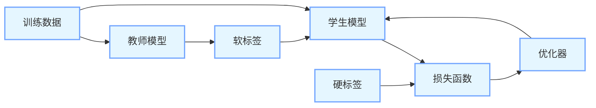

# AI Agent的知识蒸馏：从复杂模型到高效模型

> 关键词：AI Agent、知识蒸馏、复杂模型、高效模型、模型压缩

> 摘要：本文围绕AI Agent的知识蒸馏展开，深入探讨如何将复杂模型的知识迁移至高效模型。详细介绍了知识蒸馏的核心概念、算法原理、数学模型，通过实际代码案例展示其实现过程。同时，分析了知识蒸馏在不同场景的应用，推荐了相关的学习资源、开发工具和研究论文。最后，对知识蒸馏的未来发展趋势与挑战进行总结，并解答常见问题，为读者全面了解和应用知识蒸馏技术提供参考。

## 1. 背景介绍 
### 1.1 目的和范围
在当今人工智能领域，复杂模型如大型预训练语言模型、深度卷积神经网络等，在各种任务中展现出了卓越的性能。然而，这些模型通常具有庞大的参数数量和复杂的结构，导致计算资源需求高、推理速度慢，难以在资源受限的设备上部署。知识蒸馏作为一种有效的模型压缩技术，旨在将复杂模型（教师模型）所学到的知识迁移到一个较小的模型（学生模型）中，从而在保持较高性能的同时，显著降低模型的复杂度和资源消耗。

本文的范围涵盖了知识蒸馏的基本概念、核心算法原理、数学模型、实际应用场景以及相关的工具和资源推荐。通过理论分析和实际案例相结合的方式，帮助读者深入理解知识蒸馏技术，并掌握其在AI Agent中的应用方法。

### 1.2 预期读者
本文的预期读者包括人工智能领域的研究人员、开发者、数据科学家以及对模型压缩和知识迁移技术感兴趣的技术爱好者。对于正在从事AI Agent开发，希望提高模型效率和性能的专业人士，本文将提供有价值的参考和指导。

### 1.3 文档结构概述
本文将按照以下结构进行组织：
- 核心概念与联系：介绍知识蒸馏的基本概念、原理和架构，并通过示意图和流程图进行直观展示。
- 核心算法原理 & 具体操作步骤：详细讲解知识蒸馏的核心算法，使用Python源代码进行示例说明，并给出具体的操作步骤。
- 数学模型和公式 & 详细讲解 & 举例说明：推导知识蒸馏的数学模型和公式，对其进行详细解释，并通过具体例子加深理解。
- 项目实战：代码实际案例和详细解释说明：通过实际项目案例，展示知识蒸馏的具体实现过程，包括开发环境搭建、源代码实现和代码解读。
- 实际应用场景：分析知识蒸馏在不同领域的实际应用场景，如自然语言处理、计算机视觉等。
- 工具和资源推荐：推荐相关的学习资源、开发工具和研究论文，帮助读者进一步深入学习和研究知识蒸馏技术。
- 总结：未来发展趋势与挑战：对知识蒸馏的未来发展趋势进行展望，并分析其面临的挑战。
- 附录：常见问题与解答：解答读者在学习和应用知识蒸馏技术过程中常见的问题。
- 扩展阅读 & 参考资料：提供相关的扩展阅读材料和参考资料，方便读者进一步探索。

### 1.4 术语表
#### 1.4.1 核心术语定义
- **AI Agent**：人工智能代理，是一种能够感知环境、做出决策并采取行动以实现特定目标的智能实体。
- **知识蒸馏（Knowledge Distillation）**：一种模型压缩技术，通过将复杂模型（教师模型）的知识迁移到简单模型（学生模型）中，使学生模型能够在保持较高性能的同时，降低模型复杂度和资源消耗。
- **教师模型（Teacher Model）**：知识蒸馏中的复杂模型，通常具有较高的性能和丰富的知识，但计算资源需求大。
- **学生模型（Student Model）**：知识蒸馏中的简单模型，通过学习教师模型的知识，在性能和资源消耗之间取得平衡。
- **软标签（Soft Labels）**：教师模型输出的概率分布，包含了更多的类别之间的相对关系信息，用于指导学生模型的学习。
- **硬标签（Hard Labels）**：传统的类别标签，只表示样本所属的类别。

#### 1.4.2 相关概念解释
- **模型压缩（Model Compression）**：通过各种技术手段，如剪枝、量化、知识蒸馏等，减少模型的参数数量和计算复杂度，从而降低模型的存储和计算资源需求。
- **迁移学习（Transfer Learning）**：将在一个任务上学习到的知识迁移到另一个相关任务上，以提高模型在新任务上的性能和训练效率。
- **集成学习（Ensemble Learning）**：将多个模型的预测结果进行组合，以提高整体模型的性能和稳定性。

#### 1.4.3 缩略词列表
- **DNN**：深度神经网络（Deep Neural Network）
- **CNN**：卷积神经网络（Convolutional Neural Network）
- **RNN**：循环神经网络（Recurrent Neural Network）
- **BERT**：Bidirectional Encoder Representations from Transformers
- **GPT**：Generative Pretrained Transformer

## 2. 核心概念与联系 

### 知识蒸馏的基本原理
知识蒸馏的核心思想是让学生模型学习教师模型的输出，而不仅仅是训练数据的硬标签。教师模型通常是一个复杂的、经过充分训练的模型，具有较高的性能和丰富的知识。学生模型则是一个相对简单的模型，通过模仿教师模型的输出，学习到教师模型所蕴含的知识。

在传统的监督学习中，模型的训练目标是最小化预测结果与硬标签之间的损失。而在知识蒸馏中，除了最小化学生模型预测结果与硬标签之间的损失外，还需要最小化学生模型预测结果与教师模型输出的软标签之间的损失。软标签包含了更多的类别之间的相对关系信息，能够为学生模型提供更丰富的学习信号。

### 知识蒸馏的架构
知识蒸馏的基本架构如图1所示：



图1：知识蒸馏架构示意图

在这个架构中，训练数据同时输入到教师模型和学生模型中。教师模型输出软标签，学生模型根据输入数据进行预测。损失函数综合考虑了学生模型预测结果与硬标签之间的损失以及学生模型预测结果与软标签之间的损失。优化器根据损失函数的结果更新学生模型的参数，使得学生模型逐渐学习到教师模型的知识。

### 知识蒸馏与其他技术的联系
知识蒸馏与模型压缩、迁移学习和集成学习等技术密切相关。

- **与模型压缩的联系**：知识蒸馏是一种有效的模型压缩技术，通过将复杂模型的知识迁移到简单模型中，减少模型的参数数量和计算复杂度，从而实现模型的压缩。
- **与迁移学习的联系**：知识蒸馏可以看作是一种特殊的迁移学习，将教师模型在一个任务上学习到的知识迁移到学生模型上，以提高学生模型在相同或相关任务上的性能。
- **与集成学习的联系**：知识蒸馏可以与集成学习相结合，将多个教师模型的知识迁移到一个学生模型中，从而提高学生模型的性能和稳定性。

## 3. 核心算法原理 & 具体操作步骤 

### 核心算法原理
知识蒸馏的核心算法主要包括以下几个步骤：

1. **训练教师模型**：使用大量的训练数据对复杂的教师模型进行训练，使其在目标任务上达到较高的性能。
2. **生成软标签**：将训练数据输入到教师模型中，得到教师模型的输出，即软标签。
3. **训练学生模型**：在训练学生模型时，同时考虑学生模型预测结果与硬标签之间的损失以及学生模型预测结果与软标签之间的损失。通常使用以下损失函数：

$$
L = \alpha \cdot L_{CE}(y, \hat{y}) + (1 - \alpha) \cdot T^2 \cdot L_{KL}(p_T, p_S)
$$

其中，$L_{CE}(y, \hat{y})$ 是学生模型预测结果 $\hat{y}$ 与硬标签 $y$ 之间的交叉熵损失，$L_{KL}(p_T, p_S)$ 是学生模型预测结果的概率分布 $p_S$ 与教师模型输出的软标签的概率分布 $p_T$ 之间的KL散度，$\alpha$ 是一个超参数，用于平衡两种损失的权重，$T$ 是温度参数，用于控制软标签的平滑程度。

4. **优化学生模型**：使用优化器（如随机梯度下降、Adam等）根据损失函数的结果更新学生模型的参数，使得损失函数逐渐减小。

### 具体操作步骤

以下是使用Python和PyTorch实现知识蒸馏的具体操作步骤：

```python
import torch
import torch.nn as nn
import torch.optim as optim
from torch.utils.data import DataLoader, Dataset

# 定义教师模型
class TeacherModel(nn.Module):
    def __init__(self):
        super(TeacherModel, self).__init__()
        # 定义教师模型的结构
        self.fc1 = nn.Linear(10, 20)
        self.relu = nn.ReLU()
        self.fc2 = nn.Linear(20, 5)

    def forward(self, x):
        x = self.fc1(x)
        x = self.relu(x)
        x = self.fc2(x)
        return x

# 定义学生模型
class StudentModel(nn.Module):
    def __init__(self):
        super(StudentModel, self).__init__()
        # 定义学生模型的结构
        self.fc1 = nn.Linear(10, 15)
        self.relu = nn.ReLU()
        self.fc2 = nn.Linear(15, 5)

    def forward(self, x):
        x = self.fc1(x)
        x = self.relu(x)
        x = self.fc2(x)
        return x

# 定义数据集
class CustomDataset(Dataset):
    def __init__(self, num_samples):
        self.data = torch.randn(num_samples, 10)
        self.labels = torch.randint(0, 5, (num_samples,))

    def __len__(self):
        return len(self.data)

    def __getitem__(self, idx):
        return self.data[idx], self.labels[idx]

# 训练教师模型
def train_teacher_model(teacher_model, dataloader, criterion, optimizer, epochs):
    teacher_model.train()
    for epoch in range(epochs):
        running_loss = 0.0
        for inputs, labels in dataloader:
            optimizer.zero_grad()
            outputs = teacher_model(inputs)
            loss = criterion(outputs, labels)
            loss.backward()
            optimizer.step()
            running_loss += loss.item()
        print(f'Epoch {epoch + 1}/{epochs}, Loss: {running_loss / len(dataloader)}')

# 知识蒸馏训练学生模型
def knowledge_distillation(teacher_model, student_model, dataloader, criterion_ce, criterion_kl, optimizer, epochs, alpha=0.5, T=2.0):
    teacher_model.eval()
    student_model.train()
    for epoch in range(epochs):
        running_loss = 0.0
        for inputs, labels in dataloader:
            optimizer.zero_grad()
            # 教师模型输出软标签
            with torch.no_grad():
                teacher_outputs = teacher_model(inputs)
                teacher_probs = nn.functional.softmax(teacher_outputs / T, dim=1)
            # 学生模型输出
            student_outputs = student_model(inputs)
            student_probs = nn.functional.softmax(student_outputs / T, dim=1)
            # 计算损失
            loss_ce = criterion_ce(student_outputs, labels)
            loss_kl = criterion_kl(student_probs.log(), teacher_probs)
            loss = alpha * loss_ce + (1 - alpha) * T * T * loss_kl
            loss.backward()
            optimizer.step()
            running_loss += loss.item()
        print(f'Epoch {epoch + 1}/{epochs}, Loss: {running_loss / len(dataloader)}')

# 主函数
def main():
    # 数据集
    dataset = CustomDataset(num_samples=1000)
    dataloader = DataLoader(dataset, batch_size=32, shuffle=True)

    # 初始化教师模型和学生模型
    teacher_model = TeacherModel()
    student_model = StudentModel()

    # 定义损失函数和优化器
    criterion_ce = nn.CrossEntropyLoss()
    criterion_kl = nn.KLDivLoss(reduction='batchmean')
    optimizer_teacher = optim.Adam(teacher_model.parameters(), lr=0.001)
    optimizer_student = optim.Adam(student_model.parameters(), lr=0.001)

    # 训练教师模型
    train_teacher_model(teacher_model, dataloader, criterion_ce, optimizer_teacher, epochs=10)

    # 知识蒸馏训练学生模型
    knowledge_distillation(teacher_model, student_model, dataloader, criterion_ce, criterion_kl, optimizer_student, epochs=10)

if __name__ == "__main__":
    main()
```

### 代码解释
1. **定义教师模型和学生模型**：分别定义了教师模型和学生模型的结构，教师模型相对复杂，学生模型相对简单。
2. **定义数据集**：创建了一个自定义的数据集，包含随机生成的输入数据和标签。
3. **训练教师模型**：使用交叉熵损失函数和Adam优化器对教师模型进行训练。
4. **知识蒸馏训练学生模型**：在训练学生模型时，同时考虑交叉熵损失和KL散度损失，使用Adam优化器更新学生模型的参数。

## 4. 数学模型和公式 & 详细讲解 & 举例说明 

### 数学模型和公式
知识蒸馏的核心数学模型主要涉及损失函数的定义。如前所述，知识蒸馏的损失函数通常表示为：

$$
L = \alpha \cdot L_{CE}(y, \hat{y}) + (1 - \alpha) \cdot T^2 \cdot L_{KL}(p_T, p_S)
$$

其中：
- $L_{CE}(y, \hat{y})$ 是交叉熵损失函数，用于衡量学生模型预测结果 $\hat{y}$ 与硬标签 $y$ 之间的差异，其公式为：

$$
L_{CE}(y, \hat{y}) = - \sum_{i=1}^{C} y_i \log(\hat{y}_i)
$$

其中，$C$ 是类别数，$y_i$ 是硬标签的第 $i$ 个分量，$\hat{y}_i$ 是学生模型预测结果的第 $i$ 个分量。

- $L_{KL}(p_T, p_S)$ 是KL散度损失函数，用于衡量学生模型预测结果的概率分布 $p_S$ 与教师模型输出的软标签的概率分布 $p_T$ 之间的差异，其公式为：

$$
L_{KL}(p_T, p_S) = \sum_{i=1}^{C} p_T(i) \log \frac{p_T(i)}{p_S(i)}
$$

- $\alpha$ 是一个超参数，用于平衡交叉熵损失和KL散度损失的权重，通常取值在 $[0, 1]$ 之间。
- $T$ 是温度参数，用于控制软标签的平滑程度。当 $T$ 较大时，软标签的分布更加平滑，包含更多的类别之间的相对关系信息；当 $T$ 较小时，软标签的分布更加接近硬标签。

### 详细讲解
- **交叉熵损失**：交叉熵损失是传统监督学习中常用的损失函数，它鼓励学生模型尽可能准确地预测样本的硬标签。在知识蒸馏中，交叉熵损失保证了学生模型能够学习到训练数据的基本信息。
- **KL散度损失**：KL散度损失用于衡量两个概率分布之间的差异。在知识蒸馏中，通过最小化学生模型预测结果的概率分布与教师模型输出的软标签的概率分布之间的KL散度，学生模型可以学习到教师模型所蕴含的知识，包括类别之间的相对关系。
- **温度参数**：温度参数 $T$ 对软标签的平滑程度有重要影响。当 $T$ 较大时，教师模型输出的软标签更加平滑，不同类别之间的概率差异较小，这使得学生模型能够学习到更多的类别之间的相对关系信息；当 $T$ 较小时，软标签更加接近硬标签，学生模型主要学习到样本的类别信息。

### 举例说明
假设我们有一个三分类问题，教师模型对某个样本的输出为 $[3, 1, 0]$，硬标签为 $[1, 0, 0]$。

- **计算软标签**：首先，我们需要将教师模型的输出转换为概率分布。假设温度参数 $T = 2$，则软标签的概率分布为：

$$
p_T = \text{softmax}\left(\frac{[3, 1, 0]}{2}\right) = \left[\frac{e^{3/2}}{e^{3/2} + e^{1/2} + e^{0/2}}, \frac{e^{1/2}}{e^{3/2} + e^{1/2} + e^{0/2}}, \frac{e^{0/2}}{e^{3/2} + e^{1/2} + e^{0/2}}\right] \approx [0.77, 0.17, 0.06]
$$

- **假设学生模型的输出为 $[2, 1, 0]$**：同样，将学生模型的输出转换为概率分布，使用相同的温度参数 $T = 2$，则学生模型预测结果的概率分布为：

$$
p_S = \text{softmax}\left(\frac{[2, 1, 0]}{2}\right) = \left[\frac{e^{2/2}}{e^{2/2} + e^{1/2} + e^{0/2}}, \frac{e^{1/2}}{e^{2/2} + e^{1/2} + e^{0/2}}, \frac{e^{0/2}}{e^{2/2} + e^{1/2} + e^{0/2}}\right] \approx [0.64, 0.24, 0.12]
$$

- **计算KL散度损失**：根据KL散度的公式，计算 $L_{KL}(p_T, p_S)$：

$$
L_{KL}(p_T, p_S) = 0.77 \log \frac{0.77}{0.64} + 0.17 \log \frac{0.17}{0.24} + 0.06 \log \frac{0.06}{0.12} \approx 0.07
$$

- **计算交叉熵损失**：假设学生模型的输出经过softmax函数后为 $[0.6, 0.3, 0.1]$，则交叉熵损失为：

$$
L_{CE}(y, \hat{y}) = - (1 \log 0.6 + 0 \log 0.3 + 0 \log 0.1) \approx 0.51
$$

- **假设 $\alpha = 0.5$**：则总的损失为：

$$
L = 0.5 \times 0.51 + (1 - 0.5) \times 2^2 \times 0.07 = 0.255 + 0.14 = 0.395
$$

通过这个例子，我们可以看到知识蒸馏的损失函数是如何综合考虑交叉熵损失和KL散度损失的。

## 5. 项目实战：代码实际案例和详细解释说明 

### 5.1  开发环境搭建
在进行知识蒸馏的项目实战之前，我们需要搭建相应的开发环境。以下是具体的步骤：

1. **安装Python**：建议使用Python 3.7及以上版本。可以从Python官方网站（https://www.python.org/downloads/）下载并安装。
2. **安装PyTorch**：PyTorch是一个广泛使用的深度学习框架，提供了丰富的工具和库来实现知识蒸馏。可以根据自己的系统和CUDA版本选择合适的安装方式，具体安装指南可以参考PyTorch官方网站（https://pytorch.org/get-started/locally/）。
3. **安装其他依赖库**：除了PyTorch，还需要安装一些其他的依赖库，如NumPy、Matplotlib等。可以使用以下命令进行安装：

```sh
pip install numpy matplotlib
```

### 5.2  源代码详细实现和代码解读
以下是一个基于MNIST数据集的知识蒸馏项目实战的源代码：

```python
import torch
import torch.nn as nn
import torch.optim as optim
from torchvision import datasets, transforms
from torch.utils.data import DataLoader

# 定义教师模型
class TeacherModel(nn.Module):
    def __init__(self):
        super(TeacherModel, self).__init__()
        self.conv1 = nn.Conv2d(1, 32, kernel_size=3, padding=1)
        self.relu1 = nn.ReLU()
        self.pool1 = nn.MaxPool2d(2)
        self.conv2 = nn.Conv2d(32, 64, kernel_size=3, padding=1)
        self.relu2 = nn.ReLU()
        self.pool2 = nn.MaxPool2d(2)
        self.fc1 = nn.Linear(64 * 7 * 7, 128)
        self.relu3 = nn.ReLU()
        self.fc2 = nn.Linear(128, 10)

    def forward(self, x):
        x = self.pool1(self.relu1(self.conv1(x)))
        x = self.pool2(self.relu2(self.conv2(x)))
        x = x.view(-1, 64 * 7 * 7)
        x = self.relu3(self.fc1(x))
        x = self.fc2(x)
        return x

# 定义学生模型
class StudentModel(nn.Module):
    def __init__(self):
        super(StudentModel, self).__init__()
        self.conv1 = nn.Conv2d(1, 16, kernel_size=3, padding=1)
        self.relu1 = nn.ReLU()
        self.pool1 = nn.MaxPool2d(2)
        self.fc1 = nn.Linear(16 * 14 * 14, 64)
        self.relu2 = nn.ReLU()
        self.fc2 = nn.Linear(64, 10)

    def forward(self, x):
        x = self.pool1(self.relu1(self.conv1(x)))
        x = x.view(-1, 16 * 14 * 14)
        x = self.relu2(self.fc1(x))
        x = self.fc2(x)
        return x

# 训练教师模型
def train_teacher_model(teacher_model, dataloader, criterion, optimizer, epochs):
    teacher_model.train()
    for epoch in range(epochs):
        running_loss = 0.0
        for inputs, labels in dataloader:
            optimizer.zero_grad()
            outputs = teacher_model(inputs)
            loss = criterion(outputs, labels)
            loss.backward()
            optimizer.step()
            running_loss += loss.item()
        print(f'Epoch {epoch + 1}/{epochs}, Loss: {running_loss / len(dataloader)}')

# 知识蒸馏训练学生模型
def knowledge_distillation(teacher_model, student_model, dataloader, criterion_ce, criterion_kl, optimizer, epochs, alpha=0.5, T=2.0):
    teacher_model.eval()
    student_model.train()
    for epoch in range(epochs):
        running_loss = 0.0
        for inputs, labels in dataloader:
            optimizer.zero_grad()
            # 教师模型输出软标签
            with torch.no_grad():
                teacher_outputs = teacher_model(inputs)
                teacher_probs = nn.functional.softmax(teacher_outputs / T, dim=1)
            # 学生模型输出
            student_outputs = student_model(inputs)
            student_probs = nn.functional.softmax(student_outputs / T, dim=1)
            # 计算损失
            loss_ce = criterion_ce(student_outputs, labels)
            loss_kl = criterion_kl(student_probs.log(), teacher_probs)
            loss = alpha * loss_ce + (1 - alpha) * T * T * loss_kl
            loss.backward()
            optimizer.step()
            running_loss += loss.item()
        print(f'Epoch {epoch + 1}/{epochs}, Loss: {running_loss / len(dataloader)}')

# 测试模型
def test_model(model, dataloader):
    model.eval()
    correct = 0
    total = 0
    with torch.no_grad():
        for inputs, labels in dataloader:
            outputs = model(inputs)
            _, predicted = torch.max(outputs.data, 1)
            total += labels.size(0)
            correct += (predicted == labels).sum().item()
    print(f'Accuracy: {100 * correct / total}%')

# 主函数
def main():
    # 数据预处理
    transform = transforms.Compose([
        transforms.ToTensor(),
        transforms.Normalize((0.1307,), (0.3081,))
    ])

    # 加载MNIST数据集
    train_dataset = datasets.MNIST(root='./data', train=True, transform=transform, download=True)
    test_dataset = datasets.MNIST(root='./data', train=False, transform=transform)

    train_dataloader = DataLoader(train_dataset, batch_size=64, shuffle=True)
    test_dataloader = DataLoader(test_dataset, batch_size=64, shuffle=False)

    # 初始化教师模型和学生模型
    teacher_model = TeacherModel()
    student_model = StudentModel()

    # 定义损失函数和优化器
    criterion_ce = nn.CrossEntropyLoss()
    criterion_kl = nn.KLDivLoss(reduction='batchmean')
    optimizer_teacher = optim.Adam(teacher_model.parameters(), lr=0.001)
    optimizer_student = optim.Adam(student_model.parameters(), lr=0.001)

    # 训练教师模型
    train_teacher_model(teacher_model, train_dataloader, criterion_ce, optimizer_teacher, epochs=5)

    # 测试教师模型
    print("Teacher Model Accuracy:")
    test_model(teacher_model, test_dataloader)

    # 知识蒸馏训练学生模型
    knowledge_distillation(teacher_model, student_model, train_dataloader, criterion_ce, criterion_kl, optimizer_student, epochs=5)

    # 测试学生模型
    print("Student Model Accuracy:")
    test_model(student_model, test_dataloader)

if __name__ == "__main__":
    main()
```

### 代码解读
1. **数据预处理**：使用`transforms.Compose`对MNIST数据集进行预处理，包括将图像转换为张量和归一化操作。
2. **定义教师模型和学生模型**：教师模型是一个相对复杂的卷积神经网络，包含两个卷积层和两个全连接层；学生模型是一个相对简单的卷积神经网络，包含一个卷积层和两个全连接层。
3. **训练教师模型**：使用交叉熵损失函数和Adam优化器对教师模型进行训练。
4. **知识蒸馏训练学生模型**：在训练学生模型时，同时考虑交叉熵损失和KL散度损失，使用Adam优化器更新学生模型的参数。
5. **测试模型**：使用测试数据集对教师模型和学生模型进行测试，计算模型的准确率。

### 5.3  代码解读与分析
通过上述代码，我们可以看到知识蒸馏的具体实现过程。在训练教师模型时，我们使用传统的监督学习方法，最小化预测结果与硬标签之间的损失。在知识蒸馏训练学生模型时，我们引入了教师模型的软标签，通过最小化学生模型预测结果与硬标签之间的损失以及学生模型预测结果与软标签之间的损失，使学生模型学习到教师模型的知识。

通过比较教师模型和学生模型的准确率，我们可以发现，虽然学生模型的结构相对简单，但通过知识蒸馏，学生模型可以在保持较高准确率的同时，显著降低模型的复杂度和计算资源需求。

## 6. 实际应用场景 
知识蒸馏技术在多个领域都有广泛的应用，以下是一些常见的实际应用场景：

### 自然语言处理
- **文本分类**：在文本分类任务中，大型预训练语言模型（如BERT、GPT等）通常具有较高的性能，但计算资源需求大。通过知识蒸馏，可以将大型预训练语言模型的知识迁移到小型模型中，在保持较高分类准确率的同时，提高模型的推理速度和资源利用率。
- **机器翻译**：机器翻译任务需要处理大量的文本数据，对模型的性能和效率要求较高。知识蒸馏可以帮助将复杂的翻译模型的知识迁移到简单模型中，实现高效的机器翻译。

### 计算机视觉
- **图像分类**：在图像分类任务中，深度卷积神经网络（如ResNet、VGG等）通常具有较高的准确率，但模型复杂度高。通过知识蒸馏，可以将大型卷积神经网络的知识迁移到小型模型中，实现快速准确的图像分类。
- **目标检测**：目标检测任务需要在图像中准确地定位和识别多个目标，对模型的计算能力和实时性要求较高。知识蒸馏可以帮助将复杂的目标检测模型的知识迁移到简单模型中，提高目标检测的效率。

### 智能物联网
- **边缘设备智能**：在智能物联网场景中，边缘设备（如智能手机、智能摄像头等）通常资源有限。知识蒸馏可以将云端的复杂模型的知识迁移到边缘设备上的小型模型中，实现边缘设备的智能计算，减少数据传输和云端计算的压力。
- **智能家居**：在智能家居系统中，需要对各种传感器数据进行实时处理和分析。知识蒸馏可以帮助将复杂的智能家居模型的知识迁移到小型模型中，实现智能家居设备的高效运行。

### 医疗保健
- **医学图像诊断**：医学图像诊断需要对大量的医学图像（如X光、CT等）进行分析和诊断，对模型的准确性和效率要求较高。知识蒸馏可以将复杂的医学图像诊断模型的知识迁移到小型模型中，提高医学图像诊断的速度和准确性。
- **疾病预测**：疾病预测需要对患者的临床数据进行分析和预测，对模型的性能和可解释性要求较高。知识蒸馏可以帮助将复杂的疾病预测模型的知识迁移到小型模型中，实现疾病的快速准确预测。

## 7. 工具和资源推荐
### 7.1 学习资源推荐
#### 7.1.1 书籍推荐
- 《深度学习》（Deep Learning）：由Ian Goodfellow、Yoshua Bengio和Aaron Courville合著，是深度学习领域的经典教材，全面介绍了深度学习的基本概念、算法和应用。
- 《动手学深度学习》（Dive into Deep Learning）：由李沐等人编写，提供了丰富的深度学习代码示例和实践指导，适合初学者快速上手。
- 《神经网络与深度学习》（Neural Networks and Deep Learning）：由Michael Nielsen编写，以通俗易懂的方式介绍了神经网络和深度学习的基本原理和算法。

#### 7.1.2 在线课程
- Coursera上的“深度学习专项课程”（Deep Learning Specialization）：由Andrew Ng教授主讲，涵盖了深度学习的各个方面，包括神经网络、卷积神经网络、循环神经网络等。
- edX上的“强化学习基础”（Foundations of Reinforcement Learning）：介绍了强化学习的基本概念、算法和应用，适合对强化学习感兴趣的读者。
- 哔哩哔哩上的“深度学习入门教程”：由多位知名博主分享，提供了丰富的深度学习教学视频和代码示例。

#### 7.1.3 技术博客和网站
- Medium：一个技术博客平台，有许多关于深度学习和知识蒸馏的优秀文章。
- arXiv：一个预印本服务器，提供了大量的最新学术研究论文，包括知识蒸馏领域的研究成果。
- Kaggle：一个数据科学竞赛平台，有许多关于深度学习和知识蒸馏的实践案例和代码分享。

### 7.2 开发工具框架推荐
#### 7.2.1 IDE和编辑器
- PyCharm：一个专业的Python集成开发环境，提供了丰富的代码编辑、调试和分析工具，适合Python深度学习开发。
- Jupyter Notebook：一个交互式的笔记本环境，支持Python代码的编写、运行和可视化，适合深度学习的实验和演示。
- Visual Studio Code：一个轻量级的代码编辑器，支持多种编程语言和插件，适合快速开发和调试深度学习代码。

#### 7.2.2 调试和性能分析工具
- TensorBoard：一个可视化工具，用于监控和分析深度学习模型的训练过程和性能。
- PyTorch Profiler：PyTorch提供的性能分析工具，用于分析模型的计算时间和内存使用情况。
- NVIDIA Nsight Systems：一个高性能的性能分析工具，用于分析GPU加速的深度学习模型的性能。

#### 7.2.3 相关框架和库
- PyTorch：一个广泛使用的深度学习框架，提供了丰富的工具和库来实现知识蒸馏。
- TensorFlow：另一个流行的深度学习框架，也支持知识蒸馏的实现。
- Hugging Face Transformers：一个用于自然语言处理的开源库，提供了许多预训练的语言模型和知识蒸馏的实现示例。

### 7.3 相关论文著作推荐
#### 7.3.1 经典论文
- “Distilling the Knowledge in a Neural Network”：由Geoffrey Hinton等人发表，是知识蒸馏领域的经典论文，首次提出了知识蒸馏的概念和方法。
- “Patient Knowledge Distillation for BERT Model Compression”：提出了一种基于患者知识蒸馏的方法，用于压缩BERT模型。
- “Knowledge Distillation via Instance Relationship Graph”：提出了一种基于实例关系图的知识蒸馏方法，用于提高知识蒸馏的效果。

#### 7.3.2 最新研究成果
- 关注arXiv上的最新研究论文，了解知识蒸馏领域的最新进展和研究成果。
- 参加相关的学术会议，如NeurIPS、ICML、CVPR等，听取最新的研究报告和分享。

#### 7.3.3 应用案例分析
- 分析Kaggle上的知识蒸馏相关的竞赛和案例，学习如何在实际项目中应用知识蒸馏技术。
- 研究工业界的知识蒸馏应用案例，了解知识蒸馏在不同领域的实际应用和效果。

## 8. 总结：未来发展趋势与挑战
### 未来发展趋势
- **多模态知识蒸馏**：随着人工智能技术的发展，多模态数据（如图像、文本、音频等）的处理变得越来越重要。未来，知识蒸馏技术将向多模态方向发展，实现不同模态之间的知识迁移和融合。
- **自适应知识蒸馏**：不同的任务和数据集对知识蒸馏的需求可能不同。未来，知识蒸馏技术将更加注重自适应能力，根据具体的任务和数据集自动调整蒸馏策略和参数，提高蒸馏效果。
- **知识蒸馏与其他技术的融合**：知识蒸馏将与其他技术（如强化学习、元学习等）相结合，产生更强大的人工智能模型和算法。例如，知识蒸馏可以为强化学习提供更有效的初始化策略，加速强化学习的训练过程。
- **面向边缘计算的知识蒸馏**：随着物联网和边缘计算的发展，对边缘设备上的智能计算需求越来越大。未来，知识蒸馏技术将更加注重在边缘设备上的应用，实现高效的边缘智能。

### 挑战
- **蒸馏策略的优化**：目前，知识蒸馏的蒸馏策略主要基于经验和实验，缺乏理论指导。未来，需要深入研究知识蒸馏的原理和机制，优化蒸馏策略，提高蒸馏效果。
- **知识的有效迁移**：在知识蒸馏过程中，如何将教师模型的知识有效地迁移到学生模型中，是一个关键问题。需要研究如何提取和表示教师模型的知识，以及如何让学生模型更好地学习和利用这些知识。
- **模型的可解释性**：随着知识蒸馏技术的应用越来越广泛，模型的可解释性变得越来越重要。需要研究如何提高知识蒸馏模型的可解释性，让用户更好地理解模型的决策过程和结果。
- **数据隐私和安全**：在知识蒸馏过程中，需要使用大量的训练数据。如何保护数据的隐私和安全，是一个需要解决的问题。需要研究如何在知识蒸馏过程中实现数据的匿名化和加密，防止数据泄露和滥用。

## 9. 附录：常见问题与解答
### 1. 知识蒸馏和模型压缩有什么区别？
知识蒸馏是一种模型压缩技术，但模型压缩不仅仅包括知识蒸馏。模型压缩还包括剪枝、量化等技术。知识蒸馏通过将复杂模型的知识迁移到简单模型中，实现模型的压缩；剪枝是通过去除模型中不重要的参数，减少模型的复杂度；量化是通过降低模型参数的精度，减少模型的存储和计算资源需求。

### 2. 知识蒸馏中的温度参数有什么作用？
温度参数 $T$ 用于控制软标签的平滑程度。当 $T$ 较大时，软标签的分布更加平滑，不同类别之间的概率差异较小，这使得学生模型能够学习到更多的类别之间的相对关系信息；当 $T$ 较小时，软标签更加接近硬标签，学生模型主要学习到样本的类别信息。

### 3. 如何选择知识蒸馏中的超参数 $\alpha$ 和 $T$？
超参数 $\alpha$ 和 $T$ 的选择通常需要通过实验来确定。一般来说，可以在验证集上进行网格搜索或随机搜索，选择能够使学生模型在验证集上取得最佳性能的 $\alpha$ 和 $T$ 值。

### 4. 知识蒸馏是否适用于所有类型的模型？
知识蒸馏适用于大多数类型的模型，包括神经网络、决策树、支持向量机等。但不同类型的模型在知识蒸馏过程中可能需要采用不同的方法和策略。例如，对于神经网络模型，可以使用基于软标签的知识蒸馏方法；对于决策树模型，可以使用基于规则的知识蒸馏方法。

### 5. 知识蒸馏是否会导致学生模型的性能下降？
在大多数情况下，知识蒸馏可以帮助学生模型在保持较高性能的同时，降低模型的复杂度和资源消耗。但如果蒸馏策略不当或超参数选择不合理，可能会导致学生模型的性能下降。因此，在进行知识蒸馏时，需要仔细选择蒸馏策略和超参数，并进行充分的实验和验证。

## 10. 扩展阅读 & 参考资料
- Hinton, G., Vinyals, O., & Dean, J. (2015). Distilling the Knowledge in a Neural Network. arXiv preprint arXiv:1503.02531.
- Sun, S., Cheng, Y., Gan, Z., & Liu, J. (2019). Patient Knowledge Distillation for BERT Model Compression. arXiv preprint arXiv:1908.09355.
- Peng, X., Gong, Y., & Xiang, T. (2020). Knowledge Distillation via Instance Relationship Graph. Proceedings of the IEEE/CVF Conference on Computer Vision and Pattern Recognition.
- Goodfellow, I., Bengio, Y., & Courville, A. (2016). Deep Learning. MIT Press.
- Li, M., Aoki, T., & Zhang, A. (2020). Dive into Deep Learning. https://d2l.ai/.
- Nielsen, M. A. (2015). Neural Networks and Deep Learning. Determination Press.