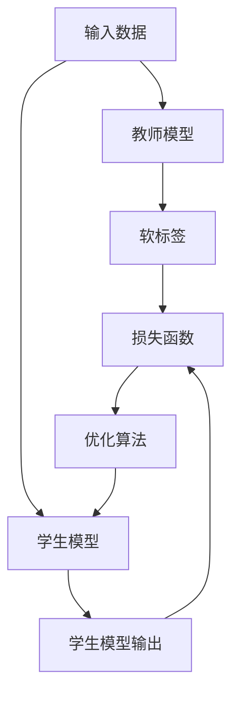

# AI Agent的知识蒸馏：从集成模型到单一模型

> 关键词：AI Agent、知识蒸馏、集成模型、单一模型、模型压缩

> 摘要：本文围绕AI Agent的知识蒸馏展开，详细探讨了如何从集成模型向单一模型进行知识迁移。首先介绍了知识蒸馏的背景和相关概念，接着深入讲解了核心算法原理与具体操作步骤，通过数学模型和公式进一步剖析其本质。然后通过项目实战展示了代码实现与详细解读，阐述了其在实际应用场景中的作用。最后推荐了相关工具和资源，总结了未来发展趋势与挑战，并提供了常见问题解答和参考资料，旨在为读者全面深入地理解AI Agent的知识蒸馏提供系统的知识体系。

## 1. 背景介绍 
### 1.1 目的和范围
在人工智能领域，集成模型通常能通过组合多个弱模型来获得更强大的性能和更高的准确性。然而，集成模型往往具有较高的计算复杂度和存储需求，这在一些资源受限的场景中（如移动设备、边缘计算等）难以应用。知识蒸馏的目的就是将集成模型所学到的知识迁移到一个单一模型中，在尽可能保留集成模型性能的同时，降低模型的复杂度和资源消耗。本文的范围涵盖了知识蒸馏的基本概念、核心算法、数学原理、实际应用以及相关工具资源等方面，旨在为读者提供全面的知识蒸馏技术的理解和应用指导。

### 1.2 预期读者
本文预期读者包括人工智能领域的研究人员、开发者、数据科学家以及对AI Agent和模型压缩技术感兴趣的技术爱好者。对于有一定机器学习基础的读者，能够通过本文深入理解知识蒸馏的原理和实现细节；对于初学者，也可以通过逐步阅读，了解知识蒸馏的基本概念和应用场景。

### 1.3 文档结构概述
本文首先介绍知识蒸馏的背景信息，包括目的、预期读者和文档结构等。接着阐述核心概念与联系，通过文本示意图和Mermaid流程图展示知识蒸馏的原理和架构。然后详细讲解核心算法原理和具体操作步骤，并结合Python源代码进行说明。随后介绍数学模型和公式，通过举例加深理解。再通过项目实战展示代码实际案例和详细解释。之后探讨实际应用场景，推荐相关工具和资源。最后总结未来发展趋势与挑战，提供常见问题解答和参考资料。

### 1.4 术语表
#### 1.4.1 核心术语定义
- **AI Agent**：人工智能代理，是一种能够感知环境、进行决策并采取行动以实现特定目标的智能实体。
- **知识蒸馏**：一种模型压缩技术，通过将一个大的、复杂的教师模型（如集成模型）的知识迁移到一个小的、简单的学生模型中，使学生模型能够学习到教师模型的泛化能力。
- **集成模型**：由多个弱模型组合而成的模型，通过综合多个模型的预测结果来提高整体性能。
- **单一模型**：相对集成模型而言，是一个独立的、单一的模型。
- **教师模型**：在知识蒸馏中，通常指集成模型或性能较好的模型，用于向学生模型传授知识。
- **学生模型**：在知识蒸馏中，指接收教师模型知识的模型，通常是一个较小、较简单的模型。

#### 1.4.2 相关概念解释
- **模型压缩**：旨在减少模型的参数数量、计算复杂度和存储需求，同时保持模型的性能。知识蒸馏是模型压缩的一种有效方法。
- **软标签**：在知识蒸馏中，教师模型输出的概率分布称为软标签，它包含了更多的类别之间的关系信息，比硬标签（直接的类别标签）更具指导意义。

#### 1.4.3 缩略词列表
- **ML**：Machine Learning，机器学习
- **DL**：Deep Learning，深度学习
- **CNN**：Convolutional Neural Network，卷积神经网络
- **RNN**：Recurrent Neural Network，循环神经网络

## 2. 核心概念与联系 
知识蒸馏的核心思想是让学生模型学习教师模型的输出分布，从而获得教师模型的知识。其基本原理是通过最小化学生模型的输出与教师模型的输出之间的差异，来训练学生模型。

### 文本示意图
知识蒸馏的过程可以用以下文本示意图表示：

教师模型（集成模型）接收输入数据，经过一系列的计算和处理，输出一个概率分布（软标签）。学生模型也接收相同的输入数据，其输出的概率分布与教师模型的软标签进行比较。通过一个损失函数来衡量两者之间的差异，然后使用优化算法更新学生模型的参数，使得学生模型的输出逐渐接近教师模型的输出。

### Mermaid流程图


在这个流程图中，输入数据同时传递给教师模型和学生模型。教师模型输出软标签，学生模型输出自己的预测结果。损失函数计算两者之间的差异，优化算法根据损失函数的结果更新学生模型的参数，从而不断优化学生模型。

## 3. 核心算法原理 & 具体操作步骤 
### 核心算法原理
知识蒸馏的核心算法基于损失函数的设计，通常使用的损失函数由两部分组成：一部分是学生模型输出与教师模型软标签之间的损失，另一部分是学生模型输出与真实标签之间的损失。常见的损失函数可以表示为：

$$L = \alpha \cdot L_{KD} + (1 - \alpha) \cdot L_{CE}$$

其中，$L$ 是总的损失函数，$\alpha$ 是一个超参数，用于控制两部分损失的权重。$L_{KD}$ 是知识蒸馏损失，通常使用KL散度（Kullback-Leibler divergence）来衡量学生模型输出与教师模型软标签之间的差异；$L_{CE}$ 是交叉熵损失，用于衡量学生模型输出与真实标签之间的差异。

### 具体操作步骤
1. **选择教师模型和学生模型**：教师模型通常选择集成模型或性能较好的模型，学生模型选择一个较小、较简单的模型。
2. **训练教师模型**：使用训练数据对教师模型进行训练，使其达到较好的性能。
3. **定义损失函数**：根据上述公式定义损失函数，设置超参数 $\alpha$。
4. **训练学生模型**：在训练学生模型时，同时使用教师模型的软标签和真实标签。对于每个训练样本，计算 $L_{KD}$ 和 $L_{CE}$，然后根据损失函数 $L$ 更新学生模型的参数。

### Python源代码实现
```python
import torch
import torch.nn as nn
import torch.optim as optim

# 定义教师模型
class TeacherModel(nn.Module):
    def __init__(self):
        super(TeacherModel, self).__init__()
        self.fc1 = nn.Linear(10, 20)
        self.fc2 = nn.Linear(20, 5)

    def forward(self, x):
        x = torch.relu(self.fc1(x))
        x = self.fc2(x)
        return x

# 定义学生模型
class StudentModel(nn.Module):
    def __init__(self):
        super(StudentModel, self).__init__()
        self.fc1 = nn.Linear(10, 10)
        self.fc2 = nn.Linear(10, 5)

    def forward(self, x):
        x = torch.relu(self.fc1(x))
        x = self.fc2(x)
        return x

# 训练教师模型
def train_teacher_model(teacher_model, train_loader, criterion, optimizer, epochs):
    teacher_model.train()
    for epoch in range(epochs):
        running_loss = 0.0
        for inputs, labels in train_loader:
            optimizer.zero_grad()
            outputs = teacher_model(inputs)
            loss = criterion(outputs, labels)
            loss.backward()
            optimizer.step()
            running_loss += loss.item()
        print(f'Epoch {epoch + 1}, Loss: {running_loss / len(train_loader)}')

# 知识蒸馏训练学生模型
def knowledge_distillation(teacher_model, student_model, train_loader, alpha, temperature, epochs):
    teacher_model.eval()
    student_model.train()
    criterion_kd = nn.KLDivLoss(reduction='batchmean')
    criterion_ce = nn.CrossEntropyLoss()
    optimizer = optim.Adam(student_model.parameters(), lr=0.001)

    for epoch in range(epochs):
        running_loss = 0.0
        for inputs, labels in train_loader:
            optimizer.zero_grad()

            # 教师模型输出
            with torch.no_grad():
                teacher_outputs = teacher_model(inputs)
                teacher_probs = torch.softmax(teacher_outputs / temperature, dim=1)

            # 学生模型输出
            student_outputs = student_model(inputs)
            student_probs = torch.softmax(student_outputs / temperature, dim=1)

            # 计算损失
            loss_kd = criterion_kd(student_probs.log(), teacher_probs) * (temperature ** 2)
            loss_ce = criterion_ce(student_outputs, labels)
            loss = alpha * loss_kd + (1 - alpha) * loss_ce

            loss.backward()
            optimizer.step()
            running_loss += loss.item()

        print(f'Epoch {epoch + 1}, Loss: {running_loss / len(train_loader)}')
```

在上述代码中，首先定义了教师模型和学生模型。然后实现了训练教师模型的函数 `train_teacher_model`，使用交叉熵损失函数进行训练。最后实现了知识蒸馏训练学生模型的函数 `knowledge_distillation`，在训练过程中同时使用了知识蒸馏损失和交叉熵损失。

## 4. 数学模型和公式 & 详细讲解 & 举例说明 
### 数学模型和公式
#### KL散度
KL散度是知识蒸馏中常用的衡量两个概率分布之间差异的指标。对于两个离散概率分布 $P$ 和 $Q$，KL散度的定义为：

$$D_{KL}(P || Q) = \sum_{i} P(i) \log \frac{P(i)}{Q(i)}$$

在知识蒸馏中，$P$ 通常是教师模型的软标签概率分布，$Q$ 是学生模型的输出概率分布。

#### 交叉熵损失
交叉熵损失用于衡量学生模型输出与真实标签之间的差异。对于一个样本，其真实标签为 $y$，学生模型的输出概率分布为 $p$，交叉熵损失的定义为：

$$L_{CE} = - \sum_{i} y_i \log p_i$$

#### 知识蒸馏损失函数
总的知识蒸馏损失函数为：

$$L = \alpha \cdot D_{KL}(P || Q) \cdot T^2 + (1 - \alpha) \cdot L_{CE}$$

其中，$T$ 是温度参数，用于控制软标签的平滑程度。

### 详细讲解
- **KL散度**：KL散度衡量的是从概率分布 $Q$ 到概率分布 $P$ 的信息损失。在知识蒸馏中，我们希望学生模型的输出概率分布 $Q$ 尽可能接近教师模型的软标签概率分布 $P$，因此通过最小化KL散度来实现知识的迁移。
- **交叉熵损失**：交叉熵损失是分类问题中常用的损失函数，用于衡量模型的预测结果与真实标签之间的差异。在知识蒸馏中，加入交叉熵损失可以确保学生模型仍然能够学习到真实标签的信息。
- **温度参数**：温度参数 $T$ 用于控制软标签的平滑程度。当 $T$ 较大时，软标签的分布更加平滑，不同类别之间的差异变小，学生模型可以学习到更多的类别之间的关系信息；当 $T$ 较小时，软标签的分布更加集中，更接近硬标签。

### 举例说明
假设我们有一个三分类问题，教师模型的输出为 $[2, 1, 0]$，真实标签为 $[1, 0, 0]$。学生模型的输出为 $[1.5, 0.5, 0]$。温度参数 $T = 2$，$\alpha = 0.5$。

1. **计算教师模型的软标签概率分布**：
$$P = \text{softmax}(\frac{[2, 1, 0]}{2}) = [0.665, 0.244, 0.091]$$

2. **计算学生模型的输出概率分布**：
$$Q = \text{softmax}(\frac{[1.5, 0.5, 0]}{2}) = [0.617, 0.274, 0.109]$$

3. **计算KL散度**：
$$D_{KL}(P || Q) = 0.665 \log \frac{0.665}{0.617} + 0.244 \log \frac{0.244}{0.274} + 0.091 \log \frac{0.091}{0.109} \approx 0.023$$

4. **计算交叉熵损失**：
$$L_{CE} = - (1 \log 0.617 + 0 \log 0.274 + 0 \log 0.109) \approx 0.483$$

5. **计算总的知识蒸馏损失**：
$$L = 0.5 \cdot 0.023 \cdot 2^2 + (1 - 0.5) \cdot 0.483 \approx 0.283$$

通过这个例子可以看出，知识蒸馏损失函数综合考虑了学生模型与教师模型软标签之间的差异以及学生模型与真实标签之间的差异。

## 5. 项目实战：代码实际案例和详细解释说明 
### 5.1  开发环境搭建
为了实现知识蒸馏的项目实战，我们需要搭建以下开发环境：
- **操作系统**：Windows、Linux或macOS
- **Python版本**：3.6及以上
- **深度学习框架**：PyTorch
- **其他库**：NumPy、Matplotlib等

可以使用以下命令安装所需的库：
```bash
pip install torch numpy matplotlib
```

### 5.2  源代码详细实现和代码解读
以下是一个完整的知识蒸馏项目实战代码：

```python
import torch
import torch.nn as nn
import torch.optim as optim
from torch.utils.data import DataLoader, TensorDataset
import numpy as np
import matplotlib.pyplot as plt

# 生成一些示例数据
np.random.seed(42)
X = np.random.randn(1000, 10).astype(np.float32)
y = np.random.randint(0, 5, 1000).astype(np.long)

# 转换为PyTorch张量
X_tensor = torch.from_numpy(X)
y_tensor = torch.from_numpy(y)

# 创建数据集和数据加载器
dataset = TensorDataset(X_tensor, y_tensor)
train_loader = DataLoader(dataset, batch_size=32, shuffle=True)

# 定义教师模型
class TeacherModel(nn.Module):
    def __init__(self):
        super(TeacherModel, self).__init__()
        self.fc1 = nn.Linear(10, 20)
        self.fc2 = nn.Linear(20, 5)

    def forward(self, x):
        x = torch.relu(self.fc1(x))
        x = self.fc2(x)
        return x

# 定义学生模型
class StudentModel(nn.Module):
    def __init__(self):
        super(StudentModel, self).__init__()
        self.fc1 = nn.Linear(10, 10)
        self.fc2 = nn.Linear(10, 5)

    def forward(self, x):
        x = torch.relu(self.fc1(x))
        x = self.fc2(x)
        return x

# 训练教师模型
def train_teacher_model(teacher_model, train_loader, criterion, optimizer, epochs):
    teacher_model.train()
    losses = []
    for epoch in range(epochs):
        running_loss = 0.0
        for inputs, labels in train_loader:
            optimizer.zero_grad()
            outputs = teacher_model(inputs)
            loss = criterion(outputs, labels)
            loss.backward()
            optimizer.step()
            running_loss += loss.item()
        epoch_loss = running_loss / len(train_loader)
        losses.append(epoch_loss)
        print(f'Epoch {epoch + 1}, Loss: {epoch_loss}')
    return losses

# 知识蒸馏训练学生模型
def knowledge_distillation(teacher_model, student_model, train_loader, alpha, temperature, epochs):
    teacher_model.eval()
    student_model.train()
    criterion_kd = nn.KLDivLoss(reduction='batchmean')
    criterion_ce = nn.CrossEntropyLoss()
    optimizer = optim.Adam(student_model.parameters(), lr=0.001)
    losses = []
    for epoch in range(epochs):
        running_loss = 0.0
        for inputs, labels in train_loader:
            optimizer.zero_grad()

            # 教师模型输出
            with torch.no_grad():
                teacher_outputs = teacher_model(inputs)
                teacher_probs = torch.softmax(teacher_outputs / temperature, dim=1)

            # 学生模型输出
            student_outputs = student_model(inputs)
            student_probs = torch.softmax(student_outputs / temperature, dim=1)

            # 计算损失
            loss_kd = criterion_kd(student_probs.log(), teacher_probs) * (temperature ** 2)
            loss_ce = criterion_ce(student_outputs, labels)
            loss = alpha * loss_kd + (1 - alpha) * loss_ce

            loss.backward()
            optimizer.step()
            running_loss += loss.item()
        epoch_loss = running_loss / len(train_loader)
        losses.append(epoch_loss)
        print(f'Epoch {epoch + 1}, Loss: {epoch_loss}')
    return losses

# 初始化模型
teacher_model = TeacherModel()
student_model = StudentModel()

# 训练教师模型
criterion = nn.CrossEntropyLoss()
optimizer = optim.Adam(teacher_model.parameters(), lr=0.001)
teacher_losses = train_teacher_model(teacher_model, train_loader, criterion, optimizer, epochs=10)

# 知识蒸馏训练学生模型
alpha = 0.5
temperature = 2
student_losses = knowledge_distillation(teacher_model, student_model, train_loader, alpha, temperature, epochs=10)

# 绘制损失曲线
plt.plot(teacher_losses, label='Teacher Loss')
plt.plot(student_losses, label='Student Loss')
plt.xlabel('Epoch')
plt.ylabel('Loss')
plt.title('Training Loss')
plt.legend()
plt.show()
```

### 代码解读与分析
1. **数据生成**：使用 `numpy` 生成一些示例数据，并将其转换为PyTorch张量。然后创建数据集和数据加载器，用于批量训练。
2. **模型定义**：定义了教师模型和学生模型，教师模型相对较复杂，学生模型相对较简单。
3. **训练教师模型**：使用交叉熵损失函数和Adam优化器训练教师模型，记录每个epoch的损失值。
4. **知识蒸馏训练学生模型**：在训练学生模型时，同时使用教师模型的软标签和真实标签。根据知识蒸馏损失函数计算损失，并更新学生模型的参数。记录每个epoch的损失值。
5. **绘制损失曲线**：使用 `matplotlib` 绘制教师模型和学生模型的训练损失曲线，直观地观察训练过程。

通过这个项目实战，我们可以看到知识蒸馏的具体实现过程，以及学生模型如何通过学习教师模型的知识来提高性能。

## 6. 实际应用场景 
### 移动设备和边缘计算
在移动设备和边缘计算场景中，资源（如计算能力、内存、电池续航等）通常是有限的。集成模型由于其较高的复杂度和资源需求，难以在这些设备上运行。通过知识蒸馏将集成模型的知识迁移到单一模型中，可以大大降低模型的复杂度和资源消耗，使得模型能够在移动设备和边缘设备上高效运行。例如，在智能手机上实现图像识别、语音识别等功能，使用经过知识蒸馏的单一模型可以在保证一定性能的前提下，减少设备的计算负担和电池消耗。

### 实时预测系统
在实时预测系统中，如金融交易系统、自动驾驶系统等，需要模型能够快速做出预测。集成模型的计算时间通常较长，无法满足实时性要求。知识蒸馏后的单一模型具有更低的计算复杂度和更快的推理速度，能够在短时间内给出预测结果，满足实时预测系统的需求。

### 模型部署和分发
在模型部署和分发过程中，集成模型的体积较大，传输和存储成本较高。单一模型体积小，便于传输和存储。通过知识蒸馏将集成模型的知识迁移到单一模型中，可以更方便地进行模型的部署和分发。例如，在云服务提供商向用户提供模型服务时，使用经过知识蒸馏的单一模型可以减少网络传输时间和存储成本。

### 隐私保护
在一些对隐私要求较高的场景中，集成模型可能会包含大量的敏感信息。知识蒸馏可以将集成模型的知识提取出来，存储在一个单一模型中，从而减少敏感信息的暴露。例如，在医疗数据处理中，使用知识蒸馏后的单一模型可以在保护患者隐私的前提下，实现疾病诊断等功能。

## 7. 工具和资源推荐
### 7.1 学习资源推荐
#### 7.1.1 书籍推荐
- 《深度学习》（Deep Learning）：由Ian Goodfellow、Yoshua Bengio和Aaron Courville合著，是深度学习领域的经典教材，涵盖了深度学习的基本原理、算法和应用，对知识蒸馏等模型压缩技术也有一定的介绍。
- 《Python深度学习》（Deep Learning with Python）：由Francois Chollet所著，通过Python代码和实例详细介绍了深度学习的实践方法，适合初学者学习。
- 《动手学深度学习》（Dive into Deep Learning）：由李沐等人编写，提供了丰富的代码示例和详细的讲解，帮助读者深入理解深度学习的原理和实现。

#### 7.1.2 在线课程
- Coursera上的“深度学习专项课程”（Deep Learning Specialization）：由Andrew Ng教授授课，包括深度学习的基础、卷积神经网络、循环神经网络等多个主题，对知识蒸馏等模型压缩技术也有涉及。
- edX上的“人工智能基础”（Introduction to Artificial Intelligence）：介绍了人工智能的基本概念、算法和应用，帮助学习者建立人工智能的知识体系。
- 哔哩哔哩（Bilibili）上有许多关于深度学习和知识蒸馏的教学视频，由不同的博主分享，内容丰富多样，可以根据自己的需求选择学习。

#### 7.1.3 技术博客和网站
- Medium：有许多人工智能领域的专家和开发者在Medium上分享他们的研究成果和实践经验，搜索“Knowledge Distillation”可以找到相关的技术博客文章。
- arXiv：是一个开放的预印本数据库，包含了大量的学术论文，搜索“Knowledge Distillation”可以获取最新的研究成果。
- 机器之心、新智元等人工智能领域的资讯网站，会发布一些关于知识蒸馏的最新动态和技术解读。

### 7.2 开发工具框架推荐
#### 7.2.1 IDE和编辑器
- PyCharm：是一款专业的Python集成开发环境，提供了丰富的代码编辑、调试、版本控制等功能，适合开发深度学习项目。
- Jupyter Notebook：是一个交互式的开发环境，可以方便地进行代码编写、运行和可视化展示，非常适合进行数据探索和模型实验。
- Visual Studio Code：是一款轻量级的代码编辑器，支持多种编程语言和插件扩展，通过安装相关的Python插件，可以方便地进行深度学习项目的开发。

#### 7.2.2 调试和性能分析工具
- PyTorch Profiler：是PyTorch提供的性能分析工具，可以帮助开发者分析模型的计算性能、内存使用情况等，找出性能瓶颈。
- TensorBoard：是TensorFlow提供的可视化工具，也可以与PyTorch结合使用，用于可视化模型的训练过程、损失曲线、准确率等指标。
- NVIDIA Nsight Systems：是NVIDIA提供的性能分析工具，专门用于分析GPU加速的深度学习模型的性能，可以帮助开发者优化模型的GPU使用效率。

#### 7.2.3 相关框架和库
- PyTorch：是一个开源的深度学习框架，提供了丰富的神经网络模块和优化算法，方便开发者实现知识蒸馏等模型压缩技术。
- TensorFlow：是另一个广泛使用的深度学习框架，具有强大的分布式训练和模型部署能力，也支持知识蒸馏的实现。
- Scikit-learn：是一个常用的机器学习库，提供了许多经典的机器学习算法和工具，可用于数据预处理、模型评估等任务，辅助知识蒸馏项目的开发。

### 7.3 相关论文著作推荐
#### 7.3.1 经典论文
- “Distilling the Knowledge in a Neural Network”：由Geoffrey Hinton等人发表，是知识蒸馏领域的经典论文，首次提出了知识蒸馏的概念和方法。
- “FitNets: Hints for Thin Deep Nets”：提出了一种基于中间层特征的知识蒸馏方法，通过让学生模型学习教师模型中间层的特征来提高性能。

#### 7.3.2 最新研究成果
可以通过arXiv、ACM Digital Library、IEEE Xplore等学术数据库搜索关于知识蒸馏的最新研究论文，了解该领域的最新发展动态和技术创新。

#### 7.3.3 应用案例分析
一些顶级学术会议（如NeurIPS、ICML、CVPR等）的论文集中会有关于知识蒸馏在不同应用场景中的案例分析，可以从中学习到知识蒸馏的实际应用方法和效果评估。

## 8. 总结：未来发展趋势与挑战
### 未来发展趋势
- **多模态知识蒸馏**：随着人工智能的发展，多模态数据（如图像、文本、语音等）的处理越来越重要。未来的知识蒸馏技术可能会扩展到多模态领域，实现不同模态之间的知识迁移和融合，提高模型在多模态任务中的性能。
- **自适应知识蒸馏**：目前的知识蒸馏方法通常使用固定的超参数（如 $\alpha$、$T$ 等），未来的研究可能会探索自适应的知识蒸馏方法，根据不同的任务和数据自动调整超参数，提高知识蒸馏的效果。
- **强化学习与知识蒸馏的结合**：强化学习在许多领域取得了显著的成果，将知识蒸馏与强化学习相结合，可以加速强化学习的训练过程，提高智能体的学习效率和性能。
- **跨设备和跨平台的知识蒸馏**：随着物联网和边缘计算的发展，不同设备和平台之间的模型部署和协作越来越常见。未来的知识蒸馏技术可能会更加注重跨设备和跨平台的知识迁移，实现不同设备和平台之间的模型优化和协同工作。

### 挑战
- **知识表示和迁移的准确性**：如何准确地表示教师模型的知识，并将其有效地迁移到学生模型中，仍然是一个挑战。特别是在复杂的任务和大规模的数据集上，知识的表示和迁移可能会出现信息丢失或失真的问题。
- **计算资源和时间成本**：知识蒸馏过程中需要同时运行教师模型和学生模型，这会增加计算资源和时间成本。如何在保证知识蒸馏效果的前提下，降低计算资源和时间成本，是一个需要解决的问题。
- **超参数调优**：知识蒸馏中的超参数（如 $\alpha$、$T$ 等）对蒸馏效果有重要影响，但目前还没有一种通用的方法来自动确定这些超参数的最优值。超参数调优需要大量的实验和经验，增加了知识蒸馏的实现难度。
- **模型的泛化能力**：虽然知识蒸馏可以提高学生模型的性能，但在某些情况下，学生模型可能会过度拟合教师模型的输出，导致泛化能力下降。如何在知识蒸馏过程中保证学生模型的泛化能力，是一个需要深入研究的问题。

## 9. 附录：常见问题与解答
### 1. 知识蒸馏一定会提高学生模型的性能吗？
不一定。知识蒸馏的效果受到多种因素的影响，如教师模型的性能、学生模型的结构、超参数的选择等。在某些情况下，知识蒸馏可能无法提高学生模型的性能，甚至可能导致性能下降。因此，在实际应用中需要进行充分的实验和调优。

### 2. 如何选择合适的温度参数 $T$？
温度参数 $T$ 用于控制软标签的平滑程度。一般来说，当 $T$ 较大时，软标签的分布更加平滑，学生模型可以学习到更多的类别之间的关系信息；当 $T$ 较小时，软标签的分布更加集中，更接近硬标签。选择合适的温度参数需要根据具体的任务和数据进行实验和调优。通常可以从一个较大的值开始，逐渐减小 $T$，观察学生模型的性能变化，选择性能最优的 $T$ 值。

### 3. 知识蒸馏中的超参数 $\alpha$ 有什么作用？
超参数 $\alpha$ 用于控制知识蒸馏损失和交叉熵损失的权重。当 $\alpha$ 较大时，学生模型更注重学习教师模型的软标签信息；当 $\alpha$ 较小时，学生模型更注重学习真实标签信息。选择合适的 $\alpha$ 值需要根据具体的任务和数据进行实验和调优，以平衡学生模型对教师模型知识和真实标签信息的学习。

### 4. 知识蒸馏可以应用于所有类型的模型吗？
知识蒸馏可以应用于多种类型的模型，如神经网络、决策树、支持向量机等。但不同类型的模型在知识蒸馏的实现方法和效果上可能会有所不同。一般来说，知识蒸馏更适用于神经网络模型，因为神经网络具有较强的表达能力和可训练性。

### 5. 知识蒸馏与模型量化、剪枝等模型压缩技术有什么关系？
知识蒸馏、模型量化和剪枝都是模型压缩的方法。知识蒸馏主要通过让学生模型学习教师模型的知识来实现模型压缩；模型量化是通过减少模型参数的表示精度来降低模型的存储需求和计算复杂度；模型剪枝是通过删除模型中不重要的参数来减少模型的规模。这些技术可以相互结合使用，以达到更好的模型压缩效果。

## 10. 扩展阅读 & 参考资料
- Hinton, G., Vinyals, O., & Dean, J. (2015). Distilling the Knowledge in a Neural Network. arXiv preprint arXiv:1503.02531.
- Romero, A., Ballas, N., Kahou, S. E., Chassang, A., Gatta, C., & Bengio, Y. (2014). FitNets: Hints for Thin Deep Nets. arXiv preprint arXiv:1412.6550.
- Goodfellow, I., Bengio, Y., & Courville, A. (2016). Deep Learning. MIT press.
- Chollet, F. (2017). Deep Learning with Python. Manning Publications.
- Li, M., Zhang, A., Li, Z., & Smola, A. J. (2020). Dive into Deep Learning. https://d2l.ai/.
- PyTorch官方文档：https://pytorch.org/docs/stable/index.html
- TensorFlow官方文档：https://www.tensorflow.org/api_docs
- Scikit-learn官方文档：https://scikit-learn.org/stable/documentation.html