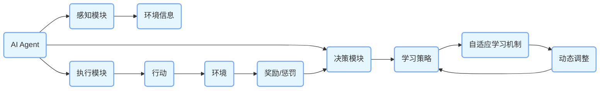

# AI Agent的自适应学习策略动态调整

> 关键词：AI Agent、自适应学习、动态调整、学习策略、强化学习

> 摘要：本文聚焦于AI Agent的自适应学习策略动态调整这一核心主题。首先介绍了该研究的背景、目的、预期读者和文档结构。详细阐述了AI Agent、自适应学习和动态调整等核心概念及其联系，给出了相应的原理和架构示意图。深入探讨了核心算法原理，用Python代码进行了详细阐述，同时介绍了相关的数学模型和公式并举例说明。通过项目实战展示了代码实际案例，包括开发环境搭建、源代码实现和解读。列举了AI Agent自适应学习策略动态调整的实际应用场景，推荐了学习资源、开发工具框架和相关论文著作。最后总结了未来发展趋势与挑战，解答了常见问题，并提供了扩展阅读和参考资料，旨在为读者全面深入地理解和应用这一技术提供指导。

## 1. 背景介绍 
### 1.1 目的和范围
随着人工智能技术的飞速发展，AI Agent在各个领域的应用越来越广泛，如游戏、机器人控制、智能交通等。然而，在复杂多变的环境中，固定的学习策略往往无法使AI Agent达到最优性能。因此，研究AI Agent的自适应学习策略动态调整具有重要的现实意义。本文的目的在于深入探讨如何使AI Agent能够根据环境的变化自动调整学习策略，以提高其学习效率和适应性。范围涵盖了核心概念的解释、算法原理的分析、实际应用场景的探讨以及相关工具和资源的推荐。

### 1.2 预期读者
本文预期读者包括人工智能领域的研究人员、开发者、学生以及对AI Agent技术感兴趣的专业人士。对于正在从事AI Agent相关项目开发的人员，本文可以提供技术上的指导和优化思路；对于学生和初学者，能够帮助他们建立起对AI Agent自适应学习策略动态调整的系统认知。

### 1.3 文档结构概述
本文将按照以下结构进行组织：首先介绍背景信息，包括目的、预期读者和文档结构；接着阐述核心概念及其联系，通过示意图和流程图进行直观展示；然后深入分析核心算法原理，并给出Python代码示例；之后介绍相关的数学模型和公式，并举例说明；通过项目实战展示代码的实际应用；列举实际应用场景；推荐学习资源、开发工具框架和相关论文著作；最后总结未来发展趋势与挑战，解答常见问题，并提供扩展阅读和参考资料。

### 1.4 术语表
#### 1.4.1 核心术语定义
- **AI Agent**：人工智能代理，是一种能够感知环境、做出决策并采取行动以实现特定目标的实体。它可以是软件程序，也可以是物理机器人。
- **自适应学习**：指系统能够根据环境的变化自动调整学习方式和策略，以提高学习效果和性能。
- **动态调整**：在系统运行过程中，根据实时的环境信息和反馈，对学习策略进行实时的修改和优化。

#### 1.4.2 相关概念解释
- **强化学习**：一种机器学习方法，AI Agent通过与环境进行交互，根据环境给予的奖励或惩罚来学习最优的行为策略。
- **策略梯度算法**：强化学习中的一类算法，通过直接优化策略函数来最大化累积奖励。

#### 1.4.3 缩略词列表
- **RL**：Reinforcement Learning，强化学习
- **PG**：Policy Gradient，策略梯度

## 2. 核心概念与联系 
### 核心概念原理
#### AI Agent
AI Agent可以看作是一个智能体，它由感知模块、决策模块和执行模块组成。感知模块负责收集环境信息，决策模块根据感知到的信息选择合适的行动，执行模块将决策转化为实际的行动。例如，在一个机器人导航任务中，机器人通过摄像头和传感器感知周围的环境，然后根据内置的算法选择前进、后退或转弯等行动。

#### 自适应学习
自适应学习的核心思想是根据环境的变化和学习的进展自动调整学习参数和策略。在AI Agent中，自适应学习可以表现为根据不同的环境状态选择不同的学习算法，或者动态调整学习率、折扣因子等参数。例如，在一个复杂的游戏环境中，当游戏难度增加时，AI Agent可以自动调整学习率以更快地适应新的挑战。

#### 动态调整
动态调整是自适应学习的具体实现方式。它通过实时监测环境信息和学习效果，根据预设的规则或算法对学习策略进行调整。例如，在强化学习中，当AI Agent连续多次获得较低的奖励时，动态调整机制可以自动调整策略，尝试探索新的行动方式。

### 架构示意图

该示意图展示了AI Agent的基本架构以及自适应学习和动态调整的过程。AI Agent通过感知模块获取环境信息，决策模块根据学习策略选择行动，执行模块将行动作用于环境。环境给予奖励或惩罚反馈给决策模块，同时自适应学习机制根据反馈进行动态调整，更新学习策略。

## 3. 核心算法原理 & 具体操作步骤 
### 强化学习基础
强化学习是实现AI Agent自适应学习的重要方法之一。在强化学习中，AI Agent与环境进行交互，通过不断尝试不同的行动来最大化累积奖励。基本的强化学习模型可以用马尔可夫决策过程（MDP）来描述，它由状态空间 $S$、行动空间 $A$、转移概率 $P(s'|s,a)$、奖励函数 $R(s,a)$ 和折扣因子 $\gamma$ 组成。

### 策略梯度算法原理
策略梯度算法是一类直接优化策略函数的强化学习算法。策略函数 $\pi_{\theta}(a|s)$ 表示在状态 $s$ 下选择行动 $a$ 的概率，其中 $\theta$ 是策略函数的参数。策略梯度算法的目标是通过更新参数 $\theta$ 来最大化累积奖励的期望。

策略梯度定理表明，策略梯度可以表示为：
$$\nabla_{\theta} J(\theta) = \mathbb{E}_{\tau \sim \pi_{\theta}} \left[ \sum_{t=0}^{T} \nabla_{\theta} \log \pi_{\theta}(a_t|s_t) Q^{\pi_{\theta}}(s_t,a_t) \right]$$
其中，$J(\theta)$ 是累积奖励的期望，$\tau$ 是一个轨迹，$T$ 是轨迹的长度，$Q^{\pi_{\theta}}(s_t,a_t)$ 是状态 - 行动值函数。

### Python代码实现
```python
import torch
import torch.nn as nn
import torch.optim as optim
import numpy as np

# 定义策略网络
class PolicyNetwork(nn.Module):
    def __init__(self, input_dim, output_dim):
        super(PolicyNetwork, self).__init__()
        self.fc1 = nn.Linear(input_dim, 64)
        self.fc2 = nn.Linear(64, output_dim)

    def forward(self, x):
        x = torch.relu(self.fc1(x))
        x = torch.softmax(self.fc2(x), dim=-1)
        return x

# 定义AI Agent
class AIAgent:
    def __init__(self, input_dim, output_dim, learning_rate=0.001):
        self.policy_network = PolicyNetwork(input_dim, output_dim)
        self.optimizer = optim.Adam(self.policy_network.parameters(), lr=learning_rate)

    def select_action(self, state):
        state = torch.FloatTensor(state).unsqueeze(0)
        probs = self.policy_network(state)
        action = torch.multinomial(probs, 1).item()
        return action

    def update_policy(self, states, actions, rewards):
        states = torch.FloatTensor(states)
        actions = torch.LongTensor(actions)
        rewards = torch.FloatTensor(rewards)

        probs = self.policy_network(states)
        log_probs = torch.log(probs.gather(1, actions.unsqueeze(1)))
        policy_loss = -(log_probs.squeeze() * rewards).sum()

        self.optimizer.zero_grad()
        policy_loss.backward()
        self.optimizer.step()
```
### 具体操作步骤
1. **初始化**：初始化策略网络和AI Agent，设置学习率等参数。
2. **与环境交互**：AI Agent在环境中进行交互，选择行动并获得奖励。
3. **存储经验**：将每次交互的状态、行动和奖励存储起来。
4. **更新策略**：根据存储的经验，计算策略梯度并更新策略网络的参数。
5. **重复步骤2 - 4**：不断重复上述过程，直到达到预定的训练次数或性能指标。

## 4. 数学模型和公式 & 详细讲解 & 举例说明 
### 马尔可夫决策过程（MDP）
马尔可夫决策过程是强化学习的基础数学模型，它可以用一个五元组 $(S, A, P, R, \gamma)$ 来表示：
- $S$：状态空间，表示环境的所有可能状态。
- $A$：行动空间，表示AI Agent可以采取的所有行动。
- $P(s'|s,a)$：转移概率，表示在状态 $s$ 下采取行动 $a$ 后转移到状态 $s'$ 的概率。
- $R(s,a)$：奖励函数，表示在状态 $s$ 下采取行动 $a$ 所获得的即时奖励。
- $\gamma$：折扣因子，取值范围为 $[0, 1]$，用于权衡即时奖励和未来奖励。

### 状态 - 价值函数和行动 - 价值函数
#### 状态 - 价值函数
状态 - 价值函数 $V^{\pi}(s)$ 表示在策略 $\pi$ 下，从状态 $s$ 开始的累积奖励的期望：
$$V^{\pi}(s) = \mathbb{E}_{\tau \sim \pi} \left[ \sum_{t=0}^{\infty} \gamma^t R(s_t,a_t) | s_0 = s \right]$$

#### 行动 - 价值函数
行动 - 价值函数 $Q^{\pi}(s,a)$ 表示在策略 $\pi$ 下，从状态 $s$ 采取行动 $a$ 后，继续遵循策略 $\pi$ 所获得的累积奖励的期望：
$$Q^{\pi}(s,a) = \mathbb{E}_{\tau \sim \pi} \left[ \sum_{t=0}^{\infty} \gamma^t R(s_t,a_t) | s_0 = s, a_0 = a \right]$$

### 贝尔曼方程
贝尔曼方程描述了状态 - 价值函数和行动 - 价值函数之间的递归关系。对于状态 - 价值函数，贝尔曼方程为：
$$V^{\pi}(s) = \sum_{a \in A} \pi(a|s) \sum_{s' \in S} P(s'|s,a) \left[ R(s,a) + \gamma V^{\pi}(s') \right]$$
对于行动 - 价值函数，贝尔曼方程为：
$$Q^{\pi}(s,a) = \sum_{s' \in S} P(s'|s,a) \left[ R(s,a) + \gamma \sum_{a' \in A} \pi(a'|s') Q^{\pi}(s',a') \right]$$

### 举例说明
考虑一个简单的网格世界环境，AI Agent需要从起点移动到终点。状态空间 $S$ 是网格中的所有位置，行动空间 $A$ 是上下左右四个方向。转移概率 $P(s'|s,a)$ 表示在当前位置 $s$ 采取行动 $a$ 后移动到位置 $s'$ 的概率。奖励函数 $R(s,a)$ 可以设置为：如果到达终点，获得正奖励；如果撞到墙壁或陷入陷阱，获得负奖励。

假设折扣因子 $\gamma = 0.9$，策略 $\pi$ 是随机选择行动。在某个状态 $s$ 下，AI Agent选择行动 $a$ 后转移到状态 $s'$，获得即时奖励 $R(s,a) = 1$。根据贝尔曼方程，可以计算出状态 - 价值函数和行动 - 价值函数的值。

## 5. 项目实战：代码实际案例和详细解释说明 
### 5.1  开发环境搭建
#### 安装Python
首先需要安装Python，建议使用Python 3.7及以上版本。可以从Python官方网站（https://www.python.org/downloads/）下载安装包进行安装。

#### 安装必要的库
使用以下命令安装必要的库：
```sh
pip install torch numpy gym
```
其中，`torch` 是深度学习框架，`numpy` 是数值计算库，`gym` 是OpenAI提供的强化学习环境库。

### 5.2  源代码详细实现和代码解读
```python
import torch
import torch.nn as nn
import torch.optim as optim
import numpy as np
import gym

# 定义策略网络
class PolicyNetwork(nn.Module):
    def __init__(self, input_dim, output_dim):
        super(PolicyNetwork, self).__init__()
        self.fc1 = nn.Linear(input_dim, 64)
        self.fc2 = nn.Linear(64, output_dim)

    def forward(self, x):
        x = torch.relu(self.fc1(x))
        x = torch.softmax(self.fc2(x), dim=-1)
        return x

# 定义AI Agent
class AIAgent:
    def __init__(self, input_dim, output_dim, learning_rate=0.001):
        self.policy_network = PolicyNetwork(input_dim, output_dim)
        self.optimizer = optim.Adam(self.policy_network.parameters(), lr=learning_rate)

    def select_action(self, state):
        state = torch.FloatTensor(state).unsqueeze(0)
        probs = self.policy_network(state)
        action = torch.multinomial(probs, 1).item()
        return action

    def update_policy(self, states, actions, rewards):
        states = torch.FloatTensor(states)
        actions = torch.LongTensor(actions)
        rewards = torch.FloatTensor(rewards)

        probs = self.policy_network(states)
        log_probs = torch.log(probs.gather(1, actions.unsqueeze(1)))
        policy_loss = -(log_probs.squeeze() * rewards).sum()

        self.optimizer.zero_grad()
        policy_loss.backward()
        self.optimizer.step()

# 主训练函数
def train():
    env = gym.make('CartPole-v1')
    input_dim = env.observation_space.shape[0]
    output_dim = env.action_space.n
    agent = AIAgent(input_dim, output_dim)

    num_episodes = 1000
    for episode in range(num_episodes):
        states, actions, rewards = [], [], []
        state = env.reset()
        done = False
        while not done:
            action = agent.select_action(state)
            next_state, reward, done, _ = env.step(action)
            states.append(state)
            actions.append(action)
            rewards.append(reward)
            state = next_state

        discounted_rewards = []
        cumulative_reward = 0
        for r in reversed(rewards):
            cumulative_reward = r + 0.9 * cumulative_reward
            discounted_rewards.insert(0, cumulative_reward)

        discounted_rewards = np.array(discounted_rewards)
        discounted_rewards = (discounted_rewards - np.mean(discounted_rewards)) / (np.std(discounted_rewards) + 1e-9)

        agent.update_policy(states, actions, discounted_rewards)

        if episode % 10 == 0:
            print(f"Episode {episode}: Total reward = {sum(rewards)}")

    env.close()

if __name__ == "__main__":
    train()
```
### 5.3  代码解读与分析
#### 策略网络
`PolicyNetwork` 类定义了一个简单的两层神经网络，用于表示策略函数。输入层接收环境状态，输出层输出每个行动的概率。

#### AI Agent
`AIAgent` 类封装了AI Agent的核心功能，包括选择行动和更新策略。`select_action` 方法根据当前状态选择一个行动，`update_policy` 方法根据存储的经验更新策略网络的参数。

#### 主训练函数
`train` 函数是主训练逻辑，它使用OpenAI Gym提供的 `CartPole-v1` 环境进行训练。在每个回合中，AI Agent与环境进行交互，存储状态、行动和奖励。然后计算折扣奖励，并对其进行标准化处理。最后调用 `update_policy` 方法更新策略网络的参数。

## 6. 实际应用场景 
### 游戏领域
在游戏中，AI Agent可以使用自适应学习策略动态调整来应对不同的对手和游戏场景。例如，在实时策略游戏中，AI Agent可以根据对手的策略和游戏局势动态调整自己的发展策略和战术；在角色扮演游戏中，AI Agent可以根据玩家的行为和游戏难度动态调整自己的能力和行为模式。

### 机器人控制
在机器人控制领域，AI Agent需要根据不同的环境和任务要求自适应地调整学习策略。例如，在机器人导航任务中，当遇到障碍物或环境变化时，AI Agent可以动态调整路径规划策略；在机器人抓取任务中，AI Agent可以根据物体的形状、位置和材质等信息动态调整抓取策略。

### 智能交通
在智能交通系统中，AI Agent可以用于交通流量控制、自动驾驶等方面。例如，在交通流量控制中，AI Agent可以根据实时的交通流量信息动态调整信号灯的时间分配；在自动驾驶中，AI Agent可以根据道路状况、交通规则和其他车辆的行为动态调整行驶策略。

### 金融领域
在金融领域，AI Agent可以用于投资决策、风险管理等方面。例如，在投资决策中，AI Agent可以根据市场行情、宏观经济数据和公司财务信息等动态调整投资组合；在风险管理中，AI Agent可以根据风险指标和市场波动动态调整风险控制策略。

## 7. 工具和资源推荐
### 7.1 学习资源推荐
#### 7.1.1 书籍推荐
- 《Reinforcement Learning: An Introduction》：这是强化学习领域的经典教材，详细介绍了强化学习的基本概念、算法和应用。
- 《Deep Reinforcement Learning Hands-On》：本书通过实践案例介绍了深度强化学习的应用，适合有一定编程基础的读者。

#### 7.1.2 在线课程
- Coursera上的“Reinforcement Learning Specialization”：由DeepMind的研究人员授课，系统地介绍了强化学习的理论和实践。
- Udemy上的“Deep Reinforcement Learning Bootcamp”：通过大量的代码示例和项目实战，帮助读者快速掌握深度强化学习的应用。

#### 7.1.3 技术博客和网站
- OpenAI Blog：OpenAI发布的最新研究成果和技术文章，涵盖了人工智能的各个领域。
- DeepMind Blog：DeepMind的官方博客，分享了他们在强化学习、深度学习等领域的研究进展。

### 7.2 开发工具框架推荐
#### 7.2.1 IDE和编辑器
- PyCharm：一款专业的Python集成开发环境，提供了丰富的代码编辑、调试和分析功能。
- Jupyter Notebook：一种交互式的编程环境，适合进行数据探索和模型开发。

#### 7.2.2 调试和性能分析工具
- TensorBoard：TensorFlow提供的可视化工具，可以用于监控模型的训练过程和性能指标。
- PyTorch Profiler：PyTorch提供的性能分析工具，可以帮助开发者找出代码中的性能瓶颈。

#### 7.2.3 相关框架和库
- TensorFlow：一个开源的深度学习框架，提供了丰富的工具和库，支持强化学习算法的实现。
- PyTorch：另一个流行的深度学习框架，具有简洁的API和高效的性能，广泛应用于强化学习研究和开发。
- Stable Baselines3：一个基于OpenAI Gym的强化学习库，提供了多种预训练的强化学习算法和工具。

### 7.3 相关论文著作推荐
#### 7.3.1 经典论文
- “Policy Gradient Methods for Reinforcement Learning with Function Approximation”：该论文提出了策略梯度算法的基本思想，是强化学习领域的经典之作。
- “Asynchronous Methods for Deep Reinforcement Learning”：提出了异步优势演员 - 评论家（A3C）算法，提高了强化学习的训练效率。

#### 7.3.2 最新研究成果
- 关注NeurIPS、ICML、AAAI等顶级人工智能会议的最新论文，了解AI Agent自适应学习策略动态调整的最新研究进展。

#### 7.3.3 应用案例分析
- 一些知名科技公司的技术博客和研究报告，如Google、Facebook、DeepMind等，会分享他们在AI Agent应用方面的实践经验和案例分析。

## 8. 总结：未来发展趋势与挑战
### 未来发展趋势
- **多智能体协同学习**：随着应用场景的复杂化，多个AI Agent之间的协同学习将成为未来的发展趋势。例如，在智能交通系统中，多个自动驾驶车辆需要协同工作以实现高效的交通流量控制。
- **结合其他技术**：AI Agent的自适应学习策略动态调整将与其他技术如计算机视觉、自然语言处理等相结合，实现更加复杂和智能的应用。例如，在智能家居系统中，AI Agent可以结合计算机视觉技术识别用户的行为和需求，动态调整家居设备的运行状态。
- **迁移学习和元学习**：迁移学习和元学习可以帮助AI Agent更快地适应新的环境和任务。通过在不同的任务之间迁移知识和学习如何学习，AI Agent可以提高学习效率和泛化能力。

### 挑战
- **环境建模和不确定性处理**：在复杂多变的环境中，准确地建模环境和处理不确定性是一个挑战。例如，在机器人导航任务中，环境可能存在未知的障碍物和动态变化的因素，AI Agent需要能够实时应对这些不确定性。
- **计算资源和效率**：自适应学习策略动态调整通常需要大量的计算资源和时间。如何在有限的计算资源下提高学习效率和性能是一个亟待解决的问题。
- **伦理和安全问题**：随着AI Agent在各个领域的广泛应用，伦理和安全问题也日益凸显。例如，在自动驾驶中，AI Agent的决策可能会对人类的生命和财产安全产生影响，需要建立相应的伦理和安全规范。

## 9. 附录：常见问题与解答
### 问题1：AI Agent的自适应学习和传统的机器学习有什么区别？
解答：传统的机器学习通常使用固定的学习策略和参数进行训练，而AI Agent的自适应学习可以根据环境的变化和学习的进展自动调整学习策略和参数。自适应学习更加灵活和智能，能够在复杂多变的环境中取得更好的性能。

### 问题2：如何选择合适的学习率和折扣因子？
解答：学习率和折扣因子是强化学习中的重要参数，它们的选择会影响学习的效果和收敛速度。一般来说，学习率不宜过大，否则可能会导致学习不稳定；也不宜过小，否则学习速度会很慢。折扣因子的取值范围通常在 $[0, 1]$ 之间，接近1表示更看重未来的奖励，接近0表示更看重即时奖励。可以通过实验和调参的方法来选择合适的学习率和折扣因子。

### 问题3：策略梯度算法有哪些优缺点？
解答：策略梯度算法的优点是可以直接优化策略函数，适用于连续行动空间和随机策略的学习；缺点是训练过程可能不稳定，收敛速度较慢，需要大量的样本数据。

## 10. 扩展阅读 & 参考资料
### 扩展阅读
- 《Artificial Intelligence: A Modern Approach》：全面介绍了人工智能的各个领域，包括搜索算法、知识表示、机器学习等。
- 《Machine Learning》：经典的机器学习教材，详细介绍了机器学习的基本算法和理论。

### 参考资料
- Sutton, R. S., & Barto, A. G. (2018). Reinforcement Learning: An Introduction. MIT press.
- OpenAI Gym官方文档：https://gym.openai.com/docs/
- PyTorch官方文档：https://pytorch.org/docs/stable/index.html