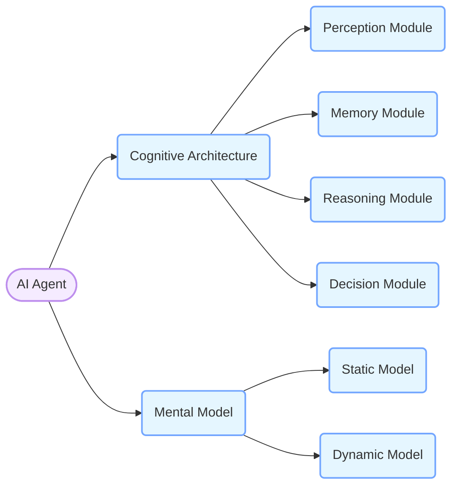

# AI Agent的认知架构与心智模型

> 关键词：AI Agent、认知架构、心智模型、人工智能、认知计算、智能决策、智能交互

> 摘要：本文围绕AI Agent的认知架构与心智模型展开深入探讨。首先介绍了研究的背景、目的、预期读者等内容。接着详细阐述了核心概念及其联系，通过文本示意图和Mermaid流程图进行直观展示。在核心算法原理部分，运用Python代码进行详细说明。同时给出了相关的数学模型和公式，并举例说明。通过项目实战，展示了代码的实际应用和详细解读。分析了AI Agent在不同场景下的实际应用，推荐了相关的学习资源、开发工具框架以及论文著作。最后总结了未来发展趋势与挑战，解答了常见问题，并提供了扩展阅读和参考资料，旨在为读者全面深入地理解AI Agent的认知架构与心智模型提供系统的知识体系。

## 1. 背景介绍 
### 1.1 目的和范围
本文章的目的在于深入剖析AI Agent的认知架构与心智模型，为读者全面揭示其工作原理、应用场景以及未来发展方向。范围涵盖了从基础概念的解释，到核心算法的原理阐述，再到实际项目的案例分析，以及相关工具和资源的推荐。旨在帮助读者从理论到实践，全面掌握AI Agent认知架构与心智模型的相关知识。

### 1.2 预期读者
本文预期读者包括人工智能领域的研究者、开发者、学生，以及对AI Agent感兴趣的技术爱好者。对于想要深入了解AI Agent底层原理、提升开发技能的专业人士，本文提供了详细的技术分析和实践指导；对于初学者，本文从基础概念入手，逐步引导读者理解复杂的认知架构和心智模型。

### 1.3 文档结构概述
本文共分为十个部分。第一部分为背景介绍，阐述了文章的目的、预期读者和文档结构。第二部分介绍核心概念与联系，通过文本示意图和Mermaid流程图直观展示相关概念。第三部分讲解核心算法原理，并使用Python代码详细阐述。第四部分给出数学模型和公式，并举例说明。第五部分进行项目实战，包括开发环境搭建、源代码实现和代码解读。第六部分分析实际应用场景。第七部分推荐学习资源、开发工具框架和相关论文著作。第八部分总结未来发展趋势与挑战。第九部分为附录，解答常见问题。第十部分提供扩展阅读和参考资料。

### 1.4 术语表
#### 1.4.1 核心术语定义
- **AI Agent**：即人工智能代理，是一种能够感知环境、进行决策并采取行动以实现特定目标的软件实体。
- **认知架构**：是AI Agent用于处理信息、进行推理和决策的整体结构和机制。
- **心智模型**：描述了AI Agent如何理解和表示世界，以及如何基于这些理解进行思考和行动。

#### 1.4.2 相关概念解释
- **感知**：AI Agent通过传感器获取环境信息的过程。
- **决策**：AI Agent根据感知到的信息和自身的目标，选择合适行动的过程。
- **行动**：AI Agent为了实现目标而在环境中执行的操作。

#### 1.4.3 缩略词列表
- **AI**：Artificial Intelligence，人工智能
- **ML**：Machine Learning，机器学习
- **RL**：Reinforcement Learning，强化学习

## 2. 核心概念与联系 

### 核心概念原理
AI Agent的认知架构与心智模型是构建智能系统的关键要素。认知架构为AI Agent提供了一个组织和处理信息的框架，它决定了Agent如何感知环境、存储知识、进行推理和决策。心智模型则是Agent对世界的内部表示，它包含了Agent对环境、自身和其他实体的认识，以及如何根据这些认识来预测和解释事件。

认知架构通常包括感知模块、记忆模块、推理模块和决策模块。感知模块负责收集环境信息，记忆模块用于存储和管理知识，推理模块根据记忆中的知识进行逻辑推理，决策模块根据推理结果选择合适的行动。

心智模型可以分为静态心智模型和动态心智模型。静态心智模型描述了Agent对世界的基本认识，如物体的属性、关系和规则。动态心智模型则关注Agent对世界变化的预测和应对，它能够根据感知到的信息更新对世界的认识，并调整自己的行为。

### 文本示意图
```plaintext
              +---------------------+
              |      AI Agent       |
              +---------------------+
              |  Cognitive Architecture |
              | +-----------------+ |
              | |  Perception Module | |
              | +-----------------+ |
              | |  Memory Module    | |
              | +-----------------+ |
              | |  Reasoning Module | |
              | +-----------------+ |
              | |  Decision Module  | |
              | +-----------------+ |
              |  Mental Model       |
              | +-----------------+ |
              | |  Static Model     | |
              | +-----------------+ |
              | |  Dynamic Model    | |
              | +-----------------+ |
              +---------------------+
```

### Mermaid流程图


## 3. 核心算法原理 & 具体操作步骤 

### 感知模块算法原理
感知模块的主要任务是从环境中获取信息，并将其转化为AI Agent能够理解的形式。常见的感知算法包括计算机视觉中的目标检测算法、自然语言处理中的文本分类算法等。

以下是一个简单的目标检测算法示例，使用Python和OpenCV库实现：

```python
import cv2

def detect_objects(image_path):
    # 加载预训练的目标检测模型
    net = cv2.dnn.readNetFromCaffe('deploy.prototxt.txt', 'res10_300x300_ssd_iter_140000.caffemodel')

    # 读取图像
    image = cv2.imread(image_path)
    (h, w) = image.shape[:2]
    blob = cv2.dnn.blobFromImage(cv2.resize(image, (300, 300)), 1.0,
                                 (300, 300), (104.0, 177.0, 123.0))

    # 将图像输入到模型中进行检测
    net.setInput(blob)
    detections = net.forward()

    # 遍历检测结果
    for i in range(0, detections.shape[2]):
        confidence = detections[0, 0, i, 2]
        if confidence > 0.5:
            box = detections[0, 0, i, 3:7] * np.array([w, h, w, h])
            (startX, startY, endX, endY) = box.astype("int")

            # 在图像上绘制检测框
            text = "{:.2f}%".format(confidence * 100)
            y = startY - 10 if startY - 10 > 10 else startY + 10
            cv2.rectangle(image, (startX, startY), (endX, endY),
                          (0, 0, 255), 2)
            cv2.putText(image, text, (startX, y),
                        cv2.FONT_HERSHEY_SIMPLEX, 0.45, (0, 0, 255), 2)

    # 显示检测结果
    cv2.imshow("Output", image)
    cv2.waitKey(0)

# 调用函数进行目标检测
detect_objects('test_image.jpg')
```

### 推理模块算法原理
推理模块根据记忆模块中的知识进行逻辑推理，以得出新的结论。常见的推理算法包括基于规则的推理、基于案例的推理和基于模型的推理等。

以下是一个简单的基于规则的推理示例，使用Python实现：

```python
# 定义规则库
rules = [
    {"condition": lambda x: x > 10, "conclusion": "x is greater than 10"},
    {"condition": lambda x: x < 10, "conclusion": "x is less than 10"},
    {"condition": lambda x: x == 10, "conclusion": "x is equal to 10"}
]

# 定义推理函数
def infer(x):
    for rule in rules:
        if rule["condition"](x):
            return rule["conclusion"]
    return "No matching rule found"

# 进行推理
result = infer(15)
print(result)
```

### 决策模块算法原理
决策模块根据推理模块的结果和Agent的目标，选择合适的行动。常见的决策算法包括强化学习算法、多属性决策算法等。

以下是一个简单的强化学习示例，使用Python和OpenAI Gym库实现：

```python
import gym

# 创建环境
env = gym.make('CartPole-v1')

# 初始化参数
total_episodes = 500
max_steps = 200
learning_rate = 0.1
gamma = 0.99

# 初始化Q表
q_table = {}
for state in range(env.observation_space.n):
    for action in range(env.action_space.n):
        q_table[(state, action)] = 0

# 训练过程
for episode in range(total_episodes):
    state = env.reset()
    for step in range(max_steps):
        # 选择动作
        if np.random.uniform(0, 1) < 0.1:
            action = env.action_space.sample()
        else:
            q_values = [q_table[(state, a)] for a in range(env.action_space.n)]
            action = np.argmax(q_values)

        # 执行动作
        next_state, reward, done, _ = env.step(action)

        # 更新Q表
        max_q_next = max([q_table[(next_state, a)] for a in range(env.action_space.n)])
        q_table[(state, action)] = (1 - learning_rate) * q_table[(state, action)] + \
                                   learning_rate * (reward + gamma * max_q_next)

        state = next_state

        if done:
            break

# 测试过程
state = env.reset()
for step in range(max_steps):
    q_values = [q_table[(state, a)] for a in range(env.action_space.n)]
    action = np.argmax(q_values)
    next_state, reward, done, _ = env.step(action)
    state = next_state
    env.render()
    if done:
        break

env.close()
```

## 4. 数学模型和公式 & 详细讲解 & 举例说明 

### 感知模块数学模型
在计算机视觉的目标检测中，常用的数学模型是卷积神经网络（CNN）。CNN通过卷积层、池化层和全连接层对图像进行特征提取和分类。

卷积操作的数学公式为：
$$
y_{i,j}^l = \sum_{m=0}^{M-1} \sum_{n=0}^{N-1} x_{i+m,j+n}^{l-1} \cdot w_{m,n}^l + b^l
$$
其中，$y_{i,j}^l$ 是第 $l$ 层卷积层在位置 $(i,j)$ 处的输出，$x_{i+m,j+n}^{l-1}$ 是第 $l-1$ 层的输入，$w_{m,n}^l$ 是卷积核的权重，$b^l$ 是偏置项。

例如，假设有一个 $3\times3$ 的卷积核，输入图像的大小为 $5\times5$，则卷积操作可以通过以下代码实现：

```python
import numpy as np

# 输入图像
x = np.array([[1, 2, 3, 4, 5],
              [6, 7, 8, 9, 10],
              [11, 12, 13, 14, 15],
              [16, 17, 18, 19, 20],
              [21, 22, 23, 24, 25]])

# 卷积核
w = np.array([[1, 0, -1],
              [1, 0, -1],
              [1, 0, -1]])

# 偏置项
b = 0

# 卷积操作
output = np.zeros((3, 3))
for i in range(3):
    for j in range(3):
        output[i, j] = np.sum(x[i:i+3, j:j+3] * w) + b

print(output)
```

### 推理模块数学模型
在基于规则的推理中，规则可以表示为逻辑表达式。例如，规则 “如果 $x > 10$，则 $y = 1$” 可以表示为：
$$
(x > 10) \rightarrow (y = 1)
$$

推理过程就是根据已知条件，判断规则的前提是否成立，如果成立，则得出规则的结论。

### 决策模块数学模型
在强化学习中，常用的数学模型是马尔可夫决策过程（MDP）。MDP可以用一个五元组 $(S, A, P, R, \gamma)$ 表示，其中：
- $S$ 是状态空间
- $A$ 是动作空间
- $P$ 是状态转移概率，$P(s'|s, a)$ 表示在状态 $s$ 执行动作 $a$ 后转移到状态 $s'$ 的概率
- $R$ 是奖励函数，$R(s, a, s')$ 表示在状态 $s$ 执行动作 $a$ 转移到状态 $s'$ 所获得的奖励
- $\gamma$ 是折扣因子，用于权衡即时奖励和未来奖励

Q学习算法是一种基于MDP的强化学习算法，其更新公式为：
$$
Q(s, a) = (1 - \alpha) Q(s, a) + \alpha [R(s, a, s') + \gamma \max_{a'} Q(s', a')]
$$
其中，$Q(s, a)$ 是状态 $s$ 下执行动作 $a$ 的Q值，$\alpha$ 是学习率。

例如，在前面的强化学习示例中，就是使用Q学习算法来更新Q表。

## 5. 项目实战：代码实际案例和详细解释说明 

### 5.1  开发环境搭建
本项目使用Python作为开发语言，需要安装以下库：
- OpenCV：用于计算机视觉任务，如目标检测
- NumPy：用于数值计算
- OpenAI Gym：用于强化学习环境

可以使用以下命令进行安装：
```sh
pip install opencv-python numpy gym
```

### 5.2  源代码详细实现和代码解读
#### 目标检测代码解读
```python
import cv2

def detect_objects(image_path):
    # 加载预训练的目标检测模型
    net = cv2.dnn.readNetFromCaffe('deploy.prototxt.txt', 'res10_300x300_ssd_iter_140000.caffemodel')

    # 读取图像
    image = cv2.imread(image_path)
    (h, w) = image.shape[:2]
    blob = cv2.dnn.blobFromImage(cv2.resize(image, (300, 300)), 1.0,
                                 (300, 300), (104.0, 177.0, 123.0))

    # 将图像输入到模型中进行检测
    net.setInput(blob)
    detections = net.forward()

    # 遍历检测结果
    for i in range(0, detections.shape[2]):
        confidence = detections[0, 0, i, 2]
        if confidence > 0.5:
            box = detections[0, 0, i, 3:7] * np.array([w, h, w, h])
            (startX, startY, endX, endY) = box.astype("int")

            # 在图像上绘制检测框
            text = "{:.2f}%".format(confidence * 100)
            y = startY - 10 if startY - 10 > 10 else startY + 10
            cv2.rectangle(image, (startX, startY), (endX, endY),
                          (0, 0, 255), 2)
            cv2.putText(image, text, (startX, y),
                        cv2.FONT_HERSHEY_SIMPLEX, 0.45, (0, 0, 255), 2)

    # 显示检测结果
    cv2.imshow("Output", image)
    cv2.waitKey(0)

# 调用函数进行目标检测
detect_objects('test_image.jpg')
```
代码解释：
1. **加载模型**：使用 `cv2.dnn.readNetFromCaffe` 函数加载预训练的目标检测模型。
2. **读取图像**：使用 `cv2.imread` 函数读取输入图像。
3. **图像预处理**：使用 `cv2.dnn.blobFromImage` 函数将图像进行预处理，将其转换为适合模型输入的格式。
4. **目标检测**：将预处理后的图像输入到模型中，使用 `net.forward` 函数进行目标检测。
5. **结果处理**：遍历检测结果，筛选出置信度大于0.5的检测框，并在图像上绘制检测框和置信度信息。
6. **显示结果**：使用 `cv2.imshow` 函数显示检测结果。

#### 基于规则的推理代码解读
```python
# 定义规则库
rules = [
    {"condition": lambda x: x > 10, "conclusion": "x is greater than 10"},
    {"condition": lambda x: x < 10, "conclusion": "x is less than 10"},
    {"condition": lambda x: x == 10, "conclusion": "x is equal to 10"}
]

# 定义推理函数
def infer(x):
    for rule in rules:
        if rule["condition"](x):
            return rule["conclusion"]
    return "No matching rule found"

# 进行推理
result = infer(15)
print(result)
```
代码解释：
1. **定义规则库**：使用列表存储规则，每个规则是一个字典，包含条件和结论。
2. **定义推理函数**：遍历规则库，检查输入是否满足规则的条件，如果满足则返回规则的结论，否则返回 “No matching rule found”。
3. **进行推理**：调用推理函数，输入一个值进行推理，并打印推理结果。

#### 强化学习代码解读
```python
import gym

# 创建环境
env = gym.make('CartPole-v1')

# 初始化参数
total_episodes = 500
max_steps = 200
learning_rate = 0.1
gamma = 0.99

# 初始化Q表
q_table = {}
for state in range(env.observation_space.n):
    for action in range(env.action_space.n):
        q_table[(state, action)] = 0

# 训练过程
for episode in range(total_episodes):
    state = env.reset()
    for step in range(max_steps):
        # 选择动作
        if np.random.uniform(0, 1) < 0.1:
            action = env.action_space.sample()
        else:
            q_values = [q_table[(state, a)] for a in range(env.action_space.n)]
            action = np.argmax(q_values)

        # 执行动作
        next_state, reward, done, _ = env.step(action)

        # 更新Q表
        max_q_next = max([q_table[(next_state, a)] for a in range(env.action_space.n)])
        q_table[(state, action)] = (1 - learning_rate) * q_table[(state, action)] + \
                                   learning_rate * (reward + gamma * max_q_next)

        state = next_state

        if done:
            break

# 测试过程
state = env.reset()
for step in range(max_steps):
    q_values = [q_table[(state, a)] for a in range(env.action_space.n)]
    action = np.argmax(q_values)
    next_state, reward, done, _ = env.step(action)
    state = next_state
    env.render()
    if done:
        break

env.close()
```
代码解释：
1. **创建环境**：使用 `gym.make` 函数创建一个强化学习环境。
2. **初始化参数**：设置训练的总回合数、每回合的最大步数、学习率和折扣因子。
3. **初始化Q表**：使用字典存储Q表，键为状态和动作的组合，值为Q值。
4. **训练过程**：在每个回合中，选择动作、执行动作、更新Q表，直到回合结束。
5. **测试过程**：使用训练好的Q表进行测试，选择最优动作并执行，观察环境的反馈。
6. **关闭环境**：使用 `env.close` 函数关闭环境。

### 5.3  代码解读与分析
通过以上代码案例，我们可以看到AI Agent的认知架构与心智模型在不同模块中的具体实现。感知模块通过目标检测算法获取环境信息，推理模块通过基于规则的推理得出结论，决策模块通过强化学习算法选择最优动作。

在实际应用中，这些模块相互协作，共同实现AI Agent的智能行为。例如，在一个智能机器人项目中，机器人通过感知模块获取周围环境的信息，如障碍物的位置、目标的位置等；推理模块根据这些信息进行分析和推理，判断如何避开障碍物并到达目标；决策模块根据推理结果选择合适的动作，如前进、后退、转弯等。

同时，我们也可以看到代码的可扩展性和灵活性。通过调整参数和更换算法，可以适应不同的应用场景和任务需求。例如，在目标检测中，可以使用不同的预训练模型；在强化学习中，可以使用不同的算法和参数设置。

## 6. 实际应用场景 
### 智能客服
AI Agent在智能客服领域有着广泛的应用。通过认知架构和心智模型，智能客服可以理解用户的问题，进行推理和决策，提供准确的回答和解决方案。例如，当用户咨询产品信息时，智能客服可以通过自然语言处理技术理解用户的问题，从知识库中查找相关信息，并进行推理和总结，最后以自然语言的形式回复用户。

### 自动驾驶
在自动驾驶领域，AI Agent需要实时感知周围环境，进行决策和控制。认知架构和心智模型可以帮助自动驾驶汽车理解道路状况、交通规则和其他车辆的行为，从而做出安全、高效的驾驶决策。例如，当遇到红灯时，自动驾驶汽车可以根据感知到的交通信号和自身的位置，判断是否需要停车，并控制车辆的速度和刹车。

### 智能家居
AI Agent可以应用于智能家居系统中，实现对家居设备的智能控制。通过感知用户的行为和环境信息，AI Agent可以自动调整家居设备的状态，提供舒适、便捷的居住环境。例如，当检测到用户离开家时，AI Agent可以自动关闭灯光、空调等设备；当用户回家时，自动打开灯光和调节室内温度。

### 金融投资
在金融投资领域，AI Agent可以通过分析市场数据、新闻资讯等信息，进行投资决策。认知架构和心智模型可以帮助AI Agent理解市场趋势、风险因素和投资机会，从而制定合理的投资策略。例如，AI Agent可以根据历史数据和实时市场信息，预测股票价格的走势，并建议用户进行买入或卖出操作。

## 7. 工具和资源推荐
### 7.1 学习资源推荐
#### 7.1.1 书籍推荐
- 《人工智能：一种现代的方法》：这是一本经典的人工智能教材，全面介绍了人工智能的各个领域，包括认知架构、机器学习、自然语言处理等。
- 《强化学习：原理与Python实现》：详细介绍了强化学习的基本原理和算法，并通过Python代码进行实现和讲解。
- 《深度学习》：由深度学习领域的三位权威专家撰写，系统地介绍了深度学习的理论和实践。

#### 7.1.2 在线课程
- Coursera上的“人工智能基础”课程：由知名教授授课，涵盖了人工智能的基本概念、算法和应用。
- edX上的“强化学习”课程：提供了强化学习的深入讲解和实践项目。
- 吴恩达的“深度学习专项课程”：在深度学习领域具有很高的知名度，课程内容丰富实用。

#### 7.1.3 技术博客和网站
- Medium：上面有很多人工智能领域的技术博客和文章，涵盖了最新的研究成果和实践经验。
- arXiv：是一个预印本服务器，提供了大量的人工智能领域的学术论文。
- AI Stack Exchange：是一个人工智能领域的问答社区，可以在这里提问和获取专业的解答。

### 7.2 开发工具框架推荐
#### 7.2.1 IDE和编辑器
- PyCharm：是一款专业的Python集成开发环境，提供了丰富的功能和插件，适合开发人工智能项目。
- Jupyter Notebook：是一个交互式的开发环境，适合进行数据探索、模型训练和可视化。
- Visual Studio Code：是一款轻量级的代码编辑器，支持多种编程语言和插件，非常适合快速开发和调试。

#### 7.2.2 调试和性能分析工具
- TensorBoard：是TensorFlow提供的可视化工具，可以用于监控模型的训练过程、查看模型的结构和性能指标。
- PyTorch Profiler：是PyTorch提供的性能分析工具，可以帮助开发者找出代码中的性能瓶颈。
- cProfile：是Python标准库中的性能分析工具，可以用于分析Python代码的执行时间和调用次数。

#### 7.2.3 相关框架和库
- TensorFlow：是一个开源的深度学习框架，提供了丰富的工具和接口，支持大规模分布式训练。
- PyTorch：是另一个流行的深度学习框架，具有简洁易用的API和动态图机制，适合快速开发和研究。
- Scikit-learn：是一个开源的机器学习库，提供了各种机器学习算法和工具，适合初学者和快速原型开发。

### 7.3 相关论文著作推荐
#### 7.3.1 经典论文
- “A Unified Architecture for Intelligence” by Marvin Minsky：提出了一种统一的智能架构，对AI Agent的认知架构研究具有重要影响。
- “Reinforcement Learning: A Survey” by Richard S. Sutton and Andrew G. Barto：是强化学习领域的经典综述论文，系统地介绍了强化学习的基本概念和算法。
- “ImageNet Classification with Deep Convolutional Neural Networks” by Alex Krizhevsky, Ilya Sutskever, and Geoffrey E. Hinton：开创了深度学习在计算机视觉领域的应用，提出了AlexNet模型。

#### 7.3.2 最新研究成果
- 关注顶级人工智能会议，如NeurIPS、ICML、CVPR等，这些会议上的论文代表了人工智能领域的最新研究成果。
- 关注知名学术期刊，如Journal of Artificial Intelligence Research (JAIR)、Artificial Intelligence等，这些期刊发表了许多高质量的人工智能研究论文。

#### 7.3.3 应用案例分析
- 一些科技公司的官方博客会分享他们在人工智能领域的应用案例和实践经验，如Google AI Blog、Microsoft AI Blog等。
- 一些行业报告和研究机构的报告也会提供人工智能在不同领域的应用案例和分析，如Gartner、IDC等。

## 8. 总结：未来发展趋势与挑战
### 未来发展趋势
- **多模态融合**：未来的AI Agent将更加注重多模态信息的融合，如视觉、听觉、触觉等，以实现更加全面和准确的环境感知。
- **认知能力提升**：AI Agent的认知能力将不断提升，能够进行更复杂的推理和决策，理解和处理更加抽象和模糊的信息。
- **人机协作**：AI Agent将与人类更加紧密地协作，成为人类的智能助手，共同完成各种任务。
- **自主学习和进化**：AI Agent将具备更强的自主学习和进化能力，能够在不断变化的环境中自我适应和优化。

### 挑战
- **数据隐私和安全**：随着AI Agent处理的数据量越来越大，数据隐私和安全问题将成为一个重要的挑战。如何保护用户的隐私和数据安全，防止数据泄露和滥用，是需要解决的关键问题。
- **可解释性和透明度**：AI Agent的决策过程往往是基于复杂的模型和算法，缺乏可解释性和透明度。如何让用户理解AI Agent的决策依据和过程，增强用户对AI Agent的信任，是一个亟待解决的问题。
- **伦理和道德问题**：AI Agent的应用可能会带来一些伦理和道德问题，如偏见、歧视、责任界定等。如何确保AI Agent的行为符合伦理和道德标准，是需要深入研究和探讨的问题。
- **计算资源和能源消耗**：AI Agent的训练和运行需要大量的计算资源和能源消耗，如何提高计算效率和降低能源消耗，是实现可持续发展的关键。

## 9. 附录：常见问题与解答
### 什么是AI Agent的认知架构和心智模型？
AI Agent的认知架构是指Agent用于处理信息、进行推理和决策的整体结构和机制。心智模型是指Agent对世界的内部表示，它包含了Agent对环境、自身和其他实体的认识，以及如何根据这些认识来预测和解释事件。

### 认知架构和心智模型有什么区别和联系？
区别：认知架构侧重于Agent的信息处理流程和机制，而心智模型侧重于Agent对世界的理解和表示。联系：认知架构为心智模型的构建和更新提供了支持，心智模型则为认知架构的决策和行动提供了依据。

### 如何实现一个简单的AI Agent？
可以从实现感知模块、推理模块和决策模块入手。感知模块可以使用计算机视觉或自然语言处理技术获取环境信息；推理模块可以使用基于规则的推理或机器学习算法进行推理；决策模块可以使用强化学习算法选择最优动作。

### AI Agent在实际应用中面临哪些挑战？
AI Agent在实际应用中面临数据隐私和安全、可解释性和透明度、伦理和道德问题、计算资源和能源消耗等挑战。

## 10. 扩展阅读 & 参考资料
### 扩展阅读
- 《心智社会》：由马文·明斯基所著，深入探讨了心智的本质和智能的构建。
- 《人工智能时代的人类未来》：探讨了人工智能对人类社会的影响和未来发展方向。
- 《智能时代》：介绍了智能技术在各个领域的应用和发展趋势。

### 参考资料
- 相关学术论文和研究报告，如NeurIPS、ICML、CVPR等会议的论文，以及JAIR、Artificial Intelligence等期刊的文章。
- 开源代码库，如GitHub上的人工智能项目，可用于学习和参考。
- 官方文档和教程，如TensorFlow、PyTorch等框架的官方文档和教程。