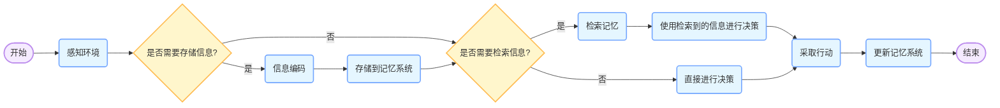

# AI Agent的记忆机制：设计与实现

> 关键词：AI Agent、记忆机制、设计实现、记忆存储、记忆检索

> 摘要：本文聚焦于AI Agent的记忆机制，深入探讨其设计与实现的相关内容。首先介绍了研究AI Agent记忆机制的背景、目的、预期读者和文档结构等信息。接着详细阐述了AI Agent记忆机制的核心概念与联系，包括其原理和架构，并通过文本示意图和Mermaid流程图进行直观展示。在核心算法原理部分，使用Python代码详细阐述了相关算法。同时，给出了数学模型和公式，并进行详细讲解和举例说明。通过项目实战，展示了代码实际案例并进行详细解释。分析了AI Agent记忆机制的实际应用场景，推荐了学习资源、开发工具框架以及相关论文著作。最后对AI Agent记忆机制的未来发展趋势与挑战进行总结，并给出常见问题与解答以及扩展阅读和参考资料，为读者全面了解和掌握AI Agent的记忆机制提供了系统的知识体系。

## 1. 背景介绍 
### 1.1 目的和范围
随着人工智能技术的不断发展，AI Agent在各个领域的应用越来越广泛。AI Agent的记忆机制对于其智能行为的实现起着至关重要的作用。本文章的目的在于深入探讨AI Agent记忆机制的设计与实现方法，为研究人员和开发者提供全面的理论指导和实践参考。范围涵盖了AI Agent记忆机制的核心概念、算法原理、数学模型、项目实战、实际应用场景等多个方面。

### 1.2 预期读者
本文的预期读者包括人工智能领域的研究人员、软件开发工程师、对AI Agent技术感兴趣的学生以及相关行业的从业者。这些读者可以从本文中获取关于AI Agent记忆机制的深入知识，为他们的研究、开发和学习提供帮助。

### 1.3 文档结构概述
本文将按照以下结构进行组织：首先介绍AI Agent记忆机制的核心概念与联系，包括其原理和架构；接着阐述核心算法原理和具体操作步骤，并使用Python代码进行详细说明；然后给出数学模型和公式，并进行详细讲解和举例；通过项目实战展示代码实际案例并进行详细解释；分析AI Agent记忆机制的实际应用场景；推荐学习资源、开发工具框架以及相关论文著作；最后对未来发展趋势与挑战进行总结，给出常见问题与解答以及扩展阅读和参考资料。

### 1.4 术语表
#### 1.4.1 核心术语定义
- **AI Agent**：人工智能代理，是一种能够感知环境、进行决策并采取行动以实现特定目标的智能实体。
- **记忆机制**：AI Agent用于存储、管理和检索信息的系统，使得AI Agent能够基于过去的经验和知识进行决策和行动。
- **记忆存储**：将信息保存到AI Agent的记忆系统中的过程。
- **记忆检索**：从AI Agent的记忆系统中获取所需信息的过程。

#### 1.4.2 相关概念解释
- **长期记忆**：用于存储AI Agent长期积累的知识和经验，具有相对稳定性。
- **短期记忆**：用于临时存储当前正在处理的信息，具有时效性。
- **关联记忆**：基于信息之间的关联关系进行存储和检索的记忆方式。

#### 1.4.3 缩略词列表
- **ML**：Machine Learning（机器学习）
- **DL**：Deep Learning（深度学习）
- **RNN**：Recurrent Neural Network（循环神经网络）

## 2. 核心概念与联系 

### 核心概念原理
AI Agent的记忆机制主要包括记忆的存储和检索两个方面。记忆存储是将AI Agent在与环境交互过程中获取的信息进行编码，并保存到记忆系统中。记忆检索则是根据当前的需求，从记忆系统中查找相关的信息。

记忆机制的设计需要考虑多个因素，如记忆的容量、存储效率、检索速度、信息的准确性等。不同类型的记忆，如长期记忆和短期记忆，具有不同的特点和应用场景。长期记忆适用于存储稳定的知识和经验，而短期记忆则用于处理当前的任务和信息。

### 架构的文本示意图
```plaintext
AI Agent记忆机制架构

|----------------------|
|       AI Agent       |
|----------------------|
|    感知模块         |
|    决策模块         |
|    行动模块         |
|----------------------|
|    记忆系统         |
|----------------------|
|  长期记忆存储区    |
|  短期记忆存储区    |
|  关联记忆存储区    |
|----------------------|
|  记忆管理模块      |
|----------------------|
|  记忆检索模块      |
|----------------------|
```

### Mermaid流程图


## 3. 核心算法原理 & 具体操作步骤 

### 算法原理
我们以一种简单的基于向量空间模型的记忆机制为例进行说明。在这种模型中，信息被表示为向量，存储在记忆系统中。当需要检索信息时，通过计算向量之间的相似度来找到最相关的信息。

### 具体操作步骤
1. **信息编码**：将输入的信息转换为向量表示。可以使用词向量、特征向量等方法进行编码。
2. **记忆存储**：将编码后的向量存储到记忆系统中，可以使用列表、字典等数据结构进行存储。
3. **记忆检索**：当需要检索信息时，将查询信息编码为向量，然后计算该向量与记忆系统中所有向量的相似度，选择相似度最高的向量对应的信息作为检索结果。

### Python源代码实现
```python
import numpy as np

# 信息编码函数
def encode_info(info):
    # 这里简单使用随机向量作为示例
    return np.random.rand(10)

# 记忆存储函数
memory = []
def store_memory(info):
    encoded_info = encode_info(info)
    memory.append(encoded_info)

# 记忆检索函数
def retrieve_memory(query, top_k=1):
    query_vector = encode_info(query)
    similarities = []
    for mem in memory:
        similarity = np.dot(query_vector, mem) / (np.linalg.norm(query_vector) * np.linalg.norm(mem))
        similarities.append(similarity)
    top_indices = np.argsort(similarities)[-top_k:][::-1]
    return [memory[i] for i in top_indices]

# 示例使用
info1 = "这是第一条信息"
info2 = "这是第二条信息"
query = "查找相关信息"

# 存储信息
store_memory(info1)
store_memory(info2)

# 检索信息
result = retrieve_memory(query)
print("检索结果:", result)
```

## 4. 数学模型和公式 & 详细讲解 & 举例说明 

### 向量空间模型
在向量空间模型中，信息被表示为向量 $\mathbf{v}=(v_1, v_2, \cdots, v_n)$，其中 $n$ 是向量的维度。两个向量 $\mathbf{v}_1$ 和 $\mathbf{v}_2$ 之间的相似度可以使用余弦相似度来计算，公式如下：

$$
\cos(\theta)=\frac{\mathbf{v}_1\cdot\mathbf{v}_2}{\|\mathbf{v}_1\|\|\mathbf{v}_2\|}=\frac{\sum_{i = 1}^{n}v_{1i}v_{2i}}{\sqrt{\sum_{i = 1}^{n}v_{1i}^2}\sqrt{\sum_{i = 1}^{n}v_{2i}^2}}
$$

### 详细讲解
余弦相似度的取值范围是 $[-1, 1]$，值越接近1表示两个向量越相似，值越接近 -1 表示两个向量越不相似。在记忆检索中，我们通过计算查询向量与记忆系统中所有向量的余弦相似度，选择相似度最高的向量对应的信息作为检索结果。

### 举例说明
假设我们有两个向量 $\mathbf{v}_1=(1, 2, 3)$ 和 $\mathbf{v}_2=(2, 4, 6)$，计算它们的余弦相似度：

首先计算点积：$\mathbf{v}_1\cdot\mathbf{v}_2 = 1\times2 + 2\times4 + 3\times6 = 2 + 8 + 18 = 28$

然后计算向量的模：$\|\mathbf{v}_1\|=\sqrt{1^2 + 2^2 + 3^2}=\sqrt{1 + 4 + 9}=\sqrt{14}$，$\|\mathbf{v}_2\|=\sqrt{2^2 + 4^2 + 6^2}=\sqrt{4 + 16 + 36}=\sqrt{56}=2\sqrt{14}$

最后计算余弦相似度：$\cos(\theta)=\frac{28}{\sqrt{14}\times2\sqrt{14}}=\frac{28}{2\times14}=1$

由于余弦相似度为 1，说明这两个向量完全相似。

## 5. 项目实战：代码实际案例和详细解释说明 

### 5.1  开发环境搭建
- **操作系统**：可以选择Windows、Linux或macOS。
- **编程语言**：Python 3.x
- **开发工具**：推荐使用PyCharm或Jupyter Notebook。
- **依赖库**：需要安装NumPy库，可以使用以下命令进行安装：
```sh
pip install numpy
```

### 5.2  源代码详细实现和代码解读
```python
import numpy as np

# 信息编码函数
def encode_info(info):
    """
    将输入的信息编码为向量
    :param info: 输入的信息
    :return: 编码后的向量
    """
    # 这里简单使用随机向量作为示例
    return np.random.rand(10)

# 记忆存储函数
memory = []
def store_memory(info):
    """
    将信息存储到记忆系统中
    :param info: 输入的信息
    """
    encoded_info = encode_info(info)
    memory.append(encoded_info)

# 记忆检索函数
def retrieve_memory(query, top_k=1):
    """
    从记忆系统中检索信息
    :param query: 查询信息
    :param top_k: 返回的结果数量
    :return: 检索到的信息向量列表
    """
    query_vector = encode_info(query)
    similarities = []
    for mem in memory:
        # 计算余弦相似度
        similarity = np.dot(query_vector, mem) / (np.linalg.norm(query_vector) * np.linalg.norm(mem))
        similarities.append(similarity)
    top_indices = np.argsort(similarities)[-top_k:][::-1]
    return [memory[i] for i in top_indices]

# 示例使用
info1 = "这是第一条信息"
info2 = "这是第二条信息"
query = "查找相关信息"

# 存储信息
store_memory(info1)
store_memory(info2)

# 检索信息
result = retrieve_memory(query)
print("检索结果:", result)
```

### 代码解读与分析
- **信息编码函数 `encode_info`**：该函数将输入的信息编码为一个10维的随机向量。在实际应用中，可以使用更复杂的编码方法，如词向量、特征向量等。
- **记忆存储函数 `store_memory`**：该函数将输入的信息编码后存储到 `memory` 列表中。
- **记忆检索函数 `retrieve_memory`**：该函数首先将查询信息编码为向量，然后计算该向量与记忆系统中所有向量的余弦相似度，选择相似度最高的 `top_k` 个向量作为检索结果。
- **示例使用部分**：演示了如何使用存储和检索函数，将两条信息存储到记忆系统中，然后进行检索并输出结果。

## 6. 实际应用场景 
### 智能客服
在智能客服系统中，AI Agent可以使用记忆机制存储用户的历史问题和解决方案。当用户提出新问题时，AI Agent可以通过检索记忆系统，快速找到相关的解决方案，提高服务效率和质量。

### 自主导航
在自主导航系统中，AI Agent可以使用记忆机制存储地图信息、曾经走过的路径等。当AI Agent需要规划新的路径时，可以参考记忆中的信息，避免重复探索，提高导航的效率和准确性。

### 游戏AI
在游戏中，AI Agent可以使用记忆机制存储对手的历史行为和策略。通过分析记忆中的信息，AI Agent可以预测对手的下一步行动，并制定相应的应对策略，提高游戏的智能水平。

## 7. 工具和资源推荐
### 7.1 学习资源推荐
#### 7.1.1 书籍推荐
- 《人工智能：一种现代的方法》：全面介绍了人工智能的各个领域，包括AI Agent的相关知识。
- 《机器学习》：详细讲解了机器学习的基本原理和算法，对于理解AI Agent的记忆机制有很大帮助。
- 《深度学习》：深入探讨了深度学习的理论和实践，是学习AI Agent的重要参考书籍。

#### 7.1.2 在线课程
- Coursera上的“人工智能基础”课程：由知名教授授课，系统介绍了人工智能的基础知识。
- edX上的“深度学习”课程：提供了深度学习的理论和实践教学，有助于掌握相关技术。
- 网易云课堂上的“AI Agent开发实战”课程：通过实际项目案例，讲解AI Agent的开发方法。

#### 7.1.3 技术博客和网站
- Medium：有很多关于AI Agent和人工智能的技术文章，涵盖了最新的研究成果和实践经验。
- arXiv：提供了大量的学术论文，包括AI Agent记忆机制的相关研究。
- AI科技评论：专注于人工智能领域的科技资讯和技术分析，是获取行业动态的重要渠道。

### 7.2 开发工具框架推荐
#### 7.2.1 IDE和编辑器
- PyCharm：功能强大的Python集成开发环境，提供了代码编辑、调试、版本控制等功能。
- Jupyter Notebook：交互式的开发环境，适合进行数据探索和模型实验。
- Visual Studio Code：轻量级的代码编辑器，支持多种编程语言和插件扩展。

#### 7.2.2 调试和性能分析工具
- PDB：Python自带的调试器，可以帮助开发者定位和解决代码中的问题。
- cProfile：Python的性能分析工具，可以分析代码的运行时间和资源消耗。
- TensorBoard：用于可视化深度学习模型的训练过程和性能指标。

#### 7.2.3 相关框架和库
- NumPy：用于科学计算的Python库，提供了高效的数组操作和数学函数。
- Pandas：用于数据处理和分析的Python库，提供了丰富的数据结构和数据操作方法。
- TensorFlow和PyTorch：深度学习框架，可用于构建和训练AI Agent的模型。

### 7.3 相关论文著作推荐
#### 7.3.1 经典论文
- “A Framework for Cognitive Radio Agents with a Long - Term Memory”：提出了一种具有长期记忆的认知无线电代理框架。
- “Memory - Augmented Neural Networks”：介绍了记忆增强神经网络的相关理论和方法。
- “Episodic Memory in Artificial Agents”：探讨了人工代理中的情景记忆问题。

#### 7.3.2 最新研究成果
- 关注顶级学术会议如NeurIPS、ICML、CVPR等，这些会议上会发表AI Agent记忆机制的最新研究成果。
- 一些知名学术期刊如Journal of Artificial Intelligence Research（JAIR）、Artificial Intelligence等也会刊登相关的研究论文。

#### 7.3.3 应用案例分析
- 一些实际应用案例会在相关的行业报告和技术博客中进行分析，例如智能客服系统、自主导航系统等的应用案例。通过分析这些案例，可以了解AI Agent记忆机制在实际场景中的应用方法和效果。

## 8. 总结：未来发展趋势与挑战
### 未来发展趋势
- **多模态记忆**：未来的AI Agent记忆机制将支持多模态信息的存储和检索，如文本、图像、音频等。这将使AI Agent能够更全面地感知和理解环境，提高其智能水平。
- **强化学习与记忆机制的结合**：强化学习是一种通过与环境交互来学习最优策略的方法。将强化学习与记忆机制相结合，可以使AI Agent更好地利用过去的经验，加速学习过程，提高学习效率。
- **分布式记忆系统**：随着AI Agent应用场景的不断扩大，对记忆系统的容量和性能提出了更高的要求。分布式记忆系统可以将记忆数据分散存储在多个节点上，提高记忆系统的可扩展性和可靠性。

### 挑战
- **记忆管理和维护**：随着记忆数据的不断增加，如何有效地管理和维护记忆系统是一个挑战。需要设计高效的记忆存储和检索算法，以及合理的记忆清理策略。
- **信息的准确性和一致性**：在记忆存储和检索过程中，如何保证信息的准确性和一致性是一个重要问题。需要解决数据噪声、数据冲突等问题，提高记忆系统的可靠性。
- **隐私和安全问题**：AI Agent的记忆系统中可能包含大量的敏感信息，如用户的个人信息、隐私数据等。如何保护这些信息的隐私和安全是一个亟待解决的问题。

## 9. 附录：常见问题与解答
### 问题1：AI Agent的记忆机制与人类的记忆机制有什么区别？
解答：AI Agent的记忆机制是基于计算机技术实现的，主要通过数据存储和算法来模拟记忆过程。而人类的记忆机制是生物性的，涉及到神经元的活动和大脑的生理结构。人类的记忆具有情感、联想等复杂的特征，而AI Agent的记忆目前主要基于信息的编码和检索。

### 问题2：如何提高AI Agent记忆检索的效率？
解答：可以通过优化记忆存储结构、使用高效的检索算法、进行索引和预处理等方法来提高记忆检索的效率。例如，可以使用哈希表、B树等数据结构来加速检索过程，也可以使用近似最近邻搜索算法来减少检索时间。

### 问题3：AI Agent的记忆机制是否会受到数据噪声的影响？
解答：是的，数据噪声会对AI Agent的记忆机制产生影响。在信息编码和存储过程中，噪声可能会导致信息的失真和错误。在记忆检索时，噪声可能会干扰相似度计算，导致检索结果不准确。可以通过数据预处理、降噪算法等方法来减少数据噪声的影响。

## 10. 扩展阅读 & 参考资料
- [1] Stuart Russell, Peter Norvig. Artificial Intelligence: A Modern Approach. Pearson Education, 2020.
- [2] Tom M. Mitchell. Machine Learning. McGraw - Hill, 1997.
- [3] Ian Goodfellow, Yoshua Bengio, Aaron Courville. Deep Learning. MIT Press, 2016.
- [4] Medium. https://medium.com/
- [5] arXiv. https://arxiv.org/
- [6] AI科技评论. https://www.aitechtalk.com/ 