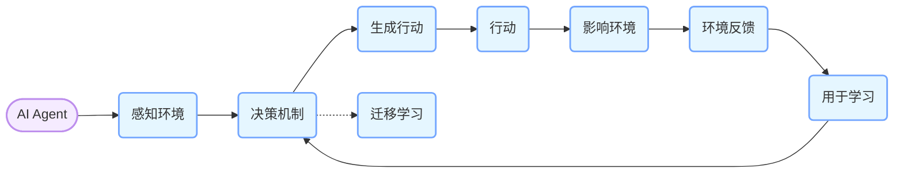

# AI Agent的迁移学习在小样本学习中的应用

> 关键词：AI Agent、迁移学习、小样本学习、模型泛化、知识迁移

> 摘要：本文聚焦于AI Agent的迁移学习在小样本学习中的应用。首先介绍了相关背景，包括目的范围、预期读者等内容。接着阐述了核心概念，如AI Agent、迁移学习和小样本学习的原理及联系，并给出了相应的文本示意图和Mermaid流程图。详细讲解了核心算法原理，通过Python代码进行了具体说明，同时给出了相关数学模型和公式。在项目实战部分，展示了开发环境搭建、源代码实现及代码解读。还探讨了实际应用场景，推荐了学习资源、开发工具框架和相关论文著作。最后总结了未来发展趋势与挑战，并给出了常见问题解答和扩展阅读参考资料。

## 1. 背景介绍 
### 1.1 目的和范围
随着人工智能技术的不断发展，小样本学习成为了一个极具挑战性的研究领域。在很多实际应用场景中，获取大量标注数据是非常困难的，例如医疗影像诊断、珍稀物种识别等。AI Agent的迁移学习为解决小样本学习问题提供了一种有效的途径。本文的目的在于深入探讨AI Agent的迁移学习在小样本学习中的应用原理、方法和实际效果。范围涵盖了从理论基础的阐述到实际项目的案例分析，旨在为相关研究人员和开发者提供全面的参考。

### 1.2 预期读者
本文预期读者包括人工智能领域的研究人员、机器学习工程师、数据科学家以及对小样本学习和迁移学习感兴趣的技术爱好者。对于有一定机器学习基础的读者，本文可以帮助他们深入理解AI Agent迁移学习在小样本学习中的应用；对于初学者，本文可以作为一个系统的学习资料，引导他们进入这个充满挑战和机遇的研究领域。

### 1.3 文档结构概述
本文将按照以下结构进行组织：首先介绍核心概念，包括AI Agent、迁移学习和小样本学习的定义和联系；然后详细讲解核心算法原理和具体操作步骤，通过Python代码进行说明；接着给出相关的数学模型和公式，并举例说明；在项目实战部分，展示如何搭建开发环境、实现源代码以及对代码进行解读；之后探讨实际应用场景；推荐学习资源、开发工具框架和相关论文著作；最后总结未来发展趋势与挑战，给出常见问题解答和扩展阅读参考资料。

### 1.4 术语表
#### 1.4.1 核心术语定义
- **AI Agent**：是一种能够感知环境、做出决策并采取行动以实现特定目标的智能实体。它可以是软件程序、机器人等，通过学习和适应环境来提高自身的性能。
- **迁移学习**：是一种机器学习技术，旨在将从一个或多个源任务中学习到的知识迁移到目标任务中，以提高目标任务的学习效率和性能。
- **小样本学习**：是指在训练数据样本数量非常有限的情况下，学习模型仍然能够具有良好的泛化能力，准确地对新数据进行分类或预测。

#### 1.4.2 相关概念解释
- **知识迁移**：在迁移学习中，知识迁移是核心概念。它可以是特征表示的迁移、模型参数的迁移或学习策略的迁移等。通过将源任务中的有用知识迁移到目标任务中，可以减少目标任务对大量标注数据的依赖。
- **泛化能力**：模型的泛化能力是指模型在未见过的数据上的表现能力。在小样本学习中，提高模型的泛化能力是关键，因为训练数据有限，模型需要能够从少量数据中学习到通用的模式，以应对新的数据。

#### 1.4.3 缩略词列表
- **ML**：Machine Learning，机器学习
- **DL**：Deep Learning，深度学习
- **CNN**：Convolutional Neural Network，卷积神经网络
- **RNN**：Recurrent Neural Network，循环神经网络

## 2. 核心概念与联系 

### 核心概念原理
#### AI Agent
AI Agent的核心原理是基于感知 - 决策 - 行动的循环。它通过传感器感知环境信息，然后根据内部的决策机制对这些信息进行处理和分析，最后采取相应的行动来影响环境。AI Agent可以通过学习不断优化自己的决策机制，以更好地实现目标。例如，在一个自动驾驶汽车的AI Agent中，传感器可以是摄像头、雷达等，决策机制可以是基于深度学习的算法，行动则是控制汽车的行驶方向、速度等。

#### 迁移学习
迁移学习的原理是利用源任务和目标任务之间的相似性，将源任务中学习到的知识迁移到目标任务中。根据迁移的层次和方式不同，迁移学习可以分为基于特征的迁移、基于模型的迁移和基于实例的迁移等。例如，在图像分类任务中，如果已经在大规模的图像数据集上训练了一个卷积神经网络，那么可以将这个网络的部分参数迁移到一个小样本的图像分类任务中，以加快训练速度和提高性能。

#### 小样本学习
小样本学习的核心原理是通过一些特殊的方法来提高模型在少量数据上的学习能力和泛化能力。常见的方法包括元学习、基于度量的学习和数据增强等。元学习的思想是学习如何学习，即通过在多个任务上进行训练，让模型学会快速适应新的任务。基于度量的学习则是通过学习样本之间的距离度量，来判断样本的类别。数据增强是通过对有限的训练数据进行变换和扩充，以增加数据的多样性，提高模型的泛化能力。

### 文本示意图
```plaintext
            AI Agent
             |
             | 感知环境
             |
             V
       决策机制（迁移学习）
             |
             | 生成行动
             |
             V
            行动
             |
             | 影响环境
             |
             V
         环境反馈
             |
             | 用于学习
             |
             V
       决策机制更新
```

### Mermaid流程图


## 3. 核心算法原理 & 具体操作步骤 

### 基于模型参数迁移的算法原理
在基于模型参数迁移的迁移学习中，通常会使用一个在大规模数据集上预训练好的模型，然后将其部分或全部参数迁移到目标任务的模型中。在小样本学习中，可以利用预训练模型的特征提取能力，减少目标任务对大量标注数据的依赖。

以下是一个使用Python和PyTorch实现基于模型参数迁移的小样本图像分类示例：

```python
import torch
import torch.nn as nn
import torch.optim as optim
from torchvision import datasets, transforms, models

# 数据预处理
transform = transforms.Compose([
    transforms.Resize((224, 224)),
    transforms.ToTensor(),
    transforms.Normalize(mean=[0.485, 0.456, 0.406], std=[0.229, 0.224, 0.225])
])

# 加载小样本数据集
train_dataset = datasets.ImageFolder(root='path/to/train_data', transform=transform)
train_loader = torch.utils.data.DataLoader(train_dataset, batch_size=32, shuffle=True)

# 加载预训练的ResNet模型
model = models.resnet18(pretrained=True)

# 冻结预训练模型的所有参数
for param in model.parameters():
    param.requires_grad = False

# 修改模型的最后一层全连接层，以适应目标任务的类别数
num_ftrs = model.fc.in_features
model.fc = nn.Linear(num_ftrs, len(train_dataset.classes))

# 定义损失函数和优化器
criterion = nn.CrossEntropyLoss()
optimizer = optim.SGD(model.fc.parameters(), lr=0.001, momentum=0.9)

# 训练模型
device = torch.device("cuda:0" if torch.cuda.is_available() else "cpu")
model.to(device)

for epoch in range(10):
    running_loss = 0.0
    for i, data in enumerate(train_loader, 0):
        inputs, labels = data[0].to(device), data[1].to(device)

        optimizer.zero_grad()

        outputs = model(inputs)
        loss = criterion(outputs, labels)
        loss.backward()
        optimizer.step()

        running_loss += loss.item()

    print(f'Epoch {epoch + 1}, Loss: {running_loss / len(train_loader)}')

print('Finished Training')
```

### 具体操作步骤
1. **数据预处理**：对小样本数据集进行预处理，包括图像的缩放、归一化等操作，以确保数据的一致性和可比性。
2. **加载预训练模型**：选择一个在大规模数据集上预训练好的模型，如ResNet、VGG等。
3. **冻结模型参数**：为了避免在训练过程中改变预训练模型的参数，将其大部分参数冻结，只允许最后一层全连接层的参数进行更新。
4. **修改模型结构**：根据目标任务的类别数，修改模型的最后一层全连接层，以适应目标任务的分类需求。
5. **定义损失函数和优化器**：选择合适的损失函数（如交叉熵损失）和优化器（如随机梯度下降）来训练模型。
6. **训练模型**：将模型移动到GPU（如果可用）上，然后使用小样本数据集进行训练，迭代多个epoch，直到模型收敛。

## 4. 数学模型和公式 & 详细讲解 & 举例说明 

### 迁移学习的数学模型
假设我们有一个源任务 $T_s$ 和一个目标任务 $T_t$。源任务的数据集为 $D_s = \{(x_{s1}, y_{s1}), (x_{s2}, y_{s2}), \cdots, (x_{sn}, y_{sn})\}$，目标任务的数据集为 $D_t = \{(x_{t1}, y_{t1}), (x_{t2}, y_{t2}), \cdots, (x_{tm}, y_{tm})\}$，其中 $x$ 表示输入样本，$y$ 表示对应的标签。

在基于模型参数迁移的迁移学习中，我们首先在源任务上训练一个模型 $f_s$，其目标是最小化源任务的损失函数 $L_s$：
$$
\min_{\theta_s} L_s(\theta_s; D_s)
$$
其中 $\theta_s$ 是源任务模型的参数。

然后，我们将源任务模型的部分参数 $\theta_{s}^{*}$ 迁移到目标任务模型 $f_t$ 中，目标任务模型的参数可以表示为 $\theta_t = [\theta_{s}^{*}, \theta_{t}^{new}]$，其中 $\theta_{t}^{new}$ 是目标任务模型中需要重新训练的参数。

目标任务的训练目标是最小化目标任务的损失函数 $L_t$：
$$
\min_{\theta_{t}^{new}} L_t(\theta_t; D_t)
$$

### 举例说明
假设我们要解决一个小样本的猫和狗的图像分类问题，源任务是一个大规模的图像分类任务，包含了各种动物的图像。我们首先在源任务上训练一个卷积神经网络 $f_s$，其损失函数可以是交叉熵损失：
$$
L_s(\theta_s; D_s) = -\frac{1}{n} \sum_{i=1}^{n} \sum_{j=1}^{k} y_{si}^j \log(p_{si}^j)
$$
其中 $n$ 是源任务数据集的样本数量，$k$ 是源任务的类别数，$y_{si}^j$ 是第 $i$ 个样本的第 $j$ 个类别的真实标签，$p_{si}^j$ 是模型预测的第 $i$ 个样本属于第 $j$ 个类别的概率。

在将源任务模型的参数迁移到目标任务模型后，目标任务的损失函数同样可以是交叉熵损失：
$$
L_t(\theta_t; D_t) = -\frac{1}{m} \sum_{i=1}^{m} \sum_{j=1}^{2} y_{ti}^j \log(p_{ti}^j)
$$
其中 $m$ 是目标任务数据集的样本数量，$2$ 是目标任务的类别数（猫和狗）。

通过最小化目标任务的损失函数，我们可以训练目标任务模型，使其在小样本数据集上具有良好的分类性能。

## 5. 项目实战：代码实际案例和详细解释说明 

### 5.1  开发环境搭建
#### 安装Python
首先，确保你已经安装了Python 3.x版本。可以从Python官方网站（https://www.python.org/downloads/）下载并安装适合你操作系统的Python版本。

#### 安装PyTorch
PyTorch是一个流行的深度学习框架，我们可以使用它来实现迁移学习和小样本学习。可以根据自己的CUDA版本和操作系统，选择合适的安装命令。例如，如果你使用的是CUDA 11.3，可以使用以下命令安装PyTorch：
```bash
pip install torch torchvision torchaudio --extra-index-url https://download.pytorch.org/whl/cu113
```

#### 安装其他依赖库
还需要安装一些其他的依赖库，如`numpy`、`matplotlib`等。可以使用以下命令进行安装：
```bash
pip install numpy matplotlib
```

### 5.2  源代码详细实现和代码解读
以下是一个完整的基于迁移学习的小样本图像分类项目的源代码：

```python
import torch
import torch.nn as nn
import torch.optim as optim
from torchvision import datasets, transforms, models
import matplotlib.pyplot as plt
import numpy as np

# 数据预处理
transform = transforms.Compose([
    transforms.Resize((224, 224)),
    transforms.ToTensor(),
    transforms.Normalize(mean=[0.485, 0.456, 0.406], std=[0.229, 0.224, 0.225])
])

# 加载小样本数据集
train_dataset = datasets.ImageFolder(root='path/to/train_data', transform=transform)
train_loader = torch.utils.data.DataLoader(train_dataset, batch_size=32, shuffle=True)

test_dataset = datasets.ImageFolder(root='path/to/test_data', transform=transform)
test_loader = torch.utils.data.DataLoader(test_dataset, batch_size=32, shuffle=False)

# 加载预训练的ResNet模型
model = models.resnet18(pretrained=True)

# 冻结预训练模型的所有参数
for param in model.parameters():
    param.requires_grad = False

# 修改模型的最后一层全连接层，以适应目标任务的类别数
num_ftrs = model.fc.in_features
model.fc = nn.Linear(num_ftrs, len(train_dataset.classes))

# 定义损失函数和优化器
criterion = nn.CrossEntropyLoss()
optimizer = optim.SGD(model.fc.parameters(), lr=0.001, momentum=0.9)

# 训练模型
device = torch.device("cuda:0" if torch.cuda.is_available() else "cpu")
model.to(device)

train_losses = []
test_losses = []
train_accuracies = []
test_accuracies = []

for epoch in range(10):
    model.train()
    running_loss = 0.0
    correct = 0
    total = 0
    for i, data in enumerate(train_loader, 0):
        inputs, labels = data[0].to(device), data[1].to(device)

        optimizer.zero_grad()

        outputs = model(inputs)
        loss = criterion(outputs, labels)
        loss.backward()
        optimizer.step()

        running_loss += loss.item()
        _, predicted = torch.max(outputs.data, 1)
        total += labels.size(0)
        correct += (predicted == labels).sum().item()

    train_loss = running_loss / len(train_loader)
    train_accuracy = 100 * correct / total
    train_losses.append(train_loss)
    train_accuracies.append(train_accuracy)

    model.eval()
    test_loss = 0.0
    correct = 0
    total = 0
    with torch.no_grad():
        for data in test_loader:
            images, labels = data[0].to(device), data[1].to(device)
            outputs = model(images)
            loss = criterion(outputs, labels)
            test_loss += loss.item()
            _, predicted = torch.max(outputs.data, 1)
            total += labels.size(0)
            correct += (predicted == labels).sum().item()

    test_loss = test_loss / len(test_loader)
    test_accuracy = 100 * correct / total
    test_losses.append(test_loss)
    test_accuracies.append(test_accuracy)

    print(f'Epoch {epoch + 1}, Train Loss: {train_loss}, Train Accuracy: {train_accuracy}%, Test Loss: {test_loss}, Test Accuracy: {test_accuracy}%')

print('Finished Training')

# 绘制训练和测试损失曲线
plt.figure(figsize=(10, 5))
plt.subplot(1, 2, 1)
plt.plot(train_losses, label='Train Loss')
plt.plot(test_losses, label='Test Loss')
plt.xlabel('Epoch')
plt.ylabel('Loss')
plt.legend()

# 绘制训练和测试准确率曲线
plt.subplot(1, 2, 2)
plt.plot(train_accuracies, label='Train Accuracy')
plt.plot(test_accuracies, label='Test Accuracy')
plt.xlabel('Epoch')
plt.ylabel('Accuracy (%)')
plt.legend()

plt.show()
```

### 5.3  代码解读与分析
#### 数据预处理
通过`transforms.Compose`函数定义了一系列的数据预处理操作，包括图像的缩放、转换为张量和归一化。这些操作可以确保输入数据的一致性和可比性。

#### 数据集加载
使用`datasets.ImageFolder`函数加载小样本的训练集和测试集，并使用`torch.utils.data.DataLoader`函数创建数据加载器，方便批量加载数据。

#### 模型加载和修改
加载预训练的ResNet18模型，并冻结其所有参数。然后修改模型的最后一层全连接层，使其输出的类别数与目标任务的类别数一致。

#### 损失函数和优化器
使用交叉熵损失函数`nn.CrossEntropyLoss`和随机梯度下降优化器`optim.SGD`来训练模型。

#### 训练过程
在每个epoch中，首先将模型设置为训练模式，然后遍历训练集，计算损失并进行反向传播和参数更新。接着将模型设置为评估模式，遍历测试集，计算测试损失和准确率。

#### 结果可视化
使用`matplotlib`库绘制训练和测试损失曲线以及训练和测试准确率曲线，方便观察模型的训练过程和性能。

## 6. 实际应用场景 
### 医疗影像诊断
在医疗影像诊断中，获取大量标注的病例数据是非常困难的，因为需要专业的医生进行标注，而且某些疾病的病例数量本身就很少。AI Agent的迁移学习可以利用在大规模通用影像数据集上预训练的模型，迁移到特定疾病的小样本影像诊断任务中。例如，在肺癌的早期诊断中，可以将在胸部CT影像的大规模数据集上训练的模型迁移到小样本的肺癌CT影像诊断中，帮助医生更准确地识别肺癌病灶。

### 珍稀物种识别
珍稀物种的数量稀少，获取其大量的图像数据进行训练是不现实的。通过迁移学习，AI Agent可以利用在常见物种图像数据集上训练的模型，迁移到珍稀物种的识别任务中。例如，在野生动物保护中，可以使用在常见鸟类图像数据集上预训练的模型，迁移到珍稀鸟类的识别中，帮助保护人员更准确地监测珍稀鸟类的活动。

### 个性化推荐系统
在个性化推荐系统中，每个用户的行为数据通常是非常有限的。AI Agent的迁移学习可以将在大量用户行为数据上学习到的通用知识迁移到每个用户的小样本行为数据上，提高推荐的准确性。例如，在电商推荐系统中，可以将在整个平台用户购物行为数据上训练的模型迁移到每个新用户的小样本购物行为数据上，为用户提供更个性化的商品推荐。

## 7. 工具和资源推荐
### 7.1 学习资源推荐
#### 7.1.1 书籍推荐
- 《深度学习》（Deep Learning）：由Ian Goodfellow、Yoshua Bengio和Aaron Courville所著，是深度学习领域的经典教材，涵盖了深度学习的基本原理、算法和应用。
- 《机器学习》（Machine Learning: A Probabilistic Perspective）：作者是Kevin P. Murphy，这本书从概率的角度介绍了机器学习的基本概念和算法，对于理解迁移学习和小样本学习的理论基础非常有帮助。
- 《动手学深度学习》（Dive into Deep Learning）：由李沐等人编写，提供了丰富的代码示例和详细的解释，适合初学者快速上手深度学习和迁移学习。

#### 7.1.2 在线课程
- Coursera上的“深度学习专项课程”（Deep Learning Specialization）：由Andrew Ng教授授课，包括神经网络和深度学习、改善深层神经网络、结构化机器学习项目等多个课程，系统地介绍了深度学习的各个方面。
- edX上的“强化学习基础”（Foundations of Reinforcement Learning）：对于理解AI Agent的决策机制和学习过程非常有帮助，因为迁移学习也可以与强化学习相结合。
- 哔哩哔哩上的“李宏毅机器学习”课程：李宏毅教授以生动有趣的方式讲解机器学习和深度学习的知识，包括迁移学习和小样本学习的相关内容。

#### 7.1.3 技术博客和网站
- Medium：有很多关于机器学习和深度学习的优秀博客文章，搜索“迁移学习”、“小样本学习”等关键词可以找到很多有价值的内容。
- arXiv：是一个预印本服务器，提供了大量关于机器学习和人工智能的最新研究论文，可以及时了解该领域的最新进展。
- 机器之心：是一个专注于人工智能领域的科技媒体，提供了丰富的技术文章、行业动态和研究成果介绍。

### 7.2 开发工具框架推荐
#### 7.2.1 IDE和编辑器
- PyCharm：是一款专门为Python开发设计的集成开发环境（IDE），提供了丰富的代码编辑、调试和项目管理功能，非常适合开发深度学习项目。
- Jupyter Notebook：是一个交互式的开发环境，可以将代码、文本和可视化结果集成在一个文档中，方便进行实验和数据分析。
- Visual Studio Code：是一款轻量级的代码编辑器，支持多种编程语言和插件，对于快速编写和调试Python代码非常方便。

#### 7.2.2 调试和性能分析工具
- TensorBoard：是TensorFlow提供的一个可视化工具，可以用于可视化训练过程中的损失曲线、准确率曲线、模型结构等信息，帮助开发者更好地理解模型的训练情况。
- PyTorch Profiler：是PyTorch提供的一个性能分析工具，可以帮助开发者找出代码中的性能瓶颈，优化模型的训练和推理速度。
- NVIDIA Nsight Systems：是NVIDIA提供的一个性能分析工具，主要用于分析GPU加速的深度学习应用程序的性能。

#### 7.2.3 相关框架和库
- PyTorch：是一个开源的深度学习框架，提供了丰富的神经网络模块和优化算法，支持GPU加速，非常适合实现迁移学习和小样本学习。
- TensorFlow：是另一个流行的深度学习框架，具有强大的分布式训练和部署能力，也提供了很多用于迁移学习的工具和方法。
- Scikit-learn：是一个用于机器学习的Python库，提供了很多经典的机器学习算法和工具，对于小样本学习中的数据预处理和模型评估非常有用。

### 7.3 相关论文著作推荐
#### 7.3.1 经典论文
- “How transferable are features in deep neural networks?”：探讨了深度神经网络中特征的可迁移性问题，为迁移学习的研究奠定了基础。
- “Matching Networks for One Shot Learning”：提出了一种基于匹配网络的一次性学习方法，对于小样本学习具有重要的启示作用。
- “Learning to Learn by Gradient Descent by Gradient Descent”：介绍了元学习的思想，通过梯度下降来学习如何学习，提高模型在小样本任务上的学习能力。

#### 7.3.2 最新研究成果
- 可以关注NeurIPS、ICML、CVPR等顶级机器学习和计算机视觉会议的最新论文，了解AI Agent的迁移学习在小样本学习中的最新研究进展。例如，一些研究提出了新的迁移学习算法，能够更有效地利用源任务的知识来提高目标任务的性能。

#### 7.3.3 应用案例分析
- 一些医学期刊上的论文会介绍AI Agent的迁移学习在医疗影像诊断中的应用案例，分析其诊断准确率和临床应用价值。
- 野生动物保护领域的研究报告会分享珍稀物种识别中迁移学习的应用效果和实际挑战。

## 8. 总结：未来发展趋势与挑战
### 未来发展趋势
#### 更强大的迁移学习算法
未来，研究人员将继续探索更强大的迁移学习算法，能够更好地处理源任务和目标任务之间的差异，提高知识迁移的效率和效果。例如，一些基于元学习的迁移学习算法可能会得到进一步的发展，能够更快地适应新的小样本任务。

#### 多模态迁移学习
随着数据类型的不断丰富，多模态迁移学习将成为一个重要的发展方向。例如，将图像、文本和音频等多种模态的数据进行迁移学习，能够在更复杂的小样本学习任务中发挥作用。例如，在智能客服系统中，结合图像、文本和语音信息进行迁移学习，可以提高客服机器人的服务质量。

#### 与强化学习的深度融合
AI Agent的迁移学习与强化学习的深度融合将为解决复杂的决策问题提供更有效的方法。在小样本学习场景中，通过迁移学习可以为强化学习提供先验知识，加快强化学习的收敛速度。例如，在自动驾驶领域，迁移学习可以将在模拟环境中学习到的知识迁移到实际驾驶场景中，帮助AI Agent更快地适应新的环境。

### 挑战
#### 领域差异问题
源任务和目标任务之间的领域差异是迁移学习面临的一个重要挑战。如果领域差异过大，迁移学习可能会导致负迁移，即迁移的知识反而降低了目标任务的性能。如何有效地处理领域差异，是未来研究需要解决的问题。

#### 小样本数据的质量问题
小样本数据的质量对迁移学习的效果有很大影响。如果小样本数据存在噪声、标注错误等问题，可能会导致模型的性能下降。如何提高小样本数据的质量，以及如何在低质量数据上进行有效的迁移学习，是需要进一步研究的方向。

#### 可解释性问题
随着AI Agent的迁移学习在越来越多的关键领域得到应用，模型的可解释性变得越来越重要。如何解释迁移学习模型的决策过程和结果，让用户信任模型的输出，是一个亟待解决的挑战。

## 9. 附录：常见问题与解答
### 问题1：迁移学习一定能提高小样本学习的性能吗？
解答：不一定。迁移学习的效果取决于源任务和目标任务之间的相似性、迁移的知识和方法等因素。如果源任务和目标任务差异过大，或者迁移的方法不合适，可能会导致负迁移，降低目标任务的性能。

### 问题2：如何选择合适的预训练模型进行迁移学习？
解答：选择合适的预训练模型需要考虑以下因素：目标任务的类型（如图像分类、目标检测等）、数据集的规模和特点、计算资源等。一般来说，如果目标任务是图像相关的，可以选择在大规模图像数据集上预训练的模型，如ResNet、VGG等。

### 问题3：在小样本学习中，数据增强的效果如何？
解答：数据增强可以增加训练数据的多样性，在一定程度上提高模型的泛化能力。但数据增强的效果也受到数据本身的特点和增强方法的影响。对于一些小样本数据集，数据增强可能会有较好的效果，但对于某些特殊类型的数据，可能需要选择合适的增强方法才能取得良好的效果。

### 问题4：迁移学习和元学习有什么区别和联系？
解答：迁移学习主要是将源任务的知识迁移到目标任务中，以提高目标任务的学习效率和性能。元学习则是学习如何学习，通过在多个任务上进行训练，让模型学会快速适应新的任务。两者有一定的联系，元学习可以为迁移学习提供更有效的学习策略，而迁移学习可以为元学习提供更多的先验知识。

## 10. 扩展阅读 & 参考资料
### 扩展阅读
- 阅读一些关于深度学习和机器学习的高级书籍，如《神经网络与深度学习》《统计学习方法》等，深入了解相关的理论知识。
- 关注一些人工智能领域的前沿研究机构和实验室的研究成果，如OpenAI、DeepMind等。

### 参考资料
- Goodfellow, I., Bengio, Y., & Courville, A. (2016). Deep Learning. MIT Press.
- Murphy, K. P. (2012). Machine Learning: A Probabilistic Perspective. MIT Press.
- Li, M., & Zhang, A. (2020). Dive into Deep Learning.
- Yosinski, J., Clune, J., Bengio, Y., & Lipson, H. (2014). How transferable are features in deep neural networks? Advances in neural information processing systems.
- Vinyals, O., Blundell, C., Lillicrap, T., Wierstra, D., et al. (2016). Matching Networks for One Shot Learning. Advances in neural information processing systems.
- Finn, C., Abbeel, P., & Levine, S. (2017). Model-agnostic meta-learning for fast adaptation of deep networks. Proceedings of the 34th International Conference on Machine Learning-Volume 70.