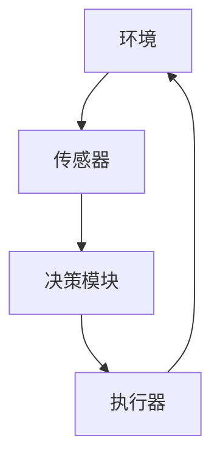
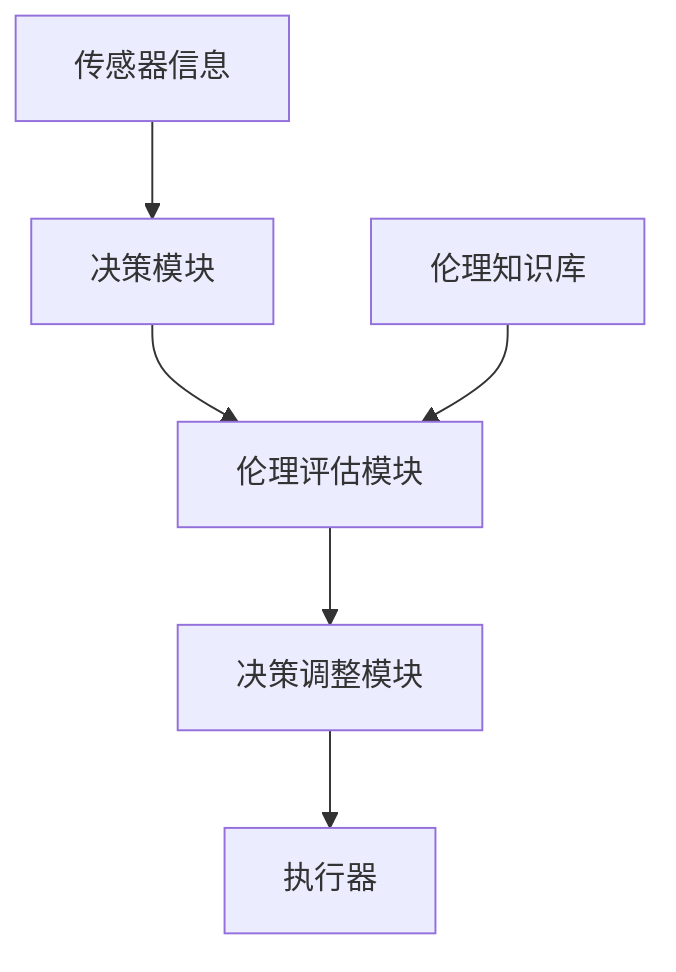

# AI Agent的道德决策框架：在人工智能中植入伦理考量

> 关键词：AI Agent、道德决策框架、人工智能伦理、伦理考量、决策模型、算法、应用场景

> 摘要：随着人工智能技术的飞速发展，AI Agent在各个领域的应用日益广泛。然而，其决策过程可能会引发一系列伦理问题。本文旨在探讨如何在人工智能中植入伦理考量，构建AI Agent的道德决策框架。通过对核心概念、算法原理、数学模型的分析，结合项目实战和实际应用场景，详细阐述道德决策框架的构建与应用。同时，推荐相关的学习资源、开发工具和论文著作，最后对未来发展趋势与挑战进行总结，并解答常见问题。

## 1. 背景介绍 
### 1.1 目的和范围
随着AI Agent在医疗、交通、金融等关键领域的深入应用，其决策的正确性和伦理性变得至关重要。本文章的目的在于探讨如何为AI Agent设计一个道德决策框架，使人工智能系统能够在决策过程中考虑伦理因素，减少因伦理问题导致的负面影响。范围涵盖了AI Agent道德决策框架的理论基础、算法实现、实际应用以及未来发展等方面。

### 1.2 预期读者
本文预期读者包括人工智能领域的研究人员、开发人员、伦理学家、政策制定者以及对人工智能伦理问题感兴趣的普通读者。研究人员可以从本文中获取关于道德决策框架的最新研究思路；开发人员可以借鉴具体的算法实现和代码示例；伦理学家可以从技术角度深入理解AI Agent的伦理问题；政策制定者可以依据本文的内容制定相关的政策法规；普通读者可以通过本文了解人工智能伦理的基本知识。

### 1.3 文档结构概述
本文首先介绍相关的背景知识，包括目的、预期读者和文档结构。接着阐述核心概念与联系，包括AI Agent、道德决策框架等核心概念的原理和架构。然后详细讲解核心算法原理和具体操作步骤，并给出相应的Python源代码。之后介绍数学模型和公式，通过具体例子进行说明。再通过项目实战展示代码实际案例和详细解释。随后探讨实际应用场景。接着推荐相关的工具和资源，包括学习资源、开发工具框架和相关论文著作。最后总结未来发展趋势与挑战，解答常见问题，并提供扩展阅读和参考资料。

### 1.4 术语表
#### 1.4.1 核心术语定义
- **AI Agent（人工智能智能体）**：能够感知环境、进行决策并采取行动以实现特定目标的人工智能实体。
- **道德决策框架**：一种用于指导AI Agent在决策过程中考虑伦理因素的系统架构和方法体系。
- **伦理考量**：在决策过程中对道德原则、价值观和社会规范的考虑。

#### 1.4.2 相关概念解释
- **伦理困境**：在决策过程中面临的多种道德原则相互冲突的情况。
- **后果主义**：一种伦理理论，认为行为的道德价值取决于其产生的后果。
- **义务论**：一种伦理理论，强调行为的道德价值取决于行为本身是否符合道德义务。

#### 1.4.3 缩略词列表
- **AI**：Artificial Intelligence（人工智能）
- **ML**：Machine Learning（机器学习）
- **RL**：Reinforcement Learning（强化学习）

## 2. 核心概念与联系 
### 2.1 AI Agent的基本原理
AI Agent是人工智能系统的核心组成部分，它通过传感器感知环境信息，经过内部的决策模块进行推理和决策，最后通过执行器采取行动。其基本架构可以用图1表示：



图1：AI Agent基本架构示意图

传感器负责收集环境中的各种信息，如图像、声音、温度等。决策模块根据传感器提供的信息，结合预设的目标和规则，进行推理和决策。执行器则根据决策结果，对环境进行相应的操作，如移动、抓取等。

### 2.2 道德决策框架的概念
道德决策框架是在AI Agent的决策过程中引入伦理考量的一种机制。它的主要作用是在面对不同的决策选项时，评估每个选项的伦理影响，并选择符合伦理原则的决策。道德决策框架通常包括以下几个部分：

- **伦理知识库**：存储各种伦理原则、价值观和社会规范的知识库。
- **伦理评估模块**：根据伦理知识库中的信息，对决策选项进行伦理评估。
- **决策调整模块**：根据伦理评估结果，对决策进行调整，确保决策符合伦理要求。

其架构可以用图2表示：



图2：道德决策框架架构示意图

### 2.3 AI Agent与道德决策框架的联系
AI Agent是道德决策框架的应用对象，道德决策框架则为AI Agent的决策提供伦理指导。在AI Agent的决策过程中，道德决策框架通过伦理评估和决策调整，确保AI Agent的行为符合伦理原则。例如，在自动驾驶汽车的决策过程中，道德决策框架可以评估不同的驾驶策略对乘客、行人等的伦理影响，并选择最符合伦理原则的策略。

## 3. 核心算法原理 & 具体操作步骤 
### 3.1 伦理评估算法原理
伦理评估算法的核心思想是根据伦理知识库中的伦理原则，对决策选项进行评估。一种常见的方法是使用加权求和的方式，将每个决策选项在不同伦理原则下的得分进行加权求和，得到该决策选项的综合伦理得分。

以下是一个简单的Python示例代码：

```python
# 伦理原则及其权重
ethical_principles = {
    "不伤害原则": 0.4,
    "公平原则": 0.3,
    "尊重原则": 0.3
}

# 决策选项及其在不同伦理原则下的得分
decision_options = {
    "选项1": {
        "不伤害原则": 0.8,
        "公平原则": 0.6,
        "尊重原则": 0.7
    },
    "选项2": {
        "不伤害原则": 0.6,
        "公平原则": 0.8,
        "尊重原则": 0.7
    }
}

def ethical_evaluation(decision_options, ethical_principles):
    scores = {}
    for option, principle_scores in decision_options.items():
        score = 0
        for principle, weight in ethical_principles.items():
            score += principle_scores[principle] * weight
        scores[option] = score
    return scores

# 进行伦理评估
scores = ethical_evaluation(decision_options, ethical_principles)
print("各决策选项的伦理得分:", scores)
```

### 3.2 决策调整算法原理
决策调整算法的目的是根据伦理评估结果，对决策进行调整。一种简单的方法是选择伦理得分最高的决策选项作为最终决策。

以下是在上述伦理评估基础上进行决策调整的Python代码：

```python
def decision_adjustment(scores):
    best_option = max(scores, key=scores.get)
    return best_option

# 进行决策调整
best_option = decision_adjustment(scores)
print("最终决策选项:", best_option)
```

### 3.3 具体操作步骤
1. **数据收集**：收集AI Agent的传感器信息和可能的决策选项。
2. **伦理知识库构建**：根据不同的应用场景和伦理要求，构建伦理知识库，确定伦理原则及其权重。
3. **伦理评估**：使用伦理评估算法对每个决策选项进行伦理评估，得到每个选项的伦理得分。
4. **决策调整**：根据伦理评估结果，使用决策调整算法选择最终的决策选项。
5. **执行决策**：AI Agent根据最终决策选项，通过执行器采取相应的行动。

## 4. 数学模型和公式 & 详细讲解 & 举例说明 
### 4.1 伦理评估数学模型
设共有 $n$ 个伦理原则，分别为 $P_1, P_2, \cdots, P_n$，其对应的权重分别为 $w_1, w_2, \cdots, w_n$，且满足 $\sum_{i=1}^{n} w_i = 1$。对于一个决策选项 $O$，其在第 $i$ 个伦理原则下的得分记为 $s_{i}(O)$。则该决策选项的综合伦理得分 $S(O)$ 可以用以下公式表示：

$$S(O) = \sum_{i=1}^{n} w_i \cdot s_{i}(O)$$

### 4.2 详细讲解
这个数学模型的核心思想是将每个伦理原则的得分进行加权求和，得到决策选项的综合伦理得分。权重 $w_i$ 表示每个伦理原则的重要程度，得分 $s_{i}(O)$ 表示决策选项在该伦理原则下的符合程度。通过这种方式，可以综合考虑多个伦理原则，对决策选项进行全面的伦理评估。

### 4.3 举例说明
假设我们有两个伦理原则：不伤害原则（权重 $w_1 = 0.6$）和公平原则（权重 $w_2 = 0.4$）。有两个决策选项 $O_1$ 和 $O_2$，它们在不同伦理原则下的得分分别为：

- $s_1(O_1) = 0.8$，$s_2(O_1) = 0.6$
- $s_1(O_2) = 0.6$，$s_2(O_2) = 0.8$

则决策选项 $O_1$ 的综合伦理得分 $S(O_1)$ 为：

$$S(O_1) = w_1 \cdot s_1(O_1) + w_2 \cdot s_2(O_1) = 0.6 \times 0.8 + 0.4 \times 0.6 = 0.72$$

决策选项 $O_2$ 的综合伦理得分 $S(O_2)$ 为：

$$S(O_2) = w_1 \cdot s_1(O_2) + w_2 \cdot s_2(O_2) = 0.6 \times 0.6 + 0.4 \times 0.8 = 0.68$$

由于 $S(O_1) > S(O_2)$，所以决策选项 $O_1$ 的伦理得分更高，在决策调整时更有可能被选择。

## 5. 项目实战：代码实际案例和详细解释说明 
### 5.1  开发环境搭建
本项目使用Python进行开发，需要安装以下库：

- `numpy`：用于数值计算
- `pandas`：用于数据处理

可以使用以下命令进行安装：

```sh
pip install numpy pandas
```

### 5.2  源代码详细实现和代码解读
以下是一个完整的AI Agent道德决策框架的Python代码示例：

```python
import numpy as np
import pandas as pd

# 伦理原则及其权重
ethical_principles = {
    "不伤害原则": 0.4,
    "公平原则": 0.3,
    "尊重原则": 0.3
}

# 生成随机的决策选项及其在不同伦理原则下的得分
np.random.seed(42)
num_options = 5
decision_options = {}
for i in range(num_options):
    option_name = f"选项{i + 1}"
    principle_scores = {}
    for principle in ethical_principles.keys():
        principle_scores[principle] = np.random.rand()
    decision_options[option_name] = principle_scores

# 伦理评估函数
def ethical_evaluation(decision_options, ethical_principles):
    scores = {}
    for option, principle_scores in decision_options.items():
        score = 0
        for principle, weight in ethical_principles.items():
            score += principle_scores[principle] * weight
        scores[option] = score
    return scores

# 决策调整函数
def decision_adjustment(scores):
    best_option = max(scores, key=scores.get)
    return best_option

# 进行伦理评估
scores = ethical_evaluation(decision_options, ethical_principles)

# 进行决策调整
best_option = decision_adjustment(scores)

# 输出结果
print("各决策选项的伦理得分:")
df_scores = pd.DataFrame(scores.items(), columns=['决策选项', '伦理得分'])
print(df_scores)
print("最终决策选项:", best_option)
```

### 5.3  代码解读与分析
1. **伦理原则和决策选项的定义**：定义了伦理原则及其权重，使用`numpy`生成随机的决策选项及其在不同伦理原则下的得分。
2. **伦理评估函数**：`ethical_evaluation`函数根据伦理原则的权重和决策选项在各原则下的得分，计算每个决策选项的综合伦理得分。
3. **决策调整函数**：`decision_adjustment`函数选择伦理得分最高的决策选项作为最终决策。
4. **结果输出**：使用`pandas`将各决策选项的伦理得分以表格形式输出，并输出最终决策选项。

## 6. 实际应用场景 
### 6.1 自动驾驶汽车
在自动驾驶汽车的决策过程中，道德决策框架可以发挥重要作用。例如，当自动驾驶汽车面临突发情况，如前方突然出现行人时，它需要在不同的驾驶策略中做出选择。道德决策框架可以评估每个策略对行人、乘客和其他道路使用者的伦理影响，选择最符合伦理原则的策略，如尽量避免伤害行人，同时保证乘客的安全。

### 6.2 医疗诊断系统
医疗诊断系统在诊断疾病和制定治疗方案时，也需要考虑伦理因素。道德决策框架可以帮助医疗诊断系统评估不同治疗方案对患者的利益和风险，确保治疗方案符合患者的意愿和伦理原则，如尊重患者的自主权、不伤害患者等。

### 6.3 金融投资系统
金融投资系统在进行投资决策时，也可以引入道德决策框架。例如，在选择投资项目时，考虑项目的社会影响、环境影响等伦理因素，避免投资那些对社会和环境造成负面影响的项目。

## 7. 工具和资源推荐
### 7.1 学习资源推荐
#### 7.1.1 书籍推荐
- 《人工智能伦理》：全面介绍了人工智能领域的伦理问题和相关理论。
- 《道德计算：设计机器人的伦理》：探讨了如何在机器人设计中融入伦理考量。
- 《算法霸权：数学杀伤性武器的威胁与应对》：揭示了算法可能带来的伦理风险和社会问题。

#### 7.1.2 在线课程
- Coursera上的“人工智能伦理”课程：由知名教授授课，系统讲解人工智能伦理的基本知识和最新研究成果。
- edX上的“计算伦理学”课程：从计算的角度探讨伦理问题，包括人工智能伦理。

#### 7.1.3 技术博客和网站
- AI Ethics.org：专门讨论人工智能伦理问题的网站，提供最新的研究动态和案例分析。
- Medium上的AI Ethics博客：分享人工智能伦理领域的专家观点和实践经验。

### 7.2 开发工具框架推荐
#### 7.2.1 IDE和编辑器
- PyCharm：功能强大的Python集成开发环境，适合开发AI Agent相关的Python代码。
- Visual Studio Code：轻量级的代码编辑器，支持多种编程语言，可通过安装插件方便地进行Python开发。

#### 7.2.2 调试和性能分析工具
- pdb：Python自带的调试器，可用于调试Python代码。
- cProfile：Python的性能分析工具，可帮助分析代码的性能瓶颈。

#### 7.2.3 相关框架和库
- TensorFlow：开源的机器学习框架，可用于构建AI Agent的决策模型。
- PyTorch：另一个流行的机器学习框架，提供了丰富的深度学习工具。

### 7.3 相关论文著作推荐
#### 7.3.1 经典论文
- “The Moral Machine Experiment”：通过在线实验研究了不同文化背景下人们对自动驾驶汽车伦理决策的看法。
- “Artificial Intelligence and Responsibility Attribution: An Analytical Map”：分析了人工智能决策中的责任归属问题。

#### 7.3.2 最新研究成果
- 关注顶级学术会议，如AAAI、IJCAI等，这些会议上的论文反映了人工智能伦理领域的最新研究成果。
- 查阅相关学术期刊，如《Artificial Intelligence》《Journal of Artificial Intelligence Research》等。

#### 7.3.3 应用案例分析
- 各大科技公司的官方博客和研究报告，如Google、Microsoft等，会分享他们在人工智能伦理方面的实践经验和应用案例。

## 8. 总结：未来发展趋势与挑战
### 8.1 未来发展趋势
- **多学科融合**：AI Agent的道德决策框架将与伦理学、哲学、法学等多学科深度融合，形成更加完善的理论和方法体系。
- **个性化伦理决策**：根据不同用户的价值观和伦理偏好，实现个性化的伦理决策，提高决策的满意度和可接受性。
- **强化学习与伦理决策的结合**：通过强化学习算法，让AI Agent在实践中不断学习和优化伦理决策能力。

### 8.2 挑战
- **伦理原则的多样性**：不同文化、不同群体的伦理原则存在差异，如何在道德决策框架中兼顾这些差异是一个挑战。
- **伦理评估的主观性**：伦理评估往往具有一定的主观性，如何确保伦理评估的客观性和公正性是需要解决的问题。
- **责任归属问题**：当AI Agent的决策出现伦理问题时，责任归属难以确定，需要建立相应的法律和制度框架。

## 9. 附录：常见问题与解答
### 9.1 如何确定伦理原则的权重？
伦理原则的权重可以根据不同的应用场景和利益相关者的需求来确定。可以通过专家咨询、问卷调查等方式收集意见，综合考虑各方面的因素来确定权重。

### 9.2 道德决策框架是否会影响AI Agent的性能？
在一定程度上，道德决策框架可能会增加AI Agent的计算复杂度，从而影响其性能。但是，通过优化算法和模型，合理设计伦理评估和决策调整机制，可以将性能影响降到最低。

### 9.3 如何保证伦理知识库的准确性和完整性？
伦理知识库的准确性和完整性需要不断地更新和维护。可以邀请伦理学家、法律专家等参与知识库的构建和更新，同时结合实际应用中的反馈，及时修正和完善知识库。

## 10. 扩展阅读 & 参考资料
### 10.1 扩展阅读
- 《机器人叛乱：在达尔文时代找到意义》：探讨了人类与机器人的关系以及伦理问题。
- 《人类简史：从动物到上帝》：从人类历史的角度思考人工智能的发展和伦理挑战。

### 10.2 参考资料
- 相关学术论文和研究报告
- 各大科技公司的官方文档和博客
- 国际组织和政府发布的人工智能伦理相关政策和指南