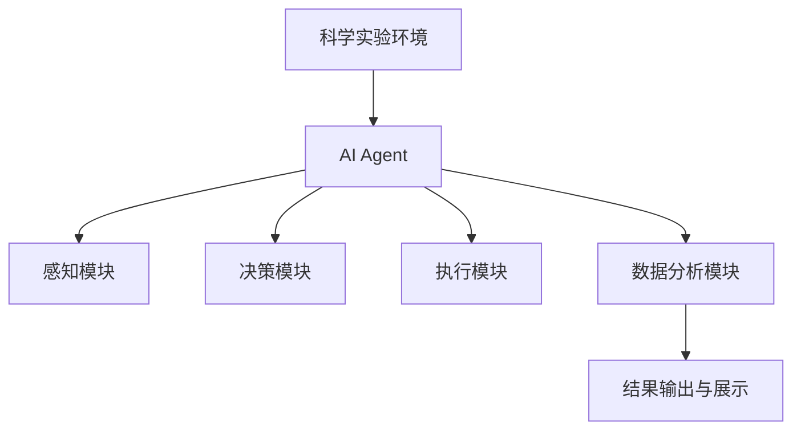

# AI Agent辅助科学实验：自动化与数据分析

> 关键词：AI Agent、科学实验、自动化、数据分析、智能辅助

> 摘要：本文深入探讨了AI Agent在辅助科学实验中的应用，聚焦于其自动化与数据分析的功能。首先介绍了AI Agent辅助科学实验的背景和相关概念，接着阐述了其核心算法原理与操作步骤，通过数学模型和公式进一步剖析其工作机制。在项目实战部分，详细展示了开发环境搭建、源代码实现与解读。随后探讨了AI Agent在不同科学实验场景中的实际应用，推荐了相关的学习资源、开发工具和论文著作。最后总结了其未来发展趋势与挑战，并对常见问题进行了解答，为读者全面了解AI Agent在科学实验中的应用提供了系统而深入的参考。

## 1. 背景介绍 
### 1.1 目的和范围
随着科学研究的不断深入，实验的复杂性和数据量都在急剧增加。传统的科学实验方法在效率和准确性方面面临着越来越大的挑战。AI Agent辅助科学实验的出现，为解决这些问题提供了新的途径。本文的目的在于全面介绍AI Agent在科学实验自动化和数据分析中的应用，探讨其原理、实现方法和实际应用场景。范围涵盖了AI Agent的基本概念、核心算法、数学模型，以及在不同科学领域实验中的具体应用。

### 1.2 预期读者
本文预期读者包括科研工作者、数据科学家、人工智能爱好者、软件开发人员等。对于科研工作者来说，了解AI Agent如何辅助科学实验可以提高实验效率和研究成果的质量；数据科学家可以从数据分析的角度深入理解AI Agent的应用；人工智能爱好者可以拓宽对AI Agent应用领域的认识；软件开发人员则可以获取相关的技术实现细节，用于实际项目开发。

### 1.3 文档结构概述
本文将按照以下结构进行阐述：首先介绍背景信息，包括目的、预期读者和文档结构概述，以及相关术语的定义。接着讲解AI Agent的核心概念与联系，通过文本示意图和Mermaid流程图进行直观展示。然后详细阐述核心算法原理和具体操作步骤，结合Python源代码进行说明。再通过数学模型和公式进一步剖析其工作机制，并举例说明。在项目实战部分，展示开发环境搭建、源代码实现与解读。之后探讨实际应用场景，推荐相关的工具和资源。最后总结未来发展趋势与挑战，解答常见问题，并提供扩展阅读和参考资料。

### 1.4 术语表
#### 1.4.1 核心术语定义
- **AI Agent（人工智能智能体）**：是一种能够感知环境、做出决策并采取行动以实现特定目标的人工智能实体。在科学实验中，它可以自动执行实验操作、收集数据、分析数据等。
- **科学实验自动化**：指利用计算机技术和人工智能手段，使科学实验过程中的各个环节，如实验设备的控制、实验参数的设置、实验数据的采集等，能够自动进行，减少人工干预，提高实验效率和准确性。
- **数据分析**：是指对收集到的实验数据进行处理、清洗、挖掘和解释，以发现数据中的规律、模式和趋势，为科学研究提供支持。

#### 1.4.2 相关概念解释
- **机器学习**：是人工智能的一个重要分支，通过让计算机从数据中学习模式和规律，从而实现预测、分类、聚类等任务。在AI Agent辅助科学实验中，机器学习算法可以用于数据分析和决策制定。
- **深度学习**：是一种基于人工神经网络的机器学习方法，能够自动从大量数据中提取特征，在图像识别、语音识别、自然语言处理等领域取得了显著的成果。在科学实验中，深度学习可以用于复杂数据的分析和处理。
- **传感器网络**：由大量的传感器节点组成，能够实时监测环境中的各种物理量和化学量。在科学实验中，传感器网络可以为AI Agent提供实验数据。

#### 1.4.3 缩略词列表
- **AI**：Artificial Intelligence（人工智能）
- **ML**：Machine Learning（机器学习）
- **DL**：Deep Learning（深度学习）
- **IoT**：Internet of Things（物联网）

## 2. 核心概念与联系 

### 核心概念原理
AI Agent辅助科学实验的核心原理是将人工智能技术与科学实验相结合，通过感知实验环境、理解实验任务、做出决策并执行相应的操作，实现科学实验的自动化和智能化。AI Agent通常由感知模块、决策模块和执行模块组成。感知模块负责收集实验环境中的各种信息，如实验设备的状态、实验数据等；决策模块根据感知到的信息和预设的目标，选择合适的实验策略和操作；执行模块则根据决策模块的指令，控制实验设备进行相应的操作。

### 架构的文本示意图
```plaintext
+-------------------+
|    科学实验环境    |
| （实验设备、样本等）|
+-------------------+
           |
           v
+-------------------+
|    AI Agent       |
| +---------------+ |
| |  感知模块     | |
| +---------------+ |
| |  决策模块     | |
| +---------------+ |
| |  执行模块     | |
| +---------------+ |
+-------------------+
           |
           v
+-------------------+
|    数据分析模块   |
| （数据处理、挖掘等）|
+-------------------+
           |
           v
+-------------------+
|    结果输出与展示  |
| （报告、可视化等） |
+-------------------+
```

### Mermaid流程图


## 3. 核心算法原理 & 具体操作步骤 

### 核心算法原理
AI Agent在辅助科学实验中常用的算法包括强化学习算法、机器学习算法等。这里以强化学习算法为例进行说明。强化学习是一种通过智能体与环境进行交互，不断尝试不同的行动并根据环境反馈的奖励来学习最优策略的算法。在科学实验中，AI Agent可以将实验环境看作是一个强化学习环境，将实验目标看作是强化学习的目标，通过不断尝试不同的实验操作并根据实验结果获得奖励，学习到最优的实验策略。

### 具体操作步骤
1. **环境建模**：将科学实验环境抽象为一个强化学习环境，定义环境的状态、行动和奖励函数。
2. **智能体初始化**：初始化AI Agent的策略网络和价值网络。
3. **交互学习**：AI Agent在实验环境中不断进行交互，选择行动并根据环境反馈的奖励更新策略网络和价值网络。
4. **策略优化**：通过不断的交互学习，优化AI Agent的策略，使其能够在实验环境中获得最大的累积奖励。

### Python源代码详细阐述
```python
import numpy as np
import torch
import torch.nn as nn
import torch.optim as optim

# 定义强化学习环境
class ScienceExperimentEnv:
    def __init__(self):
        # 初始化环境状态
        self.state = np.random.rand(10)
        self.done = False

    def step(self, action):
        # 根据行动更新环境状态
        self.state += action
        # 判断是否达到终止条件
        if np.sum(self.state) > 10:
            self.done = True
            reward = 1
        else:
            reward = -1
        return self.state, reward, self.done

    def reset(self):
        # 重置环境状态
        self.state = np.random.rand(10)
        self.done = False
        return self.state

# 定义策略网络
class PolicyNetwork(nn.Module):
    def __init__(self, input_dim, output_dim):
        super(PolicyNetwork, self).__init__()
        self.fc1 = nn.Linear(input_dim, 64)
        self.fc2 = nn.Linear(64, output_dim)
        self.softmax = nn.Softmax(dim=1)

    def forward(self, x):
        x = torch.relu(self.fc1(x))
        x = self.softmax(self.fc2(x))
        return x

# 定义AI Agent
class AI_Agent:
    def __init__(self, input_dim, output_dim):
        self.policy_network = PolicyNetwork(input_dim, output_dim)
        self.optimizer = optim.Adam(self.policy_network.parameters(), lr=0.001)

    def select_action(self, state):
        state = torch.FloatTensor(state).unsqueeze(0)
        probs = self.policy_network(state)
        action = torch.multinomial(probs, 1).item()
        return action

    def update_policy(self, log_probs, rewards):
        discounted_rewards = []
        R = 0
        for r in reversed(rewards):
            R = r + 0.9 * R
            discounted_rewards.insert(0, R)
        discounted_rewards = torch.FloatTensor(discounted_rewards)
        discounted_rewards = (discounted_rewards - discounted_rewards.mean()) / (discounted_rewards.std() + 1e-9)
        policy_loss = []
        for log_prob, reward in zip(log_probs, discounted_rewards):
            policy_loss.append(-log_prob * reward)
        policy_loss = torch.cat(policy_loss).sum()
        self.optimizer.zero_grad()
        policy_loss.backward()
        self.optimizer.step()

# 主训练循环
env = ScienceExperimentEnv()
agent = AI_Agent(input_dim=10, output_dim=5)
num_episodes = 1000
for episode in range(num_episodes):
    state = env.reset()
    log_probs = []
    rewards = []
    done = False
    while not done:
        action = agent.select_action(state)
        next_state, reward, done = env.step(action)
        log_prob = torch.log(agent.policy_network(torch.FloatTensor(state).unsqueeze(0))[0][action])
        log_probs.append(log_prob)
        rewards.append(reward)
        state = next_state
    agent.update_policy(log_probs, rewards)
    if episode % 100 == 0:
        print(f"Episode {episode}: Total Reward = {sum(rewards)}")
```

## 4. 数学模型和公式 & 详细讲解 & 举例说明 

### 数学模型
在强化学习中，常用的数学模型是马尔可夫决策过程（MDP）。一个MDP可以用一个五元组 $<S, A, P, R, \gamma>$ 来表示，其中：
- $S$ 是环境的状态空间。
- $A$ 是智能体的行动空间。
- $P(s'|s, a)$ 是状态转移概率，表示在状态 $s$ 下采取行动 $a$ 后转移到状态 $s'$ 的概率。
- $R(s, a)$ 是奖励函数，表示在状态 $s$ 下采取行动 $a$ 后获得的即时奖励。
- $\gamma \in [0, 1]$ 是折扣因子，用于权衡即时奖励和未来奖励的重要性。

### 公式
智能体的目标是最大化累积折扣奖励 $G_t$，其计算公式为：
$$G_t = \sum_{k=0}^{\infty} \gamma^k R_{t+k+1}$$
智能体的策略 $\pi(a|s)$ 表示在状态 $s$ 下选择行动 $a$ 的概率。状态价值函数 $V^{\pi}(s)$ 表示在策略 $\pi$ 下从状态 $s$ 开始的期望累积折扣奖励，其计算公式为：
$$V^{\pi}(s) = \mathbb{E}_{\pi}[G_t | S_t = s]$$
动作价值函数 $Q^{\pi}(s, a)$ 表示在策略 $\pi$ 下从状态 $s$ 采取行动 $a$ 后开始的期望累积折扣奖励，其计算公式为：
$$Q^{\pi}(s, a) = \mathbb{E}_{\pi}[G_t | S_t = s, A_t = a]$$

### 详细讲解
在科学实验中，状态空间 $S$ 可以表示实验设备的状态、实验参数的取值等；行动空间 $A$ 可以表示实验操作的集合，如调整实验参数、更换实验设备等；奖励函数 $R(s, a)$ 可以根据实验结果来定义，如实验成功则给予正奖励，实验失败则给予负奖励。智能体通过不断与实验环境进行交互，学习到最优的策略 $\pi^*$，使得状态价值函数 $V^{\pi^*}(s)$ 或动作价值函数 $Q^{\pi^*}(s, a)$ 最大。

### 举例说明
假设一个化学实验，实验设备的状态可以用温度、压力、反应物浓度等参数来表示，状态空间 $S$ 就是这些参数的取值范围。行动空间 $A$ 可以包括调整温度、压力、添加反应物等操作。奖励函数 $R(s, a)$ 可以根据化学反应的产率来定义，如果产率提高则给予正奖励，产率降低则给予负奖励。智能体通过不断尝试不同的操作，学习到最优的实验策略，使得化学反应的产率最大化。

## 5. 项目实战：代码实际案例和详细解释说明 

### 5.1  开发环境搭建
1. **安装Python**：推荐使用Python 3.7及以上版本，可以从Python官方网站（https://www.python.org/downloads/）下载并安装。
2. **安装深度学习框架**：这里使用PyTorch作为深度学习框架，可以通过以下命令进行安装：
```bash
pip install torch torchvision
```
3. **安装其他依赖库**：根据项目需求，可能还需要安装NumPy、Matplotlib等库，可以通过以下命令进行安装：
```bash
pip install numpy matplotlib
```

### 5.2  源代码详细实现和代码解读
```python
import numpy as np
import torch
import torch.nn as nn
import torch.optim as optim
import matplotlib.pyplot as plt

# 定义科学实验环境
class ScienceExperimentEnv:
    def __init__(self):
        # 初始化环境状态，这里假设状态是一个10维的向量
        self.state = np.random.rand(10)
        self.done = False

    def step(self, action):
        # 根据行动更新环境状态
        self.state += action
        # 判断是否达到终止条件，这里简单地判断状态向量的和是否大于10
        if np.sum(self.state) > 10:
            self.done = True
            reward = 1
        else:
            reward = -1
        return self.state, reward, self.done

    def reset(self):
        # 重置环境状态
        self.state = np.random.rand(10)
        self.done = False
        return self.state

# 定义策略网络
class PolicyNetwork(nn.Module):
    def __init__(self, input_dim, output_dim):
        super(PolicyNetwork, self).__init__()
        # 定义全连接层
        self.fc1 = nn.Linear(input_dim, 64)
        self.fc2 = nn.Linear(64, output_dim)
        # 定义Softmax激活函数，用于输出动作概率分布
        self.softmax = nn.Softmax(dim=1)

    def forward(self, x):
        # 前向传播
        x = torch.relu(self.fc1(x))
        x = self.softmax(self.fc2(x))
        return x

# 定义AI Agent
class AI_Agent:
    def __init__(self, input_dim, output_dim):
        # 初始化策略网络
        self.policy_network = PolicyNetwork(input_dim, output_dim)
        # 定义优化器
        self.optimizer = optim.Adam(self.policy_network.parameters(), lr=0.001)

    def select_action(self, state):
        # 将状态转换为张量
        state = torch.FloatTensor(state).unsqueeze(0)
        # 计算动作概率分布
        probs = self.policy_network(state)
        # 根据概率分布采样动作
        action = torch.multinomial(probs, 1).item()
        return action

    def update_policy(self, log_probs, rewards):
        # 计算折扣奖励
        discounted_rewards = []
        R = 0
        for r in reversed(rewards):
            R = r + 0.9 * R
            discounted_rewards.insert(0, R)
        discounted_rewards = torch.FloatTensor(discounted_rewards)
        # 归一化折扣奖励
        discounted_rewards = (discounted_rewards - discounted_rewards.mean()) / (discounted_rewards.std() + 1e-9)
        # 计算策略损失
        policy_loss = []
        for log_prob, reward in zip(log_probs, discounted_rewards):
            policy_loss.append(-log_prob * reward)
        policy_loss = torch.cat(policy_loss).sum()
        # 梯度清零
        self.optimizer.zero_grad()
        # 反向传播
        policy_loss.backward()
        # 更新参数
        self.optimizer.step()

# 主训练循环
env = ScienceExperimentEnv()
agent = AI_Agent(input_dim=10, output_dim=5)
num_episodes = 1000
total_rewards = []
for episode in range(num_episodes):
    state = env.reset()
    log_probs = []
    rewards = []
    done = False
    while not done:
        action = agent.select_action(state)
        next_state, reward, done = env.step(action)
        log_prob = torch.log(agent.policy_network(torch.FloatTensor(state).unsqueeze(0))[0][action])
        log_probs.append(log_prob)
        rewards.append(reward)
        state = next_state
    agent.update_policy(log_probs, rewards)
    total_reward = sum(rewards)
    total_rewards.append(total_reward)
    if episode % 100 == 0:
        print(f"Episode {episode}: Total Reward = {total_reward}")

# 绘制奖励曲线
plt.plot(total_rewards)
plt.xlabel('Episode')
plt.ylabel('Total Reward')
plt.title('Training Curve')
plt.show()
```

### 5.3  代码解读与分析
1. **环境类 `ScienceExperimentEnv`**：模拟了一个科学实验环境，包含状态初始化、状态更新和环境重置等方法。
2. **策略网络类 `PolicyNetwork`**：定义了一个简单的全连接神经网络，用于输出动作概率分布。
3. **AI Agent类 `AI_Agent`**：包含策略网络和优化器，实现了动作选择和策略更新的方法。
4. **主训练循环**：在每个训练回合中，AI Agent与环境进行交互，选择动作并根据环境反馈的奖励更新策略网络。
5. **奖励曲线绘制**：通过绘制奖励曲线，可以直观地观察AI Agent的训练效果。

## 6. 实际应用场景 
### 化学实验
在化学实验中，AI Agent可以自动控制实验设备，如调整温度、压力、添加反应物等，实现实验过程的自动化。同时，AI Agent可以对实验数据进行实时分析，预测化学反应的结果，优化实验参数，提高化学反应的产率和选择性。例如，在药物合成实验中，AI Agent可以根据药物分子的结构和反应条件，自动设计实验方案，提高药物合成的效率和质量。

### 生物实验
在生物实验中，AI Agent可以辅助进行细胞培养、基因测序、蛋白质分析等实验。例如，在细胞培养实验中，AI Agent可以实时监测细胞的生长状态，自动调整培养条件，如温度、湿度、培养基成分等，提高细胞培养的成功率和质量。在基因测序实验中，AI Agent可以对测序数据进行分析，识别基因序列中的变异和突变，为疾病诊断和治疗提供依据。

### 物理实验
在物理实验中，AI Agent可以控制实验仪器，如加速器、望远镜等，实现实验数据的自动采集和分析。例如，在高能物理实验中，AI Agent可以对加速器产生的粒子数据进行实时分析，发现新的粒子和物理现象。在天文学实验中，AI Agent可以对望远镜观测到的天体数据进行处理和分析，研究天体的演化和结构。

### 材料科学实验
在材料科学实验中，AI Agent可以辅助进行材料的制备和性能测试。例如，在新材料研发实验中，AI Agent可以根据材料的性能要求，自动设计材料的成分和制备工艺，提高材料的性能和质量。在材料性能测试实验中，AI Agent可以对测试数据进行分析，预测材料的使用寿命和可靠性，为材料的应用提供指导。

## 7. 工具和资源推荐
### 7.1 学习资源推荐
#### 7.1.1 书籍推荐
- 《人工智能：一种现代的方法》：全面介绍了人工智能的基本概念、算法和应用，是人工智能领域的经典教材。
- 《强化学习：原理与Python实现》：详细讲解了强化学习的基本原理和算法，并通过Python代码进行了实现，适合初学者学习。
- 《深度学习》：由深度学习领域的三位领军人物撰写，系统地介绍了深度学习的理论和实践，是深度学习领域的权威著作。

#### 7.1.2 在线课程
- Coursera上的“人工智能基础”课程：由斯坦福大学的教授授课，介绍了人工智能的基本概念、算法和应用。
- edX上的“强化学习”课程：由伯克利大学的教授授课，深入讲解了强化学习的原理和算法。
- 网易云课堂上的“深度学习实战”课程：通过实际项目案例，介绍了深度学习的应用和开发技巧。

#### 7.1.3 技术博客和网站
- Medium上的人工智能相关博客：有很多人工智能领域的专家和爱好者分享的技术文章和经验。
- arXiv.org：是一个预印本服务器，提供了大量的人工智能领域的研究论文。
- AI社区：如AI研习社、机器之心等，提供了人工智能领域的最新资讯、技术文章和开源项目。

### 7.2 开发工具框架推荐
#### 7.2.1 IDE和编辑器
- PyCharm：是一款专业的Python集成开发环境，提供了丰富的功能和插件，适合Python开发。
- Visual Studio Code：是一款轻量级的代码编辑器，支持多种编程语言，有丰富的插件可以扩展功能。
- Jupyter Notebook：是一个交互式的开发环境，适合进行数据分析和模型训练。

#### 7.2.2 调试和性能分析工具
- TensorBoard：是TensorFlow提供的一个可视化工具，可以用于查看模型的训练过程、性能指标等。
- PyTorch Profiler：是PyTorch提供的一个性能分析工具，可以用于分析模型的运行时间、内存使用等情况。
- cProfile：是Python标准库中的一个性能分析工具，可以用于分析Python代码的运行时间和函数调用情况。

#### 7.2.3 相关框架和库
- PyTorch：是一个开源的深度学习框架，提供了丰富的深度学习模型和工具，易于使用和扩展。
- TensorFlow：是一个广泛使用的深度学习框架，支持分布式训练和部署，有丰富的社区资源。
- Scikit-learn：是一个开源的机器学习库，提供了各种机器学习算法和工具，适合进行数据挖掘和分析。

### 7.3 相关论文著作推荐
#### 7.3.1 经典论文
- “Playing Atari with Deep Reinforcement Learning”：首次将深度学习和强化学习相结合，在Atari游戏中取得了很好的效果。
- “Human-level control through deep reinforcement learning”：提出了深度Q网络（DQN）算法，在多个Atari游戏中达到了人类水平。
- “Attention Is All You Need”：提出了Transformer模型，在自然语言处理领域取得了巨大的成功。

#### 7.3.2 最新研究成果
- 关注arXiv.org上的最新论文，了解AI Agent在科学实验中的最新研究进展。
- 参加人工智能领域的学术会议，如NeurIPS、ICML、CVPR等，获取最新的研究成果。

#### 7.3.3 应用案例分析
- 阅读相关的科研论文和技术报告，了解AI Agent在不同科学领域实验中的应用案例和效果。
- 参考开源项目和代码库，学习他人的实践经验和实现方法。

## 8. 总结：未来发展趋势与挑战
### 未来发展趋势
1. **多智能体协作**：未来的AI Agent将不再是单个智能体独立工作，而是多个智能体之间进行协作，共同完成复杂的科学实验任务。例如，在大规模的天文观测实验中，多个AI Agent可以分别控制不同的望远镜，协同进行数据采集和分析。
2. **与物联网的融合**：随着物联网技术的发展，AI Agent将与物联网设备深度融合，实现对实验环境的实时感知和控制。例如，在环境监测实验中，AI Agent可以通过物联网设备实时获取环境数据，自动调整实验参数，提高实验的准确性和效率。
3. **可解释性增强**：为了让科研人员更好地理解AI Agent的决策过程和结果，未来的AI Agent将更加注重可解释性。例如，通过可视化技术和自然语言解释，向科研人员展示AI Agent的决策依据和推理过程。
4. **跨领域应用**：AI Agent将不再局限于某一个科学领域，而是在多个领域之间进行跨领域应用。例如，将AI Agent在化学实验中的应用经验应用到生物实验中，实现不同领域之间的知识迁移和共享。

### 挑战
1. **数据质量和安全性**：科学实验数据通常具有高价值和敏感性，数据的质量和安全性是AI Agent应用的关键挑战。需要建立完善的数据管理和安全机制，确保数据的准确性、完整性和保密性。
2. **模型的泛化能力**：AI Agent在不同的科学实验环境中可能面临不同的问题和挑战，需要提高模型的泛化能力，使其能够在不同的环境中都能取得良好的效果。
3. **伦理和法律问题**：AI Agent的应用可能会带来一些伦理和法律问题，如责任认定、隐私保护等。需要建立相应的伦理和法律规范，确保AI Agent的应用符合人类的价值观和法律要求。
4. **人机协作的有效性**：在科学实验中，AI Agent通常需要与科研人员进行协作。如何实现人机之间的有效协作，提高科研效率和质量，是一个需要解决的问题。

## 9. 附录：常见问题与解答
### 问题1：AI Agent在科学实验中的应用是否会完全取代科研人员？
解答：不会。AI Agent在科学实验中主要起到辅助作用，能够提高实验效率和准确性，但科研人员的专业知识、创造力和判断力是不可替代的。AI Agent可以帮助科研人员处理大量的数据和复杂的任务，但最终的决策和结论仍然需要科研人员来做出。

### 问题2：AI Agent在科学实验中如何保证数据的准确性？
解答：可以通过以下几个方面来保证数据的准确性：1. 选择高质量的传感器和实验设备，确保数据采集的准确性。2. 对采集到的数据进行预处理，如数据清洗、去噪等，去除错误和异常数据。3. 采用多个数据源进行数据融合，提高数据的可靠性。4. 建立数据验证机制，对AI Agent处理后的数据进行验证和审核。

### 问题3：AI Agent的训练需要大量的数据，这些数据从哪里获取？
解答：数据来源可以包括以下几个方面：1. 历史实验数据：科研人员在过去的实验中积累了大量的数据，可以作为AI Agent训练的基础数据。2. 公开数据集：一些科学领域有公开的数据集可供使用，如天文学、生物学等领域。3. 模拟数据：可以通过计算机模拟生成一些实验数据，用于AI Agent的训练和测试。4. 实时采集数据：在实验过程中，实时采集实验数据，不断更新AI Agent的训练数据。

### 问题4：如何评估AI Agent在科学实验中的性能？
解答：可以从以下几个方面来评估AI Agent的性能：1. 实验结果的准确性：比较AI Agent辅助实验得到的结果与真实结果之间的差异，评估其准确性。2. 实验效率：评估AI Agent在实验过程中的时间消耗和资源利用情况，判断其是否提高了实验效率。3. 决策的合理性：分析AI Agent的决策过程和结果，判断其决策是否合理、可行。4. 学习能力：观察AI Agent在不同实验环境中的学习能力和适应能力，评估其泛化能力。

## 10. 扩展阅读 & 参考资料
### 扩展阅读
- 《智能时代》：介绍了人工智能对社会和经济的影响，以及未来的发展趋势。
- 《奇点临近》：探讨了人工智能的发展对人类社会的深远影响，以及人类如何应对未来的挑战。
- 《人类简史：从动物到上帝》：从人类历史的角度，探讨了人类与技术的关系，以及人工智能对人类未来的影响。

### 参考资料
1. Russell, S. J., & Norvig, P. (2009). Artificial Intelligence: A Modern Approach. Pearson Education.
2. Sutton, R. S., & Barto, A. G. (2018). Reinforcement Learning: An Introduction. MIT Press.
3. Goodfellow, I. J., Bengio, Y., & Courville, A. (2016). Deep Learning. MIT Press.
4. Mnih, V., Kavukcuoglu, K., Silver, D., et al. (2013). Playing Atari with Deep Reinforcement Learning. arXiv preprint arXiv:1312.5602.
5. Mnih, V., Kavukcuoglu, K., Silver, D., et al. (2015). Human-level control through deep reinforcement learning. Nature, 518(7540), 529-533.
6. Vaswani, A., Shazeer, N., Parmar, N., et al. (2017). Attention Is All You Need. Advances in Neural Information Processing Systems.