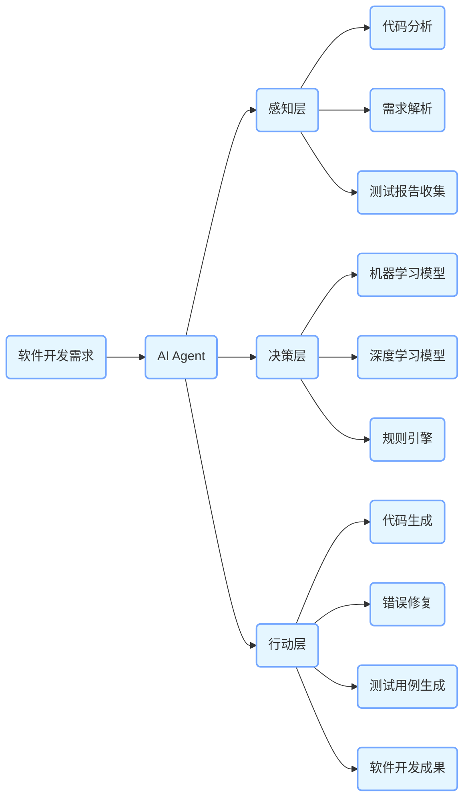

# AI Agent辅助软件开发的方法

> 关键词：AI Agent、软件开发、智能辅助、代码生成、项目管理

> 摘要：本文围绕AI Agent辅助软件开发的方法展开深入探讨。首先介绍了相关背景，包括目的、预期读者、文档结构和术语表。接着阐述了AI Agent的核心概念与联系，给出原理和架构的文本示意图与Mermaid流程图。详细讲解了核心算法原理，并用Python代码进行说明，同时给出数学模型和公式。通过项目实战展示了开发环境搭建、源代码实现与解读。分析了AI Agent在软件开发中的实际应用场景，推荐了相关学习资源、开发工具框架和论文著作。最后总结了未来发展趋势与挑战，并提供常见问题解答和扩展阅读参考资料，旨在为软件开发人员和相关研究者提供全面的技术指导。

## 1. 背景介绍 
### 1.1 目的和范围
随着软件开发的复杂度不断增加，传统的开发方式面临着效率低下、错误率高等问题。AI Agent作为一种智能实体，能够模拟人类的行为和思维方式，为软件开发提供强大的辅助支持。本文的目的在于详细探讨AI Agent辅助软件开发的各种方法，涵盖从代码生成、调试到项目管理等多个方面，帮助软件开发人员更好地利用AI Agent提高开发效率和质量。

### 1.2 预期读者
本文主要面向软件开发人员、软件架构师、CTO等技术人员，以及对人工智能在软件开发领域应用感兴趣的研究者和学生。这些读者希望了解如何利用AI Agent来优化软件开发流程，提高软件的性能和可靠性。

### 1.3 文档结构概述
本文将按照以下结构进行阐述：首先介绍AI Agent和软件开发的相关核心概念及其联系；接着讲解AI Agent辅助软件开发所涉及的核心算法原理和具体操作步骤，并给出Python代码示例；然后通过数学模型和公式对相关原理进行深入分析；之后进行项目实战，展示AI Agent在实际开发中的应用；分析AI Agent在软件开发中的实际应用场景；推荐相关的学习资源、开发工具框架和论文著作；最后总结未来发展趋势与挑战，提供常见问题解答和扩展阅读参考资料。

### 1.4 术语表
#### 1.4.1 核心术语定义
- **AI Agent**：人工智能代理，是一种能够感知环境、做出决策并采取行动以实现特定目标的智能实体。在软件开发中，AI Agent可以执行代码生成、错误检测、项目规划等任务。
- **软件开发**：指从需求分析、设计、编码、测试到维护等一系列创建软件系统的过程。
- **代码生成**：AI Agent根据用户的需求和规范自动生成源代码的过程。
- **项目管理**：对软件开发项目进行计划、组织、协调和控制，以确保项目按时、按质量要求完成。

#### 1.4.2 相关概念解释
- **智能感知**：AI Agent通过各种技术手段收集和理解软件开发过程中的信息，如代码结构、需求文档等。
- **决策推理**：基于感知到的信息，AI Agent运用算法和规则进行分析和判断，做出合理的决策。
- **自主学习**：AI Agent能够从历史数据和经验中学习，不断提高自身的性能和能力。

#### 1.4.3 缩略词列表
- **IDE**：Integrated Development Environment，集成开发环境
- **API**：Application Programming Interface，应用程序编程接口
- **ML**：Machine Learning，机器学习
- **DL**：Deep Learning，深度学习

## 2. 核心概念与联系 

### 核心概念原理
AI Agent辅助软件开发的核心原理是利用人工智能技术，使AI Agent能够理解软件开发的任务和需求，通过感知、决策和行动来辅助开发人员完成各项工作。

- **感知层**：AI Agent通过各种工具和技术收集软件开发过程中的信息，如代码库、需求文档、测试报告等。它可以使用自然语言处理技术解析需求文档，使用静态代码分析工具分析代码结构和质量。
- **决策层**：基于感知到的信息，AI Agent运用机器学习和深度学习算法进行分析和推理。例如，它可以根据历史代码数据预测代码中可能出现的错误，或者根据需求文档生成代码框架。
- **行动层**：AI Agent根据决策结果采取相应的行动。它可以自动生成代码、修复代码中的错误、进行测试用例的生成和执行等。

### 架构的文本示意图
```plaintext
|---------------------|
|     软件开发需求     |
|---------------------|
           |
           v
|---------------------|
|      AI Agent       |
|---------------------|
|  感知层             |
|    - 代码分析        |
|    - 需求解析        |
|    - 测试报告收集    |
|---------------------|
|  决策层             |
|    - 机器学习模型    |
|    - 深度学习模型    |
|    - 规则引擎        |
|---------------------|
|  行动层             |
|    - 代码生成        |
|    - 错误修复        |
|    - 测试用例生成    |
|---------------------|
           |
           v
|---------------------|
|    软件开发成果     |
|---------------------|
```

### Mermaid流程图


## 3. 核心算法原理 & 具体操作步骤 

### 核心算法原理
在AI Agent辅助软件开发中，常用的核心算法包括机器学习和深度学习算法，如决策树、神经网络等。以下以决策树算法为例，介绍其在代码错误预测中的应用原理。

决策树是一种基于树结构进行决策的算法，它通过对输入数据的特征进行划分，构建一棵决策树。在代码错误预测中，输入数据可以是代码的各种特征，如代码行数、函数调用次数、变量使用频率等，输出是代码是否存在错误的预测结果。

### 具体操作步骤
1. **数据收集**：收集历史代码数据，并标注其中存在错误的代码片段。
2. **特征提取**：从代码数据中提取相关特征，如上述提到的代码行数、函数调用次数等。
3. **模型训练**：使用收集到的数据和提取的特征训练决策树模型。
4. **模型评估**：使用测试数据评估训练好的模型的性能，如准确率、召回率等。
5. **预测应用**：将训练好的模型应用到新的代码数据中，预测代码是否存在错误。

### Python源代码实现
```python
import pandas as pd
from sklearn.tree import DecisionTreeClassifier
from sklearn.model_selection import train_test_split
from sklearn.metrics import accuracy_score

# 步骤1：数据收集（假设数据已经存储在CSV文件中）
data = pd.read_csv('code_errors.csv')

# 步骤2：特征提取
X = data.drop('has_error', axis=1)  # 特征数据
y = data['has_error']  # 标签数据

# 步骤3：模型训练
X_train, X_test, y_train, y_test = train_test_split(X, y, test_size=0.2, random_state=42)
model = DecisionTreeClassifier()
model.fit(X_train, y_train)

# 步骤4：模型评估
y_pred = model.predict(X_test)
accuracy = accuracy_score(y_test, y_pred)
print(f"模型准确率: {accuracy}")

# 步骤5：预测应用
new_code_features = pd.DataFrame({
    'lines_of_code': [100],
    'function_calls': [5],
    'variable_usage': [20]
})
prediction = model.predict(new_code_features)
print(f"新代码是否存在错误: {'是' if prediction[0] else '否'}")
```

## 4. 数学模型和公式 & 详细讲解 & 举例说明 

### 决策树算法的数学模型
决策树算法的核心是信息增益（Information Gain），它用于衡量特征对分类的重要性。信息增益的计算公式如下：

$$
IG(S, A) = H(S) - \sum_{v \in Values(A)} \frac{|S_v|}{|S|} H(S_v)
$$

其中：
- $IG(S, A)$ 表示特征 $A$ 对于数据集 $S$ 的信息增益。
- $H(S)$ 表示数据集 $S$ 的信息熵，计算公式为：
$$
H(S) = - \sum_{i=1}^{n} p_i \log_2 p_i
$$
其中 $p_i$ 是数据集 $S$ 中第 $i$ 类样本的比例。
- $S_v$ 表示数据集 $S$ 中特征 $A$ 取值为 $v$ 的子集。
- $|S|$ 表示数据集 $S$ 的样本数量。
- $|S_v|$ 表示子集 $S_v$ 的样本数量。

### 详细讲解
信息熵 $H(S)$ 衡量了数据集 $S$ 的不确定性。信息熵越大，数据集的不确定性越高。信息增益 $IG(S, A)$ 表示使用特征 $A$ 对数据集 $S$ 进行划分后，数据集的不确定性减少的程度。信息增益越大，说明特征 $A$ 对分类的贡献越大。

### 举例说明
假设有一个数据集 $S$ 包含 10 个样本，其中 6 个样本属于类别 1，4 个样本属于类别 2。则数据集 $S$ 的信息熵为：

$$
H(S) = - \left(\frac{6}{10} \log_2 \frac{6}{10} + \frac{4}{10} \log_2 \frac{4}{10}\right) \approx 0.971
$$

假设我们有一个特征 $A$，它有两个取值 $v_1$ 和 $v_2$。取值为 $v_1$ 的子集 $S_{v_1}$ 包含 4 个样本，其中 3 个属于类别 1，1 个属于类别 2；取值为 $v_2$ 的子集 $S_{v_2}$ 包含 6 个样本，其中 3 个属于类别 1，3 个属于类别 2。则子集 $S_{v_1}$ 和 $S_{v_2}$ 的信息熵分别为：

$$
H(S_{v_1}) = - \left(\frac{3}{4} \log_2 \frac{3}{4} + \frac{1}{4} \log_2 \frac{1}{4}\right) \approx 0.811
$$

$$
H(S_{v_2}) = - \left(\frac{3}{6} \log_2 \frac{3}{6} + \frac{3}{6} \log_2 \frac{3}{6}\right) = 1
$$

特征 $A$ 对于数据集 $S$ 的信息增益为：

$$
IG(S, A) = H(S) - \left(\frac{4}{10} H(S_{v_1}) + \frac{6}{10} H(S_{v_2})\right) \approx 0.971 - \left(\frac{4}{10} \times 0.811 + \frac{6}{10} \times 1\right) \approx 0.146
$$

这表明使用特征 $A$ 对数据集 $S$ 进行划分后，数据集的不确定性减少了约 0.146。

## 5. 项目实战：代码实际案例和详细解释说明 

### 5.1  开发环境搭建
为了进行AI Agent辅助软件开发的项目实战，我们需要搭建以下开发环境：

- **操作系统**：推荐使用Linux或Windows 10。
- **编程语言**：Python 3.7及以上版本。
- **集成开发环境（IDE）**：推荐使用PyCharm或Visual Studio Code。
- **相关库和框架**：安装`pandas`、`scikit-learn`、`tensorflow`等库。可以使用以下命令进行安装：
```sh
pip install pandas scikit-learn tensorflow
```

### 5.2  源代码详细实现和代码解读
以下是一个使用AI Agent生成Python函数的示例代码：

```python
import openai

# 设置OpenAI API密钥
openai.api_key = "YOUR_API_KEY"

def generate_python_function(prompt):
    """
    使用OpenAI GPT生成Python函数
    :param prompt: 输入的提示信息
    :return: 生成的Python函数代码
    """
    response = openai.Completion.create(
        engine="text-davinci-003",
        prompt=f"请生成一个Python函数来{prompt}",
        max_tokens=200,
        temperature=0.7
    )
    return response.choices[0].text.strip()

# 示例：生成一个计算两个数之和的函数
prompt = "计算两个数之和"
generated_function = generate_python_function(prompt)
print(generated_function)
```

### 代码解读与分析
- **导入`openai`库**：用于调用OpenAI的API。
- **设置API密钥**：需要替换为你自己的OpenAI API密钥。
- **`generate_python_function`函数**：接受一个提示信息作为输入，使用OpenAI的`text-davinci-003`引擎生成Python函数代码。
    - `prompt`参数：指定生成函数的具体要求。
    - `max_tokens`参数：限制生成的代码长度。
    - `temperature`参数：控制生成结果的随机性，值越大结果越随机。
- **示例调用**：生成一个计算两个数之和的函数，并打印生成的代码。

需要注意的是，使用OpenAI的API需要付费，并且需要遵守其使用条款。此外，生成的代码可能需要进行一定的修改和调试才能正常使用。

## 6. 实际应用场景 
### 代码生成
AI Agent可以根据用户的需求和规范自动生成代码。例如，在开发一个Web应用程序时，用户可以提供数据库表结构和业务逻辑要求，AI Agent可以生成相应的后端API代码和前端页面代码。这可以大大提高开发效率，减少开发人员的工作量。

### 错误检测与修复
AI Agent可以通过静态代码分析和机器学习算法检测代码中的潜在错误，如语法错误、逻辑错误等。它可以根据错误类型和上下文信息提供相应的修复建议，甚至自动修复一些简单的错误。这有助于提高代码的质量和可靠性。

### 项目管理
AI Agent可以协助开发团队进行项目管理，如制定项目计划、分配任务、监控项目进度等。它可以根据项目的历史数据和当前状态预测项目的风险和问题，并提供相应的解决方案。这可以提高项目的管理效率，确保项目按时、按质量要求完成。

### 测试用例生成
AI Agent可以根据代码的功能和结构自动生成测试用例。它可以模拟各种输入场景，检测代码的正确性和健壮性。这可以提高测试的覆盖率和效率，减少测试人员的工作量。

## 7. 工具和资源推荐
### 7.1 学习资源推荐
#### 7.1.1 书籍推荐
- 《人工智能：一种现代的方法》：全面介绍了人工智能的基本概念、算法和应用，是学习人工智能的经典教材。
- 《Python机器学习》：详细介绍了Python在机器学习中的应用，包括各种机器学习算法的原理和实现。
- 《深度学习》：由深度学习领域的三位先驱Ian Goodfellow、Yoshua Bengio和Aaron Courville撰写，是深度学习领域的权威著作。

#### 7.1.2 在线课程
- Coursera上的“机器学习”课程：由Andrew Ng教授主讲，是机器学习领域最受欢迎的在线课程之一。
- edX上的“深度学习基础”课程：由deeplearning.ai提供，介绍了深度学习的基本概念和算法。
- Udemy上的“Python人工智能实战”课程：通过实际项目介绍了Python在人工智能中的应用。

#### 7.1.3 技术博客和网站
- Medium：有许多关于人工智能和软件开发的技术博客文章，涵盖了最新的研究成果和实践经验。
- Towards Data Science：专注于数据科学和机器学习领域的技术博客，提供了许多实用的教程和案例。
- AI Stack Exchange：一个专门讨论人工智能问题的问答社区，可以在这里获取专业的解答和建议。

### 7.2 开发工具框架推荐
#### 7.2.1 IDE和编辑器
- PyCharm：一款专业的Python集成开发环境，提供了丰富的代码编辑、调试和测试功能。
- Visual Studio Code：一款轻量级的代码编辑器，支持多种编程语言和插件扩展，适合快速开发。
- Jupyter Notebook：一个交互式的编程环境，适合进行数据探索和模型训练。

#### 7.2.2 调试和性能分析工具
- PDB：Python自带的调试器，可以帮助开发人员定位和解决代码中的问题。
- cProfile：Python的性能分析工具，可以分析代码的运行时间和内存使用情况。
- TensorBoard：TensorFlow的可视化工具，可以帮助开发人员监控和分析深度学习模型的训练过程。

#### 7.2.3 相关框架和库
- TensorFlow：一个开源的深度学习框架，提供了丰富的工具和接口，用于构建和训练深度学习模型。
- PyTorch：另一个流行的深度学习框架，具有动态图的特点，适合快速开发和实验。
- Scikit-learn：一个简单易用的机器学习库，提供了各种机器学习算法的实现和工具。

### 7.3 相关论文著作推荐
#### 7.3.1 经典论文
- “A Logical Calculus of the Ideas Immanent in Nervous Activity”：由Warren McCulloch和Walter Pitts于1943年发表，提出了人工神经网络的基本模型。
- “Learning Representations by Back-propagating Errors”：由David Rumelhart、Geoffrey Hinton和Ronald Williams于1986年发表，介绍了反向传播算法，是深度学习发展的重要里程碑。
- “ImageNet Classification with Deep Convolutional Neural Networks”：由Alex Krizhevsky、Ilya Sutskever和Geoffrey Hinton于2012年发表，介绍了AlexNet模型，开创了深度学习在计算机视觉领域的应用。

#### 7.3.2 最新研究成果
- 在arXiv.org上可以找到许多关于AI Agent和软件开发的最新研究论文，涵盖了各种算法和应用场景。
- 每年的顶级人工智能会议，如NeurIPS、ICML、CVPR等，都会发表许多高质量的研究成果。

#### 7.3.3 应用案例分析
- 《AI in Software Engineering》：介绍了人工智能在软件工程中的应用案例和实践经验。
- 许多科技公司的官方博客会分享他们在AI Agent辅助软件开发方面的应用案例，如Google、Microsoft等。

## 8. 总结：未来发展趋势与挑战
### 未来发展趋势
- **更加智能化**：AI Agent将具备更强的智能感知、决策推理和自主学习能力，能够更好地理解软件开发的需求和上下文，提供更加精准和高效的辅助。
- **与人类开发者深度协作**：AI Agent将与人类开发者形成更加紧密的协作关系，实现人机优势互补。例如，AI Agent可以处理繁琐的重复性任务，人类开发者则专注于创造性的工作。
- **跨领域融合**：AI Agent将与其他领域的技术，如区块链、物联网等进行融合，为软件开发带来更多的创新和应用场景。

### 挑战
- **数据质量和隐私问题**：AI Agent的性能和效果依赖于大量的高质量数据。然而，数据的收集、标注和管理面临着质量和隐私等问题。如何保证数据的质量和安全性是一个重要的挑战。
- **可解释性和可信度**：AI Agent的决策过程往往是复杂和难以解释的。在软件开发中，开发者需要了解AI Agent的决策依据，以确保生成的代码和解决方案的可靠性。如何提高AI Agent的可解释性和可信度是一个亟待解决的问题。
- **技术伦理和法律问题**：随着AI Agent在软件开发中的广泛应用，涉及到的技术伦理和法律问题也越来越多。例如，AI Agent生成的代码的版权归属、AI Agent导致的软件故障的责任认定等。如何制定相应的伦理和法律规范是一个重要的挑战。

## 9. 附录：常见问题与解答
### 问题1：AI Agent生成的代码质量如何保证？
解答：AI Agent生成的代码质量可以通过以下方式保证：
- **使用高质量的训练数据**：训练数据的质量直接影响AI Agent的性能。应使用经过验证和标注的高质量代码数据进行训练。
- **人工审核和调试**：生成的代码需要经过人工审核和调试，以确保其符合业务需求和代码规范。
- **结合多种算法和技术**：可以结合静态代码分析、机器学习和深度学习等多种算法和技术，提高代码生成的准确性和可靠性。

### 问题2：AI Agent能否完全替代人类开发者？
解答：目前AI Agent还不能完全替代人类开发者。虽然AI Agent可以在某些方面提供强大的辅助，但软件开发是一个创造性的过程，需要人类开发者的经验、智慧和创造力。AI Agent和人类开发者应该形成协作关系，共同推动软件开发的发展。

### 问题3：使用AI Agent辅助软件开发需要具备哪些技术基础？
解答：使用AI Agent辅助软件开发需要具备以下技术基础：
- **编程语言**：掌握至少一种编程语言，如Python、Java等。
- **机器学习和深度学习**：了解机器学习和深度学习的基本概念和算法，如决策树、神经网络等。
- **软件开发知识**：熟悉软件开发的流程和方法，如需求分析、设计、编码、测试等。

## 10. 扩展阅读 & 参考资料
### 扩展阅读
- 《软件智能：用Python进行自然语言处理》：介绍了Python在自然语言处理中的应用，与AI Agent的智能感知和决策推理密切相关。
- 《人工智能时代的软件工程》：探讨了人工智能对软件工程的影响和挑战，以及如何利用人工智能技术优化软件开发流程。

### 参考资料
- OpenAI官方文档：提供了关于OpenAI API的详细使用说明和示例代码。
- Scikit-learn官方文档：介绍了Scikit-learn库的各种机器学习算法和工具的使用方法。
- TensorFlow官方文档：提供了TensorFlow框架的详细文档和教程。