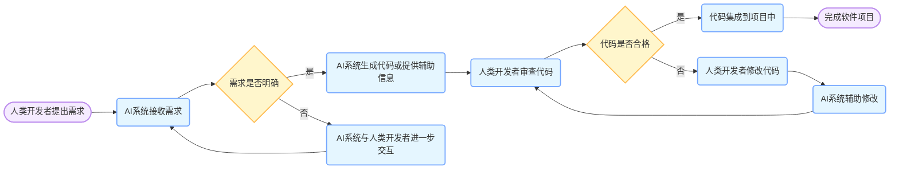

# AI与人类开发者的协作模式

> 关键词：AI、人类开发者、协作模式、软件开发、代码生成、智能辅助

> 摘要：本文深入探讨了AI与人类开发者的协作模式。首先介绍了该主题的背景，包括目的、预期读者、文档结构和相关术语。接着阐述了核心概念与联系，通过文本示意图和Mermaid流程图展示协作的原理和架构。详细讲解了核心算法原理及具体操作步骤，使用Python代码进行说明。给出了相关的数学模型和公式，并举例说明。通过项目实战案例，包括开发环境搭建、源代码实现和代码解读，展示了协作模式在实际中的应用。分析了实际应用场景，推荐了学习资源、开发工具框架和相关论文著作。最后总结了未来发展趋势与挑战，解答了常见问题，并提供了扩展阅读和参考资料，旨在为AI与人类开发者的有效协作提供全面的指导和深入的见解。

## 1. 背景介绍 
### 1.1 目的和范围
随着人工智能技术的飞速发展，AI在软件开发领域的应用越来越广泛。AI与人类开发者的协作模式成为了当前研究和实践的热点。本文的目的是全面探讨AI与人类开发者的各种协作模式，分析其优势和挑战，为开发者和相关研究人员提供有价值的参考。范围涵盖了从基础的概念原理到实际的项目应用，以及未来的发展趋势。

### 1.2 预期读者
本文的预期读者包括软件开发人员、人工智能研究人员、技术管理者、计算机科学专业的学生等。对于那些希望了解AI如何与人类开发者协同工作，提高软件开发效率和质量的人群具有重要的参考价值。

### 1.3 文档结构概述
本文将按照以下结构进行组织：首先介绍相关的核心概念和联系，包括协作的原理和架构；接着详细讲解核心算法原理和具体操作步骤；给出数学模型和公式并举例说明；通过项目实战案例展示协作模式的实际应用；分析实际应用场景；推荐学习资源、开发工具框架和相关论文著作；最后总结未来发展趋势与挑战，解答常见问题，并提供扩展阅读和参考资料。

### 1.4 术语表
#### 1.4.1 核心术语定义
- **AI（Artificial Intelligence）**：人工智能，指计算机系统能够执行通常需要人类智能才能完成的任务，如学习、推理、解决问题等。
- **人类开发者**：具备软件开发技能和知识，能够编写、测试和维护软件代码的专业人员。
- **协作模式**：AI与人类开发者在软件开发过程中相互配合、共同完成任务的方式。
- **代码生成**：AI根据用户的需求自动生成代码的过程。
- **智能辅助**：AI为人类开发者提供提示、建议、错误检查等辅助功能。

#### 1.4.2 相关概念解释
- **机器学习**：AI的一个分支，通过让计算机从数据中学习模式和规律，从而实现预测和决策。
- **自然语言处理**：使计算机能够理解和处理人类语言的技术，在AI与人类开发者的协作中用于理解用户的需求和指令。
- **软件开发流程**：包括需求分析、设计、编码、测试、维护等一系列阶段，AI与人类开发者的协作贯穿于整个流程。

#### 1.4.3 缩略词列表
- **ML（Machine Learning）**：机器学习
- **NLP（Natural Language Processing）**：自然语言处理
- **IDE（Integrated Development Environment）**：集成开发环境

## 2. 核心概念与联系 

### 核心概念原理
AI与人类开发者的协作模式基于两者的优势互补。人类开发者具有丰富的领域知识、创造力和判断力，能够理解复杂的业务需求，设计出合理的软件架构。而AI则具有强大的计算能力和数据处理能力，能够快速生成代码、进行代码分析和优化。

在协作过程中，人类开发者可以向AI提出需求，AI根据需求生成代码或提供辅助信息。人类开发者对AI生成的结果进行审查和修改，确保代码的质量和符合业务需求。同时，AI也可以通过学习人类开发者的行为和反馈，不断提高自身的性能和准确性。

### 架构的文本示意图
以下是AI与人类开发者协作模式的架构示意图：

人类开发者 <-> 需求交互 <-> AI系统
    |                          |
    |                          |
    | 代码审查与修改           | 代码生成与辅助
    |                          |
    |                          |
软件项目

人类开发者通过需求交互界面向AI系统提出软件开发的需求。AI系统根据需求生成代码或提供辅助信息，如代码提示、错误检查等。人类开发者对AI生成的代码进行审查和修改，确保代码的质量和符合业务需求。最终，双方共同完成软件项目的开发。

### Mermaid流程图


该流程图展示了AI与人类开发者协作的主要流程。首先，人类开发者提出需求，AI系统接收需求并判断需求是否明确。如果需求明确，AI系统生成代码或提供辅助信息；如果需求不明确，AI系统与人类开发者进一步交互。人类开发者对AI生成的代码进行审查，判断代码是否合格。如果代码合格，将代码集成到项目中；如果代码不合格，人类开发者进行修改，AI系统提供辅助。最终完成软件项目的开发。

## 3. 核心算法原理 & 具体操作步骤 

### 核心算法原理
在AI与人类开发者的协作中，常用的算法包括机器学习算法和自然语言处理算法。

#### 机器学习算法
机器学习算法用于训练AI模型，使其能够根据输入的需求生成代码或提供辅助信息。常见的机器学习算法包括神经网络、决策树、支持向量机等。

以神经网络为例，神经网络是一种模仿人类神经系统的计算模型，由多个神经元组成。在代码生成任务中，神经网络可以学习大量的代码数据，建立输入需求与输出代码之间的映射关系。当接收到新的需求时，神经网络可以根据学习到的映射关系生成相应的代码。

#### 自然语言处理算法
自然语言处理算法用于理解人类开发者提出的需求。常见的自然语言处理算法包括词法分析、句法分析、语义分析等。

词法分析将输入的文本分解为单词或词组，句法分析分析单词之间的语法关系，语义分析理解文本的含义。通过这些算法，AI系统可以准确地理解人类开发者的需求，并生成相应的代码或提供辅助信息。

### 具体操作步骤
以下是AI与人类开发者协作的具体操作步骤：

#### 步骤1：需求提出
人类开发者通过自然语言或特定的需求描述语言向AI系统提出软件开发的需求。需求可以包括功能需求、性能需求、界面需求等。

#### 步骤2：需求理解
AI系统使用自然语言处理算法对人类开发者提出的需求进行理解。首先进行词法分析，将需求文本分解为单词或词组；然后进行句法分析，分析单词之间的语法关系；最后进行语义分析，理解需求的含义。

#### 步骤3：代码生成或辅助信息提供
根据需求理解的结果，AI系统使用机器学习算法生成代码或提供辅助信息。如果是代码生成任务，AI系统可以根据学习到的代码模式和规则，生成符合需求的代码。如果是辅助信息提供任务，AI系统可以提供代码提示、错误检查、性能优化建议等。

#### 步骤4：代码审查与修改
人类开发者对AI系统生成的代码或提供的辅助信息进行审查。如果代码符合需求且质量合格，人类开发者可以将代码集成到项目中；如果代码存在问题，人类开发者可以对代码进行修改，AI系统可以提供辅助修改的信息。

#### 步骤5：反馈与学习
人类开发者对AI系统的输出结果进行反馈，AI系统根据反馈信息进行学习和优化。通过不断的反馈和学习，AI系统的性能和准确性将不断提高。

### Python源代码示例
以下是一个简单的Python代码示例，演示了AI与人类开发者协作的过程。假设我们要实现一个简单的加法函数，人类开发者提出需求，AI系统生成代码。

```python
import random

# 模拟AI系统
class AISystem:
    def generate_code(self,需求):
        if "加法函数" in 需求:
            code = """
def add(a, b):
    return a + b
"""
            return code
        else:
            return None

# 模拟人类开发者
class HumanDeveloper:
    def __init__(self):
        self.ai = AISystem()

    def propose_requirement(self,需求):
        code = self.ai.generate_code(需求)
        if code:
            print("AI生成的代码：")
            print(code)
            # 模拟代码审查
            if self.review_code(code):
                print("代码审查通过，集成到项目中。")
            else:
                print("代码审查不通过，进行修改。")
        else:
            print("AI无法根据需求生成代码。")

    def review_code(self, code):
        # 简单模拟代码审查，随机返回通过或不通过
        return random.choice([True, False])

# 人类开发者提出需求
developer = HumanDeveloper()
需求 = "实现一个加法函数"
developer.propose_requirement(需求)
```

在这个示例中，`AISystem`类模拟了AI系统，`generate_code`方法根据需求生成代码。`HumanDeveloper`类模拟了人类开发者，`propose_requirement`方法提出需求并调用AI系统生成代码，`review_code`方法模拟代码审查。最后，人类开发者提出需求并进行代码审查。

## 4. 数学模型和公式 & 详细讲解 & 举例说明 

### 数学模型
在AI与人类开发者的协作中，常用的数学模型包括概率模型、优化模型等。

#### 概率模型
概率模型用于描述事件发生的概率。在代码生成任务中，概率模型可以用于计算生成某个代码片段的概率。例如，在神经网络中，每个神经元的输出可以看作是一个概率值，表示该神经元激活的概率。

#### 优化模型
优化模型用于寻找最优解。在AI与人类开发者的协作中，优化模型可以用于优化代码的性能、提高代码的质量等。例如，在代码优化任务中，可以使用优化算法寻找最优的代码结构和参数。

### 数学公式
#### 概率模型公式
在概率模型中，常用的公式包括贝叶斯公式：

$$P(A|B) = \frac{P(B|A)P(A)}{P(B)}$$

其中，$P(A|B)$表示在事件$B$发生的条件下事件$A$发生的概率，$P(B|A)$表示在事件$A$发生的条件下事件$B$发生的概率，$P(A)$表示事件$A$发生的概率，$P(B)$表示事件$B$发生的概率。

#### 优化模型公式
在优化模型中，常用的公式包括梯度下降法：

$$\theta_{t+1} = \theta_t - \alpha \nabla J(\theta_t)$$

其中，$\theta_{t+1}$表示第$t+1$次迭代的参数值，$\theta_t$表示第$t$次迭代的参数值，$\alpha$表示学习率，$\nabla J(\theta_t)$表示损失函数$J(\theta_t)$的梯度。

### 详细讲解
#### 贝叶斯公式讲解
贝叶斯公式是概率模型中的一个重要公式，用于根据已知的条件概率和先验概率计算后验概率。在代码生成任务中，可以使用贝叶斯公式计算生成某个代码片段的概率。例如，假设我们已经学习了大量的代码数据，知道在某个需求下生成某个代码片段的条件概率$P(代码片段|需求)$，以及该需求出现的先验概率$P(需求)$，那么可以使用贝叶斯公式计算在该需求下生成该代码片段的后验概率$P(代码片段|需求)$。

#### 梯度下降法讲解
梯度下降法是优化模型中的一个重要算法，用于寻找损失函数的最小值。在代码优化任务中，可以使用梯度下降法优化代码的参数，使得代码的性能达到最优。例如，在神经网络中，可以使用梯度下降法更新神经元的权重和偏置，使得神经网络的输出与期望输出之间的误差最小。

### 举例说明
#### 贝叶斯公式举例
假设我们要根据用户的需求生成代码，已知在需求$A$下生成代码片段$B$的条件概率$P(B|A) = 0.8$，需求$A$出现的先验概率$P(A) = 0.2$，代码片段$B$出现的概率$P(B) = 0.3$。那么根据贝叶斯公式，可以计算在需求$A$下生成代码片段$B$的后验概率：

$$P(B|A) = \frac{P(B|A)P(A)}{P(B)} = \frac{0.8 \times 0.2}{0.3} \approx 0.53$$

#### 梯度下降法举例
假设我们要优化一个简单的线性回归模型$y = wx + b$，其中$w$和$b$是模型的参数。损失函数可以定义为均方误差：

$$J(w, b) = \frac{1}{n} \sum_{i=1}^{n} (y_i - (wx_i + b))^2$$

其中，$n$是样本数量，$y_i$是第$i$个样本的真实值，$x_i$是第$i$个样本的特征值。

使用梯度下降法更新参数$w$和$b$的公式为：

$$w_{t+1} = w_t - \alpha \frac{\partial J(w_t, b_t)}{\partial w}$$

$$b_{t+1} = b_t - \alpha \frac{\partial J(w_t, b_t)}{\partial b}$$

其中，$\alpha$是学习率。

以下是一个简单的Python代码示例，演示了梯度下降法的应用：

```python
import numpy as np

# 生成样本数据
x = np.array([1, 2, 3, 4, 5])
y = np.array([2, 4, 6, 8, 10])

# 初始化参数
w = 0
b = 0

# 学习率
alpha = 0.01

# 迭代次数
epochs = 1000

# 梯度下降法
for epoch in range(epochs):
    # 计算预测值
    y_pred = w * x + b

    # 计算损失函数的梯度
    dw = (1 / len(x)) * np.sum((y_pred - y) * x)
    db = (1 / len(x)) * np.sum(y_pred - y)

    # 更新参数
    w = w - alpha * dw
    b = b - alpha * db

# 输出优化后的参数
print("优化后的参数：w =", w, "b =", b)
```

在这个示例中，我们使用梯度下降法优化线性回归模型的参数$w$和$b$。通过不断迭代，损失函数的值逐渐减小，最终得到最优的参数值。

## 5. 项目实战：代码实际案例和详细解释说明 

### 5.1  开发环境搭建
在进行AI与人类开发者协作的项目实战之前，需要搭建相应的开发环境。以下是一些常用的开发环境搭建步骤：

#### 安装Python
Python是一种常用的编程语言，在AI和软件开发领域广泛应用。可以从Python官方网站（https://www.python.org/downloads/）下载并安装Python。

#### 安装开发工具
推荐使用集成开发环境（IDE）来进行开发，如PyCharm、Visual Studio Code等。这些IDE提供了代码编辑、调试、版本控制等功能，方便开发者进行开发。

#### 安装相关库
在AI与人类开发者的协作中，需要使用一些相关的库，如TensorFlow、PyTorch、NLTK等。可以使用pip命令来安装这些库：

```sh
pip install tensorflow
pip install torch
pip install nltk
```

### 5.2  源代码详细实现和代码解读
以下是一个实际的项目案例，实现一个简单的文本分类系统，AI与人类开发者协作完成该项目。

#### 需求分析
人类开发者提出需求：实现一个文本分类系统，将输入的文本分为不同的类别。

#### 数据准备
人类开发者准备数据集，包括文本数据和对应的类别标签。以下是一个简单的数据集示例：

```python
data = [
    ("这是一个关于体育的新闻", "体育"),
    ("科技公司发布了新的产品", "科技"),
    ("美食节吸引了很多人", "美食"),
    ("足球比赛非常精彩", "体育")
]

# 划分训练集和测试集
train_data = data[:3]
test_data = data[3:]
```

#### 模型训练
AI系统使用机器学习算法训练文本分类模型。这里使用朴素贝叶斯算法作为示例：

```python
import nltk
from nltk.corpus import stopwords
from nltk.tokenize import word_tokenize
from sklearn.feature_extraction.text import CountVectorizer
from sklearn.naive_bayes import MultinomialNB

# 下载停用词
nltk.download('stopwords')
nltk.download('punkt')

# 定义停用词
stop_words = set(stopwords.words('chinese'))

# 数据预处理
def preprocess_text(text):
    tokens = word_tokenize(text)
    filtered_tokens = [token for token in tokens if token not in stop_words]
    return " ".join(filtered_tokens)

# 提取特征
train_texts = [preprocess_text(text) for text, _ in train_data]
train_labels = [label for _, label in train_data]

vectorizer = CountVectorizer()
X_train = vectorizer.fit_transform(train_texts)

# 训练模型
model = MultinomialNB()
model.fit(X_train, train_labels)
```

#### 模型评估
人类开发者对训练好的模型进行评估，使用测试集数据：

```python
test_texts = [preprocess_text(text) for text, _ in test_data]
test_labels = [label for _, label in test_data]

X_test = vectorizer.transform(test_texts)
predictions = model.predict(X_test)

# 计算准确率
accuracy = sum(predictions == test_labels) / len(test_labels)
print("模型准确率：", accuracy)
```

#### 代码解读
- **数据准备**：人类开发者准备数据集，并将其划分为训练集和测试集。
- **数据预处理**：使用NLTK库进行文本分词和停用词过滤，将文本转换为适合机器学习模型处理的格式。
- **特征提取**：使用`CountVectorizer`将文本转换为词频矩阵，作为模型的输入特征。
- **模型训练**：使用朴素贝叶斯算法训练文本分类模型。
- **模型评估**：人类开发者使用测试集数据对训练好的模型进行评估，计算模型的准确率。

### 5.3  代码解读与分析
#### 优点
- **提高开发效率**：AI系统可以自动完成数据预处理、特征提取和模型训练等任务，减少了人类开发者的工作量，提高了开发效率。
- **提高模型性能**：AI系统可以使用先进的机器学习算法和技术，提高模型的性能和准确性。
- **知识互补**：人类开发者具有丰富的领域知识和判断力，可以对AI系统的输出结果进行审查和修改，确保模型的质量和符合业务需求。

#### 挑战
- **数据质量问题**：AI系统的性能和准确性很大程度上依赖于数据的质量。如果数据存在噪声、偏差或缺失值，会影响模型的训练和评估结果。
- **模型解释性问题**：一些复杂的机器学习模型，如神经网络，具有较高的预测性能，但缺乏解释性。人类开发者可能难以理解模型的决策过程和结果。
- **协作成本问题**：AI与人类开发者的协作需要一定的沟通和协调成本。双方需要明确各自的职责和任务，建立有效的协作机制。

## 6. 实际应用场景 
### 代码生成
AI可以根据人类开发者的需求自动生成代码。例如，在开发Web应用程序时，AI可以根据用户的需求生成HTML、CSS和JavaScript代码。在开发移动应用程序时，AI可以根据用户的需求生成Java、Python或Swift代码。

### 代码审查与优化
AI可以对人类开发者编写的代码进行审查和优化。例如，AI可以检查代码中的语法错误、逻辑错误和安全漏洞，提供代码优化建议，如提高代码的性能、减少代码的复杂度等。

### 需求分析与设计
AI可以帮助人类开发者进行需求分析和设计。例如，AI可以对用户的需求进行理解和分析，生成需求规格说明书和软件设计文档。AI还可以提供设计建议，如界面设计、数据库设计等。

### 测试与调试
AI可以辅助人类开发者进行软件测试和调试。例如，AI可以自动生成测试用例，执行测试任务，发现软件中的缺陷和问题。AI还可以提供调试建议，帮助人类开发者快速定位和解决问题。

### 智能辅助开发
AI可以为人类开发者提供智能辅助开发功能。例如，AI可以在代码编辑器中提供代码提示、自动补全、语法检查等功能，提高开发效率。AI还可以根据开发者的历史行为和偏好，提供个性化的开发建议和推荐。

## 7. 工具和资源推荐
### 7.1 学习资源推荐
#### 7.1.1 书籍推荐
- 《人工智能：一种现代方法》：全面介绍了人工智能的基本概念、算法和应用，是人工智能领域的经典教材。
- 《Python机器学习》：详细介绍了Python在机器学习领域的应用，包括数据预处理、模型训练、模型评估等内容。
- 《自然语言处理入门》：介绍了自然语言处理的基本概念、算法和应用，适合初学者学习。

#### 7.1.2 在线课程
- Coursera上的“机器学习”课程：由斯坦福大学教授Andrew Ng主讲，是机器学习领域的经典课程。
- edX上的“人工智能基础”课程：介绍了人工智能的基本概念、算法和应用，适合初学者学习。
- 中国大学MOOC上的“自然语言处理”课程：介绍了自然语言处理的基本概念、算法和应用，适合初学者学习。

#### 7.1.3 技术博客和网站
- 机器之心：提供人工智能领域的最新技术动态、研究成果和应用案例。
- 开源中国：提供开源软件的介绍、下载和使用教程，是开发者的重要资源平台。
- 知乎：提供人工智能领域的讨论和交流平台，开发者可以在这里获取最新的技术信息和经验分享。

### 7.2 开发工具框架推荐
#### 7.2.1 IDE和编辑器
- PyCharm：一款专门为Python开发设计的集成开发环境，提供了代码编辑、调试、版本控制等功能。
- Visual Studio Code：一款轻量级的代码编辑器，支持多种编程语言，具有丰富的插件和扩展功能。
- Jupyter Notebook：一款交互式的开发环境，适合进行数据探索、模型训练和可视化等任务。

#### 7.2.2 调试和性能分析工具
- Py-Spy：一款用于Python代码性能分析的工具，可以帮助开发者找出代码中的性能瓶颈。
- PDB：Python自带的调试工具，可以帮助开发者调试代码中的错误。
- TensorBoard：TensorFlow提供的可视化工具，可以帮助开发者可视化模型的训练过程和性能指标。

#### 7.2.3 相关框架和库
- TensorFlow：一款开源的机器学习框架，提供了丰富的机器学习算法和工具，支持分布式训练和部署。
- PyTorch：一款开源的深度学习框架，具有动态图特性，适合进行研究和开发。
- NLTK：一款开源的自然语言处理库，提供了丰富的自然语言处理工具和数据集，适合进行自然语言处理任务。

### 7.3 相关论文著作推荐
#### 7.3.1 经典论文
- “Attention Is All You Need”：介绍了Transformer模型，是自然语言处理领域的经典论文。
- “ImageNet Classification with Deep Convolutional Neural Networks”：介绍了AlexNet模型，是计算机视觉领域的经典论文。
- “Learning Representations by Back-propagating Errors”：介绍了反向传播算法，是神经网络领域的经典论文。

#### 7.3.2 最新研究成果
- arXiv：一个预印本平台，提供了人工智能领域的最新研究成果和论文。
- NeurIPS：人工智能领域的顶级学术会议，每年都会发布大量的最新研究成果和论文。
- ICML：机器学习领域的顶级学术会议，每年都会发布大量的最新研究成果和论文。

#### 7.3.3 应用案例分析
- KDnuggets：提供人工智能领域的应用案例分析和实践经验分享，帮助开发者了解人工智能在实际应用中的挑战和解决方案。
- Towards Data Science：提供数据科学和人工智能领域的应用案例分析和实践经验分享，帮助开发者了解人工智能在实际应用中的挑战和解决方案。

## 8. 总结：未来发展趋势与挑战
### 未来发展趋势
- **更深入的协作**：AI与人类开发者的协作将更加深入，从简单的代码生成和辅助，到更复杂的需求分析、设计和决策。
- **个性化的协作**：AI将根据人类开发者的历史行为和偏好，提供个性化的协作服务，提高开发效率和质量。
- **跨领域的协作**：AI与人类开发者的协作将跨越不同的领域，如医疗、金融、交通等，为各个领域的软件开发带来新的机遇和挑战。
- **智能开发环境**：未来的开发环境将更加智能化，集成AI技术，提供智能代码提示、自动补全、错误检查等功能，提高开发效率和质量。

### 挑战
- **数据隐私和安全问题**：AI与人类开发者的协作需要大量的数据支持，如何保护数据的隐私和安全是一个重要的挑战。
- **伦理和法律问题**：AI的应用可能会带来一些伦理和法律问题，如算法歧视、责任认定等，需要制定相应的伦理和法律规范。
- **技术人才短缺**：AI与人类开发者的协作需要具备跨学科知识和技能的技术人才，目前这类人才短缺，需要加强培养和引进。
- **人机信任问题**：人类开发者对AI的信任是协作的基础，如何建立和维护人机信任是一个重要的挑战。

## 9. 附录：常见问题与解答
### 问题1：AI能否完全替代人类开发者？
解答：目前AI还不能完全替代人类开发者。虽然AI在代码生成、代码审查等方面具有一定的优势，但人类开发者具有丰富的领域知识、创造力和判断力，能够理解复杂的业务需求，设计出合理的软件架构。AI与人类开发者的协作是一种优势互补的模式，双方共同完成软件开发任务。

### 问题2：AI生成的代码质量如何保证？
解答：AI生成的代码质量可以通过以下方式保证：
- **人类开发者审查**：人类开发者对AI生成的代码进行审查和修改，确保代码的质量和符合业务需求。
- **代码测试**：对AI生成的代码进行全面的测试，包括单元测试、集成测试、系统测试等，发现和解决代码中的问题。
- **模型优化**：通过不断的训练和优化AI模型，提高模型的性能和准确性，从而提高代码生成的质量。

### 问题3：如何选择适合的AI工具和框架？
解答：选择适合的AI工具和框架需要考虑以下因素：
- **应用场景**：根据具体的应用场景选择合适的工具和框架，如自然语言处理任务可以选择NLTK、TensorFlow等，计算机视觉任务可以选择OpenCV、PyTorch等。
- **性能和效率**：考虑工具和框架的性能和效率，选择能够满足项目需求的工具和框架。
- **易用性和学习成本**：选择易用性好、学习成本低的工具和框架，降低开发难度和成本。
- **社区支持**：选择社区支持好的工具和框架，方便获取技术支持和资源。

### 问题4：AI与人类开发者的协作模式会对就业市场产生什么影响？
解答：AI与人类开发者的协作模式会对就业市场产生一定的影响。一方面，AI的应用会提高软件开发的效率和质量，减少一些重复性的工作，可能会导致部分岗位的需求减少。另一方面，AI与人类开发者的协作也会创造一些新的岗位，如AI工程师、数据科学家、人机协作设计师等。因此，开发者需要不断学习和提升自己的技能，适应技术的发展和变化。

## 10. 扩展阅读 & 参考资料
### 扩展阅读
- 《AI未来进行式》：探讨了AI在各个领域的应用和发展趋势，以及对人类社会的影响。
- 《智能时代》：介绍了智能时代的特点和发展趋势，以及如何在智能时代中生存和发展。
- 《第四次工业革命》：探讨了第四次工业革命的特点和影响，以及如何应对第四次工业革命带来的挑战和机遇。

### 参考资料
- 《人工智能：一种现代方法》（第3版），Stuart J. Russell, Peter Norvig著
- 《Python机器学习》（第3版），Sebastian Raschka, Vahid Mirjalili著
- 《自然语言处理入门》，何晗著
- TensorFlow官方文档：https://www.tensorflow.org/
- PyTorch官方文档：https://pytorch.org/
- NLTK官方文档：https://www.nltk.org/