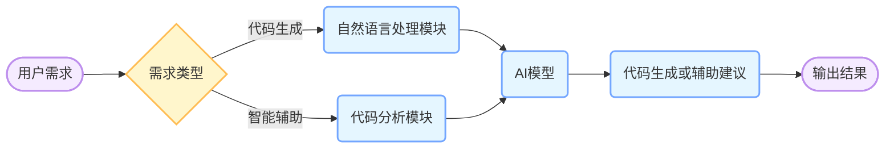

# AI与编程的协作：新生态的形成

> 关键词：AI、编程、协作、新生态、代码生成、智能辅助、软件开发

> 摘要：本文深入探讨了AI与编程协作所形成的新生态。首先介绍了该主题的背景信息，包括目的、预期读者等内容。接着阐述了AI与编程协作的核心概念及联系，详细讲解了相关的核心算法原理和具体操作步骤，并结合数学模型和公式进行分析。通过项目实战案例，展示了AI与编程协作在实际中的应用。还介绍了其实际应用场景，推荐了相关的工具和资源。最后对未来发展趋势与挑战进行总结，同时提供常见问题解答和扩展阅读参考资料，旨在全面剖析AI与编程协作新生态的形成及其重要意义。

## 1. 背景介绍 
### 1.1 目的和范围
随着人工智能技术的飞速发展，其与编程领域的融合日益紧密，形成了一种全新的生态系统。本文的目的在于深入探讨AI与编程协作的各个方面，包括其核心概念、算法原理、实际应用等，全面展现这一新兴生态的面貌。范围涵盖了从基础理论到实际项目应用，从技术原理到未来发展趋势的全方位内容，旨在为读者提供一个全面且深入的关于AI与编程协作新生态的知识体系。

### 1.2 预期读者
本文预期读者包括但不限于程序员、软件开发者、人工智能研究人员、计算机科学专业的学生以及对AI和编程领域感兴趣的技术爱好者。对于程序员和软件开发者，可从中获取如何利用AI提升编程效率和质量的实用技巧；人工智能研究人员能了解到AI在编程领域的应用现状和前沿方向；计算机科学专业学生可作为学习参考资料，拓宽专业视野；技术爱好者则能通过本文对AI与编程协作的新生态有一个初步的认识和了解。

### 1.3 文档结构概述
本文共分为十个部分。第一部分为背景介绍，阐述了文章的目的、预期读者、文档结构概述和术语表；第二部分讲解核心概念与联系，通过文本示意图和Mermaid流程图展示AI与编程协作的原理和架构；第三部分详细介绍核心算法原理和具体操作步骤，并给出Python源代码示例；第四部分分析数学模型和公式，并举例说明；第五部分通过项目实战，介绍开发环境搭建、源代码实现和代码解读；第六部分介绍实际应用场景；第七部分推荐相关的工具和资源，包括学习资源、开发工具框架和相关论文著作；第八部分总结未来发展趋势与挑战；第九部分为附录，提供常见问题与解答；第十部分列出扩展阅读和参考资料。

### 1.4 术语表
#### 1.4.1 核心术语定义
- **AI（Artificial Intelligence）**：即人工智能，是研究、开发用于模拟、延伸和扩展人的智能的理论、方法、技术及应用系统的一门新的技术科学。
- **编程（Programming）**：是指使用特定的程序设计语言，按照一定的规则和方法，编写计算机能够理解和执行的指令序列的过程。
- **代码生成（Code Generation）**：指利用AI技术自动生成符合特定需求的代码的过程。
- **智能辅助编程（Intelligent Programming Assistance）**：借助AI技术为程序员在编程过程中提供智能提示、错误检查、代码优化等辅助功能。
- **新生态（New Ecosystem）**：指AI与编程相互融合、相互促进所形成的一种全新的技术生态系统，包括技术、人员、应用场景等多个方面。

#### 1.4.2 相关概念解释
- **机器学习（Machine Learning）**：是AI的一个重要分支，它使计算机能够通过数据学习模式和规律，从而进行预测和决策。在编程中，机器学习可用于代码分类、代码推荐等任务。
- **自然语言处理（Natural Language Processing，NLP）**：是AI的另一个重要领域，主要研究如何让计算机理解和处理人类语言。在AI与编程协作中，NLP可用于将自然语言描述转换为代码。
- **深度学习（Deep Learning）**：是机器学习的一种特殊形式，通过构建深度神经网络来学习数据的复杂特征。在编程中，深度学习可用于代码生成和代码理解等任务。

#### 1.4.3 缩略词列表
- **AI**：Artificial Intelligence（人工智能）
- **NLP**：Natural Language Processing（自然语言处理）
- **ML**：Machine Learning（机器学习）
- **DL**：Deep Learning（深度学习）

## 2. 核心概念与联系 

### 核心概念原理
AI与编程的协作是基于人工智能技术在编程领域的应用，旨在提高编程效率、提升代码质量、降低编程门槛。其核心原理主要涉及以下几个方面：

#### 代码理解
AI系统通过对大量代码的学习和分析，能够理解代码的结构、功能和语义。它可以识别代码中的变量、函数、类等元素，以及它们之间的关系。例如，通过语法分析和语义分析，AI可以判断一个函数的输入输出参数、功能实现等。

#### 代码生成
基于对代码的理解和学习，AI可以根据用户的需求自动生成代码。用户可以通过自然语言描述需求，AI将其转换为相应的代码。例如，用户输入“创建一个简单的Python函数，用于计算两个数的和”，AI可以生成如下代码：
```python
def add_numbers(a, b):
    return a + b
```

#### 智能辅助
AI可以在编程过程中为程序员提供智能提示、错误检查、代码优化等辅助功能。例如，当程序员输入代码时，AI可以根据上下文提供代码补全建议；当代码存在语法错误或逻辑错误时，AI可以及时提醒并给出修正建议；AI还可以对代码进行性能分析，提出优化方案。

### 架构的文本示意图
AI与编程协作的架构主要包括以下几个部分：

#### 数据层
包含大量的代码数据，这些数据来自开源代码库、代码仓库等。数据层为AI模型的训练提供了丰富的素材。

#### 模型层
包括各种AI模型，如深度学习模型、机器学习模型等。这些模型通过对数据层的代码数据进行学习和训练，掌握代码的特征和规律。

#### 应用层
将训练好的AI模型应用于编程领域，实现代码生成、智能辅助等功能。应用层可以集成到编程开发环境中，为程序员提供便捷的服务。

#### 用户层
即程序员和开发者，他们通过应用层与AI系统进行交互，使用AI提供的各种功能。

### Mermaid流程图


## 3. 核心算法原理 & 具体操作步骤 

### 核心算法原理
在AI与编程协作中，常用的核心算法包括深度学习算法和机器学习算法。下面以深度学习中的Transformer模型为例，介绍其在代码生成中的应用原理。

#### Transformer模型原理
Transformer模型是一种基于注意力机制的深度学习模型，它通过多头自注意力机制来捕捉序列中元素之间的依赖关系。在代码生成任务中，Transformer模型可以学习代码的上下文信息，从而生成合理的代码。

Transformer模型主要由编码器和解码器两部分组成。编码器将输入的代码序列转换为一系列的特征表示，解码器根据编码器的输出和之前生成的代码，逐步生成新的代码。

#### Python源代码示例
以下是一个使用Hugging Face的Transformers库实现简单代码生成的示例：
```python
from transformers import AutoTokenizer, AutoModelForCausalLM

# 加载预训练的代码生成模型和分词器
tokenizer = AutoTokenizer.from_pretrained("Salesforce/codegen-350M-mono")
model = AutoModelForCausalLM.from_pretrained("Salesforce/codegen-350M-mono")

# 定义输入的自然语言描述
input_text = "创建一个简单的Python函数，用于计算两个数的和"

# 将输入文本转换为模型可接受的输入格式
input_ids = tokenizer(input_text, return_tensors="pt").input_ids

# 生成代码
output = model.generate(input_ids, max_length=100, num_beams=5, no_repeat_ngram_size=2)

# 将生成的代码转换为文本
generated_code = tokenizer.decode(output[0], skip_special_tokens=True)

print(generated_code)
```

### 具体操作步骤
#### 数据准备
收集大量的代码数据，并进行预处理，包括代码清洗、分词等操作。

#### 模型训练
使用准备好的数据对Transformer模型进行训练，调整模型的参数，使其能够学习到代码的特征和规律。

#### 模型部署
将训练好的模型部署到应用环境中，提供代码生成和智能辅助等服务。

#### 用户交互
用户通过输入自然语言描述或编写代码，与AI系统进行交互，获取代码生成或智能辅助建议。

## 4. 数学模型和公式 & 详细讲解 & 举例说明 

### 数学模型和公式
在Transformer模型中，核心的数学模型是多头自注意力机制。多头自注意力机制的计算公式如下：

#### 自注意力机制
给定输入序列 $X = [x_1, x_2, ..., x_n]$，其中 $x_i$ 表示序列中的第 $i$ 个元素。自注意力机制通过以下步骤计算注意力分数：

1. 计算查询（Query）、键（Key）和值（Value）矩阵：
   $$Q = XW^Q$$
   $$K = XW^K$$
   $$V = XW^V$$
   其中 $W^Q$、$W^K$ 和 $W^V$ 是可学习的权重矩阵。

2. 计算注意力分数：
   $$Attention(Q, K, V) = \text{softmax}(\frac{QK^T}{\sqrt{d_k}})V$$
   其中 $d_k$ 是查询和键的维度。

#### 多头自注意力机制
多头自注意力机制将自注意力机制重复多次，然后将结果拼接起来：
$$MultiHead(Q, K, V) = \text{Concat}(head_1, head_2, ..., head_h)W^O$$
其中 $head_i = Attention(QW_i^Q, KW_i^K, VW_i^V)$，$W_i^Q$、$W_i^K$、$W_i^V$ 和 $W^O$ 是可学习的权重矩阵，$h$ 是头的数量。

### 详细讲解
自注意力机制的核心思想是计算输入序列中每个元素与其他元素之间的相关性，从而确定每个元素在生成输出时的重要性。通过将输入序列分别投影到查询、键和值矩阵中，然后计算查询和键之间的相似度，得到注意力分数。最后，根据注意力分数对值矩阵进行加权求和，得到输出。

多头自注意力机制通过多个不同的头来捕捉输入序列中不同方面的信息，从而提高模型的表达能力。每个头可以学习到不同的注意力模式，将它们的结果拼接起来可以得到更丰富的特征表示。

### 举例说明
假设我们有一个输入序列 $X = [x_1, x_2, x_3]$，其中 $x_i$ 是一个3维向量。我们将 $X$ 投影到查询、键和值矩阵中：
$$Q = XW^Q = \begin{bmatrix} x_1 \\ x_2 \\ x_3 \end{bmatrix} \begin{bmatrix} 1 & 0 & 0 \\ 0 & 1 & 0 \\ 0 & 0 & 1 \end{bmatrix} = \begin{bmatrix} x_1 \\ x_2 \\ x_3 \end{bmatrix}$$
$$K = XW^K = \begin{bmatrix} x_1 \\ x_2 \\ x_3 \end{bmatrix} \begin{bmatrix} 1 & 0 & 0 \\ 0 & 1 & 0 \\ 0 & 0 & 1 \end{bmatrix} = \begin{bmatrix} x_1 \\ x_2 \\ x_3 \end{bmatrix}$$
$$V = XW^V = \begin{bmatrix} x_1 \\ x_2 \\ x_3 \end{bmatrix} \begin{bmatrix} 1 & 0 & 0 \\ 0 & 1 & 0 \\ 0 & 0 & 1 \end{bmatrix} = \begin{bmatrix} x_1 \\ x_2 \\ x_3 \end{bmatrix}$$

然后计算注意力分数：
$$Attention(Q, K, V) = \text{softmax}(\frac{QK^T}{\sqrt{d_k}})V$$
假设 $d_k = 3$，则：
$$\frac{QK^T}{\sqrt{d_k}} = \frac{1}{\sqrt{3}} \begin{bmatrix} x_1 \cdot x_1 & x_1 \cdot x_2 & x_1 \cdot x_3 \\ x_2 \cdot x_1 & x_2 \cdot x_2 & x_2 \cdot x_3 \\ x_3 \cdot x_1 & x_3 \cdot x_2 & x_3 \cdot x_3 \end{bmatrix}$$
对其进行softmax操作，得到注意力分数矩阵。最后，根据注意力分数矩阵对值矩阵进行加权求和，得到输出。

## 5. 项目实战：代码实际案例和详细解释说明 

### 5.1  开发环境搭建
#### 安装Python
首先，确保你已经安装了Python 3.x版本。可以从Python官方网站（https://www.python.org/downloads/）下载并安装。

#### 安装必要的库
使用pip命令安装Hugging Face的Transformers库和其他相关库：
```sh
pip install transformers torch
```

### 5.2  源代码详细实现和代码解读
以下是一个完整的代码生成项目示例：
```python
from transformers import AutoTokenizer, AutoModelForCausalLM

# 加载预训练的代码生成模型和分词器
tokenizer = AutoTokenizer.from_pretrained("Salesforce/codegen-350M-mono")
model = AutoModelForCausalLM.from_pretrained("Salesforce/codegen-350M-mono")

# 定义输入的自然语言描述
input_text = "创建一个Python类，用于表示一个矩形，包含计算面积和周长的方法"

# 将输入文本转换为模型可接受的输入格式
input_ids = tokenizer(input_text, return_tensors="pt").input_ids

# 生成代码
output = model.generate(input_ids, max_length=200, num_beams=5, no_repeat_ngram_size=2)

# 将生成的代码转换为文本
generated_code = tokenizer.decode(output[0], skip_special_tokens=True)

print(generated_code)
```

#### 代码解读
1. **加载模型和分词器**：使用`AutoTokenizer.from_pretrained`和`AutoModelForCausalLM.from_pretrained`函数加载预训练的代码生成模型和分词器。
2. **定义输入文本**：用户通过自然语言描述需求，这里的需求是创建一个Python类来表示矩形，并包含计算面积和周长的方法。
3. **文本转换**：使用分词器将输入文本转换为模型可接受的输入格式，即张量（Tensor）。
4. **代码生成**：使用模型的`generate`方法生成代码，设置了最大长度、束搜索的束数和避免重复的n-gram大小等参数。
5. **代码解码**：使用分词器将生成的代码张量解码为文本。
6. **输出结果**：打印生成的代码。

### 5.3  代码解读与分析
#### 优点
- **高效性**：通过AI自动生成代码，可以大大提高编程效率，减少手动编写代码的工作量。
- **准确性**：预训练的模型经过大量数据的训练，能够生成较为准确的代码。
- **灵活性**：用户可以通过自然语言描述需求，模型可以根据需求生成相应的代码，具有较高的灵活性。

#### 局限性
- **语义理解不足**：模型可能无法完全理解用户的自然语言描述，导致生成的代码不符合预期。
- **代码质量问题**：生成的代码可能存在性能、可读性等方面的问题，需要人工进一步优化。
- **缺乏创造性**：模型生成的代码往往是基于已有的代码模式，缺乏创造性和创新性。

## 6. 实际应用场景 
### 快速原型开发
在软件开发的早期阶段，需要快速验证想法和概念。AI与编程的协作可以帮助开发者快速生成原型代码，节省时间和精力。例如，在开发一个新的移动应用时，开发者可以使用AI生成界面布局、数据处理等方面的代码，快速搭建起应用的雏形。

### 代码修复和优化
当代码出现错误或需要优化时，AI可以帮助开发者快速定位问题并提供解决方案。例如，AI可以检查代码中的语法错误、逻辑错误，并给出修正建议；还可以对代码进行性能分析，提出优化方案，提高代码的执行效率。

### 编程教育
在编程教育中，AI可以作为辅助工具，帮助学生更好地学习编程。例如，AI可以为学生提供代码示例、解释代码的工作原理、提供编程提示等，降低学习门槛，提高学习效果。

### 低代码/无代码开发
对于非专业程序员来说，使用传统的编程方式开发软件可能比较困难。AI与编程的协作可以实现低代码/无代码开发，用户只需要通过可视化界面或自然语言描述需求，AI就可以自动生成相应的代码，让更多的人能够参与到软件开发中来。

### 大规模代码库管理
在处理大规模代码库时，AI可以帮助开发者进行代码分类、代码搜索、代码推荐等操作。例如，AI可以根据代码的功能和结构对代码库进行分类，方便开发者快速找到所需的代码；还可以根据开发者的使用习惯和上下文信息，推荐相关的代码片段。

## 7. 工具和资源推荐
### 7.1 学习资源推荐
#### 7.1.1 书籍推荐
- 《深度学习》（Deep Learning）：由Ian Goodfellow、Yoshua Bengio和Aaron Courville撰写，是深度学习领域的经典教材，全面介绍了深度学习的理论和实践。
- 《Python机器学习》（Python Machine Learning）：由Sebastian Raschka和Vahid Mirjalili撰写，介绍了如何使用Python进行机器学习，包括各种机器学习算法的实现和应用。
- 《人工智能：一种现代的方法》（Artificial Intelligence: A Modern Approach）：由Stuart Russell和Peter Norvig撰写，是人工智能领域的权威教材，涵盖了人工智能的各个方面。

#### 7.1.2 在线课程
- Coursera上的“深度学习专项课程”（Deep Learning Specialization）：由Andrew Ng教授授课，包括深度学习的基础、卷积神经网络、循环神经网络等内容。
- edX上的“人工智能导论”（Introduction to Artificial Intelligence）：由麻省理工学院（MIT）提供，介绍了人工智能的基本概念、算法和应用。
- 网易云课堂上的“Python编程从入门到实践”：适合初学者学习Python编程，包括Python的基础语法、数据结构、函数等内容。

#### 7.1.3 技术博客和网站
- 掘金（https://juejin.cn/）：是一个面向开发者的技术社区，提供了大量的技术文章和教程，涵盖了AI、编程等多个领域。
- 博客园（https://www.cnblogs.com/）：是一个国内知名的技术博客平台，有很多开发者分享自己的技术经验和心得。
- Towards Data Science（https://towardsdatascience.com/）：是一个专注于数据科学和机器学习的技术博客，提供了很多高质量的技术文章和案例分析。

### 7.2 开发工具框架推荐
#### 7.2.1 IDE和编辑器
- PyCharm：是一款专门为Python开发设计的集成开发环境（IDE），提供了代码编辑、调试、版本控制等功能，适合专业Python开发者使用。
- Visual Studio Code：是一款轻量级的代码编辑器，支持多种编程语言，拥有丰富的插件生态系统，可以方便地进行AI和编程开发。
- Jupyter Notebook：是一个交互式的开发环境，适合进行数据探索、模型训练和代码演示，常用于AI和数据科学领域。

#### 7.2.2 调试和性能分析工具
- pdb：是Python自带的调试器，可以帮助开发者定位代码中的错误。
- cProfile：是Python的性能分析工具，可以分析代码的执行时间和函数调用次数，帮助开发者优化代码性能。
- TensorBoard：是TensorFlow的可视化工具，可以帮助开发者可视化模型的训练过程和性能指标。

#### 7.2.3 相关框架和库
- TensorFlow：是一个开源的深度学习框架，提供了丰富的工具和接口，方便开发者进行模型的构建、训练和部署。
- PyTorch：是另一个流行的深度学习框架，具有动态计算图的特点，适合快速原型开发和研究。
- Hugging Face Transformers：是一个用于自然语言处理的开源库，提供了大量的预训练模型和工具，方便开发者进行文本生成、文本分类等任务。

### 7.3 相关论文著作推荐
#### 7.3.1 经典论文
- “Attention Is All You Need”：介绍了Transformer模型的原理和架构，是深度学习领域的经典论文之一。
- “Generative Adversarial Networks”：提出了生成对抗网络（GAN）的概念，开创了生成式模型的新纪元。
- “Deep Residual Learning for Image Recognition”：提出了残差网络（ResNet）的概念，解决了深度学习中的梯度消失问题。

#### 7.3.2 最新研究成果
- 关注顶级学术会议如NeurIPS（神经信息处理系统大会）、ICML（国际机器学习会议）、ACL（计算语言学协会年会）等的最新论文，了解AI与编程领域的最新研究动态。
- 查阅相关学术期刊如Journal of Artificial Intelligence Research（JAIR）、Artificial Intelligence等的最新研究成果。

#### 7.3.3 应用案例分析
- 研究一些知名公司和机构在AI与编程协作方面的应用案例，如谷歌的代码智能助手、微软的GitHub Copilot等，了解它们的实现原理和应用效果。

## 8. 总结：未来发展趋势与挑战
### 未来发展趋势
#### 更强大的代码生成能力
未来的AI模型将具备更强大的代码生成能力，能够生成更加复杂、高质量的代码。模型将能够更好地理解用户的需求，生成的代码将更加符合实际应用的要求。

#### 深度融合的智能辅助编程
AI将与编程开发环境深度融合，提供更加智能、全面的辅助编程功能。例如，AI可以在代码编写过程中实时提供建议，自动完成代码的重构和优化，甚至可以根据项目的需求自动生成测试用例。

#### 跨语言和跨领域的协作
AI将能够支持更多的编程语言和领域，实现跨语言和跨领域的编程协作。例如，开发者可以使用自然语言描述需求，AI可以生成多种编程语言的代码，满足不同项目的需求。

#### 人机协作的新范式
未来的编程将不再是单纯的人类编程或AI编程，而是人机协作的新范式。人类程序员和AI将各自发挥优势，共同完成软件开发任务。例如，人类程序员负责创意和设计，AI负责代码生成和优化。

### 挑战
#### 伦理和法律问题
AI生成的代码可能存在版权、隐私等伦理和法律问题。例如，AI可能会生成与已有代码相似的代码，引发版权纠纷；AI在处理用户数据时，可能会泄露用户的隐私信息。

#### 安全风险
AI生成的代码可能存在安全漏洞，被恶意利用。例如，AI可能会生成包含安全隐患的代码，如SQL注入、跨站脚本攻击等，给系统带来安全风险。

#### 技术瓶颈
目前的AI技术在语义理解、代码质量等方面还存在一定的瓶颈。例如，AI可能无法完全理解用户的自然语言描述，生成的代码可能存在逻辑错误或性能问题。

#### 人才短缺
AI与编程协作需要既懂AI又懂编程的复合型人才，目前这类人才相对短缺。培养和吸引这类人才是推动AI与编程协作发展的关键。

## 9. 附录：常见问题与解答
### 1. AI生成的代码是否可以直接用于生产环境？
一般来说，AI生成的代码不能直接用于生产环境。虽然AI可以生成基本的代码框架，但生成的代码可能存在性能、安全、可读性等方面的问题，需要人工进行进一步的优化和测试。

### 2. AI与编程协作是否会取代程序员？
不会。AI与编程协作是为了提高程序员的工作效率和质量，而不是取代程序员。人类程序员在创意、设计、问题解决等方面具有独特的优势，AI则可以在代码生成、智能辅助等方面提供支持，两者将形成互补的关系。

### 3. 如何选择适合的AI模型进行代码生成？
选择适合的AI模型需要考虑多个因素，如模型的性能、适用的编程语言、训练数据的质量等。可以根据具体的需求和场景选择合适的预训练模型，也可以根据自己的数据对模型进行微调。

### 4. AI生成的代码是否存在版权问题？
AI生成的代码的版权问题比较复杂。目前，不同国家和地区的法律对AI生成的作品的版权归属有不同的规定。一般来说，如果AI生成的代码是基于用户的指令和数据生成的，版权可能归用户所有；如果AI生成的代码是基于开源代码库生成的，需要遵守开源协议的规定。

### 5. 如何提高AI在编程中的应用效果？
可以通过以下方法提高AI在编程中的应用效果：
- 提供准确、详细的需求描述，帮助AI更好地理解用户的需求。
- 对AI生成的代码进行人工审核和优化，提高代码的质量。
- 不断学习和掌握新的AI技术和工具，提高自己的应用能力。

## 10. 扩展阅读 & 参考资料
### 扩展阅读
- 《AI未来进行式》：由李开复和王咏刚撰写，探讨了AI在各个领域的应用和未来发展趋势。
- 《重构：改善既有代码的设计》：由Martin Fowler撰写，介绍了代码重构的原则和方法，有助于提高代码的质量。
- 《代码大全》：由Steve McConnell撰写，是一本关于软件开发的经典著作，涵盖了软件开发的各个方面。

### 参考资料
- Hugging Face官方文档（https://huggingface.co/docs/transformers/index）
- TensorFlow官方文档（https://www.tensorflow.org/guide）
- PyTorch官方文档（https://pytorch.org/docs/stable/index.html）
- GitHub官方文档（https://docs.github.com/）