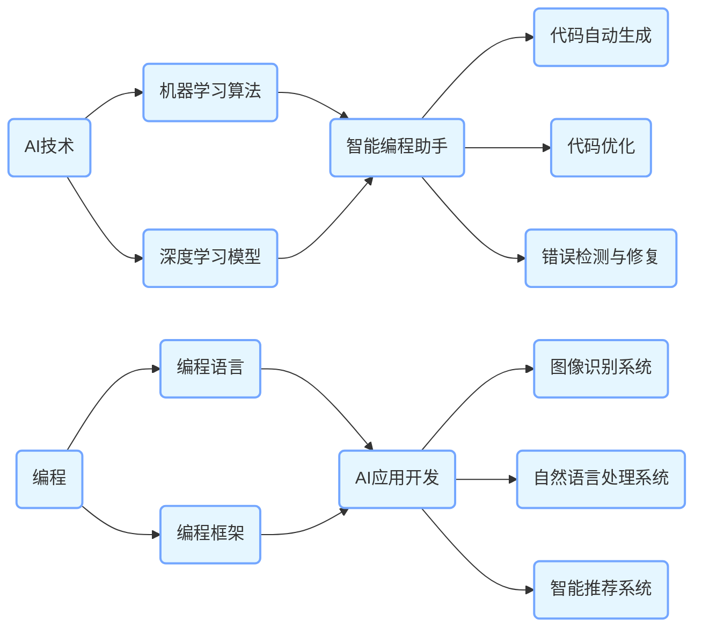

# AI与编程的未来：挑战与机遇

> 关键词：人工智能、编程、未来趋势、挑战、机遇、技术融合、自动化编程

> 摘要：本文深入探讨了AI与编程在未来的发展态势，全面剖析了两者结合所面临的挑战以及蕴含的巨大机遇。通过对核心概念的阐述、算法原理的讲解、数学模型的分析，结合实际项目案例，展示了AI在编程领域的具体应用。同时，推荐了相关的学习资源、开发工具和研究论文，最后对未来的发展趋势进行了总结，并针对常见问题提供了解答。旨在为读者提供一个全面且深入的视角，帮助其理解AI与编程的融合及其对未来科技发展的重要意义。

## 1. 背景介绍 
### 1.1 目的和范围
本文的目的在于全面探讨AI与编程在未来的发展方向，深入分析两者结合过程中面临的挑战以及带来的机遇。范围涵盖了从AI和编程的核心概念、算法原理、数学模型，到实际应用场景、开发工具和资源推荐等多个方面。通过对这些内容的详细阐述，为读者呈现一个清晰、全面的关于AI与编程未来发展的图景。

### 1.2 预期读者
本文预期读者包括编程爱好者、软件开发人员、人工智能研究人员、技术管理者以及对未来科技发展趋势感兴趣的人群。无论您是初学者希望了解AI与编程的基础知识，还是专业人士寻求深入的技术分析和行业洞察，本文都将为您提供有价值的信息。

### 1.3 文档结构概述
本文将按照以下结构进行阐述：首先介绍核心概念与联系，明确AI和编程的基本原理以及它们之间的相互关系；接着讲解核心算法原理和具体操作步骤，通过Python代码详细展示相关算法的实现；然后分析数学模型和公式，并举例说明其在实际中的应用；之后通过项目实战，展示AI在编程中的具体应用案例及代码解读；再探讨实际应用场景，说明AI与编程结合在不同领域的应用情况；随后推荐相关的工具和资源，包括学习资源、开发工具和研究论文；最后总结未来发展趋势与挑战，并解答常见问题，同时提供扩展阅读和参考资料。

### 1.4 术语表
#### 1.4.1 核心术语定义
- **人工智能（AI）**：是指让计算机系统能够模拟人类智能的技术和方法，包括学习、推理、解决问题、感知和语言理解等能力。
- **编程**：是指使用特定的编程语言，按照一定的规则和逻辑，编写程序来实现特定功能的过程。
- **自动化编程**：利用AI技术自动生成代码的过程，减少人工编写代码的工作量。
- **机器学习**：是AI的一个重要分支，通过让计算机从数据中学习模式和规律，从而实现预测和决策。
- **深度学习**：是一种基于人工神经网络的机器学习方法，能够处理复杂的模式和数据，在图像识别、自然语言处理等领域取得了显著成果。

#### 1.4.2 相关概念解释
- **AI与编程的融合**：指将AI技术应用于编程过程中，如代码自动生成、代码优化、错误检测等；同时，编程也是实现AI算法和系统的重要手段。
- **智能编程助手**：利用AI技术为程序员提供智能提示、代码补全、问题解答等功能的工具。

#### 1.4.3 缩略词列表
- **AI**：Artificial Intelligence（人工智能）
- **ML**：Machine Learning（机器学习）
- **DL**：Deep Learning（深度学习）
- **IDE**：Integrated Development Environment（集成开发环境）

## 2. 核心概念与联系 

### 核心概念原理
#### 人工智能原理
人工智能的核心原理是通过构建模型来模拟人类的智能行为。其中，机器学习是实现AI的重要途径，它基于数据驱动，让计算机从大量数据中学习模式和规律。例如，在图像识别任务中，通过对大量图像数据的学习，计算机可以识别出不同的物体。深度学习则是机器学习的一种特殊形式，它使用多层神经网络来处理复杂的数据，能够自动提取数据中的特征。

#### 编程原理
编程是将人类的想法和需求转化为计算机能够理解和执行的指令的过程。程序员使用编程语言来编写代码，代码按照一定的逻辑结构组织，包括顺序结构、选择结构和循环结构等。编程语言提供了各种数据类型、函数和类等工具，帮助程序员实现复杂的功能。

### 架构的文本示意图
AI与编程的融合可以看作是一个相互促进的架构。AI技术为编程提供了智能辅助，如代码自动生成、错误检测和修复等。而编程则是实现AI算法和系统的基础，通过编程可以将AI模型部署到实际应用中。以下是一个简单的文本示意图：

```plaintext
AI技术
|
|-- 机器学习算法
|-- 深度学习模型
|
|-- 智能编程助手
|   |-- 代码自动生成
|   |-- 代码优化
|   |-- 错误检测与修复
|
编程
|
|-- 编程语言
|-- 编程框架
|
|-- AI应用开发
|   |-- 图像识别系统
|   |-- 自然语言处理系统
|   |-- 智能推荐系统
```

### Mermaid流程图


这个流程图展示了AI技术和编程之间的关系。AI技术中的机器学习算法和深度学习模型为智能编程助手提供支持，智能编程助手可以实现代码自动生成、优化和错误检测等功能。而编程通过编程语言和编程框架来实现AI应用开发，包括图像识别、自然语言处理和智能推荐等系统。

## 3. 核心算法原理 & 具体操作步骤 

### 核心算法原理
#### 决策树算法
决策树是一种常用的机器学习算法，用于分类和回归任务。它通过构建一个树状结构来进行决策，每个内部节点表示一个属性上的测试，每个分支表示一个测试输出，每个叶节点表示一个类别或值。决策树的构建过程基于信息增益或基尼不纯度等指标，选择最优的属性进行划分。

以下是一个简单的决策树算法的Python实现：
```python
import numpy as np

class DecisionTree:
    def __init__(self, max_depth=2):
        self.max_depth = max_depth

    def fit(self, X, y):
        self.tree = self._build_tree(X, y, depth=0)

    def _build_tree(self, X, y, depth):
        n_samples, n_features = X.shape
        n_labels = len(np.unique(y))

        # 停止条件
        if (depth == self.max_depth) or (n_labels == 1):
            return np.bincount(y).argmax()

        best_gini = 1
        best_feature = None
        best_threshold = None

        for feature in range(n_features):
            thresholds = np.unique(X[:, feature])
            for threshold in thresholds:
                left_indices = X[:, feature] < threshold
                right_indices = ~left_indices

                if len(left_indices) == 0 or len(right_indices) == 0:
                    continue

                gini = self._gini_index(y[left_indices], y[right_indices])

                if gini < best_gini:
                    best_gini = gini
                    best_feature = feature
                    best_threshold = threshold

        if best_feature is None:
            return np.bincount(y).argmax()

        left_indices = X[:, best_feature] < best_threshold
        right_indices = ~left_indices

        left_subtree = self._build_tree(X[left_indices], y[left_indices], depth + 1)
        right_subtree = self._build_tree(X[right_indices], y[right_indices], depth + 1)

        return (best_feature, best_threshold, left_subtree, right_subtree)

    def _gini_index(self, left, right):
        n_left = len(left)
        n_right = len(right)
        n_total = n_left + n_right

        gini_left = 1 - sum((np.bincount(left) / n_left) ** 2)
        gini_right = 1 - sum((np.bincount(right) / n_right) ** 2)

        gini = (n_left / n_total) * gini_left + (n_right / n_total) * gini_right
        return gini

    def predict(self, X):
        return np.array([self._predict_sample(sample, self.tree) for sample in X])

    def _predict_sample(self, sample, tree):
        if not isinstance(tree, tuple):
            return tree

        feature, threshold, left_subtree, right_subtree = tree
        if sample[feature] < threshold:
            return self._predict_sample(sample, left_subtree)
        else:
            return self._predict_sample(sample, right_subtree)

```
### 具体操作步骤
#### 数据准备
首先，需要准备训练数据和测试数据。可以使用`sklearn`库中的`datasets`模块来加载一些常用的数据集，如鸢尾花数据集。
```python
from sklearn.datasets import load_iris
from sklearn.model_selection import train_test_split

iris = load_iris()
X = iris.data
y = iris.target

X_train, X_test, y_train, y_test = train_test_split(X, y, test_size=0.2, random_state=42)
```
#### 模型训练
使用准备好的训练数据来训练决策树模型。
```python
model = DecisionTree(max_depth=2)
model.fit(X_train, y_train)
```
#### 模型预测
使用训练好的模型对测试数据进行预测，并计算准确率。
```python
y_pred = model.predict(X_test)
accuracy = np.mean(y_pred == y_test)
print(f"Accuracy: {accuracy}")
```

## 4. 数学模型和公式 & 详细讲解 & 举例说明 

### 数学模型和公式
#### 信息增益
信息增益是决策树算法中用于选择最优属性进行划分的重要指标。它基于信息熵的概念，信息熵表示数据的不确定性。信息增益定义为划分前的信息熵减去划分后的加权信息熵。

信息熵的计算公式为：
$$H(S) = -\sum_{i=1}^{n} p_i \log_2 p_i$$
其中，$S$ 是数据集，$p_i$ 是第 $i$ 个类别的概率。

信息增益的计算公式为：
$$IG(S, A) = H(S) - \sum_{v \in Values(A)} \frac{|S_v|}{|S|} H(S_v)$$
其中，$IG(S, A)$ 是数据集 $S$ 在属性 $A$ 上的信息增益，$Values(A)$ 是属性 $A$ 的所有取值，$S_v$ 是属性 $A$ 取值为 $v$ 的子集。

#### 基尼不纯度
基尼不纯度也是一种用于衡量数据纯度的指标，在决策树算法中也经常使用。基尼不纯度的计算公式为：
$$Gini(S) = 1 - \sum_{i=1}^{n} p_i^2$$
其中，$S$ 是数据集，$p_i$ 是第 $i$ 个类别的概率。

### 详细讲解
#### 信息增益的作用
信息增益用于衡量在某个属性上进行划分后，数据集的不确定性减少的程度。信息增益越大，说明该属性对分类的贡献越大，因此在决策树构建过程中，会选择信息增益最大的属性进行划分。

#### 基尼不纯度的作用
基尼不纯度表示从数据集中随机选择一个样本，将其错误分类的概率。基尼不纯度越小，说明数据集的纯度越高。在决策树构建中，选择基尼不纯度最小的划分方式。

### 举例说明
假设我们有一个数据集 $S$ 包含 10 个样本，其中 6 个属于类别 $A$，4 个属于类别 $B$。则该数据集的信息熵为：
$$H(S) = -\frac{6}{10} \log_2 \frac{6}{10} - \frac{4}{10} \log_2 \frac{4}{10} \approx 0.971$$

假设我们有一个属性 $A$，将数据集 $S$ 划分为两个子集 $S_1$ 和 $S_2$，$S_1$ 包含 4 个样本，其中 3 个属于类别 $A$，1 个属于类别 $B$；$S_2$ 包含 6 个样本，其中 3 个属于类别 $A$，3 个属于类别 $B$。则子集 $S_1$ 和 $S_2$ 的信息熵分别为：
$$H(S_1) = -\frac{3}{4} \log_2 \frac{3}{4} - \frac{1}{4} \log_2 \frac{1}{4} \approx 0.811$$
$$H(S_2) = -\frac{3}{6} \log_2 \frac{3}{6} - \frac{3}{6} \log_2 \frac{3}{6} = 1$$

属性 $A$ 的信息增益为：
$$IG(S, A) = H(S) - \frac{4}{10} H(S_1) - \frac{6}{10} H(S_2) \approx 0.971 - \frac{4}{10} \times 0.811 - \frac{6}{10} \times 1 \approx 0.0466$$

## 5. 项目实战：代码实际案例和详细解释说明 

### 5.1  开发环境搭建
#### 安装Python
首先，需要安装Python编程语言。可以从Python官方网站（https://www.python.org/downloads/）下载适合自己操作系统的Python版本，并按照安装向导进行安装。

#### 安装必要的库
在本项目中，我们需要使用`numpy`、`sklearn`等库。可以使用`pip`命令进行安装：
```sh
pip install numpy scikit-learn
```

### 5.2  源代码详细实现和代码解读
#### 项目需求
我们要实现一个简单的手写数字识别系统，使用`sklearn`库中的`digits`数据集。

#### 源代码实现
```python
import numpy as np
from sklearn.datasets import load_digits
from sklearn.model_selection import train_test_split
from sklearn.svm import SVC
from sklearn.metrics import accuracy_score

# 加载数据集
digits = load_digits()
X = digits.data
y = digits.target

# 划分训练集和测试集
X_train, X_test, y_train, y_test = train_test_split(X, y, test_size=0.2, random_state=42)

# 创建支持向量机模型
model = SVC(kernel='linear')

# 训练模型
model.fit(X_train, y_train)

# 预测
y_pred = model.predict(X_test)

# 计算准确率
accuracy = accuracy_score(y_test, y_pred)
print(f"Accuracy: {accuracy}")
```
#### 代码解读
1. **数据加载**：使用`load_digits()`函数加载手写数字数据集，`X` 是特征矩阵，`y` 是标签向量。
2. **数据划分**：使用`train_test_split()`函数将数据集划分为训练集和测试集，测试集占比为 20%。
3. **模型创建**：创建一个支持向量机模型，使用线性核函数。
4. **模型训练**：使用`fit()`方法对模型进行训练，传入训练集的特征矩阵和标签向量。
5. **模型预测**：使用`predict()`方法对测试集进行预测，得到预测结果。
6. **准确率计算**：使用`accuracy_score()`函数计算预测结果的准确率。

### 5.3  代码解读与分析
#### 支持向量机原理
支持向量机（SVM）是一种常用的机器学习算法，用于分类和回归任务。它的基本思想是找到一个最优的超平面，将不同类别的数据分开，并且使超平面到最近的数据点的距离最大。

#### 选择线性核函数的原因
在本项目中，我们选择线性核函数是因为手写数字数据集是一个相对简单的数据集，线性核函数可以在较短的时间内得到较好的分类效果。

#### 准确率分析
通过计算准确率，我们可以评估模型的性能。在本项目中，准确率较高说明模型能够较好地对手写数字进行识别。

## 6. 实际应用场景 

### 代码自动生成
AI可以根据用户的需求和上下文信息，自动生成代码。例如，在编写Web应用程序时，AI可以根据用户输入的功能描述，自动生成HTML、CSS和JavaScript代码。这可以大大提高开发效率，减少人工编写代码的工作量。

### 代码优化
AI可以对现有的代码进行分析和优化，提高代码的性能和可读性。例如，通过分析代码的复杂度和执行时间，AI可以提出优化建议，如减少循环嵌套、使用更高效的数据结构等。

### 错误检测与修复
AI可以实时监测代码中的错误，并提供修复建议。例如，在编写Python代码时，AI可以检测到语法错误、逻辑错误等，并根据错误类型提供相应的解决方案。

### 智能编程助手
智能编程助手可以为程序员提供智能提示、代码补全、问题解答等功能。例如，当程序员输入代码时，智能编程助手可以根据上下文信息，自动补全代码，减少输入错误。

### 软件开发流程自动化
AI可以应用于软件开发的各个环节，实现软件开发流程的自动化。例如，通过自动化测试工具，AI可以自动生成测试用例，对软件进行测试，提高软件的质量和稳定性。

## 7. 工具和资源推荐
### 7.1 学习资源推荐
#### 7.1.1 书籍推荐
- 《Python机器学习》：本书详细介绍了Python在机器学习领域的应用，包括各种机器学习算法的原理和实现。
- 《深度学习》：由深度学习领域的三位顶尖专家撰写，全面介绍了深度学习的理论和实践。
- 《代码大全》：是一本经典的软件开发书籍，涵盖了软件开发的各个方面，包括代码设计、编码规范、调试技巧等。

#### 7.1.2 在线课程
- Coursera上的“机器学习”课程：由斯坦福大学教授Andrew Ng主讲，是学习机器学习的经典课程。
- edX上的“深度学习”课程：提供了深度学习的深入学习内容，包括卷积神经网络、循环神经网络等。
- 慕课网上的“Python编程入门”课程：适合初学者学习Python编程。

#### 7.1.3 技术博客和网站
- Medium：是一个技术博客平台，有很多关于AI和编程的优质文章。
- Towards Data Science：专注于数据科学和机器学习领域的技术博客，提供了很多实用的教程和案例。
- Stack Overflow：是一个程序员社区，有很多关于编程问题的解答和讨论。

### 7.2 开发工具框架推荐
#### 7.2.1 IDE和编辑器
- PyCharm：是一款专门为Python开发设计的集成开发环境，提供了丰富的功能，如代码自动补全、调试工具等。
- Visual Studio Code：是一款轻量级的代码编辑器，支持多种编程语言，有丰富的插件扩展。
- Jupyter Notebook：是一个交互式的开发环境，适合进行数据分析和机器学习实验。

#### 7.2.2 调试和性能分析工具
- pdb：是Python自带的调试工具，可以帮助程序员调试代码。
- cProfile：是Python的性能分析工具，可以分析代码的执行时间和函数调用次数。
- TensorBoard：是TensorFlow的可视化工具，可以帮助用户可视化模型的训练过程和性能指标。

#### 7.2.3 相关框架和库
- TensorFlow：是一个开源的机器学习框架，广泛应用于深度学习领域。
- PyTorch：是另一个流行的深度学习框架，具有动态图的特点，易于使用和调试。
- Scikit-learn：是一个简单易用的机器学习库，提供了各种机器学习算法和工具。

### 7.3 相关论文著作推荐
#### 7.3.1 经典论文
- “Gradient-Based Learning Applied to Document Recognition”：介绍了卷积神经网络在手写数字识别中的应用，是深度学习领域的经典论文。
- “Long Short-Term Memory”：提出了长短期记忆网络（LSTM），解决了传统循环神经网络的梯度消失问题。

#### 7.3.2 最新研究成果
- 关注顶级学术会议如NeurIPS、ICML、CVPR等的论文，了解AI和编程领域的最新研究进展。

#### 7.3.3 应用案例分析
- 《AI in Practice: How 50 Successful Companies Used Artificial Intelligence to Solve Problems》：介绍了50家公司如何使用AI解决实际问题的案例。

## 8. 总结：未来发展趋势与挑战

### 未来发展趋势
#### 自动化编程的普及
随着AI技术的不断发展，自动化编程将越来越普及。未来，程序员可以通过自然语言描述需求，让AI自动生成代码，大大提高开发效率。

#### AI与编程的深度融合
AI将在编程的各个环节发挥更重要的作用，如代码设计、测试、优化等。同时，编程也将为AI的发展提供更强大的支持，推动AI技术的不断创新。

#### 跨领域应用的拓展
AI与编程的结合将拓展到更多的领域，如医疗、金融、交通等。例如，在医疗领域，AI可以辅助医生进行疾病诊断和治疗方案的制定；在金融领域，AI可以进行风险评估和投资决策。

### 挑战
#### 数据隐私和安全问题
随着AI在编程中的应用，大量的数据被收集和处理，数据隐私和安全问题变得尤为重要。如何保护用户的数据不被泄露和滥用，是一个亟待解决的问题。

#### 技术人才短缺
AI与编程的融合需要具备跨领域知识的技术人才，目前这类人才相对短缺。如何培养更多的复合型人才，是推动AI与编程发展的关键。

#### 伦理和法律问题
AI的应用可能会带来一些伦理和法律问题，如算法歧视、责任认定等。如何制定相应的伦理和法律规范，确保AI的合理应用，是一个需要关注的问题。

## 9. 附录：常见问题与解答

### 问题1：AI会取代程序员吗？
解答：虽然AI在编程领域的应用越来越广泛，但目前还不能完全取代程序员。AI可以辅助程序员完成一些重复性的工作，如代码自动生成和错误检测，但程序员的创造力、逻辑思维和问题解决能力仍然是不可或缺的。未来，程序员将与AI协同工作，共同推动软件开发的发展。

### 问题2：学习AI和编程需要具备哪些基础知识？
解答：学习AI和编程需要具备一定的数学基础，如线性代数、概率论和统计学等。同时，需要掌握一门编程语言，如Python。此外，了解机器学习和深度学习的基本概念也是很有必要的。

### 问题3：如何选择适合自己的AI框架和库？
解答：选择适合自己的AI框架和库需要考虑多个因素，如项目需求、个人技术水平、社区支持等。如果是初学者，建议选择简单易用的框架和库，如Scikit-learn；如果是进行深度学习研究，TensorFlow和PyTorch是不错的选择。

## 10. 扩展阅读 & 参考资料

### 扩展阅读
- 《AI Superpowers: China, Silicon Valley, and the New World Order》：探讨了中美在AI领域的竞争和合作。
- 《The Master Algorithm: How the Quest for the Ultimate Learning Machine Will Remake Our World》：介绍了机器学习的发展历程和未来趋势。

### 参考资料
- 相关学术论文和研究报告
- 各开源框架和库的官方文档
- 技术博客和论坛上的优质文章