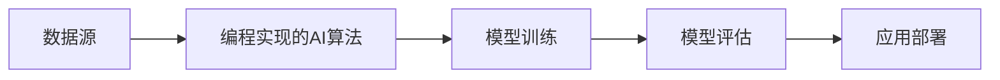

# AI与编程的结合：新职业的崛起

> 关键词：AI编程、新职业、人工智能、编程技术、职业发展、技术融合、行业趋势

> 摘要：本文深入探讨了AI与编程结合所催生的新职业现象。随着人工智能技术的飞速发展，它与传统编程领域的融合日益紧密，创造出了众多新兴的职业机会。文章首先介绍了研究的背景、目的、预期读者等信息，接着阐述了AI与编程结合的核心概念和联系，详细讲解了相关的核心算法原理及操作步骤，给出了数学模型和公式并举例说明。通过项目实战展示了代码的实际应用，分析了其在不同场景下的具体应用。同时推荐了学习所需的工具和资源，最后对这一领域的未来发展趋势和挑战进行了总结，并提供了常见问题解答和扩展阅读资料，旨在为读者全面呈现AI与编程结合所带来的新职业机遇和发展方向。

## 1. 背景介绍 
### 1.1 目的和范围
在当今科技飞速发展的时代，人工智能（AI）已经成为推动各个行业变革的关键力量。编程作为实现各种软件和系统的基础技能，与AI的结合愈发紧密。本文章的目的在于深入剖析AI与编程结合所产生的新职业形态，探讨这些新职业的发展趋势、技能要求和应用场景。范围涵盖了从AI编程的基础概念到实际项目应用，以及相关的学习资源和未来挑战等多个方面，旨在为对这一领域感兴趣的读者提供全面且深入的了解。

### 1.2 预期读者
本文的预期读者包括但不限于以下几类人群：
- 编程初学者：希望了解AI与编程结合的趋势，为自己的职业发展寻找新的方向。
- 在职程序员：渴望提升自己的技能，适应行业的变化，拓展职业发展空间。
- 科技行业从业者：关注行业动态，对AI与编程结合所带来的新机遇和挑战感兴趣。
- 高校学生：尤其是计算机科学、软件工程等相关专业的学生，希望通过了解新职业的需求来规划自己的学习和职业路径。

### 1.3 文档结构概述
本文将按照以下结构进行阐述：
- 核心概念与联系：介绍AI与编程结合的基本概念、原理和架构，通过文本示意图和Mermaid流程图进行直观展示。
- 核心算法原理 & 具体操作步骤：详细讲解AI编程中常用的核心算法原理，并使用Python源代码进行说明。
- 数学模型和公式 & 详细讲解 & 举例说明：给出相关的数学模型和公式，进行详细解读并举例说明其应用。
- 项目实战：通过实际案例展示AI与编程结合的代码实现，包括开发环境搭建、源代码详细实现和代码解读。
- 实际应用场景：分析AI与编程结合在不同行业的实际应用场景。
- 工具和资源推荐：推荐学习AI编程所需的工具、资源和相关论文著作。
- 总结：未来发展趋势与挑战：对AI与编程结合领域的未来发展进行总结和展望，分析可能面临的挑战。
- 附录：常见问题与解答：解答读者在学习和实践过程中可能遇到的常见问题。
- 扩展阅读 & 参考资料：提供进一步学习和研究所需的扩展阅读资料和参考书目。

### 1.4 术语表
#### 1.4.1 核心术语定义
- **人工智能（AI）**：是指计算机系统能够执行通常需要人类智能才能完成的任务，如学习、推理、解决问题、感知和语言理解等。
- **编程**：是指使用特定的编程语言编写代码，以实现特定功能或解决特定问题的过程。
- **AI编程**：将人工智能技术与编程相结合，使用编程语言实现人工智能算法和模型的过程。
- **机器学习（ML）**：是人工智能的一个分支，通过让计算机从数据中学习模式和规律，从而实现预测和决策的能力。
- **深度学习（DL）**：是机器学习的一个子领域，使用深度神经网络来处理复杂的数据和任务，如图像识别、语音识别等。

#### 1.4.2 相关概念解释
- **神经网络**：是一种模仿人类神经系统的计算模型，由多个神经元组成，通过调整神经元之间的连接权重来学习数据中的模式。
- **数据挖掘**：是指从大量数据中发现有用信息和知识的过程，常用于商业智能、市场营销等领域。
- **自然语言处理（NLP）**：是指让计算机能够理解和处理人类语言的技术，如机器翻译、语音识别、文本生成等。

#### 1.4.3 缩略词列表
- **AI**：Artificial Intelligence（人工智能）
- **ML**：Machine Learning（机器学习）
- **DL**：Deep Learning（深度学习）
- **NLP**：Natural Language Processing（自然语言处理）
- **API**：Application Programming Interface（应用程序编程接口）

## 2. 核心概念与联系 
### 核心概念原理
AI与编程的结合是将人工智能的理论和方法通过编程的方式实现。人工智能的核心在于让计算机具备智能，能够像人类一样学习、思考和决策。而编程则是实现这一目标的工具，通过编写代码来实现人工智能算法和模型。

例如，在机器学习中，我们可以使用编程来实现各种学习算法，如决策树、支持向量机、神经网络等。这些算法可以从数据中学习模式和规律，从而实现预测和分类的任务。在深度学习中，我们可以使用编程来构建深度神经网络，如卷积神经网络（CNN）、循环神经网络（RNN）等，用于处理图像、语音和文本等复杂数据。

### 架构的文本示意图
以下是一个简单的AI与编程结合的架构示意图：

```plaintext
数据源（数据收集与预处理）
|
v
编程实现的AI算法（机器学习、深度学习等）
|
v
模型训练（使用训练数据进行模型参数调整）
|
v
模型评估（使用测试数据评估模型性能）
|
v
应用部署（将训练好的模型应用到实际场景中）
```

### Mermaid流程图


这个流程图展示了AI与编程结合的基本流程。首先，从数据源获取数据并进行预处理；然后，使用编程实现AI算法，对数据进行处理和分析；接着，使用训练数据对模型进行训练，调整模型的参数；之后，使用测试数据对模型进行评估，检查模型的性能；最后，将训练好的模型部署到实际应用中，为用户提供服务。

## 3. 核心算法原理 & 具体操作步骤 
### 核心算法原理
在AI编程中，有许多核心算法，这里我们以简单的线性回归算法为例进行讲解。线性回归是一种用于建立自变量和因变量之间线性关系的统计方法。其基本原理是通过最小化预测值与实际值之间的误差平方和，来确定最佳的回归系数。

假设我们有一组数据 $(x_1, y_1), (x_2, y_2), \cdots, (x_n, y_n)$，其中 $x_i$ 是自变量，$y_i$ 是因变量。线性回归模型可以表示为：

$y = \theta_0 + \theta_1x$

其中，$\theta_0$ 是截距，$\theta_1$ 是斜率。我们的目标是找到最佳的 $\theta_0$ 和 $\theta_1$，使得预测值 $\hat{y}_i = \theta_0 + \theta_1x_i$ 与实际值 $y_i$ 之间的误差平方和最小。误差平方和可以表示为：

$J(\theta_0, \theta_1) = \frac{1}{2n}\sum_{i = 1}^{n}(y_i - \hat{y}_i)^2 = \frac{1}{2n}\sum_{i = 1}^{n}(y_i - (\theta_0 + \theta_1x_i))^2$

### 具体操作步骤
以下是使用Python实现线性回归的具体步骤：

```python
import numpy as np
import matplotlib.pyplot as plt

# 生成一些示例数据
x = np.array([1, 2, 3, 4, 5])
y = np.array([2, 4, 6, 8, 10])

# 定义代价函数
def cost_function(theta0, theta1, x, y):
    n = len(x)
    predictions = theta0 + theta1 * x
    cost = (1 / (2 * n)) * np.sum((predictions - y) ** 2)
    return cost

# 定义梯度下降函数
def gradient_descent(theta0, theta1, x, y, alpha, num_iters):
    n = len(x)
    cost_history = []
    for _ in range(num_iters):
        predictions = theta0 + theta1 * x
        theta0_derivative = (1 / n) * np.sum(predictions - y)
        theta1_derivative = (1 / n) * np.sum((predictions - y) * x)
        theta0 = theta0 - alpha * theta0_derivative
        theta1 = theta1 - alpha * theta1_derivative
        cost = cost_function(theta0, theta1, x, y)
        cost_history.append(cost)
    return theta0, theta1, cost_history

# 初始化参数
theta0 = 0
theta1 = 0
alpha = 0.01
num_iters = 1000

# 执行梯度下降
theta0, theta1, cost_history = gradient_descent(theta0, theta1, x, y, alpha, num_iters)

# 输出结果
print(f"最佳截距 theta0: {theta0}")
print(f"最佳斜率 theta1: {theta1}")

# 绘制数据和拟合直线
plt.scatter(x, y, label='Data')
plt.plot(x, theta0 + theta1 * x, color='red', label='Fitted Line')
plt.xlabel('x')
plt.ylabel('y')
plt.legend()
plt.show()

# 绘制代价函数随迭代次数的变化
plt.plot(range(num_iters), cost_history)
plt.xlabel('Iterations')
plt.ylabel('Cost')
plt.title('Cost Function vs Iterations')
plt.show()
```

### 代码解释
1. **数据生成**：使用 `numpy` 生成一些示例数据 `x` 和 `y`。
2. **代价函数**：定义了代价函数 `cost_function`，用于计算预测值与实际值之间的误差平方和。
3. **梯度下降函数**：定义了梯度下降函数 `gradient_descent`，通过不断更新参数 $\theta_0$ 和 $\theta_1$，使得代价函数最小化。
4. **参数初始化**：初始化参数 $\theta_0$、$\theta_1$、学习率 `alpha` 和迭代次数 `num_iters`。
5. **执行梯度下降**：调用 `gradient_descent` 函数，得到最佳的 $\theta_0$ 和 $\theta_1$。
6. **结果输出**：输出最佳的 $\theta_0$ 和 $\theta_1$，并绘制数据和拟合直线。
7. **代价函数变化**：绘制代价函数随迭代次数的变化曲线，观察代价函数是否收敛。

## 4. 数学模型和公式 & 详细讲解 & 举例说明 
### 线性回归的数学模型和公式
在前面的线性回归示例中，我们已经介绍了基本的数学模型和公式。这里我们进一步详细讲解。

线性回归模型的一般形式为：

$y = \theta_0 + \theta_1x_1 + \theta_2x_2 + \cdots + \theta_nx_n$

其中，$y$ 是因变量，$x_1, x_2, \cdots, x_n$ 是自变量，$\theta_0, \theta_1, \cdots, \theta_n$ 是回归系数。在简单线性回归中，只有一个自变量，即 $n = 1$。

代价函数 $J(\theta)$ 用于衡量模型的预测值与实际值之间的误差，其公式为：

$J(\theta) = \frac{1}{2m}\sum_{i = 1}^{m}(h_{\theta}(x^{(i)}) - y^{(i)})^2$

其中，$m$ 是样本数量，$h_{\theta}(x^{(i)})$ 是模型对第 $i$ 个样本的预测值，$y^{(i)}$ 是第 $i$ 个样本的实际值。

梯度下降算法用于更新回归系数 $\theta$，其公式为：

$\theta_j := \theta_j - \alpha\frac{\partial}{\partial\theta_j}J(\theta)$

其中，$\alpha$ 是学习率，$\frac{\partial}{\partial\theta_j}J(\theta)$ 是代价函数 $J(\theta)$ 对 $\theta_j$ 的偏导数。

### 详细讲解
- **代价函数**：代价函数的作用是衡量模型的好坏。我们的目标是找到一组回归系数 $\theta$，使得代价函数 $J(\theta)$ 最小。在最小化代价函数的过程中，我们实际上是在寻找最佳的模型参数，使得模型的预测值尽可能接近实际值。
- **梯度下降**：梯度下降是一种迭代算法，通过不断更新回归系数 $\theta$，使得代价函数 $J(\theta)$ 逐渐减小。每次迭代时，我们根据代价函数的梯度（偏导数）来更新 $\theta$ 的值。学习率 $\alpha$ 控制了每次更新的步长，如果学习率过大，可能会导致算法无法收敛；如果学习率过小，算法收敛速度会很慢。

### 举例说明
假设我们有以下数据：

| $x$ | $y$ |
| --- | --- |
| 1 | 2 |
| 2 | 4 |
| 3 | 6 |
| 4 | 8 |
| 5 | 10 |

我们可以使用上述的线性回归模型和梯度下降算法来拟合这些数据。首先，我们初始化回归系数 $\theta_0 = 0$ 和 $\theta_1 = 0$，学习率 $\alpha = 0.01$，迭代次数 $num\_iters = 1000$。

在每次迭代中，我们计算代价函数 $J(\theta)$ 对 $\theta_0$ 和 $\theta_1$ 的偏导数：

$\frac{\partial}{\partial\theta_0}J(\theta) = \frac{1}{m}\sum_{i = 1}^{m}(h_{\theta}(x^{(i)}) - y^{(i)})$

$\frac{\partial}{\partial\theta_1}J(\theta) = \frac{1}{m}\sum_{i = 1}^{m}(h_{\theta}(x^{(i)}) - y^{(i)})x^{(i)}$

然后，根据梯度下降公式更新 $\theta_0$ 和 $\theta_1$：

$\theta_0 := \theta_0 - \alpha\frac{\partial}{\partial\theta_0}J(\theta)$

$\theta_1 := \theta_1 - \alpha\frac{\partial}{\partial\theta_1}J(\theta)$

经过多次迭代后，我们可以得到最佳的回归系数 $\theta_0$ 和 $\theta_1$，使得代价函数 $J(\theta)$ 最小。在这个例子中，我们最终得到的 $\theta_0$ 接近 0，$\theta_1$ 接近 2，这与我们的数据是线性关系 $y = 2x$ 相符合。

## 5. 项目实战：代码实际案例和详细解释说明 
### 5.1 开发环境搭建
在进行AI编程项目实战之前，我们需要搭建开发环境。以下是搭建Python开发环境的步骤：

1. **安装Python**：从Python官方网站（https://www.python.org/downloads/）下载并安装Python 3.x版本。安装过程中，记得勾选“Add Python to PATH”选项，以便在命令行中可以直接使用Python。
2. **安装虚拟环境（可选）**：虚拟环境可以帮助我们隔离不同项目的依赖。可以使用 `venv` 模块创建虚拟环境：
```bash
python -m venv myenv
```
然后激活虚拟环境：
- 在Windows上：
```bash
myenv\Scripts\activate
```
- 在Linux/Mac上：
```bash
source myenv/bin/activate
```
3. **安装必要的库**：在AI编程中，常用的库有 `numpy`、`pandas`、`scikit-learn`、`tensorflow` 或 `pytorch` 等。可以使用 `pip` 安装这些库：
```bash
pip install numpy pandas scikit-learn tensorflow
```

### 5.2 源代码详细实现和代码解读
我们以一个简单的图像分类项目为例，使用 `tensorflow` 库来实现。

```python
import tensorflow as tf
from tensorflow.keras.datasets import mnist
from tensorflow.keras.models import Sequential
from tensorflow.keras.layers import Flatten, Dense

# 加载MNIST数据集
(x_train, y_train), (x_test, y_test) = mnist.load_data()

# 数据预处理
x_train = x_train / 255.0
x_test = x_test / 255.0

# 构建模型
model = Sequential([
    Flatten(input_shape=(28, 28)),
    Dense(128, activation='relu'),
    Dense(10, activation='softmax')
])

# 编译模型
model.compile(optimizer='adam',
              loss='sparse_categorical_crossentropy',
              metrics=['accuracy'])

# 训练模型
model.fit(x_train, y_train, epochs=5)

# 评估模型
test_loss, test_acc = model.evaluate(x_test, y_test)
print(f"Test accuracy: {test_acc}")
```

### 代码解读与分析
1. **数据加载**：使用 `mnist.load_data()` 函数加载MNIST手写数字数据集，该数据集包含60000个训练样本和10000个测试样本。
2. **数据预处理**：将图像像素值归一化到0到1之间，这样可以加快模型的训练速度。
3. **模型构建**：使用 `Sequential` 模型构建一个简单的神经网络。`Flatten` 层将28x28的图像数据展平为一维向量，`Dense` 层是全连接层，分别有128个神经元和10个神经元。最后一层使用 `softmax` 激活函数，输出每个类别的概率。
4. **模型编译**：使用 `adam` 优化器，`sparse_categorical_crossentropy` 损失函数，以及 `accuracy` 评估指标。
5. **模型训练**：使用 `fit` 函数对模型进行训练，训练5个epoch。
6. **模型评估**：使用 `evaluate` 函数对模型进行评估，输出测试集的准确率。

## 6. 实际应用场景 
### 医疗领域
在医疗领域，AI与编程的结合有着广泛的应用。例如，通过编程实现的AI算法可以对医学影像（如X光、CT、MRI等）进行分析，帮助医生更准确地诊断疾病。一些深度学习模型可以识别影像中的病变特征，如肿瘤的位置、大小和形态等，为医生提供辅助诊断建议。

另外，AI编程还可以用于药物研发。通过对大量的生物数据进行分析，预测药物的疗效和副作用，加速药物研发的过程。同时，还可以开发智能医疗系统，实现患者健康数据的实时监测和分析，为患者提供个性化的医疗方案。

### 金融领域
在金融领域，AI与编程的结合可以用于风险评估、投资决策和欺诈检测等方面。通过编程实现的机器学习算法可以对大量的金融数据进行分析，预测市场趋势和风险。例如，使用时间序列分析算法预测股票价格的走势，帮助投资者做出更明智的投资决策。

在欺诈检测方面，AI编程可以通过分析交易数据的模式和特征，识别出潜在的欺诈行为。例如，对信用卡交易数据进行实时监测，当发现异常交易时及时发出警报，保障用户的资金安全。

### 交通领域
在交通领域，AI与编程的结合推动了自动驾驶技术的发展。通过编程实现的AI算法可以处理传感器采集到的大量数据，如摄像头图像、雷达数据等，实现车辆的环境感知、决策规划和控制执行。例如，使用深度学习算法对摄像头图像进行识别，检测道路、交通标志和其他车辆，为自动驾驶车辆提供准确的导航和控制。

此外，AI编程还可以用于交通流量管理。通过对交通数据的分析，预测交通流量的变化，优化交通信号控制，缓解交通拥堵。

### 教育领域
在教育领域，AI与编程的结合可以实现个性化学习。通过编程实现的AI算法可以分析学生的学习数据，如学习进度、学习习惯和学习成绩等，为学生提供个性化的学习建议和学习资源。例如，开发智能学习系统，根据学生的学习情况自动调整学习内容和难度，提高学习效果。

另外，AI编程还可以用于智能辅导。使用自然语言处理技术开发智能辅导系统，能够理解学生的问题并提供准确的解答，为学生提供实时的学习帮助。

## 7. 工具和资源推荐
### 7.1 学习资源推荐
#### 7.1.1 书籍推荐
- 《Python机器学习》：这本书详细介绍了使用Python进行机器学习的方法和技术，包括各种机器学习算法的原理和实现。
- 《深度学习》：由深度学习领域的三位先驱Ian Goodfellow、Yoshua Bengio和Aaron Courville撰写，是深度学习领域的经典著作，全面介绍了深度学习的理论和应用。
- 《人工智能：一种现代的方法》：这本书是人工智能领域的权威教材，涵盖了人工智能的各个方面，包括搜索算法、知识表示、机器学习、自然语言处理等。

#### 7.1.2 在线课程
- Coursera上的《机器学习》课程：由斯坦福大学教授Andrew Ng讲授，是机器学习领域的经典课程，通过视频讲解、编程作业和测验等方式，帮助学习者掌握机器学习的基本概念和算法。
- edX上的《深度学习微硕士项目》：提供了深度学习的深入学习课程，包括卷积神经网络、循环神经网络、生成对抗网络等内容，适合有一定编程基础的学习者。
- 阿里云天池的AI实战营：提供了丰富的AI实战项目和教程，通过实际项目的操作，帮助学习者提高AI编程能力。

#### 7.1.3 技术博客和网站
- Medium：是一个技术博客平台，有许多AI和编程领域的专家分享他们的经验和见解。
- Towards Data Science：专注于数据科学和机器学习领域的技术博客，提供了大量的优质文章和教程。
- Kaggle：是一个数据科学竞赛平台，不仅有各种数据竞赛，还有丰富的数据集和代码分享，是学习AI编程的好去处。

### 7.2 开发工具框架推荐
#### 7.2.1 IDE和编辑器
- PyCharm：是一款专门为Python开发设计的集成开发环境（IDE），具有代码自动完成、调试、版本控制等功能，提高开发效率。
- Jupyter Notebook：是一个交互式的开发环境，适合进行数据探索、模型实验和代码演示。可以在浏览器中直接编写和运行代码，并将代码、文本和可视化结果整合在一起。
- Visual Studio Code：是一款轻量级的代码编辑器，支持多种编程语言，有丰富的插件和扩展，可以满足不同的开发需求。

#### 7.2.2 调试和性能分析工具
- TensorBoard：是TensorFlow提供的可视化工具，可以用于监控模型的训练过程，如损失函数的变化、准确率的变化等，还可以可视化模型的结构和数据分布。
- PyTorch Profiler：是PyTorch提供的性能分析工具，可以帮助开发者找出代码中的性能瓶颈，优化代码性能。
- cProfile：是Python内置的性能分析工具，可以统计代码中各个函数的执行时间和调用次数，帮助开发者优化代码。

#### 7.2.3 相关框架和库
- TensorFlow：是Google开发的开源机器学习框架，提供了丰富的工具和库，支持各种深度学习模型的开发和训练。
- PyTorch：是Facebook开发的开源深度学习框架，具有动态图机制，易于使用和调试，受到了很多研究者和开发者的喜爱。
- Scikit-learn：是一个简单易用的机器学习库，提供了各种机器学习算法的实现，如分类、回归、聚类等，适合初学者快速上手。

### 7.3 相关论文著作推荐
#### 7.3.1 经典论文
- 《Gradient-based learning applied to document recognition》：由Yann LeCun等人发表，介绍了卷积神经网络（CNN）的基本原理和应用，是深度学习领域的经典论文。
- 《Long Short-Term Memory》：由Sepp Hochreiter和Jürgen Schmidhuber发表，提出了长短期记忆网络（LSTM），解决了循环神经网络（RNN）中的梯度消失问题。
- 《Generative Adversarial Nets》：由Ian Goodfellow等人发表，提出了生成对抗网络（GAN），是一种强大的生成模型，在图像生成、数据增强等领域有广泛的应用。

#### 7.3.2 最新研究成果
- 关注顶级学术会议如NeurIPS（神经信息处理系统大会）、ICML（国际机器学习会议）、CVPR（计算机视觉与模式识别会议）等，这些会议上会发布很多AI领域的最新研究成果。
- 关注知名学术期刊如Journal of Artificial Intelligence Research（JAIR）、Artificial Intelligence等，这些期刊会发表高质量的AI研究论文。

#### 7.3.3 应用案例分析
- 《AI Superpowers: China, Silicon Valley, and the New World Order》：这本书通过大量的案例分析，探讨了AI在不同领域的应用和影响，以及中美两国在AI领域的竞争和合作。
- 《Deep Learning in Practice: A Hands-On Guide to Building Deep Learning Systems》：通过实际案例介绍了深度学习在图像识别、语音识别、自然语言处理等领域的应用，帮助读者将理论知识应用到实际项目中。

## 8. 总结：未来发展趋势与挑战
### 未来发展趋势
- **自动化编程**：随着AI技术的发展，自动化编程将成为未来的一个重要趋势。AI可以根据需求自动生成代码，提高编程效率和质量。例如，一些代码生成工具可以根据自然语言描述生成相应的代码，减少程序员的手动编写工作量。
- **AI与多学科融合**：AI将与更多的学科进行融合，如生物学、物理学、化学等。通过与这些学科的交叉，将开拓出更多的应用领域和研究方向。例如，在生物医学领域，AI可以用于基因测序、蛋白质结构预测等方面。
- **边缘AI**：随着物联网设备的普及，边缘AI将得到更广泛的应用。边缘AI是指在设备端进行AI计算，而不是将数据传输到云端进行处理。这样可以减少数据传输延迟，提高系统的实时性和隐私性。例如，智能摄像头可以在本地进行图像识别，而不需要将图像数据上传到云端。
- **量子AI**：量子计算与AI的结合将是未来的一个重要研究方向。量子计算具有强大的计算能力，可以加速AI算法的训练和推理过程。例如，量子机器学习算法可以处理更复杂的数据和任务，提高AI的性能。

### 挑战
- **数据隐私和安全**：AI的发展离不开大量的数据，但数据的隐私和安全问题也日益突出。如何保护用户的数据隐私，防止数据泄露和滥用，是AI发展面临的一个重要挑战。
- **算法可解释性**：许多AI算法，特别是深度学习算法，是黑盒模型，难以解释其决策过程和结果。在一些关键领域，如医疗、金融等，算法的可解释性至关重要。如何提高AI算法的可解释性，是当前研究的一个热点问题。
- **人才短缺**：AI与编程结合的新职业需要具备多方面的技能，如编程能力、数学基础、机器学习知识等。目前，市场上这类复合型人才短缺，如何培养更多的专业人才，是推动AI与编程结合发展的关键。
- **伦理和社会问题**：AI的发展也带来了一些伦理和社会问题，如失业问题、算法偏见等。如何确保AI的发展符合人类的利益和价值观，是需要我们认真思考和解决的问题。

## 9. 附录：常见问题与解答
### 问题1：学习AI编程需要具备哪些基础知识？
答：学习AI编程需要具备一定的编程基础，建议先学习Python语言。同时，还需要掌握一些数学知识，如线性代数、概率论和统计学等。这些知识对于理解AI算法的原理和实现非常重要。

### 问题2：AI编程和传统编程有什么区别？
答：AI编程更注重数据和模型，通过对大量数据的学习和分析，让计算机自动发现数据中的模式和规律。而传统编程则是根据预先设定的规则和逻辑来实现特定的功能。AI编程通常需要使用机器学习和深度学习等技术，而传统编程则更侧重于算法设计和数据结构。

### 问题3：如何选择适合自己的AI框架？
答：选择适合自己的AI框架需要考虑多个因素，如学习难度、应用场景、性能等。对于初学者来说，Scikit-learn是一个不错的选择，它简单易用，适合快速上手。如果想深入学习深度学习，TensorFlow和PyTorch是比较流行的框架，它们都有丰富的文档和社区支持。

### 问题4：AI编程的就业前景如何？
答：AI编程的就业前景非常广阔。随着AI技术的广泛应用，各个行业都对AI编程人才有很大的需求。如科技公司、金融机构、医疗行业等都需要AI编程人才来开发和应用AI系统。同时，AI编程相关的职位薪资也相对较高。

### 问题5：如何提高自己的AI编程能力？
答：提高AI编程能力需要不断学习和实践。可以通过阅读相关的书籍和论文，参加在线课程和培训，参与开源项目等方式来学习AI编程知识。同时，要多做实际项目，通过实践来巩固所学的知识，提高编程能力。

## 10. 扩展阅读 & 参考资料
### 扩展阅读
- 《AI 3.0》：作者李开复在书中探讨了AI的发展现状和未来趋势，以及AI对人类社会的影响。
- 《The Master Algorithm: How the Quest for the Ultimate Learning Machine Will Remake Our World》：这本书介绍了机器学习的各种算法和理论，以及如何寻找一种通用的学习算法。
- 《Life 3.0: Being Human in the Age of Artificial Intelligence》：作者Max Tegmark在书中探讨了AI对人类未来的影响，以及我们应该如何应对AI带来的挑战。

### 参考资料
- Python官方文档：https://docs.python.org/
- TensorFlow官方文档：https://www.tensorflow.org/api_docs
- PyTorch官方文档：https://pytorch.org/docs/stable/index.html
- Scikit-learn官方文档：https://scikit-learn.org/stable/documentation.html