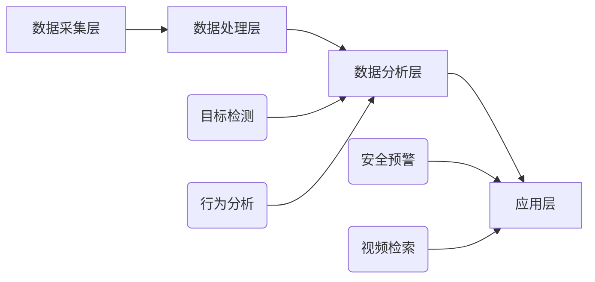

# AI助力下的智能安全监控系统开发

> 关键词：AI、智能安全监控系统、计算机视觉、深度学习、目标检测、行为分析、安全预警

> 摘要：本文围绕AI助力下的智能安全监控系统开发展开，详细阐述了该系统开发的背景、核心概念、算法原理、数学模型，通过实际项目案例展示了系统的开发过程和代码实现。探讨了系统在不同场景下的实际应用，推荐了相关的学习资源、开发工具和论文著作。最后对智能安全监控系统的未来发展趋势与挑战进行了总结，并提供了常见问题解答和扩展阅读参考资料，旨在为相关领域的开发者和研究者提供全面且深入的技术指导。

## 1. 背景介绍 
### 1.1 目的和范围
随着社会的发展和科技的进步，安全问题日益受到人们的关注。传统的安全监控系统主要依赖人工实时查看监控画面，效率低下且容易出现疏漏。AI助力下的智能安全监控系统旨在利用人工智能技术，如计算机视觉、深度学习等，实现对监控画面的自动分析和处理，提高监控效率和准确性，及时发现异常事件并进行预警。

本文的范围涵盖了智能安全监控系统开发的各个方面，包括核心概念、算法原理、数学模型、实际项目开发、应用场景、工具资源等，为开发者提供一个全面的技术指南。

### 1.2 预期读者
本文预期读者包括计算机科学、人工智能、安全工程等领域的开发者、研究者，以及对智能安全监控系统感兴趣的技术爱好者。无论是初学者还是有一定经验的专业人士，都能从本文中获取有价值的信息。

### 1.3 文档结构概述
本文将按照以下结构进行组织：
1. 背景介绍：阐述系统开发的目的、范围、预期读者和文档结构。
2. 核心概念与联系：介绍智能安全监控系统的核心概念，包括计算机视觉、深度学习、目标检测、行为分析等，并展示它们之间的联系。
3. 核心算法原理 & 具体操作步骤：详细讲解目标检测、行为分析等核心算法的原理，并给出Python源代码示例。
4. 数学模型和公式 & 详细讲解 & 举例说明：介绍相关的数学模型和公式，如卷积神经网络的前向传播和反向传播公式，并通过具体例子进行说明。
5. 项目实战：代码实际案例和详细解释说明：通过一个实际的智能安全监控系统项目，展示系统的开发过程，包括开发环境搭建、源代码实现和代码解读。
6. 实际应用场景：探讨智能安全监控系统在不同场景下的应用，如公共场所安全监控、工业生产安全监控等。
7. 工具和资源推荐：推荐相关的学习资源、开发工具和论文著作。
8. 总结：未来发展趋势与挑战：总结智能安全监控系统的未来发展趋势和面临的挑战。
9. 附录：常见问题与解答：解答读者在开发过程中可能遇到的常见问题。
10. 扩展阅读 & 参考资料：提供相关的扩展阅读材料和参考资料。

### 1.4 术语表
#### 1.4.1 核心术语定义
- **人工智能（AI）**：研究如何使计算机能够模拟人类的智能行为，如学习、推理、感知等。
- **计算机视觉**：让计算机从图像或视频中获取信息并理解场景的技术。
- **深度学习**：一种基于人工神经网络的机器学习方法，通过多层神经网络自动学习数据的特征和模式。
- **目标检测**：在图像或视频中识别出特定目标的位置和类别。
- **行为分析**：对目标的行为进行分析和理解，如判断目标的运动轨迹、动作姿态等。
- **安全预警**：当系统检测到异常事件时，及时发出警报通知相关人员。

#### 1.4.2 相关概念解释
- **卷积神经网络（CNN）**：一种专门用于处理具有网格结构数据（如图像）的深度学习模型，通过卷积层、池化层等结构自动提取图像的特征。
- **循环神经网络（RNN）**：一种用于处理序列数据的神经网络，能够捕捉序列中的时间依赖关系，常用于处理视频数据。
- **YOLO（You Only Look Once）**：一种实时目标检测算法，具有快速、高效的特点。
- **OpenCV**：一个开源的计算机视觉库，提供了丰富的图像处理和计算机视觉算法。

#### 1.4.3 缩略词列表
- **AI**：Artificial Intelligence
- **CNN**：Convolutional Neural Network
- **RNN**：Recurrent Neural Network
- **YOLO**：You Only Look Once
- **API**：Application Programming Interface

## 2. 核心概念与联系 
### 核心概念原理
#### 计算机视觉
计算机视觉是智能安全监控系统的基础，它的主要任务是从图像或视频中提取有用的信息。计算机视觉技术包括图像预处理、特征提取、目标检测、图像分割等。通过这些技术，计算机可以理解图像或视频中的场景和目标。

#### 深度学习
深度学习是实现智能安全监控系统智能化的关键技术。深度学习模型可以自动学习数据的特征和模式，从而实现对目标的准确识别和分类。常见的深度学习模型包括卷积神经网络（CNN）、循环神经网络（RNN）等。

#### 目标检测
目标检测是智能安全监控系统中的重要环节，它的任务是在图像或视频中找到特定目标的位置和类别。目标检测算法可以分为基于传统机器学习的方法和基于深度学习的方法。基于深度学习的目标检测算法，如YOLO、Faster R-CNN等，具有更高的准确率和更快的检测速度。

#### 行为分析
行为分析是对目标的行为进行分析和理解。通过对目标的运动轨迹、动作姿态等进行分析，可以判断目标的行为是否异常。行为分析通常需要结合目标检测和跟踪技术，以及机器学习算法。

### 架构的文本示意图
智能安全监控系统的架构主要包括数据采集层、数据处理层、数据分析层和应用层。
- **数据采集层**：负责采集监控视频数据，通常使用摄像头等设备。
- **数据处理层**：对采集到的视频数据进行预处理，如视频解码、图像增强等。
- **数据分析层**：利用深度学习算法对处理后的视频数据进行分析，包括目标检测、行为分析等。
- **应用层**：将分析结果应用到实际场景中，如安全预警、视频检索等。

### Mermaid 流程图


## 3. 核心算法原理 & 具体操作步骤 
### 目标检测算法原理（以YOLO为例）
YOLO是一种实时目标检测算法，它的核心思想是将目标检测问题转化为一个回归问题。YOLO将输入的图像划分为多个网格，每个网格负责预测一定数量的边界框和对应的类别概率。

#### 具体操作步骤
1. **图像划分**：将输入的图像划分为 $S\times S$ 个网格。
2. **边界框预测**：每个网格预测 $B$ 个边界框，每个边界框包含中心坐标 $(x,y)$、宽高 $(w,h)$ 和置信度 $confidence$。
3. **类别预测**：每个网格预测 $C$ 个类别概率。
4. **非极大值抑制**：对预测的边界框进行非极大值抑制，去除重叠度较高的边界框。

#### Python源代码示例
```python
import cv2
import numpy as np

# 加载YOLO模型
net = cv2.dnn.readNet('yolov3.weights', 'yolov3.cfg')

# 加载类别名称
classes = []
with open('coco.names', 'r') as f:
    classes = [line.strip() for line in f.readlines()]

# 加载图像
img = cv2.imread('test.jpg')
height, width, _ = img.shape

# 预处理图像
blob = cv2.dnn.blobFromImage(img, 0.00392, (416, 416), (0, 0, 0), True, crop=False)
net.setInput(blob)

# 获取输出层名称
layer_names = net.getLayerNames()
output_layers = [layer_names[i[0] - 1] for i in net.getUnconnectedOutLayers()]

# 前向传播
outs = net.forward(output_layers)

# 初始化列表
class_ids = []
confidences = []
boxes = []

# 处理输出结果
for out in outs:
    for detection in out:
        scores = detection[5:]
        class_id = np.argmax(scores)
        confidence = scores[class_id]
        if confidence > 0.5:
            # 目标检测
            center_x = int(detection[0] * width)
            center_y = int(detection[1] * height)
            w = int(detection[2] * width)
            h = int(detection[3] * height)

            # 边界框坐标
            x = int(center_x - w / 2)
            y = int(center_y - h / 2)

            boxes.append([x, y, w, h])
            confidences.append(float(confidence))
            class_ids.append(class_id)

# 非极大值抑制
indexes = cv2.dnn.NMSBoxes(boxes, confidences, 0.5, 0.4)

# 绘制边界框和类别名称
font = cv2.FONT_HERSHEY_PLAIN
colors = np.random.uniform(0, 255, size=(len(classes), 3))
if len(indexes) > 0:
    for i in indexes.flatten():
        x, y, w, h = boxes[i]
        label = str(classes[class_ids[i]])
        confidence = str(round(confidences[i], 2))
        color = colors[class_ids[i]]
        cv2.rectangle(img, (x, y), (x + w, y + h), color, 2)
        cv2.putText(img, label + " " + confidence, (x, y + 20), font, 2, color, 2)

# 显示结果
cv2.imshow('Object Detection', img)
cv2.waitKey(0)
cv2.destroyAllWindows()
```

### 行为分析算法原理（以基于光流法的运动分析为例）
光流法是一种用于分析目标运动的方法，它通过计算图像序列中像素点的运动速度和方向来分析目标的运动情况。

#### 具体操作步骤
1. **图像预处理**：对输入的图像序列进行灰度化和高斯滤波处理。
2. **光流计算**：使用Lucas-Kanade光流算法计算相邻两帧图像中像素点的光流。
3. **运动分析**：根据光流计算结果，分析目标的运动方向和速度。

#### Python源代码示例
```python
import cv2
import numpy as np

# 打开视频文件
cap = cv2.VideoCapture('test_video.mp4')

# 读取第一帧
ret, old_frame = cap.read()
old_gray = cv2.cvtColor(old_frame, cv2.COLOR_BGR2GRAY)

# 定义Shi-Tomasi角点检测参数
feature_params = dict(maxCorners=100, qualityLevel=0.3, minDistance=7, blockSize=7)

# 检测角点
p0 = cv2.goodFeaturesToTrack(old_gray, mask=None, **feature_params)

# 定义Lucas-Kanade光流参数
lk_params = dict(winSize=(15, 15), maxLevel=2, criteria=(cv2.TERM_CRITERIA_EPS | cv2.TERM_CRITERIA_COUNT, 10, 0.03))

# 创建掩码
mask = np.zeros_like(old_frame)

while True:
    # 读取下一帧
    ret, frame = cap.read()
    if not ret:
        break
    frame_gray = cv2.cvtColor(frame, cv2.COLOR_BGR2GRAY)

    # 计算光流
    p1, st, err = cv2.calcOpticalFlowPyrLK(old_gray, frame_gray, p0, None, **lk_params)

    # 选择好的点
    good_new = p1[st == 1]
    good_old = p0[st == 1]

    # 绘制光流向量
    for i, (new, old) in enumerate(zip(good_new, good_old)):
        a, b = new.ravel()
        c, d = old.ravel()
        mask = cv2.line(mask, (int(a), int(b)), (int(c), int(d)), (0, 255, 0), 2)
        frame = cv2.circle(frame, (int(a), int(b)), 5, (0, 255, 0), -1)
    img = cv2.add(frame, mask)

    # 显示结果
    cv2.imshow('Optical Flow', img)

    # 更新前一帧和角点
    old_gray = frame_gray.copy()
    p0 = good_new.reshape(-1, 1, 2)

    # 按ESC键退出
    if cv2.waitKey(30) & 0xff == 27:
        break

# 释放资源
cap.release()
cv2.destroyAllWindows()
```

## 4. 数学模型和公式 & 详细讲解 & 举例说明 
### 卷积神经网络（CNN）的数学模型和公式
#### 卷积层
卷积层是CNN的核心层，它通过卷积操作提取图像的特征。卷积操作可以表示为：
$$ y_{i,j}^l = \sum_{m=0}^{M-1} \sum_{n=0}^{N-1} x_{i+m,j+n}^{l-1} \cdot w_{m,n}^l + b^l $$
其中，$y_{i,j}^l$ 是第 $l$ 层卷积层的输出特征图中 $(i,j)$ 位置的元素，$x_{i+m,j+n}^{l-1}$ 是第 $l-1$ 层输入特征图中 $(i+m,j+n)$ 位置的元素，$w_{m,n}^l$ 是第 $l$ 层卷积核中 $(m,n)$ 位置的元素，$b^l$ 是第 $l$ 层的偏置。

#### 池化层
池化层用于降低特征图的维度，常用的池化操作有最大池化和平均池化。最大池化操作可以表示为：
$$ y_{i,j}^l = \max_{m=0}^{M-1} \max_{n=0}^{N-1} x_{iM+m,jN+n}^{l-1} $$
其中，$y_{i,j}^l$ 是第 $l$ 层池化层的输出特征图中 $(i,j)$ 位置的元素，$x_{iM+m,jN+n}^{l-1}$ 是第 $l-1$ 层输入特征图中 $(iM+m,jN+n)$ 位置的元素，$M$ 和 $N$ 是池化窗口的大小。

#### 全连接层
全连接层将卷积层和池化层提取的特征进行整合，用于分类或回归任务。全连接层的输出可以表示为：
$$ y^l = \sigma(W^l \cdot x^{l-1} + b^l) $$
其中，$y^l$ 是第 $l$ 层全连接层的输出，$W^l$ 是第 $l$ 层的权重矩阵，$x^{l-1}$ 是第 $l-1$ 层的输入，$b^l$ 是第 $l$ 层的偏置，$\sigma$ 是激活函数，常用的激活函数有ReLU、Sigmoid等。

### 举例说明
假设我们有一个输入图像的大小为 $32\times32\times3$，我们使用一个 $5\times5$ 的卷积核进行卷积操作，步长为1，填充为0。卷积核的数量为16。则卷积层的输出特征图的大小为 $(32 - 5 + 1)\times(32 - 5 + 1)\times16 = 28\times28\times16$。

接下来，我们使用一个 $2\times2$ 的最大池化窗口进行池化操作，步长为2。则池化层的输出特征图的大小为 $(28/2)\times(28/2)\times16 = 14\times14\times16$。

最后，我们将池化层的输出展平为一维向量，假设全连接层的神经元数量为128，则全连接层的输入向量的长度为 $14\times14\times16 = 3136$，输出向量的长度为128。

## 5. 项目实战：代码实际案例和详细解释说明 
### 5.1  开发环境搭建
#### 操作系统
我们选择使用Ubuntu 20.04作为开发环境的操作系统，因为它是一个开源的、稳定的Linux发行版，广泛应用于人工智能和计算机视觉领域。

#### 安装Python
Python是开发智能安全监控系统的主要编程语言，我们可以使用以下命令安装Python 3.8：
```bash
sudo apt update
sudo apt install python3.8
```

#### 安装深度学习框架
我们选择使用PyTorch作为深度学习框架，因为它具有简洁的API和强大的计算能力。可以使用以下命令安装PyTorch：
```bash
pip install torch torchvision
```

#### 安装OpenCV
OpenCV是一个开源的计算机视觉库，我们可以使用以下命令安装OpenCV：
```bash
pip install opencv-python
```

### 5.2  源代码详细实现和代码解读
#### 项目需求
我们要开发一个简单的智能安全监控系统，实现目标检测和安全预警功能。当检测到目标时，系统会在监控画面上绘制边界框，并发出警报。

#### 源代码实现
```python
import cv2
import torch
import torchvision
from torchvision.models.detection import fasterrcnn_resnet50_fpn
from torchvision.transforms import functional as F

# 加载预训练的Faster R-CNN模型
model = fasterrcnn_resnet50_fpn(pretrained=True)
model.eval()

# 打开摄像头
cap = cv2.VideoCapture(0)

while True:
    # 读取视频帧
    ret, frame = cap.read()
    if not ret:
        break

    # 转换为PyTorch张量
    image = F.to_tensor(frame).unsqueeze(0)

    # 进行目标检测
    with torch.no_grad():
        predictions = model(image)

    # 处理检测结果
    boxes = predictions[0]['boxes'].cpu().numpy()
    labels = predictions[0]['labels'].cpu().numpy()
    scores = predictions[0]['scores'].cpu().numpy()

    # 过滤低置信度的检测结果
    threshold = 0.5
    indices = scores > threshold
    boxes = boxes[indices]
    labels = labels[indices]
    scores = scores[indices]

    # 绘制边界框和类别名称
    for box, label, score in zip(boxes, labels, scores):
        x1, y1, x2, y2 = box.astype(int)
        cv2.rectangle(frame, (x1, y1), (x2, y2), (0, 255, 0), 2)
        cv2.putText(frame, f'{label}: {score:.2f}', (x1, y1 - 10), cv2.FONT_HERSHEY_SIMPLEX, 0.9, (0, 255, 0), 2)

        # 安全预警
        if label == 1:  # 假设类别1为需要预警的目标
            cv2.putText(frame, 'Warning!', (50, 50), cv2.FONT_HERSHEY_SIMPLEX, 1, (0, 0, 255), 2)

    # 显示结果
    cv2.imshow('Smart Security Monitoring System', frame)

    # 按ESC键退出
    if cv2.waitKey(1) & 0xff == 27:
        break

# 释放资源
cap.release()
cv2.destroyAllWindows()
```

#### 代码解读
1. **加载预训练的Faster R-CNN模型**：使用 `torchvision.models.detection.fasterrcnn_resnet50_fpn` 加载预训练的Faster R-CNN模型，并将其设置为评估模式。
2. **打开摄像头**：使用 `cv2.VideoCapture(0)` 打开默认摄像头。
3. **读取视频帧**：使用 `cap.read()` 读取视频帧。
4. **转换为PyTorch张量**：使用 `F.to_tensor()` 将视频帧转换为PyTorch张量，并添加一个维度。
5. **进行目标检测**：使用 `model(image)` 对视频帧进行目标检测。
6. **处理检测结果**：过滤低置信度的检测结果，并提取边界框、类别标签和置信度。
7. **绘制边界框和类别名称**：使用 `cv2.rectangle()` 和 `cv2.putText()` 在视频帧上绘制边界框和类别名称。
8. **安全预警**：当检测到需要预警的目标时，使用 `cv2.putText()` 在视频帧上显示预警信息。
9. **显示结果**：使用 `cv2.imshow()` 显示处理后的视频帧。
10. **释放资源**：使用 `cap.release()` 和 `cv2.destroyAllWindows()` 释放摄像头资源并关闭窗口。

### 5.3  代码解读与分析
#### 优点
- **使用预训练模型**：使用预训练的Faster R-CNN模型可以大大减少模型训练的时间和成本。
- **实时性**：通过使用摄像头实时读取视频帧，并进行目标检测和处理，实现了实时监控的功能。
- **安全预警**：当检测到需要预警的目标时，系统会及时发出警报，提高了监控的安全性。

#### 缺点
- **依赖预训练模型**：预训练模型的性能可能受到数据集的限制，对于特定场景下的目标检测可能效果不佳。
- **计算资源要求高**：Faster R-CNN模型的计算量较大，需要较高的计算资源支持。

## 6. 实际应用场景 
### 公共场所安全监控
在公共场所，如商场、车站、机场等，智能安全监控系统可以实时监测人员的行为和活动，及时发现异常事件，如打架斗殴、盗窃等，并发出警报。同时，系统还可以对人员流量进行统计和分析，为公共场所的管理提供数据支持。

### 工业生产安全监控
在工业生产环境中，智能安全监控系统可以监测设备的运行状态和工人的操作行为，及时发现设备故障和违规操作，避免事故的发生。例如，系统可以检测工人是否佩戴安全帽、是否遵守操作规程等。

### 智能家居安全监控
在智能家居环境中，智能安全监控系统可以实时监测家庭的安全状况，如门窗是否关闭、是否有陌生人进入等。当检测到异常情况时，系统会及时通知业主，并可以与智能家居设备进行联动，如自动关闭门窗、开启警报等。

### 交通管理安全监控
在交通管理领域，智能安全监控系统可以监测道路上的交通流量、车辆行驶状态和行人行为，及时发现交通事故和交通违法行为，并进行预警和处理。例如，系统可以检测车辆是否闯红灯、是否超速行驶等。

## 7. 工具和资源推荐
### 7.1 学习资源推荐
#### 7.1.1 书籍推荐
- 《深度学习》（Deep Learning）：由Ian Goodfellow、Yoshua Bengio和Aaron Courville合著，是深度学习领域的经典教材，全面介绍了深度学习的基本概念、算法和应用。
- 《计算机视觉：算法与应用》（Computer Vision: Algorithms and Applications）：由Richard Szeliski著，详细介绍了计算机视觉的各种算法和应用，包括图像预处理、特征提取、目标检测、图像分割等。
- 《Python深度学习》（Deep Learning with Python）：由Francois Chollet著，以Python和Keras为工具，介绍了深度学习的基本概念和实践应用。

#### 7.1.2 在线课程
- Coursera上的“深度学习专项课程”（Deep Learning Specialization）：由Andrew Ng教授主讲，包括深度学习基础、卷积神经网络、循环神经网络等多个课程，是学习深度学习的优质在线课程。
- edX上的“计算机视觉基础”（Foundations of Computer Vision）：由加州大学伯克利分校的教授主讲，介绍了计算机视觉的基本概念和算法。
- B站（哔哩哔哩）上有很多关于人工智能和计算机视觉的优质教程，如“同济子豪兄”的计算机视觉系列教程。

#### 7.1.3 技术博客和网站
- Medium：是一个技术博客平台，有很多关于人工智能、计算机视觉的优质文章。
- Towards Data Science：专注于数据科学和人工智能领域的技术博客，提供了很多实用的技术文章和案例分析。
- OpenCV官方文档：提供了OpenCV库的详细文档和教程，是学习计算机视觉的重要资源。

### 7.2 开发工具框架推荐
#### 7.2.1 IDE和编辑器
- PyCharm：是一款专门用于Python开发的集成开发环境（IDE），具有代码自动补全、调试、版本控制等功能，是Python开发者的首选工具。
- Jupyter Notebook：是一个交互式的笔记本环境，适合进行数据探索、模型训练和可视化等工作。
- Visual Studio Code：是一款轻量级的代码编辑器，支持多种编程语言，具有丰富的插件和扩展功能。

#### 7.2.2 调试和性能分析工具
- PyTorch Profiler：是PyTorch提供的性能分析工具，可以帮助开发者分析模型的性能瓶颈，优化代码。
- TensorBoard：是TensorFlow提供的可视化工具，也可以用于PyTorch模型的可视化和性能分析。
- cProfile：是Python标准库中的性能分析工具，可以帮助开发者分析Python代码的性能瓶颈。

#### 7.2.3 相关框架和库
- PyTorch：是一个开源的深度学习框架，具有简洁的API和强大的计算能力，广泛应用于人工智能和计算机视觉领域。
- TensorFlow：是另一个流行的深度学习框架，具有丰富的工具和资源，适合大规模的深度学习项目。
- OpenCV：是一个开源的计算机视觉库，提供了丰富的图像处理和计算机视觉算法，如目标检测、图像分割、特征提取等。

### 7.3 相关论文著作推荐
#### 7.3.1 经典论文
- “You Only Look Once: Unified, Real-Time Object Detection”：介绍了YOLO目标检测算法，提出了一种将目标检测问题转化为回归问题的新思路。
- “Faster R-CNN: Towards Real-Time Object Detection with Region Proposal Networks”：提出了Faster R-CNN目标检测算法，通过引入区域建议网络（RPN）提高了目标检测的速度和准确率。
- “Convolutional Neural Networks for Visual Recognition”：介绍了卷积神经网络在视觉识别领域的应用，是卷积神经网络的经典论文之一。

#### 7.3.2 最新研究成果
- 关注顶级学术会议，如CVPR（Computer Vision and Pattern Recognition）、ICCV（International Conference on Computer Vision）、ECCV（European Conference on Computer Vision）等，这些会议上会发布很多关于计算机视觉和人工智能的最新研究成果。
- 关注顶级学术期刊，如IEEE Transactions on Pattern Analysis and Machine Intelligence（TPAMI）、International Journal of Computer Vision（IJCV）等，这些期刊上会发表很多高质量的学术论文。

#### 7.3.3 应用案例分析
- 一些大型科技公司的官方博客，如Google AI Blog、Facebook AI Research等，会分享他们在人工智能和计算机视觉领域的应用案例和研究成果。
- Kaggle是一个数据科学竞赛平台，上面有很多关于计算机视觉和人工智能的竞赛项目和解决方案，可以学习到很多实际应用案例。

## 8. 总结：未来发展趋势与挑战
### 未来发展趋势
#### 多模态融合
未来的智能安全监控系统将不仅仅依赖于视觉信息，还会融合音频、传感器等多种模态的信息，提高系统的感知能力和准确性。例如，结合音频信息可以检测异常声音，结合传感器信息可以检测环境的温度、湿度等参数。

#### 边缘计算
随着物联网和5G技术的发展，边缘计算将在智能安全监控系统中得到广泛应用。边缘计算可以将数据处理和分析任务放在本地设备上进行，减少数据传输延迟，提高系统的实时性和可靠性。

#### 智能化决策
未来的智能安全监控系统将不仅仅是简单的目标检测和预警，还会具备智能化决策能力。系统可以根据检测到的信息，自动做出决策，如自动调整监控策略、自动通知相关人员等。

#### 与其他系统的集成
智能安全监控系统将与其他系统，如智能家居系统、工业自动化系统等进行集成，实现更加智能化的管理和控制。例如，当智能安全监控系统检测到异常事件时，可以自动触发智能家居系统的警报和防护措施。

### 挑战
#### 数据隐私和安全
智能安全监控系统需要收集和处理大量的视频数据，这些数据涉及到个人隐私和安全问题。如何保护数据的隐私和安全，防止数据泄露和滥用，是智能安全监控系统面临的重要挑战之一。

#### 算法的鲁棒性和泛化能力
目前的人工智能算法在一些特定场景下表现良好，但在复杂环境和未知场景下的鲁棒性和泛化能力还有待提高。如何提高算法的鲁棒性和泛化能力，使系统能够在各种环境下稳定运行，是智能安全监控系统需要解决的问题。

#### 计算资源和能耗
智能安全监控系统需要进行大量的计算和数据处理，对计算资源和能耗的要求较高。如何在保证系统性能的前提下，降低计算资源和能耗，是智能安全监控系统面临的挑战之一。

#### 法律法规和伦理问题
智能安全监控系统的广泛应用也带来了一系列的法律法规和伦理问题，如监控范围的合法性、数据使用的合规性等。如何在法律法规和伦理的框架内发展智能安全监控系统，是需要关注的重要问题。

## 9. 附录：常见问题与解答
### 问题1：如何选择适合的目标检测算法？
答：选择适合的目标检测算法需要考虑多个因素，如检测速度、准确率、计算资源要求等。如果对检测速度要求较高，可以选择YOLO等实时目标检测算法；如果对准确率要求较高，可以选择Faster R-CNN等基于区域建议的目标检测算法。同时，还需要根据具体的应用场景和数据特点进行选择。

### 问题2：如何提高智能安全监控系统的实时性？
答：可以从以下几个方面提高智能安全监控系统的实时性：
1. 选择轻量级的模型：如YOLOv5等轻量级目标检测模型，计算量较小，检测速度较快。
2. 使用硬件加速：如GPU、FPGA等硬件设备，可以提高模型的推理速度。
3. 优化算法：如采用并行计算、剪枝等技术，优化算法的性能。
4. 减少数据传输：采用边缘计算技术，将数据处理和分析任务放在本地设备上进行，减少数据传输延迟。

### 问题3：如何处理智能安全监控系统中的误报问题？
答：误报问题是智能安全监控系统中常见的问题，可以从以下几个方面进行处理：
1. 调整检测阈值：通过调整目标检测算法的置信度阈值，过滤掉低置信度的检测结果，减少误报。
2. 多模态融合：结合音频、传感器等多种模态的信息，进行综合判断，提高检测的准确性。
3. 模型优化：对目标检测模型进行优化，提高模型的鲁棒性和泛化能力，减少误报。
4. 人工干预：在系统检测到异常事件后，进行人工审核，确认是否为真实的异常事件。

### 问题4：如何保证智能安全监控系统的数据安全？
答：可以从以下几个方面保证智能安全监控系统的数据安全：
1. 数据加密：对采集到的视频数据进行加密处理，防止数据在传输和存储过程中被窃取。
2. 访问控制：设置严格的访问权限，只有授权人员才能访问和处理数据。
3. 数据备份：定期对数据进行备份，防止数据丢失。
4. 安全审计：对系统的操作和数据访问进行审计，及时发现和处理安全问题。

## 10. 扩展阅读 & 参考资料
### 扩展阅读
- 《人工智能简史》：了解人工智能的发展历程和重要里程碑。
- 《大数据时代》：了解大数据在各个领域的应用和影响。
- 《智能时代》：探讨人工智能对社会和经济的影响。

### 参考资料
- OpenCV官方文档：https://docs.opencv.org/
- PyTorch官方文档：https://pytorch.org/docs/stable/
- TensorFlow官方文档：https://www.tensorflow.org/api_docs
- YOLO官方网站：https://pjreddie.com/darknet/yolo/
- Faster R-CNN论文：https://arxiv.org/abs/1506.01497