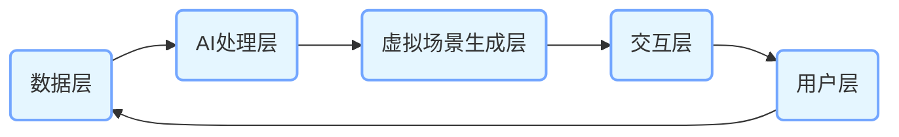

# AI助力下的虚拟现实开发创新

> 关键词：AI、虚拟现实、开发创新、人工智能算法、虚拟场景

> 摘要：本文深入探讨了AI助力下的虚拟现实开发创新。在当今科技飞速发展的时代，AI与虚拟现实的融合成为了热门趋势。文章首先介绍了相关背景，包括目的范围、预期读者等内容。接着阐述了AI与虚拟现实的核心概念及联系，详细讲解了核心算法原理与具体操作步骤，并结合数学模型和公式进行深入分析。通过项目实战案例，展示了AI助力虚拟现实开发的具体实现过程。同时，探讨了其实际应用场景，推荐了相关工具和资源。最后对未来发展趋势与挑战进行总结，旨在为相关领域的开发者和研究者提供全面且深入的参考，推动AI与虚拟现实融合的进一步发展。

## 1. 背景介绍 
### 1.1 目的和范围
随着科技的不断进步，AI和虚拟现实技术都取得了显著的发展。本文章的目的在于深入研究AI如何助力虚拟现实开发创新，分析两者融合的原理、方法和应用场景。范围涵盖了AI与虚拟现实相关的核心概念、算法原理、数学模型、项目实战以及实际应用等多个方面，旨在全面呈现AI助力下虚拟现实开发创新的全貌。

### 1.2 预期读者
本文预期读者包括虚拟现实开发者、AI研究者、相关领域的技术爱好者、高校计算机专业学生以及对科技发展趋势感兴趣的人员。希望能为不同层次的读者提供有价值的信息和启发，无论是专业技术人员寻求技术突破，还是初学者了解前沿技术，都能从文章中获得相应的知识。

### 1.3 文档结构概述
本文将按照以下结构展开：首先介绍背景知识，包括目的、读者和术语表等；接着阐述AI与虚拟现实的核心概念及联系，通过文本示意图和Mermaid流程图进行清晰展示；然后详细讲解核心算法原理和具体操作步骤，结合Python源代码进行深入分析；随后介绍数学模型和公式，并举例说明；通过项目实战展示具体代码实现和解读；探讨实际应用场景；推荐相关工具和资源；最后总结未来发展趋势与挑战，并提供常见问题解答和参考资料。

### 1.4 术语表
#### 1.4.1 核心术语定义
- **AI（Artificial Intelligence）**：即人工智能，是研究、开发用于模拟、延伸和扩展人的智能的理论、方法、技术及应用系统的一门新的技术科学。
- **虚拟现实（Virtual Reality，VR）**：是一种可以创建和体验虚拟世界的计算机仿真系统，它利用计算机生成一种模拟环境，使用户沉浸到该环境中。

#### 1.4.2 相关概念解释
- **增强现实（Augmented Reality，AR）**：是一种将虚拟信息与真实世界巧妙融合的技术，广泛运用了多媒体、三维建模、实时跟踪及注册、智能交互、传感等多种技术手段，将计算机生成的文字、图像、三维模型、音乐、视频等虚拟信息模拟仿真后，应用到真实世界中，两种信息互为补充，从而实现对真实世界的“增强”。
- **混合现实（Mixed Reality，MR）**：是虚拟现实技术的进一步发展，该技术通过在虚拟环境中引入现实场景信息，在虚拟世界、现实世界和用户之间搭起一个交互反馈的信息回路，以增强用户体验的真实感。

#### 1.4.3 缩略词列表
- **AI**：Artificial Intelligence
- **VR**：Virtual Reality
- **AR**：Augmented Reality
- **MR**：Mixed Reality

## 2. 核心概念与联系 

### 核心概念原理
AI的核心原理在于通过对数据的学习和分析，模拟人类的智能行为。其主要包括机器学习、深度学习等技术，机器学习是让计算机通过数据来学习模式和规律，而深度学习则是利用深度神经网络来处理复杂的数据，挖掘数据中的潜在特征。

虚拟现实的核心原理是通过计算机生成一个虚拟的三维环境，利用头戴式显示器、手柄等设备，让用户产生身临其境的感觉。它涉及到图形渲染、传感器技术、人机交互等多个方面，通过精确的计算和反馈，使用户能够与虚拟环境进行自然的交互。

### 架构的文本示意图
AI与虚拟现实融合的架构可以分为以下几个层次：

数据层：包括各种传感器采集的数据、用户行为数据等，这些数据为AI的学习和分析提供了基础。

AI处理层：运用机器学习、深度学习等算法对数据进行处理和分析，提取有用的信息和模式。

虚拟场景生成层：根据AI处理层的结果，生成更加智能、真实的虚拟场景。例如，根据用户的行为和偏好，动态调整虚拟场景的内容和布局。

交互层：通过各种设备，如头戴式显示器、手柄、体感设备等，实现用户与虚拟场景的交互。

用户层：最终的使用者，通过交互层与虚拟场景进行互动，获得沉浸式的体验。

### Mermaid流程图


这个流程图展示了AI助力下虚拟现实开发的整个流程。数据层为AI处理层提供数据，AI处理层对数据进行分析和处理后，传递给虚拟场景生成层生成虚拟场景。用户通过交互层与虚拟场景进行交互，交互过程中产生的数据又反馈回数据层，形成一个闭环。

## 3. 核心算法原理 & 具体操作步骤 

### 核心算法原理
在AI助力虚拟现实开发中，常用的算法包括深度学习中的卷积神经网络（Convolutional Neural Network，CNN）和循环神经网络（Recurrent Neural Network，RNN），以及强化学习算法。

#### 卷积神经网络（CNN）
CNN主要用于处理具有网格结构的数据，如图像和视频。在虚拟现实中，CNN可以用于场景识别、物体检测等任务。其原理是通过卷积层提取数据的局部特征，池化层对特征进行降维，最后通过全连接层进行分类或回归。

#### 循环神经网络（RNN）
RNN适用于处理序列数据，如语音和文本。在虚拟现实中，RNN可以用于自然语言处理，实现用户与虚拟角色的对话交互。RNN的特点是具有记忆功能，能够处理序列数据中的上下文信息。

#### 强化学习算法
强化学习是一种通过智能体与环境进行交互，根据环境反馈的奖励信号来学习最优策略的算法。在虚拟现实中，强化学习可以用于虚拟角色的行为控制，使虚拟角色能够根据环境的变化做出合理的决策。

### 具体操作步骤及Python源代码

#### 场景识别（使用CNN）
以下是一个使用Python和Keras库实现简单的场景识别的示例代码：

```python
import numpy as np
from keras.models import Sequential
from keras.layers import Conv2D, MaxPooling2D, Flatten, Dense
from keras.preprocessing.image import ImageDataGenerator

# 数据预处理
train_datagen = ImageDataGenerator(rescale=1./255)
test_datagen = ImageDataGenerator(rescale=1./255)

train_generator = train_datagen.flow_from_directory(
    'train_data_directory',
    target_size=(150, 150),
    batch_size=32,
    class_mode='categorical')

test_generator = test_datagen.flow_from_directory(
    'test_data_directory',
    target_size=(150, 150),
    batch_size=32,
    class_mode='categorical')

# 构建CNN模型
model = Sequential()
model.add(Conv2D(32, (3, 3), activation='relu', input_shape=(150, 150, 3)))
model.add(MaxPooling2D((2, 2)))
model.add(Conv2D(64, (3, 3), activation='relu'))
model.add(MaxPooling2D((2, 2)))
model.add(Conv2D(128, (3, 3), activation='relu'))
model.add(MaxPooling2D((2, 2)))
model.add(Flatten())
model.add(Dense(128, activation='relu'))
model.add(Dense(train_generator.num_classes, activation='softmax'))

# 编译模型
model.compile(optimizer='adam',
              loss='categorical_crossentropy',
              metrics=['accuracy'])

# 训练模型
model.fit_generator(
    train_generator,
    steps_per_epoch=train_generator.samples // train_generator.batch_size,
    epochs=10,
    validation_data=test_generator,
    validation_steps=test_generator.samples // test_generator.batch_size)
```

#### 自然语言处理（使用RNN）
以下是一个使用Python和TensorFlow库实现简单的文本生成的示例代码：

```python
import tensorflow as tf
from tensorflow.keras.layers import Embedding, SimpleRNN, Dense
from tensorflow.keras.preprocessing.text import Tokenizer
from tensorflow.keras.preprocessing.sequence import pad_sequences
import numpy as np

# 示例文本数据
text = "This is a sample text for RNN example. RNN can handle sequential data."
tokenizer = Tokenizer()
tokenizer.fit_on_texts([text])
total_words = len(tokenizer.word_index) + 1

input_sequences = []
for line in [text]:
    token_list = tokenizer.texts_to_sequences([line])[0]
    for i in range(1, len(token_list)):
        n_gram_sequence = token_list[:i+1]
        input_sequences.append(n_gram_sequence)

max_sequence_len = max([len(x) for x in input_sequences])
input_sequences = np.array(pad_sequences(input_sequences, maxlen=max_sequence_len, padding='pre'))

xs, labels = input_sequences[:,:-1],input_sequences[:,-1]
ys = tf.keras.utils.to_categorical(labels, num_classes=total_words)

# 构建RNN模型
model = tf.keras.Sequential([
    Embedding(total_words, 100, input_length=max_sequence_len-1),
    SimpleRNN(100),
    Dense(total_words, activation='softmax')
])

# 编译模型
model.compile(loss='categorical_crossentropy', optimizer='adam', metrics=['accuracy'])

# 训练模型
model.fit(xs, ys, epochs=100, verbose=1)
```

#### 强化学习（使用OpenAI Gym）
以下是一个使用Python和OpenAI Gym库实现简单的CartPole任务的示例代码：

```python
import gym
import numpy as np

# 创建环境
env = gym.make('CartPole-v1')

# 初始化参数
state_size = env.observation_space.shape[0]
action_size = env.action_space.n
learning_rate = 0.1
discount_factor = 0.99
episodes = 1000

# 初始化Q表
q_table = np.zeros([state_size, action_size])

for episode in range(episodes):
    state = env.reset()
    state = np.reshape(state, [1, state_size])
    done = False
    total_reward = 0

    while not done:
        if np.random.uniform(0, 1) < 0.1:
            action = env.action_space.sample()
        else:
            action = np.argmax(q_table[state])

        next_state, reward, done, _ = env.step(action)
        next_state = np.reshape(next_state, [1, state_size])

        target = reward + discount_factor * np.max(q_table[next_state])
        q_table[state, action] = (1 - learning_rate) * q_table[state, action] + learning_rate * target

        state = next_state
        total_reward += reward

    print(f"Episode: {episode}, Total Reward: {total_reward}")

env.close()
```

## 4. 数学模型和公式 & 详细讲解 & 举例说明 

### 卷积神经网络（CNN）
#### 卷积操作
卷积操作是CNN的核心操作，其数学公式为：

$$
y_{i,j}^k = \sum_{m=0}^{M-1} \sum_{n=0}^{N-1} x_{i+m,j+n} w_{m,n}^k + b^k
$$

其中，$y_{i,j}^k$ 是卷积层输出特征图中第 $k$ 个通道的第 $(i,j)$ 位置的值，$x$ 是输入特征图，$w^k$ 是第 $k$ 个通道的卷积核，$b^k$ 是偏置项，$M$ 和 $N$ 是卷积核的大小。

举例说明：假设输入特征图 $x$ 是一个 $5\times5$ 的矩阵，卷积核 $w$ 是一个 $3\times3$ 的矩阵，偏置项 $b = 0$。在进行卷积操作时，卷积核会在输入特征图上滑动，每次取一个与卷积核大小相同的区域进行点积运算，然后将结果相加得到输出特征图的一个值。

#### 池化操作
池化操作主要用于对特征图进行降维，常用的池化方法有最大池化和平均池化。

最大池化的数学公式为：

$$
y_{i,j}^k = \max_{m=0}^{M-1} \max_{n=0}^{N-1} x_{i\times S + m,j\times S + n}^k
$$

其中，$y_{i,j}^k$ 是池化层输出特征图中第 $k$ 个通道的第 $(i,j)$ 位置的值，$x$ 是输入特征图，$S$ 是池化窗口的步长，$M$ 和 $N$ 是池化窗口的大小。

平均池化的数学公式为：

$$
y_{i,j}^k = \frac{1}{M\times N} \sum_{m=0}^{M-1} \sum_{n=0}^{N-1} x_{i\times S + m,j\times S + n}^k
$$

### 循环神经网络（RNN）
#### 前向传播
RNN的前向传播公式为：

$$
h_t = \tanh(W_{hh} h_{t-1} + W_{xh} x_t + b_h)
$$

$$
y_t = W_{hy} h_t + b_y
$$

其中，$h_t$ 是时刻 $t$ 的隐藏状态，$x_t$ 是时刻 $t$ 的输入，$W_{hh}$ 是隐藏状态到隐藏状态的权重矩阵，$W_{xh}$ 是输入到隐藏状态的权重矩阵，$W_{hy}$ 是隐藏状态到输出的权重矩阵，$b_h$ 和 $b_y$ 分别是隐藏状态和输出的偏置项。

举例说明：假设输入序列 $x = [x_1, x_2, x_3]$，初始隐藏状态 $h_0 = 0$。在时刻 $t = 1$，根据上述公式计算 $h_1$ 和 $y_1$；在时刻 $t = 2$，使用 $h_1$ 计算 $h_2$ 和 $y_2$；以此类推。

### 强化学习
#### Q学习算法
Q学习算法的更新公式为：

$$
Q(s,a) \leftarrow Q(s,a) + \alpha [r + \gamma \max_{a'} Q(s',a') - Q(s,a)]
$$

其中，$Q(s,a)$ 是状态 $s$ 下采取动作 $a$ 的Q值，$\alpha$ 是学习率，$r$ 是奖励，$\gamma$ 是折扣因子，$s'$ 是下一个状态。

举例说明：在CartPole任务中，智能体处于状态 $s$，采取动作 $a$ 后得到奖励 $r$ 并转移到下一个状态 $s'$。根据上述公式更新 $Q(s,a)$ 的值，通过不断的学习和更新，智能体可以找到最优的策略。

## 5. 项目实战：代码实际案例和详细解释说明 

### 5.1  开发环境搭建
#### 硬件环境
- 计算机：需要具备较高的性能，建议使用多核处理器和独立显卡，以确保能够流畅运行虚拟现实应用。
- 虚拟现实设备：如Oculus Rift、HTC Vive等，用于用户的沉浸式体验。

#### 软件环境
- 操作系统：Windows 10或更高版本。
- 开发工具：Python 3.x、Anaconda（用于管理Python环境）、Unity 3D（用于虚拟现实场景开发）。
- 相关库和框架：TensorFlow、Keras、OpenAI Gym等。

### 5.2  源代码详细实现和代码解读
以下是一个使用Unity 3D和Python实现的简单虚拟现实应用示例，该应用通过AI实现虚拟角色的行为控制。

#### Python部分（AI控制）
```python
import socket
import numpy as np

# 初始化socket
server_socket = socket.socket(socket.AF_INET, socket.SOCK_STREAM)
server_socket.bind(('localhost', 12345))
server_socket.listen(1)

print("Waiting for connection...")
conn, addr = server_socket.accept()
print(f"Connected by {addr}")

# 简单的AI逻辑（随机动作）
while True:
    data = conn.recv(1024)
    if not data:
        break
    # 解析数据
    state = np.fromstring(data.decode(), sep=',')
    # 生成随机动作
    action = np.random.randint(0, 2)
    # 发送动作
    conn.sendall(str(action).encode())

conn.close()
server_socket.close()
```

#### Unity 3D部分（虚拟现实场景）
```csharp
using UnityEngine;
using System.Net.Sockets;
using System.Text;

public class AIController : MonoBehaviour
{
    private TcpClient client;
    private NetworkStream stream;

    void Start()
    {
        client = new TcpClient();
        client.Connect("localhost", 12345);
        stream = client.GetStream();
    }

    void Update()
    {
        // 获取当前状态
        string state = "1,2,3,4"; // 示例状态
        byte[] data = Encoding.ASCII.GetBytes(state);
        stream.Write(data, 0, data.Length);

        // 接收动作
        byte[] buffer = new byte[1024];
        int bytes = stream.Read(buffer, 0, buffer.Length);
        string actionStr = Encoding.ASCII.GetString(buffer, 0, bytes);
        int action = int.Parse(actionStr);

        // 根据动作控制虚拟角色
        if (action == 0)
        {
            transform.Translate(Vector3.forward * Time.deltaTime);
        }
        else
        {
            transform.Translate(Vector3.back * Time.deltaTime);
        }
    }

    void OnDestroy()
    {
        stream.Close();
        client.Close();
    }
}
```

### 5.3  代码解读与分析
#### Python部分
- 首先，创建一个socket服务器，监听本地的12345端口。
- 当Unity 3D应用连接到服务器后，进入循环等待接收数据。
- 接收到数据后，解析出当前状态，这里简单地生成一个随机动作并发送给Unity 3D应用。

#### Unity 3D部分
- 在Start方法中，创建一个TcpClient并连接到Python服务器。
- 在Update方法中，获取当前状态并发送给Python服务器，然后接收服务器返回的动作。
- 根据接收到的动作控制虚拟角色的移动。
- 在OnDestroy方法中，关闭网络流和客户端连接。

## 6. 实际应用场景 
### 教育领域
AI助力的虚拟现实可以为学生提供更加沉浸式的学习体验。例如，在历史课程中，学生可以通过虚拟现实设备回到古代，亲身体验历史事件的发生过程。AI可以根据学生的学习进度和表现，动态调整虚拟场景的内容和难度，实现个性化的学习。

### 医疗领域
在医疗培训中，虚拟现实技术可以模拟各种手术场景，让医学生在虚拟环境中进行手术操作练习。AI可以对学生的操作进行实时评估和指导，提供反馈和建议，帮助学生提高手术技能。此外，虚拟现实还可以用于心理治疗，通过模拟特定的场景来帮助患者克服恐惧和焦虑等心理问题。

### 游戏领域
AI与虚拟现实的结合可以创造出更加真实、智能的游戏世界。虚拟角色可以根据玩家的行为和策略做出不同的反应，增加游戏的趣味性和挑战性。例如，在角色扮演游戏中，虚拟角色可以学习玩家的游戏习惯，与玩家进行更加自然的互动。

### 工业领域
在工业设计和制造中，虚拟现实可以帮助工程师进行产品的虚拟设计和测试。AI可以对设计方案进行优化和评估，提高产品的质量和性能。此外，虚拟现实还可以用于员工培训，让员工在虚拟环境中熟悉工作流程和操作规范，减少培训成本和时间。

## 7. 工具和资源推荐
### 7.1 学习资源推荐
#### 7.1.1 书籍推荐
- 《深度学习》（Deep Learning）：由Ian Goodfellow、Yoshua Bengio和Aaron Courville撰写，是深度学习领域的经典教材，全面介绍了深度学习的理论和方法。
- 《虚拟现实：原理与应用》：详细介绍了虚拟现实的基本原理、技术和应用场景，适合初学者和专业人士阅读。
- 《Python机器学习》（Python Machine Learning）：介绍了如何使用Python进行机器学习，包含了大量的实例代码和详细的解释。

#### 7.1.2 在线课程
- Coursera上的“深度学习专项课程”（Deep Learning Specialization）：由Andrew Ng教授主讲，是深度学习领域的经典在线课程，涵盖了深度学习的各个方面。
- Udemy上的“虚拟现实开发入门”（Introduction to Virtual Reality Development）：适合初学者学习虚拟现实开发的基础知识和技能。
- edX上的“人工智能基础”（Fundamentals of Artificial Intelligence）：介绍了人工智能的基本概念、算法和应用。

#### 7.1.3 技术博客和网站
- Medium：有许多关于AI和虚拟现实的技术博客和文章，涵盖了最新的研究成果和实践经验。
- arXiv：是一个预印本数据库，提供了大量的AI和虚拟现实相关的学术论文。
- GitHub：是一个开源代码托管平台，有许多AI和虚拟现实相关的开源项目，可以学习和参考。

### 7.2 开发工具框架推荐
#### 7.2.1 IDE和编辑器
- PyCharm：是一款专门为Python开发设计的集成开发环境，提供了丰富的功能和插件，方便开发者进行Python代码的编写和调试。
- Visual Studio Code：是一款轻量级的代码编辑器，支持多种编程语言，有丰富的插件可以扩展功能，适合虚拟现实开发和AI编程。
- Unity Hub：是Unity 3D的管理工具，方便开发者下载和管理不同版本的Unity 3D引擎，进行虚拟现实场景的开发。

#### 7.2.2 调试和性能分析工具
- TensorBoard：是TensorFlow的可视化工具，可以帮助开发者可视化训练过程、模型结构等信息，方便调试和优化模型。
- Unity Profiler：是Unity 3D的性能分析工具，可以帮助开发者分析虚拟现实应用的性能瓶颈，优化应用的性能。
- NVIDIA Nsight：是NVIDIA提供的性能分析工具，适用于GPU加速的应用开发，可以帮助开发者优化GPU性能。

#### 7.2.3 相关框架和库
- TensorFlow：是一个开源的机器学习框架，提供了丰富的工具和接口，方便开发者进行深度学习模型的开发和训练。
- Keras：是一个高级神经网络API，基于TensorFlow等后端，简化了深度学习模型的构建过程。
- OpenCV：是一个开源的计算机视觉库，提供了各种图像处理和计算机视觉算法，可用于虚拟现实中的场景识别和物体检测等任务。

### 7.3 相关论文著作推荐
#### 7.3.1 经典论文
- “ImageNet Classification with Deep Convolutional Neural Networks”：Alex Krizhevsky等人发表的论文，介绍了AlexNet模型，开启了深度学习在计算机视觉领域的革命。
- “Long Short-Term Memory”：Sepp Hochreiter和Jürgen Schmidhuber发表的论文，提出了长短期记忆网络（LSTM），解决了传统RNN的梯度消失问题。
- “Playing Atari with Deep Reinforcement Learning”：Volodymyr Mnih等人发表的论文，首次将深度学习与强化学习相结合，在Atari游戏中取得了优异的成绩。

#### 7.3.2 最新研究成果
- 关注顶级学术会议，如NeurIPS（神经信息处理系统大会）、CVPR（计算机视觉与模式识别会议）、ICRA（国际机器人与自动化会议）等，这些会议上会发表许多AI和虚拟现实领域的最新研究成果。
- 阅读相关领域的顶级期刊，如Journal of Artificial Intelligence Research（JAIR）、IEEE Transactions on Visualization and Computer Graphics等。

#### 7.3.3 应用案例分析
- 可以参考一些知名公司的技术博客和案例分享，如Google、Facebook、Microsoft等，了解他们在AI和虚拟现实领域的应用案例和实践经验。
- 关注一些行业报告和白皮书，如Gartner的技术成熟度曲线报告、IDC的市场研究报告等，了解AI和虚拟现实技术的发展趋势和应用前景。

## 8. 总结：未来发展趋势与挑战
### 未来发展趋势
- **更加智能化的虚拟角色**：AI技术的不断发展将使虚拟角色更加智能，能够进行更加自然和复杂的交互。虚拟角色可以理解用户的情感和意图，根据用户的需求提供个性化的服务。
- **多模态交互**：未来的虚拟现实应用将不仅仅局限于视觉和听觉，还将融合触觉、嗅觉等多种感知方式，实现更加真实的沉浸式体验。AI可以对多模态数据进行处理和分析，实现更加自然和高效的交互。
- **云虚拟现实**：随着云计算技术的发展，云虚拟现实将成为未来的发展趋势。用户可以通过网络连接到云端服务器，获取强大的计算资源，运行高质量的虚拟现实应用。AI可以在云端对数据进行处理和分析，实现实时的交互和反馈。
- **跨领域融合**：AI与虚拟现实将与其他领域，如物联网、区块链等进行深度融合，创造出更加丰富和多样化的应用场景。例如，在智能家居中，用户可以通过虚拟现实设备远程控制家居设备，AI可以对家居环境进行智能管理和优化。

### 挑战
- **技术瓶颈**：目前，AI和虚拟现实技术仍然存在一些技术瓶颈，如计算资源的限制、数据隐私和安全问题、虚拟场景的真实感和交互性不足等。需要进一步研究和开发新的技术和算法，解决这些问题。
- **用户体验**：如何提高用户的沉浸式体验和交互体验是一个重要的挑战。需要设计更加自然和舒适的交互方式，减少用户的不适感和疲劳感。同时，还需要提高虚拟场景的真实感和细节，让用户更加身临其境。
- **社会和伦理问题**：AI和虚拟现实技术的发展也带来了一些社会和伦理问题，如虚拟世界与现实世界的界限模糊、隐私泄露、道德和法律问题等。需要制定相应的法律法规和伦理准则，引导技术的健康发展。

## 9. 附录：常见问题与解答
### 问题1：AI与虚拟现实结合的难度在哪里？
答：AI与虚拟现实结合的难度主要在于技术的复杂性和数据的处理。一方面，需要掌握AI和虚拟现实两个领域的专业知识和技术，实现两者的有效融合；另一方面，需要处理大量的多模态数据，如视觉、听觉、触觉等数据，对计算资源和算法的要求较高。

### 问题2：如何提高虚拟现实应用的性能？
答：可以从以下几个方面提高虚拟现实应用的性能：优化算法，减少计算量；采用高效的图形渲染技术，提高虚拟场景的渲染速度；合理管理内存，避免内存泄漏；使用高性能的硬件设备，如独立显卡、多核处理器等。

### 问题3：AI在虚拟现实中的应用前景如何？
答：AI在虚拟现实中的应用前景非常广阔。可以实现更加智能的虚拟角色、个性化的用户体验、自然的交互方式等。在教育、医疗、游戏、工业等领域都有很大的应用潜力，可以为这些领域带来新的发展机遇。

### 问题4：虚拟现实开发需要学习哪些知识和技能？
答：虚拟现实开发需要学习计算机图形学、编程语言（如Python、C#等）、3D建模、人机交互等知识和技能。同时，还需要了解AI、传感器技术、网络通信等相关领域的知识。

## 10. 扩展阅读 & 参考资料
- [1] Goodfellow, I., Bengio, Y., & Courville, A. (2016). Deep Learning. MIT Press.
- [2] Burdea, G. C., & Coiffet, P. (2003). Virtual Reality Technology. John Wiley & Sons.
- [3] Raschka, S., & Mirjalili, V. (2017). Python Machine Learning. Packt Publishing.
- [4] Krizhevsky, A., Sutskever, I., & Hinton, G. E. (2012). ImageNet Classification with Deep Convolutional Neural Networks. Advances in Neural Information Processing Systems.
- [5] Hochreiter, S., & Schmidhuber, J. (1997). Long Short-Term Memory. Neural Computation.
- [6] Mnih, V., Kavukcuoglu, K., Silver, D., et al. (2013). Playing Atari with Deep Reinforcement Learning. arXiv preprint arXiv:1312.5602.
- [7] Coursera: https://www.coursera.org/
- [8] Udemy: https://www.udemy.com/
- [9] edX: https://www.edx.org/
- [10] Medium: https://medium.com/
- [11] arXiv: https://arxiv.org/
- [12] GitHub: https://github.com/
- [13] TensorFlow: https://www.tensorflow.org/
- [14] Keras: https://keras.io/
- [15] OpenCV: https://opencv.org/
- [16] Unity 3D: https://unity.com/
- [17] Oculus Rift: https://www.oculus.com/
- [18] HTC Vive: https://www.vive.com/