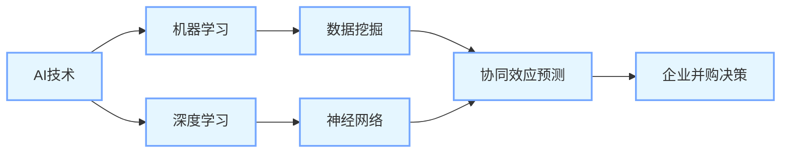

# AI在企业并购协同效应预测中的应用与挑战

> 关键词：AI、企业并购、协同效应预测、应用、挑战

> 摘要：本文聚焦于AI在企业并购协同效应预测中的应用与挑战。首先介绍了相关背景，包括目的范围、预期读者等内容。接着阐述了核心概念与联系，深入讲解了AI和企业并购协同效应预测的原理及架构。详细说明了核心算法原理与具体操作步骤，结合Python代码进行阐述。给出了相关的数学模型和公式，并举例说明。通过项目实战展示了代码实际案例及详细解释。分析了实际应用场景，推荐了相关工具和资源。最后总结了未来发展趋势与挑战，解答了常见问题并提供了扩展阅读和参考资料，旨在为企业和研究者在利用AI进行并购协同效应预测方面提供全面的指导。

## 1. 背景介绍 
### 1.1 目的和范围
企业并购是企业发展过程中的重要战略决策，协同效应预测则是评估并购是否成功的关键因素。准确预测协同效应能够帮助企业在并购前做出更明智的决策，在并购后更好地整合资源，实现价值最大化。本文章的目的在于探讨AI技术如何应用于企业并购协同效应预测，分析其应用过程中的优势和面临的挑战，为企业和相关研究者提供参考。范围涵盖了AI在协同效应预测中的核心概念、算法原理、实际应用案例以及未来发展趋势等方面。

### 1.2 预期读者
本文的预期读者包括企业的高层管理人员、投资银行家、并购顾问、金融分析师、研究企业并购和AI技术的学者以及对企业并购和AI应用感兴趣的技术爱好者。对于企业管理人员和金融从业者，本文可以为他们在并购决策和协同效应评估方面提供新的思路和方法；对于学者和技术爱好者，本文有助于他们深入了解AI在企业并购领域的应用现状和发展趋势。

### 1.3 文档结构概述
本文共分为十个部分。第一部分是背景介绍，阐述了文章的目的、范围、预期读者和文档结构。第二部分介绍核心概念与联系，解释AI和企业并购协同效应预测的基本概念，并展示它们之间的关系。第三部分讲解核心算法原理和具体操作步骤，结合Python代码进行说明。第四部分给出相关的数学模型和公式，并举例说明其应用。第五部分通过项目实战展示代码实际案例和详细解释。第六部分分析AI在企业并购协同效应预测中的实际应用场景。第七部分推荐相关的学习资源、开发工具框架和论文著作。第八部分总结未来发展趋势与挑战。第九部分是附录，解答常见问题。第十部分提供扩展阅读和参考资料。

### 1.4 术语表
#### 1.4.1 核心术语定义
- **AI（Artificial Intelligence，人工智能）**：是一门研究如何使计算机系统能够模拟人类智能的学科，包括机器学习、深度学习、自然语言处理等技术。
- **企业并购（Corporate Mergers and Acquisitions）**：指企业之间通过合并、收购等方式实现资源整合和业务扩张的行为。
- **协同效应（Synergy Effect）**：指企业并购后，通过整合资源、优化业务流程等方式，实现整体价值大于各部分价值之和的效应，包括经营协同效应、财务协同效应和管理协同效应等。
- **协同效应预测（Synergy Effect Prediction）**：指在企业并购前，对并购后可能产生的协同效应进行评估和预测的过程。

#### 1.4.2 相关概念解释
- **机器学习（Machine Learning）**：是AI的一个重要分支，通过让计算机从数据中学习模式和规律，从而实现对未知数据的预测和分类。
- **深度学习（Deep Learning）**：是一种基于神经网络的机器学习技术，通过构建多层神经网络来自动提取数据的特征，在图像识别、语音识别等领域取得了显著的成果。
- **数据挖掘（Data Mining）**：是从大量数据中发现有价值信息和知识的过程，包括数据预处理、特征选择、模型训练等步骤。

#### 1.4.3 缩略词列表
- **AI：Artificial Intelligence**
- **ML：Machine Learning**
- **DL：Deep Learning**
- **M&A：Mergers and Acquisitions**

## 2. 核心概念与联系 

### 核心概念原理
#### AI原理
AI是一门综合性的学科，其核心原理是让计算机系统能够模拟人类的智能行为。机器学习是AI的重要实现方式之一，它基于数据驱动的方法，通过对大量数据的学习和分析，构建模型来预测和分类未知数据。深度学习则是机器学习的一个分支，它通过构建多层神经网络，自动提取数据的特征，从而实现更复杂的任务。

例如，在图像识别领域，深度学习模型可以通过对大量图像数据的学习，自动识别图像中的物体。它首先将图像数据输入到神经网络中，经过多层神经元的处理和变换，提取出图像的特征，然后根据这些特征进行分类和识别。

#### 企业并购协同效应预测原理
企业并购协同效应预测的原理是基于对并购双方的业务、财务、市场等方面的分析，评估并购后可能产生的协同效应。常见的协同效应包括经营协同效应、财务协同效应和管理协同效应。

经营协同效应主要体现在并购后企业可以实现资源共享、成本降低、市场份额扩大等方面。例如，两家生产同类产品的企业并购后，可以共享生产设备、原材料采购渠道等，从而降低生产成本。

财务协同效应主要体现在并购后企业可以实现资金优化配置、税收优惠等方面。例如，一家有大量闲置资金的企业并购一家资金短缺但有良好发展前景的企业，可以实现资金的有效利用。

管理协同效应主要体现在并购后企业可以实现管理经验共享、管理效率提高等方面。例如，一家管理水平较高的企业并购一家管理水平较低的企业，可以将先进的管理经验引入被并购企业，提高其管理效率。

### 架构的文本示意图
```plaintext
              AI技术
           /           \
机器学习     深度学习
 |            |
数据挖掘    神经网络
 |            |
协同效应预测  特征提取
 |
企业并购决策
```

### Mermaid流程图


## 3. 核心算法原理 & 具体操作步骤 

### 核心算法原理
在企业并购协同效应预测中，常用的AI算法包括线性回归、决策树、随机森林和神经网络等。下面以线性回归为例，介绍其原理。

线性回归是一种用于建立自变量和因变量之间线性关系的统计模型。假设我们有一组自变量 $X = [x_1, x_2, ..., x_n]$ 和一个因变量 $y$，线性回归模型可以表示为：

$$y = \beta_0 + \beta_1x_1 + \beta_2x_2 + ... + \beta_nx_n + \epsilon$$

其中，$\beta_0$ 是截距，$\beta_1, \beta_2, ..., \beta_n$ 是回归系数，$\epsilon$ 是误差项。线性回归的目标是通过最小化误差项的平方和来估计回归系数 $\beta_0, \beta_1, ..., \beta_n$。

### 具体操作步骤
#### 步骤1：数据收集
收集与企业并购协同效应相关的数据，包括并购双方的财务数据、市场数据、业务数据等。例如，财务数据可以包括营业收入、净利润、资产负债率等；市场数据可以包括市场份额、行业增长率等；业务数据可以包括产品种类、客户数量等。

#### 步骤2：数据预处理
对收集到的数据进行预处理，包括数据清洗、缺失值处理、异常值处理、数据标准化等。例如，对于缺失值，可以采用均值、中位数或插值法进行填充；对于异常值，可以采用统计方法进行识别和处理。

#### 步骤3：特征选择
从预处理后的数据中选择与协同效应预测相关的特征。可以采用相关性分析、方差分析等方法进行特征选择。例如，选择与协同效应相关性较高的特征，去除相关性较低的特征。

#### 步骤4：模型训练
使用选择好的特征和标记好的训练数据对线性回归模型进行训练。可以使用Python中的`scikit-learn`库来实现线性回归模型的训练。

#### 步骤5：模型评估
使用测试数据对训练好的模型进行评估，计算模型的评估指标，如均方误差（MSE）、均方根误差（RMSE）、决定系数（$R^2$）等。评估指标可以用来衡量模型的预测性能。

#### 步骤6：协同效应预测
使用训练好的模型对新的企业并购案例进行协同效应预测。将新的企业数据输入到模型中，得到协同效应的预测值。

### Python源代码实现
```python
import numpy as np
from sklearn.linear_model import LinearRegression
from sklearn.model_selection import train_test_split
from sklearn.metrics import mean_squared_error, r2_score

# 步骤1：数据收集
# 假设我们有一些样本数据，X是特征矩阵，y是目标变量
X = np.array([[1, 2], [2, 3], [3, 4], [4, 5], [5, 6]])
y = np.array([3, 5, 7, 9, 11])

# 步骤2：数据预处理
# 这里数据比较简单，无需复杂的预处理

# 步骤3：特征选择
# 这里所有特征都使用，无需特征选择

# 步骤4：模型训练
# 划分训练集和测试集
X_train, X_test, y_train, y_test = train_test_split(X, y, test_size=0.2, random_state=42)

# 创建线性回归模型
model = LinearRegression()

# 训练模型
model.fit(X_train, y_train)

# 步骤5：模型评估
# 预测测试集
y_pred = model.predict(X_test)

# 计算评估指标
mse = mean_squared_error(y_test, y_pred)
r2 = r2_score(y_test, y_pred)

print(f"均方误差 (MSE): {mse}")
print(f"决定系数 (R^2): {r2}")

# 步骤6：协同效应预测
# 假设我们有一个新的样本数据
new_X = np.array([[6, 7]])
predicted_y = model.predict(new_X)
print(f"预测的协同效应值: {predicted_y[0]}")
```

## 4. 数学模型和公式 & 详细讲解 & 举例说明 

### 线性回归模型
线性回归模型的一般形式为：

$$y = \beta_0 + \beta_1x_1 + \beta_2x_2 + ... + \beta_nx_n + \epsilon$$

其中，$y$ 是因变量，$x_1, x_2, ..., x_n$ 是自变量，$\beta_0$ 是截距，$\beta_1, \beta_2, ..., \beta_n$ 是回归系数，$\epsilon$ 是误差项。

#### 详细讲解
线性回归的目标是通过最小化误差项的平方和来估计回归系数 $\beta_0, \beta_1, ..., \beta_n$。误差项的平方和可以表示为：

$$S(\beta) = \sum_{i=1}^{m}(y_i - (\beta_0 + \beta_1x_{i1} + \beta_2x_{i2} + ... + \beta_nx_{in}))^2$$

其中，$m$ 是样本数量，$y_i$ 是第 $i$ 个样本的因变量值，$x_{i1}, x_{i2}, ..., x_{in}$ 是第 $i$ 个样本的自变量值。

为了找到使 $S(\beta)$ 最小的回归系数 $\beta_0, \beta_1, ..., \beta_n$，可以对 $S(\beta)$ 求偏导数，并令偏导数等于0，得到一组线性方程组，解这个线性方程组就可以得到回归系数的估计值。

#### 举例说明
假设我们有以下数据：

| $x_1$ | $x_2$ | $y$ |
|-------|-------|-----|
| 1     | 2     | 3   |
| 2     | 3     | 5   |
| 3     | 4     | 7   |
| 4     | 5     | 9   |
| 5     | 6     | 11  |

我们可以使用线性回归模型来预测 $y$ 的值。首先，将数据表示为矩阵形式：

$$X = \begin{bmatrix}
1 & 1 & 2 \\
1 & 2 & 3 \\
1 & 3 & 4 \\
1 & 4 & 5 \\
1 & 5 & 6
\end{bmatrix}$$

$$y = \begin{bmatrix}
3 \\
5 \\
7 \\
9 \\
11
\end{bmatrix}$$

然后，根据最小二乘法的公式 $\hat{\beta} = (X^TX)^{-1}X^Ty$ 来计算回归系数的估计值。

```python
import numpy as np

# 定义X和y
X = np.array([[1, 1, 2], [1, 2, 3], [1, 3, 4], [1, 4, 5], [1, 5, 6]])
y = np.array([3, 5, 7, 9, 11]).reshape(-1, 1)

# 计算回归系数
beta_hat = np.linalg.inv(X.T @ X) @ X.T @ y

print("回归系数的估计值:")
print(beta_hat)
```

运行上述代码，我们可以得到回归系数的估计值。根据估计的回归系数，我们可以对新的样本进行预测。

### 评估指标
#### 均方误差（MSE）
均方误差是预测值与真实值之间误差的平方的平均值，计算公式为：

$$MSE = \frac{1}{m}\sum_{i=1}^{m}(y_i - \hat{y}_i)^2$$

其中，$m$ 是样本数量，$y_i$ 是第 $i$ 个样本的真实值，$\hat{y}_i$ 是第 $i$ 个样本的预测值。

#### 均方根误差（RMSE）
均方根误差是均方误差的平方根，计算公式为：

$$RMSE = \sqrt{\frac{1}{m}\sum_{i=1}^{m}(y_i - \hat{y}_i)^2}$$

#### 决定系数（$R^2$）
决定系数是衡量回归模型拟合优度的指标，计算公式为：

$$R^2 = 1 - \frac{\sum_{i=1}^{m}(y_i - \hat{y}_i)^2}{\sum_{i=1}^{m}(y_i - \bar{y})^2}$$

其中，$\bar{y}$ 是 $y$ 的平均值。$R^2$ 的取值范围是 $[0, 1]$，$R^2$ 越接近1，说明模型的拟合效果越好。

## 5. 项目实战：代码实际案例和详细解释说明 

### 5.1  开发环境搭建
#### 安装Python
首先，需要安装Python环境。可以从Python官方网站（https://www.python.org/downloads/）下载适合自己操作系统的Python安装包，并按照安装向导进行安装。

#### 安装必要的库
在企业并购协同效应预测项目中，需要使用一些Python库，如`pandas`、`numpy`、`scikit-learn`等。可以使用`pip`命令来安装这些库：

```bash
pip install pandas numpy scikit-learn
```

### 5.2  源代码详细实现和代码解读
```python
import pandas as pd
import numpy as np
from sklearn.model_selection import train_test_split
from sklearn.linear_model import LinearRegression
from sklearn.metrics import mean_squared_error, r2_score

# 步骤1：数据收集
# 假设我们有一个包含企业并购数据的CSV文件
data = pd.read_csv('merger_data.csv')

# 步骤2：数据预处理
# 分离特征和目标变量
X = data.drop('synergy', axis=1)
y = data['synergy']

# 处理缺失值
X = X.fillna(X.mean())

# 数据标准化
from sklearn.preprocessing import StandardScaler
scaler = StandardScaler()
X = scaler.fit_transform(X)

# 步骤3：特征选择
# 这里可以使用相关性分析等方法进行特征选择
# 假设我们选择所有特征
selected_features = X

# 步骤4：模型训练
# 划分训练集和测试集
X_train, X_test, y_train, y_test = train_test_split(selected_features, y, test_size=0.2, random_state=42)

# 创建线性回归模型
model = LinearRegression()

# 训练模型
model.fit(X_train, y_train)

# 步骤5：模型评估
# 预测测试集
y_pred = model.predict(X_test)

# 计算评估指标
mse = mean_squared_error(y_test, y_pred)
r2 = r2_score(y_test, y_pred)

print(f"均方误差 (MSE): {mse}")
print(f"决定系数 (R^2): {r2}")

# 步骤6：协同效应预测
# 假设我们有一个新的企业并购案例
new_data = pd.read_csv('new_merger_data.csv')
new_X = new_data.drop('synergy', axis=1)
new_X = new_X.fillna(new_X.mean())
new_X = scaler.transform(new_X)

predicted_synergy = model.predict(new_X)
print(f"预测的协同效应值: {predicted_synergy}")
```

### 5.3  代码解读与分析
#### 数据收集
使用`pandas`库的`read_csv`函数从CSV文件中读取企业并购数据。

#### 数据预处理
- 分离特征和目标变量：使用`drop`方法将目标变量`synergy`从特征矩阵中分离出来。
- 处理缺失值：使用`fillna`方法将缺失值用特征的均值填充。
- 数据标准化：使用`StandardScaler`类对特征矩阵进行标准化处理，使特征具有零均值和单位方差。

#### 特征选择
这里假设选择所有特征，实际应用中可以使用相关性分析、方差分析等方法进行特征选择。

#### 模型训练
使用`train_test_split`函数将数据集划分为训练集和测试集，比例为80%和20%。创建线性回归模型，并使用训练集对模型进行训练。

#### 模型评估
使用训练好的模型对测试集进行预测，计算均方误差（MSE）和决定系数（$R^2$）来评估模型的性能。

#### 协同效应预测
使用训练好的模型对新的企业并购案例进行协同效应预测。首先对新的数据进行预处理，然后将处理后的数据输入到模型中，得到预测的协同效应值。

## 6. 实际应用场景 
### 并购前决策支持
在企业进行并购决策之前，AI可以通过对大量历史并购数据的分析和学习，预测并购后可能产生的协同效应。企业可以根据预测结果评估并购的可行性和潜在价值，从而做出更明智的决策。例如，通过预测经营协同效应，企业可以判断并购后是否能够实现资源共享、成本降低和市场份额扩大；通过预测财务协同效应，企业可以评估并购后是否能够实现资金优化配置和税收优惠。

### 并购后整合规划
在企业完成并购后，AI可以帮助企业制定整合规划，实现协同效应的最大化。例如，通过分析并购双方的业务流程和组织结构，AI可以提供优化建议，帮助企业实现业务整合和管理协同。同时，AI可以实时监测协同效应的实现情况，及时发现问题并提出解决方案。

### 投资银行和金融机构的评估服务
投资银行和金融机构可以利用AI技术为企业提供并购协同效应预测评估服务。他们可以收集和分析大量的企业数据，构建预测模型，为客户提供专业的评估报告。这有助于客户在并购交易中更好地评估风险和收益，提高交易的成功率。

### 监管机构的风险监测
监管机构可以利用AI技术对企业并购活动进行风险监测。通过分析并购企业的财务数据、市场数据和协同效应预测结果，监管机构可以及时发现潜在的风险，如垄断风险、财务风险等，并采取相应的监管措施。

## 7. 工具和资源推荐
### 7.1 学习资源推荐
#### 7.1.1 书籍推荐
- 《人工智能：一种现代的方法》（Artificial Intelligence: A Modern Approach）：这本书是人工智能领域的经典教材，涵盖了人工智能的各个方面，包括搜索算法、知识表示、机器学习、自然语言处理等。
- 《Python机器学习》（Python Machine Learning）：这本书介绍了如何使用Python进行机器学习，包括数据预处理、模型选择、模型评估等内容。
- 《深度学习》（Deep Learning）：这本书是深度学习领域的权威著作，由深度学习领域的三位先驱Ian Goodfellow、Yoshua Bengio和Aaron Courville撰写。

#### 7.1.2 在线课程
- Coursera上的“机器学习”课程：由斯坦福大学教授Andrew Ng讲授，是机器学习领域的经典课程，介绍了机器学习的基本概念、算法和应用。
- edX上的“深度学习”课程：由百度首席科学家吴恩达讲授，深入介绍了深度学习的原理和应用。
- Kaggle上的机器学习和数据科学教程：Kaggle是一个数据科学竞赛平台，提供了丰富的机器学习和数据科学教程和案例。

#### 7.1.3 技术博客和网站
- Towards Data Science：这是一个专注于数据科学和机器学习的技术博客，提供了大量的教程、案例和研究成果。
- Medium上的AI相关文章：Medium是一个内容分享平台，有很多AI领域的专家和爱好者分享他们的经验和见解。
- AI Time：这是一个专注于人工智能前沿技术的网站，提供了最新的研究成果、学术会议信息和行业动态。

### 7.2 开发工具框架推荐
#### 7.2.1 IDE和编辑器
- PyCharm：是一款专门为Python开发设计的集成开发环境（IDE），提供了丰富的功能，如代码编辑、调试、代码分析等。
- Jupyter Notebook：是一个交互式的开发环境，适合进行数据探索、模型训练和可视化。
- Visual Studio Code：是一款轻量级的代码编辑器，支持多种编程语言，有丰富的插件可以扩展功能。

#### 7.2.2 调试和性能分析工具
- Py-Spy：是一个用于Python代码性能分析的工具，可以帮助开发者找出代码中的性能瓶颈。
- TensorBoard：是TensorFlow提供的一个可视化工具，可以用于可视化模型的训练过程、损失函数的变化等。
- PDB：是Python自带的调试器，可以帮助开发者调试代码中的错误。

#### 7.2.3 相关框架和库
- Scikit-learn：是一个用于机器学习的Python库，提供了丰富的机器学习算法和工具，如线性回归、决策树、随机森林等。
- TensorFlow：是一个开源的深度学习框架，由Google开发，广泛应用于图像识别、语音识别、自然语言处理等领域。
- PyTorch：是一个开源的深度学习框架，由Facebook开发，具有动态图的特点，适合进行快速迭代和实验。

### 7.3 相关论文著作推荐
#### 7.3.1 经典论文
- “A Logical Calculus of the Ideas Immanent in Nervous Activity”（神经活动中内在思想的逻辑演算）：这篇论文由Warren McCulloch和Walter Pitts于1943年发表，提出了神经元模型，为神经网络的发展奠定了基础。
- “Learning Representations by Back-propagating Errors”（通过误差反向传播学习表示）：这篇论文由David Rumelhart、Geoffrey Hinton和Ronald Williams于1986年发表，提出了误差反向传播算法，使得神经网络的训练变得可行。
- “ImageNet Classification with Deep Convolutional Neural Networks”（使用深度卷积神经网络进行ImageNet分类）：这篇论文由Alex Krizhevsky、Ilya Sutskever和Geoffrey Hinton于2012年发表，提出了AlexNet模型，开启了深度学习在计算机视觉领域的热潮。

#### 7.3.2 最新研究成果
- 关注顶级学术会议如NeurIPS（神经信息处理系统大会）、ICML（国际机器学习会议）、CVPR（计算机视觉与模式识别会议）等上的最新研究成果。这些会议每年都会发表大量关于AI和机器学习的最新研究论文。
- 关注顶级学术期刊如Journal of Artificial Intelligence Research（JAIR）、Artificial Intelligence等上的最新研究成果。这些期刊发表的论文通常具有较高的学术水平和影响力。

#### 7.3.3 应用案例分析
- 《AI未来进行式》：这本书由李开复和王咏刚撰写，介绍了AI在医疗、金融、教育等多个领域的应用案例和发展趋势。
- 关注行业报告和研究机构的分析报告，如麦肯锡、波士顿咨询等机构发布的关于AI在企业并购等领域的应用案例和研究报告。

## 8. 总结：未来发展趋势与挑战
### 未来发展趋势
#### 更精准的预测模型
随着AI技术的不断发展，未来的协同效应预测模型将更加精准。通过使用更复杂的算法和更多的数据，模型可以更好地捕捉企业并购中的各种因素，提高预测的准确性。

#### 多模态数据的融合
未来的协同效应预测将不仅仅依赖于财务数据和市场数据，还将融合文本数据、图像数据、音频数据等多模态数据。例如，通过分析企业的新闻报道、社交媒体评论等文本数据，可以更好地了解企业的声誉和市场形象；通过分析企业的产品图片、视频等图像数据，可以更好地了解企业的产品特点和竞争力。

#### 实时监测和动态调整
未来的协同效应预测系统将具备实时监测和动态调整的能力。在企业并购后，系统可以实时监测协同效应的实现情况，根据实际情况动态调整预测模型和整合策略，确保协同效应的最大化。

#### 与区块链技术的结合
区块链技术具有去中心化、不可篡改、可追溯等特点，可以为企业并购协同效应预测提供更加安全、可信的数据环境。未来，AI技术可能会与区块链技术相结合，实现数据的安全共享和协同分析，提高协同效应预测的可靠性。

### 挑战
#### 数据质量和隐私问题
企业并购数据通常涉及到大量的敏感信息，如财务数据、商业机密等。数据的质量和隐私问题是影响AI在协同效应预测中应用的重要因素。如何确保数据的准确性、完整性和安全性，同时保护企业的隐私，是需要解决的关键问题。

#### 模型解释性问题
AI模型通常是黑盒模型，其预测结果的解释性较差。在企业并购协同效应预测中，决策者需要了解模型的预测依据和原理，以便做出合理的决策。如何提高AI模型的解释性，是需要解决的另一个重要问题。

#### 人才短缺问题
AI技术是一门综合性的学科，需要具备数学、计算机科学、统计学等多方面知识的专业人才。目前，AI领域的人才短缺问题较为严重，如何培养和吸引更多的专业人才，是推动AI在企业并购协同效应预测中应用的关键。

#### 法律法规和伦理问题
随着AI技术的广泛应用，相关的法律法规和伦理问题也日益凸显。例如，AI模型的偏见问题、算法歧视问题等。在企业并购协同效应预测中，如何确保AI技术的合法合规应用，避免出现伦理问题，是需要解决的重要问题。

## 9. 附录：常见问题与解答
### 问题1：AI在企业并购协同效应预测中的准确性如何保证？
解答：要保证AI在企业并购协同效应预测中的准确性，需要从多个方面入手。首先，要确保数据的质量，包括数据的准确性、完整性和一致性。可以通过数据清洗、缺失值处理、异常值处理等方法来提高数据质量。其次，要选择合适的算法和模型，根据数据的特点和问题的需求选择最适合的算法。可以通过交叉验证、模型选择等方法来选择最优的模型。最后，要对模型进行评估和优化，使用评估指标如均方误差、决定系数等对模型进行评估，根据评估结果对模型进行优化。

### 问题2：AI模型的解释性如何提高？
解答：提高AI模型的解释性可以采用以下方法。一是使用可解释的模型，如线性回归、决策树等，这些模型的预测结果具有较高的解释性。二是使用模型解释技术，如特征重要性分析、局部可解释模型无关解释（LIME）、SHAP值等，这些技术可以帮助解释模型的预测结果。三是结合专家知识和领域经验，对模型的预测结果进行解释和验证。

### 问题3：如何解决AI在企业并购协同效应预测中的数据隐私问题？
解答：解决数据隐私问题可以采用以下措施。一是数据加密，对敏感数据进行加密处理，确保数据在传输和存储过程中的安全性。二是匿名化处理，对数据进行匿名化处理，去除数据中的个人身份信息和敏感信息。三是使用联邦学习技术，联邦学习可以在不共享原始数据的情况下进行模型训练，保护数据的隐私。四是建立严格的数据访问控制机制，限制数据的访问权限，确保只有授权人员可以访问数据。

### 问题4：AI在企业并购协同效应预测中的应用是否会取代人类决策？
解答：AI在企业并购协同效应预测中的应用不会取代人类决策。虽然AI可以提供更准确的预测结果和更丰富的信息，但人类决策仍然具有不可替代的作用。人类具有丰富的经验、判断力和创造力，可以综合考虑各种因素，做出更合理的决策。AI可以作为人类决策的辅助工具，帮助人类更好地理解和分析数据，提高决策的效率和质量。

## 10. 扩展阅读 & 参考资料
### 扩展阅读
- 《智能时代》：作者吴军，介绍了AI在各个领域的应用和影响，以及未来的发展趋势。
- 《数据挖掘：概念与技术》：作者Jiawei Han、Jian Pei和Jianwen Yin，介绍了数据挖掘的基本概念、算法和应用。
- 《人工智能简史》：作者尼克，介绍了人工智能的发展历程、重要事件和关键人物。

### 参考资料
- 相关学术论文和研究报告，如在IEEE、ACM等学术数据库中搜索关于AI在企业并购协同效应预测中的研究论文。
- 企业并购相关的法律法规和政策文件，如《上市公司收购管理办法》等。
- 行业研究机构发布的关于企业并购和AI应用的报告，如普华永道、德勤等机构发布的相关报告。