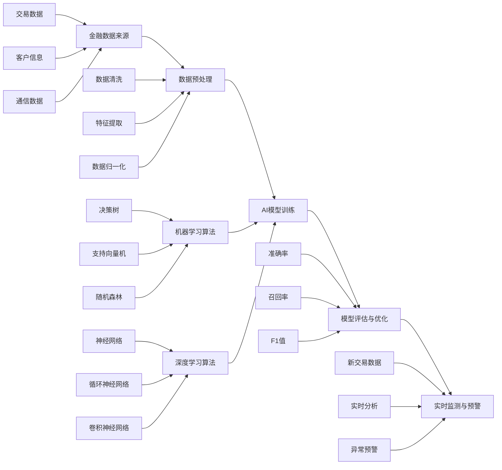

# AI在反金融犯罪网络识别中的深度应用研究

> 关键词：AI、反金融犯罪、网络识别、机器学习、深度学习、金融安全、数据挖掘

> 摘要：本文聚焦于AI在反金融犯罪网络识别中的深度应用。随着金融行业的数字化发展，金融犯罪形式日益复杂且网络化特征明显。AI技术凭借其强大的数据处理和模式识别能力，为反金融犯罪网络识别提供了有效的解决方案。文章首先介绍了研究的背景、目的、预期读者等信息，接着阐述了相关核心概念与联系，详细讲解了核心算法原理及具体操作步骤，分析了数学模型和公式，通过项目实战展示了代码实现及解读，探讨了实际应用场景，推荐了相关工具和资源，最后总结了未来发展趋势与挑战，并对常见问题进行了解答，为AI在反金融犯罪网络识别领域的进一步应用提供了全面而深入的参考。

## 1. 背景介绍 
### 1.1 目的和范围
随着金融科技的迅猛发展，金融交易的数字化和网络化程度不断提高，金融犯罪活动也呈现出更加复杂和隐蔽的特点。金融犯罪网络往往涉及多个参与者、多种交易方式和复杂的资金流向，传统的反金融犯罪手段难以有效识别和打击这些犯罪网络。本研究的目的在于探索AI技术在反金融犯罪网络识别中的深度应用，通过利用机器学习、深度学习等AI算法，挖掘金融数据中的潜在模式和关联，实现对金融犯罪网络的精准识别和预警。

本研究的范围涵盖了AI在反金融犯罪网络识别中的多个方面，包括核心概念、算法原理、数学模型、项目实战、实际应用场景等。旨在为金融机构、监管部门和研究人员提供全面的理论和实践指导，推动AI技术在反金融犯罪领域的广泛应用。

### 1.2 预期读者
本文的预期读者主要包括以下几类：
1. **金融机构从业人员**：如银行、证券、保险等金融机构的风控人员、合规人员和数据分析人员，他们可以从本文中了解AI技术在反金融犯罪网络识别中的应用方法和实践经验，提升自身的风险防范能力。
2. **监管部门工作人员**：包括金融监管机构的官员和执法人员，他们可以通过本文了解AI技术在反金融犯罪中的应用现状和发展趋势，为制定相关监管政策提供参考。
3. **研究人员**：从事金融科技、人工智能、数据挖掘等领域研究的学者和科研人员，他们可以从本文中获取相关的理论和技术知识，开展进一步的研究工作。
4. **技术爱好者**：对AI技术和金融犯罪防范感兴趣的技术爱好者，他们可以通过本文了解AI技术在实际应用中的具体案例和方法，拓宽自己的知识面。

### 1.3 文档结构概述
本文的文档结构如下：
1. **背景介绍**：介绍研究的目的、范围、预期读者和文档结构概述，以及相关术语的定义和解释。
2. **核心概念与联系**：阐述AI、反金融犯罪、网络识别等核心概念的原理和架构，并通过文本示意图和Mermaid流程图展示它们之间的联系。
3. **核心算法原理 & 具体操作步骤**：详细讲解AI在反金融犯罪网络识别中常用的核心算法原理，如机器学习算法、深度学习算法等，并给出具体的操作步骤和Python源代码示例。
4. **数学模型和公式 & 详细讲解 & 举例说明**：介绍AI在反金融犯罪网络识别中涉及的数学模型和公式，如概率模型、图模型等，并通过具体的例子进行详细讲解。
5. **项目实战：代码实际案例和详细解释说明**：通过一个实际的项目案例，展示AI在反金融犯罪网络识别中的具体应用过程，包括开发环境搭建、源代码实现和代码解读。
6. **实际应用场景**：探讨AI在反金融犯罪网络识别中的实际应用场景，如洗钱识别、诈骗检测、非法集资预警等。
7. **工具和资源推荐**：推荐一些学习AI和反金融犯罪网络识别的相关工具和资源，包括书籍、在线课程、技术博客、开发工具框架和相关论文著作等。
8. **总结：未来发展趋势与挑战**：总结AI在反金融犯罪网络识别中的应用现状和发展趋势，分析面临的挑战和问题，并提出相应的对策和建议。
9. **附录：常见问题与解答**：对读者在阅读本文过程中可能遇到的常见问题进行解答。
10. **扩展阅读 & 参考资料**：提供一些与本文相关的扩展阅读材料和参考资料，供读者进一步深入学习和研究。

### 1.4 术语表
#### 1.4.1 核心术语定义
1. **AI（Artificial Intelligence）**：人工智能，是指计算机系统能够执行通常需要人类智能才能完成的任务，如学习、推理、解决问题等。
2. **反金融犯罪**：指采取各种措施和手段，预防、发现和打击金融领域的犯罪活动，如洗钱、诈骗、非法集资等。
3. **网络识别**：指通过对网络数据的分析和挖掘，识别出网络中的异常模式和关联，从而发现潜在的犯罪行为和犯罪网络。
4. **机器学习（Machine Learning）**：是AI的一个重要分支，通过让计算机系统从数据中自动学习模式和规律，从而实现对未知数据的预测和分类。
5. **深度学习（Deep Learning）**：是机器学习的一个子领域，通过构建深度神经网络，自动学习数据的特征和表示，从而实现更复杂的任务，如图像识别、语音识别等。
6. **金融犯罪网络**：指由多个犯罪参与者通过金融交易和通信网络相互连接形成的犯罪组织和活动网络。

#### 1.4.2 相关概念解释
1. **数据挖掘（Data Mining）**：指从大量的数据中发现潜在的模式、关联和知识的过程，是AI在反金融犯罪网络识别中的重要技术手段之一。
2. **图模型（Graph Model）**：是一种用于表示和分析复杂网络结构和关系的数学模型，在反金融犯罪网络识别中可以用于表示金融犯罪网络的拓扑结构和节点之间的关系。
3. **异常检测（Anomaly Detection）**：指通过对数据的分析和建模，识别出数据中的异常模式和行为，从而发现潜在的犯罪活动。
4. **风险评估（Risk Assessment）**：指对金融交易和客户的风险进行评估和量化的过程，是反金融犯罪的重要环节之一。

#### 1.4.3 缩略词列表
1. **AI**：Artificial Intelligence（人工智能）
2. **ML**：Machine Learning（机器学习）
3. **DL**：Deep Learning（深度学习）
4. **AML**：Anti-Money Laundering（反洗钱）
5. **KYC**：Know Your Customer（了解你的客户）

## 2. 核心概念与联系 

### 核心概念原理
#### AI
AI是一门研究如何使计算机系统具有智能行为的学科。其核心原理是通过构建算法和模型，让计算机系统能够从数据中学习、推理和决策。在反金融犯罪网络识别中，AI主要通过机器学习和深度学习技术来实现。机器学习算法可以从历史金融数据中学习到正常交易和异常交易的模式，从而对新的交易进行分类和预测。深度学习则可以自动学习数据的深层次特征，提高识别的准确性和效率。

#### 反金融犯罪
反金融犯罪的核心目标是预防、发现和打击金融领域的犯罪活动。其原理是通过对金融交易数据、客户信息等进行监控和分析，识别出潜在的犯罪行为和犯罪网络。反金融犯罪的主要手段包括风险评估、异常检测、客户身份验证等。

#### 网络识别
网络识别是指通过对网络数据的分析和挖掘，识别出网络中的异常模式和关联。在反金融犯罪中，网络识别主要关注金融交易网络和通信网络。通过分析交易网络中的资金流向、交易频率等信息，以及通信网络中的信息传递模式，可以发现潜在的犯罪网络和犯罪行为。

### 架构的文本示意图
以下是AI在反金融犯罪网络识别中的架构示意图：

```plaintext
金融数据来源
|
|-- 交易数据
|-- 客户信息
|-- 通信数据
|
V
数据预处理
|
|-- 数据清洗
|-- 特征提取
|-- 数据归一化
|
V
AI模型训练
|
|-- 机器学习算法
|   |-- 决策树
|   |-- 支持向量机
|   |-- 随机森林
|-- 深度学习算法
|   |-- 神经网络
|   |-- 循环神经网络
|   |-- 卷积神经网络
|
V
模型评估与优化
|
|-- 准确率
|-- 召回率
|-- F1值
|
V
实时监测与预警
|
|-- 新交易数据
|-- 实时分析
|-- 异常预警
```

### Mermaid流程图


## 3. 核心算法原理 & 具体操作步骤 

### 核心算法原理

#### 机器学习算法 - 决策树
决策树是一种基于树结构进行决策的机器学习算法。它通过对数据的特征进行划分，构建一棵决策树，每个内部节点表示一个特征上的测试，每个分支表示一个测试输出，每个叶节点表示一个类别或值。在反金融犯罪网络识别中，决策树可以根据金融交易数据的特征，如交易金额、交易时间、交易地点等，对交易进行分类，判断是否为异常交易。

决策树的构建过程主要包括以下几个步骤：
1. **特征选择**：选择一个最优的特征作为当前节点的划分特征。常用的特征选择方法有信息增益、信息增益比、基尼指数等。
2. **划分数据集**：根据选择的特征，将数据集划分为多个子集。
3. **递归构建子树**：对每个子集递归地构建决策树，直到满足停止条件。

#### 深度学习算法 - 神经网络
神经网络是一种模仿人类神经系统的机器学习算法。它由多个神经元组成，每个神经元接收输入信号，经过加权求和和激活函数处理后，输出一个信号。神经网络可以自动学习数据的特征和表示，从而实现对复杂任务的处理。在反金融犯罪网络识别中，神经网络可以通过对金融交易数据的学习，自动发现异常交易的模式和特征。

神经网络的训练过程主要包括以下几个步骤：
1. **初始化参数**：随机初始化神经网络的权重和偏置。
2. **前向传播**：将输入数据输入到神经网络中，通过神经元的计算得到输出结果。
3. **计算损失函数**：根据输出结果和真实标签，计算损失函数的值。常用的损失函数有交叉熵损失、均方误差损失等。
4. **反向传播**：根据损失函数的值，计算每个参数的梯度。
5. **更新参数**：根据梯度，使用优化算法（如随机梯度下降、Adam等）更新神经网络的权重和偏置。
6. **重复步骤2-5**：直到损失函数收敛或达到最大迭代次数。

### 具体操作步骤

#### 决策树算法的Python实现
```python
import pandas as pd
from sklearn.tree import DecisionTreeClassifier
from sklearn.model_selection import train_test_split
from sklearn.metrics import accuracy_score

# 加载数据
data = pd.read_csv('financial_transactions.csv')

# 分离特征和标签
X = data.drop('is_fraud', axis=1)
y = data['is_fraud']

# 划分训练集和测试集
X_train, X_test, y_train, y_test = train_test_split(X, y, test_size=0.2, random_state=42)

# 创建决策树分类器
clf = DecisionTreeClassifier()

# 训练模型
clf.fit(X_train, y_train)

# 预测
y_pred = clf.predict(X_test)

# 计算准确率
accuracy = accuracy_score(y_test, y_pred)
print(f"决策树模型的准确率: {accuracy}")
```

#### 神经网络算法的Python实现
```python
import pandas as pd
import tensorflow as tf
from sklearn.model_selection import train_test_split
from sklearn.preprocessing import StandardScaler

# 加载数据
data = pd.read_csv('financial_transactions.csv')

# 分离特征和标签
X = data.drop('is_fraud', axis=1)
y = data['is_fraud']

# 数据标准化
scaler = StandardScaler()
X = scaler.fit_transform(X)

# 划分训练集和测试集
X_train, X_test, y_train, y_test = train_test_split(X, y, test_size=0.2, random_state=42)

# 构建神经网络模型
model = tf.keras.Sequential([
    tf.keras.layers.Dense(64, activation='relu', input_shape=(X_train.shape[1],)),
    tf.keras.layers.Dense(32, activation='relu'),
    tf.keras.layers.Dense(1, activation='sigmoid')
])

# 编译模型
model.compile(optimizer='adam', loss='binary_crossentropy', metrics=['accuracy'])

# 训练模型
model.fit(X_train, y_train, epochs=10, batch_size=32, validation_data=(X_test, y_test))

# 评估模型
_, accuracy = model.evaluate(X_test, y_test)
print(f"神经网络模型的准确率: {accuracy}")
```

## 4. 数学模型和公式 & 详细讲解 & 举例说明 

### 决策树的数学模型和公式

#### 信息增益
信息增益是决策树中常用的特征选择方法之一。它衡量了一个特征对数据集的分类能力。信息增益的计算公式为：

$$IG(D, A) = H(D) - H(D|A)$$

其中，$IG(D, A)$ 表示特征 $A$ 对数据集 $D$ 的信息增益，$H(D)$ 表示数据集 $D$ 的信息熵，$H(D|A)$ 表示在特征 $A$ 给定的条件下，数据集 $D$ 的条件信息熵。

信息熵的计算公式为：

$$H(D) = -\sum_{k=1}^{K}p_k\log_2p_k$$

其中，$K$ 表示数据集 $D$ 中类别的数量，$p_k$ 表示第 $k$ 个类别的概率。

条件信息熵的计算公式为：

$$H(D|A) = \sum_{i=1}^{n}\frac{|D_i|}{|D|}H(D_i)$$

其中，$n$ 表示特征 $A$ 的取值数量，$D_i$ 表示特征 $A$ 取值为第 $i$ 个值的数据集，$|D|$ 表示数据集 $D$ 的样本数量，$|D_i|$ 表示数据集 $D_i$ 的样本数量。

#### 举例说明
假设我们有一个金融交易数据集 $D$，包含两个特征：交易金额（高、低）和交易时间（白天、晚上），以及一个类别标签（是否为欺诈交易）。数据集的分布如下：

| 交易金额 | 交易时间 | 是否为欺诈交易 |
| ---- | ---- | ---- |
| 高 | 白天 | 否 |
| 高 | 晚上 | 是 |
| 低 | 白天 | 否 |
| 低 | 晚上 | 否 |

首先，计算数据集 $D$ 的信息熵：

$p_1$（非欺诈交易的概率）$=\frac{3}{4}$，$p_2$（欺诈交易的概率）$=\frac{1}{4}$

$$H(D) = -\frac{3}{4}\log_2\frac{3}{4} - \frac{1}{4}\log_2\frac{1}{4} \approx 0.811$$

然后，计算特征“交易金额”的条件信息熵：

当交易金额为“高”时，数据集 $D_1$ 包含两个样本，其中一个是欺诈交易，一个是非欺诈交易，$p_{11}$（非欺诈交易的概率）$=\frac{1}{2}$，$p_{12}$（欺诈交易的概率）$=\frac{1}{2}$

$$H(D_1) = -\frac{1}{2}\log_2\frac{1}{2} - \frac{1}{2}\log_2\frac{1}{2} = 1$$

当交易金额为“低”时，数据集 $D_2$ 包含两个样本，都是非欺诈交易，$p_{21}$（非欺诈交易的概率）$= 1$，$p_{22}$（欺诈交易的概率）$= 0$

$$H(D_2) = -1\log_21 - 0\log_20 = 0$$

$$H(D|交易金额) = \frac{2}{4} \times 1 + \frac{2}{4} \times 0 = 0.5$$

最后，计算特征“交易金额”的信息增益：

$$IG(D, 交易金额) = H(D) - H(D|交易金额) = 0.811 - 0.5 = 0.311$$

同理，可以计算特征“交易时间”的信息增益，然后选择信息增益最大的特征作为当前节点的划分特征。

### 神经网络的数学模型和公式

#### 神经元的计算
神经网络中的神经元接收多个输入信号 $x_1, x_2, \cdots, x_n$，每个输入信号对应一个权重 $w_1, w_2, \cdots, w_n$，以及一个偏置 $b$。神经元的输出 $y$ 可以通过以下公式计算：

$$z = \sum_{i=1}^{n}w_ix_i + b$$

$$y = f(z)$$

其中，$z$ 表示加权求和的结果，$f$ 表示激活函数。常用的激活函数有 sigmoid 函数、ReLU 函数等。

sigmoid 函数的计算公式为：

$$f(z) = \frac{1}{1 + e^{-z}}$$

ReLU 函数的计算公式为：

$$f(z) = \max(0, z)$$

#### 损失函数
在神经网络的训练过程中，需要定义一个损失函数来衡量模型的输出结果和真实标签之间的差异。常用的损失函数有交叉熵损失和均方误差损失。

对于二分类问题，交叉熵损失的计算公式为：

$$L(y, \hat{y}) = -y\log(\hat{y}) - (1 - y)\log(1 - \hat{y})$$

其中，$y$ 表示真实标签，$\hat{y}$ 表示模型的预测输出。

均方误差损失的计算公式为：

$$L(y, \hat{y}) = \frac{1}{n}\sum_{i=1}^{n}(y_i - \hat{y}_i)^2$$

其中，$n$ 表示样本数量，$y_i$ 表示第 $i$ 个样本的真实标签，$\hat{y}_i$ 表示第 $i$ 个样本的预测输出。

#### 举例说明
假设我们有一个简单的神经网络，包含一个输入层、一个隐藏层和一个输出层。输入层有两个神经元，隐藏层有三个神经元，输出层有一个神经元。输入信号为 $x = [0.5, 0.3]$，权重和偏置如下：

隐藏层的权重矩阵 $W_1$：

$$W_1 = \begin{bmatrix}
0.2 & 0.4 \\
0.1 & 0.3 \\
0.3 & 0.5
\end{bmatrix}$$

隐藏层的偏置向量 $b_1$：

$$b_1 = \begin{bmatrix}
0.1 \\
0.2 \\
0.3
\end{bmatrix}$$

输出层的权重向量 $W_2$：

$$W_2 = \begin{bmatrix}
0.4 \\
0.3 \\
0.2
\end{bmatrix}$$

输出层的偏置 $b_2$：

$$b_2 = 0.1$$

首先，计算隐藏层的输入 $z_1$：

$$z_1 = W_1x + b_1 = \begin{bmatrix}
0.2 & 0.4 \\
0.1 & 0.3 \\
0.3 & 0.5
\end{bmatrix} \begin{bmatrix}
0.5 \\
0.3
\end{bmatrix} + \begin{bmatrix}
0.1 \\
0.2 \\
0.3
\end{bmatrix} = \begin{bmatrix}
0.2 \times 0.5 + 0.4 \times 0.3 + 0.1 \\
0.1 \times 0.5 + 0.3 \times 0.3 + 0.2 \\
0.3 \times 0.5 + 0.5 \times 0.3 + 0.3
\end{bmatrix} = \begin{bmatrix}
0.32 \\
0.34 \\
0.6
\end{bmatrix}$$

然后，使用 ReLU 激活函数计算隐藏层的输出 $a_1$：

$$a_1 = f(z_1) = \begin{bmatrix}
\max(0, 0.32) \\
\max(0, 0.34) \\
\max(0, 0.6)
\end{bmatrix} = \begin{bmatrix}
0.32 \\
0.34 \\
0.6
\end{bmatrix}$$

接着，计算输出层的输入 $z_2$：

$$z_2 = W_2^Ta_1 + b_2 = \begin{bmatrix}
0.4 & 0.3 & 0.2
\end{bmatrix} \begin{bmatrix}
0.32 \\
0.34 \\
0.6
\end{bmatrix} + 0.1 = 0.4 \times 0.32 + 0.3 \times 0.34 + 0.2 \times 0.6 + 0.1 = 0.442$$

最后，使用 sigmoid 激活函数计算输出层的输出 $\hat{y}$：

$$\hat{y} = f(z_2) = \frac{1}{1 + e^{-0.442}} \approx 0.609$$

假设真实标签 $y = 1$，则交叉熵损失为：

$$L(y, \hat{y}) = -1\log(0.609) - (1 - 1)\log(1 - 0.609) \approx 0.507$$

## 5. 项目实战：代码实际案例和详细解释说明 

### 5.1  开发环境搭建
#### 安装Python
首先，确保你已经安装了Python 3.x 版本。可以从Python官方网站（https://www.python.org/downloads/）下载并安装适合你操作系统的Python版本。

#### 安装必要的库
在命令行中使用以下命令安装必要的库：
```sh
pip install pandas numpy scikit-learn tensorflow
```

### 5.2  源代码详细实现和代码解读

#### 数据加载和预处理
```python
import pandas as pd
from sklearn.preprocessing import StandardScaler
from sklearn.model_selection import train_test_split

# 加载数据
data = pd.read_csv('financial_transactions.csv')

# 分离特征和标签
X = data.drop('is_fraud', axis=1)
y = data['is_fraud']

# 数据标准化
scaler = StandardScaler()
X = scaler.fit_transform(X)

# 划分训练集和测试集
X_train, X_test, y_train, y_test = train_test_split(X, y, test_size=0.2, random_state=42)
```
**代码解读**：
1. `pd.read_csv('financial_transactions.csv')`：使用 Pandas 库读取金融交易数据文件。
2. `data.drop('is_fraud', axis=1)`：从数据集中删除目标标签列 `is_fraud`，得到特征矩阵 $X$。
3. `data['is_fraud']`：提取目标标签列，得到标签向量 $y$。
4. `StandardScaler()`：创建一个数据标准化对象，用于将特征数据进行标准化处理，使得每个特征的均值为 0，标准差为 1。
5. `train_test_split(X, y, test_size=0.2, random_state=42)`：将数据集划分为训练集和测试集，其中测试集占比为 20%。

#### 模型构建和训练
```python
import tensorflow as tf

# 构建神经网络模型
model = tf.keras.Sequential([
    tf.keras.layers.Dense(64, activation='relu', input_shape=(X_train.shape[1],)),
    tf.keras.layers.Dense(32, activation='relu'),
    tf.keras.layers.Dense(1, activation='sigmoid')
])

# 编译模型
model.compile(optimizer='adam', loss='binary_crossentropy', metrics=['accuracy'])

# 训练模型
model.fit(X_train, y_train, epochs=10, batch_size=32, validation_data=(X_test, y_test))
```
**代码解读**：
1. `tf.keras.Sequential()`：创建一个顺序模型，该模型由一系列层组成。
2. `tf.keras.layers.Dense(64, activation='relu', input_shape=(X_train.shape[1],))`：添加一个全连接层，包含 64 个神经元，激活函数为 ReLU，输入形状为训练集特征的数量。
3. `tf.keras.layers.Dense(32, activation='relu')`：添加一个全连接层，包含 32 个神经元，激活函数为 ReLU。
4. `tf.keras.layers.Dense(1, activation='sigmoid')`：添加一个输出层，包含 1 个神经元，激活函数为 sigmoid，用于二分类问题。
5. `model.compile(optimizer='adam', loss='binary_crossentropy', metrics=['accuracy'])`：编译模型，指定优化器为 Adam，损失函数为二元交叉熵，评估指标为准确率。
6. `model.fit(X_train, y_train, epochs=10, batch_size=32, validation_data=(X_test, y_test))`：训练模型，指定训练集数据、训练轮数为 10、批次大小为 32，并使用测试集进行验证。

#### 模型评估
```python
# 评估模型
_, accuracy = model.evaluate(X_test, y_test)
print(f"模型的准确率: {accuracy}")
```
**代码解读**：
1. `model.evaluate(X_test, y_test)`：使用测试集对模型进行评估，返回损失值和评估指标（这里是准确率）。
2. `print(f"模型的准确率: {accuracy}")`：打印模型的准确率。

### 5.3  代码解读与分析
通过以上代码，我们实现了一个简单的神经网络模型用于反金融犯罪网络识别。数据预处理阶段的标准化处理可以提高模型的训练效率和稳定性。神经网络模型的构建使用了多个全连接层和激活函数，能够自动学习数据的特征和表示。训练过程中使用了 Adam 优化器和二元交叉熵损失函数，使得模型能够快速收敛。最后，使用测试集对模型进行评估，得到模型的准确率。

需要注意的是，在实际应用中，可能需要对模型进行调优，如调整超参数、增加训练数据、使用更复杂的模型结构等，以提高模型的性能。

## 6. 实际应用场景 

### 洗钱识别
洗钱是一种将非法所得合法化的金融犯罪行为。AI在洗钱识别中的应用主要通过对金融交易数据的分析，识别出异常的资金流向和交易模式。例如，AI可以通过分析交易金额、交易频率、交易时间、交易地点等特征，发现一些可疑的交易行为，如频繁的小额交易、大额资金的快速转移、跨地区的异常交易等。同时，AI还可以通过构建图模型，分析交易网络中的节点和边的关系，发现洗钱犯罪网络的结构和特征。

### 诈骗检测
诈骗是指以非法占有为目的，用虚构事实或者隐瞒真相的方法，骗取数额较大的公私财物的行为。AI在诈骗检测中的应用主要通过对客户信息、交易数据和通信数据的分析，识别出潜在的诈骗行为。例如，AI可以通过分析客户的信用记录、交易历史、行为模式等信息，建立客户的风险画像，对高风险客户进行重点监控。同时，AI还可以通过分析通信数据，如短信、邮件、电话等，发现诈骗分子的诈骗手段和话术，及时预警和防范诈骗行为。

### 非法集资预警
非法集资是指未经有关部门依法批准，向社会不特定对象吸收资金的行为。AI在非法集资预警中的应用主要通过对金融市场数据、企业信息和媒体报道的分析，识别出潜在的非法集资风险。例如，AI可以通过分析企业的财务报表、经营状况、股权结构等信息，发现企业的异常经营行为和财务风险。同时，AI还可以通过分析媒体报道，发现社会上的非法集资热点和趋势，及时发布预警信息，防范非法集资风险。

### 信用卡欺诈检测
信用卡欺诈是指不法分子通过窃取他人信用卡信息，进行非法消费的行为。AI在信用卡欺诈检测中的应用主要通过对信用卡交易数据的分析，识别出异常的交易行为。例如，AI可以通过分析交易金额、交易地点、交易时间、交易商户等特征，发现一些可疑的交易行为，如异地大额消费、深夜消费、频繁消费等。同时，AI还可以通过分析持卡人的消费习惯和行为模式，建立持卡人的风险画像，对高风险交易进行实时预警和拦截。

## 7. 工具和资源推荐

### 7.1 学习资源推荐

#### 7.1.1 书籍推荐
1. 《机器学习》 - 周志华：这本书是机器学习领域的经典教材，系统地介绍了机器学习的基本概念、算法和应用。
2. 《深度学习》 - Ian Goodfellow、Yoshua Bengio 和 Aaron Courville：这本书是深度学习领域的权威著作，详细介绍了深度学习的原理、算法和应用。
3. 《Python 数据分析实战》 - Wes McKinney：这本书介绍了如何使用 Python 进行数据分析，包括数据处理、数据可视化、机器学习等方面的内容。

#### 7.1.2 在线课程
1. Coursera 上的“机器学习”课程 - Andrew Ng：这是一门非常经典的机器学习课程，由斯坦福大学的 Andrew Ng 教授授课，适合初学者入门。
2. edX 上的“深度学习”课程 - 由麻省理工学院等机构提供：这门课程深入介绍了深度学习的原理和应用，适合有一定机器学习基础的学习者。
3. 阿里云大学的“AI 实战营”：该课程提供了丰富的 AI 实战案例和项目，帮助学习者快速掌握 AI 技术的应用。

#### 7.1.3 技术博客和网站
1. Medium：这是一个技术博客平台，上面有很多关于 AI、机器学习和反金融犯罪的文章和教程。
2. Towards Data Science：这是一个专注于数据科学和机器学习的网站，提供了很多高质量的技术文章和案例。
3. Kaggle：这是一个数据科学竞赛平台，上面有很多关于金融数据挖掘和反金融犯罪的竞赛项目和数据集，可以帮助学习者提高实践能力。

### 7.2 开发工具框架推荐

#### 7.2.1 IDE和编辑器
1. PyCharm：这是一款专业的 Python 集成开发环境，提供了丰富的代码编辑、调试和项目管理功能。
2. Jupyter Notebook：这是一个交互式的笔记本环境，适合进行数据分析和机器学习实验。
3. Visual Studio Code：这是一款轻量级的代码编辑器，支持多种编程语言和插件，适合快速开发和调试。

#### 7.2.2 调试和性能分析工具
1. TensorBoard：这是 TensorFlow 提供的一个可视化工具，可以帮助用户监控模型的训练过程、分析模型的性能和可视化模型的结构。
2. PyTorch Profiler：这是 PyTorch 提供的一个性能分析工具，可以帮助用户分析模型的运行时间、内存使用情况等。
3. Scikit-learn 的 GridSearchCV：这是 Scikit-learn 提供的一个超参数调优工具，可以帮助用户自动搜索最优的超参数组合。

#### 7.2.3 相关框架和库
1. TensorFlow：这是一个开源的深度学习框架，提供了丰富的深度学习模型和工具，支持多种编程语言和平台。
2. PyTorch：这是一个开源的深度学习框架，具有简洁易用的特点，广泛应用于学术界和工业界。
3. Scikit-learn：这是一个开源的机器学习库，提供了丰富的机器学习算法和工具，适合初学者和快速开发。

### 7.3 相关论文著作推荐

#### 7.3.1 经典论文
1. “A Survey on Machine Learning in Cyber Security” - Y. Fan、A. K. Qin、X. He 等：这篇论文对机器学习在网络安全领域的应用进行了全面的综述。
2. “Deep Learning for Anomaly Detection: A Survey” - L. Pimentel、D. Clifton、L. Clifton 等：这篇论文对深度学习在异常检测领域的应用进行了综述。
3. “Graph Neural Networks for Fraud Detection: A Survey” - Y. Zhang、Y. Sun、J. Han 等：这篇论文对图神经网络在欺诈检测领域的应用进行了综述。

#### 7.3.2 最新研究成果
1. 每年的顶级学术会议，如 NeurIPS、ICML、KDD 等，都会有很多关于 AI 在反金融犯罪领域的最新研究成果。
2. 一些知名的学术期刊，如 Journal of Artificial Intelligence Research、ACM Transactions on Knowledge Discovery from Data 等，也会发表相关的研究论文。

#### 7.3.3 应用案例分析
1. 金融机构的官方网站和报告，会发布一些关于 AI 在反金融犯罪中的应用案例和实践经验。
2. 一些咨询公司和研究机构的报告，也会对 AI 在反金融犯罪领域的应用进行分析和评估。

## 8. 总结：未来发展趋势与挑战

### 未来发展趋势

#### 多模态数据融合
未来，AI在反金融犯罪网络识别中将更多地融合多模态数据，如金融交易数据、客户信息、通信数据、视频监控数据等。通过融合多种类型的数据，可以更全面地了解金融犯罪的行为模式和特征，提高识别的准确性和效率。

#### 图神经网络的应用
图神经网络能够很好地处理金融犯罪网络中的复杂关系和结构。未来，图神经网络将在反金融犯罪网络识别中得到更广泛的应用，如发现犯罪网络的关键节点、分析犯罪网络的传播路径等。

#### 联邦学习
随着数据隐私保护的重要性日益增加，联邦学习将成为未来AI在反金融犯罪网络识别中的重要发展方向。联邦学习可以在不共享原始数据的情况下，让多个参与方共同训练模型，既能保护数据隐私，又能提高模型的性能。

#### 自动化决策系统
未来，AI将与自动化决策系统相结合，实现对金融犯罪的实时监测和自动决策。当系统发现异常交易或行为时，能够自动触发预警和处置措施，提高反金融犯罪的响应速度和效率。

### 挑战

#### 数据质量和隐私问题
金融数据往往存在数据质量不高、数据缺失、数据不一致等问题，这会影响AI模型的训练和性能。同时，金融数据涉及大量的客户隐私信息，如何在保护数据隐私的前提下，有效地利用数据进行反金融犯罪网络识别，是一个亟待解决的问题。

#### 模型可解释性
深度学习模型通常是黑盒模型，其决策过程难以解释。在反金融犯罪领域，模型的可解释性非常重要，因为监管部门和金融机构需要了解模型的决策依据，以便做出合理的决策。因此，如何提高AI模型的可解释性，是未来需要解决的一个挑战。

#### 对抗攻击
金融犯罪分子可能会采用对抗攻击的手段，故意干扰和破坏AI模型的正常运行，以逃避监管和打击。如何提高AI模型的抗攻击能力，保证模型在对抗环境下的稳定性和可靠性，是未来需要研究的一个重要方向。

#### 技术更新换代快
AI技术发展迅速，新的算法和模型不断涌现。金融机构和监管部门需要不断学习和掌握新的技术，及时更新和优化反金融犯罪系统，以适应不断变化的金融犯罪形势。

## 9. 附录：常见问题与解答

### 1. AI在反金融犯罪网络识别中的准确率有多高？
AI在反金融犯罪网络识别中的准确率受到多种因素的影响，如数据质量、模型选择、特征工程等。一般来说，通过合理的数据处理和模型调优，AI模型可以达到较高的准确率。但需要注意的是，金融犯罪形式不断变化，模型需要不断更新和优化，以保持较高的准确率。

### 2. 如何评估AI模型在反金融犯罪网络识别中的性能？
常用的评估指标包括准确率、召回率、F1值、ROC曲线等。准确率衡量模型预测正确的比例；召回率衡量模型能够正确识别出的正样本的比例；F1值是准确率和召回率的调和平均值；ROC曲线则可以直观地展示模型的性能。在实际应用中，需要根据具体的业务需求和场景，选择合适的评估指标。

### 3. AI模型在反金融犯罪网络识别中会出现误判吗？
会的。由于金融数据的复杂性和金融犯罪行为的多样性，AI模型在识别过程中可能会出现误判。误判包括将正常交易误判为异常交易（假阳性）和将异常交易误判为正常交易（假阴性）。为了减少误判，可以通过优化模型、增加数据量、进行特征工程等方法来提高模型的性能。

### 4. AI在反金融犯罪网络识别中需要大量的计算资源吗？
一般来说，深度学习模型在训练和推理过程中需要较大的计算资源，如GPU等。但随着硬件技术的不断发展和算法的优化，计算资源的需求也在逐渐降低。同时，一些轻量级的机器学习算法在反金融犯罪网络识别中也可以取得较好的效果，这些算法对计算资源的需求相对较小。

### 5. 如何保障AI在反金融犯罪网络识别中的数据安全和隐私？
可以采用多种技术手段来保障数据安全和隐私，如数据加密、访问控制、匿名化处理、联邦学习等。数据加密可以保护数据在传输和存储过程中的安全性；访问控制可以限制对数据的访问权限；匿名化处理可以在不泄露客户隐私的前提下，对数据进行分析和处理；联邦学习可以在不共享原始数据的情况下，让多个参与方共同训练模型。

## 10. 扩展阅读 & 参考资料

### 扩展阅读
1. 《人工智能时代的金融风险管理》
2. 《金融科技：发展趋势与监管》
3. 《数据挖掘：概念与技术》

### 参考资料
1. 相关学术论文和研究报告
2. 金融机构和监管部门的官方网站和公告
3. 行业会议和研讨会的资料和演讲