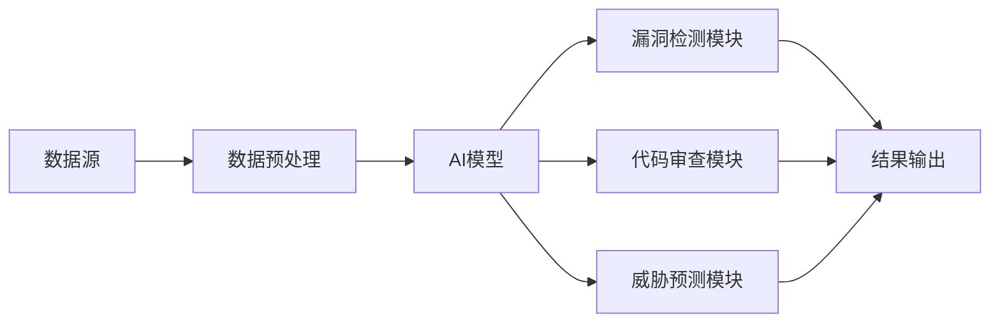

# AI在安全编程中的角色与应用

> 关键词：AI、安全编程、漏洞检测、威胁预测、代码审查

> 摘要：本文深入探讨了AI在安全编程领域的角色与应用。随着信息技术的飞速发展，软件安全问题日益突出，AI凭借其强大的数据分析和学习能力，为安全编程带来了新的解决方案。文章从背景介绍入手，阐述了目的、范围、预期读者等内容。接着详细讲解了AI与安全编程相关的核心概念及联系，分析了核心算法原理并给出具体操作步骤，同时运用数学模型和公式进行理论支持。通过项目实战案例，展示了AI在安全编程中的具体应用。还探讨了实际应用场景，推荐了相关的工具和资源。最后总结了未来发展趋势与挑战，并对常见问题进行了解答，为从事安全编程和AI技术研究的人员提供了全面的参考。

## 1. 背景介绍 
### 1.1 目的和范围
本文章旨在全面深入地探讨AI在安全编程中的角色与应用。通过对相关理论、算法、实践案例的研究和分析，揭示AI如何为安全编程提供支持，提升软件的安全性。范围涵盖了AI在安全编程各个环节的应用，包括但不限于漏洞检测、代码审查、威胁预测等，同时也涉及到相关的技术原理、工具和资源。

### 1.2 预期读者
本文预期读者主要包括安全编程领域的专业人员，如安全工程师、软件开发人员等，他们可以从文章中获取AI在安全编程中的最新应用技术和方法，提升自身的安全编程能力。同时，对AI和安全编程感兴趣的研究人员、学生也可以通过本文了解该领域的发展动态和研究方向。

### 1.3 文档结构概述
本文首先介绍背景信息，让读者了解文章的目的、范围和预期读者。接着阐述核心概念与联系，帮助读者建立起AI与安全编程的基本认知体系。然后详细讲解核心算法原理和具体操作步骤，并运用数学模型和公式进行理论支撑。通过项目实战案例，展示AI在安全编程中的实际应用过程。之后探讨实际应用场景，让读者了解AI在不同场景下的作用。推荐相关的工具和资源，为读者提供学习和实践的途径。最后总结未来发展趋势与挑战，解答常见问题，并提供扩展阅读和参考资料。

### 1.4 术语表
#### 1.4.1 核心术语定义
- **AI（Artificial Intelligence）**：人工智能，是研究、开发用于模拟、延伸和扩展人的智能的理论、方法、技术及应用系统的一门新的技术科学。
- **安全编程**：在软件开发过程中，采用一系列的技术和方法，确保软件系统具有较高的安全性，能够抵御各种安全威胁。
- **漏洞检测**：通过各种技术手段，发现软件代码中存在的安全漏洞。
- **代码审查**：对软件代码进行系统性的检查，以发现代码中的错误、潜在的安全问题和不符合编程规范的地方。
- **威胁预测**：利用数据分析和机器学习等技术，对软件系统可能面临的安全威胁进行提前预测。

#### 1.4.2 相关概念解释
- **机器学习**：是AI的一个重要分支，它通过让计算机从数据中学习模式和规律，从而实现对未知数据的预测和分类。
- **深度学习**：是一种基于神经网络的机器学习技术，具有强大的特征提取和模式识别能力，在图像识别、自然语言处理等领域取得了显著的成果。
- **神经网络**：是一种模仿人类神经系统的计算模型，由大量的神经元组成，能够自动学习数据中的特征和模式。

#### 1.4.3 缩略词列表
- **AI**：Artificial Intelligence
- **ML**：Machine Learning
- **DL**：Deep Learning
- **NLP**：Natural Language Processing

## 2. 核心概念与联系 

### 核心概念原理
在安全编程中，AI主要通过以下几种方式发挥作用。首先是机器学习算法，它可以对大量的代码数据进行学习和分析，从而发现代码中的异常模式和潜在的安全漏洞。例如，监督学习算法可以通过对已知漏洞代码和安全代码的学习，构建分类模型，对新的代码进行分类，判断其是否存在安全漏洞。

深度学习是另一种重要的AI技术，特别是在处理复杂的代码结构和语义信息时具有优势。深度学习模型可以自动提取代码中的特征，例如通过卷积神经网络（CNN）对代码的语法结构进行分析，通过循环神经网络（RNN）对代码的上下文信息进行处理。

自然语言处理（NLP）技术也可以应用于安全编程中。例如，对代码注释和文档进行分析，了解代码的功能和设计意图，从而发现可能存在的安全隐患。

### 架构的文本示意图
```plaintext
AI在安全编程中的应用架构

数据源（代码库、安全报告等）
|
|-- 数据预处理（清洗、标注等）
|
|-- AI模型（机器学习、深度学习等）
|   |
|   |-- 漏洞检测模块
|   |-- 代码审查模块
|   |-- 威胁预测模块
|
|-- 结果输出（漏洞报告、安全建议等）
```

### Mermaid流程图


## 3. 核心算法原理 & 具体操作步骤 

### 核心算法原理
#### 机器学习算法 - 支持向量机（SVM）
支持向量机是一种常用的监督学习算法，它的基本思想是在特征空间中找到一个最优的超平面，将不同类别的样本分开。在安全编程的漏洞检测中，可以将代码的特征向量作为输入，将是否存在漏洞作为输出类别。

Python代码实现：
```python
from sklearn import svm
from sklearn.model_selection import train_test_split
from sklearn.metrics import accuracy_score
import numpy as np

# 生成示例数据
X = np.random.rand(100, 10)  # 100个样本，每个样本10个特征
y = np.random.randint(0, 2, 100)  # 随机生成0或1的标签

# 划分训练集和测试集
X_train, X_test, y_train, y_test = train_test_split(X, y, test_size=0.2, random_state=42)

# 创建SVM分类器
clf = svm.SVC(kernel='linear')

# 训练模型
clf.fit(X_train, y_train)

# 预测
y_pred = clf.predict(X_test)

# 计算准确率
accuracy = accuracy_score(y_test, y_pred)
print(f"Accuracy: {accuracy}")
```

#### 深度学习算法 - 卷积神经网络（CNN）
卷积神经网络主要用于处理具有网格结构的数据，如图像和代码。在安全编程中，可以将代码看作是一种二维的文本矩阵，通过卷积层提取代码的特征。

Python代码实现：
```python
import tensorflow as tf
from tensorflow.keras import layers, models

# 生成示例数据
input_shape = (100, 10, 1)  # 输入数据的形状
num_classes = 2  # 类别数

# 构建CNN模型
model = models.Sequential()
model.add(layers.Conv2D(32, (3, 3), activation='relu', input_shape=input_shape))
model.add(layers.MaxPooling2D((2, 2)))
model.add(layers.Flatten())
model.add(layers.Dense(64, activation='relu'))
model.add(layers.Dense(num_classes, activation='softmax'))

# 编译模型
model.compile(optimizer='adam',
              loss='sparse_categorical_crossentropy',
              metrics=['accuracy'])

# 生成随机数据进行训练
x_train = tf.random.normal((1000, 100, 10, 1))
y_train = tf.random.uniform((1000,), maxval=num_classes, dtype=tf.int32)

# 训练模型
model.fit(x_train, y_train, epochs=5, batch_size=32)
```

### 具体操作步骤
1. **数据收集**：收集大量的代码数据，包括安全代码和存在漏洞的代码。
2. **数据预处理**：对收集到的数据进行清洗、标注等操作，将代码转换为适合机器学习模型输入的格式。
3. **模型选择**：根据具体的任务和数据特点，选择合适的AI模型，如SVM、CNN等。
4. **模型训练**：使用预处理后的数据对模型进行训练，调整模型的参数，使其达到最佳性能。
5. **模型评估**：使用测试数据对训练好的模型进行评估，计算模型的准确率、召回率等指标。
6. **模型应用**：将训练好的模型应用到实际的安全编程中，进行漏洞检测、代码审查等任务。

## 4. 数学模型和公式 & 详细讲解 & 举例说明 

### 支持向量机（SVM）
#### 数学模型
支持向量机的目标是找到一个超平面 $w^T x + b = 0$，使得不同类别的样本能够被最大间隔分开。对于线性可分的数据，优化问题可以表示为：

$$
\begin{align*}
\min_{w,b} &\quad \frac{1}{2} \| w \|^2 \\
\text{s.t.} &\quad y_i (w^T x_i + b) \geq 1, \quad i = 1, \ldots, n
\end{align*}
$$

其中，$w$ 是超平面的法向量，$b$ 是偏置，$x_i$ 是第 $i$ 个样本，$y_i$ 是第 $i$ 个样本的标签（$y_i \in \{-1, 1\}$）。

#### 详细讲解
这个优化问题的目标是最小化超平面的法向量的模长，同时保证所有样本都被正确分类，并且离超平面的距离不小于1。通过引入拉格朗日乘子 $\alpha_i$，可以将上述优化问题转化为对偶问题：

$$
\begin{align*}
\max_{\alpha} &\quad \sum_{i=1}^{n} \alpha_i - \frac{1}{2} \sum_{i=1}^{n} \sum_{j=1}^{n} \alpha_i \alpha_j y_i y_j x_i^T x_j \\
\text{s.t.} &\quad \sum_{i=1}^{n} \alpha_i y_i = 0, \quad \alpha_i \geq 0, \quad i = 1, \ldots, n
\end{align*}
$$

求解对偶问题可以得到拉格朗日乘子 $\alpha_i$，进而得到超平面的法向量 $w$ 和偏置 $b$。

#### 举例说明
假设有两个样本 $x_1 = [1, 2]^T$，$y_1 = 1$ 和 $x_2 = [3, 4]^T$，$y_2 = -1$。将其代入对偶问题中，通过求解对偶问题可以得到拉格朗日乘子 $\alpha_1$ 和 $\alpha_2$，进而得到超平面的参数 $w$ 和 $b$。

### 卷积神经网络（CNN）
#### 数学模型
卷积层的数学模型可以表示为：

$$
z_{i,j}^l = \sum_{m=0}^{M-1} \sum_{n=0}^{N-1} w_{m,n}^l x_{i+m,j+n}^{l-1} + b^l
$$

其中，$z_{i,j}^l$ 是第 $l$ 层卷积层的第 $(i, j)$ 个神经元的输出，$w_{m,n}^l$ 是第 $l$ 层的卷积核，$x_{i+m,j+n}^{l-1}$ 是第 $l-1$ 层的输入，$b^l$ 是偏置。

#### 详细讲解
卷积层通过卷积操作对输入数据进行特征提取。卷积核在输入数据上滑动，与输入数据进行点积运算，得到卷积层的输出。通过多个卷积核的组合，可以提取不同的特征。

#### 举例说明
假设有一个 $3 \times 3$ 的卷积核 $w$ 和一个 $5 \times 5$ 的输入数据 $x$。卷积核在输入数据上滑动，每次滑动时与输入数据的对应区域进行点积运算，得到一个输出值。通过多次滑动，得到卷积层的输出。

## 5. 项目实战：代码实际案例和详细解释说明 

### 5.1  开发环境搭建
#### 操作系统
可以选择Windows、Linux或macOS等操作系统。这里以Ubuntu 20.04为例。

#### 编程语言和环境
使用Python 3.8及以上版本，可以通过以下命令安装Python：
```bash
sudo apt update
sudo apt install python3.8
```

#### 依赖库安装
安装必要的依赖库，如TensorFlow、Scikit-learn等：
```bash
pip install tensorflow scikit-learn
```

### 5.2  源代码详细实现和代码解读
#### 漏洞检测项目
以下是一个简单的基于支持向量机的漏洞检测项目示例：
```python
import pandas as pd
from sklearn.model_selection import train_test_split
from sklearn.svm import SVC
from sklearn.metrics import accuracy_score

# 加载数据
data = pd.read_csv('code_data.csv')
X = data.drop('label', axis=1)
y = data['label']

# 划分训练集和测试集
X_train, X_test, y_train, y_test = train_test_split(X, y, test_size=0.2, random_state=42)

# 创建SVM分类器
clf = SVC(kernel='linear')

# 训练模型
clf.fit(X_train, y_train)

# 预测
y_pred = clf.predict(X_test)

# 计算准确率
accuracy = accuracy_score(y_test, y_pred)
print(f"Accuracy: {accuracy}")
```
#### 代码解读
1. **数据加载**：使用 `pandas` 库加载代码数据，其中 `label` 列表示代码是否存在漏洞。
2. **数据划分**：使用 `train_test_split` 函数将数据划分为训练集和测试集。
3. **模型创建**：创建一个线性核的支持向量机分类器。
4. **模型训练**：使用训练集数据对模型进行训练。
5. **模型预测**：使用测试集数据对模型进行预测。
6. **结果评估**：计算模型的准确率。

### 5.3  代码解读与分析
通过上述代码，我们可以看到如何使用支持向量机进行漏洞检测。代码的核心是数据的处理和模型的训练与预测。在实际应用中，可能需要对数据进行更复杂的预处理，如特征选择、数据归一化等，以提高模型的性能。同时，也可以尝试不同的机器学习算法和模型参数，找到最优的解决方案。

## 6. 实际应用场景 
### 漏洞检测
AI可以对大量的代码进行自动扫描和分析，发现其中潜在的安全漏洞。例如，通过对代码的语法结构、语义信息进行分析，识别出可能存在的缓冲区溢出、SQL注入等漏洞。

### 代码审查
在软件开发过程中，AI可以辅助开发人员进行代码审查。通过对代码的规范性、可读性、安全性等方面进行检查，发现代码中存在的问题，并提供相应的建议和改进方案。

### 威胁预测
利用AI技术对软件系统面临的安全威胁进行预测。通过分析历史数据和实时监测数据，预测可能出现的攻击类型、攻击时间和攻击目标，提前采取防范措施。

### 安全策略制定
AI可以根据软件系统的特点和安全需求，制定个性化的安全策略。例如，根据系统的用户角色、操作权限等信息，制定访问控制策略，确保系统的安全性。

## 7. 工具和资源推荐
### 7.1 学习资源推荐
#### 7.1.1 书籍推荐
- 《人工智能：一种现代的方法》：全面介绍了人工智能的基本概念、算法和应用。
- 《机器学习》：详细讲解了机器学习的各种算法和理论。
- 《深度学习》：深入探讨了深度学习的原理和应用。

#### 7.1.2 在线课程
- Coursera上的“机器学习”课程：由Andrew Ng教授主讲，是机器学习领域的经典课程。
- edX上的“深度学习”课程：提供了深度学习的系统学习内容。
- 阿里云大学的“人工智能与安全”课程：结合实际案例，介绍了AI在安全领域的应用。

#### 7.1.3 技术博客和网站
- Medium：有很多关于AI和安全编程的优质文章。
- Towards Data Science：专注于数据科学和机器学习领域的技术分享。
- The Hacker News：提供最新的网络安全资讯和技术文章。

### 7.2 开发工具框架推荐
#### 7.2.1 IDE和编辑器
- PyCharm：功能强大的Python集成开发环境，支持代码调试、代码分析等功能。
- Visual Studio Code：轻量级的代码编辑器，具有丰富的插件生态系统。

#### 7.2.2 调试和性能分析工具
- TensorBoard：TensorFlow的可视化工具，用于调试和分析深度学习模型。
- Scikit-learn的GridSearchCV：用于模型参数调优和性能评估。

#### 7.2.3 相关框架和库
- TensorFlow：开源的深度学习框架，支持多种深度学习模型的开发和训练。
- Scikit-learn：简单易用的机器学习库，提供了丰富的机器学习算法和工具。
- NLTK：自然语言处理工具包，用于处理文本数据。

### 7.3 相关论文著作推荐
#### 7.3.1 经典论文
- “Support-Vector Networks”：介绍了支持向量机的基本原理和算法。
- “Gradient-Based Learning Applied to Document Recognition”：提出了卷积神经网络的经典结构LeNet。

#### 7.3.2 最新研究成果
- 每年的ACM SIGKDD、IEEE ICML等会议上都有很多关于AI和安全编程的最新研究成果。

#### 7.3.3 应用案例分析
- 《AI in Cybersecurity: A Practical Guide》：介绍了AI在网络安全领域的实际应用案例。

## 8. 总结：未来发展趋势与挑战
### 未来发展趋势
- **融合多种技术**：AI将与区块链、物联网等技术深度融合，为安全编程提供更全面的解决方案。
- **自动化和智能化**：安全编程过程将越来越自动化和智能化，AI可以自动完成漏洞检测、代码审查等任务。
- **实时监测和响应**：能够实时监测软件系统的安全状态，及时发现和响应安全威胁。

### 挑战
- **数据质量和隐私问题**：AI模型的训练需要大量高质量的数据，但数据的收集和使用可能涉及隐私问题。
- **对抗性攻击**：攻击者可能会利用AI技术进行对抗性攻击，使AI模型产生误判。
- **技术人才短缺**：目前掌握AI和安全编程技术的专业人才短缺，限制了该领域的发展。

## 9. 附录：常见问题与解答
### 问题1：AI在安全编程中的准确率有多高？
AI在安全编程中的准确率受到多种因素的影响，如数据质量、模型选择、特征提取等。一般来说，通过合理的数据处理和模型调优，准确率可以达到较高的水平，但不能保证100%的准确率。

### 问题2：如何选择适合的AI模型进行安全编程？
选择适合的AI模型需要考虑任务的特点、数据的类型和规模等因素。对于简单的分类任务，可以选择支持向量机、决策树等模型；对于复杂的图像和文本处理任务，可以选择深度学习模型，如卷积神经网络、循环神经网络等。

### 问题3：AI在安全编程中会完全取代人工吗？
虽然AI在安全编程中可以发挥重要作用，但目前还不能完全取代人工。人工在代码设计、安全策略制定等方面具有重要的经验和判断力，AI可以作为辅助工具，提高安全编程的效率和质量。

## 10. 扩展阅读 & 参考资料
### 扩展阅读
- 《网络安全技术与应用》：介绍了网络安全的各种技术和应用案例。
- 《信息安全数学基础》：为理解安全编程中的数学原理提供了基础。

### 参考资料
- ACM Digital Library：提供了大量的计算机科学领域的研究论文和文献。
- IEEE Xplore：电气和电子工程师协会的数字图书馆，包含了很多关于AI和安全编程的研究成果。