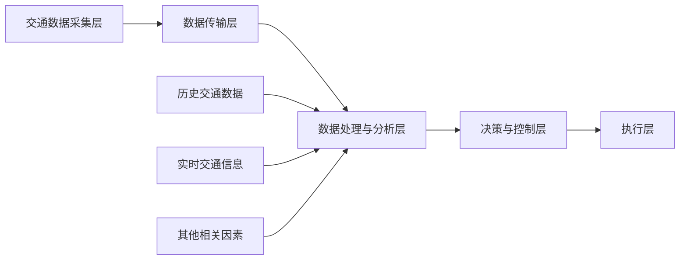

# AI在智能交通流量预测与控制中的创新应用

> 关键词：AI、智能交通、流量预测、流量控制、创新应用

> 摘要：本文深入探讨了AI在智能交通流量预测与控制中的创新应用。首先介绍了研究的背景、目的、预期读者等基本信息，接着阐述了相关核心概念及其联系，详细讲解了核心算法原理与具体操作步骤，并结合数学模型和公式进行说明。通过项目实战案例，展示了AI技术在智能交通中的实际应用。同时分析了其实际应用场景，推荐了相关的学习资源、开发工具框架和论文著作。最后总结了未来发展趋势与挑战，并提供了常见问题解答和扩展阅读参考资料，旨在为相关领域的研究者和从业者提供全面而深入的技术指导。

## 1. 背景介绍 
### 1.1 目的和范围
随着城市化进程的加速和汽车保有量的持续增长，交通拥堵问题日益严重，给人们的日常生活和经济发展带来了巨大的影响。智能交通系统作为解决交通问题的重要手段，受到了广泛的关注。本文章的目的在于探讨AI技术在智能交通流量预测与控制中的创新应用，旨在为智能交通系统的发展提供理论支持和实践指导。具体范围涵盖了AI在交通流量预测的算法原理、模型构建，以及在交通流量控制中的策略制定和实际应用等方面。

### 1.2 预期读者
本文的预期读者主要包括智能交通领域的研究者、工程师、相关专业的学生，以及对AI技术在交通领域应用感兴趣的技术爱好者。对于研究者来说，文章提供了最新的研究思路和方法；对于工程师，有助于他们在实际项目中应用AI技术解决交通流量问题；对于学生，可以作为学习智能交通和AI技术的参考资料；而对于技术爱好者，能帮助他们了解AI在交通领域的创新应用。

### 1.3 文档结构概述
本文将按照以下结构进行组织：首先介绍背景信息，让读者了解研究的目的和范围；接着阐述核心概念与联系，包括交通流量、AI算法等相关概念及其相互关系；然后详细讲解核心算法原理和具体操作步骤，并给出Python源代码示例；之后介绍数学模型和公式，结合实际例子进行说明；通过项目实战展示AI在智能交通流量预测与控制中的具体应用；分析实际应用场景，明确其应用价值；推荐相关的工具和资源，方便读者进一步学习和研究；最后总结未来发展趋势与挑战，提供常见问题解答和扩展阅读参考资料。

### 1.4 术语表
#### 1.4.1 核心术语定义
- **智能交通系统（Intelligent Transportation System，ITS）**：是将先进的信息技术、数据通信传输技术、电子传感技术、控制技术及计算机技术等有效地集成运用于整个地面交通管理系统而建立的一种在大范围内、全方位发挥作用的，实时、准确、高效的综合交通运输管理系统。
- **交通流量预测**：根据历史交通数据和实时交通信息，运用一定的方法和模型，对未来某一时间段内的交通流量进行预估的过程。
- **交通流量控制**：通过采取一系列的措施和策略，对交通流量进行调节和管理，以达到缓解交通拥堵、提高交通效率等目的。
- **人工智能（Artificial Intelligence，AI）**：是研究、开发用于模拟、延伸和扩展人的智能的理论、方法、技术及应用系统的一门新的技术科学。

#### 1.4.2 相关概念解释
- **机器学习**：是一门多领域交叉学科，涉及概率论、统计学、逼近论、凸分析、算法复杂度理论等多门学科。它专门研究计算机怎样模拟或实现人类的学习行为，以获取新的知识或技能，重新组织已有的知识结构使之不断改善自身的性能。在交通流量预测中，机器学习算法可以从大量的历史交通数据中学习模式和规律，从而进行准确的预测。
- **深度学习**：是机器学习的一个分支领域，它是一种基于对数据进行表征学习的方法。深度学习通过构建具有很多层的神经网络模型，自动从数据中学习到更高级、更抽象的特征表示。在交通流量预测中，深度学习模型可以处理复杂的时空数据，提高预测的准确性。

#### 1.4.3 缩略词列表
- **ITS**：Intelligent Transportation System（智能交通系统）
- **AI**：Artificial Intelligence（人工智能）
- **ML**：Machine Learning（机器学习）
- **DL**：Deep Learning（深度学习）

## 2. 核心概念与联系 

### 核心概念原理
#### 交通流量
交通流量是指在单位时间内通过道路某一断面的车辆数、行人数或货物运输量等。它是衡量交通状况的重要指标，受到多种因素的影响，如时间（工作日、周末、节假日等）、天气（晴天、雨天、雪天等）、地理位置（商业区、住宅区、学校周边等）。交通流量具有明显的时空特征，在不同的时间段和地理位置上，交通流量会呈现出不同的变化规律。

#### AI在交通流量预测中的应用原理
AI在交通流量预测中主要利用机器学习和深度学习算法，通过对大量的历史交通数据进行分析和学习，挖掘数据中的模式和规律，从而建立预测模型。这些模型可以根据实时的交通信息和其他相关因素，对未来的交通流量进行预测。例如，基于时间序列分析的方法可以利用历史交通流量数据的时间相关性进行预测；基于神经网络的方法可以处理复杂的非线性关系，提高预测的准确性。

#### AI在交通流量控制中的应用原理
AI在交通流量控制中主要通过实时监测交通流量信息，利用智能算法对交通状况进行评估和分析，然后制定相应的控制策略。例如，根据交通流量的变化实时调整信号灯的配时，实现动态交通控制；通过智能诱导系统引导车辆选择最优的行驶路线，缓解交通拥堵。

### 架构的文本示意图
以下是AI在智能交通流量预测与控制中的架构示意图：

交通数据采集层：通过各种传感器（如地磁传感器、摄像头、GPS等）收集交通流量、车速、车辆位置等实时数据。

数据传输层：将采集到的交通数据通过有线或无线通信网络传输到数据处理中心。

数据处理与分析层：对传输过来的交通数据进行清洗、预处理和特征提取，然后利用AI算法（如机器学习、深度学习）建立交通流量预测模型和交通控制策略模型。

决策与控制层：根据预测模型和控制策略模型的输出结果，制定交通控制决策，如调整信号灯配时、发布交通诱导信息等。

执行层：通过交通信号控制系统、可变情报板等设备执行交通控制决策，实现对交通流量的控制。

### Mermaid流程图


## 3. 核心算法原理 & 具体操作步骤 

### 核心算法原理
#### 时间序列分析算法
时间序列分析是一种基于历史数据的统计方法，它假设未来的交通流量与过去的交通流量存在一定的相关性。常见的时间序列分析算法有自回归积分滑动平均模型（ARIMA）。

ARIMA模型的基本思想是将时间序列分解为自回归（AR）部分、差分（I）部分和滑动平均（MA）部分。其数学表达式为：

$ARIMA(p,d,q)$

其中，$p$ 是自回归阶数，$d$ 是差分阶数，$q$ 是滑动平均阶数。

#### 神经网络算法
神经网络是一种模仿人类神经系统的计算模型，它由大量的神经元组成，可以自动从数据中学习到复杂的非线性关系。在交通流量预测中，常用的神经网络模型有多层感知机（MLP）、长短期记忆网络（LSTM）等。

LSTM是一种特殊的循环神经网络，它可以处理序列数据中的长期依赖关系。LSTM的核心是记忆单元，通过输入门、遗忘门和输出门来控制信息的流入、流出和保留。

### 具体操作步骤
#### 数据收集与预处理
- 收集历史交通流量数据，包括车流量、车速、车辆密度等信息。
- 对收集到的数据进行清洗，去除噪声和异常值。
- 对数据进行归一化处理，将数据缩放到一个合适的范围，以提高模型的训练效果。

#### 模型选择与训练
- 根据数据的特点和预测需求，选择合适的算法模型，如ARIMA、LSTM等。
- 将预处理后的数据划分为训练集和测试集，一般按照70% - 30%的比例进行划分。
- 使用训练集对模型进行训练，调整模型的参数，以最小化预测误差。

#### 模型评估与优化
- 使用测试集对训练好的模型进行评估，计算预测误差指标，如均方误差（MSE）、平均绝对误差（MAE）等。
- 根据评估结果，对模型进行优化，如调整模型的参数、增加训练数据等。

#### 预测与控制
- 使用优化后的模型对未来的交通流量进行预测。
- 根据预测结果，制定相应的交通控制策略，如调整信号灯配时、发布交通诱导信息等。

### Python源代码示例
以下是一个使用LSTM模型进行交通流量预测的Python代码示例：

```python
import numpy as np
import pandas as pd
from sklearn.preprocessing import MinMaxScaler
from keras.models import Sequential
from keras.layers import LSTM, Dense

# 读取数据
data = pd.read_csv('traffic_data.csv')
traffic_flow = data['traffic_flow'].values.reshape(-1, 1)

# 数据归一化
scaler = MinMaxScaler(feature_range=(0, 1))
traffic_flow_scaled = scaler.fit_transform(traffic_flow)

# 划分训练集和测试集
train_size = int(len(traffic_flow_scaled) * 0.7)
train_data = traffic_flow_scaled[:train_size]
test_data = traffic_flow_scaled[train_size:]

# 准备训练数据
def create_dataset(dataset, time_step=1):
    X, Y = [], []
    for i in range(len(dataset)-time_step-1):
        a = dataset[i:(i+time_step), 0]
        X.append(a)
        Y.append(dataset[i + time_step, 0])
    return np.array(X), np.array(Y)

time_step = 100
X_train, y_train = create_dataset(train_data, time_step)
X_test, y_test = create_dataset(test_data, time_step)

# 调整数据形状以适应LSTM输入
X_train = X_train.reshape(X_train.shape[0], X_train.shape[1], 1)
X_test = X_test.reshape(X_test.shape[0], X_test.shape[1], 1)

# 构建LSTM模型
model = Sequential()
model.add(LSTM(50, return_sequences=True, input_shape=(time_step, 1)))
model.add(LSTM(50, return_sequences=True))
model.add(LSTM(50))
model.add(Dense(1))
model.compile(optimizer='adam', loss='mean_squared_error')

# 训练模型
model.fit(X_train, y_train, epochs=100, batch_size=64, verbose=1)

# 进行预测
train_predict = model.predict(X_train)
test_predict = model.predict(X_test)

# 反归一化
train_predict = scaler.inverse_transform(train_predict)
test_predict = scaler.inverse_transform(test_predict)
```

## 4. 数学模型和公式 & 详细讲解 & 举例说明 

### ARIMA模型
#### 数学公式
ARIMA(p,d,q)模型的数学表达式为：

$\phi(B)(1 - B)^d y_t = \theta(B) \epsilon_t$

其中，$y_t$ 是时间序列在时刻 $t$ 的值，$B$ 是滞后算子，即 $B y_t = y_{t-1}$，$\phi(B) = 1 - \phi_1 B - \cdots - \phi_p B^p$ 是自回归多项式，$\theta(B) = 1 + \theta_1 B + \cdots + \theta_q B^q$ 是滑动平均多项式，$\epsilon_t$ 是白噪声序列。

#### 详细讲解
- **自回归部分（AR）**：表示当前时刻的交通流量与过去若干时刻的交通流量之间的线性关系。自回归阶数 $p$ 表示考虑的过去时刻的数量。
- **差分部分（I）**：用于处理非平稳时间序列。差分阶数 $d$ 表示对时间序列进行差分的次数，以使其变为平稳序列。
- **滑动平均部分（MA）**：表示当前时刻的交通流量与过去若干时刻的白噪声之间的线性关系。滑动平均阶数 $q$ 表示考虑的过去白噪声的数量。

#### 举例说明
假设我们有一个交通流量时间序列 $y_t$，我们要使用ARIMA(2,1,1)模型进行预测。首先，对时间序列进行一阶差分，得到平稳序列：

$y_t' = (1 - B) y_t = y_t - y_{t-1}$

然后，建立自回归和滑动平均模型：

$(1 - \phi_1 B - \phi_2 B^2) y_t' = (1 + \theta_1 B) \epsilon_t$

通过最小化预测误差，估计模型的参数 $\phi_1$，$\phi_2$ 和 $\theta_1$，然后使用估计的参数对未来的交通流量进行预测。

### LSTM模型
#### 数学公式
LSTM单元的主要计算步骤如下：

- 遗忘门：$f_t = \sigma(W_f [h_{t-1}, x_t] + b_f)$
- 输入门：$i_t = \sigma(W_i [h_{t-1}, x_t] + b_i)$
- 细胞状态更新：$\tilde{C}_t = \tanh(W_C [h_{t-1}, x_t] + b_C)$
- 细胞状态更新：$C_t = f_t \odot C_{t-1} + i_t \odot \tilde{C}_t$
- 输出门：$o_t = \sigma(W_o [h_{t-1}, x_t] + b_o)$
- 隐藏状态更新：$h_t = o_t \odot \tanh(C_t)$

其中，$x_t$ 是输入向量，$h_{t-1}$ 是上一时刻的隐藏状态，$C_{t-1}$ 是上一时刻的细胞状态，$\sigma$ 是 sigmoid 函数，$\tanh$ 是双曲正切函数，$\odot$ 表示逐元素相乘，$W_f$，$W_i$，$W_C$，$W_o$ 是权重矩阵，$b_f$，$b_i$，$b_C$，$b_o$ 是偏置向量。

#### 详细讲解
- **遗忘门**：决定上一时刻的细胞状态 $C_{t-1}$ 中有多少信息需要被遗忘。
- **输入门**：决定当前输入 $x_t$ 中有多少信息需要被添加到细胞状态中。
- **细胞状态更新**：更新细胞状态 $C_t$，结合了遗忘门和输入门的输出。
- **输出门**：决定当前细胞状态 $C_t$ 中有多少信息需要被输出到隐藏状态 $h_t$ 中。

#### 举例说明
假设我们要使用LSTM模型对交通流量进行预测。我们将过去一段时间的交通流量数据作为输入 $x_t$，通过LSTM单元的计算，得到隐藏状态 $h_t$。然后，将隐藏状态 $h_t$ 输入到一个全连接层中，得到预测的交通流量值。

## 5. 项目实战：代码实际案例和详细解释说明 

### 5.1  开发环境搭建
#### 安装Python
首先，需要安装Python编程语言。可以从Python官方网站（https://www.python.org/downloads/）下载适合自己操作系统的Python版本，并按照安装向导进行安装。

#### 安装必要的库
在命令行中使用以下命令安装必要的库：

```sh
pip install numpy pandas scikit-learn keras tensorflow
```

- **numpy**：用于进行数值计算。
- **pandas**：用于数据处理和分析。
- **scikit-learn**：提供了各种机器学习算法和工具。
- **keras**：一个高级神经网络API，用于构建和训练神经网络模型。
- **tensorflow**：一个开源的机器学习框架，是keras的后端。

### 5.2  源代码详细实现和代码解读
以下是一个完整的使用LSTM模型进行交通流量预测的代码示例，并对代码进行详细解读：

```python
import numpy as np
import pandas as pd
from sklearn.preprocessing import MinMaxScaler
from keras.models import Sequential
from keras.layers import LSTM, Dense
import matplotlib.pyplot as plt

# 读取数据
data = pd.read_csv('traffic_data.csv')
traffic_flow = data['traffic_flow'].values.reshape(-1, 1)

# 代码解读：使用pandas库的read_csv函数读取交通流量数据文件，并将交通流量列转换为一维数组。

# 数据归一化
scaler = MinMaxScaler(feature_range=(0, 1))
traffic_flow_scaled = scaler.fit_transform(traffic_flow)

# 代码解读：使用MinMaxScaler对交通流量数据进行归一化处理，将数据缩放到0到1的范围内。

# 划分训练集和测试集
train_size = int(len(traffic_flow_scaled) * 0.7)
train_data = traffic_flow_scaled[:train_size]
test_data = traffic_flow_scaled[train_size:]

# 代码解读：将归一化后的数据按照70%和30%的比例划分为训练集和测试集。

# 准备训练数据
def create_dataset(dataset, time_step=1):
    X, Y = [], []
    for i in range(len(dataset)-time_step-1):
        a = dataset[i:(i+time_step), 0]
        X.append(a)
        Y.append(dataset[i + time_step, 0])
    return np.array(X), np.array(Y)

time_step = 100
X_train, y_train = create_dataset(train_data, time_step)
X_test, y_test = create_dataset(test_data, time_step)

# 代码解读：定义create_dataset函数，将时间序列数据转换为适合LSTM模型输入的格式。time_step表示时间步长，即使用过去多少个时间点的数据来预测下一个时间点的数据。

# 调整数据形状以适应LSTM输入
X_train = X_train.reshape(X_train.shape[0], X_train.shape[1], 1)
X_test = X_test.reshape(X_test.shape[0], X_test.shape[1], 1)

# 代码解读：LSTM模型的输入需要是三维数组，因此将训练集和测试集的数据转换为三维形状。

# 构建LSTM模型
model = Sequential()
model.add(LSTM(50, return_sequences=True, input_shape=(time_step, 1)))
model.add(LSTM(50, return_sequences=True))
model.add(LSTM(50))
model.add(Dense(1))
model.compile(optimizer='adam', loss='mean_squared_error')

# 代码解读：使用Sequential模型构建LSTM模型，添加三个LSTM层和一个全连接层。return_sequences=True表示返回每个时间步的输出，用于堆叠多个LSTM层。使用adam优化器和均方误差损失函数进行模型编译。

# 训练模型
model.fit(X_train, y_train, epochs=100, batch_size=64, verbose=1)

# 代码解读：使用训练集对模型进行训练，设置训练轮数为100，批次大小为64。

# 进行预测
train_predict = model.predict(X_train)
test_predict = model.predict(X_test)

# 代码解读：使用训练好的模型对训练集和测试集进行预测。

# 反归一化
train_predict = scaler.inverse_transform(train_predict)
test_predict = scaler.inverse_transform(test_predict)

# 代码解读：将预测结果进行反归一化处理，得到实际的交通流量值。

# 绘制预测结果
look_back = time_step
trainPredictPlot = np.empty_like(traffic_flow)
trainPredictPlot[:, :] = np.nan
trainPredictPlot[look_back:len(train_predict)+look_back, :] = train_predict

testPredictPlot = np.empty_like(traffic_flow)
testPredictPlot[:, :] = np.nan
testPredictPlot[len(train_predict)+(look_back*2)+1:len(traffic_flow)-1, :] = test_predict

plt.plot(traffic_flow, label='Actual Traffic Flow')
plt.plot(trainPredictPlot, label='Train Predict')
plt.plot(testPredictPlot, label='Test Predict')
plt.legend()
plt.show()
```

### 5.3  代码解读与分析
#### 数据处理部分
通过读取交通流量数据文件，并进行归一化处理，将数据转换为适合模型输入的格式。归一化处理可以提高模型的训练效果，避免数据的尺度差异对模型训练造成影响。

#### 模型构建部分
使用Sequential模型构建了一个包含三个LSTM层和一个全连接层的神经网络模型。LSTM层可以处理序列数据中的长期依赖关系，全连接层用于输出预测结果。

#### 模型训练部分
使用训练集对模型进行训练，设置了训练轮数和批次大小。训练轮数表示模型对整个训练集进行训练的次数，批次大小表示每次训练使用的数据样本数量。

#### 预测与可视化部分
使用训练好的模型对训练集和测试集进行预测，并将预测结果进行反归一化处理。最后，使用matplotlib库绘制实际交通流量和预测交通流量的折线图，直观地展示模型的预测效果。

## 6. 实际应用场景 
### 城市交通信号控制
AI技术可以根据实时的交通流量预测结果，动态调整交通信号灯的配时。例如，在交通流量较大的路口，增加绿灯时间，减少红灯时间，以提高路口的通行能力；在交通流量较小的路口，适当缩短绿灯时间，提高信号灯的整体效率。这样可以有效地缓解城市交通拥堵，提高交通运行效率。

### 高速公路交通管理
在高速公路上，AI可以实时监测交通流量、车速等信息，预测交通拥堵的发生概率。当预测到可能出现交通拥堵时，及时发布交通诱导信息，引导车辆选择合适的车道和行驶速度，避免交通拥堵的进一步恶化。同时，AI还可以根据交通流量情况，自动调整高速公路的收费政策，鼓励车辆在交通流量较小的时段出行。

### 智能停车管理
AI技术可以通过对停车场周边的交通流量进行预测，合理安排停车场的车位资源。例如，根据预测的交通流量和停车场的实时车位信息，引导驾驶员快速找到空闲的车位，提高停车场的利用率。此外，AI还可以实现停车场的自动收费和管理，提高停车管理的效率和便利性。

### 公共交通规划与调度
在公共交通领域，AI可以根据交通流量预测结果，优化公交线路的规划和调度。例如，根据不同时间段的交通流量变化，调整公交车的发车频率和行驶路线，提高公共交通的服务质量和运营效率。同时，AI还可以为乘客提供实时的公交信息，方便乘客合理安排出行时间。

## 7. 工具和资源推荐
### 7.1 学习资源推荐
#### 7.1.1 书籍推荐
- 《Python机器学习》：本书全面介绍了Python在机器学习领域的应用，包括数据预处理、模型选择、算法实现等方面的内容，适合初学者入门。
- 《深度学习》：由深度学习领域的三位权威专家Ian Goodfellow、Yoshua Bengio和Aaron Courville撰写，是深度学习领域的经典教材，深入讲解了深度学习的理论和实践。
- 《智能交通系统概论》：系统介绍了智能交通系统的基本概念、技术原理和应用案例，对于了解智能交通领域有很大的帮助。

#### 7.1.2 在线课程
- Coursera上的“机器学习”课程：由斯坦福大学教授Andrew Ng主讲，是机器学习领域的经典课程，课程内容丰富，讲解详细。
- edX上的“深度学习”课程：由多家知名高校和机构联合推出，涵盖了深度学习的各个方面，包括神经网络、卷积神经网络、循环神经网络等。
- 中国大学MOOC上的“智能交通系统”课程：由国内高校的专家教授授课，介绍了智能交通系统的最新技术和应用。

#### 7.1.3 技术博客和网站
- Medium：是一个汇聚了众多技术专家和爱好者的平台，上面有很多关于AI、智能交通等领域的优质文章。
- 机器之心：专注于人工智能领域的技术资讯和研究成果，提供了大量的AI技术文章和案例分析。
- 智能交通网：是国内智能交通领域的专业网站，提供了智能交通行业的最新动态、技术应用和政策法规等信息。

### 7.2 开发工具框架推荐
#### 7.2.1 IDE和编辑器
- PyCharm：是一款专门为Python开发设计的集成开发环境，具有代码自动补全、调试、版本控制等功能，提高了开发效率。
- Jupyter Notebook：是一个交互式的开发环境，适合进行数据探索、模型实验和代码演示。可以将代码、文本、图表等内容整合在一个文档中，方便分享和交流。
- Visual Studio Code：是一款轻量级的代码编辑器，支持多种编程语言和插件扩展，具有丰富的代码编辑和调试功能。

#### 7.2.2 调试和性能分析工具
- TensorBoard：是TensorFlow提供的一个可视化工具，可以用于监控模型的训练过程、可视化模型的结构和性能指标等。
- PyTorch Profiler：是PyTorch提供的性能分析工具，可以帮助开发者分析模型的性能瓶颈，优化代码性能。
- cProfile：是Python标准库中的一个性能分析工具，可以统计程序中各个函数的执行时间和调用次数，帮助开发者找出性能问题。

#### 7.2.3 相关框架和库
- TensorFlow：是一个开源的机器学习框架，提供了丰富的API和工具，支持深度学习模型的构建、训练和部署。
- PyTorch：是另一个流行的深度学习框架，具有动态图机制，易于使用和调试，受到了很多研究者和开发者的喜爱。
- Scikit-learn：是一个简单而有效的机器学习库，提供了各种机器学习算法和工具，如分类、回归、聚类等。

### 7.3 相关论文著作推荐
#### 7.3.1 经典论文
- “Long Short-Term Memory”：由Sepp Hochreiter和Jürgen Schmidhuber发表，介绍了LSTM模型的基本原理和应用，是LSTM领域的经典论文。
- “Gradient-based learning applied to document recognition”：由Yann LeCun等人发表，提出了卷积神经网络（CNN）的概念，为深度学习在图像识别领域的应用奠定了基础。
- “Intelligent Transportation Systems: A Review of the State of the Art”：对智能交通系统的发展现状和趋势进行了全面的综述，是智能交通领域的重要论文。

#### 7.3.2 最新研究成果
- 可以通过IEEE Xplore、ACM Digital Library等学术数据库搜索关于AI在智能交通领域的最新研究论文，了解该领域的前沿技术和研究动态。

#### 7.3.3 应用案例分析
- 一些知名的研究机构和企业会发布关于AI在智能交通领域的应用案例报告，如IBM、Google等公司的相关报告，可以从中了解AI技术在实际项目中的应用效果和经验教训。

## 8. 总结：未来发展趋势与挑战
### 未来发展趋势
#### 多模态数据融合
未来，AI在智能交通流量预测与控制中将更加注重多模态数据的融合。除了传统的交通流量数据，还将融合视频图像、传感器数据、社交媒体数据等多种类型的数据，以获取更全面、准确的交通信息，提高预测和控制的精度。

#### 边缘计算与云计算结合
边缘计算可以在数据采集端进行实时数据处理和分析，减少数据传输延迟，提高系统的响应速度。云计算则可以提供强大的计算资源和存储能力，用于大规模数据的处理和模型训练。未来，边缘计算与云计算将深度结合，实现智能交通系统的高效运行。

#### 智能网联汽车与智能交通系统的融合
随着智能网联汽车的发展，车辆与车辆、车辆与基础设施之间的通信将更加频繁和高效。智能网联汽车可以实时获取交通信息，并根据交通状况自动调整行驶策略。未来，智能网联汽车将与智能交通系统深度融合，实现更加智能、高效的交通流量预测与控制。

### 挑战
#### 数据安全与隐私保护
智能交通系统涉及大量的个人和车辆信息，数据安全和隐私保护是一个重要的挑战。需要采取有效的技术手段和管理措施，确保数据的安全性和隐私性，防止数据泄露和滥用。

#### 模型可解释性
AI模型，尤其是深度学习模型，往往是黑盒模型，难以解释其决策过程和结果。在智能交通领域，模型的可解释性非常重要，因为交通决策直接影响到人们的生命财产安全。需要研究和开发可解释的AI模型，提高模型的可信度和可靠性。

#### 技术标准和规范的统一
目前，智能交通领域的技术标准和规范还不够统一，不同的系统和设备之间存在兼容性问题。需要制定统一的技术标准和规范，促进智能交通系统的互联互通和协同发展。

## 9. 附录：常见问题与解答
### 问题1：如何选择合适的AI算法进行交通流量预测？
解答：选择合适的AI算法需要考虑多个因素，如数据的特点、预测的精度要求、计算资源等。如果数据具有明显的时间序列特征，可以选择时间序列分析算法，如ARIMA；如果数据具有复杂的非线性关系，可以选择神经网络算法，如LSTM。此外，还可以通过实验比较不同算法的性能，选择最优的算法。

### 问题2：交通流量预测的精度受哪些因素影响？
解答：交通流量预测的精度受多种因素影响，包括数据质量、算法选择、模型参数调整、外部环境因素等。数据质量是影响预测精度的关键因素之一，如果数据存在噪声、缺失值等问题，会降低预测的准确性。算法选择和模型参数调整也会影响预测精度，不同的算法和参数设置适用于不同的数据和问题。此外，外部环境因素，如天气、突发事件等，也会对交通流量产生影响，增加预测的难度。

### 问题3：如何评估交通流量预测模型的性能？
解答：可以使用多种指标来评估交通流量预测模型的性能，如均方误差（MSE）、平均绝对误差（MAE）、均方根误差（RMSE）、平均绝对百分比误差（MAPE）等。这些指标可以衡量预测值与实际值之间的差异，值越小表示模型的性能越好。此外，还可以通过可视化的方法，如绘制预测结果与实际值的折线图，直观地观察模型的预测效果。

### 问题4：AI在交通流量控制中的应用面临哪些挑战？
解答：AI在交通流量控制中的应用面临多个挑战，包括数据安全与隐私保护、模型可解释性、系统的可靠性和稳定性等。数据安全与隐私保护是一个重要的问题，需要确保交通数据的安全性和隐私性。模型可解释性也是一个挑战，需要让决策者能够理解AI模型的决策过程和结果。此外，系统的可靠性和稳定性也至关重要，需要保证交通控制策略的准确性和及时性。

## 10. 扩展阅读 & 参考资料
### 扩展阅读
- 《交通工程学》：深入介绍了交通工程的基本原理和方法，对于理解交通流量的产生和分布规律有很大的帮助。
- 《人工智能：一种现代的方法》：全面介绍了人工智能的各个领域，包括搜索算法、知识表示、机器学习等，为深入学习AI技术提供了理论基础。
- 《智能交通技术与应用》：详细介绍了智能交通领域的各种技术和应用案例，包括交通信号控制、智能停车管理、公共交通调度等。

### 参考资料
- 相关的学术论文和研究报告，可以从IEEE Xplore、ACM Digital Library、CNKI等学术数据库中获取。
- 智能交通领域的行业标准和规范，如《智能交通系统术语》、《交通信号控制机与上位机间的数据通信协议》等。
- 官方网站和行业资讯平台，如中国智能交通协会官网、智能交通网等，提供了智能交通领域的最新动态和政策法规。