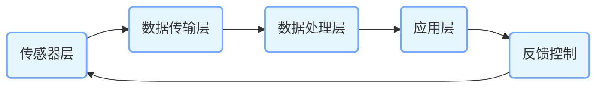

# AI在智能建筑室内空气质量优化中的多传感器融合应用

> 关键词：AI、智能建筑、室内空气质量优化、多传感器融合、传感器数据处理

> 摘要：本文聚焦于AI在智能建筑室内空气质量优化中的多传感器融合应用。详细介绍了相关背景知识，包括目的、预期读者等。深入探讨了核心概念与联系，阐述了多传感器融合的原理和架构。通过Python代码讲解了核心算法原理及具体操作步骤，给出了相关数学模型和公式并举例说明。进行了项目实战，包括开发环境搭建、源代码实现与解读。分析了实际应用场景，推荐了相关工具和资源，最后总结了未来发展趋势与挑战，并对常见问题进行了解答。旨在为智能建筑领域的室内空气质量优化提供全面、深入的技术参考。

## 1. 背景介绍 
### 1.1 目的和范围
本文章的主要目的是深入探讨AI在智能建筑室内空气质量优化中多传感器融合的应用。随着人们对生活和工作环境质量要求的不断提高，室内空气质量成为了一个备受关注的问题。智能建筑的发展为解决这一问题提供了新的途径，而多传感器融合结合AI技术能够更准确、全面地监测和优化室内空气质量。本文将涵盖从核心概念、算法原理到实际应用案例的多个方面，旨在为相关领域的研究人员、工程师和从业者提供系统的知识和实践指导。

### 1.2 预期读者
预期读者包括智能建筑领域的研究人员，他们可以从本文中获取最新的研究思路和方法；建筑工程师和设计师，能够了解如何将AI和多传感器融合技术应用到实际的建筑设计和施工中；以及对室内空气质量监测和优化感兴趣的技术爱好者，通过本文可以深入了解相关技术的原理和应用。

### 1.3 文档结构概述
本文将按照以下结构进行组织：首先介绍背景知识，包括目的、预期读者和文档结构概述等；接着阐述核心概念与联系，展示相关的原理和架构；然后详细讲解核心算法原理及具体操作步骤，通过Python代码进行说明；再给出数学模型和公式，并举例说明；进行项目实战，包括开发环境搭建、源代码实现和解读；分析实际应用场景；推荐相关的工具和资源；最后总结未来发展趋势与挑战，解答常见问题，并提供扩展阅读和参考资料。

### 1.4 术语表
#### 1.4.1 核心术语定义
- **AI（Artificial Intelligence）**：人工智能，是研究、开发用于模拟、延伸和扩展人的智能的理论、方法、技术及应用系统的一门新的技术科学。
- **智能建筑**：以建筑为平台，兼备建筑设备、办公自动化及通信网络系统，集结构、系统、服务、管理及它们之间的最优化组合，向人们提供一个安全、高效、舒适、便利的建筑环境。
- **室内空气质量（IAQ，Indoor Air Quality）**：指在某个具体的环境内，空气中某些要素对人群工作、生活适宜程度的影响，反映了人们的具体要求而形成的一种概念。
- **多传感器融合**：将来自多个传感器的数据进行综合处理，以获得更准确、全面的信息。

#### 1.4.2 相关概念解释
- **传感器**：是一种检测装置，能感受到被测量的信息，并能将感受到的信息，按一定规律变换成为电信号或其他所需形式的信息输出，以满足信息的传输、处理、存储、显示、记录和控制等要求。
- **数据融合**：是一种多层次、多方面的处理过程，这个过程是对多源数据进行检测、关联、估计和组合以提高状态和身份估计的精度，以及对战场态势和威胁及其重要程度进行适时的完整评价。

#### 1.4.3 缩略词列表
- **AI**：Artificial Intelligence
- **IAQ**：Indoor Air Quality
- **MEMS**：Micro - Electro - Mechanical Systems（微机电系统）

## 2. 核心概念与联系 

### 核心概念原理
在智能建筑室内空气质量优化中，多传感器融合是关键技术之一。不同类型的传感器可以测量室内空气质量的不同参数，例如，二氧化碳传感器可以测量室内二氧化碳浓度，甲醛传感器可以检测甲醛含量，温湿度传感器可以测量温度和湿度等。然而，单个传感器的数据可能存在误差或局限性，多传感器融合的原理就是将多个传感器的数据进行综合处理，以提高数据的准确性和可靠性。

具体来说，多传感器融合可以分为三个层次：数据层融合、特征层融合和决策层融合。数据层融合是直接对原始传感器数据进行融合，这种方法保留了最多的原始信息，但处理复杂度较高。特征层融合是先从传感器数据中提取特征，然后对这些特征进行融合，减少了数据量，提高了处理效率。决策层融合是每个传感器先进行独立决策，然后将这些决策结果进行融合，这种方法对传感器的独立性要求较高。

### 架构的文本示意图
智能建筑室内空气质量优化的多传感器融合架构主要包括传感器层、数据传输层、数据处理层和应用层。

- **传感器层**：由各种类型的传感器组成，如二氧化碳传感器、甲醛传感器、温湿度传感器等，负责实时采集室内空气质量相关的数据。
- **数据传输层**：将传感器采集到的数据传输到数据处理层，可以采用有线或无线通信方式，如以太网、Wi - Fi、ZigBee等。
- **数据处理层**：对传输过来的数据进行融合处理，包括数据清洗、特征提取、数据融合等操作，通常使用AI算法进行处理。
- **应用层**：根据处理后的数据进行室内空气质量的评估和优化决策，如控制通风设备、调节空调等。

### Mermaid流程图


该流程图展示了智能建筑室内空气质量优化的多传感器融合系统的基本流程。传感器层采集数据，通过数据传输层将数据传递到数据处理层，数据处理层进行融合处理后将结果发送到应用层，应用层根据结果进行反馈控制，调节室内环境，同时反馈控制的结果又会影响传感器层的数据采集。

## 3. 核心算法原理 & 具体操作步骤 

### 核心算法原理
在多传感器融合中，常用的算法有卡尔曼滤波算法和神经网络算法。这里以卡尔曼滤波算法为例进行讲解。

卡尔曼滤波算法是一种递归的最优线性估计方法，它通过预测和更新两个步骤来估计系统的状态。在多传感器融合中，卡尔曼滤波可以用于融合多个传感器的数据，以提高状态估计的准确性。

假设我们有一个离散时间系统，其状态方程和观测方程分别为：

状态方程：$x_{k}=Ax_{k - 1}+Bu_{k}+w_{k}$

观测方程：$z_{k}=Hx_{k}+v_{k}$

其中，$x_{k}$ 是系统在时刻 $k$ 的状态向量，$A$ 是状态转移矩阵，$B$ 是控制输入矩阵，$u_{k}$ 是控制输入向量，$w_{k}$ 是过程噪声，服从均值为零、协方差为 $Q$ 的高斯分布；$z_{k}$ 是观测向量，$H$ 是观测矩阵，$v_{k}$ 是观测噪声，服从均值为零、协方差为 $R$ 的高斯分布。

卡尔曼滤波的步骤如下：

1. **预测步骤**：
    - 预测状态：$\hat{x}_{k|k - 1}=A\hat{x}_{k - 1|k - 1}+Bu_{k}$
    - 预测协方差：$P_{k|k - 1}=AP_{k - 1|k - 1}A^{T}+Q$

2. **更新步骤**：
    - 计算卡尔曼增益：$K_{k}=P_{k|k - 1}H^{T}(HP_{k|k - 1}H^{T}+R)^{-1}$
    - 更新状态：$\hat{x}_{k|k}=\hat{x}_{k|k - 1}+K_{k}(z_{k}-H\hat{x}_{k|k - 1})$
    - 更新协方差：$P_{k|k}=(I - K_{k}H)P_{k|k - 1}$

### 具体操作步骤及Python代码实现
以下是一个使用Python实现卡尔曼滤波进行多传感器融合的示例代码：

```python
import numpy as np

def kalman_filter(z, A, H, Q, R, x0, P0):
    """
    卡尔曼滤波函数
    :param z: 观测值
    :param A: 状态转移矩阵
    :param H: 观测矩阵
    :param Q: 过程噪声协方差
    :param R: 观测噪声协方差
    :param x0: 初始状态
    :param P0: 初始协方差
    :return: 滤波后的状态
    """
    n_steps = len(z)
    n_states = len(x0)
    x = np.zeros((n_steps, n_states))
    P = np.zeros((n_steps, n_states, n_states))
    x[0] = x0
    P[0] = P0

    for k in range(1, n_steps):
        # 预测步骤
        x_pred = np.dot(A, x[k - 1])
        P_pred = np.dot(np.dot(A, P[k - 1]), A.T) + Q

        # 更新步骤
        y = z[k] - np.dot(H, x_pred)
        S = np.dot(np.dot(H, P_pred), H.T) + R
        K = np.dot(np.dot(P_pred, H.T), np.linalg.inv(S))
        x[k] = x_pred + np.dot(K, y)
        P[k] = np.dot((np.eye(n_states) - np.dot(K, H)), P_pred)

    return x

# 示例参数
A = np.array([[1]])
H = np.array([[1]])
Q = np.array([[0.1]])
R = np.array([[1]])
x0 = np.array([0])
P0 = np.array([[1]])

# 模拟观测数据
z = np.random.normal(0, 1, 100)

# 进行卡尔曼滤波
filtered_x = kalman_filter(z, A, H, Q, R, x0, P0)

print("滤波后的状态:", filtered_x)
```

在这个示例中，我们模拟了一组观测数据 `z`，并使用卡尔曼滤波算法对其进行处理。首先定义了卡尔曼滤波的函数 `kalman_filter`，然后设置了示例参数，包括状态转移矩阵 `A`、观测矩阵 `H`、过程噪声协方差 `Q`、观测噪声协方差 `R`、初始状态 `x0` 和初始协方差 `P0`。最后调用 `kalman_filter` 函数进行滤波，并打印滤波后的状态。

## 4. 数学模型和公式 & 详细讲解 & 举例说明 

### 数学模型和公式
在智能建筑室内空气质量优化的多传感器融合中，除了卡尔曼滤波算法的数学模型，还可以使用其他数学模型，如贝叶斯融合模型。

贝叶斯融合模型基于贝叶斯定理，用于融合多个传感器的信息。假设我们有 $n$ 个传感器，它们的观测值分别为 $z_1,z_2,\cdots,z_n$，我们要估计的状态为 $x$。根据贝叶斯定理，后验概率 $P(x|z_1,z_2,\cdots,z_n)$ 可以表示为：

$$P(x|z_1,z_2,\cdots,z_n)=\frac{P(z_1,z_2,\cdots,z_n|x)P(x)}{P(z_1,z_2,\cdots,z_n)}$$

如果假设各个传感器的观测是独立的，则有：

$$P(z_1,z_2,\cdots,z_n|x)=\prod_{i = 1}^{n}P(z_i|x)$$

### 详细讲解
贝叶斯融合模型的核心思想是根据先验概率 $P(x)$ 和各个传感器的似然概率 $P(z_i|x)$ 来计算后验概率 $P(x|z_1,z_2,\cdots,z_n)$，从而得到对状态 $x$ 的最优估计。

先验概率 $P(x)$ 表示在没有任何观测信息的情况下，状态 $x$ 的概率分布。似然概率 $P(z_i|x)$ 表示在状态为 $x$ 的情况下，传感器 $i$ 得到观测值 $z_i$ 的概率。后验概率 $P(x|z_1,z_2,\cdots,z_n)$ 则表示在已知所有传感器观测值的情况下，状态 $x$ 的概率分布。

### 举例说明
假设我们有两个传感器，分别测量室内的温度。传感器 1 的测量结果 $z_1$ 服从均值为 $x$、方差为 $\sigma_1^2$ 的正态分布，即 $P(z_1|x)=\frac{1}{\sqrt{2\pi\sigma_1^2}}\exp\left(-\frac{(z_1 - x)^2}{2\sigma_1^2}\right)$；传感器 2 的测量结果 $z_2$ 服从均值为 $x$、方差为 $\sigma_2^2$ 的正态分布，即 $P(z_2|x)=\frac{1}{\sqrt{2\pi\sigma_2^2}}\exp\left(-\frac{(z_2 - x)^2}{2\sigma_2^2}\right)$。

假设先验概率 $P(x)$ 也服从正态分布，均值为 $\mu_0$，方差为 $\sigma_0^2$。根据贝叶斯定理，可以计算出后验概率 $P(x|z_1,z_2)$ 也服从正态分布，其均值 $\mu$ 和方差 $\sigma^2$ 分别为：

$$\mu=\frac{\frac{\mu_0}{\sigma_0^2}+\frac{z_1}{\sigma_1^2}+\frac{z_2}{\sigma_2^2}}{\frac{1}{\sigma_0^2}+\frac{1}{\sigma_1^2}+\frac{1}{\sigma_2^2}}$$

$$\sigma^2=\left(\frac{1}{\sigma_0^2}+\frac{1}{\sigma_1^2}+\frac{1}{\sigma_2^2}\right)^{-1}$$

通过这个例子可以看出，贝叶斯融合模型可以将多个传感器的信息进行融合，得到更准确的状态估计。

## 5. 项目实战：代码实际案例和详细解释说明 

### 5.1  开发环境搭建
在进行智能建筑室内空气质量优化的多传感器融合项目实战时，需要搭建相应的开发环境。以下是具体步骤：

#### 硬件环境
- **传感器**：选择合适的传感器，如二氧化碳传感器（如S8 - CO2）、甲醛传感器（如ZE08 - CH2O）、温湿度传感器（如DHT11）等。
- **开发板**：可以使用Arduino、Raspberry Pi等开发板，这里以Raspberry Pi为例。Raspberry Pi是一款功能强大的单板计算机，具有丰富的接口，可以方便地连接各种传感器。
- **网络设备**：确保开发板可以连接到网络，以便进行数据传输和远程控制。

#### 软件环境
- **操作系统**：在Raspberry Pi上安装Raspbian操作系统，它是基于Debian的轻量级操作系统，非常适合嵌入式开发。
- **编程语言**：使用Python作为主要的编程语言，因为Python具有丰富的库和工具，适合进行数据处理和机器学习。
- **开发工具**：可以使用Visual Studio Code等开发工具进行代码编写和调试。

### 5.2  源代码详细实现和代码解读
以下是一个使用Python实现多传感器数据采集和融合的示例代码：

```python
import time
import board
import busio
import adafruit_sgp30
import adafruit_dht
import numpy as np

# 初始化传感器
i2c = busio.I2C(board.SCL, board.SDA, frequency=100000)
sgp30 = adafruit_sgp30.Adafruit_SGP30(i2c)
dhtDevice = adafruit_dht.DHT11(board.D4)

# 卡尔曼滤波参数
A = np.array([[1]])
H = np.array([[1]])
Q = np.array([[0.1]])
R = np.array([[1]])
x0 = np.array([0])
P0 = np.array([[1]])

def kalman_filter(z, A, H, Q, R, x0, P0):
    """
    卡尔曼滤波函数
    :param z: 观测值
    :param A: 状态转移矩阵
    :param H: 观测矩阵
    :param Q: 过程噪声协方差
    :param R: 观测噪声协方差
    :param x0: 初始状态
    :param P0: 初始协方差
    :return: 滤波后的状态
    """
    n_steps = len(z)
    n_states = len(x0)
    x = np.zeros((n_steps, n_states))
    P = np.zeros((n_steps, n_states, n_states))
    x[0] = x0
    P[0] = P0

    for k in range(1, n_steps):
        # 预测步骤
        x_pred = np.dot(A, x[k - 1])
        P_pred = np.dot(np.dot(A, P[k - 1]), A.T) + Q

        # 更新步骤
        y = z[k] - np.dot(H, x_pred)
        S = np.dot(np.dot(H, P_pred), H.T) + R
        K = np.dot(np.dot(P_pred, H.T), np.linalg.inv(S))
        x[k] = x_pred + np.dot(K, y)
        P[k] = np.dot((np.eye(n_states) - np.dot(K, H)), P_pred)

    return x

try:
    while True:
        try:
            # 读取传感器数据
            co2eq, tvoc = sgp30.iaq_measure()
            temperature = dhtDevice.temperature
            humidity = dhtDevice.humidity

            # 模拟多个传感器对同一参数的测量
            z = np.array([co2eq, co2eq + np.random.normal(0, 1)])

            # 进行卡尔曼滤波
            filtered_co2 = kalman_filter(z, A, H, Q, R, x0, P0)[-1][0]

            print("Filtered CO2:", filtered_co2)
            print("Temperature:", temperature)
            print("Humidity:", humidity)
            print("TVOC:", tvoc)

        except RuntimeError as error:
            print(error.args[0])
            time.sleep(2.0)
            continue
        except Exception as error:
            dhtDevice.exit()
            raise error

        time.sleep(2.0)

except KeyboardInterrupt:
    print("Program stopped by user")

```

### 代码解读与分析
1. **传感器初始化**：使用 `busio.I2C` 初始化I2C总线，然后初始化SGP30传感器和DHT11传感器。
2. **卡尔曼滤波参数设置**：设置卡尔曼滤波的状态转移矩阵 `A`、观测矩阵 `H`、过程噪声协方差 `Q`、观测噪声协方差 `R`、初始状态 `x0` 和初始协方差 `P0`。
3. **卡尔曼滤波函数**：定义 `kalman_filter` 函数，实现卡尔曼滤波的预测和更新步骤。
4. **数据采集和处理**：在主循环中，不断读取传感器数据，模拟多个传感器对同一参数（如CO2浓度）的测量，然后使用卡尔曼滤波对数据进行融合处理，最后打印滤波后的CO2浓度、温度、湿度和TVOC值。
5. **异常处理**：使用 `try - except` 语句捕获可能出现的异常，如传感器读取错误等，并进行相应的处理。

## 6. 实际应用场景 
### 商业办公楼
在商业办公楼中，人员密集，活动频繁，室内空气质量容易受到影响。通过安装多个空气质量传感器，如二氧化碳传感器、甲醛传感器、PM2.5传感器等，并使用AI进行多传感器融合，可以实时监测室内空气质量。当空气质量不达标时，系统可以自动调节通风设备的运行速度，增加新鲜空气的摄入量，同时调节空调的温度和湿度，为员工提供一个舒适、健康的工作环境。

### 医院
医院是一个对空气质量要求极高的场所，因为病人的免疫力相对较低，容易受到空气污染的影响。多传感器融合技术可以用于监测医院各个区域的空气质量，如病房、手术室、门诊大厅等。通过实时监测空气中的细菌、病毒、有害气体等污染物的浓度，系统可以及时发出警报，并采取相应的措施，如加强消毒、增加通风等，保障病人和医护人员的健康。

### 学校
学校是学生学习和生活的场所，室内空气质量对学生的健康和学习效果有着重要的影响。在学校的教室、图书馆、食堂等区域安装空气质量传感器，利用AI进行多传感器融合，可以实时了解室内空气质量状况。当二氧化碳浓度过高时，系统可以自动打开窗户或启动通风设备，改善室内空气质量，提高学生的学习效率。

### 智能家居
在智能家居中，多传感器融合技术可以用于优化室内空气质量。通过安装多个传感器，如温湿度传感器、甲醛传感器、烟雾传感器等，系统可以实时监测室内环境的各项参数。当检测到甲醛超标时，系统可以自动打开空气净化器，降低甲醛浓度；当检测到烟雾时，系统可以及时发出警报，并通知业主。

## 7. 工具和资源推荐
### 7.1 学习资源推荐
#### 7.1.1 书籍推荐
- 《人工智能：一种现代的方法》：这本书是人工智能领域的经典教材，全面介绍了人工智能的基本概念、算法和应用，对于理解AI在智能建筑中的应用有很大的帮助。
- 《传感器技术与应用》：详细介绍了各种传感器的原理、特点和应用，对于学习多传感器融合技术非常有帮助。
- 《智能建筑技术》：涵盖了智能建筑的各个方面，包括建筑自动化、通信网络、安全系统等，对于了解智能建筑的整体架构和技术有很大的帮助。

#### 7.1.2 在线课程
- Coursera上的“人工智能基础”课程：由知名高校的教授授课，系统地介绍了人工智能的基本概念、算法和应用。
- edX上的“传感器技术与应用”课程：提供了丰富的传感器知识和实践案例，有助于学习多传感器融合技术。
- Udemy上的“智能建筑系统设计与实现”课程：通过实际项目案例，介绍了智能建筑系统的设计和实现方法。

#### 7.1.3 技术博客和网站
- Medium：上面有很多关于人工智能、传感器技术和智能建筑的技术博客，作者们分享了自己的研究成果和实践经验。
- IEEE Xplore：是电气和电子工程师协会（IEEE）的数字图书馆，提供了大量的学术论文和技术报告，对于深入研究相关技术非常有帮助。
- Hackster.io：是一个开源硬件和物联网项目的社区，上面有很多关于智能建筑和传感器应用的项目案例和教程。

### 7.2 开发工具框架推荐
#### 7.2.1 IDE和编辑器
- Visual Studio Code：是一款功能强大的开源代码编辑器，支持多种编程语言和插件，非常适合Python开发。
- PyCharm：是专门为Python开发设计的集成开发环境（IDE），提供了丰富的调试和代码分析功能。
- Arduino IDE：如果使用Arduino开发板进行传感器数据采集，Arduino IDE是一个很好的选择，它简单易用，适合初学者。

#### 7.2.2 调试和性能分析工具
- TensorBoard：是TensorFlow的可视化工具，可以用于可视化训练过程、模型结构和性能指标，对于调试和优化AI模型非常有帮助。
- Py-Spy：是一个Python性能分析工具，可以实时分析Python程序的性能瓶颈，帮助开发者优化代码。
- Wireshark：是一个网络协议分析工具，可以用于分析传感器数据的传输过程，帮助开发者解决网络通信问题。

#### 7.2.3 相关框架和库
- TensorFlow：是一个开源的机器学习框架，提供了丰富的工具和算法，适合开发各种AI模型。
- PyTorch：是另一个流行的深度学习框架，具有动态图和易于使用的特点，广泛应用于学术界和工业界。
- Scikit-learn：是一个简单易用的机器学习库，提供了各种机器学习算法和工具，适合初学者快速上手。

### 7.3 相关论文著作推荐
#### 7.3.1 经典论文
- “A New Approach to Linear Filtering and Prediction Problems”：这是卡尔曼滤波算法的经典论文，由Rudolf E. Kalman发表于1960年，详细介绍了卡尔曼滤波的原理和应用。
- “Probabilistic Robotics”：这本书是机器人领域的经典著作，其中包含了大量关于传感器融合和状态估计的内容，对于理解多传感器融合技术有很大的帮助。
- “Artificial Intelligence: A New Synthesis”：这本书提出了一种新的人工智能综合方法，对于理解人工智能的发展趋势和应用有很大的启发。

#### 7.3.2 最新研究成果
- 可以通过IEEE Xplore、ACM Digital Library等学术数据库搜索最新的关于AI在智能建筑室内空气质量优化中多传感器融合应用的研究论文，了解该领域的最新研究动态和技术进展。

#### 7.3.3 应用案例分析
- 一些知名的智能建筑项目的官方网站和相关报告，会介绍他们在室内空气质量优化中使用的多传感器融合技术和AI算法，以及取得的实际效果。可以通过这些案例分析，学习如何将理论知识应用到实际项目中。

## 8. 总结：未来发展趋势与挑战
### 未来发展趋势
#### 更智能的融合算法
随着AI技术的不断发展，未来将会出现更加智能的多传感器融合算法。这些算法将能够更好地处理复杂的传感器数据，提高数据融合的准确性和可靠性。例如，深度学习算法可以自动学习传感器数据的特征和模式，从而实现更高效的融合。

#### 集成化和小型化的传感器
传感器技术将朝着集成化和小型化的方向发展。未来的传感器将能够集成多种功能，如同时测量温度、湿度、二氧化碳浓度等，并且体积更小、功耗更低。这将使得传感器的安装和使用更加方便，降低系统的成本。

#### 与物联网的深度融合
智能建筑室内空气质量优化系统将与物联网深度融合。通过物联网技术，传感器可以实现远程监控和控制，系统可以与其他智能设备进行互联互通。例如，当室内空气质量不达标时，系统可以自动通知智能家居设备进行相应的调整。

#### 个性化的空气质量优化
未来的系统将能够根据不同用户的需求和偏好，提供个性化的空气质量优化方案。例如，对于对空气质量敏感的用户，系统可以提供更加严格的空气质量监测和优化措施。

### 挑战
#### 数据安全和隐私问题
多传感器融合系统会收集大量的室内环境数据，这些数据涉及到用户的隐私和安全。如何保证数据的安全传输和存储，防止数据泄露和滥用，是一个亟待解决的问题。

#### 传感器的准确性和可靠性
传感器的准确性和可靠性直接影响到多传感器融合的效果。然而，传感器在长期使用过程中可能会出现漂移、误差等问题，需要定期进行校准和维护。此外，不同品牌和型号的传感器之间可能存在兼容性问题，也会影响数据融合的准确性。

#### 算法的复杂度和计算资源需求
一些先进的多传感器融合算法，如深度学习算法，具有较高的复杂度，需要大量的计算资源。在实际应用中，如何在有限的计算资源下实现高效的算法，是一个挑战。

#### 标准和规范的缺乏
目前，智能建筑室内空气质量优化领域还缺乏统一的标准和规范。不同的系统和产品在数据格式、通信协议、性能指标等方面存在差异，这给系统的集成和互操作性带来了困难。

## 9. 附录：常见问题与解答
### 问题1：多传感器融合技术可以提高室内空气质量监测的准确性吗？
答：是的，多传感器融合技术可以提高室内空气质量监测的准确性。不同类型的传感器可以测量室内空气质量的不同参数，通过将这些传感器的数据进行融合处理，可以综合考虑多个因素，减少单个传感器的误差和局限性，从而得到更准确的室内空气质量信息。

### 问题2：卡尔曼滤波算法适用于所有类型的传感器数据融合吗？
答：卡尔曼滤波算法适用于线性系统和高斯噪声的情况。如果传感器数据满足这些条件，卡尔曼滤波算法可以有效地进行数据融合。然而，对于非线性系统和非高斯噪声的情况，卡尔曼滤波算法可能不再适用，需要使用其他的融合算法，如扩展卡尔曼滤波、无迹卡尔曼滤波等。

### 问题3：如何选择适合的传感器用于室内空气质量监测？
答：选择适合的传感器需要考虑多个因素，如测量参数、测量范围、精度、可靠性、成本等。首先，需要根据实际需求确定要测量的参数，如二氧化碳、甲醛、温湿度等。然后，根据测量范围和精度要求选择合适的传感器型号。此外，还需要考虑传感器的可靠性和成本，选择性价比高的产品。

### 问题4：多传感器融合系统的安装和维护复杂吗？
答：多传感器融合系统的安装和维护复杂度取决于系统的规模和功能。一般来说，简单的系统安装和维护相对容易，只需要按照说明书进行传感器的安装和连接即可。然而，对于复杂的系统，可能需要专业的技术人员进行安装和调试。在维护方面，需要定期对传感器进行校准和检查，确保系统的正常运行。

### 问题5：AI在多传感器融合中的作用是什么？
答：AI在多传感器融合中起着重要的作用。AI算法可以对传感器数据进行处理和分析，提取有用的信息，实现数据的融合和优化。例如，通过机器学习算法可以学习传感器数据的特征和模式，预测室内空气质量的变化趋势；通过深度学习算法可以自动学习复杂的传感器数据关系，提高数据融合的准确性和可靠性。

## 10. 扩展阅读 & 参考资料
### 扩展阅读
- 《智能建筑与智慧城市》杂志：提供了智能建筑领域的最新技术和应用案例，对于深入了解智能建筑室内空气质量优化有很大的帮助。
- 《传感器世界》杂志：专注于传感器技术的研究和应用，包含了大量关于传感器原理、设计和应用的文章。
- 相关的技术论坛和社区，如Stack Overflow、Reddit等，上面有很多关于人工智能、传感器技术和智能建筑的讨论和交流，可以从中获取更多的知识和经验。

### 参考资料
- 传感器厂商的产品说明书和技术文档，如Sensirion、Bosch等公司的传感器产品资料，提供了传感器的详细信息和使用方法。
- 相关的学术论文和研究报告，可以通过IEEE Xplore、ACM Digital Library等学术数据库获取。
- 智能建筑行业的标准和规范，如《智能建筑设计标准》、《建筑环境与能源应用工程通用规范》等，对于系统的设计和实施具有重要的指导意义。