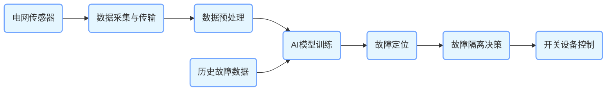

# AI在智能电网故障定位与隔离中的快速响应应用

> 关键词：人工智能、智能电网、故障定位、故障隔离、快速响应

> 摘要：本文深入探讨了AI在智能电网故障定位与隔离中的快速响应应用。首先介绍了研究的背景、目的、预期读者和文档结构等内容。接着阐述了智能电网、故障定位与隔离以及AI的核心概念与联系，并给出了相应的原理和架构示意图及流程图。详细讲解了用于故障定位与隔离的核心算法原理，包括使用Python代码进行具体操作步骤的说明。同时，介绍了相关的数学模型和公式，并举例说明。通过项目实战展示了代码实际案例，包括开发环境搭建、源代码实现与解读。分析了AI在智能电网故障定位与隔离中的实际应用场景，推荐了学习资源、开发工具框架和相关论文著作。最后总结了未来发展趋势与挑战，解答了常见问题，并提供了扩展阅读和参考资料。

## 1. 背景介绍 
### 1.1 目的和范围
随着电力需求的不断增长和电网规模的日益扩大，智能电网的安全稳定运行变得至关重要。电网故障可能导致大面积停电，给社会经济带来巨大损失。因此，快速准确地定位和隔离故障对于保障电网的可靠性和稳定性具有重要意义。本文的目的是探讨AI技术在智能电网故障定位与隔离中的快速响应应用，研究如何利用AI算法提高故障定位与隔离的效率和准确性。范围涵盖了智能电网故障定位与隔离的基本原理、AI算法的应用、实际案例分析以及相关工具和资源的推荐。

### 1.2 预期读者
本文预期读者包括电力系统工程师、人工智能研究人员、相关专业的学生以及对智能电网和AI技术感兴趣的技术爱好者。对于电力系统工程师，本文可以为他们提供利用AI技术改进现有故障定位与隔离方法的思路；对于人工智能研究人员，可了解电力系统故障处理的具体需求，为AI算法的应用提供新的场景；对于学生，有助于他们深入学习智能电网和AI技术的结合应用；对于技术爱好者，能让他们了解这一前沿领域的发展动态。

### 1.3 文档结构概述
本文首先介绍研究的背景信息，包括目的、预期读者和文档结构。接着阐述智能电网故障定位与隔离以及AI的核心概念与联系，给出原理和架构示意图及流程图。然后详细讲解核心算法原理和具体操作步骤，通过Python代码进行说明。之后介绍相关的数学模型和公式，并举例说明。通过项目实战展示代码实际案例，包括开发环境搭建、源代码实现与解读。分析实际应用场景，推荐学习资源、开发工具框架和相关论文著作。最后总结未来发展趋势与挑战，解答常见问题，提供扩展阅读和参考资料。

### 1.4 术语表
#### 1.4.1 核心术语定义
- **智能电网**：将先进的传感测量技术、通信技术、信息技术、计算机技术和控制技术与物理电网高度集成而形成的新型电网，具有智能化、自动化、互动化等特点。
- **故障定位**：确定电网中发生故障的具体位置的过程。
- **故障隔离**：将故障部分从电网中分离出来，防止故障影响扩大的操作。
- **AI（人工智能）**：研究、开发用于模拟、延伸和扩展人的智能的理论、方法、技术及应用系统的一门新的技术科学。

#### 1.4.2 相关概念解释
- **数据驱动**：通过收集和分析大量的数据来发现规律和模式，从而做出决策和预测。在智能电网故障定位与隔离中，数据驱动的方法可以利用电网运行数据来定位和隔离故障。
- **机器学习**：AI的一个分支，它使计算机能够从数据中学习，而无需明确编程。在故障定位与隔离中，机器学习算法可以通过学习历史故障数据来预测新的故障位置。
- **深度学习**：一种基于人工神经网络的机器学习技术，具有强大的特征提取和模式识别能力。在智能电网中，深度学习可以用于处理复杂的电网数据，提高故障定位的准确性。

#### 1.4.3 缩略词列表
- **ANN**：Artificial Neural Network，人工神经网络
- **SVM**：Support Vector Machine，支持向量机
- **MLP**：Multilayer Perceptron，多层感知机
- **CNN**：Convolutional Neural Network，卷积神经网络
- **RNN**：Recurrent Neural Network，循环神经网络

## 2. 核心概念与联系 
### 核心概念原理
#### 智能电网
智能电网是传统电网与现代信息技术的融合，它通过安装大量的传感器和通信设备，实时收集电网的运行数据，如电压、电流、功率等。这些数据可以用于监测电网的运行状态，预测潜在的故障，并实现自动化的控制和管理。智能电网的核心原理是利用先进的信息技术和控制技术，提高电网的可靠性、安全性和效率。

#### 故障定位与隔离
故障定位是通过分析电网的运行数据，确定故障发生的具体位置。常见的故障定位方法包括基于电气量测量的方法、基于行波原理的方法和基于数据驱动的方法等。故障隔离是在确定故障位置后，通过操作开关设备将故障部分从电网中分离出来，防止故障影响扩大。故障隔离的关键是快速准确地判断故障区域，并及时采取措施。

#### AI
AI是模拟人类智能的技术，包括机器学习、深度学习、自然语言处理等。在智能电网故障定位与隔离中，AI可以通过学习大量的历史故障数据，建立故障模型，从而实现快速准确的故障定位和隔离。例如，机器学习算法可以通过分析电网的运行数据，识别故障特征，预测故障位置；深度学习算法可以处理复杂的电网数据，如图像、语音等，提高故障定位的准确性。

### 架构示意图
以下是AI在智能电网故障定位与隔离中的架构示意图：



该架构的工作流程如下：
1. 电网传感器实时采集电网的运行数据，如电压、电流等。
2. 数据采集与传输模块将采集到的数据传输到数据处理中心。
3. 数据预处理模块对采集到的数据进行清洗、归一化等处理，以提高数据质量。
4. AI模型训练模块利用历史故障数据和预处理后的数据对AI模型进行训练。
5. 故障定位模块利用训练好的AI模型对实时数据进行分析，确定故障位置。
6. 故障隔离决策模块根据故障位置和电网的拓扑结构，制定故障隔离方案。
7. 开关设备控制模块根据故障隔离方案，操作开关设备，将故障部分从电网中分离出来。

## 3. 核心算法原理 & 具体操作步骤 
### 核心算法原理
#### 支持向量机（SVM）
支持向量机是一种常用的机器学习算法，用于分类和回归分析。在智能电网故障定位中，SVM可以将电网的运行数据分为正常状态和故障状态，并进一步确定故障类型。SVM的核心思想是找到一个最优的超平面，将不同类别的数据分开。

#### 多层感知机（MLP）
多层感知机是一种前馈神经网络，由输入层、隐藏层和输出层组成。在故障定位与隔离中，MLP可以学习电网运行数据和故障位置之间的映射关系，从而实现故障定位。MLP通过不断调整神经元之间的权重，使得输出结果与实际结果之间的误差最小。

#### 卷积神经网络（CNN）
卷积神经网络是一种专门用于处理具有网格结构数据的深度学习算法，如图像、语音等。在智能电网中，CNN可以处理电网的图像数据，如变电站的监控图像，以检测设备故障。CNN通过卷积层和池化层自动提取数据的特征，减少了人工特征工程的工作量。

### 具体操作步骤（以SVM为例）
#### 数据收集与预处理
首先，收集电网的历史故障数据，包括故障发生时的电压、电流、功率等电气量数据。然后，对数据进行预处理，包括数据清洗、归一化和特征提取。以下是一个简单的Python代码示例：

```python
import pandas as pd
from sklearn.preprocessing import StandardScaler
from sklearn.feature_selection import SelectKBest
from sklearn.feature_selection import f_classif

# 读取数据
data = pd.read_csv('grid_fault_data.csv')

# 分离特征和标签
X = data.drop('fault_type', axis=1)
y = data['fault_type']

# 数据归一化
scaler = StandardScaler()
X_scaled = scaler.fit_transform(X)

# 特征选择
selector = SelectKBest(score_func=f_classif, k=10)
X_selected = selector.fit_transform(X_scaled, y)
```

#### 模型训练
使用预处理后的数据对SVM模型进行训练。以下是一个简单的Python代码示例：

```python
from sklearn.svm import SVC
from sklearn.model_selection import train_test_split

# 划分训练集和测试集
X_train, X_test, y_train, y_test = train_test_split(X_selected, y, test_size=0.2, random_state=42)

# 创建SVM模型
svm_model = SVC(kernel='rbf', C=1.0, gamma='scale')

# 训练模型
svm_model.fit(X_train, y_train)
```

#### 模型评估
使用测试集对训练好的模型进行评估，计算模型的准确率、召回率等指标。以下是一个简单的Python代码示例：

```python
from sklearn.metrics import accuracy_score, recall_score

# 预测测试集
y_pred = svm_model.predict(X_test)

# 计算准确率和召回率
accuracy = accuracy_score(y_test, y_pred)
recall = recall_score(y_test, y_pred, average='weighted')

print(f"Accuracy: {accuracy}")
print(f"Recall: {recall}")
```

#### 故障定位与隔离
使用训练好的模型对实时数据进行分析，确定故障位置和类型。根据故障信息，制定故障隔离方案，并操作开关设备将故障部分从电网中分离出来。

## 4. 数学模型和公式 & 详细讲解 & 举例说明 
### 支持向量机（SVM）
#### 数学模型
SVM的目标是找到一个最优的超平面，将不同类别的数据分开。对于线性可分的数据，超平面可以表示为：

$$w^T x + b = 0$$

其中，$w$ 是超平面的法向量，$b$ 是偏置项，$x$ 是输入数据。SVM的优化目标是最大化间隔，即找到一个超平面，使得不同类别的数据到超平面的最小距离最大。这个优化问题可以表示为：

$$\min_{w,b} \frac{1}{2} \|w\|^2$$

$$s.t. \quad y_i (w^T x_i + b) \geq 1, \quad i = 1,2,\cdots,n$$

其中，$y_i$ 是数据 $x_i$ 的标签，$n$ 是数据的数量。

#### 详细讲解
上述优化问题是一个凸二次规划问题，可以使用拉格朗日乘子法求解。引入拉格朗日乘子 $\alpha_i \geq 0$，构造拉格朗日函数：

$$L(w,b,\alpha) = \frac{1}{2} \|w\|^2 - \sum_{i=1}^{n} \alpha_i (y_i (w^T x_i + b) - 1)$$

对 $w$ 和 $b$ 求偏导数并令其为0，得到：

$$\frac{\partial L}{\partial w} = w - \sum_{i=1}^{n} \alpha_i y_i x_i = 0$$

$$\frac{\partial L}{\partial b} = -\sum_{i=1}^{n} \alpha_i y_i = 0$$

将上述结果代入拉格朗日函数，得到对偶问题：

$$\max_{\alpha} \sum_{i=1}^{n} \alpha_i - \frac{1}{2} \sum_{i=1}^{n} \sum_{j=1}^{n} \alpha_i \alpha_j y_i y_j x_i^T x_j$$

$$s.t. \quad \sum_{i=1}^{n} \alpha_i y_i = 0, \quad \alpha_i \geq 0, \quad i = 1,2,\cdots,n$$

求解对偶问题得到最优的拉格朗日乘子 $\alpha^*$，然后可以计算出最优的 $w^*$ 和 $b^*$：

$$w^* = \sum_{i=1}^{n} \alpha_i^* y_i x_i$$

$$b^* = y_j - w^{*T} x_j$$

其中，$j$ 是任意一个支持向量的索引。

#### 举例说明
假设我们有一个二维数据集，包含两个类别的数据。我们可以使用SVM来找到一个超平面将这两个类别分开。以下是一个简单的Python代码示例：

```python
import numpy as np
import matplotlib.pyplot as plt
from sklearn.svm import SVC

# 生成数据
X = np.array([[3, 4], [1, 2], [4, 5], [2, 3], [5, 6], [6, 7], [1, 1], [2, 2]])
y = np.array([1, 1, 1, 1, -1, -1, -1, -1])

# 创建SVM模型
svm_model = SVC(kernel='linear')

# 训练模型
svm_model.fit(X, y)

# 绘制数据点
plt.scatter(X[:, 0], X[:, 1], c=y, cmap=plt.cm.Paired)

# 绘制超平面
ax = plt.gca()
xlim = ax.get_xlim()
ylim = ax.get_ylim()

xx = np.linspace(xlim[0], xlim[1], 30)
yy = np.linspace(ylim[0], ylim[1], 30)
YY, XX = np.meshgrid(yy, xx)
xy = np.vstack([XX.ravel(), YY.ravel()]).T
Z = svm_model.decision_function(xy).reshape(XX.shape)

ax.contour(XX, YY, Z, colors='k', levels=[-1, 0, 1], alpha=0.5, linestyles=['--', '-', '--'])

plt.show()
```

### 多层感知机（MLP）
#### 数学模型
多层感知机由输入层、隐藏层和输出层组成。对于输入层的第 $i$ 个神经元，其输入为 $x_i$。隐藏层的第 $j$ 个神经元的输入为：

$$z_j = \sum_{i=1}^{n} w_{ji} x_i + b_j$$

其中，$w_{ji}$ 是输入层第 $i$ 个神经元到隐藏层第 $j$ 个神经元的权重，$b_j$ 是隐藏层第 $j$ 个神经元的偏置项。隐藏层的第 $j$ 个神经元的输出为：

$$h_j = f(z_j)$$

其中，$f$ 是激活函数，如 sigmoid 函数、ReLU 函数等。输出层的第 $k$ 个神经元的输入为：

$$u_k = \sum_{j=1}^{m} w_{kj} h_j + b_k$$

其中，$w_{kj}$ 是隐藏层第 $j$ 个神经元到输出层第 $k$ 个神经元的权重，$b_k$ 是输出层第 $k$ 个神经元的偏置项。输出层的第 $k$ 个神经元的输出为：

$$y_k = g(u_k)$$

其中，$g$ 是激活函数，如 softmax 函数等。

#### 详细讲解
MLP的训练过程通常使用反向传播算法。反向传播算法的基本思想是通过计算误差的梯度，然后根据梯度更新神经元之间的权重和偏置项，使得误差最小化。具体步骤如下：
1. 前向传播：将输入数据输入到MLP中，计算输出层的输出。
2. 计算误差：计算输出层的输出与实际输出之间的误差。
3. 反向传播：从输出层开始，反向计算误差的梯度。
4. 更新权重和偏置项：根据误差的梯度，更新神经元之间的权重和偏置项。

#### 举例说明
假设我们有一个简单的二分类问题，输入数据是二维的，输出是0或1。我们可以使用MLP来解决这个问题。以下是一个简单的Python代码示例：

```python
import numpy as np
from sklearn.neural_network import MLPClassifier

# 生成数据
X = np.array([[0, 0], [0, 1], [1, 0], [1, 1]])
y = np.array([0, 1, 1, 0])

# 创建MLP模型
mlp_model = MLPClassifier(hidden_layer_sizes=(2,), activation='relu', solver='adam', max_iter=1000)

# 训练模型
mlp_model.fit(X, y)

# 预测
y_pred = mlp_model.predict(X)

print(f"Predictions: {y_pred}")
```

## 5. 项目实战：代码实际案例和详细解释说明 
### 5.1  开发环境搭建
#### 操作系统
可以选择Windows、Linux或macOS等操作系统。这里以Ubuntu 20.04为例。

#### Python环境
安装Python 3.8或以上版本。可以使用以下命令安装：

```bash
sudo apt update
sudo apt install python3 python3-pip
```

#### 相关库
安装所需的Python库，如NumPy、Pandas、Scikit-learn等。可以使用以下命令安装：

```bash
pip install numpy pandas scikit-learn
```

### 5.2  源代码详细实现和代码解读
#### 数据加载与预处理
```python
import pandas as pd
from sklearn.preprocessing import StandardScaler
from sklearn.feature_selection import SelectKBest
from sklearn.feature_selection import f_classif

# 读取数据
data = pd.read_csv('grid_fault_data.csv')

# 分离特征和标签
X = data.drop('fault_type', axis=1)
y = data['fault_type']

# 数据归一化
scaler = StandardScaler()
X_scaled = scaler.fit_transform(X)

# 特征选择
selector = SelectKBest(score_func=f_classif, k=10)
X_selected = selector.fit_transform(X_scaled, y)
```
代码解读：
- 使用 `pandas` 库读取CSV格式的电网故障数据。
- 将特征和标签分离，`fault_type` 列作为标签。
- 使用 `StandardScaler` 对特征数据进行归一化处理，使得数据具有零均值和单位方差。
- 使用 `SelectKBest` 进行特征选择，选择得分最高的10个特征。

#### 模型训练与评估
```python
from sklearn.svm import SVC
from sklearn.model_selection import train_test_split
from sklearn.metrics import accuracy_score, recall_score

# 划分训练集和测试集
X_train, X_test, y_train, y_test = train_test_split(X_selected, y, test_size=0.2, random_state=42)

# 创建SVM模型
svm_model = SVC(kernel='rbf', C=1.0, gamma='scale')

# 训练模型
svm_model.fit(X_train, y_train)

# 预测测试集
y_pred = svm_model.predict(X_test)

# 计算准确率和召回率
accuracy = accuracy_score(y_test, y_pred)
recall = recall_score(y_test, y_pred, average='weighted')

print(f"Accuracy: {accuracy}")
print(f"Recall: {recall}")
```
代码解读：
- 使用 `train_test_split` 将数据集划分为训练集和测试集，测试集占比为20%。
- 创建一个基于径向基函数（RBF）核的SVM模型。
- 使用训练集对SVM模型进行训练。
- 使用测试集进行预测，并计算准确率和召回率。

### 5.3  代码解读与分析
#### 数据预处理
数据预处理是机器学习中的重要步骤，它可以提高模型的性能。归一化处理可以使得不同特征具有相同的尺度，避免某些特征对模型的影响过大。特征选择可以减少特征的数量，降低模型的复杂度，同时提高模型的泛化能力。

#### 模型选择与训练
选择合适的模型是解决问题的关键。SVM是一种强大的分类算法，适用于处理高维数据和非线性问题。在训练模型时，需要选择合适的超参数，如核函数、惩罚系数等。可以使用交叉验证等方法来选择最优的超参数。

#### 模型评估
模型评估可以帮助我们了解模型的性能。准确率和召回率是常用的评估指标，准确率表示模型预测正确的样本占总样本的比例，召回率表示模型正确预测的正样本占实际正样本的比例。在实际应用中，需要根据具体问题选择合适的评估指标。

## 6. 实际应用场景 
### 输电线路故障定位与隔离
在输电线路中，故障可能由于雷击、外力破坏等原因引起。AI技术可以通过分析输电线路的电压、电流等数据，快速准确地定位故障位置，并及时隔离故障，减少停电时间。例如，利用行波定位原理结合AI算法，可以提高故障定位的精度。

### 变电站设备故障检测与隔离
变电站中的设备如变压器、断路器等发生故障时，可能会影响整个电网的安全运行。AI技术可以通过监测设备的运行状态，如温度、振动等数据，及时发现设备故障，并进行隔离。例如，使用深度学习算法对设备的红外图像进行分析，检测设备的热故障。

### 配电网故障定位与恢复
配电网直接面向用户，故障会影响用户的正常用电。AI技术可以通过分析配电网的拓扑结构和运行数据，快速定位故障位置，并进行故障隔离和恢复。例如，利用遗传算法和模糊推理相结合的方法，优化配电网的故障恢复方案。

## 7. 工具和资源推荐
### 7.1 学习资源推荐
#### 7.1.1 书籍推荐
- 《机器学习》（周志华著）：介绍了机器学习的基本概念、算法和应用，是机器学习领域的经典教材。
- 《深度学习》（Ian Goodfellow、Yoshua Bengio和Aaron Courville著）：全面介绍了深度学习的理论和实践，适合深入学习深度学习的读者。
- 《电力系统故障分析》（王晓茹著）：详细介绍了电力系统故障的基本原理、分析方法和计算技术。

#### 7.1.2 在线课程
- Coursera上的“机器学习”课程（Andrew Ng教授授课）：是机器学习领域的经典在线课程，适合初学者入门。
- edX上的“深度学习基础”课程：介绍了深度学习的基本概念和算法，通过实际案例进行讲解。
- 中国大学MOOC上的“电力系统分析”课程：系统介绍了电力系统的基本原理和分析方法。

#### 7.1.3 技术博客和网站
- Medium：上面有很多关于AI和电力系统的技术文章，作者来自世界各地的技术专家。
- IEEE Xplore：是电气和电子工程师协会（IEEE）的数字图书馆，提供了大量关于电力系统和AI的研究论文。
- 电力系统自动化网：专注于电力系统自动化领域的技术交流和信息分享。

### 7.2 开发工具框架推荐
#### 7.2.1 IDE和编辑器
- PyCharm：是一款专业的Python集成开发环境，提供了丰富的功能和插件，适合开发Python项目。
- Jupyter Notebook：是一个交互式的开发环境，适合进行数据探索和模型验证。
- Visual Studio Code：是一款轻量级的代码编辑器，支持多种编程语言，具有丰富的插件生态系统。

#### 7.2.2 调试和性能分析工具
- TensorBoard：是TensorFlow的可视化工具，可以用于查看模型的训练过程和性能指标。
- Py-Spy：是一个用于分析Python程序性能的工具，可以帮助我们找出程序中的性能瓶颈。
- Scikit-learn的交叉验证工具：可以帮助我们选择最优的模型超参数，提高模型的性能。

#### 7.2.3 相关框架和库
- Scikit-learn：是一个常用的机器学习库，提供了丰富的机器学习算法和工具，如分类、回归、聚类等。
- TensorFlow：是一个开源的深度学习框架，广泛应用于图像识别、自然语言处理等领域。
- PyTorch：是另一个流行的深度学习框架，具有动态图的特点，适合快速开发和实验。

### 7.3 相关论文著作推荐
#### 7.3.1 经典论文
- “Support-Vector Networks”（Cortes和Vapnik著）：是支持向量机领域的经典论文，介绍了支持向量机的基本原理和算法。
- “Gradient-Based Learning Applied to Document Recognition”（LeCun等人著）：是卷积神经网络领域的经典论文，介绍了LeNet-5网络结构和手写数字识别的应用。
- “Long Short-Term Memory”（Hochreiter和Schmidhuber著）：是循环神经网络领域的经典论文，介绍了长短期记忆网络（LSTM）的基本原理和算法。

#### 7.3.2 最新研究成果
- 在IEEE Transactions on Power Systems、IEEE Transactions on Smart Grid等期刊上可以找到关于AI在智能电网故障定位与隔离方面的最新研究成果。
- 每年的IEEE Power & Energy Society General Meeting、IEEE International Conference on Smart Grid Communications等会议上也会有相关的研究报告。

#### 7.3.3 应用案例分析
- 一些电力公司的官方网站会发布关于AI在智能电网中的应用案例，如国家电网、南方电网等。
- 一些研究机构的报告也会对AI在智能电网故障定位与隔离中的应用进行案例分析，如中国电力科学研究院等。

## 8. 总结：未来发展趋势与挑战
### 未来发展趋势
#### 多技术融合
未来，AI将与物联网、大数据、云计算等技术深度融合，实现智能电网的全面智能化。例如，通过物联网技术实时收集电网的运行数据，利用大数据技术对数据进行存储和分析，借助云计算技术提供强大的计算能力，从而提高故障定位与隔离的效率和准确性。

#### 模型的可解释性增强
随着AI技术的发展，模型的可解释性变得越来越重要。在智能电网故障定位与隔离中，需要能够解释模型的决策过程，以便电力系统工程师能够理解和信任模型的结果。未来，将研究更多可解释的AI模型，如基于规则的模型、决策树模型等。

#### 自适应学习能力提升
智能电网的运行环境是动态变化的，未来的AI模型需要具备自适应学习能力，能够根据电网的实时运行状态和新的故障数据不断调整和优化模型，以提高故障定位与隔离的性能。

### 挑战
#### 数据质量和安全问题
智能电网产生的大量数据是AI应用的基础，但数据质量和安全问题是面临的挑战之一。数据可能存在噪声、缺失值等问题，影响模型的性能。同时，数据的安全和隐私保护也是至关重要的，需要采取有效的措施防止数据泄露和攻击。

#### 模型的泛化能力
由于智能电网的复杂性和多样性，不同地区、不同类型的电网可能具有不同的运行特点。因此，AI模型需要具备良好的泛化能力，能够在不同的电网环境中都能准确地定位和隔离故障。

#### 技术标准和规范缺失
目前，AI在智能电网故障定位与隔离中的应用还缺乏统一的技术标准和规范。这使得不同的研究和应用之间难以进行比较和评估，也不利于技术的推广和应用。未来，需要制定相关的技术标准和规范，促进AI技术在智能电网中的健康发展。

## 9. 附录：常见问题与解答
### 问题1：AI在智能电网故障定位与隔离中的优势是什么？
答：AI具有强大的数据分析和模式识别能力，可以处理大量的电网运行数据，快速准确地定位故障位置和类型。与传统方法相比，AI可以学习历史故障数据，不断优化模型，提高故障定位与隔离的效率和准确性。

### 问题2：如何选择合适的AI算法用于故障定位与隔离？
答：选择合适的AI算法需要考虑数据的特点、问题的复杂度和应用场景等因素。例如，如果数据是线性可分的，可以选择支持向量机（SVM）；如果数据具有序列特征，可以选择循环神经网络（RNN）；如果数据是图像数据，可以选择卷积神经网络（CNN）。同时，还可以通过实验和比较不同算法的性能来选择最优的算法。

### 问题3：AI模型的训练需要多少数据？
答：AI模型的训练所需的数据量取决于模型的复杂度和数据的质量。一般来说，数据量越大，模型的性能越好。但在实际应用中，需要根据具体情况进行权衡。可以通过数据增强、特征工程等方法来提高数据的利用率，减少对大量数据的依赖。

### 问题4：如何保证AI模型在智能电网中的可靠性和安全性？
答：为了保证AI模型在智能电网中的可靠性和安全性，需要进行严格的模型验证和测试。可以使用交叉验证、模拟故障场景等方法来评估模型的性能。同时，还需要建立完善的监控和预警机制，及时发现模型的异常情况，并采取相应的措施。此外，还需要对模型的参数和数据进行加密和保护，防止数据泄露和攻击。

## 10. 扩展阅读 & 参考资料
### 扩展阅读
- 《人工智能：现代方法》（Stuart Russell和Peter Norvig著）：全面介绍了人工智能的理论和方法，是人工智能领域的经典著作。
- 《智能电网：概念、技术与应用》（余贻鑫、栾文鹏著）：系统介绍了智能电网的基本概念、关键技术和应用案例。
- 《电力系统自动化》（杨奇逊著）：介绍了电力系统自动化的基本原理、技术和应用。

### 参考资料
- IEEE相关期刊和会议论文
- 国家电网、南方电网等电力公司的技术报告和研究成果
- 相关的学术书籍和教材