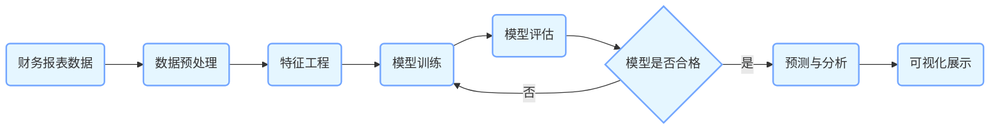

# AI增强型公司财务报表分析工具

> 关键词：AI增强、公司财务报表分析、数据分析、机器学习、深度学习、工具应用、财务决策

> 摘要：本文聚焦于AI增强型公司财务报表分析工具，全面阐述其相关技术原理、操作步骤、数学模型及实际应用。通过结合人工智能技术，此类工具能够更高效、精准地对公司财务报表进行分析，为投资者、企业管理者等提供有价值的决策依据。文章首先介绍了该工具的背景，包括目的、预期读者等；接着深入讲解核心概念、算法原理和数学模型；通过项目实战展示其代码实现与应用；分析了实际应用场景，并推荐了相关学习资源、开发工具和论文著作；最后总结了未来发展趋势与挑战，解答常见问题并提供扩展阅读与参考资料。

## 1. 背景介绍 
### 1.1 目的和范围
在当今复杂多变的商业环境中，公司的财务报表包含了大量关于其经营状况、财务健康和未来发展潜力的信息。然而，传统的财务报表分析方法往往耗时且难以处理海量的数据和复杂的关系。AI增强型公司财务报表分析工具的目的在于利用人工智能技术，如机器学习、深度学习等，提高财务报表分析的效率和准确性。本文章的范围涵盖了该工具的核心概念、算法原理、数学模型、实际应用以及相关的工具和资源推荐。

### 1.2 预期读者
本文的预期读者包括但不限于财务分析师、投资者、企业管理者、数据科学家和对人工智能在财务领域应用感兴趣的技术爱好者。财务分析师可以通过了解该工具提升分析能力和效率；投资者可以借助其分析结果做出更明智的投资决策；企业管理者可以利用工具洞察公司财务状况，制定战略规划；数据科学家可以从技术层面深入研究和改进此类工具；技术爱好者则可以了解人工智能在财务领域的创新应用。

### 1.3 文档结构概述
本文将按照以下结构展开：首先介绍核心概念与联系，包括相关的原理和架构；接着详细讲解核心算法原理和具体操作步骤，并用Python代码进行阐述；随后介绍数学模型和公式，并举例说明；通过项目实战展示代码实际案例和详细解释；分析实际应用场景；推荐相关的工具和资源；总结未来发展趋势与挑战；解答常见问题；最后提供扩展阅读和参考资料。

### 1.4 术语表
#### 1.4.1 核心术语定义
- **AI增强**：指在传统的财务报表分析方法基础上，引入人工智能技术，如机器学习、深度学习等，以提升分析的效率和准确性。
- **财务报表分析**：对公司的资产负债表、利润表、现金流量表等财务报表进行分析，以评估公司的财务状况、经营成果和现金流量。
- **机器学习**：让计算机通过数据学习模式和规律，并基于这些学习结果进行预测和决策的技术。
- **深度学习**：机器学习的一个分支，通过构建多层神经网络来学习数据的复杂特征和模式。

#### 1.4.2 相关概念解释
- **特征工程**：在机器学习中，将原始数据转换为适合模型训练的特征的过程。在财务报表分析中，特征工程可以包括提取财务指标、计算比率等。
- **模型评估**：使用各种指标来评估机器学习模型的性能，如准确率、召回率、F1值等。
- **过拟合**：模型在训练数据上表现良好，但在测试数据上表现不佳的现象。

#### 1.4.3 缩略词列表
- **AI**：Artificial Intelligence，人工智能
- **ML**：Machine Learning，机器学习
- **DL**：Deep Learning，深度学习
- **ROC**：Receiver Operating Characteristic，受试者工作特征曲线
- **AUC**：Area Under the Curve，曲线下面积

## 2. 核心概念与联系 

### 核心概念原理
AI增强型公司财务报表分析工具的核心原理是将人工智能技术应用于财务报表分析。传统的财务报表分析主要依赖于人工计算和经验判断，而AI增强型工具则通过机器学习和深度学习算法，自动从财务报表数据中提取特征，学习数据中的模式和规律，并进行预测和决策。

例如，在预测公司的盈利能力时，工具可以通过分析历史财务数据，如营业收入、净利润、资产负债率等，构建机器学习模型。模型可以学习这些指标与盈利能力之间的关系，并根据新的财务数据预测公司未来的盈利能力。

### 架构示意图


### 架构说明
- **财务报表数据**：来源包括公司的官方财务报告、证券交易所网站等。这些数据是分析的基础。
- **数据预处理**：对原始财务报表数据进行清洗、缺失值处理、异常值处理等操作，以提高数据质量。
- **特征工程**：从预处理后的数据中提取有意义的特征，如财务比率、趋势指标等。
- **模型训练**：使用机器学习或深度学习算法，如决策树、神经网络等，对特征数据进行训练，构建分析模型。
- **模型评估**：使用评估指标，如准确率、召回率等，评估模型的性能。
- **预测与分析**：使用训练好的模型对新的财务报表数据进行预测和分析，如预测公司的盈利趋势、评估财务风险等。
- **可视化展示**：将分析结果以图表、报表等形式进行可视化展示，方便用户理解和决策。

## 3. 核心算法原理 & 具体操作步骤 

### 核心算法原理
在AI增强型公司财务报表分析工具中，常用的算法包括线性回归、逻辑回归、决策树、随机森林和神经网络等。下面以线性回归为例，详细讲解其原理。

线性回归是一种用于建立自变量和因变量之间线性关系的统计模型。假设我们有一组财务数据，其中自变量 $X$ 表示公司的营业收入，因变量 $Y$ 表示公司的净利润。线性回归模型可以表示为：

$$Y = \beta_0 + \beta_1X + \epsilon$$

其中，$\beta_0$ 是截距，$\beta_1$ 是斜率，$\epsilon$ 是误差项。线性回归的目标是找到最优的 $\beta_0$ 和 $\beta_1$，使得误差项的平方和最小。

### 具体操作步骤
以下是使用Python实现线性回归进行财务报表分析的具体步骤：

```python
import numpy as np
import pandas as pd
from sklearn.linear_model import LinearRegression
from sklearn.model_selection import train_test_split
from sklearn.metrics import mean_squared_error

# 步骤1：加载数据
# 假设我们有一个包含营业收入和净利润的CSV文件
data = pd.read_csv('financial_data.csv')
X = data[['Revenue']].values
y = data['NetIncome'].values

# 步骤2：数据划分
# 将数据划分为训练集和测试集
X_train, X_test, y_train, y_test = train_test_split(X, y, test_size=0.2, random_state=42)

# 步骤3：模型训练
# 创建线性回归模型
model = LinearRegression()
# 训练模型
model.fit(X_train, y_train)

# 步骤4：模型预测
# 使用测试集进行预测
y_pred = model.predict(X_test)

# 步骤5：模型评估
# 计算均方误差
mse = mean_squared_error(y_test, y_pred)
print(f"均方误差: {mse}")

# 步骤6：输出模型参数
# 输出截距和斜率
print(f"截距: {model.intercept_}")
print(f"斜率: {model.coef_[0]}")
```

### 代码解释
- **步骤1**：使用 `pandas` 库加载包含营业收入和净利润的CSV文件，并将其转换为NumPy数组。
- **步骤2**：使用 `train_test_split` 函数将数据划分为训练集和测试集，其中测试集占总数据的20%。
- **步骤3**：创建线性回归模型，并使用训练集进行训练。
- **步骤4**：使用训练好的模型对测试集进行预测。
- **步骤5**：使用 `mean_squared_error` 函数计算预测值和真实值之间的均方误差，评估模型的性能。
- **步骤6**：输出模型的截距和斜率，这些参数表示营业收入和净利润之间的线性关系。

## 4. 数学模型和公式 & 详细讲解 & 举例说明 

### 线性回归模型
线性回归模型的数学公式为：

$$Y = \beta_0 + \beta_1X_1 + \beta_2X_2 + \cdots + \beta_nX_n + \epsilon$$

其中，$Y$ 是因变量，$X_1, X_2, \cdots, X_n$ 是自变量，$\beta_0, \beta_1, \cdots, \beta_n$ 是回归系数，$\epsilon$ 是误差项。

在财务报表分析中，我们可以使用线性回归模型来预测公司的净利润与营业收入、资产负债率等因素之间的关系。例如，假设我们有以下数据：

| 营业收入（万元） | 资产负债率（%） | 净利润（万元） |
|------------------|-----------------|----------------|
| 1000             | 50              | 100            |
| 1200             | 55              | 120            |
| 1500             | 60              | 150            |

我们可以使用线性回归模型来预测净利润 $Y$ 与营业收入 $X_1$ 和资产负债率 $X_2$ 之间的关系：

$$Y = \beta_0 + \beta_1X_1 + \beta_2X_2 + \epsilon$$

### 最小二乘法
为了找到最优的回归系数 $\beta_0, \beta_1, \cdots, \beta_n$，我们可以使用最小二乘法。最小二乘法的目标是使误差项的平方和最小，即：

$$\min_{\beta_0, \beta_1, \cdots, \beta_n} \sum_{i=1}^{m} (y_i - \hat{y}_i)^2$$

其中，$y_i$ 是真实值，$\hat{y}_i$ 是预测值。

通过最小二乘法，我们可以得到回归系数的计算公式：

$$\hat{\beta} = (X^T X)^{-1} X^T y$$

其中，$X$ 是自变量矩阵，$y$ 是因变量向量。

### 举例说明
假设我们有以下数据：

| 营业收入（万元） | 净利润（万元） |
|------------------|----------------|
| 100              | 10             |
| 200              | 20             |
| 300              | 30             |

我们可以使用Python实现线性回归模型，并计算回归系数：

```python
import numpy as np

# 自变量矩阵
X = np.array([[1, 100], [1, 200], [1, 300]])
# 因变量向量
y = np.array([10, 20, 30])

# 计算回归系数
beta = np.linalg.inv(X.T.dot(X)).dot(X.T).dot(y)

print(f"截距: {beta[0]}")
print(f"斜率: {beta[1]}")
```

运行上述代码，我们可以得到截距为 0，斜率为 0.1，即净利润与营业收入之间的线性关系为：

$$Y = 0 + 0.1X$$

这意味着营业收入每增加 1 万元，净利润将增加 0.1 万元。

## 5. 项目实战：代码实际案例和详细解释说明 

### 5.1  开发环境搭建
为了实现AI增强型公司财务报表分析工具，我们需要搭建以下开发环境：

- **操作系统**：Windows、Linux或macOS
- **Python版本**：Python 3.6及以上
- **Python库**：`pandas`、`numpy`、`scikit-learn`、`matplotlib`、`seaborn` 等

可以使用以下命令安装所需的Python库：

```bash
pip install pandas numpy scikit-learn matplotlib seaborn
```

### 5.2  源代码详细实现和代码解读
以下是一个完整的AI增强型公司财务报表分析工具的代码示例：

```python
import pandas as pd
import numpy as np
from sklearn.linear_model import LinearRegression
from sklearn.model_selection import train_test_split
from sklearn.metrics import mean_squared_error
import matplotlib.pyplot as plt
import seaborn as sns

# 步骤1：加载数据
data = pd.read_csv('financial_data.csv')

# 步骤2：数据预处理
# 检查缺失值
print(data.isnull().sum())
# 处理缺失值
data = data.dropna()

# 步骤3：特征工程
# 提取特征和目标变量
X = data[['Revenue', 'Assets']].values
y = data['NetIncome'].values

# 步骤4：数据划分
X_train, X_test, y_train, y_test = train_test_split(X, y, test_size=0.2, random_state=42)

# 步骤5：模型训练
model = LinearRegression()
model.fit(X_train, y_train)

# 步骤6：模型预测
y_pred = model.predict(X_test)

# 步骤7：模型评估
mse = mean_squared_error(y_test, y_pred)
print(f"均方误差: {mse}")

# 步骤8：可视化展示
# 绘制真实值和预测值的散点图
plt.scatter(y_test, y_pred)
plt.xlabel('真实值')
plt.ylabel('预测值')
plt.title('真实值 vs 预测值')
plt.show()

# 绘制特征重要性图
feature_importance = pd.DataFrame({'特征': ['Revenue', 'Assets'], '重要性': model.coef_})
sns.barplot(x='重要性', y='特征', data=feature_importance)
plt.title('特征重要性')
plt.show()
```

### 代码解读与分析
- **步骤1**：使用 `pandas` 库加载包含财务数据的CSV文件。
- **步骤2**：检查数据中的缺失值，并使用 `dropna` 函数删除包含缺失值的行。
- **步骤3**：提取特征变量（营业收入和资产）和目标变量（净利润）。
- **步骤4**：使用 `train_test_split` 函数将数据划分为训练集和测试集。
- **步骤5**：创建线性回归模型，并使用训练集进行训练。
- **步骤6**：使用训练好的模型对测试集进行预测。
- **步骤7**：使用 `mean_squared_error` 函数计算预测值和真实值之间的均方误差，评估模型的性能。
- **步骤8**：使用 `matplotlib` 和 `seaborn` 库绘制真实值和预测值的散点图，以及特征重要性图。

通过以上步骤，我们可以实现一个简单的AI增强型公司财务报表分析工具，并对模型的性能进行评估和可视化展示。

## 6. 实际应用场景 
### 投资者决策
投资者可以使用AI增强型公司财务报表分析工具来评估公司的财务状况和投资价值。工具可以通过分析公司的财务报表，预测公司的盈利能力、偿债能力和成长潜力，为投资者提供投资建议。例如，投资者可以根据工具的分析结果，选择具有良好财务状况和成长潜力的公司进行投资。

### 企业管理者决策
企业管理者可以利用该工具来监控公司的财务状况，制定战略规划。工具可以帮助管理者分析公司的财务指标，如营业收入、净利润、资产负债率等，发现公司的优势和劣势，并及时调整经营策略。例如，管理者可以根据工具的分析结果，优化公司的成本结构，提高盈利能力。

### 银行信贷评估
银行在进行信贷评估时，可以使用该工具来评估企业的信用风险。工具可以通过分析企业的财务报表，评估企业的偿债能力和还款意愿，为银行提供信贷决策依据。例如，银行可以根据工具的分析结果，决定是否给予企业贷款以及贷款的额度和利率。

### 财务审计
财务审计人员可以使用该工具来辅助审计工作。工具可以帮助审计人员快速分析企业的财务报表，发现异常数据和潜在的财务风险。例如，审计人员可以根据工具的分析结果，对企业的财务报表进行深入审计，确保财务报表的真实性和准确性。

## 7. 工具和资源推荐
### 7.1 学习资源推荐
#### 7.1.1 书籍推荐
- 《Python数据分析实战》：介绍了使用Python进行数据分析的基本方法和技巧，包括数据处理、可视化和机器学习等方面。
- 《机器学习实战》：通过实际案例介绍了机器学习的基本算法和应用，适合初学者入门。
- 《深度学习》：由深度学习领域的三位顶尖专家撰写，系统介绍了深度学习的理论和实践。

#### 7.1.2 在线课程
- Coursera上的“机器学习”课程：由斯坦福大学教授Andrew Ng主讲，是机器学习领域的经典课程。
- edX上的“深度学习”课程：由麻省理工学院教授Geoffrey Hinton等人主讲，深入介绍了深度学习的原理和应用。
- 网易云课堂上的“Python数据分析与机器学习实战”课程：结合实际案例，介绍了使用Python进行数据分析和机器学习的方法。

#### 7.1.3 技术博客和网站
- Medium：一个技术博客平台，上面有很多关于人工智能、机器学习和数据分析的优质文章。
- Towards Data Science：专注于数据科学和机器学习领域的博客，提供了大量的技术文章和案例分析。
- Kaggle：一个数据科学竞赛平台，上面有很多关于财务数据分析的竞赛和数据集，可以学习到其他数据科学家的经验和方法。

### 7.2 开发工具框架推荐
#### 7.2.1 IDE和编辑器
- PyCharm：一款专业的Python集成开发环境，提供了丰富的功能和插件，适合开发大型Python项目。
- Jupyter Notebook：一个交互式的开发环境，适合进行数据分析和模型训练的实验和演示。
- Visual Studio Code：一款轻量级的代码编辑器，支持多种编程语言和插件，适合快速开发和调试。

#### 7.2.2 调试和性能分析工具
- Py-Spy：一个Python性能分析工具，可以帮助开发者找出Python代码中的性能瓶颈。
- PDB：Python自带的调试器，可以帮助开发者调试Python代码。
- TensorBoard：TensorFlow提供的可视化工具，可以帮助开发者可视化模型的训练过程和性能指标。

#### 7.2.3 相关框架和库
- Scikit-learn：一个常用的机器学习库，提供了丰富的机器学习算法和工具，适合初学者和专业人士使用。
- TensorFlow：一个开源的深度学习框架，由Google开发，提供了高效的深度学习模型训练和部署工具。
- PyTorch：一个开源的深度学习框架，由Facebook开发，具有简洁易用的特点，适合研究和开发。

### 7.3 相关论文著作推荐
#### 7.3.1 经典论文
- “Gradient-Based Learning Applied to Document Recognition”：由Yann LeCun等人撰写，介绍了卷积神经网络在手写字符识别中的应用，是深度学习领域的经典论文。
- “Long Short-Term Memory”：由Sepp Hochreiter和Jürgen Schmidhuber撰写，介绍了长短期记忆网络（LSTM）的原理和应用，是循环神经网络领域的经典论文。
- “Attention Is All You Need”：由Google Brain团队撰写，介绍了Transformer模型的原理和应用，是自然语言处理领域的重要论文。

#### 7.3.2 最新研究成果
- 关注顶级学术会议，如NeurIPS（神经信息处理系统大会）、ICML（国际机器学习会议）、KDD（知识发现与数据挖掘会议）等，这些会议上会发表很多关于人工智能和财务数据分析的最新研究成果。
- 关注学术期刊，如Journal of Financial Economics、Review of Financial Studies等，这些期刊上会发表很多关于财务领域的前沿研究。

#### 7.3.3 应用案例分析
- 研究一些知名公司在财务报表分析中应用人工智能技术的案例，如阿里巴巴、腾讯等公司在财务风险管理和财务决策中的应用案例。
- 分析一些金融机构在信贷评估和投资决策中应用人工智能技术的案例，如银行、证券公司等。

## 8. 总结：未来发展趋势与挑战
### 未来发展趋势
- **更强大的算法和模型**：随着人工智能技术的不断发展，未来的AI增强型公司财务报表分析工具将使用更强大的算法和模型，如深度强化学习、生成对抗网络等，以提高分析的准确性和效率。
- **多模态数据融合**：除了财务报表数据，未来的工具将融合更多的多模态数据，如文本数据、图像数据、音频数据等，以获取更全面的公司信息。
- **实时分析和预警**：未来的工具将具备实时分析和预警功能，能够及时发现公司的财务风险和异常情况，并提供相应的预警信息。
- **个性化定制**：根据用户的需求和偏好，未来的工具将提供个性化的分析报告和建议，满足不同用户的需求。

### 挑战
- **数据质量和安全**：财务报表数据的质量和安全是AI增强型公司财务报表分析工具面临的重要挑战。数据中可能存在缺失值、异常值和错误数据，需要进行有效的预处理和清洗。同时，财务数据涉及公司的机密信息，需要采取有效的安全措施来保护数据的安全。
- **模型可解释性**：人工智能模型通常是黑盒模型，难以解释其决策过程和结果。在财务报表分析中，模型的可解释性非常重要，因为决策者需要了解模型的决策依据。因此，如何提高模型的可解释性是未来需要解决的问题。
- **法律法规和道德问题**：人工智能在财务领域的应用涉及到法律法规和道德问题，如数据隐私保护、算法歧视等。未来需要制定相应的法律法规和道德准则，规范人工智能在财务领域的应用。

## 9. 附录：常见问题与解答
### 问题1：AI增强型公司财务报表分析工具是否可以替代财务分析师？
答：虽然AI增强型公司财务报表分析工具可以提高分析的效率和准确性，但它不能完全替代财务分析师。财务分析师具有丰富的经验和专业知识，能够对分析结果进行深入的解读和判断，并结合公司的实际情况提供有价值的建议。AI增强型工具可以作为财务分析师的辅助工具，帮助他们更好地完成工作。

### 问题2：如何选择适合的机器学习算法？
答：选择适合的机器学习算法需要考虑多个因素，如数据类型、数据规模、问题类型等。一般来说，如果数据是线性的，可以选择线性回归、逻辑回归等算法；如果数据是非线性的，可以选择决策树、随机森林、神经网络等算法。同时，还可以通过交叉验证等方法来比较不同算法的性能，选择最优的算法。

### 问题3：如何评估模型的性能？
答：评估模型的性能可以使用多种指标，如准确率、召回率、F1值、均方误差等。不同的问题类型需要选择不同的评估指标。例如，在分类问题中，可以使用准确率、召回率、F1值等指标；在回归问题中，可以使用均方误差、平均绝对误差等指标。同时，还可以使用交叉验证等方法来评估模型的泛化能力。

### 问题4：如何处理数据中的缺失值和异常值？
答：处理数据中的缺失值和异常值可以采用多种方法。对于缺失值，可以使用均值、中位数、众数等方法进行填充，也可以使用插值法进行填充。对于异常值，可以使用统计方法进行检测，如Z-score方法、箱线图方法等，然后将异常值删除或进行修正。

## 10. 扩展阅读 & 参考资料
### 扩展阅读
- 《智能金融：科技重塑金融未来》：介绍了人工智能、区块链、大数据等技术在金融领域的应用和发展趋势。
- 《数据挖掘：概念与技术》：系统介绍了数据挖掘的基本概念、算法和应用，适合深入学习数据挖掘技术。
- 《人工智能：现代方法》：全面介绍了人工智能的基本概念、算法和应用，是人工智能领域的经典教材。

### 参考资料
- 《Python数据分析实战》，作者：[美] Wes McKinney
- 《机器学习实战》，作者：[美] Peter Harrington
- 《深度学习》，作者：[美] Ian Goodfellow、[加] Yoshua Bengio、[加] Aaron Courville
- Coursera上的“机器学习”课程：https://www.coursera.org/learn/machine-learning
- edX上的“深度学习”课程：https://www.edx.org/course/deep-learning
- 网易云课堂上的“Python数据分析与机器学习实战”课程：https://study.163.com/course/courseMain.htm?courseId=1003560008