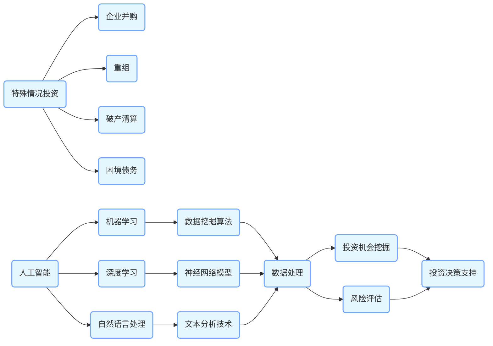

# AI增强型特殊情况投资分析

> 关键词：AI、特殊情况投资、投资分析、机器学习、数据挖掘、金融科技、风险评估

> 摘要：本文聚焦于AI增强型特殊情况投资分析，深入探讨在特殊投资场景下如何利用人工智能技术提升投资决策的准确性和效率。首先介绍背景知识，包括目的范围、预期读者等内容。接着阐述核心概念与联系，借助文本示意图和Mermaid流程图展示相关架构。详细讲解核心算法原理及具体操作步骤，用Python代码进行说明。通过数学模型和公式对投资分析进行量化解读，并举例说明。结合项目实战，给出代码实际案例及详细解释。探讨实际应用场景，推荐相关工具和资源，最后总结未来发展趋势与挑战，提供常见问题解答和扩展阅读参考资料，旨在为投资者和金融从业者提供全面的AI增强型特殊情况投资分析知识体系。

## 1. 背景介绍 
### 1.1 目的和范围
在当今复杂多变的金融市场中，特殊情况投资逐渐成为投资者关注的焦点。特殊情况投资涉及到企业并购、重组、破产清算、困境债务等复杂场景，这些场景往往蕴含着巨大的投资机会，但同时也伴随着较高的风险。传统的投资分析方法在处理这些特殊情况时，往往面临数据处理能力有限、分析效率低下、难以准确评估风险等问题。

本文的目的在于探讨如何利用人工智能（AI）技术来增强特殊情况投资分析的能力。通过引入机器学习、深度学习、自然语言处理等AI技术，能够更高效地处理海量的金融数据，挖掘数据背后的潜在信息，提高投资决策的准确性和效率。

本文的范围涵盖了AI增强型特殊情况投资分析的各个方面，包括核心概念、算法原理、数学模型、项目实战、实际应用场景等内容。旨在为投资者、金融分析师、研究人员等提供全面的技术指导和理论支持。

### 1.2 预期读者
- **投资者**：包括个人投资者和机构投资者，希望通过了解AI增强型特殊情况投资分析方法，提高投资决策的准确性和收益水平。
- **金融分析师**：负责对金融市场和投资项目进行分析和评估，需要掌握先进的分析技术和方法，以更好地完成工作任务。
- **研究人员**：对金融科技、人工智能在金融领域的应用等方面进行研究，本文可为其提供相关的理论和实践参考。
- **金融从业者**：包括银行、证券、基金等金融机构的从业人员，了解AI增强型特殊情况投资分析有助于提升自身的专业素养和业务能力。

### 1.3 文档结构概述
本文共分为十个部分，具体结构如下：
1. **背景介绍**：介绍AI增强型特殊情况投资分析的目的、范围、预期读者和文档结构概述，以及相关术语的定义和解释。
2. **核心概念与联系**：阐述特殊情况投资、人工智能等核心概念的原理和架构，通过文本示意图和Mermaid流程图展示它们之间的联系。
3. **核心算法原理 & 具体操作步骤**：详细讲解用于特殊情况投资分析的核心算法原理，并用Python代码进行实现和说明。
4. **数学模型和公式 & 详细讲解 & 举例说明**：介绍用于投资分析的数学模型和公式，对其进行详细讲解，并通过具体例子说明其应用。
5. **项目实战：代码实际案例和详细解释说明**：通过实际项目案例，展示AI增强型特殊情况投资分析的具体实现过程，包括开发环境搭建、源代码实现和代码解读。
6. **实际应用场景**：探讨AI增强型特殊情况投资分析在不同场景下的实际应用，如企业并购、困境债务投资等。
7. **工具和资源推荐**：推荐学习AI增强型特殊情况投资分析所需的相关工具和资源，包括书籍、在线课程、技术博客、开发工具、框架和库、相关论文著作等。
8. **总结：未来发展趋势与挑战**：总结AI增强型特殊情况投资分析的发展现状，探讨其未来发展趋势和面临的挑战。
9. **附录：常见问题与解答**：提供关于AI增强型特殊情况投资分析的常见问题及解答。
10. **扩展阅读 & 参考资料**：提供相关的扩展阅读资料和参考书目，方便读者进一步深入学习和研究。

### 1.4 术语表
#### 1.4.1 核心术语定义
- **特殊情况投资（Special Situation Investing）**：指投资者针对企业面临的特殊事件或情况进行的投资，这些特殊情况包括企业并购、重组、破产清算、困境债务、分拆上市等。特殊情况投资的目的是通过对这些特殊事件的分析和判断，挖掘潜在的投资机会，获取超额收益。
- **人工智能（Artificial Intelligence，AI）**：是一门研究如何使计算机系统能够模拟人类智能的学科和技术领域。人工智能包括机器学习、深度学习、自然语言处理、计算机视觉等多个分支领域，旨在让计算机系统能够感知环境、学习知识、做出决策和解决问题。
- **机器学习（Machine Learning，ML）**：是人工智能的一个重要分支，它通过让计算机系统从数据中自动学习模式和规律，从而实现对未知数据的预测和分类。机器学习算法包括监督学习、无监督学习、强化学习等多种类型。
- **深度学习（Deep Learning，DL）**：是机器学习的一个子领域，它基于人工神经网络，通过构建多层神经网络模型，自动从数据中学习复杂的特征和模式。深度学习在图像识别、语音识别、自然语言处理等领域取得了显著的成果。
- **自然语言处理（Natural Language Processing，NLP）**：是人工智能的一个重要分支，它研究如何让计算机系统能够理解和处理人类语言。自然语言处理技术包括文本分类、情感分析、信息提取、机器翻译等多个方面。

#### 1.4.2 相关概念解释
- **金融数据挖掘（Financial Data Mining）**：指从大量的金融数据中挖掘出有价值的信息和知识的过程。金融数据包括股票价格、财务报表、新闻资讯、宏观经济数据等多种类型。金融数据挖掘可以帮助投资者发现市场趋势、预测股票价格、评估风险等。
- **风险评估（Risk Assessment）**：指对投资项目可能面临的风险进行评估和分析的过程。风险评估的目的是确定投资项目的风险水平，为投资者提供决策依据。风险评估的方法包括定量分析和定性分析两种。
- **投资决策（Investment Decision）**：指投资者根据对投资项目的分析和评估，做出是否投资以及投资多少的决策过程。投资决策需要考虑多个因素，包括投资收益、风险水平、投资期限等。

#### 1.4.3 缩略词列表
- **AI**：Artificial Intelligence，人工智能
- **ML**：Machine Learning，机器学习
- **DL**：Deep Learning，深度学习
- **NLP**：Natural Language Processing，自然语言处理
- **ROI**：Return on Investment，投资回报率
- **P/E**：Price-to-Earnings Ratio，市盈率
- **EPS**：Earnings Per Share，每股收益

## 2. 核心概念与联系 

### 特殊情况投资概念原理
特殊情况投资是一种基于事件驱动的投资策略。其原理在于，企业面临的特殊情况会打破原有的市场均衡，从而创造出被市场低估或未充分定价的投资机会。例如，在企业并购过程中，由于市场对并购后的协同效应和整合效果存在不确定性，可能导致目标企业的股价被低估。投资者通过深入分析并购的细节、双方企业的战略布局、财务状况等因素，判断并购成功后企业价值的提升空间，从而决定是否进行投资。

### 人工智能概念原理
人工智能是让计算机模拟人类智能的技术体系。机器学习作为人工智能的核心，通过对大量数据的学习来发现数据中的模式和规律。深度学习则是机器学习的一种高级形式，它利用多层神经网络自动从数据中提取复杂的特征。自然语言处理能够使计算机理解和处理人类语言，例如对新闻报道、企业公告等文本信息进行分析和解读。

### 两者联系架构
AI技术与特殊情况投资分析相互融合，形成了一个有机的整体。AI技术为特殊情况投资分析提供了强大的工具和方法，帮助投资者更高效地处理和分析海量数据，挖掘潜在的投资机会，评估投资风险。特殊情况投资分析则为AI技术提供了应用场景和数据来源，促进了AI技术在金融领域的发展和创新。

以下是文本示意图：

AI增强型特殊情况投资分析由特殊情况投资和人工智能两个核心部分组成。特殊情况投资包含企业并购、重组、破产清算等具体场景，每个场景都有相应的投资机会和风险。人工智能则涵盖机器学习、深度学习、自然语言处理等技术。机器学习通过数据挖掘算法对金融数据进行分析，深度学习利用神经网络对复杂数据进行建模，自然语言处理对文本信息进行处理。这些AI技术相互协作，为特殊情况投资分析提供数据处理、模式识别、风险评估等支持。

以下是Mermaid流程图：



## 3. 核心算法原理 & 具体操作步骤 

### 核心算法原理

#### 决策树算法
决策树是一种常用的机器学习算法，它通过对数据的特征进行划分，构建一个树形结构的模型。在特殊情况投资分析中，决策树可以用于对投资项目进行分类和预测。例如，根据企业的财务指标、行业前景、特殊事件类型等特征，判断该投资项目是否具有投资价值。

决策树的构建过程基于信息增益、基尼指数等准则。信息增益是指在划分数据集前后信息熵的减少量，信息增益越大，说明该特征对分类的贡献越大。基尼指数则衡量了数据集的不纯度，基尼指数越小，数据集越纯。

以下是决策树算法的Python实现示例：

```python
from sklearn.datasets import load_iris
from sklearn.model_selection import train_test_split
from sklearn.tree import DecisionTreeClassifier
from sklearn.metrics import accuracy_score

# 加载数据集
iris = load_iris()
X = iris.data
y = iris.target

# 划分训练集和测试集
X_train, X_test, y_train, y_test = train_test_split(X, y, test_size=0.3, random_state=42)

# 创建决策树分类器
clf = DecisionTreeClassifier()

# 训练模型
clf.fit(X_train, y_train)

# 预测
y_pred = clf.predict(X_test)

# 计算准确率
accuracy = accuracy_score(y_test, y_pred)
print(f"Accuracy: {accuracy}")
```

#### 支持向量机算法
支持向量机（SVM）是一种强大的分类和回归算法。在特殊情况投资分析中，SVM可以用于对投资项目进行分类，例如将投资项目分为有投资价值和无投资价值两类。SVM的核心思想是找到一个最优的超平面，使得不同类别的数据点能够被最大程度地分开。

以下是支持向量机算法的Python实现示例：

```python
from sklearn.datasets import load_iris
from sklearn.model_selection import train_test_split
from sklearn.svm import SVC
from sklearn.metrics import accuracy_score

# 加载数据集
iris = load_iris()
X = iris.data
y = iris.target

# 划分训练集和测试集
X_train, X_test, y_train, y_test = train_test_split(X, y, test_size=0.3, random_state=42)

# 创建支持向量机分类器
clf = SVC()

# 训练模型
clf.fit(X_train, y_train)

# 预测
y_pred = clf.predict(X_test)

# 计算准确率
accuracy = accuracy_score(y_test, y_pred)
print(f"Accuracy: {accuracy}")
```

### 具体操作步骤

#### 数据收集
首先需要收集与特殊情况投资相关的数据，包括企业的财务报表、新闻资讯、行业报告、宏观经济数据等。这些数据可以从金融数据库、新闻网站、政府机构网站等渠道获取。

#### 数据预处理
收集到的数据往往存在噪声、缺失值等问题，需要进行预处理。数据预处理包括数据清洗、缺失值填充、数据标准化等操作。例如，可以使用均值、中位数等方法填充缺失值，使用Z-score标准化方法对数据进行标准化处理。

#### 特征工程
特征工程是指从原始数据中提取有价值的特征。在特殊情况投资分析中，可以提取企业的财务指标（如市盈率、市净率、净利润增长率等）、行业指标（如行业增长率、市场份额等）、特殊事件相关特征（如并购金额、重组方案等）作为特征。

#### 模型训练
选择合适的机器学习算法，如决策树、支持向量机、神经网络等，对预处理后的数据进行训练。在训练过程中，需要将数据集划分为训练集和测试集，使用训练集对模型进行训练，使用测试集对模型进行评估和优化。

#### 模型评估和优化
使用评估指标（如准确率、召回率、F1值等）对训练好的模型进行评估。如果模型的性能不理想，可以通过调整模型的参数、增加数据量、改进特征工程等方法对模型进行优化。

#### 投资决策
将训练好的模型应用到实际的投资项目中，根据模型的预测结果进行投资决策。同时，需要结合投资者的风险偏好、投资目标等因素，综合考虑投资决策。

## 4. 数学模型和公式 & 详细讲解 & 举例说明 

### 数学模型和公式

#### 投资回报率（ROI）
投资回报率是衡量投资项目收益水平的重要指标，其计算公式为：

$$ROI = \frac{投资收益 - 投资成本}{投资成本} \times 100\%$$

其中，投资收益是指投资项目所获得的收益，投资成本是指投资项目所投入的成本。

#### 市盈率（P/E）
市盈率是衡量股票估值水平的重要指标，其计算公式为：

$$P/E = \frac{股票价格}{每股收益}$$

其中，股票价格是指股票的市场价格，每股收益是指公司每股股票的盈利。

#### 夏普比率（Sharpe Ratio）
夏普比率是衡量投资组合风险调整后收益的指标，其计算公式为：

$$Sharpe Ratio = \frac{R_p - R_f}{\sigma_p}$$

其中，$R_p$ 是投资组合的预期收益率，$R_f$ 是无风险收益率，$\sigma_p$ 是投资组合的收益率标准差。

### 详细讲解

#### 投资回报率（ROI）
投资回报率反映了投资项目的盈利能力。ROI越高，说明投资项目的收益水平越高。投资者在进行投资决策时，通常会比较不同投资项目的ROI，选择ROI较高的项目进行投资。

#### 市盈率（P/E）
市盈率反映了市场对公司未来盈利的预期。一般来说，市盈率越高，说明市场对公司未来盈利的预期越高，但同时也意味着股票的估值越高，投资风险也相对较大。投资者在进行股票投资时，需要综合考虑公司的基本面、行业前景等因素，合理判断市盈率的高低。

#### 夏普比率（Sharpe Ratio）
夏普比率衡量了投资组合在承担单位风险时所获得的超额收益。夏普比率越高，说明投资组合的风险调整后收益越高，投资组合的绩效越好。投资者在进行投资组合选择时，可以通过比较不同投资组合的夏普比率，选择夏普比率较高的投资组合。

### 举例说明

#### 投资回报率（ROI）
假设投资者投资了10000元购买某股票，一年后卖出股票获得12000元。则该投资项目的投资回报率为：

$$ROI = \frac{12000 - 10000}{10000} \times 100\% = 20\%$$

#### 市盈率（P/E）
假设某股票的市场价格为20元，公司每股收益为1元。则该股票的市盈率为：

$$P/E = \frac{20}{1} = 20$$

#### 夏普比率（Sharpe Ratio）
假设某投资组合的预期收益率为15%，无风险收益率为5%，投资组合的收益率标准差为10%。则该投资组合的夏普比率为：

$$Sharpe Ratio = \frac{15\% - 5\%}{10\%} = 1$$

## 5. 项目实战：代码实际案例和详细解释说明 

### 5.1  开发环境搭建

#### 操作系统
建议使用Windows、Linux或macOS操作系统。

#### Python环境
安装Python 3.6及以上版本。可以从Python官方网站（https://www.python.org/downloads/）下载并安装Python。

#### 开发工具
推荐使用PyCharm、Jupyter Notebook等开发工具。PyCharm是一款功能强大的Python集成开发环境（IDE），提供了代码编辑、调试、版本控制等功能。Jupyter Notebook是一个交互式的开发环境，适合进行数据分析和机器学习实验。

#### 安装依赖库
使用pip命令安装所需的依赖库，包括pandas、numpy、scikit-learn、matplotlib等。以下是安装命令：

```bash
pip install pandas numpy scikit-learn matplotlib
```

### 5.2  源代码详细实现和代码解读

#### 数据加载和预处理
```python
import pandas as pd
import numpy as np

# 加载数据集
data = pd.read_csv('investment_data.csv')

# 查看数据集基本信息
print(data.info())

# 处理缺失值
data = data.dropna()

# 划分特征和标签
X = data.drop('label', axis=1)
y = data['label']

# 数据标准化
from sklearn.preprocessing import StandardScaler
scaler = StandardScaler()
X_scaled = scaler.fit_transform(X)
```

代码解读：
- 首先使用pandas库的`read_csv`函数加载数据集。
- 然后使用`info`方法查看数据集的基本信息，包括数据类型、缺失值等情况。
- 接着使用`dropna`方法删除包含缺失值的行。
- 最后使用`StandardScaler`对特征数据进行标准化处理，使得数据具有零均值和单位方差。

#### 模型训练和评估
```python
from sklearn.model_selection import train_test_split
from sklearn.tree import DecisionTreeClassifier
from sklearn.metrics import accuracy_score

# 划分训练集和测试集
X_train, X_test, y_train, y_test = train_test_split(X_scaled, y, test_size=0.3, random_state=42)

# 创建决策树分类器
clf = DecisionTreeClassifier()

# 训练模型
clf.fit(X_train, y_train)

# 预测
y_pred = clf.predict(X_test)

# 计算准确率
accuracy = accuracy_score(y_test, y_pred)
print(f"Accuracy: {accuracy}")
```

代码解读：
- 使用`train_test_split`函数将数据集划分为训练集和测试集，测试集占比为30%。
- 创建决策树分类器`DecisionTreeClassifier`。
- 使用训练集数据对模型进行训练，调用`fit`方法。
- 使用训练好的模型对测试集数据进行预测，调用`predict`方法。
- 最后使用`accuracy_score`函数计算模型的准确率。

### 5.3  代码解读与分析

#### 数据预处理的重要性
数据预处理是机器学习项目中非常重要的一步。在实际应用中，数据往往存在噪声、缺失值等问题，如果不进行预处理，会影响模型的性能。例如，缺失值可能导致模型无法正确学习数据的特征，噪声数据可能导致模型过拟合。

#### 模型选择和评估
在本项目中，选择了决策树分类器作为模型。决策树是一种简单易懂的模型，具有较高的解释性。在评估模型时，使用了准确率作为评估指标。准确率是衡量分类模型性能的常用指标，但在某些情况下，还需要考虑召回率、F1值等其他指标，以更全面地评估模型的性能。

#### 模型优化的方向
如果模型的性能不理想，可以从以下几个方面进行优化：
- **调整模型参数**：例如，调整决策树的深度、最小样本数等参数，以避免过拟合或欠拟合。
- **增加数据量**：更多的数据可以让模型学习到更丰富的特征，提高模型的泛化能力。
- **改进特征工程**：提取更有价值的特征，或者对特征进行组合和变换，以提高模型的性能。

## 6. 实际应用场景 

### 企业并购投资分析
在企业并购过程中，AI增强型特殊情况投资分析可以发挥重要作用。通过收集和分析目标企业和并购方的财务报表、行业数据、新闻资讯等信息，利用机器学习算法对并购的成功率、并购后的协同效应、股价走势等进行预测。例如，使用自然语言处理技术对并购相关的新闻报道进行情感分析，判断市场对并购的预期；使用决策树算法对并购双方的财务指标进行分析，评估并购的风险和收益。

### 困境债务投资分析
对于困境债务投资，AI技术可以帮助投资者更好地评估债务人的还款能力和债务重组的可能性。通过分析债务人的财务状况、行业前景、法律诉讼等信息，利用机器学习模型对债务违约的概率、债务回收率等进行预测。例如，使用支持向量机算法对债务人的财务数据进行分类，判断债务人的信用风险等级；使用深度学习模型对债务重组方案进行评估，预测债务重组的成功率。

### 破产清算投资分析
在破产清算场景中，AI增强型特殊情况投资分析可以帮助投资者确定破产企业资产的价值和清算顺序。通过分析破产企业的资产负债表、固定资产清单、知识产权等信息，利用数据挖掘技术对资产的市场价值进行评估。例如，使用聚类算法对破产企业的资产进行分类，确定不同类型资产的价值范围；使用回归分析方法预测资产的变现价值和清算时间。

## 7. 工具和资源推荐
### 7.1 学习资源推荐
#### 7.1.1 书籍推荐
- 《机器学习》（周志华著）：这本书全面介绍了机器学习的基本概念、算法和应用，是机器学习领域的经典教材。
- 《深度学习》（Ian Goodfellow、Yoshua Bengio和Aaron Courville著）：该书系统地介绍了深度学习的理论和实践，适合对深度学习感兴趣的读者深入学习。
- 《Python数据分析实战》（Sebastian Raschka著）：本书结合Python语言和实际案例，介绍了数据分析的基本方法和技巧，帮助读者快速掌握数据分析的能力。
- 《金融数据分析与挖掘》（Ruppert D著）：这本书主要介绍了金融数据分析和挖掘的方法和技术，包括数据预处理、模型选择、风险评估等内容，适合金融从业者和研究人员阅读。

#### 7.1.2 在线课程
- Coursera平台的“机器学习”课程（由Andrew Ng教授讲授）：这是一门非常经典的机器学习入门课程，通过视频讲解、编程作业等方式，帮助学员掌握机器学习的基本概念和算法。
- edX平台的“深度学习基础”课程：该课程由深度学习领域的专家授课，系统地介绍了深度学习的原理和应用，包括神经网络、卷积神经网络、循环神经网络等内容。
- 中国大学MOOC平台的“金融科技前沿”课程：该课程介绍了金融科技的最新发展趋势和应用，包括人工智能、区块链、大数据等技术在金融领域的应用，适合对金融科技感兴趣的学员学习。

#### 7.1.3 技术博客和网站
- Medium（https://medium.com/）：这是一个技术博客平台，上面有很多关于人工智能、机器学习、金融科技等领域的优秀文章和技术分享。
- Towards Data Science（https://towardsdatascience.com/）：专注于数据科学和机器学习领域的技术博客，提供了很多实用的技术教程和案例分析。
- Kaggle（https://www.kaggle.com/）：是一个数据科学竞赛平台，上面有很多公开的数据集和优秀的数据分析项目，可以学习到其他数据科学家的经验和技巧。

### 7.2 开发工具框架推荐
#### 7.2.1 IDE和编辑器
- PyCharm：功能强大的Python集成开发环境，提供了代码编辑、调试、版本控制等功能，适合专业的Python开发者使用。
- Jupyter Notebook：交互式的开发环境，适合进行数据分析和机器学习实验。可以在浏览器中直接编写和运行代码，方便展示和分享代码。
- Visual Studio Code：轻量级的代码编辑器，支持多种编程语言和插件扩展。可以安装Python相关的插件，实现代码编辑、调试等功能。

#### 7.2.2 调试和性能分析工具
- PySnooper：简单易用的Python调试工具，可以自动记录函数的执行过程和变量的值，方便排查代码中的问题。
- cProfile：Python内置的性能分析工具，可以统计代码的运行时间和函数调用次数，帮助开发者找出代码中的性能瓶颈。
- TensorBoard：TensorFlow框架提供的可视化工具，可以用于可视化深度学习模型的训练过程、网络结构等信息，方便开发者进行模型调优。

#### 7.2.3 相关框架和库
- scikit-learn：Python中常用的机器学习库，提供了丰富的机器学习算法和工具，包括分类、回归、聚类、降维等算法，以及数据预处理、模型选择、评估等工具。
- TensorFlow：开源的深度学习框架，由Google开发和维护。TensorFlow提供了高效的计算引擎和丰富的深度学习模型库，支持分布式训练和部署。
- PyTorch：另一个流行的深度学习框架，由Facebook开发和维护。PyTorch具有动态图机制，易于使用和调试，受到了很多研究人员和开发者的喜爱。
- Pandas：Python中用于数据处理和分析的库，提供了高效的数据结构和数据操作方法，如数据读取、清洗、转换、分析等功能。

### 7.3 相关论文著作推荐
#### 7.3.1 经典论文
- “A Logical Calculus of the Ideas Immanent in Nervous Activity”（Warren S. McCulloch和Walter Pitts著）：这篇论文提出了人工神经网络的基本模型，是神经网络领域的开山之作。
- “Learning Representations by Back-propagating Errors”（David E. Rumelhart、Geoffrey E. Hinton和Ronald J. Williams著）：该论文介绍了反向传播算法，使得神经网络的训练变得可行，推动了神经网络的发展。
- “Gradient-Based Learning Applied to Document Recognition”（Yann LeCun、Léon Bottou、Yoshua Bengio和Patrick Haffner著）：这篇论文提出了卷积神经网络（CNN）的经典模型LeNet，在手写数字识别等领域取得了显著的成果，为计算机视觉的发展奠定了基础。

#### 7.3.2 最新研究成果
- “Attention Is All You Need”（Ashish Vaswani等著）：这篇论文提出了Transformer模型，在自然语言处理领域取得了突破性的进展，为后续的预训练语言模型（如BERT、GPT等）奠定了基础。
- “Generative Adversarial Nets”（Ian J. Goodfellow等著）：该论文提出了生成对抗网络（GAN）的概念，通过生成器和判别器的对抗训练，实现了数据的生成和合成，在图像生成、数据增强等领域有广泛的应用。

#### 7.3.3 应用案例分析
- “Applying Machine Learning to Algorithmic Trading: An Overview”（Richard A. Peters著）：这篇论文介绍了机器学习在算法交易中的应用，包括趋势预测、风险评估、投资组合优化等方面的案例分析。
- “Deep Learning for Financial Applications: A Survey”（Amit Yadav和Anurag Mishra著）：该论文对深度学习在金融领域的应用进行了全面的综述，包括股票价格预测、信用风险评估、金融市场情绪分析等方面的应用案例。

## 8. 总结：未来发展趋势与挑战

### 未来发展趋势

#### AI技术的不断创新
随着人工智能技术的不断发展，新的算法和模型将不断涌现。例如，强化学习在投资决策中的应用将越来越广泛，通过智能体与环境的交互，不断优化投资策略，实现更高的投资收益。量子计算技术的发展也可能为金融数据分析和投资决策带来新的突破，提高计算效率和处理复杂问题的能力。

#### 数据的深度融合与利用
未来，金融数据将与更多的外部数据（如社交媒体数据、物联网数据等）进行深度融合。通过对这些多源数据的分析和挖掘，可以更全面地了解市场动态和企业情况，发现更多的投资机会。例如，利用社交媒体数据对市场情绪进行分析，预测股票价格的短期波动；利用物联网数据对企业的生产经营状况进行实时监测，评估企业的风险水平。

#### 智能化投资决策系统的普及
智能化投资决策系统将逐渐普及，为投资者提供更加个性化、智能化的投资建议。这些系统将结合投资者的风险偏好、投资目标、资产状况等因素，利用AI技术进行投资组合优化和风险评估，帮助投资者做出更合理的投资决策。

### 挑战

#### 数据质量和隐私问题
金融数据的质量直接影响AI模型的性能。数据中可能存在噪声、缺失值、错误标注等问题，需要进行严格的数据清洗和预处理。同时，金融数据涉及到用户的隐私和敏感信息，如何在保证数据安全和隐私的前提下，充分利用数据进行分析和挖掘，是一个亟待解决的问题。

#### 模型的可解释性和可靠性
AI模型，尤其是深度学习模型，往往是一个“黑盒”，难以解释其决策过程和依据。在金融投资领域，投资者和监管机构需要了解模型的决策逻辑，以评估投资风险。因此，提高模型的可解释性和可靠性是当前面临的一个重要挑战。

#### 法律法规和监管问题
AI技术在金融领域的应用带来了新的法律法规和监管问题。例如，如何规范AI模型的开发和使用，如何防范AI技术带来的系统性风险，如何保障投资者的合法权益等。需要建立健全相关的法律法规和监管体系，以促进AI增强型特殊情况投资分析的健康发展。

## 9. 附录：常见问题与解答

### 1. AI技术在特殊情况投资分析中一定能提高投资收益吗？
AI技术可以帮助投资者更高效地处理和分析数据，挖掘潜在的投资机会，评估投资风险，但并不能保证一定能提高投资收益。投资收益受到多种因素的影响，包括市场环境、宏观经济形势、企业基本面等。AI技术只是一种辅助工具，投资者还需要结合自身的经验和判断，做出合理的投资决策。

### 2. 如何选择适合的AI算法用于特殊情况投资分析？
选择适合的AI算法需要考虑多个因素，包括数据类型、数据规模、问题类型等。例如，如果数据量较小，可以选择简单的机器学习算法，如决策树、支持向量机等；如果数据量较大，且问题较为复杂，可以选择深度学习算法，如神经网络、卷积神经网络等。同时，还需要对不同算法进行实验和比较，选择性能最优的算法。

### 3. AI模型的可解释性重要吗？为什么？
AI模型的可解释性非常重要。在金融投资领域，投资者和监管机构需要了解模型的决策逻辑，以评估投资风险。如果模型是一个“黑盒”，难以解释其决策过程和依据，投资者将难以信任模型的结果，监管机构也难以对模型的使用进行监管。因此，提高模型的可解释性是保障金融市场稳定和投资者权益的重要前提。

### 4. 如何保障金融数据的安全和隐私？
保障金融数据的安全和隐私需要采取多种措施，包括数据加密、访问控制、匿名化处理等。在数据传输过程中，使用加密技术对数据进行加密，防止数据被窃取或篡改。在数据存储过程中，采用访问控制技术，限制对数据的访问权限，只有授权人员才能访问数据。在数据使用过程中，对数据进行匿名化处理，去除数据中的敏感信息，保护用户的隐私。

### 5. AI增强型特殊情况投资分析需要具备哪些专业知识？
AI增强型特殊情况投资分析需要具备金融和AI两个领域的专业知识。在金融方面，需要了解投资学、金融学、财务分析等知识，掌握特殊情况投资的基本原理和方法。在AI方面，需要了解机器学习、深度学习、自然语言处理等技术，掌握相关的算法和工具。同时，还需要具备一定的数据分析和编程能力，能够使用Python等编程语言进行数据处理和模型开发。

## 10. 扩展阅读 & 参考资料

### 扩展阅读
- 《智能金融：人工智能时代金融行业的转型与创新》：本书介绍了人工智能技术在金融领域的应用和发展趋势，探讨了金融行业的转型和创新之路。
- 《大数据时代：生活、工作与思维的大变革》：该书阐述了大数据时代的特点和影响，以及如何利用大数据进行决策和创新。
- 《创新者的窘境》：这本书探讨了创新的本质和规律，以及企业如何应对创新带来的挑战和机遇。

### 参考资料
- 金融数据来源：Bloomberg、Wind、CSMAR等金融数据库。
- 人工智能技术文档：scikit-learn官方文档（https://scikit-learn.org/）、TensorFlow官方文档（https://www.tensorflow.org/）、PyTorch官方文档（https://pytorch.org/）等。
- 相关学术期刊：《Journal of Financial Economics》、《Review of Financial Studies》、《Journal of Machine Learning Research》等。