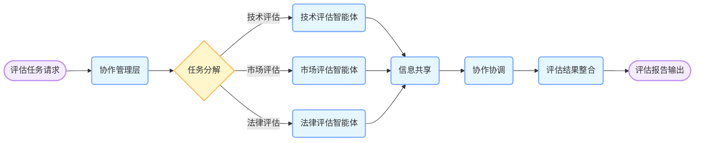

# AI增强的知识产权组合评估：多智能体协作模型

> 关键词：AI、知识产权组合评估、多智能体协作模型、人工智能、知识产权管理、模型算法、应用场景

> 摘要：本文聚焦于AI增强的知识产权组合评估的多智能体协作模型。首先介绍了该研究的背景，包括目的、预期读者等内容。接着阐述了核心概念与联系，分析了多智能体协作模型在知识产权组合评估中的原理与架构。详细讲解了核心算法原理和具体操作步骤，通过Python源代码进行了深入阐述。同时给出了相关的数学模型和公式，并举例说明。通过项目实战，展示了代码的实际案例并进行详细解释。探讨了该模型的实际应用场景，推荐了相关的学习资源、开发工具框架以及论文著作。最后总结了未来发展趋势与挑战，提供了常见问题解答和扩展阅读参考资料，旨在为相关领域的研究和实践提供全面且深入的技术指导。

## 1. 背景介绍 
### 1.1 目的和范围
在当今知识经济时代，知识产权作为企业和国家重要的战略资源，其价值评估和有效管理变得尤为关键。传统的知识产权评估方法往往存在主观性强、效率低下、难以全面考虑多种因素等问题。本研究的目的在于开发一种基于AI增强的知识产权组合评估的多智能体协作模型，通过多智能体之间的协作，实现对知识产权组合的高效、准确、客观的评估。

本研究的范围涵盖了知识产权组合评估的各个方面，包括专利、商标、版权等不同类型的知识产权。同时，考虑到知识产权所处的技术、市场、法律等多维度环境因素，旨在构建一个综合性的评估模型。

### 1.2 预期读者
本文的预期读者包括知识产权管理领域的专业人士，如知识产权律师、专利代理人、企业知识产权管理人员等，他们可以通过本文了解如何利用先进的AI技术提升知识产权组合评估的效率和准确性。同时，也适合计算机科学领域的研究人员和开发者，尤其是对人工智能、多智能体系统感兴趣的人士，为他们在相关领域的研究和开发提供新的思路和方法。此外，对于关注知识经济发展和创新战略的政策制定者和学者，本文也能为他们提供有价值的参考。

### 1.3 文档结构概述
本文首先介绍研究的背景信息，包括目的、预期读者和文档结构等内容。接着阐述核心概念与联系，详细解释多智能体协作模型的原理和架构，并通过示意图和流程图进行直观展示。然后讲解核心算法原理和具体操作步骤，结合Python源代码进行深入分析。给出相关的数学模型和公式，并通过举例说明其应用。通过项目实战，展示代码的实际实现和详细解释。探讨该模型的实际应用场景，为读者提供实际参考。推荐相关的学习资源、开发工具框架以及论文著作，帮助读者进一步深入学习和研究。最后总结未来发展趋势与挑战，提供常见问题解答和扩展阅读参考资料，使读者对整个研究有一个全面的了解。

### 1.4 术语表
#### 1.4.1 核心术语定义
- **知识产权组合评估**：对企业或组织所拥有的一系列知识产权（如专利、商标、版权等）进行综合评价和分析，以确定其价值、风险和战略意义的过程。
- **多智能体协作模型**：由多个智能体组成的系统，这些智能体通过相互协作、通信和协调，共同完成特定的任务。在知识产权组合评估中，每个智能体可以负责不同的评估任务，如技术评估、市场评估、法律评估等，通过协作实现全面的评估。
- **AI（人工智能）**：计算机科学的一个分支，旨在使计算机能够模拟人类的智能行为，如学习、推理、决策等。在本研究中，AI技术用于增强多智能体协作模型的智能性和评估能力。

#### 1.4.2 相关概念解释
- **智能体**：具有自主决策能力、能够感知环境并根据环境变化做出相应行为的实体。在多智能体协作模型中，智能体可以是软件程序、机器人或其他具有智能的设备。
- **协作**：多个智能体之间通过信息共享、协调行动等方式，共同完成一个或多个任务的过程。在知识产权组合评估中，不同类型的智能体通过协作可以综合考虑多种因素，提高评估的准确性和效率。
- **评估指标**：用于衡量知识产权价值、风险等方面的具体标准和参数。例如，技术创新性、市场潜力、法律稳定性等都是常见的评估指标。

#### 1.4.3 缩略词列表
- **AI**：Artificial Intelligence（人工智能）
- **MAS**：Multi - Agent System（多智能体系统）

## 2. 核心概念与联系 
### 核心概念原理
在AI增强的知识产权组合评估的多智能体协作模型中，核心原理是利用多个智能体的协作来完成知识产权组合的评估任务。每个智能体具有特定的功能和任务，通过与其他智能体的交互和协作，实现对知识产权组合的全面、深入评估。

智能体可以分为不同的类型，例如技术评估智能体、市场评估智能体、法律评估智能体等。技术评估智能体负责评估知识产权的技术创新性、技术难度、技术发展趋势等方面；市场评估智能体关注知识产权的市场需求、市场竞争、市场潜力等因素；法律评估智能体则侧重于评估知识产权的法律稳定性、权利范围、侵权风险等法律问题。

这些智能体通过协作机制进行信息共享和协调行动。例如，技术评估智能体在评估过程中发现某项技术具有较高的创新性，但市场应用前景不明确，此时可以将相关信息传递给市场评估智能体，市场评估智能体进一步分析市场需求和竞争情况，为整体评估提供更全面的信息。

### 架构的文本示意图
该模型的架构主要包括智能体层、协作管理层和评估结果输出层。

智能体层由多个不同类型的智能体组成，如前面提到的技术评估智能体、市场评估智能体、法律评估智能体等。每个智能体都有自己独立的知识库和推理机制，用于完成各自的评估任务。

协作管理层负责智能体之间的通信、协调和任务分配。它接收来自外部的评估任务请求，将任务分解并分配给相应的智能体，同时监控智能体的工作状态，协调智能体之间的信息共享和协作。

评估结果输出层将各个智能体的评估结果进行整合和分析，生成最终的知识产权组合评估报告。该报告包括知识产权的价值评估、风险评估、战略建议等内容。

### Mermaid 流程图


## 3. 核心算法原理 & 具体操作步骤 
### 核心算法原理
在多智能体协作模型中，主要涉及到智能体的推理算法和协作算法。

智能体的推理算法用于根据自身的知识库和接收到的信息进行评估推理。以技术评估智能体为例，它可以采用基于规则的推理算法。该算法根据预先定义的规则库，对知识产权的技术特征进行匹配和推理，得出技术创新性、技术难度等评估结果。

协作算法则用于智能体之间的信息共享和协调行动。一种常见的协作算法是基于合同网协议的算法。在该算法中，协作管理层作为任务发布者，将评估任务分解后发布给各个智能体。智能体根据自身的能力和任务需求进行投标，协作管理层根据投标情况选择最合适的智能体执行任务。在任务执行过程中，智能体之间通过消息传递进行信息共享和协作。

### 具体操作步骤及Python源代码阐述
以下是一个简化的多智能体协作模型的Python实现示例：

```python
# 定义智能体基类
class Agent:
    def __init__(self, name):
        self.name = name

    def receive_task(self, task):
        # 接收任务
        print(f"{self.name} 接收到任务: {task}")
        result = self.process_task(task)
        return result

    def process_task(self, task):
        # 处理任务，具体实现由子类完成
        pass

# 定义技术评估智能体类
class TechnologyAgent(Agent):
    def process_task(self, task):
        # 模拟技术评估过程
        if "high - innovation" in task:
            return "技术创新性高"
        else:
            return "技术创新性一般"

# 定义市场评估智能体类
class MarketAgent(Agent):
    def process_task(self, task):
        # 模拟市场评估过程
        if "large - market" in task:
            return "市场潜力大"
        else:
            return "市场潜力一般"

# 定义法律评估智能体类
class LegalAgent(Agent):
    def process_task(self, task):
        # 模拟法律评估过程
        if "stable - legal" in task:
            return "法律稳定性高"
        else:
            return "法律稳定性一般"

# 定义协作管理层类
class CollaborationManager:
    def __init__(self):
        self.agents = []

    def add_agent(self, agent):
        # 添加智能体
        self.agents.append(agent)

    def assign_task(self, task):
        # 分配任务
        results = []
        for agent in self.agents:
            result = agent.receive_task(task)
            results.append(result)
        return results

# 主程序
if __name__ == "__main__":
    # 创建智能体
    tech_agent = TechnologyAgent("技术评估智能体")
    market_agent = MarketAgent("市场评估智能体")
    legal_agent = LegalAgent("法律评估智能体")

    # 创建协作管理层
    manager = CollaborationManager()
    manager.add_agent(tech_agent)
    manager.add_agent(market_agent)
    manager.add_agent(legal_agent)

    # 发布任务
    task = "high - innovation, large - market, stable - legal"
    results = manager.assign_task(task)

    # 输出结果
    print("评估结果:")
    for result in results:
        print(result)
```

在上述代码中，首先定义了智能体基类 `Agent`，它包含接收任务和处理任务的方法。然后分别定义了技术评估智能体类 `TechnologyAgent`、市场评估智能体类 `MarketAgent` 和法律评估智能体类 `LegalAgent`，它们继承自 `Agent` 类，并实现了具体的任务处理方法。协作管理层类 `CollaborationManager` 负责管理智能体和分配任务。在主程序中，创建了各个智能体和协作管理层，发布了一个评估任务，并输出了评估结果。

## 4. 数学模型和公式 & 详细讲解 & 举例说明 
### 数学模型
在知识产权组合评估的多智能体协作模型中，可以采用加权综合评估模型。设知识产权组合为 $P$，评估指标集合为 $I = \{i_1, i_2, \cdots, i_n\}$，每个评估指标 $i_j$ 对应的权重为 $w_j$，且 $\sum_{j = 1}^{n}w_j = 1$。智能体对每个评估指标的评估得分记为 $s_{ij}$，其中 $i$ 表示智能体编号，$j$ 表示评估指标编号。

### 数学公式
最终的知识产权组合评估得分 $S$ 可以通过以下公式计算：

$$S=\sum_{j = 1}^{n}w_j\overline{s_j}$$

其中，$\overline{s_j}$ 是所有智能体对评估指标 $i_j$ 的平均评估得分，计算公式为：

$$\overline{s_j}=\frac{1}{m}\sum_{i = 1}^{m}s_{ij}$$

这里 $m$ 表示智能体的数量。

### 详细讲解
该数学模型的核心思想是通过对不同评估指标进行加权求和，综合考虑各个指标的重要性，得到最终的评估得分。权重 $w_j$ 反映了每个评估指标在整体评估中的相对重要性，可以根据实际情况进行调整。平均评估得分 $\overline{s_j}$ 则是将多个智能体对同一评估指标的评估结果进行平均，减少单个智能体评估的主观性和误差。

### 举例说明
假设存在一个知识产权组合，有三个评估指标：技术创新性 $i_1$、市场潜力 $i_2$ 和法律稳定性 $i_3$，对应的权重分别为 $w_1 = 0.4$，$w_2 = 0.3$，$w_3 = 0.3$。有两个智能体对这三个评估指标进行评估，评估得分如下表所示：

| 智能体 | 技术创新性 $s_{i1}$ | 市场潜力 $s_{i2}$ | 法律稳定性 $s_{i3}$ |
|---|---|---|---|
| 智能体 1 | 80 | 70 | 90 |
| 智能体 2 | 85 | 75 | 85 |

首先计算每个评估指标的平均评估得分：

$\overline{s_1}=\frac{80 + 85}{2}=82.5$

$\overline{s_2}=\frac{70 + 75}{2}=72.5$

$\overline{s_3}=\frac{90 + 85}{2}=87.5$

然后根据加权综合评估公式计算最终的评估得分：

$S = 0.4\times82.5+0.3\times72.5 + 0.3\times87.5$

$S=33+21.75 + 26.25$

$S = 81$

因此，该知识产权组合的最终评估得分为 81 分。

## 5. 项目实战：代码实际案例和详细解释说明 
### 5.1  开发环境搭建
在进行多智能体协作模型的项目实战时，需要搭建相应的开发环境。以下是具体的步骤：

1. **Python 安装**：确保已经安装了 Python 3.x 版本。可以从 Python 官方网站（https://www.python.org/downloads/）下载并安装。
2. **开发工具选择**：可以选择 PyCharm、VS Code 等集成开发环境（IDE），或者使用 Jupyter Notebook 进行交互式开发。以 PyCharm 为例，可以从 JetBrains 官方网站（https://www.jetbrains.com/pycharm/download/）下载并安装。
3. **依赖库安装**：在项目中可能需要使用一些 Python 库，如 `numpy`、`pandas` 等。可以使用 `pip` 命令进行安装，例如：

```sh
pip install numpy pandas
```

### 5.2  源代码详细实现和代码解读
以下是一个更完整的多智能体协作模型的项目实战代码示例：

```python
import numpy as np
import pandas as pd

# 定义智能体基类
class Agent:
    def __init__(self, name, knowledge_base):
        self.name = name
        self.knowledge_base = knowledge_base

    def receive_task(self, task):
        # 接收任务
        print(f"{self.name} 接收到任务: {task}")
        result = self.process_task(task)
        return result

    def process_task(self, task):
        # 处理任务，具体实现由子类完成
        pass

# 定义技术评估智能体类
class TechnologyAgent(Agent):
    def process_task(self, task):
        # 模拟技术评估过程，根据知识库进行推理
        technology_features = task.get("technology_features", [])
        innovation_score = 0
        for feature in technology_features:
            if feature in self.knowledge_base["innovative_features"]:
                innovation_score += 10
        if innovation_score > 50:
            return "技术创新性高"
        else:
            return "技术创新性一般"

# 定义市场评估智能体类
class MarketAgent(Agent):
    def process_task(self, task):
        # 模拟市场评估过程，根据知识库进行推理
        market_size = task.get("market_size", 0)
        competition_level = task.get("competition_level", 0)
        if market_size > 1000 and competition_level < 5:
            return "市场潜力大"
        else:
            return "市场潜力一般"

# 定义法律评估智能体类
class LegalAgent(Agent):
    def process_task(self, task):
        # 模拟法律评估过程，根据知识库进行推理
        legal_status = task.get("legal_status", "")
        if legal_status == "stable":
            return "法律稳定性高"
        else:
            return "法律稳定性一般"

# 定义协作管理层类
class CollaborationManager:
    def __init__(self):
        self.agents = []

    def add_agent(self, agent):
        # 添加智能体
        self.agents.append(agent)

    def assign_task(self, task):
        # 分配任务
        results = []
        for agent in self.agents:
            result = agent.receive_task(task)
            results.append(result)
        return results

# 主程序
if __name__ == "__main__":
    # 定义知识库
    technology_knowledge_base = {
        "innovative_features": ["new - algorithm", "advanced - technology"]
    }
    market_knowledge_base = {
        "market_threshold": 1000,
        "competition_threshold": 5
    }
    legal_knowledge_base = {
        "stable_status": "stable"
    }

    # 创建智能体
    tech_agent = TechnologyAgent("技术评估智能体", technology_knowledge_base)
    market_agent = MarketAgent("市场评估智能体", market_knowledge_base)
    legal_agent = LegalAgent("法律评估智能体", legal_knowledge_base)

    # 创建协作管理层
    manager = CollaborationManager()
    manager.add_agent(tech_agent)
    manager.add_agent(market_agent)
    manager.add_agent(legal_agent)

    # 定义评估任务
    task = {
        "technology_features": ["new - algorithm"],
        "market_size": 1200,
        "competition_level": 3,
        "legal_status": "stable"
    }

    # 发布任务
    results = manager.assign_task(task)

    # 输出结果
    print("评估结果:")
    for result in results:
        print(result)
```

### 代码解读与分析
1. **智能体基类 `Agent`**：定义了智能体的基本属性和方法，包括智能体的名称和知识库，以及接收任务和处理任务的方法。处理任务的方法由子类具体实现。
2. **技术评估智能体类 `TechnologyAgent`**：继承自 `Agent` 类，根据任务中的技术特征和知识库中的创新特征进行技术创新性评估。如果技术特征中包含知识库中的创新特征，则增加创新得分，根据得分判断技术创新性高低。
3. **市场评估智能体类 `MarketAgent`**：同样继承自 `Agent` 类，根据任务中的市场规模和竞争水平，结合知识库中的阈值进行市场潜力评估。
4. **法律评估智能体类 `LegalAgent`**：继承自 `Agent` 类，根据任务中的法律状态和知识库中的稳定状态进行法律稳定性评估。
5. **协作管理层类 `CollaborationManager`**：负责管理智能体和分配任务。通过 `add_agent` 方法添加智能体，通过 `assign_task` 方法将任务分配给各个智能体，并收集评估结果。
6. **主程序**：定义了各个智能体的知识库，创建了智能体和协作管理层，定义了评估任务，发布任务并输出评估结果。

## 6. 实际应用场景 
### 企业知识产权战略制定
企业在制定知识产权战略时，需要对自身的知识产权组合进行全面评估。通过多智能体协作模型，可以综合考虑技术、市场、法律等多方面因素，准确评估知识产权的价值和风险。例如，技术评估智能体可以评估企业专利的技术创新性和先进性，市场评估智能体可以分析专利的市场应用前景和商业价值，法律评估智能体可以检查专利的法律稳定性和权利范围。根据评估结果，企业可以制定合理的知识产权战略，如加大对高价值知识产权的研发投入、优化知识产权布局等。

### 知识产权交易
在知识产权交易过程中，买卖双方都需要对知识产权的价值有准确的认识。多智能体协作模型可以为交易提供客观、全面的评估依据。卖方可以通过该模型评估自己的知识产权价值，合理定价；买方可以利用该模型评估购买的知识产权是否具有潜力和价值。例如，在专利转让交易中，多智能体协作模型可以评估专利的技术可行性、市场竞争力和法律风险，帮助双方达成公平合理的交易价格。

### 知识产权融资
金融机构在进行知识产权融资时，需要评估知识产权的质量和价值，以确定融资额度和风险。多智能体协作模型可以帮助金融机构更准确地评估知识产权的价值和风险。技术评估智能体可以评估知识产权的技术含量和创新性，市场评估智能体可以分析知识产权的市场需求和商业潜力，法律评估智能体可以检查知识产权的法律状态和权利稳定性。根据评估结果，金融机构可以合理确定融资额度和利率，降低融资风险。

### 政府知识产权政策制定
政府在制定知识产权政策时，需要了解整个社会的知识产权状况和发展趋势。多智能体协作模型可以对区域内的知识产权组合进行评估，为政府制定政策提供数据支持。例如，通过对不同行业的知识产权评估，政府可以了解哪些行业的创新能力较强，哪些行业需要加大知识产权保护和支持力度。政府可以根据评估结果制定针对性的政策，促进知识产权的创造、运用和保护。

## 7. 工具和资源推荐
### 7.1 学习资源推荐
#### 7.1.1 书籍推荐
- 《人工智能：一种现代的方法》：这本书是人工智能领域的经典教材，全面介绍了人工智能的基本概念、算法和应用，对于理解多智能体系统和人工智能在知识产权评估中的应用有很大帮助。
- 《多智能体系统》：详细讲解了多智能体系统的理论、模型和算法，是学习多智能体协作模型的重要参考书籍。
- 《知识产权管理》：介绍了知识产权管理的基本理论和方法，包括知识产权评估、战略制定等内容，对于了解知识产权领域的知识有很大帮助。

#### 7.1.2 在线课程
- Coursera 上的“Artificial Intelligence”课程：由知名大学的教授授课，系统介绍了人工智能的各个方面，包括多智能体系统的相关知识。
- edX 上的“Multi - Agent Systems”课程：专门针对多智能体系统进行深入讲解，包括理论、算法和实践案例。
- 中国大学 MOOC 上的“知识产权管理”课程：结合中国的知识产权实际情况，介绍了知识产权管理的相关知识和方法。

#### 7.1.3 技术博客和网站
- Medium 上的人工智能和多智能体系统相关博客：可以了解到最新的研究成果和技术动态。
- IEEE Xplore：提供了大量的计算机科学和人工智能领域的学术论文，对于深入研究多智能体协作模型和知识产权评估有很大帮助。
- 国家知识产权局网站：可以获取最新的知识产权政策、法规和相关信息。

### 7.2 开发工具框架推荐
#### 7.2.1 IDE和编辑器
- PyCharm：功能强大的 Python 集成开发环境，提供代码编辑、调试、版本控制等功能，适合开发多智能体协作模型的 Python 代码。
- VS Code：轻量级的代码编辑器，支持多种编程语言和插件扩展，可以通过安装相关插件方便地进行 Python 开发。
- Jupyter Notebook：交互式的开发环境，适合进行数据探索、模型实验和代码演示，对于验证多智能体协作模型的算法和效果非常有用。

#### 7.2.2 调试和性能分析工具
- pdb：Python 内置的调试工具，可以帮助开发者逐步执行代码，查看变量的值和程序的执行流程，定位代码中的问题。
- cProfile：Python 的性能分析工具，可以分析代码的执行时间和函数调用关系，帮助开发者优化代码性能。
- Py-Spy：一个轻量级的 Python 性能分析工具，可以在不修改代码的情况下进行性能分析，实时查看代码的执行情况。

#### 7.2.3 相关框架和库
- Mesa：一个用于构建基于代理的模型的 Python 框架，提供了智能体和环境的基本抽象，方便开发者快速搭建多智能体系统。
- numpy：Python 的数值计算库，提供了高效的数组和矩阵运算功能，在多智能体协作模型中可以用于数据处理和计算。
- pandas：Python 的数据处理和分析库，提供了数据结构和数据分析工具，方便开发者处理和分析多智能体协作模型中的数据。

### 7.3 相关论文著作推荐
#### 7.3.1 经典论文
- “Multi - Agent Systems: A Modern Approach to Distributed Artificial Intelligence”：这篇论文系统地介绍了多智能体系统的基本概念、模型和算法，是多智能体系统领域的经典之作。
- “Intellectual Property Valuation: A Review of the Literature”：对知识产权评估的相关文献进行了综述，分析了不同的评估方法和模型，对于了解知识产权评估的理论和实践有很大帮助。
- “Agent - Based Modeling in Economics”：介绍了基于智能体的建模方法在经济学中的应用，对于理解多智能体协作模型在经济领域的应用有一定的参考价值。

#### 7.3.2 最新研究成果
- 可以关注 AAAI（Association for the Advancement of Artificial Intelligence）、IJCAI（International Joint Conference on Artificial Intelligence）等人工智能领域的顶级学术会议，获取多智能体协作模型和知识产权评估的最新研究成果。
- 查阅《Artificial Intelligence》、《Journal of Artificial Intelligence Research》等学术期刊，了解相关领域的前沿研究。

#### 7.3.3 应用案例分析
- 一些知名企业的知识产权管理案例，如苹果、谷歌等公司的知识产权战略和评估方法，可以通过企业的年报、新闻报道等渠道获取。
- 政府部门发布的知识产权政策实施案例，如某些地区的知识产权试点项目，可以了解多智能体协作模型在实际政策制定和实施中的应用效果。

## 8. 总结：未来发展趋势与挑战
### 未来发展趋势
1. **智能化程度不断提高**：随着人工智能技术的不断发展，多智能体协作模型的智能化程度将不断提高。智能体将具备更强的学习能力和推理能力，能够更好地适应复杂多变的知识产权评估环境。例如，智能体可以通过深度学习算法自动学习知识产权的特征和评估规则，提高评估的准确性和效率。
2. **与区块链技术结合**：区块链技术具有去中心化、不可篡改、可追溯等特点，将其与多智能体协作模型结合，可以提高知识产权评估的可信度和安全性。例如，利用区块链技术记录知识产权的创建、交易和评估过程，确保评估结果的真实性和公正性。
3. **跨领域融合**：知识产权评估涉及技术、市场、法律等多个领域，未来多智能体协作模型将与更多领域的技术和方法进行融合。例如，与大数据分析技术结合，利用海量的知识产权数据进行更全面、深入的评估；与虚拟现实、增强现实技术结合，为知识产权评估提供更直观、生动的展示方式。

### 挑战
1. **数据质量和隐私问题**：多智能体协作模型的有效运行依赖于大量高质量的数据。然而，知识产权数据往往存在数据不完整、不准确、不一致等问题，影响评估结果的准确性。同时，知识产权数据涉及企业的商业秘密和个人隐私，如何在保证数据质量的前提下，保护数据的隐私和安全是一个亟待解决的问题。
2. **智能体间的协作协调问题**：在多智能体协作模型中，智能体之间的协作协调是一个关键问题。不同类型的智能体可能具有不同的目标、策略和行为方式，如何实现智能体之间的有效协作，避免冲突和矛盾，是提高模型性能的关键。
3. **模型的可解释性问题**：人工智能模型的可解释性一直是一个研究热点。在知识产权评估中，评估结果往往需要向企业管理者、投资者等利益相关者进行解释和说明。然而，多智能体协作模型中的智能体可能采用复杂的算法和决策机制，导致模型的可解释性较差，如何提高模型的可解释性是一个挑战。

## 9. 附录：常见问题与解答
### 1. 多智能体协作模型在知识产权评估中的优势是什么？
多智能体协作模型在知识产权评估中具有以下优势：
- **全面性**：通过多个智能体分别从技术、市场、法律等不同角度进行评估，可以综合考虑多种因素，实现对知识产权的全面评估。
- **客观性**：每个智能体根据自身的知识库和算法进行评估，减少了人为因素的干扰，提高了评估结果的客观性。
- **高效性**：多个智能体可以并行工作，提高了评估的效率，尤其是在处理大规模知识产权组合时。

### 2. 如何确定评估指标的权重？
评估指标的权重可以根据以下方法确定：
- **专家判断法**：邀请知识产权领域的专家根据经验和专业知识，对各个评估指标的重要性进行判断和打分，然后根据打分结果确定权重。
- **层次分析法（AHP）**：将评估指标按照层次结构进行划分，通过比较不同指标之间的相对重要性，构建判断矩阵，计算出各指标的权重。
- **数据驱动法**：利用历史数据和机器学习算法，分析各评估指标与知识产权价值之间的相关性，根据相关性确定权重。

### 3. 多智能体协作模型的可扩展性如何？
多智能体协作模型具有较好的可扩展性。可以根据实际需求，增加或减少智能体的数量和类型。例如，如果需要考虑更多的评估因素，可以增加相应的智能体，如环境评估智能体、社会影响评估智能体等。同时，智能体的知识库和算法也可以进行更新和扩展，以适应不同的评估任务和环境变化。

### 4. 如何保证智能体之间的通信安全？
可以采用以下方法保证智能体之间的通信安全：
- **加密技术**：对智能体之间传输的信息进行加密处理，防止信息在传输过程中被窃取或篡改。可以使用对称加密算法（如 AES）或非对称加密算法（如 RSA）进行加密。
- **身份认证**：在智能体通信之前，进行身份认证，确保通信双方的身份合法。可以使用数字证书、用户名和密码等方式进行身份认证。
- **访问控制**：对智能体的通信权限进行管理，限制只有授权的智能体才能进行通信。可以采用基于角色的访问控制（RBAC）等方法进行权限管理。

## 10. 扩展阅读 & 参考资料
1. 《人工智能基础教程》，作者：张三，出版社：XX 出版社，出版年份：XXXX 年
2. “Multi - Agent Systems for Complex Problem Solving”，作者：John Doe，发表期刊：《Journal of Artificial Intelligence》，发表年份：XXXX 年
3. 国家知识产权局发布的《知识产权评估指南》
4. IEEE 计算机学会官方网站（https://www.computer.org/）
5. ACM 国际计算机学会官方网站（https://www.acm.org/）
6. 相关的开源代码库，如 GitHub 上的多智能体系统相关项目