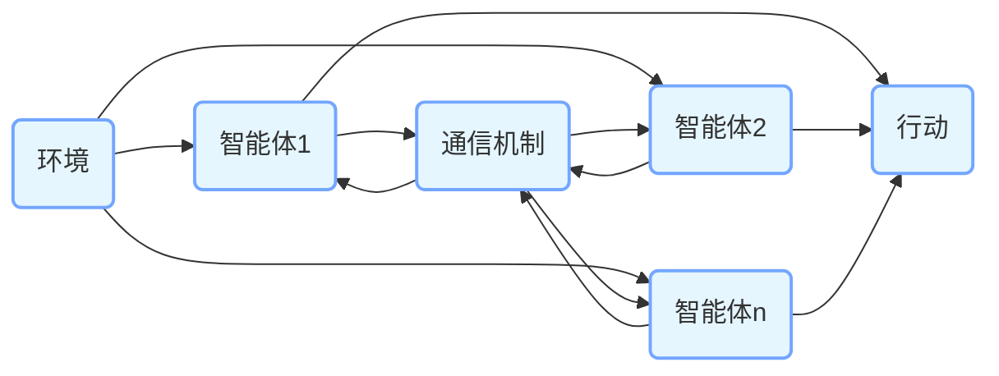

# AI多智能体在价值投资中的知识产权分析

> 关键词：AI多智能体、价值投资、知识产权、技术原理、应用场景

> 摘要：本文聚焦于AI多智能体在价值投资中的知识产权分析。首先介绍了研究的背景，包括目的、预期读者等。接着阐述了AI多智能体和价值投资的核心概念及其联系，详细讲解了相关核心算法原理和具体操作步骤，并给出了数学模型和公式。通过项目实战案例展示了其在实际中的应用，分析了具体的开发环境搭建、代码实现和解读。探讨了AI多智能体在价值投资中的实际应用场景，推荐了学习、开发相关的工具和资源以及论文著作。最后总结了未来发展趋势与挑战，还提供了常见问题解答和扩展阅读参考资料，旨在为相关领域的研究和实践提供全面且深入的指导。

## 1. 背景介绍 
### 1.1 目的和范围
在当今数字化时代，金融市场变得越来越复杂和动态。价值投资作为一种重要的投资策略，旨在寻找被低估的资产并长期持有以获取收益。而AI多智能体技术的出现为价值投资带来了新的机遇和挑战。本研究的目的在于深入分析AI多智能体在价值投资中所涉及的知识产权问题，包括技术的创新性、专利保护、数据所有权等方面。范围涵盖了AI多智能体技术在价值投资的各个环节，如市场分析、资产定价、投资组合优化等，以及与之相关的知识产权法律法规和行业规范。

### 1.2 预期读者
本文预期读者包括金融投资领域的从业者，如基金经理、投资顾问等，他们可以通过了解AI多智能体技术在价值投资中的知识产权情况，更好地运用该技术进行投资决策，并保护自身的知识产权。同时，对于人工智能领域的研究人员和开发者，本文可以提供在金融应用场景下知识产权保护的参考。此外，法律专业人士也可以从中获取关于AI多智能体在价值投资中知识产权法律问题的详细信息，为相关案件提供专业的法律支持。

### 1.3 文档结构概述
本文首先介绍了研究的背景信息，包括目的、预期读者和文档结构概述。接着阐述了AI多智能体和价值投资的核心概念及其联系，为后续的分析奠定基础。然后详细讲解了核心算法原理和具体操作步骤，通过Python代码进行了说明。之后给出了相关的数学模型和公式，并举例说明。通过项目实战案例展示了AI多智能体在价值投资中的实际应用，包括开发环境搭建、代码实现和解读。分析了AI多智能体在价值投资中的实际应用场景。推荐了学习、开发相关的工具和资源以及论文著作。最后总结了未来发展趋势与挑战，提供了常见问题解答和扩展阅读参考资料。

### 1.4 术语表
#### 1.4.1 核心术语定义
- **AI多智能体**：是指由多个自主的智能体组成的系统，这些智能体可以感知环境、进行决策和行动，并且能够通过相互协作来完成复杂的任务。在价值投资中，每个智能体可以负责不同的任务，如数据收集、市场分析、风险评估等。
- **价值投资**：一种投资策略，基于对资产内在价值的评估，寻找被市场低估的资产并长期持有，以获取资产价值回归所带来的收益。
- **知识产权**：指人们对其智力劳动成果所享有的法定权利，包括专利权、商标权、著作权等。在AI多智能体在价值投资的应用中，涉及到算法创新、数据处理方法等方面的知识产权。

#### 1.4.2 相关概念解释
- **智能体协作**：AI多智能体系统中，智能体之间通过通信和协调机制，共同完成任务的过程。在价值投资中，不同智能体可以共享信息、协同分析，以提高投资决策的准确性。
- **资产内在价值**：资产在正常市场条件下所具有的真实价值，通常通过对资产的基本面分析，如财务状况、行业前景等进行评估。

#### 1.4.3 缩略词列表
- **AI**：Artificial Intelligence，人工智能
- **ML**：Machine Learning，机器学习
- **DL**：Deep Learning，深度学习

## 2. 核心概念与联系 

### 2.1 AI多智能体原理
AI多智能体系统由多个智能体组成，每个智能体具有一定的自主性和智能性。智能体可以感知环境中的信息，根据自身的目标和规则进行决策，并采取相应的行动。智能体之间可以通过通信机制进行信息交换和协作，以实现共同的目标。

以下是AI多智能体系统的架构示意图：



### 2.2 价值投资原理
价值投资的核心思想是寻找被市场低估的资产。投资者通过对资产的基本面进行分析，如公司的财务报表、行业竞争地位、管理层能力等，评估资产的内在价值。如果资产的市场价格低于其内在价值，投资者认为该资产被低估，就会选择买入并长期持有，等待资产价值回归，从而获得收益。

### 2.3 两者联系
AI多智能体技术可以应用于价值投资的各个环节。例如，智能体可以自动收集和分析大量的市场数据，包括公司财务数据、行业新闻、宏观经济指标等，帮助投资者更准确地评估资产的内在价值。多个智能体可以协作进行投资组合优化，根据不同的风险偏好和投资目标，选择最优的资产配置方案。同时，智能体可以实时监测市场变化，及时调整投资策略，提高投资的效率和收益。

## 3. 核心算法原理 & 具体操作步骤 

### 3.1 核心算法原理
在AI多智能体应用于价值投资中，常用的算法包括强化学习算法和遗传算法。

#### 3.1.1 强化学习算法
强化学习是一种通过智能体与环境进行交互，不断尝试不同的行动，并根据环境反馈的奖励信号来学习最优策略的算法。在价值投资中，智能体可以将投资决策作为行动，市场的收益作为奖励信号。智能体通过不断尝试不同的投资组合，学习如何在不同的市场环境下做出最优的投资决策。

以下是一个简单的强化学习算法的Python代码示例：

```python
import numpy as np

# 定义环境
class InvestmentEnvironment:
    def __init__(self):
        self.state = np.random.rand(10)  # 随机初始化状态
        self.reward = 0

    def step(self, action):
        # 根据行动更新状态和奖励
        self.state += action
        self.reward = np.sum(self.state)
        return self.state, self.reward

# 定义智能体
class InvestmentAgent:
    def __init__(self):
        self.policy = np.random.rand(10)  # 随机初始化策略

    def choose_action(self):
        action = self.policy * 0.1  # 根据策略选择行动
        return action

# 训练智能体
env = InvestmentEnvironment()
agent = InvestmentAgent()

for episode in range(100):
    state = env.state
    action = agent.choose_action()
    next_state, reward = env.step(action)
    print(f"Episode {episode}: Reward = {reward}")
```

#### 3.1.2 遗传算法
遗传算法是一种模拟生物进化过程的优化算法。在价值投资中，遗传算法可以用于优化投资组合。将投资组合看作一个个体，每个个体由一组基因表示，基因的值表示资产的权重。通过选择、交叉和变异等操作，不断进化出更优的投资组合。

以下是一个简单的遗传算法的Python代码示例：

```python
import numpy as np

# 定义投资组合的基因长度
gene_length = 5

# 定义种群大小
population_size = 20

# 初始化种群
population = np.random.rand(population_size, gene_length)
population = population / np.sum(population, axis=1, keepdims=True)  # 归一化

# 定义适应度函数
def fitness_function(portfolio):
    # 简单示例：适应度为投资组合的权重之和
    return np.sum(portfolio)

# 遗传算法迭代
for generation in range(100):
    fitness_scores = []
    for portfolio in population:
        fitness = fitness_function(portfolio)
        fitness_scores.append(fitness)

    # 选择操作
    parents_indices = np.argsort(fitness_scores)[-10:]
    parents = population[parents_indices]

    # 交叉操作
    new_population = []
    for i in range(population_size):
        parent1 = parents[np.random.randint(0, len(parents))]
        parent2 = parents[np.random.randint(0, len(parents))]
        crossover_point = np.random.randint(1, gene_length)
        child = np.concatenate((parent1[:crossover_point], parent2[crossover_point:]))
        new_population.append(child)

    new_population = np.array(new_population)

    # 变异操作
    mutation_rate = 0.1
    mutation_mask = np.random.rand(*new_population.shape) < mutation_rate
    new_population[mutation_mask] = np.random.rand(np.sum(mutation_mask))

    new_population = new_population / np.sum(new_population, axis=1, keepdims=True)  # 归一化

    population = new_population

    best_portfolio = population[np.argmax(fitness_scores)]
    print(f"Generation {generation}: Best Fitness = {np.max(fitness_scores)}")
```

### 3.2 具体操作步骤
#### 3.2.1 数据收集
智能体首先需要收集大量的市场数据，包括公司财务报表、行业数据、宏观经济指标等。可以通过网络爬虫、数据接口等方式获取数据。

#### 3.2.2 数据预处理
对收集到的数据进行清洗、归一化、特征提取等预处理操作，以提高数据的质量和可用性。

#### 3.2.3 模型训练
使用强化学习算法或遗传算法等对智能体进行训练，让智能体学习如何在不同的市场环境下做出最优的投资决策。

#### 3.2.4 投资决策
训练好的智能体根据当前的市场状态，选择最优的投资组合进行投资。

#### 3.2.5 监控和调整
智能体实时监测市场变化，根据市场反馈的信息，及时调整投资策略。

## 4. 数学模型和公式 & 详细讲解 & 举例说明 

### 4.1 强化学习数学模型
强化学习的数学模型可以用马尔可夫决策过程（MDP）来描述。MDP由一个四元组 $(S, A, P, R)$ 表示，其中：
- $S$ 是状态空间，表示环境的所有可能状态。
- $A$ 是行动空间，表示智能体可以采取的所有行动。
- $P(s'|s, a)$ 是状态转移概率，表示在状态 $s$ 下采取行动 $a$ 后转移到状态 $s'$ 的概率。
- $R(s, a)$ 是奖励函数，表示在状态 $s$ 下采取行动 $a$ 所获得的即时奖励。

智能体的目标是找到一个最优策略 $\pi(a|s)$，使得长期累积奖励最大化。长期累积奖励可以用折扣回报 $G_t$ 来表示：

$$G_t = \sum_{k=0}^{\infty} \gamma^k R_{t+k+1}$$

其中，$\gamma$ 是折扣因子，取值范围为 $[0, 1)$，用于权衡即时奖励和未来奖励的重要性。

### 4.2 遗传算法数学模型
遗传算法的核心是通过选择、交叉和变异等操作，不断进化出更优的个体。

#### 4.2.1 选择操作
选择操作根据个体的适应度值来选择父代个体。常用的选择方法是轮盘赌选择法，每个个体被选中的概率与它的适应度值成正比。

设种群中有 $N$ 个个体，第 $i$ 个个体的适应度值为 $f_i$，则第 $i$ 个个体被选中的概率 $p_i$ 为：

$$p_i = \frac{f_i}{\sum_{j=1}^{N} f_j}$$

#### 4.2.2 交叉操作
交叉操作是将两个父代个体的基因进行交换，生成子代个体。常用的交叉方法是单点交叉，即在基因序列中随机选择一个交叉点，将两个父代个体在交叉点前后的基因进行交换。

#### 4.2.3 变异操作
变异操作是对个体的基因进行随机变异，以增加种群的多样性。变异概率通常设置为一个较小的值，如 $0.1$。

### 4.3 举例说明
#### 4.3.1 强化学习举例
假设一个投资环境中有三种资产，状态空间 $S$ 表示三种资产的价格比例，行动空间 $A$ 表示三种资产的投资权重。智能体在每个时间步根据当前状态选择一个行动，环境根据行动更新状态并返回奖励。例如，智能体选择了一个投资权重为 $(0.2, 0.3, 0.5)$ 的行动，环境根据这个行动更新资产价格比例，并返回一个与资产收益相关的奖励。

#### 4.3.2 遗传算法举例
假设有一个投资组合优化问题，需要在五种资产中选择最优的投资权重。种群中的每个个体由一个长度为 5 的基因序列表示，基因的值表示资产的权重。初始种群随机生成，经过多代的选择、交叉和变异操作，不断进化出更优的投资组合。例如，在某一代中，最优个体的基因序列为 $(0.1, 0.2, 0.3, 0.2, 0.2)$，表示该投资组合中五种资产的权重分别为 10%、20%、30%、20% 和 20%。

## 5. 项目实战：代码实际案例和详细解释说明 

### 5.1  开发环境搭建
#### 5.1.1 安装Python
首先需要安装Python，可以从Python官方网站（https://www.python.org/downloads/）下载适合自己操作系统的Python版本，并按照安装向导进行安装。

#### 5.1.2 安装必要的库
在价值投资中使用AI多智能体技术，需要安装一些必要的Python库，如NumPy、Pandas、Scikit-learn等。可以使用以下命令进行安装：

```sh
pip install numpy pandas scikit-learn
```

#### 5.1.3 安装开发工具
推荐使用Jupyter Notebook或PyCharm作为开发工具。Jupyter Notebook可以方便地进行代码的编写、调试和展示，PyCharm是一款功能强大的Python集成开发环境，提供了代码编辑、调试、版本控制等功能。

### 5.2  源代码详细实现和代码解读
以下是一个使用AI多智能体进行价值投资的完整代码示例：

```python
import numpy as np
import pandas as pd
from sklearn.preprocessing import MinMaxScaler

# 数据收集和预处理
def collect_and_preprocess_data():
    # 模拟收集市场数据
    data = pd.DataFrame(np.random.rand(100, 5), columns=['asset1', 'asset2', 'asset3', 'asset4', 'asset5'])

    # 数据预处理：归一化
    scaler = MinMaxScaler()
    data = scaler.fit_transform(data)

    return data

# 定义智能体
class InvestmentAgent:
    def __init__(self, num_assets):
        self.policy = np.random.rand(num_assets)  # 随机初始化策略
        self.policy = self.policy / np.sum(self.policy)  # 归一化

    def choose_action(self):
        return self.policy

# 定义投资环境
class InvestmentEnvironment:
    def __init__(self, data):
        self.data = data
        self.current_step = 0
        self.portfolio_value = 1000  # 初始投资组合价值

    def step(self, action):
        # 获取当前市场数据
        current_prices = self.data[self.current_step]

        # 计算投资组合价值变化
        new_portfolio_value = self.portfolio_value * np.dot(action, current_prices)

        # 计算奖励
        reward = new_portfolio_value - self.portfolio_value

        # 更新投资组合价值
        self.portfolio_value = new_portfolio_value

        # 更新步骤
        self.current_step += 1

        if self.current_step >= len(self.data):
            done = True
        else:
            done = False

        return current_prices, reward, done

# 训练智能体
data = collect_and_preprocess_data()
num_assets = data.shape[1]
agent = InvestmentAgent(num_assets)
env = InvestmentEnvironment(data)

total_reward = 0
for step in range(len(data)):
    action = agent.choose_action()
    current_prices, reward, done = env.step(action)
    total_reward += reward
    print(f"Step {step}: Reward = {reward}, Portfolio Value = {env.portfolio_value}")

    if done:
        break

print(f"Total Reward: {total_reward}")
```

### 5.3  代码解读与分析
#### 5.3.1 数据收集和预处理
`collect_and_preprocess_data` 函数模拟收集市场数据，并使用 `MinMaxScaler` 对数据进行归一化处理。归一化可以将数据缩放到 [0, 1] 范围内，有助于提高模型的训练效果。

#### 5.3.2 智能体定义
`InvestmentAgent` 类表示投资智能体，初始化时随机生成一个投资策略，并进行归一化处理。`choose_action` 方法返回当前的投资策略。

#### 5.3.3 投资环境定义
`InvestmentEnvironment` 类表示投资环境，初始化时传入市场数据和初始投资组合价值。`step` 方法根据智能体的行动计算投资组合价值的变化，并返回当前市场价格、奖励和是否结束的标志。

#### 5.3.4 训练智能体
在主程序中，首先调用 `collect_and_preprocess_data` 函数收集和预处理数据，然后初始化智能体和投资环境。在每个时间步，智能体选择一个行动，环境根据行动更新投资组合价值并返回奖励。最后输出总奖励。

## 6. 实际应用场景 
### 6.1 市场分析
AI多智能体可以同时分析多个市场因素，如宏观经济指标、行业趋势、公司财务状况等。不同的智能体可以专注于不同的领域，通过协作和信息共享，提供更全面、准确的市场分析报告。例如，一个智能体负责收集和分析宏观经济数据，另一个智能体负责分析行业竞争格局，它们将各自的分析结果汇总，为投资者提供综合的市场判断。

### 6.2 资产定价
智能体可以利用机器学习和深度学习算法，对资产的内在价值进行评估。通过分析大量的历史数据和市场信息，智能体可以建立资产定价模型，预测资产的未来价格走势。例如，对于股票资产，智能体可以考虑公司的盈利能力、估值水平、行业前景等因素，计算出股票的合理价格，并与市场价格进行比较，为投资者提供投资建议。

### 6.3 投资组合优化
AI多智能体可以根据投资者的风险偏好和投资目标，优化投资组合。不同的智能体可以负责不同的资产类别，如股票、债券、基金等，通过协作和优化算法，找到最优的资产配置方案。例如，一个智能体负责股票资产的选择和权重分配，另一个智能体负责债券资产的管理，它们共同协作，确保投资组合在风险可控的前提下实现收益最大化。

### 6.4 风险评估
智能体可以实时监测市场风险，识别潜在的风险因素，并及时采取措施进行风险控制。例如，当市场出现剧烈波动时，智能体可以自动调整投资组合的权重，降低风险暴露。同时，智能体可以通过分析历史数据和市场趋势，预测未来可能出现的风险事件，为投资者提供预警信息。

## 7. 工具和资源推荐
### 7.1 学习资源推荐
#### 7.1.1 书籍推荐
- 《人工智能：一种现代方法》：这本书是人工智能领域的经典教材，涵盖了人工智能的各个方面，包括搜索算法、机器学习、自然语言处理等。对于理解AI多智能体的基本原理和技术有很大的帮助。
- 《Python机器学习》：详细介绍了Python在机器学习中的应用，包括各种机器学习算法的原理和实现。对于使用Python进行AI多智能体开发非常有帮助。
- 《价值投资：从格雷厄姆到巴菲特》：系统地介绍了价值投资的理论和方法，包括基本面分析、估值模型等。对于理解价值投资的核心思想和实践有很大的启发。

#### 7.1.2 在线课程
- Coursera上的“人工智能基础”课程：由知名高校的教授授课，全面介绍了人工智能的基本概念、算法和应用。
- edX上的“机器学习”课程：由机器学习领域的专家讲解，深入探讨了机器学习的各种算法和技术。
- Udemy上的“Python金融分析实战”课程：结合Python编程和金融数据分析，介绍了如何使用Python进行金融市场分析和投资决策。

#### 7.1.3 技术博客和网站
- Medium：上面有很多关于AI多智能体和金融科技的技术博客文章，涵盖了最新的研究成果和实践经验。
- arXiv：是一个开放的学术预印本平台，提供了大量关于人工智能和金融领域的研究论文。
- Towards Data Science：专注于数据科学和机器学习领域的技术博客，有很多关于AI多智能体在金融应用的案例和分析。

### 7.2 开发工具框架推荐
#### 7.2.1 IDE和编辑器
- PyCharm：功能强大的Python集成开发环境，提供了代码编辑、调试、版本控制等功能，适合大型项目的开发。
- Jupyter Notebook：交互式的开发环境，可以方便地进行代码的编写、调试和展示，适合快速原型开发和数据分析。
- Visual Studio Code：轻量级的代码编辑器，支持多种编程语言和插件，具有良好的扩展性。

#### 7.2.2 调试和性能分析工具
- Py-Spy：用于分析Python程序的性能瓶颈，可以实时监测CPU使用率、函数调用时间等信息。
- PDB：Python自带的调试器，可以在代码中设置断点，逐步执行代码，帮助调试程序。
- TensorBoard：用于可视化深度学习模型的训练过程和性能指标，方便分析模型的训练效果。

#### 7.2.3 相关框架和库
- NumPy：Python的数值计算库，提供了高效的多维数组对象和数学函数，是AI多智能体开发的基础库。
- Pandas：用于数据处理和分析的库，提供了数据结构和数据操作方法，方便处理和分析市场数据。
- Scikit-learn：机器学习库，提供了各种机器学习算法和工具，如分类、回归、聚类等，可用于AI多智能体的模型训练。
- TensorFlow和PyTorch：深度学习框架，提供了构建和训练深度学习模型的工具，可用于复杂的市场预测和投资决策。

### 7.3 相关论文著作推荐
#### 7.3.1 经典论文
- “Multi-Agent Systems: A Modern Approach to Distributed Artificial Intelligence”：介绍了多智能体系统的基本概念、架构和算法，是多智能体领域的经典论文。
- “Value Investing: The Use of Historical Financial Statement Information to Separate Winners from Losers”：探讨了价值投资的理论和方法，通过历史财务报表信息来筛选有潜力的投资标的。
- “Reinforcement Learning: An Introduction”：系统地介绍了强化学习的基本原理、算法和应用，是强化学习领域的经典教材。

#### 7.3.2 最新研究成果
- 关注顶级学术会议如AAAI（Association for the Advancement of Artificial Intelligence）、IJCAI（International Joint Conference on Artificial Intelligence）等上发表的关于AI多智能体在金融领域应用的研究论文。
- 查阅知名学术期刊如Journal of Financial Economics、Review of Financial Studies等上的相关研究成果。

#### 7.3.3 应用案例分析
- 一些金融科技公司的官方博客和报告，会分享AI多智能体在价值投资中的实际应用案例和经验教训。
- 行业研究机构发布的关于AI多智能体在金融市场应用的研究报告，分析了不同应用场景下的效果和挑战。

## 8. 总结：未来发展趋势与挑战
### 8.1 未来发展趋势
#### 8.1.1 更强大的智能体协作
未来，AI多智能体之间的协作将更加高效和智能。智能体可以通过更复杂的通信协议和协调机制，实现更紧密的协作，共同完成更复杂的投资任务。例如，多个智能体可以组成一个投资团队，分工合作，从不同的角度分析市场，提供更全面、准确的投资建议。

#### 8.1.2 与其他技术的融合
AI多智能体技术将与区块链、物联网等其他技术进行深度融合。区块链技术可以提供更安全、透明的交易环境，物联网技术可以提供更丰富的市场数据。通过与这些技术的融合，AI多智能体在价值投资中的应用将更加广泛和深入。

#### 8.1.3 个性化投资服务
随着人工智能技术的发展，AI多智能体可以根据投资者的个性化需求和风险偏好，提供定制化的投资服务。智能体可以实时监测投资者的投资组合，根据市场变化和投资者的需求，及时调整投资策略，实现个性化的投资管理。

### 8.2 挑战
#### 8.2.1 数据质量和隐私问题
AI多智能体在价值投资中需要大量的市场数据进行训练和决策。然而，数据的质量和隐私问题是一个重要的挑战。低质量的数据可能导致模型的不准确，而数据隐私问题可能会引发法律和道德风险。因此，需要加强数据管理和保护，确保数据的质量和安全性。

#### 8.2.2 知识产权保护
随着AI多智能体技术在价值投资中的广泛应用，知识产权保护问题变得越来越重要。如何保护算法创新、数据处理方法等方面的知识产权，是一个亟待解决的问题。需要建立健全的知识产权保护体系，加强对创新成果的保护。

#### 8.2.3 模型可解释性
AI多智能体模型通常是基于复杂的机器学习和深度学习算法构建的，模型的可解释性较差。在价值投资中，投资者需要了解模型的决策过程和依据，以便做出合理的投资决策。因此，提高模型的可解释性是一个重要的挑战。

## 9. 附录：常见问题与解答
### 9.1 AI多智能体在价值投资中的应用是否合法？
AI多智能体在价值投资中的应用本身是合法的，但需要遵守相关的法律法规和行业规范。例如，在数据收集和使用方面，需要遵守数据保护法规；在投资决策方面，需要遵守金融监管规定。

### 9.2 如何评估AI多智能体在价值投资中的性能？
可以通过多种指标来评估AI多智能体在价值投资中的性能，如投资回报率、夏普比率、最大回撤等。同时，还可以通过与传统投资策略进行对比，评估AI多智能体的优势和劣势。

### 9.3 AI多智能体在价值投资中是否会取代人类投资者？
AI多智能体在价值投资中可以提供更高效、准确的投资建议，但不会完全取代人类投资者。人类投资者具有丰富的经验、判断力和情感因素，这些是AI多智能体所不具备的。在实际应用中，AI多智能体可以作为人类投资者的辅助工具，帮助他们做出更合理的投资决策。

## 10. 扩展阅读 & 参考资料
### 10.1 扩展阅读
- 《金融科技前沿：人工智能与金融》：深入探讨了人工智能在金融领域的应用和发展趋势，包括AI多智能体在价值投资中的应用。
- 《智能金融：从理论到实践》：介绍了智能金融的基本概念、技术和应用，对AI多智能体在金融市场的应用有详细的案例分析。

### 10.2 参考资料
- 相关的学术论文和研究报告，如IEEE Transactions on Neural Networks and Learning Systems、ACM Transactions on Intelligent Systems and Technology等期刊上的论文。
- 金融监管机构发布的相关政策和法规，如中国证券监督管理委员会、美国证券交易委员会等发布的文件。