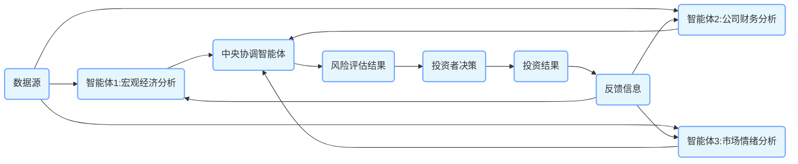

# AI多智能体在价值投资中的风险评估应用

> 关键词：AI多智能体、价值投资、风险评估、金融科技、智能决策、机器学习、数据驱动

> 摘要：本文聚焦于AI多智能体在价值投资风险评估中的应用。首先介绍了相关背景知识，包括目的、预期读者等。接着深入阐述了AI多智能体、价值投资和风险评估的核心概念及联系，通过文本示意图和Mermaid流程图展示其架构原理。详细讲解了核心算法原理，并用Python源代码进行说明。同时给出了相关数学模型和公式，并举例说明。通过项目实战，呈现了开发环境搭建、源代码实现与解读。探讨了AI多智能体在价值投资风险评估中的实际应用场景，推荐了学习资源、开发工具框架以及相关论文著作。最后总结了未来发展趋势与挑战，还设置了常见问题解答和扩展阅读参考资料，旨在全面展现AI多智能体在价值投资风险评估领域的应用与潜力。

## 1. 背景介绍 
### 1.1 目的和范围
在当今复杂多变的金融市场环境下，价值投资作为一种重要的投资策略，旨在寻找被低估的资产并长期持有以获取收益。然而，投资过程中面临着各种风险，如市场波动、宏观经济变化、公司内部问题等。传统的风险评估方法往往难以全面、准确地捕捉这些风险因素及其相互关系。本文章的目的在于探讨如何利用AI多智能体技术提升价值投资中的风险评估能力，为投资者提供更科学、精准的决策依据。

本文的范围涵盖了AI多智能体的基本原理、在价值投资风险评估中的应用机制、相关算法和数学模型，以及通过实际项目案例展示其具体应用过程。同时，还会探讨该技术在不同金融场景下的应用潜力和未来发展方向。

### 1.2 预期读者
本文预期读者包括金融领域的投资者、投资顾问、金融分析师等，他们希望借助先进的技术手段优化投资决策，提升风险评估水平。同时，也适合计算机科学领域的研究人员和开发者，特别是对AI多智能体技术在金融领域应用感兴趣的人群，以及相关专业的学生，有助于他们了解跨学科领域的前沿知识和应用案例。

### 1.3 文档结构概述
本文将按照以下结构展开：首先介绍AI多智能体、价值投资和风险评估的核心概念及其相互联系，通过文本示意图和Mermaid流程图进行可视化展示。接着详细阐述核心算法原理，并使用Python源代码进行说明，同时给出相关数学模型和公式并举例。然后通过项目实战，介绍开发环境搭建、源代码实现与解读。之后探讨AI多智能体在价值投资风险评估中的实际应用场景。推荐相关的学习资源、开发工具框架和论文著作。最后总结未来发展趋势与挑战，设置常见问题解答和扩展阅读参考资料。

### 1.4 术语表
#### 1.4.1 核心术语定义
- **AI多智能体**：由多个智能体组成的系统，每个智能体具有一定的自主性、反应性和社会性，能够在复杂环境中与其他智能体和环境进行交互，共同完成特定任务。
- **价值投资**：一种投资策略，投资者通过分析资产的内在价值，寻找被市场低估的资产进行投资，期望在资产价值回归时获得收益。
- **风险评估**：对投资过程中可能面临的各种风险进行识别、分析和量化的过程，以帮助投资者做出合理的决策。

#### 1.4.2 相关概念解释
- **智能体**：具有感知、决策和行动能力的实体，能够根据自身的目标和环境信息做出决策并采取行动。
- **内在价值**：资产的真实价值，通常基于资产的基本面因素，如盈利能力、现金流、资产负债状况等进行评估。
- **市场风险**：由于市场因素，如利率变化、汇率波动、宏观经济形势等导致的投资价值变动的风险。

#### 1.4.3 缩略词列表
- **AI**：Artificial Intelligence（人工智能）
- **ML**：Machine Learning（机器学习）
- **RL**：Reinforcement Learning（强化学习）

## 2. 核心概念与联系 

### 核心概念原理
#### AI多智能体
AI多智能体系统由多个智能体组成，每个智能体都有自己的知识、目标和行为规则。智能体之间通过通信和协作来完成复杂的任务。智能体可以感知环境信息，根据自身的决策规则进行决策，并采取相应的行动。例如，在一个股票投资的多智能体系统中，不同的智能体可以分别负责分析宏观经济数据、公司财务报表、市场情绪等信息，然后通过协作来评估投资风险。

#### 价值投资
价值投资的核心思想是寻找被市场低估的资产。投资者通过对资产的基本面进行分析，评估其内在价值，然后与市场价格进行比较。如果市场价格低于内在价值，投资者认为该资产具有投资价值，可能会选择买入并长期持有，等待资产价值回归。例如，一个公司的盈利能力和资产负债状况良好，但由于市场短期波动导致其股价下跌，价值投资者可能会认为这是一个投资机会。

#### 风险评估
风险评估是对投资过程中可能面临的各种风险进行识别、分析和量化的过程。风险因素包括市场风险、信用风险、流动性风险等。通过风险评估，投资者可以了解投资的风险水平，制定相应的风险管理策略。例如，在投资股票时，投资者可以通过分析公司的财务报表、行业竞争状况、宏观经济环境等因素来评估投资风险。

### 架构的文本示意图
AI多智能体在价值投资风险评估中的架构可以描述如下：多个智能体分别从不同的数据源收集信息，如宏观经济数据库、公司财务报表数据库、新闻媒体等。这些智能体对收集到的信息进行处理和分析，然后将分析结果传递给一个中央协调智能体。中央协调智能体根据各个智能体的分析结果，综合评估投资风险，并向投资者提供决策建议。投资者根据决策建议进行投资决策，并将投资结果反馈给多智能体系统，以便系统进行学习和优化。

### Mermaid流程图


## 3. 核心算法原理 & 具体操作步骤 

### 核心算法原理
在AI多智能体在价值投资风险评估中，常用的算法包括机器学习算法和强化学习算法。

#### 机器学习算法
机器学习算法可以用于对各种数据进行分析和建模，以预测投资风险。例如，使用逻辑回归算法可以对公司的财务指标进行分析，预测公司的违约风险；使用决策树算法可以对市场因素进行分析，预测市场走势。

以下是一个使用Python实现的逻辑回归算法示例，用于预测公司的违约风险：
```python
import numpy as np
from sklearn.linear_model import LogisticRegression
from sklearn.model_selection import train_test_split
from sklearn.metrics import accuracy_score

# 生成示例数据
np.random.seed(0)
X = np.random.rand(100, 5)  # 特征矩阵
y = np.random.randint(0, 2, 100)  # 标签

# 划分训练集和测试集
X_train, X_test, y_train, y_test = train_test_split(X, y, test_size=0.2, random_state=0)

# 创建逻辑回归模型
model = LogisticRegression()

# 训练模型
model.fit(X_train, y_train)

# 预测
y_pred = model.predict(X_test)

# 计算准确率
accuracy = accuracy_score(y_test, y_pred)
print(f"Accuracy: {accuracy}")
```
#### 强化学习算法
强化学习算法可以用于智能体的决策优化。智能体在与环境进行交互的过程中，通过不断尝试不同的行动，根据环境的反馈获得奖励或惩罚，从而学习到最优的决策策略。例如，在投资决策中，智能体可以根据市场情况选择不同的投资组合，根据投资收益获得奖励，通过强化学习不断优化投资策略。

以下是一个使用Python和OpenAI Gym库实现的简单强化学习示例：
```python
import gym

# 创建环境
env = gym.make('CartPole-v1')

# 初始化环境
state = env.reset()

# 进行10个回合的交互
for episode in range(10):
    total_reward = 0
    done = False
    while not done:
        # 随机选择一个行动
        action = env.action_space.sample()
        # 执行行动
        next_state, reward, done, _ = env.step(action)
        total_reward += reward
        state = next_state
    print(f"Episode {episode + 1}: Total Reward = {total_reward}")

# 关闭环境
env.close()
```

### 具体操作步骤
1. **数据收集**：从各种数据源收集与价值投资和风险评估相关的数据，如宏观经济数据、公司财务数据、市场交易数据等。
2. **数据预处理**：对收集到的数据进行清洗、转换和归一化等处理，以提高数据质量和可用性。
3. **智能体设计**：设计不同功能的智能体，如数据处理智能体、分析智能体、决策智能体等，并定义智能体的行为规则和通信协议。
4. **模型训练**：使用机器学习和强化学习算法对智能体进行训练，使其能够根据输入数据进行准确的分析和决策。
5. **系统集成**：将各个智能体集成到一个多智能体系统中，并进行测试和优化。
6. **风险评估与决策**：使用多智能体系统对投资风险进行评估，并根据评估结果为投资者提供决策建议。

## 4. 数学模型和公式 & 详细讲解 & 举例说明 

### 风险评估的数学模型
在价值投资风险评估中，常用的数学模型包括风险价值（VaR）模型和条件风险价值（CVaR）模型。

#### 风险价值（VaR）模型
风险价值（VaR）是指在一定的置信水平下，投资组合在未来一定时间内可能遭受的最大损失。其数学公式为：
$$P(\Delta V \leq -VaR) = 1 - \alpha$$
其中，$\Delta V$ 表示投资组合的价值变化，$\alpha$ 表示置信水平。

例如，假设一个投资组合的VaR在95%的置信水平下为100万元，这意味着在未来一定时间内，该投资组合有95%的可能性损失不超过100万元。

#### 条件风险价值（CVaR）模型
条件风险价值（CVaR）是指在给定的置信水平下，投资组合损失超过VaR的条件期望损失。其数学公式为：
$$CVaR_{\alpha} = E[-\Delta V | -\Delta V \geq VaR_{\alpha}]$$
其中，$VaR_{\alpha}$ 表示在置信水平 $\alpha$ 下的风险价值。

CVaR考虑了损失超过VaR的情况，因此比VaR更能反映投资组合的尾部风险。

### 举例说明
假设我们有一个投资组合，其价值变化服从正态分布，均值为 $\mu$，标准差为 $\sigma$。在95%的置信水平下，$VaR$ 的计算公式为：
$$VaR = -(\mu + z_{\alpha}\sigma)$$
其中，$z_{\alpha}$ 是标准正态分布的分位数，对于95%的置信水平，$z_{\alpha} = 1.645$。

假设 $\mu = 0.01$，$\sigma = 0.05$，则：
$$VaR = -(0.01 + 1.645 \times 0.05) = -0.09225$$
这意味着在95%的置信水平下，该投资组合在未来一定时间内可能遭受的最大损失为9.225%。

## 5. 项目实战：代码实际案例和详细解释说明 

### 5.1  开发环境搭建
1. **安装Python**：建议使用Python 3.7及以上版本。可以从Python官方网站（https://www.python.org/downloads/）下载并安装。
2. **安装必要的库**：使用以下命令安装必要的Python库：
```sh
pip install numpy pandas scikit-learn gym
```
3. **配置开发环境**：可以使用PyCharm、Jupyter Notebook等开发工具进行代码编写和调试。

### 5.2  源代码详细实现和代码解读
以下是一个简单的AI多智能体在价值投资风险评估中的项目示例，使用Python实现。

```python
import numpy as np
import pandas as pd
from sklearn.linear_model import LogisticRegression
from sklearn.model_selection import train_test_split
from sklearn.metrics import accuracy_score

# 模拟数据收集
def collect_data():
    # 生成示例数据
    np.random.seed(0)
    X = np.random.rand(100, 5)  # 特征矩阵
    y = np.random.randint(0, 2, 100)  # 标签
    return X, y

# 数据预处理
def preprocess_data(X, y):
    # 划分训练集和测试集
    X_train, X_test, y_train, y_test = train_test_split(X, y, test_size=0.2, random_state=0)
    return X_train, X_test, y_train, y_test

# 智能体：模型训练
def train_model(X_train, y_train):
    # 创建逻辑回归模型
    model = LogisticRegression()
    # 训练模型
    model.fit(X_train, y_train)
    return model

# 智能体：模型评估
def evaluate_model(model, X_test, y_test):
    # 预测
    y_pred = model.predict(X_test)
    # 计算准确率
    accuracy = accuracy_score(y_test, y_pred)
    return accuracy

# 主函数
def main():
    # 数据收集
    X, y = collect_data()
    # 数据预处理
    X_train, X_test, y_train, y_test = preprocess_data(X, y)
    # 模型训练
    model = train_model(X_train, y_train)
    # 模型评估
    accuracy = evaluate_model(model, X_test, y_test)
    print(f"Accuracy: {accuracy}")

if __name__ == "__main__":
    main()
```
### 5.3  代码解读与分析
1. **数据收集**：`collect_data` 函数模拟了数据收集的过程，生成了一个特征矩阵 `X` 和一个标签向量 `y`。
2. **数据预处理**：`preprocess_data` 函数将数据划分为训练集和测试集，以便进行模型训练和评估。
3. **模型训练**：`train_model` 函数使用逻辑回归算法对训练数据进行训练，得到一个训练好的模型。
4. **模型评估**：`evaluate_model` 函数使用测试数据对训练好的模型进行评估，计算模型的准确率。
5. **主函数**：`main` 函数调用上述各个函数，完成数据收集、预处理、模型训练和评估的整个流程，并输出模型的准确率。

## 6. 实际应用场景 
### 股票投资
在股票投资中，AI多智能体可以从多个角度对股票进行风险评估。例如，宏观经济分析智能体可以关注宏观经济指标的变化，如GDP增长率、通货膨胀率等，评估宏观经济环境对股票市场的影响；公司财务分析智能体可以分析公司的财务报表，评估公司的盈利能力、偿债能力等；市场情绪分析智能体可以通过分析新闻媒体、社交媒体等渠道的信息，了解市场参与者的情绪和预期。多个智能体协作，综合评估股票的投资风险，为投资者提供决策建议。

### 基金投资
对于基金投资，AI多智能体可以评估基金的投资组合风险。不同的智能体可以分别分析基金的资产配置、行业分布、持仓股票的风险等。通过对基金的风险评估，投资者可以选择适合自己风险偏好的基金产品，同时也可以对基金的业绩进行预测和评估。

### 债券投资
在债券投资中，AI多智能体可以评估债券的信用风险和利率风险。信用分析智能体可以分析债券发行方的信用状况，评估债券的违约风险；利率分析智能体可以关注市场利率的变化，评估债券价格的波动风险。多智能体系统可以综合考虑各种风险因素，为投资者提供债券投资的风险评估和决策建议。

## 7. 工具和资源推荐
### 7.1 学习资源推荐
#### 7.1.1 书籍推荐
- 《人工智能：一种现代的方法》：全面介绍了人工智能的基本概念、算法和应用，是人工智能领域的经典教材。
- 《Python机器学习》：详细介绍了使用Python进行机器学习的方法和技巧，适合初学者学习。
- 《金融风险管理》：系统介绍了金融风险管理的理论和方法，包括风险评估、风险度量、风险控制等方面的内容。

#### 7.1.2 在线课程
- Coursera上的“机器学习”课程：由斯坦福大学教授Andrew Ng主讲，是学习机器学习的经典课程。
- edX上的“人工智能基础”课程：介绍了人工智能的基本概念和算法，适合初学者入门。
- Udemy上的“Python金融数据分析”课程：讲解了使用Python进行金融数据分析的方法和技巧。

#### 7.1.3 技术博客和网站
- Medium：上面有很多关于人工智能、金融科技等领域的技术文章和案例分享。
- Towards Data Science：专注于数据科学和机器学习领域的技术博客，有很多高质量的文章。
- Kaggle：一个数据科学竞赛平台，上面有很多金融领域的数据集和相关的分析代码，可以学习和参考。

### 7.2 开发工具框架推荐
#### 7.2.1 IDE和编辑器
- PyCharm：一款专业的Python集成开发环境，具有代码编辑、调试、自动补全、版本控制等功能，适合开发Python项目。
- Jupyter Notebook：一个交互式的开发环境，可以方便地进行数据探索、模型训练和可视化等操作，适合数据分析和机器学习项目。
- Visual Studio Code：一款轻量级的代码编辑器，支持多种编程语言和插件扩展，具有丰富的功能和良好的用户体验。

#### 7.2.2 调试和性能分析工具
- Py-Spy：一个Python性能分析工具，可以帮助开发者找出Python代码中的性能瓶颈。
- PDB：Python自带的调试器，可以帮助开发者调试Python代码。
- TensorBoard：一个可视化工具，用于可视化深度学习模型的训练过程和结果，帮助开发者分析模型的性能。

#### 7.2.3 相关框架和库
- Scikit-learn：一个简单易用的机器学习库，提供了各种机器学习算法和工具，适合初学者和快速开发。
- TensorFlow：一个开源的深度学习框架，广泛应用于各种深度学习任务，如图像识别、自然语言处理等。
- PyTorch：一个开源的深度学习框架，具有动态计算图和易于使用的特点，受到很多研究者和开发者的喜爱。

### 7.3 相关论文著作推荐
#### 7.3.1 经典论文
- “A Machine Learning Approach to Portfolio Optimization”：介绍了使用机器学习算法进行投资组合优化的方法和理论。
- “Risk Assessment in Financial Markets Using Artificial Intelligence”：探讨了人工智能在金融市场风险评估中的应用和挑战。
- “Multi-Agent Systems for Financial Decision Making”：研究了多智能体系统在金融决策中的应用和优势。

#### 7.3.2 最新研究成果
可以通过学术数据库，如IEEE Xplore、ACM Digital Library、ScienceDirect等，搜索关于AI多智能体在价值投资风险评估领域的最新研究论文。

#### 7.3.3 应用案例分析
一些金融科技公司和研究机构会发布关于AI多智能体在金融领域应用的案例分析报告，可以通过他们的官方网站或相关行业媒体获取。

## 8. 总结：未来发展趋势与挑战
### 未来发展趋势
1. **更强大的智能体协作**：未来的AI多智能体系统将能够实现更高效、更智能的协作，不同类型的智能体可以更好地协同工作，共同完成复杂的价值投资风险评估任务。
2. **融合更多的数据来源**：随着数据技术的发展，AI多智能体系统将能够融合更多类型的数据，如物联网数据、卫星图像数据等，从而更全面地评估投资风险。
3. **与区块链技术结合**：区块链技术的去中心化、不可篡改等特点可以为AI多智能体在价值投资风险评估中的应用提供更安全、可信的环境，两者的结合将为金融领域带来新的发展机遇。
4. **个性化的风险评估**：根据投资者的不同风险偏好和投资目标，AI多智能体系统将能够提供个性化的风险评估和决策建议，提高投资决策的精准性。

### 挑战
1. **数据质量和隐私问题**：AI多智能体系统需要大量高质量的数据来进行训练和决策，但数据的质量和隐私保护是一个重要的挑战。如何确保数据的准确性、完整性和安全性，是需要解决的问题。
2. **算法的可解释性**：机器学习和深度学习算法往往是黑盒模型，其决策过程难以解释。在价值投资风险评估中，投资者需要了解算法的决策依据，因此提高算法的可解释性是一个关键挑战。
3. **智能体的适应性和鲁棒性**：金融市场环境复杂多变，AI多智能体系统需要具备良好的适应性和鲁棒性，能够在不同的市场条件下准确地评估风险。
4. **法律法规和监管问题**：AI多智能体在金融领域的应用涉及到一系列法律法规和监管问题，如何确保系统的合规性是需要关注的问题。

## 9. 附录：常见问题与解答
### 1. AI多智能体在价值投资风险评估中的优势是什么？
AI多智能体可以从多个角度、多个数据源收集信息，并通过智能体之间的协作进行综合分析，能够更全面、准确地评估投资风险。同时，多智能体系统具有较强的适应性和灵活性，可以根据市场变化及时调整评估策略。

### 2. 如何确保AI多智能体系统的决策准确性？
可以通过以下方法确保决策准确性：使用高质量的数据进行训练和验证；选择合适的算法和模型，并进行优化和调参；对系统进行持续的监控和评估，及时发现和纠正错误。

### 3. AI多智能体系统在实际应用中会面临哪些技术难题？
技术难题包括数据处理和分析的复杂性、智能体之间的通信和协作问题、算法的可解释性和鲁棒性等。

### 4. 如何将AI多智能体技术应用到实际的投资决策中？
可以先根据投资目标和风险偏好设计多智能体系统的架构和功能，然后收集和处理相关数据，训练智能体模型。在实际投资过程中，使用多智能体系统进行风险评估和决策建议，同时结合投资者的经验和判断进行最终决策。

## 10. 扩展阅读 & 参考资料
### 扩展阅读
- 《智能金融：AI如何改变金融未来》：深入探讨了人工智能在金融领域的应用和发展趋势。
- 《复杂金融系统中的智能体建模》：介绍了智能体建模在复杂金融系统中的应用和方法。
- 《金融科技前沿：理论与实务》：涵盖了金融科技领域的最新理论和实践案例。

### 参考资料
- 相关学术论文和研究报告，可通过学术数据库获取。
- 金融机构和科技公司的官方网站和技术博客。
- 行业媒体和资讯平台发布的相关文章和报道。