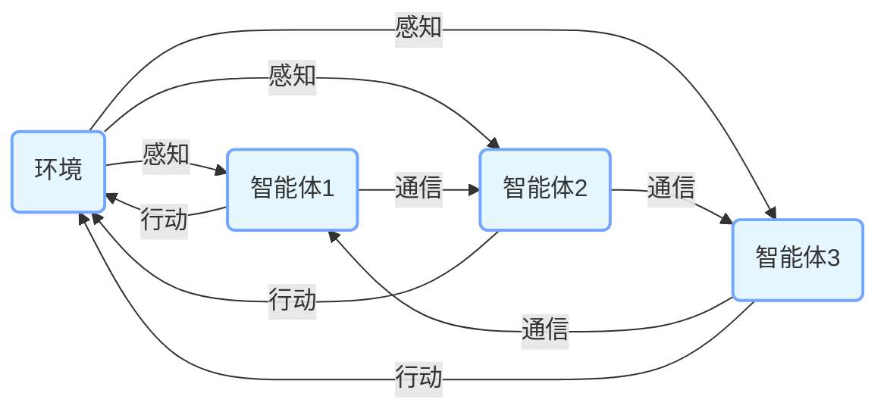

# AI多智能体如何优化价值投资的跨境并购策略

> 关键词：AI多智能体、价值投资、跨境并购策略、优化、金融科技

> 摘要：本文聚焦于探讨AI多智能体技术在优化价值投资的跨境并购策略中的应用。首先介绍了相关背景，包括研究目的、预期读者、文档结构和术语表。接着阐述了AI多智能体和价值投资跨境并购策略的核心概念及联系，分析了核心算法原理并给出Python代码示例。通过数学模型和公式深入讲解其内在逻辑，结合项目实战展示代码实现与解读。探讨了该技术在实际中的应用场景，推荐了学习、开发工具和相关论文著作。最后总结未来发展趋势与挑战，解答常见问题并提供扩展阅读与参考资料，旨在为金融从业者和研究者提供全面的技术视角和实践指导。

## 1. 背景介绍 
### 1.1 目的和范围
随着全球经济一体化的深入，跨境并购活动日益频繁。价值投资作为一种重要的投资理念，强调寻找被低估的资产并长期持有。然而，跨境并购涉及到不同国家的政治、经济、法律和文化等多方面的复杂因素，传统的投资决策方法面临诸多挑战。AI多智能体技术作为人工智能领域的前沿技术，具有分布式、自主性和协作性等特点，能够为跨境并购策略的优化提供新的思路和方法。本文的目的在于深入探讨AI多智能体如何应用于价值投资的跨境并购策略优化，研究范围涵盖了从理论原理到实际应用的各个方面。

### 1.2 预期读者
本文预期读者主要包括金融投资领域的从业者，如投资银行家、基金经理、并购顾问等，他们希望借助AI多智能体技术提升跨境并购决策的科学性和准确性。同时，也适合计算机科学和人工智能领域的研究者和开发者，他们对AI在金融领域的应用感兴趣，希望了解相关的理论和实践。此外，高校金融和计算机专业的学生也可以通过本文获取相关知识，拓宽学术视野。

### 1.3 文档结构概述
本文将按照以下结构进行组织：首先介绍核心概念与联系，明确AI多智能体和价值投资跨境并购策略的基本概念和相互关系；接着阐述核心算法原理和具体操作步骤，并给出Python代码示例；然后通过数学模型和公式详细讲解其内在逻辑，并举例说明；之后进行项目实战，展示代码实际案例和详细解释；再探讨实际应用场景；推荐相关的工具和资源；最后总结未来发展趋势与挑战，解答常见问题并提供扩展阅读与参考资料。

### 1.4 术语表
#### 1.4.1 核心术语定义
- **AI多智能体**：是指由多个智能体组成的系统，每个智能体具有一定的自主性和学习能力，能够感知环境并与其他智能体进行交互，共同完成一个或多个任务。
- **价值投资**：是一种投资策略，投资者通过分析公司的基本面，寻找被低估的股票或资产，长期持有以获取价值回归带来的收益。
- **跨境并购**：是指一个国家的企业通过收购或合并另一个国家的企业，实现资源整合和战略扩张的行为。

#### 1.4.2 相关概念解释
- **智能体**：在人工智能领域，智能体是指能够感知环境、做出决策并采取行动的实体。它可以是软件程序、机器人等。
- **多智能体系统**：由多个智能体组成的系统，这些智能体之间通过通信和协作来完成共同的目标。
- **价值评估**：是指对企业或资产的价值进行评估的过程，常用的方法包括现金流折现法、市场比较法等。

#### 1.4.3 缩略词列表
- **AI**：Artificial Intelligence，人工智能
- **MAS**：Multi - Agent System，多智能体系统

## 2. 核心概念与联系 

### 2.1 AI多智能体的原理和架构
AI多智能体系统由多个智能体组成，每个智能体都有自己的感知、决策和行动能力。智能体通过感知环境获取信息，根据自身的规则和目标进行决策，并采取相应的行动。智能体之间可以通过通信机制进行信息交换和协作，以实现共同的目标。

以下是AI多智能体系统的架构示意图：



### 2.2 价值投资的跨境并购策略原理
价值投资的跨境并购策略基于价值投资的理念，通过对目标企业的基本面分析，寻找被低估的企业进行并购。在跨境并购中，需要考虑目标企业所在国家的政治、经济、法律和文化等因素，以及并购后的整合和协同效应。具体步骤包括目标企业筛选、价值评估、交易结构设计和并购后整合等。

### 2.3 AI多智能体与价值投资跨境并购策略的联系
AI多智能体可以在价值投资的跨境并购策略的各个环节发挥重要作用。例如，在目标企业筛选阶段，智能体可以通过感知和分析大量的市场数据，快速准确地筛选出潜在的目标企业；在价值评估阶段，多个智能体可以协作进行不同维度的评估，提高评估的准确性和效率；在交易结构设计和并购后整合阶段，智能体可以通过模拟和优化，提供最佳的方案。

## 3. 核心算法原理 & 具体操作步骤 

### 3.1 核心算法原理
AI多智能体在价值投资的跨境并购策略中常用的算法包括强化学习算法、遗传算法等。以强化学习算法为例，智能体通过与环境进行交互，不断尝试不同的行动，并根据环境反馈的奖励信号来调整自己的策略，以最大化长期累积奖励。

以下是一个简单的强化学习算法的Python代码示例：

```python
import numpy as np

# 定义环境
class Environment:
    def __init__(self):
        self.state = 0
        self.num_states = 5
        self.num_actions = 2

    def reset(self):
        self.state = 0
        return self.state

    def step(self, action):
        if action == 0:
            self.state = max(0, self.state - 1)
        else:
            self.state = min(self.num_states - 1, self.state + 1)
        reward = 1 if self.state == self.num_states - 1 else 0
        done = self.state == self.num_states - 1
        return self.state, reward, done

# 定义智能体
class Agent:
    def __init__(self, num_states, num_actions, learning_rate=0.1, discount_factor=0.9):
        self.num_states = num_states
        self.num_actions = num_actions
        self.learning_rate = learning_rate
        self.discount_factor = discount_factor
        self.q_table = np.zeros((num_states, num_actions))

    def choose_action(self, state):
        if np.random.uniform(0, 1) < 0.1:
            return np.random.choice(self.num_actions)
        else:
            return np.argmax(self.q_table[state, :])

    def learn(self, state, action, reward, next_state):
        predict = self.q_table[state, action]
        target = reward + self.discount_factor * np.max(self.q_table[next_state, :])
        self.q_table[state, action] += self.learning_rate * (target - predict)

# 训练智能体
env = Environment()
agent = Agent(env.num_states, env.num_actions)

num_episodes = 1000
for episode in range(num_episodes):
    state = env.reset()
    done = False
    while not done:
        action = agent.choose_action(state)
        next_state, reward, done = env.step(action)
        agent.learn(state, action, reward, next_state)
        state = next_state

print("Q-table:")
print(agent.q_table)
```

### 3.2 具体操作步骤
1. **数据收集**：收集与跨境并购相关的数据，包括目标企业的财务数据、市场数据、行业数据等，以及目标企业所在国家的政治、经济、法律和文化等方面的数据。
2. **智能体设计**：根据不同的任务和需求，设计多个智能体，每个智能体负责不同的功能，如目标企业筛选、价值评估、交易结构设计等。
3. **智能体训练**：使用收集到的数据对智能体进行训练，让智能体学习如何根据环境信息做出最优决策。
4. **策略优化**：在实际应用中，不断根据智能体的反馈和实际效果对跨境并购策略进行优化。

## 4. 数学模型和公式 & 详细讲解 & 举例说明 

### 4.1 强化学习的数学模型
强化学习的核心是马尔可夫决策过程（MDP），它可以用一个五元组 $<S, A, P, R, \gamma>$ 来表示，其中：
- $S$ 是状态空间，表示智能体可能处于的所有状态。
- $A$ 是动作空间，表示智能体可以采取的所有动作。
- $P(s_{t + 1}|s_t, a_t)$ 是状态转移概率，表示在状态 $s_t$ 采取动作 $a_t$ 后转移到状态 $s_{t + 1}$ 的概率。
- $R(s_t, a_t)$ 是奖励函数，表示在状态 $s_t$ 采取动作 $a_t$ 后获得的即时奖励。
- $\gamma$ 是折扣因子，取值范围为 $[0, 1]$，用于衡量未来奖励的重要性。

智能体的目标是最大化长期累积奖励，即：

$$G_t=\sum_{k = 0}^{\infty}\gamma^kR_{t + k + 1}$$

为了实现这个目标，智能体需要学习一个策略 $\pi(a|s)$，表示在状态 $s$ 下采取动作 $a$ 的概率。常用的策略学习方法是基于Q - 值的方法，Q - 值表示在状态 $s$ 采取动作 $a$ 后获得的期望累积奖励，定义为：

$$Q^{\pi}(s, a)=\mathbb{E}_{\pi}\left[G_t|s_t = s, a_t = a\right]$$

### 4.2 举例说明
假设一个跨境并购的场景，智能体的任务是选择是否并购目标企业。状态空间 $S$ 可以包括目标企业的财务状况、市场竞争力等因素，动作空间 $A$ 包括并购和不并购两个动作。奖励函数 $R$ 可以根据并购后的收益来定义，如果并购后获得了正收益，则奖励为正，否则为负。

例如，假设当前状态 $s$ 表示目标企业的财务状况良好，市场竞争力较强，智能体选择并购动作 $a$。经过一段时间后，并购获得了成功，获得了正收益 $r$。智能体可以根据这个奖励信号更新自己的Q - 值，以提高未来决策的准确性。

## 5. 项目实战：代码实际案例和详细解释说明 

### 5.1  开发环境搭建
为了实现AI多智能体优化价值投资的跨境并购策略，我们需要搭建相应的开发环境。以下是具体步骤：
1. **安装Python**：建议使用Python 3.7及以上版本，可以从Python官方网站（https://www.python.org/downloads/）下载并安装。
2. **安装必要的库**：使用pip命令安装以下库：
    - `numpy`：用于数值计算。
    - `pandas`：用于数据处理和分析。
    - `scikit - learn`：用于机器学习算法。
    - `tensorflow` 或 `pytorch`：用于深度学习算法。

```bash
pip install numpy pandas scikit-learn tensorflow
```

### 5.2  源代码详细实现和代码解读
以下是一个简单的项目实战代码示例，用于演示AI多智能体在目标企业筛选中的应用：

```python
import numpy as np
import pandas as pd
from sklearn.preprocessing import StandardScaler
from sklearn.cluster import KMeans

# 模拟数据
data = {
    'financial_ratio1': np.random.rand(100),
    'financial_ratio2': np.random.rand(100),
    'market_share': np.random.rand(100)
}
df = pd.DataFrame(data)

# 数据预处理
scaler = StandardScaler()
scaled_data = scaler.fit_transform(df)

# 定义智能体（使用KMeans聚类算法）
class Agent:
    def __init__(self, n_clusters=3):
        self.model = KMeans(n_clusters=n_clusters)

    def train(self, data):
        self.model.fit(data)

    def predict(self, data):
        return self.model.predict(data)

# 训练智能体
agent = Agent()
agent.train(scaled_data)

# 预测目标企业类别
labels = agent.predict(scaled_data)
df['cluster_label'] = labels

print("目标企业聚类结果：")
print(df[['cluster_label']])
```

### 5.3  代码解读与分析
1. **数据模拟**：使用 `numpy` 和 `pandas` 模拟了目标企业的财务比率和市场份额数据。
2. **数据预处理**：使用 `StandardScaler` 对数据进行标准化处理，以消除不同特征之间的量纲差异。
3. **智能体定义**：定义了一个基于KMeans聚类算法的智能体，用于对目标企业进行分类。
4. **训练智能体**：使用标准化后的数据对智能体进行训练。
5. **预测目标企业类别**：使用训练好的智能体对目标企业进行分类，并将分类结果添加到原始数据中。

通过这种方式，我们可以根据目标企业的特征将其分为不同的类别，为后续的价值评估和并购决策提供参考。

## 6. 实际应用场景 
### 6.1 目标企业筛选
AI多智能体可以通过分析大量的市场数据和企业信息，快速准确地筛选出符合价值投资标准的目标企业。例如，智能体可以根据企业的财务指标、市场竞争力、行业前景等因素，对潜在的目标企业进行评估和排序，帮助投资者缩小选择范围。

### 6.2 价值评估
在价值评估阶段，多个智能体可以协作进行不同维度的评估。例如，一个智能体可以负责评估企业的财务价值，另一个智能体可以评估企业的战略价值。通过综合多个智能体的评估结果，可以提高价值评估的准确性和可靠性。

### 6.3 交易结构设计
AI多智能体可以通过模拟不同的交易结构，分析各种因素对交易结果的影响，从而设计出最优的交易结构。例如，智能体可以考虑并购的支付方式、股权结构、融资安排等因素，为投资者提供最佳的交易方案。

### 6.4 并购后整合
在并购后整合阶段，智能体可以监控企业的运营情况，及时发现问题并提供解决方案。例如，智能体可以分析企业的财务数据、人力资源数据等，评估整合的效果，并根据评估结果调整整合策略。

## 7. 工具和资源推荐
### 7.1 学习资源推荐
#### 7.1.1 书籍推荐
- 《人工智能：一种现代方法》：全面介绍了人工智能的基本概念、算法和应用，是人工智能领域的经典教材。
- 《强化学习：原理与Python实现》：详细讲解了强化学习的原理和算法，并提供了Python代码示例，适合初学者学习。
- 《金融科技：应用与创新》：介绍了金融科技在金融领域的应用和创新，包括AI在金融投资中的应用。

#### 7.2.2 在线课程
- Coursera上的“人工智能基础”课程：由知名高校的教授授课，系统介绍了人工智能的基础知识和应用。
- edX上的“强化学习”课程：深入讲解了强化学习的理论和实践，提供了丰富的案例和实验。
- 中国大学MOOC上的“金融科技前沿”课程：介绍了金融科技的最新发展和应用，包括AI在金融投资中的应用。

#### 7.3.3 技术博客和网站
- Medium：上面有很多关于AI和金融科技的技术博客，提供了最新的研究成果和实践经验。
- Towards Data Science：专注于数据科学和人工智能领域的技术博客，有很多关于强化学习和多智能体系统的文章。
- 金融科技研究网：专门介绍金融科技的发展和应用，提供了丰富的行业资讯和研究报告。

### 7.2 开发工具框架推荐
#### 7.2.1 IDE和编辑器
- PyCharm：一款专业的Python集成开发环境，提供了丰富的代码编辑、调试和部署功能。
- Jupyter Notebook：一种交互式的开发环境，适合进行数据探索和模型开发。
- Visual Studio Code：一款轻量级的代码编辑器，支持多种编程语言和插件，方便快捷。

#### 7.2.2 调试和性能分析工具
- TensorBoard：用于可视化深度学习模型的训练过程和性能指标。
- Py-Spy：用于分析Python代码的性能瓶颈。
- cProfile：Python内置的性能分析工具，用于分析代码的运行时间和调用次数。

#### 7.2.3 相关框架和库
- TensorFlow：一个开源的深度学习框架，提供了丰富的深度学习算法和工具。
- PyTorch：另一个流行的深度学习框架，具有简洁易用的特点。
- Mesa：一个用于开发多智能体系统的Python框架，提供了丰富的智能体模型和交互机制。

### 7.3 相关论文著作推荐
#### 7.3.1 经典论文
- “Reinforcement Learning: An Introduction”：强化学习领域的经典论文，系统介绍了强化学习的基本概念和算法。
- “Multi - Agent Systems: A Modern Approach to Distributed Artificial Intelligence”：多智能体系统领域的经典论文，介绍了多智能体系统的理论和应用。
- “Value Investing: The Use of Historical Financial Statement Information to Separate Winners from Losers”：价值投资领域的经典论文，介绍了价值投资的基本原理和方法。

#### 7.3.2 最新研究成果
- 定期关注顶级学术会议和期刊，如NeurIPS、ICML、Journal of Financial Economics等，获取最新的研究成果。
- 关注知名研究机构和学者的研究动态，如斯坦福大学、麻省理工学院、Yoshua Bengio等。

#### 7.3.3 应用案例分析
- 分析知名金融机构和企业的跨境并购案例，了解AI多智能体在实际应用中的效果和经验。
- 阅读相关的行业报告和案例分析文章，获取更多的实践经验和启示。

## 8. 总结：未来发展趋势与挑战
### 8.1 未来发展趋势
- **智能化程度不断提高**：随着人工智能技术的不断发展，AI多智能体的智能化程度将不断提高，能够更加准确地感知环境、做出决策和采取行动。
- **与其他技术融合**：AI多智能体将与区块链、物联网等技术融合，为价值投资的跨境并购策略提供更加全面和深入的支持。
- **应用场景不断拓展**：除了目标企业筛选、价值评估、交易结构设计和并购后整合等传统场景，AI多智能体还将在风险管理、投资组合优化等领域得到广泛应用。

### 8.2 挑战
- **数据质量和安全问题**：AI多智能体的性能和效果很大程度上依赖于数据的质量和数量。同时，跨境并购涉及到大量的敏感数据，数据安全问题也需要引起重视。
- **算法解释性和可解释性**：AI多智能体的决策过程往往比较复杂，缺乏解释性和可解释性。在金融领域，投资者需要了解决策的依据和风险，因此算法的解释性和可解释性是一个重要的挑战。
- **法律法规和监管问题**：AI多智能体在金融领域的应用涉及到一系列的法律法规和监管问题，如数据隐私保护、算法公平性等。需要建立相应的法律法规和监管机制，确保AI多智能体的合法合规应用。

## 9. 附录：常见问题与解答
### 9.1 AI多智能体在跨境并购中的应用是否会取代人类决策？
不会。AI多智能体在跨境并购中可以提供决策支持和优化建议，但不能完全取代人类决策。人类具有丰富的经验、判断力和创造力，能够考虑到一些难以量化的因素，如企业文化、人际关系等。AI多智能体和人类决策应该相互补充，共同提高跨境并购决策的质量。

### 9.2 如何确保AI多智能体的决策是可靠的？
可以通过以下方式确保AI多智能体的决策可靠性：
- **数据质量控制**：确保输入的数据准确、完整和可靠。
- **算法验证和评估**：对AI多智能体使用的算法进行验证和评估，确保其性能和效果。
- **监控和反馈机制**：建立监控和反馈机制，及时发现和纠正AI多智能体的决策偏差。

### 9.3 AI多智能体在跨境并购中的应用是否会增加投资风险？
AI多智能体本身不会增加投资风险，相反，它可以通过提供更准确的信息和优化的决策方案，降低投资风险。但是，如果AI多智能体的设计和应用不当，可能会导致错误的决策，从而增加投资风险。因此，在应用AI多智能体时，需要进行充分的测试和验证，确保其可靠性和有效性。

## 10. 扩展阅读 & 参考资料
### 10.1 扩展阅读
- 《人工智能时代的金融风险管理》：深入探讨了人工智能在金融风险管理中的应用和挑战。
- 《区块链与金融科技》：介绍了区块链技术在金融领域的应用和创新。
- 《智能投资：AI时代的投资新策略》：探讨了AI在投资领域的应用和发展趋势。

### 10.2 参考资料
- 相关学术论文和研究报告，如IEEE Transactions on Neural Networks and Learning Systems、Journal of Artificial Intelligence Research等。
- 金融机构和企业的官方网站，获取最新的行业动态和应用案例。
- 人工智能和金融科技领域的专业书籍和教材。