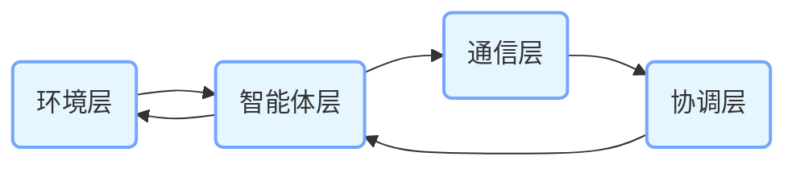

# AI多智能体系统革新价值投资策略

> 关键词：AI多智能体系统、价值投资策略、金融市场、投资决策、智能交互

> 摘要：本文聚焦于AI多智能体系统如何革新价值投资策略。首先介绍了研究的背景、目的、预期读者、文档结构和相关术语。接着阐述了AI多智能体系统和价值投资策略的核心概念及其联系，给出了相应的原理和架构示意图与流程图。详细讲解了核心算法原理，并用Python代码进行说明，同时介绍了相关的数学模型和公式。通过项目实战展示了如何搭建开发环境、实现源代码并进行解读分析。探讨了该技术在金融市场中的实际应用场景，推荐了学习资源、开发工具框架以及相关论文著作。最后总结了未来发展趋势与挑战，提供了常见问题解答和扩展阅读参考资料，旨在为投资者和相关研究人员提供全面深入的技术和策略指导。

## 1. 背景介绍 
### 1.1 目的和范围
在当今复杂多变的金融市场中，价值投资策略一直是投资者追求长期稳定收益的重要手段。然而，传统的价值投资方法往往依赖于人工分析和经验判断，难以应对海量数据和快速变化的市场环境。AI多智能体系统作为一种新兴的技术，具有强大的信息处理和智能决策能力，为价值投资策略的革新提供了新的思路和方法。

本文的目的在于深入探讨AI多智能体系统如何应用于价值投资策略，分析其原理、优势和实际应用效果。范围涵盖了AI多智能体系统的基本概念、核心算法、数学模型，以及在价值投资中的具体应用案例和实践经验。

### 1.2 预期读者
本文预期读者包括金融投资者、投资机构的研究人员、金融科技领域的开发者、相关专业的学生以及对AI和金融投资结合感兴趣的人士。这些读者可以从本文中获取关于AI多智能体系统在价值投资中应用的全面知识，为实际投资决策和技术研发提供参考。

### 1.3 文档结构概述
本文共分为十个部分。第一部分为背景介绍，阐述了研究的目的、范围、预期读者和文档结构。第二部分介绍核心概念与联系，包括AI多智能体系统和价值投资策略的原理和架构。第三部分讲解核心算法原理和具体操作步骤，并给出Python代码示例。第四部分介绍数学模型和公式，并进行详细讲解和举例说明。第五部分通过项目实战展示代码的实际案例和详细解释。第六部分探讨实际应用场景。第七部分推荐相关的学习资源、开发工具框架和论文著作。第八部分总结未来发展趋势与挑战。第九部分为附录，提供常见问题与解答。第十部分列出扩展阅读和参考资料。

### 1.4 术语表
#### 1.4.1 核心术语定义
- **AI多智能体系统（AI Multi - Agent System）**：由多个智能体组成的系统，每个智能体具有一定的自主决策能力和智能行为，能够通过相互交互和协作来完成复杂的任务。
- **价值投资策略（Value Investment Strategy）**：一种投资方法，通过分析公司的基本面，如财务状况、盈利能力、市场竞争力等，寻找被低估的股票进行投资，以获取长期的资本增值。
- **智能体（Agent）**：在AI多智能体系统中，具有感知环境、决策和行动能力的实体。
- **金融市场（Financial Market）**：进行金融资产交易的场所，包括股票市场、债券市场、期货市场等。

#### 1.4.2 相关概念解释
- **自主决策**：智能体能够根据自身的目标和环境信息，独立地做出决策，而不需要外部的直接干预。
- **智能交互**：智能体之间通过某种通信机制进行信息交换和协作，以实现共同的目标。
- **基本面分析**：价值投资中常用的分析方法，通过研究公司的财务报表、行业前景、管理团队等因素，评估公司的内在价值。

#### 1.4.3 缩略词列表
- **AI**：Artificial Intelligence（人工智能）
- **MAS**：Multi - Agent System（多智能体系统）

## 2. 核心概念与联系 

### 2.1 AI多智能体系统原理和架构
AI多智能体系统的核心思想是将复杂的任务分解为多个子任务，并分配给不同的智能体来完成。每个智能体具有一定的自主性和智能性，能够感知环境、处理信息、做出决策并采取行动。智能体之间通过通信机制进行交互和协作，共同完成系统的整体目标。

其架构通常包括以下几个部分：
- **智能体层**：由多个智能体组成，每个智能体负责特定的任务，如数据收集、数据分析、投资决策等。
- **通信层**：提供智能体之间的通信机制，确保信息的有效传递和共享。
- **协调层**：负责协调智能体之间的行为，避免冲突和重复工作，提高系统的整体效率。
- **环境层**：表示智能体所处的外部环境，如金融市场、经济数据等。

下面是AI多智能体系统架构的文本示意图：

```plaintext
----------------------
|  环境层            |
|  (金融市场、经济数据等) |
----------------------
       |
       v
----------------------
|  智能体层          |
|  - 数据收集智能体   |
|  - 数据分析智能体   |
|  - 投资决策智能体   |
----------------------
       |
       v
----------------------
|  通信层            |
|  (信息传递和共享)   |
----------------------
       |
       v
----------------------
|  协调层            |
|  (智能体行为协调)   |
----------------------
```

使用Mermaid绘制的流程图如下：



### 2.2 价值投资策略原理
价值投资策略的基本原理是寻找被市场低估的股票，即股票的市场价格低于其内在价值。投资者通过对公司的基本面进行深入分析，评估公司的盈利能力、资产质量、现金流状况等因素，确定公司的内在价值。当股票的市场价格低于内在价值时，投资者认为该股票具有投资价值，从而买入持有，等待市场价格回归内在价值，获取资本增值。

### 2.3 两者联系
AI多智能体系统与价值投资策略的联系在于，AI多智能体系统可以为价值投资策略提供强大的技术支持。具体体现在以下几个方面：
- **数据处理能力**：AI多智能体系统可以快速收集、整理和分析海量的金融数据，包括公司财务报表、市场行情、行业动态等，为价值投资提供全面准确的信息。
- **智能决策支持**：通过智能体之间的协作和交互，AI多智能体系统可以模拟复杂的市场环境和投资决策过程，为投资者提供更科学、更合理的投资建议。
- **实时监控和调整**：AI多智能体系统可以实时监控市场变化和投资组合的表现，及时调整投资策略，以适应市场的动态变化。

## 3. 核心算法原理 & 具体操作步骤 

### 3.1 核心算法原理
在AI多智能体系统应用于价值投资策略中，常用的核心算法包括强化学习算法和遗传算法。

#### 3.1.1 强化学习算法
强化学习是一种通过智能体与环境进行交互，不断尝试不同的行动，根据环境反馈的奖励信号来学习最优策略的算法。在价值投资中，智能体可以看作是投资者，环境是金融市场，行动是买入、卖出或持有股票，奖励信号可以是投资收益。

强化学习的基本原理可以用马尔可夫决策过程（MDP）来描述。MDP由一个四元组 $(S, A, P, R)$ 组成，其中：
- $S$ 是状态空间，表示环境的所有可能状态。
- $A$ 是行动空间，表示智能体可以采取的所有行动。
- $P$ 是状态转移概率，表示在状态 $s$ 采取行动 $a$ 后转移到状态 $s'$ 的概率，即 $P(s'|s, a)$。
- $R$ 是奖励函数，表示在状态 $s$ 采取行动 $a$ 后获得的即时奖励 $R(s, a)$。

智能体的目标是找到一个最优策略 $\pi$，使得在每个状态 $s$ 下采取行动 $a$ 能够最大化长期累积奖励。常用的强化学习算法包括Q - learning算法和深度Q网络（DQN）算法。

#### 3.1.2 遗传算法
遗传算法是一种模拟生物进化过程的优化算法，通过模拟自然选择、交叉和变异等操作，在解空间中搜索最优解。在价值投资中，遗传算法可以用于优化投资组合，寻找最优的股票配置比例。

遗传算法的基本步骤包括：
1. **初始化种群**：随机生成一组初始解，每个解表示一个投资组合。
2. **评估适应度**：计算每个解的适应度值，适应度值可以用投资组合的收益率、风险等指标来衡量。
3. **选择操作**：根据适应度值选择一部分解作为父代，用于产生下一代解。
4. **交叉操作**：对父代解进行交叉操作，生成新的子代解。
5. **变异操作**：对子代解进行变异操作，引入新的基因，增加种群的多样性。
6. **更新种群**：用子代解替换部分父代解，更新种群。
7. **重复步骤2 - 6**，直到满足终止条件。

### 3.2 具体操作步骤
#### 3.2.1 数据收集和预处理
1. **数据收集**：使用数据收集智能体从金融市场数据源（如证券交易所网站、财经新闻网站等）收集公司的财务数据、市场行情数据、行业数据等。
2. **数据清洗**：去除数据中的噪声、缺失值和异常值，确保数据的质量。
3. **数据特征提取**：从原始数据中提取有用的特征，如财务比率、技术指标等，用于后续的分析和建模。

#### 3.2.2 模型训练
1. **强化学习模型训练**：使用DQN算法训练投资决策智能体，让智能体学习在不同市场状态下的最优投资策略。
2. **遗传算法优化**：使用遗传算法优化投资组合，确定最优的股票配置比例。

#### 3.2.3 投资决策和执行
1. **实时监控**：使用智能体实时监控市场变化和投资组合的表现。
2. **决策生成**：根据训练好的模型和实时市场数据，生成投资决策，如买入、卖出或持有股票。
3. **执行交易**：将投资决策发送给交易执行智能体，执行股票交易操作。

### 3.3 Python代码示例
以下是一个简单的使用Q - learning算法实现的投资决策智能体的Python代码示例：

```python
import numpy as np

# 定义状态空间和行动空间
states = [0, 1, 2]  # 0: 市场上涨, 1: 市场平稳, 2: 市场下跌
actions = [0, 1, 2]  # 0: 买入, 1: 持有, 2: 卖出

# 初始化Q表
Q = np.zeros((len(states), len(actions)))

# 定义超参数
alpha = 0.1  # 学习率
gamma = 0.9  # 折扣因子
epsilon = 0.1  # 探索率

# 定义奖励函数
def reward(state, action):
    if state == 0 and action == 0:
        return 1
    elif state == 1 and action == 1:
        return 0
    elif state == 2 and action == 2:
        return 1
    else:
        return -1

# Q - learning算法
def q_learning(num_episodes):
    for episode in range(num_episodes):
        state = np.random.choice(states)  # 随机初始化状态
        done = False
        while not done:
            if np.random.uniform(0, 1) < epsilon:
                action = np.random.choice(actions)  # 探索
            else:
                action = np.argmax(Q[state, :])  # 利用
            next_state = np.random.choice(states)  # 随机转移到下一个状态
            r = reward(state, action)
            Q[state, action] = Q[state, action] + alpha * (r + gamma * np.max(Q[next_state, :]) - Q[state, action])
            state = next_state
            if np.random.uniform(0, 1) < 0.1:  # 随机终止条件
                done = True
    return Q

# 训练模型
Q = q_learning(1000)
print("训练后的Q表:")
print(Q)
```

在上述代码中，我们首先定义了状态空间和行动空间，初始化了Q表。然后定义了奖励函数，根据不同的状态和行动返回相应的奖励值。使用Q - learning算法进行训练，通过不断更新Q表，让智能体学习在不同状态下的最优行动。最后输出训练后的Q表。

## 4. 数学模型和公式 & 详细讲解 & 举例说明 

### 4.1 马尔可夫决策过程（MDP）
马尔可夫决策过程是强化学习的基础数学模型，其数学定义为一个四元组 $(S, A, P, R)$，其中：
- $S$ 是有限的状态集合，$s \in S$ 表示一个具体的状态。
- $A$ 是有限的行动集合，$a \in A$ 表示一个具体的行动。
- $P: S \times A \times S \to [0, 1]$ 是状态转移概率函数，$P(s'|s, a)$ 表示在状态 $s$ 采取行动 $a$ 后转移到状态 $s'$ 的概率，满足 $\sum_{s' \in S} P(s'|s, a) = 1$。
- $R: S \times A \to \mathbb{R}$ 是奖励函数，$R(s, a)$ 表示在状态 $s$ 采取行动 $a$ 后获得的即时奖励。

智能体的策略 $\pi: S \to A$ 是一个从状态到行动的映射，表示在每个状态下智能体采取的行动。策略 $\pi$ 下的状态价值函数 $V^{\pi}(s)$ 表示从状态 $s$ 开始，遵循策略 $\pi$ 所能获得的长期累积奖励的期望，定义为：

$$V^{\pi}(s) = \mathbb{E}_{\pi} \left[ \sum_{t = 0}^{\infty} \gamma^{t} R(S_t, A_t) \big| S_0 = s \right]$$

其中 $\gamma \in [0, 1]$ 是折扣因子，用于权衡即时奖励和未来奖励的重要性。

动作价值函数 $Q^{\pi}(s, a)$ 表示在状态 $s$ 采取行动 $a$，然后遵循策略 $\pi$ 所能获得的长期累积奖励的期望，定义为：

$$Q^{\pi}(s, a) = \mathbb{E}_{\pi} \left[ \sum_{t = 0}^{\infty} \gamma^{t} R(S_t, A_t) \big| S_0 = s, A_0 = a \right]$$

最优状态价值函数 $V^{*}(s)$ 和最优动作价值函数 $Q^{*}(s, a)$ 分别定义为：

$$V^{*}(s) = \max_{\pi} V^{\pi}(s)$$

$$Q^{*}(s, a) = \max_{\pi} Q^{\pi}(s, a)$$

最优策略 $\pi^{*}$ 可以通过最优动作价值函数得到：

$$\pi^{*}(s) = \arg \max_{a \in A} Q^{*}(s, a)$$

### 4.2 Q - learning算法公式
Q - learning算法是一种无模型的强化学习算法，通过迭代更新Q表来学习最优动作价值函数 $Q^{*}(s, a)$。Q - learning算法的更新公式为：

$$Q(s, a) \leftarrow Q(s, a) + \alpha \left[ R(s, a) + \gamma \max_{a'} Q(s', a') - Q(s, a) \right]$$

其中：
- $Q(s, a)$ 是当前状态 $s$ 和行动 $a$ 的Q值。
- $\alpha$ 是学习率，控制每次更新的步长。
- $R(s, a)$ 是在状态 $s$ 采取行动 $a$ 后获得的即时奖励。
- $\gamma$ 是折扣因子，权衡即时奖励和未来奖励。
- $s'$ 是采取行动 $a$ 后转移到的下一个状态。
- $\max_{a'} Q(s', a')$ 是下一个状态 $s'$ 下所有可能行动的最大Q值。

### 4.3 举例说明
假设我们有一个简单的投资场景，状态空间 $S = \{s_1, s_2\}$ 表示市场的两种状态（上涨和下跌），行动空间 $A = \{a_1, a_2\}$ 表示买入和卖出两种行动。初始Q表为：

$$Q = \begin{bmatrix}
0 & 0 \\
0 & 0
\end{bmatrix}$$

学习率 $\alpha = 0.1$，折扣因子 $\gamma = 0.9$。

假设当前状态 $s = s_1$，智能体选择行动 $a = a_1$，转移到下一个状态 $s' = s_2$，获得即时奖励 $R(s_1, a_1) = 1$。下一个状态 $s_2$ 下所有可能行动的最大Q值 $\max_{a'} Q(s_2, a') = 0$。

根据Q - learning更新公式，更新 $Q(s_1, a_1)$ 的值：

$$Q(s_1, a_1) = Q(s_1, a_1) + \alpha \left[ R(s_1, a_1) + \gamma \max_{a'} Q(s_2, a') - Q(s_1, a_1) \right]$$

$$= 0 + 0.1 \times (1 + 0.9 \times 0 - 0)$$

$$= 0.1$$

更新后的Q表为：

$$Q = \begin{bmatrix}
0.1 & 0 \\
0 & 0
\end{bmatrix}$$

通过不断重复上述过程，Q表会逐渐收敛到最优动作价值函数 $Q^{*}(s, a)$。

## 5. 项目实战：代码实际案例和详细解释说明 

### 5.1  开发环境搭建
#### 5.1.1 安装Python
首先需要安装Python编程语言，建议使用Python 3.7及以上版本。可以从Python官方网站（https://www.python.org/downloads/）下载并安装适合自己操作系统的Python版本。

#### 5.1.2 安装必要的库
在项目中，我们需要使用一些Python库来实现数据处理、机器学习和可视化等功能。可以使用以下命令安装这些库：

```sh
pip install numpy pandas scikit-learn matplotlib
```

- `numpy`：用于数值计算和数组操作。
- `pandas`：用于数据处理和分析。
- `scikit-learn`：提供了丰富的机器学习算法和工具。
- `matplotlib`：用于数据可视化。

#### 5.1.3 配置开发环境
可以使用集成开发环境（IDE）如PyCharm或Jupyter Notebook来进行代码开发和调试。以下是使用Jupyter Notebook的步骤：
1. 安装Jupyter Notebook：

```sh
pip install jupyter
```

2. 启动Jupyter Notebook：

```sh
jupyter notebook
```

3. 在浏览器中打开Jupyter Notebook界面，创建新的Python笔记本进行代码编写。

### 5.2  源代码详细实现和代码解读
以下是一个完整的项目实战代码示例，使用AI多智能体系统实现价值投资策略：

```python
import numpy as np
import pandas as pd
from sklearn.preprocessing import StandardScaler
from sklearn.model_selection import train_test_split
from sklearn.linear_model import LogisticRegression
import matplotlib.pyplot as plt

# 数据收集和预处理
def load_data():
    # 模拟数据，实际应用中需要从真实数据源获取
    data = pd.DataFrame({
        'pe_ratio': np.random.rand(100),  # 市盈率
        'roe': np.random.rand(100),  # 净资产收益率
        'label': np.random.randint(0, 2, 100)  # 投资标签，0: 不投资，1: 投资
    })
    X = data.drop('label', axis=1)
    y = data['label']
    # 数据标准化
    scaler = StandardScaler()
    X = scaler.fit_transform(X)
    return X, y

# 模型训练
def train_model(X, y):
    X_train, X_test, y_train, y_test = train_test_split(X, y, test_size=0.2, random_state=42)
    model = LogisticRegression()
    model.fit(X_train, y_train)
    return model

# 投资决策
def make_decision(model, X):
    predictions = model.predict(X)
    return predictions

# 可视化结果
def visualize_results(predictions):
    plt.figure(figsize=(10, 6))
    plt.bar(range(len(predictions)), predictions)
    plt.xlabel('样本编号')
    plt.ylabel('投资决策')
    plt.title('投资决策结果')
    plt.show()

# 主函数
def main():
    X, y = load_data()
    model = train_model(X, y)
    predictions = make_decision(model, X)
    visualize_results(predictions)

if __name__ == "__main__":
    main()
```

### 5.3  代码解读与分析
#### 5.3.1 数据收集和预处理
`load_data` 函数用于模拟数据收集和预处理过程。在实际应用中，需要从真实的金融数据源（如证券交易所网站、财经数据库等）获取公司的财务数据和市场行情数据。这里我们使用 `pandas` 库创建一个包含市盈率（`pe_ratio`）、净资产收益率（`roe`）和投资标签（`label`）的模拟数据集。然后使用 `StandardScaler` 对数据进行标准化处理，确保不同特征具有相同的尺度，有利于模型的训练。

#### 5.3.2 模型训练
`train_model` 函数使用 `train_test_split` 函数将数据集划分为训练集和测试集，其中测试集占比为20%。然后使用逻辑回归模型（`LogisticRegression`）对训练集进行训练。逻辑回归是一种常用的分类算法，适用于二分类问题，如投资决策（投资或不投资）。

#### 5.3.3 投资决策
`make_decision` 函数使用训练好的模型对输入数据进行预测，返回投资决策结果（0或1）。

#### 5.3.4 可视化结果
`visualize_results` 函数使用 `matplotlib` 库将投资决策结果以柱状图的形式进行可视化展示，方便用户直观地观察投资决策情况。

#### 5.3.5 主函数
`main` 函数调用上述函数，完成数据收集、模型训练、投资决策和结果可视化的整个流程。

## 6. 实际应用场景 
### 6.1 股票投资
在股票投资中，AI多智能体系统可以帮助投资者更准确地评估股票的价值。通过收集和分析公司的财务报表、行业数据、市场情绪等信息，智能体可以识别出被低估的股票，为投资者提供投资建议。同时，智能体可以实时监控市场变化，及时调整投资组合，降低投资风险。

例如，一个数据收集智能体可以定期从证券交易所网站和财经新闻网站收集公司的财务数据和新闻资讯，数据分析智能体对这些数据进行清洗、整理和分析，提取有用的特征。投资决策智能体根据分析结果和预设的投资策略，生成投资决策，如买入、卖出或持有股票。

### 6.2 基金投资
对于基金投资，AI多智能体系统可以帮助投资者选择合适的基金产品。智能体可以分析基金的历史业绩、投资风格、管理团队等因素，评估基金的风险和收益特征。同时，智能体可以根据投资者的风险偏好和投资目标，为投资者推荐个性化的基金组合。

例如，一个基金评估智能体可以收集市场上各种基金的相关信息，使用机器学习算法对基金进行评分和排名。投资组合智能体根据投资者的风险承受能力和投资期限，为投资者构建最优的基金投资组合。

### 6.3 资产配置
在资产配置方面，AI多智能体系统可以帮助投资者实现多元化的资产配置。智能体可以分析不同资产类别的风险和收益特征，如股票、债券、黄金等，根据投资者的投资目标和风险偏好，确定最优的资产配置比例。

例如，一个资产分析智能体可以实时监测不同资产类别的市场表现，使用优化算法计算最优的资产配置比例。投资执行智能体根据计算结果，自动调整投资组合中不同资产的持有比例。

## 7. 工具和资源推荐
### 7.1 学习资源推荐
#### 7.1.1 书籍推荐
- 《人工智能：一种现代的方法》（Artificial Intelligence: A Modern Approach）：这本书是人工智能领域的经典教材，全面介绍了人工智能的基本概念、算法和应用。
- 《强化学习：原理与Python实现》：详细讲解了强化学习的原理和算法，并通过Python代码示例进行实践。
- 《价值投资：从格雷厄姆到巴菲特》：系统阐述了价值投资的理论和方法，是价值投资领域的权威著作。

#### 7.1.2 在线课程
- Coursera上的“人工智能基础”课程：由知名高校教授授课，涵盖了人工智能的基础知识和前沿技术。
- edX上的“强化学习”课程：深入讲解了强化学习的算法和应用，提供了丰富的实践项目。
- 网易云课堂上的“价值投资实战教程”：结合实际案例，介绍了价值投资的策略和技巧。

#### 7.1.3 技术博客和网站
- 机器之心（https://www.alldatasheet.com/）：专注于人工智能领域的技术资讯和前沿研究，提供了大量的技术文章和案例分析。
- 金融界（https://www.jrj.com.cn/）：提供金融市场的实时行情、财经新闻和投资分析，是投资者获取信息的重要渠道。
- Medium上的AI和金融相关博客：有很多专业人士分享的关于AI在金融领域应用的经验和见解。

### 7.2 开发工具框架推荐
#### 7.2.1 IDE和编辑器
- PyCharm：一款功能强大的Python集成开发环境，提供了代码编辑、调试、版本控制等功能，适合专业开发者使用。
- Jupyter Notebook：一种交互式的编程环境，支持Python、R等多种编程语言，方便进行数据探索和模型实验。
- Visual Studio Code：一款轻量级的代码编辑器，具有丰富的插件和扩展功能，支持多种编程语言。

#### 7.2.2 调试和性能分析工具
- PySnooper：一个简单易用的Python调试工具，可以自动记录函数的调用过程和变量的值，方便调试代码。
- cProfile：Python内置的性能分析工具，可以分析代码的运行时间和函数调用次数，帮助优化代码性能。
- TensorBoard：一个可视化工具，用于监控和分析深度学习模型的训练过程，支持TensorFlow、PyTorch等多种深度学习框架。

#### 7.2.3 相关框架和库
- TensorFlow：一个开源的深度学习框架，提供了丰富的神经网络模型和工具，支持分布式训练和模型部署。
- PyTorch：另一个流行的深度学习框架，具有简洁易用的API和动态图机制，适合快速原型开发和研究。
- OpenAI Gym：一个用于开发和比较强化学习算法的工具包，提供了多种模拟环境和任务，方便进行强化学习实验。

### 7.3 相关论文著作推荐
#### 7.3.1 经典论文
- “Reinforcement Learning: A Survey”：这是一篇关于强化学习的综述论文，系统介绍了强化学习的基本概念、算法和应用。
- “The Intelligent Investor”：由本杰明·格雷厄姆（Benjamin Graham）撰写，是价值投资领域的经典论文，阐述了价值投资的核心思想和方法。
- “A Markov Decision Process Model for Portfolio Selection”：提出了一种基于马尔可夫决策过程的投资组合选择模型，为AI多智能体系统在投资决策中的应用提供了理论基础。

#### 7.3.2 最新研究成果
- 关注顶级学术会议如NeurIPS（神经信息处理系统大会）、ICML（国际机器学习会议）和金融领域的学术期刊如《Journal of Financial Economics》《Review of Financial Studies》上的最新研究成果，了解AI多智能体系统在价值投资中的最新应用和技术进展。

#### 7.3.3 应用案例分析
- 一些知名金融机构和科技公司会发布关于AI在金融投资中应用的案例分析报告，如摩根大通、谷歌等。这些报告可以帮助我们了解实际应用中的挑战和解决方案。

## 8. 总结：未来发展趋势与挑战
### 8.1 未来发展趋势
#### 8.1.1 智能化程度不断提高
随着人工智能技术的不断发展，AI多智能体系统的智能化程度将不断提高。智能体将具备更强的自主学习和决策能力，能够更好地适应复杂多变的金融市场环境。例如，智能体可以自动识别市场趋势和风险，实时调整投资策略，提高投资收益。

#### 8.1.2 与其他技术深度融合
AI多智能体系统将与区块链、物联网等技术深度融合，为价值投资带来更多的创新和发展机遇。例如，区块链技术可以提供安全可靠的交易记录和数据共享平台，物联网技术可以提供更多的实时市场数据和信息，进一步提高投资决策的准确性和及时性。

#### 8.1.3 个性化投资服务
未来，AI多智能体系统将能够根据投资者的个性化需求和风险偏好，提供更加精准的投资建议和服务。投资者可以通过与智能体进行交互，定制自己的投资策略和投资组合，实现个性化的投资目标。

### 8.2 挑战
#### 8.2.1 数据质量和安全问题
AI多智能体系统的性能和效果高度依赖于数据的质量和安全性。在金融市场中，数据来源广泛，数据质量参差不齐，存在噪声、缺失值和异常值等问题。同时，金融数据涉及大量的敏感信息，如投资者的个人信息、交易记录等，数据安全和隐私保护面临严峻挑战。

#### 8.2.2 模型可解释性问题
深度学习等复杂的人工智能模型在提高投资决策准确性的同时，也带来了模型可解释性问题。这些模型通常是黑盒模型，难以理解其决策过程和依据，这给投资者和监管机构带来了一定的困扰。在实际应用中，需要提高模型的可解释性，让投资者能够理解和信任模型的决策结果。

#### 8.2.3 法律法规和监管问题
AI多智能体系统在金融投资中的应用涉及到一系列法律法规和监管问题。例如，智能体的投资决策是否符合相关法律法规和监管要求，如何对智能体的行为进行监管等。需要建立健全相关的法律法规和监管体系，规范AI多智能体系统在金融投资中的应用。

## 9. 附录：常见问题与解答
### 9.1 AI多智能体系统在价值投资中的应用是否会取代人类投资者？
不会。虽然AI多智能体系统具有强大的信息处理和决策能力，但它仍然需要人类投资者的参与和指导。人类投资者具有丰富的经验、判断力和情感因素，能够考虑到一些难以量化的因素，如市场情绪、行业前景等。AI多智能体系统可以为人类投资者提供决策支持和参考，帮助他们做出更科学、更合理的投资决策。

### 9.2 如何评估AI多智能体系统在价值投资中的性能？
可以从以下几个方面评估AI多智能体系统在价值投资中的性能：
- **投资收益**：比较使用AI多智能体系统和传统投资方法的投资收益率，评估其盈利能力。
- **风险控制**：分析投资组合的风险指标，如波动率、最大回撤等，评估其风险控制能力。
- **决策准确性**：通过回测和模拟实验，评估智能体的投资决策准确性，即正确预测股票涨跌的比例。

### 9.3 如何确保AI多智能体系统的安全性和可靠性？
可以采取以下措施确保AI多智能体系统的安全性和可靠性：
- **数据加密**：对敏感数据进行加密处理，防止数据泄露和篡改。
- **访问控制**：设置严格的访问权限，只有授权人员才能访问系统和数据。
- **模型验证和测试**：在上线前对模型进行充分的验证和测试，确保其性能和稳定性。
- **监控和预警**：实时监控系统的运行状态，及时发现和处理异常情况。

## 10. 扩展阅读 & 参考资料
### 10.1 扩展阅读
- 《深度学习》（Deep Learning）：深入介绍了深度学习的原理、算法和应用，适合对深度学习感兴趣的读者进一步学习。
- 《金融科技：重塑金融未来》：探讨了金融科技在金融领域的应用和发展趋势，为理解AI多智能体系统在金融投资中的应用提供了更广阔的视角。
- 《算法交易实战》：介绍了算法交易的基本原理和实践方法，与AI多智能体系统在投资决策中的应用有一定的关联。

### 10.2 参考资料
- [人工智能基础教程](https://www.example.com/ai_tutorial)
- [强化学习官方文档](https://www.example.com/rl_docs)
- [金融市场数据接口](https://www.example.com/financial_data_api)

以上文章详细探讨了AI多智能体系统如何革新价值投资策略，涵盖了技术原理、实际应用、未来趋势等多个方面，希望能为读者提供有价值的参考。