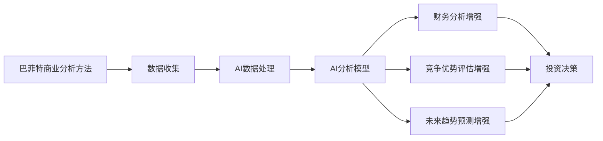

# AI如何增强巴菲特的商业分析方法

> 关键词：AI、巴菲特商业分析方法、财务分析、竞争优势、未来趋势、数据挖掘、投资决策

> 摘要：本文深入探讨了AI如何增强巴菲特的商业分析方法。首先介绍了巴菲特商业分析方法的核心要点，包括注重企业内在价值、财务状况、竞争优势等。然后阐述了AI在各个分析环节的作用，如通过数据挖掘和机器学习技术辅助财务分析、评估竞争优势、预测未来趋势等。通过实际案例和详细的技术原理分析，展示了AI与巴菲特商业分析方法结合的优势和潜力，最后对未来的发展趋势和挑战进行了展望。

## 1. 背景介绍 
### 1.1 目的和范围
目的在于研究如何利用AI技术提升巴菲特所倡导的商业分析方法的效率和准确性。范围涵盖了从财务数据的分析、企业竞争优势的评估到未来发展趋势的预测等多个方面，探讨AI在这些环节中如何发挥作用，以及对投资决策的影响。

### 1.2 预期读者
本文预期读者包括投资领域的专业人士，如基金经理、投资分析师等；对AI和投资感兴趣的学者和研究人员；以及希望提升自身投资分析能力的个人投资者。

### 1.3 文档结构概述
本文首先介绍相关背景知识，包括巴菲特商业分析方法的核心概念和AI的基本原理。接着详细阐述AI如何在商业分析的各个环节增强巴菲特的方法，包括核心算法原理、数学模型和公式。通过实际项目案例展示具体的应用过程，分析实际应用场景。推荐相关的学习资源、开发工具和论文著作。最后总结未来发展趋势与挑战，并提供常见问题解答和扩展阅读参考资料。

### 1.4 术语表
#### 1.4.1 核心术语定义
- **巴菲特商业分析方法**：是由沃伦·巴菲特提出的一套评估企业投资价值的方法，重点关注企业的内在价值、财务状况、竞争优势等因素。
- **AI（人工智能）**：是研究、开发用于模拟、延伸和扩展人的智能的理论、方法、技术及应用系统的一门新的技术科学。
- **内在价值**：指企业在其剩余寿命中所能产生的现金流量的折现值。
- **竞争优势**：企业在市场竞争中相对于其他企业所具有的优势，如成本优势、品牌优势等。

#### 1.4.2 相关概念解释
- **财务分析**：对企业的财务报表进行分析，评估企业的财务状况和经营成果。
- **数据挖掘**：从大量的数据中发现潜在的模式和规律。
- **机器学习**：让计算机通过数据和经验自动学习和改进的技术。

#### 1.4.3 缩略词列表
- **AI**：Artificial Intelligence（人工智能）
- **ML**：Machine Learning（机器学习）
- **DL**：Deep Learning（深度学习）

## 2. 核心概念与联系 

### 2.1 巴菲特商业分析方法核心概念
巴菲特的商业分析方法主要基于以下几个核心要点：
- **内在价值评估**：通过对企业未来现金流量的预测和折现，计算企业的内在价值。只有当股票价格低于内在价值时，才具有投资价值。
- **财务状况分析**：关注企业的资产负债表、利润表和现金流量表，评估企业的盈利能力、偿债能力和运营能力。
- **竞争优势分析**：寻找具有可持续竞争优势的企业，如品牌优势、成本优势、技术优势等。

### 2.2 AI核心概念
AI包括多个领域，如机器学习、深度学习、自然语言处理等。
- **机器学习**：通过算法让计算机从数据中学习模式和规律，从而进行预测和决策。常见的机器学习算法包括决策树、支持向量机、神经网络等。
- **深度学习**：是机器学习的一个分支，使用多层神经网络来学习数据的复杂特征。

### 2.3 两者联系
AI可以在多个方面增强巴菲特的商业分析方法：
- **数据处理**：AI可以快速处理大量的财务数据和市场信息，提高分析效率。
- **预测能力**：通过机器学习和深度学习算法，AI可以更准确地预测企业的未来业绩和市场趋势。
- **风险评估**：AI可以帮助识别潜在的风险因素，提高投资决策的安全性。

### 2.4 文本示意图
巴菲特商业分析方法与AI的联系可以用以下示意图表示：

巴菲特商业分析方法 <-- 数据 --> AI技术
|                      |
|                      |
|      增强分析       |
|                      |
|                      |
投资决策

### 2.5 Mermaid流程图


## 3. 核心算法原理 & 具体操作步骤 

### 3.1 财务分析中的AI算法
#### 3.1.1 线性回归算法
线性回归是一种基本的机器学习算法，用于预测连续变量。在财务分析中，可以使用线性回归来预测企业的未来收入、利润等指标。

Python源代码示例：
```python
import numpy as np
from sklearn.linear_model import LinearRegression

# 假设我们有过去5年的收入数据
years = np.array([1, 2, 3, 4, 5]).reshape(-1, 1)
revenues = np.array([100, 120, 140, 160, 180])

# 创建线性回归模型
model = LinearRegression()
model.fit(years, revenues)

# 预测第6年的收入
future_year = np.array([6]).reshape(-1, 1)
predicted_revenue = model.predict(future_year)
print("预测第6年的收入为:", predicted_revenue[0])
```
#### 3.1.2 操作步骤
1. 数据收集：收集企业过去的财务数据，如收入、利润、资产等。
2. 数据预处理：对数据进行清洗、归一化等处理，以提高模型的性能。
3. 模型训练：使用线性回归算法对数据进行训练。
4. 预测：使用训练好的模型对未来的财务指标进行预测。

### 3.2 竞争优势评估中的AI算法
#### 3.2.1 聚类算法
聚类算法可以将企业分为不同的类别，以便更好地评估企业的竞争优势。例如，可以使用K-Means聚类算法将同行业的企业分为不同的竞争群组。

Python源代码示例：
```python
from sklearn.cluster import KMeans
import pandas as pd

# 假设我们有一些企业的财务指标数据
data = {
    'ROE': [0.1, 0.15, 0.2, 0.05, 0.08],
    'ROA': [0.08, 0.12, 0.15, 0.03, 0.06]
}
df = pd.DataFrame(data)

# 创建K-Means模型
kmeans = KMeans(n_clusters=2)
kmeans.fit(df)

# 获取聚类标签
labels = kmeans.labels_
print("聚类标签:", labels)
```
#### 3.2.2 操作步骤
1. 数据收集：收集同行业企业的相关数据，如财务指标、市场份额等。
2. 数据预处理：对数据进行标准化处理，以确保不同指标具有相同的权重。
3. 模型训练：使用聚类算法对数据进行训练。
4. 分析结果：根据聚类结果，分析不同群组企业的竞争优势。

### 3.3 未来趋势预测中的AI算法
#### 3.3.1 时间序列分析算法
时间序列分析算法可以用于预测企业的未来业绩和市场趋势。例如，使用ARIMA（自回归积分滑动平均模型）进行时间序列预测。

Python源代码示例：
```python
from statsmodels.tsa.arima.model import ARIMA
import pandas as pd

# 假设我们有过去12个月的销售额数据
sales = pd.Series([100, 120, 130, 140, 150, 160, 170, 180, 190, 200, 210, 220])

# 创建ARIMA模型
model = ARIMA(sales, order=(1, 1, 1))
model_fit = model.fit()

# 预测未来3个月的销售额
forecast = model_fit.forecast(steps=3)
print("未来3个月的销售额预测:", forecast)
```
#### 3.3.2 操作步骤
1. 数据收集：收集企业的历史时间序列数据，如销售额、股价等。
2. 数据预处理：对数据进行平稳性检验和差分处理，以确保数据的平稳性。
3. 模型训练：使用时间序列分析算法对数据进行训练。
4. 预测：使用训练好的模型对未来的时间序列数据进行预测。

## 4. 数学模型和公式 & 详细讲解 & 举例说明 

### 4.1 线性回归模型
线性回归模型的数学公式为：
$$y = \beta_0 + \beta_1x_1 + \beta_2x_2 + \cdots + \beta_nx_n + \epsilon$$
其中，$y$ 是因变量，$x_1, x_2, \cdots, x_n$ 是自变量，$\beta_0, \beta_1, \beta_2, \cdots, \beta_n$ 是回归系数，$\epsilon$ 是误差项。

在财务分析中，例如预测企业的收入 $y$ 与时间 $x$ 的关系，可以使用简单线性回归模型：
$$y = \beta_0 + \beta_1x + \epsilon$$

通过最小二乘法可以估计回归系数 $\beta_0$ 和 $\beta_1$，使得误差项的平方和最小。

举例说明：假设我们有以下数据：
| 时间（年） | 收入（万元） |
| --- | --- |
| 1 | 100 |
| 2 | 120 |
| 3 | 140 |
| 4 | 160 |
| 5 | 180 |

使用线性回归模型进行拟合，可以得到回归方程：$y = 80 + 20x$。这意味着每年收入平均增长20万元。

### 4.2 聚类算法模型
K-Means聚类算法的目标是将数据点划分为 $K$ 个簇，使得每个数据点到其所属簇的中心点的距离之和最小。

数学公式为：
$$\min \sum_{i=1}^{K} \sum_{x_j \in C_i} ||x_j - \mu_i||^2$$
其中，$K$ 是簇的数量，$C_i$ 是第 $i$ 个簇，$\mu_i$ 是第 $i$ 个簇的中心点，$x_j$ 是数据点。

举例说明：假设有一些企业的财务指标数据，使用K-Means聚类算法将其分为2个簇。通过不断迭代更新簇的中心点，最终将企业分为不同的竞争群组。

### 4.3 时间序列分析模型
ARIMA模型的数学公式为：
$$(1 - \sum_{i=1}^{p} \phi_iB^i)(1 - B)^dX_t = (1 + \sum_{j=1}^{q} \theta_jB^j)\epsilon_t$$
其中，$X_t$ 是时间序列数据，$B$ 是滞后算子，$p$ 是自回归阶数，$d$ 是差分阶数，$q$ 是移动平均阶数，$\phi_i$ 和 $\theta_j$ 是模型参数，$\epsilon_t$ 是白噪声。

举例说明：假设我们有过去12个月的销售额数据，使用ARIMA模型进行预测。通过选择合适的 $p$、$d$、$q$ 值，训练模型并预测未来3个月的销售额。

## 5. 项目实战：代码实际案例和详细解释说明 

### 5.1  开发环境搭建
#### 5.1.1 安装Python
首先需要安装Python，可以从Python官方网站（https://www.python.org/downloads/）下载适合自己操作系统的Python版本。

#### 5.1.2 安装必要的库
使用以下命令安装必要的Python库：
```sh
pip install numpy pandas scikit-learn statsmodels
```

### 5.2  源代码详细实现和代码解读
#### 5.2.1 财务分析示例
```python
import numpy as np
from sklearn.linear_model import LinearRegression
import pandas as pd

# 读取财务数据
data = pd.read_csv('financial_data.csv')
years = data['Year'].values.reshape(-1, 1)
revenues = data['Revenue'].values

# 创建线性回归模型
model = LinearRegression()
model.fit(years, revenues)

# 预测未来一年的收入
future_year = np.array([max(years) + 1]).reshape(-1, 1)
predicted_revenue = model.predict(future_year)
print("预测未来一年的收入为:", predicted_revenue[0])
```
代码解读：
1. 读取财务数据文件 `financial_data.csv`，该文件包含年份和收入两列数据。
2. 将年份数据转换为二维数组，以便于线性回归模型使用。
3. 创建线性回归模型并进行训练。
4. 预测未来一年的收入并输出结果。

#### 5.2.2 竞争优势评估示例
```python
from sklearn.cluster import KMeans
import pandas as pd

# 读取企业财务指标数据
data = pd.read_csv('company_data.csv')
features = data[['ROE', 'ROA', 'MarketShare']]

# 创建K-Means模型
kmeans = KMeans(n_clusters=3)
kmeans.fit(features)

# 获取聚类标签
labels = kmeans.labels_
data['Cluster'] = labels

# 保存结果
data.to_csv('clustered_company_data.csv', index=False)
```
代码解读：
1. 读取企业财务指标数据文件 `company_data.csv`，该文件包含净资产收益率（ROE）、总资产收益率（ROA）和市场份额等指标。
2. 提取需要的特征数据。
3. 创建K-Means模型并进行训练。
4. 获取聚类标签并将其添加到原始数据中。
5. 将结果保存到新的文件 `clustered_company_data.csv` 中。

#### 5.2.3 未来趋势预测示例
```python
from statsmodels.tsa.arima.model import ARIMA
import pandas as pd

# 读取时间序列数据
data = pd.read_csv('sales_data.csv', index_col='Date', parse_dates=True)
sales = data['Sales']

# 创建ARIMA模型
model = ARIMA(sales, order=(1, 1, 1))
model_fit = model.fit()

# 预测未来12个月的销售额
forecast = model_fit.forecast(steps=12)
forecast_df = pd.DataFrame(forecast, columns=['Forecast'])
forecast_df.to_csv('sales_forecast.csv')
```
代码解读：
1. 读取时间序列数据文件 `sales_data.csv`，该文件包含日期和销售额两列数据，将日期列作为索引并解析为日期类型。
2. 提取销售额数据。
3. 创建ARIMA模型并进行训练。
4. 预测未来12个月的销售额并将结果保存到新的文件 `sales_forecast.csv` 中。

### 5.3  代码解读与分析
#### 5.3.1 财务分析代码分析
线性回归模型通过最小二乘法拟合数据，找到最优的回归系数。在实际应用中，需要注意数据的质量和特征的选择，以提高预测的准确性。

#### 5.3.2 竞争优势评估代码分析
K-Means聚类算法通过迭代更新簇的中心点，将数据点划分为不同的簇。在使用时，需要选择合适的簇数量 $K$，可以通过肘部法则等方法进行选择。

#### 5.3.3 未来趋势预测代码分析
ARIMA模型需要选择合适的 $p$、$d$、$q$ 值，可以通过网格搜索等方法进行参数调优。同时，需要对时间序列数据进行平稳性检验和差分处理，以确保模型的有效性。

## 6. 实际应用场景 
### 6.1 投资决策辅助
在投资决策过程中，AI可以帮助投资者更快速、准确地评估企业的投资价值。通过对大量财务数据和市场信息的分析，AI可以提供更全面的信息，帮助投资者做出更明智的决策。

例如，在选择股票时，AI可以分析企业的财务状况、竞争优势和未来趋势，筛选出具有投资价值的股票。

### 6.2 企业战略规划
企业可以利用AI技术来评估自身的竞争优势和市场地位，制定更合理的战略规划。通过对行业数据和竞争对手数据的分析，企业可以发现潜在的机会和威胁，调整自身的战略方向。

例如，企业可以通过AI分析市场需求趋势，调整产品研发和生产计划。

### 6.3 风险管理
AI可以帮助企业识别潜在的风险因素，提前采取措施进行防范。通过对财务数据、市场数据和宏观经济数据的分析，AI可以预测企业面临的风险，如市场风险、信用风险等。

例如，银行可以利用AI技术评估客户的信用风险，降低贷款违约率。

## 7. 工具和资源推荐
### 7.1 学习资源推荐
#### 7.1.1 书籍推荐
- 《机器学习》（周志华）：全面介绍了机器学习的基本概念、算法和应用。
- 《深度学习》（Ian Goodfellow等）：深度学习领域的经典著作，深入讲解了深度学习的原理和方法。
- 《聪明的投资者》（本杰明·格雷厄姆）：价值投资领域的经典著作，介绍了巴菲特的投资理念和方法。

#### 7.1.2 在线课程
- Coursera上的“机器学习”课程（Andrew Ng教授）：全球知名的机器学习课程，讲解深入浅出。
- edX上的“深度学习基础”课程：系统介绍了深度学习的基础知识和应用。
- Udemy上的“数据科学实战”课程：结合实际案例，讲解数据科学的方法和工具。

#### 7.1.3 技术博客和网站
- 机器之心（https://www.alienstar.cn/）：专注于AI领域的前沿技术和应用案例。
- 数据派THU（https://www.datapi.cn/）：提供数据科学、机器学习等领域的技术文章和案例分析。
- 雪球网（https://xueqiu.com/）：投资领域的知名网站，提供股票、基金等投资信息和分析。

### 7.2 开发工具框架推荐
#### 7.2.1 IDE和编辑器
- PyCharm：专业的Python集成开发环境，功能强大，适合开发大型Python项目。
- Jupyter Notebook：交互式的开发环境，适合进行数据分析和模型训练。
- Visual Studio Code：轻量级的代码编辑器，支持多种编程语言，具有丰富的插件。

#### 7.2.2 调试和性能分析工具
- PySnooper：简单易用的Python调试工具，可以自动打印函数的执行过程和变量的值。
- cProfile：Python内置的性能分析工具，可以分析代码的运行时间和函数调用关系。
- TensorBoard：TensorFlow的可视化工具，可以用于查看模型的训练过程和性能指标。

#### 7.2.3 相关框架和库
- Scikit-learn：常用的机器学习库，提供了丰富的机器学习算法和工具。
- TensorFlow：开源的深度学习框架，广泛应用于图像识别、自然语言处理等领域。
- PyTorch：另一个流行的深度学习框架，具有动态图的优势，适合快速开发和实验。

### 7.3 相关论文著作推荐
#### 7.3.1 经典论文
- “A Machine Learning Approach to Stock Price Prediction”（使用机器学习方法进行股票价格预测）：介绍了如何使用机器学习算法预测股票价格。
- “Competitive Advantage: Creating and Sustaining Superior Performance”（竞争优势：创造和维持卓越绩效）：探讨了企业竞争优势的来源和维持方法。

#### 7.3.2 最新研究成果
- 关注顶级学术会议，如NeurIPS（神经信息处理系统大会）、ICML（国际机器学习会议）等，了解AI领域的最新研究成果。
- 查阅知名学术期刊，如《Journal of Financial Economics》（金融经济学杂志）、《Management Science》（管理科学杂志）等，获取投资和管理领域的最新研究。

#### 7.3.3 应用案例分析
- 一些咨询公司和研究机构会发布关于AI在投资和商业分析领域的应用案例，如麦肯锡、波士顿咨询等，可以从中学习实际应用经验。

## 8. 总结：未来发展趋势与挑战
### 8.1 未来发展趋势
- **更智能的分析**：AI技术将不断发展，未来的分析模型将更加智能，能够处理更复杂的数据和问题。例如，结合深度学习和强化学习，实现更精准的投资决策。
- **跨领域融合**：AI将与其他领域如区块链、物联网等深度融合，为商业分析提供更全面的信息。例如，通过物联网获取企业的实时生产数据，提高分析的准确性。
- **个性化服务**：根据投资者的不同需求和风险偏好，提供个性化的投资分析和建议。

### 8.2 挑战
- **数据质量和隐私问题**：AI分析依赖大量的数据，数据的质量和隐私保护是关键问题。如何确保数据的准确性、完整性和安全性是需要解决的挑战。
- **模型可解释性**：一些复杂的AI模型如深度学习模型，其决策过程难以解释。在投资决策等领域，模型的可解释性至关重要，需要研究如何提高模型的可解释性。
- **技术人才短缺**：AI技术的发展需要大量的专业人才，目前相关人才短缺，培养和吸引优秀的技术人才是企业面临的挑战。

## 9. 附录：常见问题与解答
### 9.1 如何选择合适的AI算法？
选择合适的AI算法需要考虑问题的类型、数据的特点和业务需求。例如，对于预测连续变量的问题，可以选择线性回归等算法；对于分类问题，可以选择决策树、支持向量机等算法；对于时间序列数据，可以选择ARIMA等算法。同时，可以通过实验和比较不同算法的性能，选择最优的算法。

### 9.2 AI模型的准确性如何保证？
保证AI模型的准确性需要从多个方面入手。首先，要确保数据的质量，包括数据的准确性、完整性和一致性。其次，选择合适的算法和模型，并进行参数调优。最后，进行模型评估和验证，使用交叉验证等方法评估模型的性能，不断改进模型。

### 9.3 AI与巴菲特商业分析方法是否冲突？
AI与巴菲特商业分析方法并不冲突，而是相互补充。巴菲特的商业分析方法强调基本面分析和价值投资，AI可以帮助提高分析的效率和准确性。例如，AI可以快速处理大量的财务数据和市场信息，辅助巴菲特的分析方法进行投资决策。

## 10. 扩展阅读 & 参考资料
### 10.1 扩展阅读
- 《AI未来进行式》（李开复、王咏刚）：介绍了AI的发展趋势和应用前景。
- 《价值投资实战手册》（唐朝）：深入讲解了价值投资的方法和实践。

### 10.2 参考资料
- 沃伦·巴菲特的致股东信：可以从伯克希尔·哈撒韦公司的官方网站获取，了解巴菲特的投资理念和方法。
- 相关学术论文和研究报告：可以从学术数据库如IEEE Xplore、ACM Digital Library等获取。