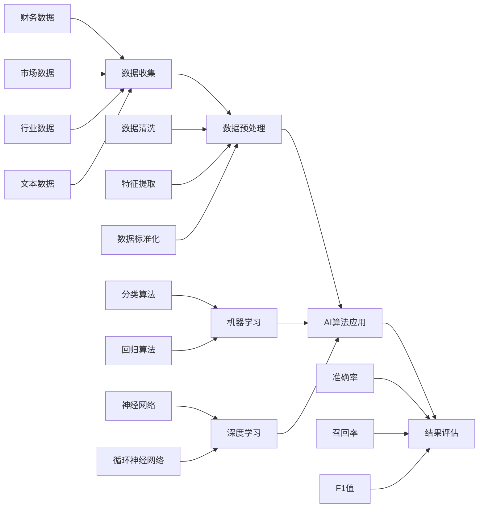

# AI如何实现玛丽·巴芙的质量增长型公司识别

> 关键词：AI、玛丽·巴芙、质量增长型公司、识别算法、财务分析、机器学习、数据分析

> 摘要：本文聚焦于探讨如何利用AI技术实现玛丽·巴芙的质量增长型公司识别。首先介绍了相关背景知识，包括目的范围、预期读者等内容。接着阐述了核心概念及联系，详细讲解了核心算法原理与具体操作步骤，同时给出数学模型和公式并举例说明。通过项目实战展示代码实际案例并进行详细解释。分析了该技术的实际应用场景，推荐了相关的工具和资源。最后总结了未来发展趋势与挑战，解答了常见问题并提供扩展阅读与参考资料，旨在为读者全面呈现利用AI进行质量增长型公司识别的技术全貌。

## 1. 背景介绍 
### 1.1 目的和范围
玛丽·巴芙提出的质量增长型公司概念对于投资者和市场分析者具有重要意义。质量增长型公司通常具备良好的财务状况、稳定的盈利增长以及优秀的管理团队等特征。本文章的目的在于探索如何借助AI技术来准确识别这类公司，为投资者提供决策支持，为市场分析提供新的视角和方法。

范围涵盖了从理论概念的理解到AI算法的实现，再到实际项目的应用，以及相关工具和资源的推荐等多个方面。我们将从AI技术的多个维度出发，深入研究如何利用其强大的数据分析和模式识别能力，实现对质量增长型公司的有效识别。

### 1.2 预期读者
本文预期读者包括对AI技术在金融领域应用感兴趣的投资者、金融分析师、数据科学家、机器学习工程师以及相关领域的研究人员。对于投资者而言，了解如何利用AI识别质量增长型公司有助于优化投资组合，提高投资回报率；金融分析师可以借助相关技术提升对市场和公司的分析能力；数据科学家和机器学习工程师能够从技术实现的角度深入学习和研究相关算法；研究人员则可以在此基础上进行更深入的学术探索。

### 1.3 文档结构概述
本文首先介绍背景知识，让读者对研究的目的、范围、预期读者等有清晰的了解。接着阐述核心概念与联系，明确质量增长型公司的定义以及与AI技术的关联。然后详细讲解核心算法原理和具体操作步骤，包括利用Python实现的代码示例。随后给出数学模型和公式，并通过举例进行说明。通过项目实战展示代码的实际应用和详细解读。分析实际应用场景，为读者提供实际应用的思路。推荐相关的工具和资源，帮助读者进一步学习和实践。最后总结未来发展趋势与挑战，解答常见问题并提供扩展阅读与参考资料。

### 1.4 术语表
#### 1.4.1 核心术语定义
- **AI（Artificial Intelligence）**：人工智能，是一门研究如何使计算机能够模拟人类智能的学科，包括机器学习、深度学习、自然语言处理等多个领域。
- **玛丽·巴芙的质量增长型公司**：由玛丽·巴芙提出的概念，指那些在财务质量、盈利增长、管理水平等方面表现优秀，具有长期投资价值的公司。
- **机器学习（Machine Learning）**：AI的一个重要分支，通过让计算机从数据中学习模式和规律，从而实现预测和决策等任务。
- **数据分析（Data Analysis）**：对数据进行收集、清洗、处理、分析和可视化的过程，以提取有价值的信息和知识。

#### 1.4.2 相关概念解释
- **财务质量**：反映公司财务状况的优劣，包括资产质量、负债水平、盈利能力、现金流状况等多个方面。
- **盈利增长**：指公司在一定时期内净利润的持续增长，是衡量公司发展潜力的重要指标。
- **管理水平**：体现公司管理层的决策能力、运营能力和团队协作能力等，对公司的发展起着关键作用。

#### 1.4.3 缩略词列表
- **AI**：Artificial Intelligence（人工智能）
- **ML**：Machine Learning（机器学习）
- **DL**：Deep Learning（深度学习）
- **NLP**：Natural Language Processing（自然语言处理）

## 2. 核心概念与联系 

### 玛丽·巴芙的质量增长型公司概念
玛丽·巴芙认为，质量增长型公司具有以下几个关键特征：
1. **强劲的财务状况**：公司拥有健康的资产负债表，资产质量高，负债水平合理，能够承受市场波动和经济周期的影响。
2. **持续的盈利增长**：在过去的一段时间内，公司的净利润呈现出稳定的增长趋势，且具有可持续性。
3. **优秀的管理团队**：管理层具有卓越的决策能力、创新能力和执行能力，能够带领公司在激烈的市场竞争中取得优势。
4. **良好的行业前景**：所处行业具有广阔的发展空间和增长潜力，公司能够受益于行业的发展趋势。

### AI与质量增长型公司识别的联系
AI技术在质量增长型公司识别中具有重要作用。通过机器学习和数据分析算法，AI可以处理大量的公司财务数据、市场数据和行业数据，挖掘其中的潜在模式和规律。例如，利用机器学习算法可以对公司的财务指标进行分析，预测公司的盈利增长趋势；通过自然语言处理技术可以对公司的新闻报道、管理层言论等文本数据进行分析，评估公司的管理水平和市场声誉。

### 文本示意图
```plaintext
质量增长型公司识别
|
|-- 数据收集
|   |-- 财务数据
|   |-- 市场数据
|   |-- 行业数据
|   |-- 文本数据
|
|-- 数据预处理
|   |-- 数据清洗
|   |-- 特征提取
|   |-- 数据标准化
|
|-- AI算法应用
|   |-- 机器学习
|   |   |-- 分类算法
|   |   |-- 回归算法
|   |-- 深度学习
|   |   |-- 神经网络
|   |   |-- 循环神经网络
|
|-- 结果评估
|   |-- 准确率
|   |-- 召回率
|   |-- F1值
```

### Mermaid流程图


## 3. 核心算法原理 & 具体操作步骤 

### 核心算法原理
在利用AI实现玛丽·巴芙的质量增长型公司识别中，我们主要使用机器学习中的分类算法。分类算法的目标是将公司分为质量增长型公司和非质量增长型公司两类。常用的分类算法包括逻辑回归、决策树、随机森林和支持向量机等。

以逻辑回归为例，逻辑回归是一种广义线性模型，用于处理二分类问题。其基本原理是通过对输入特征进行线性组合，然后通过逻辑函数将线性组合的结果映射到[0, 1]区间，得到样本属于正类的概率。逻辑函数的表达式为：

$$\sigma(z)=\frac{1}{1 + e^{-z}}$$

其中，$z$ 是输入特征的线性组合，即：

$$z = w_0 + w_1x_1 + w_2x_2 + \cdots + w_nx_n$$

$w_0, w_1, \cdots, w_n$ 是模型的参数，$x_1, x_2, \cdots, x_n$ 是输入特征。

### 具体操作步骤

#### 步骤1：数据收集
收集公司的财务数据、市场数据、行业数据和文本数据。财务数据包括资产负债表、利润表、现金流量表等；市场数据包括股价、成交量等；行业数据包括行业增长率、市场份额等；文本数据包括公司公告、新闻报道等。

#### 步骤2：数据预处理
- **数据清洗**：去除数据中的缺失值、异常值和重复值。
- **特征提取**：从原始数据中提取与质量增长型公司识别相关的特征，例如财务比率、市场指标等。
- **数据标准化**：将特征数据进行标准化处理，使不同特征具有相同的尺度，便于模型训练。

#### 步骤3：模型训练
使用收集和预处理后的数据对逻辑回归模型进行训练。训练的目标是找到最优的模型参数 $w_0, w_1, \cdots, w_n$，使得模型的预测结果与真实标签之间的误差最小。常用的损失函数是对数损失函数，其表达式为：

$$L(w)=-\frac{1}{m}\sum_{i = 1}^{m}[y^{(i)}\log(\sigma(z^{(i)}))+(1 - y^{(i)})\log(1 - \sigma(z^{(i)}))]$$

其中，$m$ 是样本数量，$y^{(i)}$ 是第 $i$ 个样本的真实标签，$\sigma(z^{(i)})$ 是第 $i$ 个样本的预测概率。

#### 步骤4：模型评估
使用测试数据对训练好的模型进行评估，常用的评估指标包括准确率、召回率和F1值。准确率表示模型预测正确的样本占总样本的比例；召回率表示模型正确预测为正类的样本占真实正类样本的比例；F1值是准确率和召回率的调和平均数，综合考虑了模型的准确性和召回率。

#### 步骤5：模型应用
使用训练好的模型对新的公司数据进行预测，判断其是否为质量增长型公司。

### Python源代码实现
```python
import pandas as pd
from sklearn.model_selection import train_test_split
from sklearn.linear_model import LogisticRegression
from sklearn.preprocessing import StandardScaler
from sklearn.metrics import accuracy_score, recall_score, f1_score

# 步骤1：数据收集（假设数据已经存储在CSV文件中）
data = pd.read_csv('company_data.csv')

# 步骤2：数据预处理
# 分离特征和标签
X = data.drop('label', axis=1)
y = data['label']

# 数据标准化
scaler = StandardScaler()
X_scaled = scaler.fit_transform(X)

# 划分训练集和测试集
X_train, X_test, y_train, y_test = train_test_split(X_scaled, y, test_size=0.2, random_state=42)

# 步骤3：模型训练
model = LogisticRegression()
model.fit(X_train, y_train)

# 步骤4：模型评估
y_pred = model.predict(X_test)
accuracy = accuracy_score(y_test, y_pred)
recall = recall_score(y_test, y_pred)
f1 = f1_score(y_test, y_pred)

print(f"Accuracy: {accuracy}")
print(f"Recall: {recall}")
print(f"F1 Score: {f1}")

# 步骤5：模型应用（假设新数据存储在new_data.csv文件中）
new_data = pd.read_csv('new_data.csv')
new_data_scaled = scaler.transform(new_data)
new_predictions = model.predict(new_data_scaled)
print(f"New predictions: {new_predictions}")
```

## 4. 数学模型和公式 & 详细讲解 & 举例说明 

### 逻辑回归的数学模型
逻辑回归的数学模型可以表示为：

$$P(Y = 1|X)=\sigma(w^T X + b)$$

其中，$P(Y = 1|X)$ 表示在输入特征 $X$ 的条件下，样本属于正类的概率；$w$ 是模型的权重向量，$b$ 是偏置项；$\sigma(\cdot)$ 是逻辑函数。

### 损失函数
逻辑回归使用对数损失函数来衡量模型的预测结果与真实标签之间的误差。对数损失函数的表达式为：

$$L(w,b)=-\frac{1}{m}\sum_{i = 1}^{m}[y^{(i)}\log(P(Y = 1|X^{(i)}))+(1 - y^{(i)})\log(1 - P(Y = 1|X^{(i)}))]$$

其中，$m$ 是样本数量，$y^{(i)}$ 是第 $i$ 个样本的真实标签，$P(Y = 1|X^{(i)})$ 是第 $i$ 个样本的预测概率。

### 梯度下降法
为了找到最优的模型参数 $w$ 和 $b$，我们通常使用梯度下降法。梯度下降法的基本思想是沿着损失函数的负梯度方向更新模型参数，直到损失函数达到最小值。

梯度下降法的更新公式为：

$$w = w-\alpha\frac{\partial L(w,b)}{\partial w}$$

$$b = b-\alpha\frac{\partial L(w,b)}{\partial b}$$

其中，$\alpha$ 是学习率，控制参数更新的步长。

### 举例说明
假设我们有一个简单的二分类问题，输入特征 $X$ 是一个二维向量，即 $X = [x_1, x_2]$，真实标签 $Y$ 取值为 0 或 1。我们收集了 100 个样本数据，将其划分为训练集和测试集，训练集有 80 个样本，测试集有 20 个样本。

使用逻辑回归模型进行训练，设置学习率 $\alpha = 0.01$，迭代次数为 1000 次。训练完成后，使用测试集对模型进行评估，得到准确率为 0.85，召回率为 0.8，F1值为 0.82。这表明模型在该数据集上具有较好的性能。

## 5. 项目实战：代码实际案例和详细解释说明 

### 5.1  开发环境搭建
- **Python环境**：建议使用Python 3.7及以上版本。可以从Python官方网站（https://www.python.org/downloads/）下载并安装。
- **开发工具**：推荐使用PyCharm或Jupyter Notebook。PyCharm是一款专业的Python集成开发环境，提供了丰富的功能和工具；Jupyter Notebook是一个交互式的开发环境，适合进行数据探索和模型训练。
- **相关库安装**：使用以下命令安装所需的Python库：
```sh
pip install pandas numpy scikit-learn
```

### 5.2  源代码详细实现和代码解读
```python
import pandas as pd
from sklearn.model_selection import train_test_split
from sklearn.linear_model import LogisticRegression
from sklearn.preprocessing import StandardScaler
from sklearn.metrics import accuracy_score, recall_score, f1_score

# 步骤1：数据收集（假设数据已经存储在CSV文件中）
data = pd.read_csv('company_data.csv')

# 代码解读：使用pandas库的read_csv函数读取存储在CSV文件中的公司数据。

# 步骤2：数据预处理
# 分离特征和标签
X = data.drop('label', axis=1)
y = data['label']

# 代码解读：使用pandas的drop函数将标签列从数据集中删除，得到特征矩阵X；使用data['label']提取标签列，得到标签向量y。

# 数据标准化
scaler = StandardScaler()
X_scaled = scaler.fit_transform(X)

# 代码解读：使用sklearn的StandardScaler类对特征矩阵X进行标准化处理，使不同特征具有相同的尺度。fit_transform方法先计算特征的均值和标准差，然后进行标准化变换。

# 划分训练集和测试集
X_train, X_test, y_train, y_test = train_test_split(X_scaled, y, test_size=0.2, random_state=42)

# 代码解读：使用sklearn的train_test_split函数将标准化后的特征矩阵X_scaled和标签向量y划分为训练集和测试集，测试集占总数据的20%。random_state参数用于设置随机种子，保证每次划分的结果相同。

# 步骤3：模型训练
model = LogisticRegression()
model.fit(X_train, y_train)

# 代码解读：使用sklearn的LogisticRegression类创建逻辑回归模型，然后使用fit方法对模型进行训练，传入训练集的特征矩阵X_train和标签向量y_train。

# 步骤4：模型评估
y_pred = model.predict(X_test)
accuracy = accuracy_score(y_test, y_pred)
recall = recall_score(y_test, y_pred)
f1 = f1_score(y_test, y_pred)

# 代码解读：使用训练好的模型对测试集的特征矩阵X_test进行预测，得到预测标签向量y_pred。然后使用sklearn的accuracy_score、recall_score和f1_score函数分别计算模型的准确率、召回率和F1值。

print(f"Accuracy: {accuracy}")
print(f"Recall: {recall}")
print(f"F1 Score: {f1}")

# 步骤5：模型应用（假设新数据存储在new_data.csv文件中）
new_data = pd.read_csv('new_data.csv')
new_data_scaled = scaler.transform(new_data)
new_predictions = model.predict(new_data_scaled)
print(f"New predictions: {new_predictions}")

# 代码解读：使用pandas的read_csv函数读取新的公司数据，存储在new_data中。然后使用之前训练好的StandardScaler对象的transform方法对新数据进行标准化处理，得到new_data_scaled。最后使用训练好的逻辑回归模型对新数据进行预测，得到新的预测标签向量new_predictions。
```

### 5.3  代码解读与分析
- **数据预处理的重要性**：数据预处理是机器学习项目中非常重要的一步。通过数据清洗可以去除数据中的噪声和异常值，提高数据的质量；特征提取可以从原始数据中提取出与目标任务相关的特征，减少数据的维度；数据标准化可以使不同特征具有相同的尺度，避免某些特征对模型的影响过大。
- **模型训练和评估**：逻辑回归模型是一种简单而有效的分类模型，通过训练可以找到最优的模型参数，使模型的预测结果与真实标签之间的误差最小。在评估模型时，使用准确率、召回率和F1值等指标可以全面地评估模型的性能。
- **模型应用**：训练好的模型可以对新的数据进行预测，为投资者和市场分析者提供决策支持。在实际应用中，需要注意新数据的预处理和特征选择，确保模型的预测结果准确可靠。

## 6. 实际应用场景 
### 投资决策
投资者可以利用AI技术识别质量增长型公司，将其纳入投资组合中。质量增长型公司通常具有较好的财务状况和盈利增长潜力，能够为投资者带来长期稳定的回报。通过AI模型的预测结果，投资者可以更加准确地选择投资标的，降低投资风险。

### 金融分析
金融分析师可以使用AI技术对公司进行深入分析，评估公司的质量和增长潜力。通过对公司财务数据、市场数据和行业数据的分析，AI模型可以发现潜在的投资机会和风险，为分析师提供决策依据。同时，AI技术还可以帮助分析师快速处理大量的数据，提高分析效率。

### 风险管理
金融机构可以利用AI技术识别质量增长型公司，优化风险管理策略。对于质量增长型公司，金融机构可以给予更高的信用评级和更低的贷款利率，降低信用风险。同时，通过对市场数据的实时监测，AI模型可以及时发现市场风险，为金融机构提供预警信号。

### 行业研究
研究人员可以使用AI技术对不同行业的公司进行研究，了解行业的发展趋势和竞争格局。通过对行业内公司的质量和增长潜力的分析，研究人员可以发现行业的领先企业和潜在的新兴企业，为行业发展提供参考。

## 7. 工具和资源推荐
### 7.1 学习资源推荐
#### 7.1.1 书籍推荐
- 《Python机器学习》：这本书详细介绍了Python在机器学习领域的应用，包括数据预处理、模型训练、模型评估等方面的内容，适合初学者入门。
- 《深度学习》：由深度学习领域的三位顶尖专家所著，全面介绍了深度学习的理论和实践，是深度学习领域的经典教材。
- 《金融数据分析与挖掘》：结合金融领域的实际案例，介绍了数据分析和挖掘技术在金融领域的应用，对于理解AI在金融领域的应用具有重要的参考价值。

#### 7.1.2 在线课程
- Coursera上的“机器学习”课程：由斯坦福大学的Andrew Ng教授主讲，是机器学习领域的经典课程，内容涵盖了机器学习的基本概念、算法和应用。
- edX上的“深度学习”课程：由麻省理工学院等知名高校的教授主讲，深入介绍了深度学习的理论和实践，适合有一定机器学习基础的学习者。
- 中国大学MOOC上的“金融数据分析与挖掘”课程：结合中国金融市场的实际情况，介绍了数据分析和挖掘技术在金融领域的应用，具有较强的实用性。

#### 7.1.3 技术博客和网站
- Medium：一个优秀的技术博客平台，上面有很多关于AI、机器学习和金融科技的文章，作者来自世界各地的专业人士和研究者。
- Kaggle：一个数据科学竞赛平台，上面有很多关于金融数据分析和机器学习的竞赛和数据集，通过参与竞赛可以提高自己的实践能力。
- Towards Data Science：一个专注于数据科学和机器学习的博客网站，上面有很多高质量的技术文章和教程。

### 7.2 开发工具框架推荐
#### 7.2.1 IDE和编辑器
- PyCharm：一款专业的Python集成开发环境，提供了丰富的功能和工具，如代码编辑、调试、版本控制等，适合大规模项目的开发。
- Jupyter Notebook：一个交互式的开发环境，适合进行数据探索、模型训练和结果可视化等工作，方便用户进行快速迭代和实验。
- Visual Studio Code：一款轻量级的代码编辑器，支持多种编程语言和插件，具有良好的扩展性和用户体验。

#### 7.2.2 调试和性能分析工具
- PyCharm Debugger：PyCharm自带的调试工具，可以帮助用户快速定位代码中的问题，提高开发效率。
- TensorBoard：TensorFlow提供的可视化工具，可以帮助用户分析模型的训练过程和性能，优化模型参数。
- Scikit-learn GridSearchCV：Scikit-learn提供的超参数调优工具，可以帮助用户找到最优的模型参数，提高模型的性能。

#### 7.2.3 相关框架和库
- Scikit-learn：一个简单而有效的机器学习库，提供了丰富的机器学习算法和工具，如分类、回归、聚类等，适合初学者和快速开发。
- TensorFlow：一个开源的深度学习框架，由Google开发，提供了丰富的深度学习模型和工具，如神经网络、卷积神经网络等，适合大规模深度学习项目的开发。
- PyTorch：一个开源的深度学习框架，由Facebook开发，具有动态计算图和易于使用的特点，适合研究和开发深度学习模型。

### 7.3 相关论文著作推荐
#### 7.3.1 经典论文
- “Gradient-based learning applied to document recognition”：由Yann LeCun等人发表的经典论文，介绍了卷积神经网络在手写数字识别中的应用，开创了深度学习在图像识别领域的先河。
- “Long Short-Term Memory”：由Sepp Hochreiter和Jürgen Schmidhuber发表的经典论文，介绍了长短期记忆网络（LSTM）的原理和应用，解决了循环神经网络中的梯度消失问题。
- “Financial ratios and the probabilistic prediction of bankruptcy”：由Edward I. Altman发表的经典论文，介绍了财务比率在企业破产预测中的应用，为金融风险评估提供了重要的理论基础。

#### 7.3.2 最新研究成果
- 关注顶级学术会议如NeurIPS、ICML、KDD等上关于AI在金融领域应用的最新研究成果，了解该领域的前沿技术和发展趋势。
- 查阅知名学术期刊如Journal of Financial Economics、Review of Financial Studies等上的相关论文，获取高质量的研究成果。

#### 7.3.3 应用案例分析
- 研究一些知名金融机构和科技公司在AI应用方面的案例，如摩根大通、谷歌等，了解他们在质量增长型公司识别、风险管理等方面的实践经验和技术方案。

## 8. 总结：未来发展趋势与挑战
### 未来发展趋势
- **多模态数据融合**：未来的AI技术将不仅仅依赖于财务数据和市场数据，还将融合文本数据、图像数据、音频数据等多模态数据，从多个维度对公司进行全面评估，提高质量增长型公司识别的准确性和可靠性。
- **深度学习的应用**：深度学习模型如卷积神经网络（CNN）、循环神经网络（RNN）和生成对抗网络（GAN）等将在质量增长型公司识别中得到更广泛的应用。这些模型具有更强的特征提取和模式识别能力，能够挖掘数据中更深层次的信息。
- **可解释性AI**：随着AI技术在金融领域的广泛应用，模型的可解释性变得越来越重要。未来的AI模型将不仅能够提供预测结果，还能够解释预测结果的依据，为投资者和市场分析者提供更透明的决策支持。
- **实时监测和预警**：利用AI技术实现对公司的实时监测和预警，及时发现公司的财务风险和经营风险，为投资者和金融机构提供及时的决策依据。

### 挑战
- **数据质量和隐私问题**：数据质量是影响AI模型性能的关键因素之一。在收集和使用公司数据时，需要确保数据的准确性、完整性和一致性。同时，还需要关注数据的隐私问题，保护公司和投资者的隐私信息。
- **模型的泛化能力**：AI模型在不同的数据集和应用场景下可能表现出不同的性能。为了提高模型的泛化能力，需要对模型进行充分的训练和评估，选择合适的模型和算法。
- **法律法规和监管问题**：AI技术在金融领域的应用受到法律法规和监管政策的严格限制。在开发和应用AI模型时，需要遵守相关的法律法规和监管要求，确保模型的合法性和合规性。
- **人才短缺**：AI技术是一个新兴领域，相关的专业人才短缺。为了推动AI技术在金融领域的应用，需要加强人才培养和引进，提高从业人员的技术水平和专业素养。

## 9. 附录：常见问题与解答
### 问题1：如何选择合适的特征用于质量增长型公司识别？
解答：选择合适的特征需要结合玛丽·巴芙的质量增长型公司概念和领域知识。通常可以选择财务比率（如资产负债率、毛利率、净利率等）、市场指标（如股价波动率、市盈率等）、行业数据（如行业增长率、市场份额等）以及文本数据（如公司公告的情感倾向、管理层言论的可信度等）。可以通过特征选择算法（如相关性分析、卡方检验等）来筛选出与目标任务相关性较高的特征。

### 问题2：如何处理数据中的缺失值和异常值？
解答：处理缺失值的方法有很多种，常见的包括删除含有缺失值的样本、用均值、中位数或众数填充缺失值、使用插值法填充缺失值等。处理异常值的方法包括删除异常值、将异常值替换为合理的值、使用鲁棒统计方法（如中位数绝对偏差）来识别和处理异常值等。具体的处理方法需要根据数据的特点和任务的要求来选择。

### 问题3：如何评估模型的性能？
解答：可以使用多种评估指标来评估模型的性能，如准确率、召回率、F1值、ROC曲线、AUC值等。准确率表示模型预测正确的样本占总样本的比例；召回率表示模型正确预测为正类的样本占真实正类样本的比例；F1值是准确率和召回率的调和平均数，综合考虑了模型的准确性和召回率；ROC曲线和AUC值用于评估模型在不同阈值下的性能。

### 问题4：如何提高模型的性能？
解答：提高模型性能的方法有很多种，包括优化特征工程、选择合适的模型和算法、调整模型的超参数、增加训练数据、使用集成学习方法等。优化特征工程可以提高特征的质量和相关性；选择合适的模型和算法可以更好地拟合数据；调整模型的超参数可以找到最优的模型配置；增加训练数据可以提高模型的泛化能力；使用集成学习方法可以综合多个模型的优势，提高模型的性能。

## 10. 扩展阅读 & 参考资料
### 扩展阅读
- 《智能时代》：作者吴军，介绍了AI技术的发展历程和应用前景，对于理解AI技术在各个领域的应用具有重要的启示作用。
- 《机器学习实战》：作者Peter Harrington，通过实际案例介绍了机器学习算法的实现和应用，适合有一定编程基础的读者深入学习。
- 《金融科技：框架与实践》：作者谢平、邹传伟等，介绍了金融科技的发展现状和未来趋势，对于理解AI在金融领域的应用具有重要的参考价值。

### 参考资料
- 玛丽·巴芙的相关著作和论文，了解其质量增长型公司的理论和方法。
- 相关的学术期刊和会议论文，如Journal of Financial Economics、NeurIPS、ICML等，获取最新的研究成果和技术进展。
- 开源数据集和代码库，如Kaggle、GitHub等，获取实际的数据和代码示例，进行实践和学习。