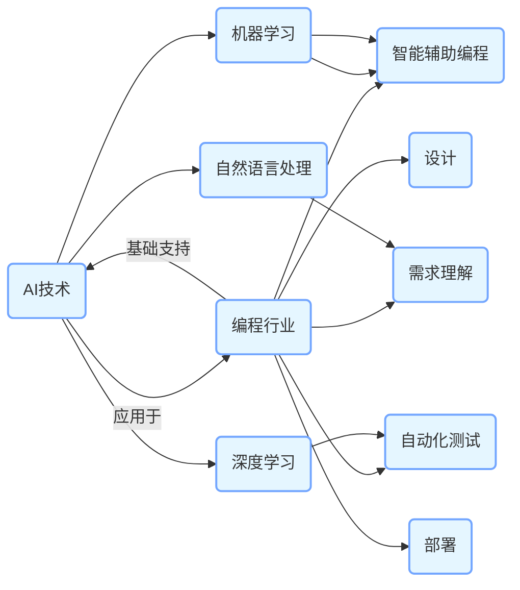

# AI如何推动编程行业的创新与变革

> 关键词：AI、编程行业、创新、变革、代码生成、智能辅助、自动化测试

> 摘要：本文深入探讨了AI在编程行业中所起到的关键作用以及带来的创新与变革。通过对AI核心概念、算法原理、数学模型等方面的详细阐述，结合实际项目案例，分析了AI在编程各个环节的具体应用。同时，介绍了相关的工具和资源，探讨了未来的发展趋势与挑战，旨在为读者全面呈现AI与编程行业融合的现状与前景。

## 1. 背景介绍 
### 1.1 目的和范围
随着人工智能技术的飞速发展，其在各个领域都产生了深远的影响，编程行业也不例外。本文的目的在于深入探讨AI如何推动编程行业的创新与变革，详细分析AI在编程过程中的具体应用、优势以及面临的挑战。范围涵盖AI在代码生成、智能辅助编程、自动化测试等多个编程环节的应用，以及与之相关的技术原理、数学模型和实际案例。

### 1.2 预期读者
本文预期读者包括编程从业者、对AI和编程感兴趣的技术爱好者、相关领域的研究人员以及高校计算机专业的学生。通过阅读本文，读者可以全面了解AI在编程行业中的应用现状和发展趋势，为进一步学习和实践提供参考。

### 1.3 文档结构概述
本文将按照以下结构进行阐述：首先介绍相关的核心概念与联系，包括AI和编程行业的基本概念以及它们之间的相互关系；接着详细讲解AI的核心算法原理和具体操作步骤，并给出相应的Python源代码；然后介绍AI在编程中涉及的数学模型和公式，并举例说明；通过项目实战，展示AI在编程中的具体应用和代码实现；分析AI在编程行业的实际应用场景；推荐相关的学习资源、开发工具框架和论文著作；最后总结AI推动编程行业创新与变革的未来发展趋势与挑战，并提供常见问题的解答和扩展阅读参考资料。

### 1.4 术语表
#### 1.4.1 核心术语定义
- **AI（Artificial Intelligence）**：即人工智能，是指通过计算机系统模拟人类智能的技术和方法，包括机器学习、深度学习、自然语言处理等多个领域。
- **编程行业**：涉及软件开发、程序设计、系统维护等一系列与计算机程序相关的工作领域。
- **代码生成**：利用AI技术自动生成符合特定需求的计算机代码。
- **智能辅助编程**：借助AI工具为程序员提供代码提示、错误检查、优化建议等辅助功能。
- **自动化测试**：使用AI技术自动执行软件测试任务，提高测试效率和准确性。

#### 1.4.2 相关概念解释
- **机器学习**：是AI的一个重要分支，通过让计算机从数据中学习模式和规律，从而实现预测和决策。
- **深度学习**：一种基于人工神经网络的机器学习方法，能够处理复杂的非线性问题，在图像识别、自然语言处理等领域取得了显著成果。
- **自然语言处理**：研究如何让计算机理解和处理人类语言的技术，包括文本分类、情感分析、机器翻译等应用。

#### 1.4.3 缩略词列表
- **ML（Machine Learning）**：机器学习
- **DL（Deep Learning）**：深度学习
- **NLP（Natural Language Processing）**：自然语言处理
- **IDE（Integrated Development Environment）**：集成开发环境

## 2. 核心概念与联系 

### 2.1 AI的核心概念
AI是一门研究如何使计算机系统具有智能的学科，其目标是让计算机能够模拟人类的感知、学习、推理和决策等智能行为。AI的主要领域包括机器学习、深度学习、自然语言处理、计算机视觉等。

机器学习是AI的核心技术之一，它通过让计算机从数据中学习模式和规律，从而实现对未知数据的预测和决策。常见的机器学习算法包括决策树、支持向量机、神经网络等。

深度学习是一种基于人工神经网络的机器学习方法，它通过构建多层神经网络来学习数据的复杂特征。深度学习在图像识别、语音识别、自然语言处理等领域取得了巨大的成功，例如，谷歌的图像识别系统、苹果的语音助手Siri等都是深度学习的应用实例。

自然语言处理是研究如何让计算机理解和处理人类语言的技术，它涉及到文本分类、情感分析、机器翻译、问答系统等多个应用场景。自然语言处理的核心任务是将人类语言转换为计算机能够理解的形式，并进行相应的处理和分析。

### 2.2 编程行业的核心概念
编程行业是指涉及软件开发、程序设计、系统维护等一系列与计算机程序相关的工作领域。编程的主要任务是使用编程语言编写计算机程序，以实现特定的功能和需求。

常见的编程语言包括Python、Java、C++、JavaScript等，不同的编程语言适用于不同的应用场景。例如，Python适用于数据科学、人工智能、Web开发等领域；Java适用于企业级应用开发、Android开发等领域；C++适用于系统编程、游戏开发等领域；JavaScript适用于Web前端开发、Node.js后端开发等领域。

编程的过程通常包括需求分析、设计、编码、测试、部署等多个阶段。在每个阶段，程序员都需要使用相应的工具和技术来完成任务。例如，在需求分析阶段，程序员需要与客户沟通，了解需求，并使用需求分析工具进行需求建模；在设计阶段，程序员需要使用设计模式和架构设计工具来设计软件的架构和模块；在编码阶段，程序员需要使用编程语言和开发工具来编写代码；在测试阶段，程序员需要使用测试工具来对软件进行测试，确保软件的质量和稳定性；在部署阶段，程序员需要使用部署工具将软件部署到生产环境中。

### 2.3 AI与编程行业的联系
AI与编程行业有着密切的联系，AI技术的发展为编程行业带来了新的机遇和挑战。

一方面，AI技术可以应用于编程的各个环节，提高编程的效率和质量。例如，AI可以用于代码生成、智能辅助编程、自动化测试等。代码生成是指利用AI技术自动生成符合特定需求的计算机代码，程序员可以通过输入需求描述，让AI系统自动生成相应的代码，从而减少编程的工作量。智能辅助编程是指借助AI工具为程序员提供代码提示、错误检查、优化建议等辅助功能，帮助程序员更快地编写高质量的代码。自动化测试是指使用AI技术自动执行软件测试任务，提高测试的效率和准确性。

另一方面，编程是实现AI技术的基础，AI系统的开发和运行需要使用编程语言和开发工具。例如，Python是AI领域中最常用的编程语言之一，它提供了丰富的AI库和工具，如TensorFlow、PyTorch、Scikit-learn等，这些库和工具可以帮助程序员快速开发和实现AI系统。

### 2.4 核心概念原理和架构的文本示意图
AI与编程行业的关系可以用以下文本示意图表示：

AI技术包括机器学习、深度学习、自然语言处理等多个领域，这些技术可以应用于编程的各个环节，如需求分析、设计、编码、测试、部署等。在编码阶段，AI可以用于代码生成、智能辅助编程等；在测试阶段，AI可以用于自动化测试等。编程是实现AI技术的基础，程序员需要使用编程语言和开发工具来开发和运行AI系统。

### 2.5 Mermaid流程图


## 3. 核心算法原理 & 具体操作步骤 

### 3.1 代码生成的核心算法原理
代码生成是AI在编程行业中的一个重要应用，其核心算法原理主要基于机器学习和自然语言处理技术。常见的代码生成算法包括基于模板的方法、基于深度学习的方法等。

#### 3.1.1 基于模板的方法
基于模板的方法是一种简单而有效的代码生成方法，其基本思想是将代码模板与需求描述进行匹配，然后根据匹配结果填充模板中的变量，生成最终的代码。

例如，假设我们要生成一个Python函数来计算两个数的和，我们可以定义一个代码模板：
```python
def add_numbers(num1, num2):
    result = num1 + num2
    return result
```
如果需求描述是“计算两个整数的和”，我们可以将“num1”和“num2”替换为具体的整数，生成最终的代码：
```python
def add_numbers(3, 5):
    result = 3 + 5
    return result
```

#### 3.1.2 基于深度学习的方法
基于深度学习的方法是一种更加复杂和强大的代码生成方法，其基本思想是使用深度学习模型来学习代码的语法和语义，然后根据需求描述生成相应的代码。

常见的深度学习模型包括循环神经网络（RNN）、长短期记忆网络（LSTM）、门控循环单元（GRU）等。这些模型可以处理序列数据，适合用于代码生成任务。

以下是一个基于Python和Keras库的简单的代码生成示例：
```python
from keras.models import Sequential
from keras.layers import LSTM, Dense
import numpy as np

# 定义训练数据
text = "def add_numbers(num1, num2): result = num1 + num2 return result"
chars = sorted(list(set(text)))
char_to_int = dict((c, i) for i, c in enumerate(chars))
int_to_char = dict((i, c) for i, c in enumerate(chars))

# 准备训练数据
seq_length = 10
dataX = []
dataY = []
for i in range(0, len(text) - seq_length, 1):
    seq_in = text[i:i + seq_length]
    seq_out = text[i + seq_length]
    dataX.append([char_to_int[char] for char in seq_in])
    dataY.append(char_to_int[seq_out])

# 转换为适合Keras输入的格式
X = np.reshape(dataX, (len(dataX), seq_length, 1))
X = X / float(len(chars))
y = np_utils.to_categorical(dataY)

# 定义模型
model = Sequential()
model.add(LSTM(256, input_shape=(X.shape[1], X.shape[2])))
model.add(Dense(y.shape[1], activation='softmax'))
model.compile(loss='categorical_crossentropy', optimizer='adam')

# 训练模型
model.fit(X, y, epochs=100, batch_size=32)

# 生成代码
start = np.random.randint(0, len(dataX) - 1)
pattern = dataX[start]
print("Seed:")
print("\"", ''.join([int_to_char[value] for value in pattern]), "\"")
for i in range(100):
    x = np.reshape(pattern, (1, len(pattern), 1))
    x = x / float(len(chars))
    prediction = model.predict(x, verbose=0)
    index = np.argmax(prediction)
    result = int_to_char[index]
    seq_in = [int_to_char[value] for value in pattern]
    print(result, end="")
    pattern.append(index)
    pattern = pattern[1:len(pattern)]
```

### 3.2 智能辅助编程的核心算法原理
智能辅助编程是指借助AI工具为程序员提供代码提示、错误检查、优化建议等辅助功能，其核心算法原理主要基于机器学习和自然语言处理技术。

#### 3.2.1 代码提示
代码提示是智能辅助编程的一个重要功能，其基本思想是根据程序员输入的代码片段，预测下一个可能的代码元素，如变量名、函数名、关键字等。

常见的代码提示算法包括基于规则的方法、基于机器学习的方法等。基于规则的方法是根据编程语言的语法规则和代码库的结构，生成可能的代码提示。基于机器学习的方法是使用机器学习模型来学习代码的模式和规律，然后根据程序员输入的代码片段，预测下一个可能的代码元素。

以下是一个基于Python和Scikit-learn库的简单的代码提示示例：
```python
from sklearn.feature_extraction.text import TfidfVectorizer
from sklearn.neighbors import NearestNeighbors
import numpy as np

# 定义代码库
code_library = [
    "def add_numbers(num1, num2): result = num1 + num2 return result",
    "def subtract_numbers(num1, num2): result = num1 - num2 return result",
    "def multiply_numbers(num1, num2): result = num1 * num2 return result"
]

# 提取特征
vectorizer = TfidfVectorizer()
X = vectorizer.fit_transform(code_library)

# 训练模型
model = NearestNeighbors(n_neighbors=1)
model.fit(X)

# 输入代码片段
input_code = "def add"
input_vector = vectorizer.transform([input_code])

# 预测下一个可能的代码元素
distances, indices = model.kneighbors(input_vector)
suggestion = code_library[indices[0][0]]
print("Suggestion:", suggestion)
```

#### 3.2.2 错误检查
错误检查是智能辅助编程的另一个重要功能，其基本思想是分析程序员编写的代码，检测其中的语法错误、逻辑错误等，并给出相应的错误提示。

常见的错误检查算法包括基于规则的方法、基于机器学习的方法等。基于规则的方法是根据编程语言的语法规则和代码规范，检测代码中的错误。基于机器学习的方法是使用机器学习模型来学习代码的模式和规律，然后根据程序员编写的代码，检测其中的错误。

以下是一个基于Python和Pylint库的简单的错误检查示例：
```python
import pylint.lint

# 定义代码
code = "def add_numbers(num1, num2): result = num1 + num2 return result"

# 检查代码
pylint.lint.Run([code])
```

### 3.3 自动化测试的核心算法原理
自动化测试是指使用AI技术自动执行软件测试任务，提高测试的效率和准确性。其核心算法原理主要基于机器学习和自然语言处理技术。

#### 3.3.1 测试用例生成
测试用例生成是自动化测试的一个重要环节，其基本思想是根据软件的需求规格说明和代码结构，自动生成测试用例。

常见的测试用例生成算法包括基于规则的方法、基于机器学习的方法等。基于规则的方法是根据软件的需求规格说明和代码结构，定义一系列的规则，然后根据这些规则生成测试用例。基于机器学习的方法是使用机器学习模型来学习软件的行为模式，然后根据这些模式生成测试用例。

以下是一个基于Python和Hypothesis库的简单的测试用例生成示例：
```python
from hypothesis import given
import hypothesis.strategies as st

def add_numbers(num1, num2):
    return num1 + num2

@given(st.integers(), st.integers())
def test_add_numbers(num1, num2):
    result = add_numbers(num1, num2)
    assert result == num1 + num2
```

#### 3.3.2 测试执行和结果分析
测试执行和结果分析是自动化测试的另一个重要环节，其基本思想是自动执行生成的测试用例，并分析测试结果，判断软件是否存在缺陷。

常见的测试执行和结果分析算法包括基于规则的方法、基于机器学习的方法等。基于规则的方法是根据软件的需求规格说明和测试用例的预期结果，定义一系列的规则，然后根据这些规则分析测试结果。基于机器学习的方法是使用机器学习模型来学习软件的行为模式和测试结果的模式，然后根据这些模式分析测试结果。

以下是一个基于Python和unittest库的简单的测试执行和结果分析示例：
```python
import unittest

def add_numbers(num1, num2):
    return num1 + num2

class TestAddNumbers(unittest.TestCase):
    def test_add_numbers(self):
        result = add_numbers(3, 5)
        self.assertEqual(result, 8)

if __name__ == '__main__':
    unittest.main()
```

## 4. 数学模型和公式 & 详细讲解 & 举例说明 

### 4.1 机器学习中的数学模型和公式
机器学习是AI的核心技术之一，其涉及到许多数学模型和公式。以下是一些常见的机器学习数学模型和公式的详细讲解和举例说明。

#### 4.1.1 线性回归
线性回归是一种简单而常用的机器学习算法，用于预测连续变量的值。其数学模型可以表示为：
$$y = \theta_0 + \theta_1x_1 + \theta_2x_2 + \cdots + \theta_nx_n + \epsilon$$
其中，$y$ 是预测值，$x_1, x_2, \cdots, x_n$ 是输入特征，$\theta_0, \theta_1, \theta_2, \cdots, \theta_n$ 是模型的参数，$\epsilon$ 是误差项。

线性回归的目标是找到一组最优的参数 $\theta$，使得预测值 $y$ 与真实值之间的误差最小。常用的误差度量方法是均方误差（MSE），其公式为：
$$MSE = \frac{1}{m}\sum_{i=1}^{m}(y^{(i)} - \hat{y}^{(i)})^2$$
其中，$m$ 是样本数量，$y^{(i)}$ 是第 $i$ 个样本的真实值，$\hat{y}^{(i)}$ 是第 $i$ 个样本的预测值。

为了找到最优的参数 $\theta$，可以使用最小二乘法或梯度下降法。最小二乘法的公式为：
$$\theta = (X^TX)^{-1}X^Ty$$
其中，$X$ 是输入特征矩阵，$y$ 是真实值向量。

以下是一个基于Python和Scikit-learn库的简单的线性回归示例：
```python
from sklearn.linear_model import LinearRegression
import numpy as np

# 定义训练数据
X = np.array([[1], [2], [3], [4], [5]])
y = np.array([2, 4, 6, 8, 10])

# 训练模型
model = LinearRegression()
model.fit(X, y)

# 预测
new_X = np.array([[6]])
prediction = model.predict(new_X)
print("Prediction:", prediction)
```

#### 4.1.2 逻辑回归
逻辑回归是一种常用的分类算法，用于预测离散变量的值。其数学模型可以表示为：
$$P(y = 1|x) = \frac{1}{1 + e^{-z}}$$
其中，$P(y = 1|x)$ 是样本 $x$ 属于正类的概率，$z = \theta_0 + \theta_1x_1 + \theta_2x_2 + \cdots + \theta_nx_n$ 是线性组合。

逻辑回归的目标是找到一组最优的参数 $\theta$，使得预测的概率与真实标签之间的误差最小。常用的误差度量方法是对数损失函数，其公式为：
$$J(\theta) = -\frac{1}{m}\sum_{i=1}^{m}[y^{(i)}\log(P(y^{(i)} = 1|x^{(i)})) + (1 - y^{(i)})\log(1 - P(y^{(i)} = 1|x^{(i)}))]$$
其中，$m$ 是样本数量，$y^{(i)}$ 是第 $i$ 个样本的真实标签，$P(y^{(i)} = 1|x^{(i)})$ 是第 $i$ 个样本属于正类的概率。

为了找到最优的参数 $\theta$，可以使用梯度下降法。

以下是一个基于Python和Scikit-learn库的简单的逻辑回归示例：
```python
from sklearn.linear_model import LogisticRegression
import numpy as np

# 定义训练数据
X = np.array([[1], [2], [3], [4], [5]])
y = np.array([0, 0, 1, 1, 1])

# 训练模型
model = LogisticRegression()
model.fit(X, y)

# 预测
new_X = np.array([[6]])
prediction = model.predict(new_X)
print("Prediction:", prediction)
```

### 4.2 深度学习中的数学模型和公式
深度学习是一种基于人工神经网络的机器学习方法，其涉及到许多数学模型和公式。以下是一些常见的深度学习数学模型和公式的详细讲解和举例说明。

#### 4.2.1 神经网络的前向传播
神经网络是深度学习的核心模型，其由输入层、隐藏层和输出层组成。神经网络的前向传播过程可以表示为：
$$z^{[l]} = W^{[l]}a^{[l - 1]} + b^{[l]}$$
$$a^{[l]} = g(z^{[l]})$$
其中，$z^{[l]}$ 是第 $l$ 层的线性组合，$W^{[l]}$ 是第 $l$ 层的权重矩阵，$a^{[l - 1]}$ 是第 $l - 1$ 层的激活值，$b^{[l]}$ 是第 $l$ 层的偏置向量，$g$ 是激活函数。

常见的激活函数包括 sigmoid 函数、ReLU 函数、tanh 函数等。sigmoid 函数的公式为：
$$\sigma(z) = \frac{1}{1 + e^{-z}}$$
ReLU 函数的公式为：
$$ReLU(z) = \max(0, z)$$
tanh 函数的公式为：
$$\tanh(z) = \frac{e^z - e^{-z}}{e^z + e^{-z}}$$

#### 4.2.2 神经网络的反向传播
神经网络的反向传播过程是用于计算梯度的过程，其目的是更新神经网络的参数，使得损失函数最小。反向传播的公式可以表示为：
$$dZ^{[l]} = dA^{[l]} * g'(Z^{[l]})$$
$$dW^{[l]} = \frac{1}{m}dZ^{[l]}A^{[l - 1]T}$$
$$db^{[l]} = \frac{1}{m}\sum_{i = 1}^{m}dZ^{[l](i)}$$
$$dA^{[l - 1]} = W^{[l]T}dZ^{[l]}$$
其中，$dZ^{[l]}$ 是第 $l$ 层的梯度，$dA^{[l]}$ 是第 $l$ 层的激活值的梯度，$g'(Z^{[l]})$ 是激活函数的导数，$dW^{[l]}$ 是第 $l$ 层的权重矩阵的梯度，$db^{[l]}$ 是第 $l$ 层的偏置向量的梯度，$m$ 是样本数量。

以下是一个基于Python和Keras库的简单的神经网络示例：
```python
from keras.models import Sequential
from keras.layers import Dense
import numpy as np

# 定义训练数据
X = np.array([[0, 0], [0, 1], [1, 0], [1, 1]])
y = np.array([[0], [1], [1], [0]])

# 定义模型
model = Sequential()
model.add(Dense(2, input_dim=2, activation='sigmoid'))
model.add(Dense(1, activation='sigmoid'))

# 编译模型
model.compile(loss='binary_crossentropy', optimizer='adam', metrics=['accuracy'])

# 训练模型
model.fit(X, y, epochs=1000, batch_size=4)

# 预测
predictions = model.predict(X)
print("Predictions:", predictions)
```

## 5. 项目实战：代码实际案例和详细解释说明 

### 5.1  开发环境搭建
在进行项目实战之前，需要搭建相应的开发环境。以下是一个基于Python的开发环境搭建步骤：

1. **安装Python**：从Python官方网站（https://www.python.org/downloads/）下载并安装Python 3.x版本。
2. **安装开发工具**：推荐使用PyCharm作为开发工具，从JetBrains官方网站（https://www.jetbrains.com/pycharm/download/）下载并安装PyCharm。
3. **创建虚拟环境**：在命令行中使用以下命令创建虚拟环境：
```bash
python -m venv myenv
```
4. **激活虚拟环境**：在命令行中使用以下命令激活虚拟环境：
```bash
source myenv/bin/activate  # Linux/Mac
myenv\Scripts\activate  # Windows
```
5. **安装依赖库**：在命令行中使用以下命令安装所需的依赖库：
```bash
pip install tensorflow keras scikit-learn pylint hypothesis unittest
```

### 5.2  源代码详细实现和代码解读
以下是一个基于AI的代码生成和智能辅助编程的项目实战示例：

```python
import numpy as np
from sklearn.feature_extraction.text import TfidfVectorizer
from sklearn.neighbors import NearestNeighbors
from keras.models import Sequential
from keras.layers import LSTM, Dense
import numpy_utils

# 代码库
code_library = [
    "def add_numbers(num1, num2): result = num1 + num2 return result",
    "def subtract_numbers(num1, num2): result = num1 - num2 return result",
    "def multiply_numbers(num1, num2): result = num1 * num2 return result"
]

# 代码生成模型训练
text = ' '.join(code_library)
chars = sorted(list(set(text)))
char_to_int = dict((c, i) for i, c in enumerate(chars))
int_to_char = dict((i, c) for i, c in enumerate(chars))

seq_length = 10
dataX = []
dataY = []
for i in range(0, len(text) - seq_length, 1):
    seq_in = text[i:i + seq_length]
    seq_out = text[i + seq_length]
    dataX.append([char_to_int[char] for char in seq_in])
    dataY.append(char_to_int[seq_out])

X = np.reshape(dataX, (len(dataX), seq_length, 1))
X = X / float(len(chars))
y = np_utils.to_categorical(dataY)

model = Sequential()
model.add(LSTM(256, input_shape=(X.shape[1], X.shape[2])))
model.add(Dense(y.shape[1], activation='softmax'))
model.compile(loss='categorical_crossentropy', optimizer='adam')
model.fit(X, y, epochs=100, batch_size=32)

# 代码提示模型训练
vectorizer = TfidfVectorizer()
X_code = vectorizer.fit_transform(code_library)
code_model = NearestNeighbors(n_neighbors=1)
code_model.fit(X_code)

# 代码生成函数
def generate_code(seed_text, length=100):
    start = np.random.randint(0, len(dataX) - 1)
    pattern = dataX[start]
    result = ""
    for i in range(length):
        x = np.reshape(pattern, (1, len(pattern), 1))
        x = x / float(len(chars))
        prediction = model.predict(x, verbose=0)
        index = np.argmax(prediction)
        char = int_to_char[index]
        result += char
        pattern.append(index)
        pattern = pattern[1:len(pattern)]
    return result

# 代码提示函数
def suggest_code(input_code):
    input_vector = vectorizer.transform([input_code])
    distances, indices = code_model.kneighbors(input_vector)
    suggestion = code_library[indices[0][0]]
    return suggestion

# 测试代码生成
seed_text = "def add"
generated_code = generate_code(seed_text)
print("Generated Code:", generated_code)

# 测试代码提示
input_code = "def sub"
suggested_code = suggest_code(input_code)
print("Suggested Code:", suggested_code)
```

### 5.3  代码解读与分析
- **代码库定义**：定义了一个包含多个代码片段的代码库 `code_library`，用于代码生成和代码提示的训练。
- **代码生成模型训练**：使用LSTM模型对代码库进行训练，学习代码的模式和规律。具体步骤包括数据预处理、模型定义、编译和训练。
- **代码提示模型训练**：使用TfidfVectorizer和NearestNeighbors模型对代码库进行训练，根据输入的代码片段找到最相似的代码片段作为提示。
- **代码生成函数**：`generate_code` 函数根据给定的种子文本生成一定长度的代码。
- **代码提示函数**：`suggest_code` 函数根据输入的代码片段返回最相似的代码片段作为提示。
- **测试代码**：对代码生成和代码提示功能进行测试，输出生成的代码和提示的代码。

## 6. 实际应用场景 
### 6.1 快速原型开发
在软件开发的初期，需要快速搭建一个原型来验证想法和功能。AI的代码生成功能可以根据需求描述快速生成基本的代码框架，大大缩短了原型开发的时间。例如，在开发一个Web应用时，AI可以自动生成前端页面的HTML、CSS和JavaScript代码，以及后端服务器的代码，程序员只需要对生成的代码进行简单的修改和优化，就可以快速搭建出一个可用的原型。

### 6.2 提高编程效率
智能辅助编程工具可以为程序员提供实时的代码提示、错误检查和优化建议，帮助程序员更快地编写高质量的代码。例如，当程序员输入一个函数名时，智能辅助编程工具可以自动提示该函数的参数和返回值；当程序员编写的代码存在语法错误或逻辑错误时，智能辅助编程工具可以及时给出错误提示，并提供修正建议。

### 6.3 自动化测试
自动化测试是保证软件质量的重要手段，AI可以应用于自动化测试的各个环节，如测试用例生成、测试执行和结果分析。AI可以根据软件的需求规格说明和代码结构，自动生成全面的测试用例，提高测试的覆盖率；在测试执行过程中，AI可以自动分析测试结果，判断软件是否存在缺陷，并给出相应的报告和建议。

### 6.4 代码优化
AI可以分析代码的性能瓶颈和潜在问题，提供优化建议，帮助程序员提高代码的运行效率和可维护性。例如，AI可以分析代码的时间复杂度和空间复杂度，找出性能瓶颈所在，并建议使用更高效的算法和数据结构；AI还可以检查代码的代码风格和规范，提供代码格式化和重构建议，使代码更加易读和易维护。

### 6.5 智能编程教育
在编程教育领域，AI可以为学生提供个性化的学习支持。例如，AI可以根据学生的学习进度和能力水平，为学生推荐适合的学习资源和练习题目；当学生遇到编程问题时，AI可以提供智能辅导，帮助学生理解问题和解决问题。

## 7. 工具和资源推荐
### 7.1 学习资源推荐
#### 7.1.1 书籍推荐
- 《Python机器学习》：本书全面介绍了Python在机器学习领域的应用，包括机器学习的基本概念、算法原理和实践案例。
- 《深度学习》：由深度学习领域的三位先驱Ian Goodfellow、Yoshua Bengio和Aaron Courville撰写，是深度学习领域的经典教材。
- 《人工智能：一种现代的方法》：本书全面介绍了人工智能的基本概念、算法和应用，是人工智能领域的经典教材。

#### 7.1.2 在线课程
- Coursera上的“机器学习”课程：由斯坦福大学的Andrew Ng教授授课，是机器学习领域的经典课程。
- edX上的“深度学习”课程：由微软和其他机构联合推出，全面介绍了深度学习的基本概念、算法和应用。
- 网易云课堂上的“Python编程从入门到实践”课程：适合初学者学习Python编程。

#### 7.1.3 技术博客和网站
- Medium：一个技术博客平台，上面有很多关于AI和编程的优质文章。
- Towards Data Science：专注于数据科学和机器学习领域的技术博客，提供了很多实用的教程和案例。
- Stack Overflow：一个程序员社区，上面有很多关于编程问题的讨论和解决方案。

### 7.2 开发工具框架推荐
#### 7.2.1 IDE和编辑器
- PyCharm：一款功能强大的Python集成开发环境，提供了代码编辑、调试、版本控制等功能。
- Visual Studio Code：一款轻量级的代码编辑器，支持多种编程语言，有丰富的插件和扩展。
- Jupyter Notebook：一个交互式的编程环境，适合进行数据探索和模型训练。

#### 7.2.2 调试和性能分析工具
- PDB：Python的内置调试器，可以帮助程序员调试代码。
- Py-Spy：一个性能分析工具，可以分析Python代码的性能瓶颈。
- TensorBoard：TensorFlow的可视化工具，可以帮助程序员可视化训练过程和模型结构。

#### 7.2.3 相关框架和库
- TensorFlow：一个开源的深度学习框架，由Google开发，广泛应用于图像识别、自然语言处理等领域。
- PyTorch：一个开源的深度学习框架，由Facebook开发，具有动态图和易于使用的特点。
- Scikit-learn：一个开源的机器学习库，提供了丰富的机器学习算法和工具。

### 7.3 相关论文著作推荐
#### 7.3.1 经典论文
- “Gradient-Based Learning Applied to Document Recognition”：由Yann LeCun等人撰写，介绍了卷积神经网络（CNN）在手写数字识别中的应用，是深度学习领域的经典论文。
- “Attention Is All You Need”：由Google Brain团队撰写，介绍了Transformer模型，是自然语言处理领域的重要突破。
- “Generative Adversarial Nets”：由Ian Goodfellow等人撰写，介绍了生成对抗网络（GAN），是生成式模型领域的重要论文。

#### 7.3.2 最新研究成果
- 关注顶级学术会议如NeurIPS、ICML、CVPR等的最新论文，了解AI领域的最新研究进展。
- 关注知名研究机构如OpenAI、DeepMind等的最新研究成果。

#### 7.3.3 应用案例分析
- 研究一些知名公司如Google、Facebook、Amazon等在AI和编程领域的应用案例，了解实际应用中的技术和经验。

## 8. 总结：未来发展趋势与挑战
### 8.1 未来发展趋势
- **更强大的代码生成能力**：未来的AI代码生成工具将能够生成更加复杂和高质量的代码，甚至可以根据自然语言描述直接生成完整的软件系统。
- **深度融合的智能辅助编程**：智能辅助编程工具将与编程环境深度融合，提供更加个性化和智能化的辅助功能，如自动代码重构、智能代码注释等。
- **自动化测试的全面应用**：AI将在自动化测试中发挥更加重要的作用，实现测试用例的自动生成、测试执行的自动调度和测试结果的自动分析，大大提高软件测试的效率和质量。
- **智能编程助手的普及**：类似于智能语音助手的智能编程助手将逐渐普及，程序员可以通过语音交互的方式与编程助手进行沟通，获取代码提示、解决编程问题等。
- **跨语言和跨平台的支持**：AI编程工具将支持更多的编程语言和平台，实现跨语言和跨平台的代码生成、智能辅助编程和自动化测试。

### 8.2 挑战
- **数据隐私和安全问题**：AI编程工具需要大量的代码数据进行训练，这些数据可能包含敏感信息，如商业机密、用户隐私等，如何保证数据的隐私和安全是一个重要的挑战。
- **模型的可解释性**：深度学习模型通常是黑盒模型，其决策过程难以解释，这在一些对安全性和可靠性要求较高的领域，如金融、医疗等，可能会导致信任问题。
- **人才短缺**：AI和编程领域的融合需要既懂AI又懂编程的复合型人才，目前这类人才相对短缺，如何培养和吸引这类人才是一个挑战。
- **伦理和法律问题**：AI编程工具的应用可能会带来一些伦理和法律问题，如代码版权归属、AI生成代码的责任认定等，需要建立相应的伦理和法律规范。

## 9. 附录：常见问题与解答
### 9.1 AI生成的代码质量如何保证？
AI生成的代码质量可以通过以下方法保证：
- **人工审查**：对AI生成的代码进行人工审查，检查代码的逻辑正确性、代码风格和规范等。
- **测试验证**：对AI生成的代码进行充分的测试，确保代码的功能和性能符合要求。
- **模型优化**：不断优化AI代码生成模型，提高模型的准确性和泛化能力。

### 9.2 AI智能辅助编程工具是否会取代程序员？
AI智能辅助编程工具不会取代程序员，而是会成为程序员的有力助手。虽然AI可以帮助程序员提高编程效率和质量，但编程过程中还需要人类的创造力、逻辑思维和问题解决能力。程序员可以利用AI智能辅助编程工具来完成一些重复性和繁琐的任务，将更多的精力放在软件的设计、架构和创新上。

### 9.3 如何选择适合的AI编程工具？
选择适合的AI编程工具可以考虑以下因素：
- **功能需求**：根据自己的编程需求选择具有相应功能的AI编程工具，如代码生成、智能辅助编程、自动化测试等。
- **易用性**：选择易于使用和学习的AI编程工具，减少学习成本。
- **性能和稳定性**：选择性能和稳定性良好的AI编程工具，确保工具在使用过程中不会出现卡顿、崩溃等问题。
- **社区支持**：选择有活跃社区支持的AI编程工具，这样可以获取更多的学习资源和技术支持。

### 9.4 AI在编程行业的应用是否会导致就业岗位减少？
AI在编程行业的应用不会导致就业岗位减少，反而会创造更多的就业机会。虽然AI可能会取代一些重复性和繁琐的编程工作，但同时也会带来新的工作岗位，如AI编程工具的开发和维护、AI与编程的融合应用等。此外，AI的应用也会推动编程行业的发展和创新，需要更多的程序员来参与和推动。

## 10. 扩展阅读 & 参考资料
- 《Python深度学习》，Francois Chollet著
- 《Python数据科学手册》，Jake VanderPlas著
- 《人工智能时代与人类未来》，李开复、王咏刚著
- 相关学术期刊如《Journal of Artificial Intelligence Research》、《Artificial Intelligence》等
- 相关技术论坛如Reddit的r/MachineLearning、r/Programming等
- 各大科技公司的官方博客，如Google AI Blog、Facebook AI Research等