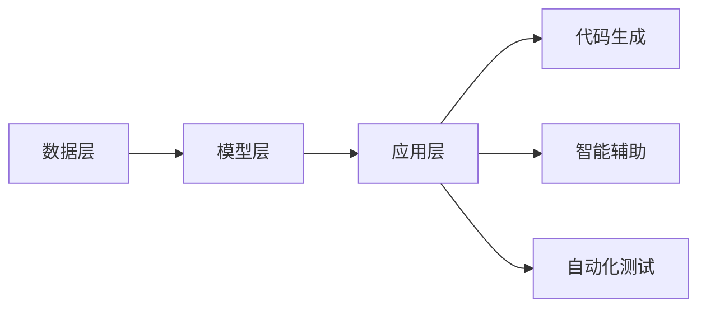

# AI如何推动编程行业的创新与变革

> 关键词：AI、编程行业、创新、变革、代码生成、智能辅助、自动化测试

> 摘要：本文深入探讨了AI在编程行业中所起到的推动创新与变革的作用。从背景介绍出发，阐述了研究的目的、范围、预期读者等内容。接着详细讲解了AI与编程相关的核心概念及其联系，分析了核心算法原理并给出具体操作步骤，同时用数学模型和公式进行理论支撑。通过项目实战案例，展示了AI在编程中的实际应用，还探讨了其具体的应用场景。推荐了相关的学习资源、开发工具框架以及论文著作。最后总结了未来发展趋势与挑战，为读者呈现了AI在编程行业的全方位影响。

## 1. 背景介绍 
### 1.1 目的和范围
在当今数字化时代，AI技术正以前所未有的速度发展，并逐渐渗透到各个领域。编程行业作为科技发展的重要支柱，也受到了AI的深刻影响。本文的目的在于全面分析AI如何推动编程行业的创新与变革，研究范围涵盖AI在编程过程中的各个环节，包括代码生成、智能辅助、自动化测试等，旨在为编程从业者、研究者以及对该领域感兴趣的人士提供深入的见解和参考。

### 1.2 预期读者
本文预期读者包括但不限于以下几类人群：
- 编程从业者：希望了解AI技术如何提升编程效率和质量，以及如何在实际工作中应用AI工具和技术。
- 计算机科学研究者：对AI与编程的交叉领域感兴趣，希望深入研究相关理论和技术。
- 科技企业管理者：关注行业发展趋势，希望了解AI对编程行业的影响，以便制定企业发展战略。
- 学生和爱好者：对AI和编程有浓厚兴趣，希望通过本文了解相关知识，为进一步学习和研究打下基础。

### 1.3 文档结构概述
本文共分为十个部分，具体结构如下：
- 背景介绍：阐述研究的目的、范围、预期读者、文档结构概述以及相关术语表。
- 核心概念与联系：介绍AI与编程相关的核心概念，分析它们之间的联系，并通过文本示意图和Mermaid流程图进行展示。
- 核心算法原理 & 具体操作步骤：讲解AI在编程中应用的核心算法原理，并使用Python源代码详细阐述具体操作步骤。
- 数学模型和公式 & 详细讲解 & 举例说明：用数学模型和公式对相关理论进行支撑，并通过具体例子进行详细讲解。
- 项目实战：代码实际案例和详细解释说明：通过实际项目案例，展示AI在编程中的具体应用，包括开发环境搭建、源代码实现和代码解读。
- 实际应用场景：探讨AI在编程行业中的具体应用场景。
- 工具和资源推荐：推荐相关的学习资源、开发工具框架以及论文著作。
- 总结：未来发展趋势与挑战：总结AI在编程行业的发展趋势，并分析面临的挑战。
- 附录：常见问题与解答：解答读者在阅读过程中可能遇到的常见问题。
- 扩展阅读 & 参考资料：提供相关的扩展阅读材料和参考资料。

### 1.4 术语表
#### 1.4.1 核心术语定义
- **AI（Artificial Intelligence）**：即人工智能，是研究、开发用于模拟、延伸和扩展人的智能的理论、方法、技术及应用系统的一门新的技术科学。
- **机器学习（Machine Learning）**：是一门多领域交叉学科，涉及概率论、统计学、逼近论、凸分析、算法复杂度理论等多门学科。它专门研究计算机怎样模拟或实现人类的学习行为，以获取新的知识或技能，重新组织已有的知识结构使之不断改善自身的性能。
- **深度学习（Deep Learning）**：是机器学习的一个分支领域，它是一种基于对数据进行表征学习的方法。深度学习通过构建具有很多层的神经网络模型，自动从大量数据中学习特征和模式。
- **自然语言处理（Natural Language Processing）**：是计算机科学与语言学的交叉领域，主要研究如何让计算机理解、处理和生成人类语言。

#### 1.4.2 相关概念解释
- **代码生成**：指利用AI技术自动生成代码的过程，通过对大量代码数据的学习，AI可以根据用户的需求生成相应的代码。
- **智能辅助**：在编程过程中，AI可以提供智能提示、错误检查、代码优化等辅助功能，帮助程序员提高编程效率和质量。
- **自动化测试**：利用AI技术自动生成测试用例、执行测试并分析测试结果，提高软件测试的效率和准确性。

#### 1.4.3 缩略词列表
- **API（Application Programming Interface）**：应用程序编程接口
- **CNN（Convolutional Neural Network）**：卷积神经网络
- **RNN（Recurrent Neural Network）**：循环神经网络
- **LSTM（Long Short - Term Memory）**：长短期记忆网络

## 2. 核心概念与联系 
### 核心概念原理
#### AI原理
AI的核心在于模拟人类的智能行为，主要通过机器学习和深度学习等技术实现。机器学习是让计算机通过数据和算法来学习模式和规律，而深度学习则是利用深度神经网络从大量数据中自动学习特征和模式。例如，在图像识别中，深度学习模型可以通过对大量图像数据的学习，识别出不同的物体。

#### 编程原理
编程是将人类的需求转化为计算机能够理解和执行的指令的过程。程序员使用各种编程语言，按照一定的语法规则编写代码，实现特定的功能。编程的核心在于算法设计、数据结构的选择和程序的逻辑组织。

### 架构的文本示意图
AI与编程的结合可以形成一个多层次的架构，具体如下：

- **数据层**：包含大量的代码数据、自然语言描述数据等，这些数据是AI学习的基础。
- **模型层**：使用机器学习和深度学习算法构建模型，如神经网络模型，对数据进行学习和训练。
- **应用层**：将训练好的模型应用到编程的各个环节，如代码生成、智能辅助、自动化测试等。

### Mermaid流程图


## 3. 核心算法原理 & 具体操作步骤 
### 核心算法原理
#### 基于深度学习的代码生成算法
以基于Transformer架构的语言模型为例，Transformer是一种基于注意力机制的深度学习模型，它可以处理序列数据。在代码生成中，模型通过对大量代码数据的学习，理解代码的语法和语义，然后根据用户输入的自然语言描述或部分代码，生成完整的代码。

以下是一个简化的基于Transformer的代码生成模型的Python实现示例：
```python
import torch
import torch.nn as nn
import torch.optim as optim
from torch.utils.data import Dataset, DataLoader

# 定义Transformer模型
class TransformerModel(nn.Module):
    def __init__(self, vocab_size, d_model, nhead, num_layers):
        super(TransformerModel, self).__init__()
        self.embedding = nn.Embedding(vocab_size, d_model)
        self.transformer_encoder = nn.TransformerEncoder(
            nn.TransformerEncoderLayer(d_model, nhead),
            num_layers
        )
        self.decoder = nn.Linear(d_model, vocab_size)

    def forward(self, src):
        src = self.embedding(src)
        src = src.permute(1, 0, 2)
        output = self.transformer_encoder(src)
        output = output.permute(1, 0, 2)
        output = self.decoder(output)
        return output

# 定义数据集类
class CodeDataset(Dataset):
    def __init__(self, data):
        self.data = data

    def __len__(self):
        return len(self.data)

    def __getitem__(self, idx):
        return self.data[idx]

# 训练模型
def train_model(model, dataloader, criterion, optimizer, epochs):
    model.train()
    for epoch in range(epochs):
        total_loss = 0
        for batch in dataloader:
            optimizer.zero_grad()
            output = model(batch)
            loss = criterion(output.view(-1, output.size(-1)), batch.view(-1))
            loss.backward()
            optimizer.step()
            total_loss += loss.item()
        print(f'Epoch {epoch + 1}, Loss: {total_loss / len(dataloader)}')

# 示例数据
data = torch.randint(0, 100, (100, 20))
dataset = CodeDataset(data)
dataloader = DataLoader(dataset, batch_size=10, shuffle=True)

# 模型参数
vocab_size = 100
d_model = 128
nhead = 4
num_layers = 2

# 初始化模型、损失函数和优化器
model = TransformerModel(vocab_size, d_model, nhead, num_layers)
criterion = nn.CrossEntropyLoss()
optimizer = optim.Adam(model.parameters(), lr=0.001)

# 训练模型
train_model(model, dataloader, criterion, optimizer, epochs=10)
```

### 具体操作步骤
1. **数据收集**：收集大量的代码数据，可以从开源代码库、代码托管平台等获取。
2. **数据预处理**：对收集到的代码数据进行清洗、分词、编码等预处理操作，将其转换为模型可以处理的格式。
3. **模型训练**：使用预处理后的数据对模型进行训练，调整模型的参数，使其能够学习到代码的语法和语义。
4. **模型评估**：使用测试数据对训练好的模型进行评估，计算模型的准确率、召回率等指标，评估模型的性能。
5. **应用部署**：将训练好的模型部署到实际的编程环境中，为程序员提供代码生成、智能辅助等服务。

## 4. 数学模型和公式 & 详细讲解 & 举例说明 
### 数学模型和公式
#### 损失函数
在深度学习中，常用的损失函数是交叉熵损失函数，用于衡量模型预测结果与真实标签之间的差异。对于分类问题，交叉熵损失函数的公式如下：

$$H(p, q)=-\sum_{i = 1}^{n}p_{i}\log(q_{i})$$

其中，$p$ 是真实标签的概率分布，$q$ 是模型预测的概率分布，$n$ 是类别数。

#### 注意力机制
注意力机制是Transformer模型的核心，它可以计算输入序列中不同位置之间的相关性。注意力分数的计算公式如下：

$$\text{Attention}(Q, K, V)=\text{softmax}\left(\frac{QK^{T}}{\sqrt{d_{k}}}\right)V$$

其中，$Q$ 是查询矩阵，$K$ 是键矩阵，$V$ 是值矩阵，$d_{k}$ 是键向量的维度。

### 详细讲解
#### 交叉熵损失函数
交叉熵损失函数的目的是最小化模型预测结果与真实标签之间的差异。当模型预测结果与真实标签完全一致时，交叉熵损失函数的值为0；当模型预测结果与真实标签差异较大时，交叉熵损失函数的值较大。在训练模型时，通过不断调整模型的参数，使得交叉熵损失函数的值逐渐减小，从而提高模型的性能。

#### 注意力机制
注意力机制通过计算查询矩阵 $Q$ 与键矩阵 $K$ 的相似度，得到注意力分数，然后将注意力分数与值矩阵 $V$ 相乘，得到加权和。这样，模型可以根据输入序列中不同位置的相关性，对不同位置的信息进行加权处理，从而更好地捕捉序列中的长距离依赖关系。

### 举例说明
#### 交叉熵损失函数
假设我们有一个二分类问题，真实标签为 $p = [1, 0]$，模型预测的概率分布为 $q = [0.8, 0.2]$。则交叉熵损失函数的值为：

$$H(p, q)=-(1\times\log(0.8)+0\times\log(0.2))\approx 0.223$$

#### 注意力机制
假设我们有一个输入序列 $x = [x_{1}, x_{2}, x_{3}]$，查询矩阵 $Q$、键矩阵 $K$ 和值矩阵 $V$ 分别为：

$$Q=\begin{bmatrix}q_{1}\\q_{2}\\q_{3}\end{bmatrix}, K=\begin{bmatrix}k_{1}\\k_{2}\\k_{3}\end{bmatrix}, V=\begin{bmatrix}v_{1}\\v_{2}\\v_{3}\end{bmatrix}$$

首先计算注意力分数：

$$\text{Attention scores}=\frac{QK^{T}}{\sqrt{d_{k}}}=\begin{bmatrix}q_{1}k_{1}^{T}/\sqrt{d_{k}}&q_{1}k_{2}^{T}/\sqrt{d_{k}}&q_{1}k_{3}^{T}/\sqrt{d_{k}}\\q_{2}k_{1}^{T}/\sqrt{d_{k}}&q_{2}k_{2}^{T}/\sqrt{d_{k}}&q_{2}k_{3}^{T}/\sqrt{d_{k}}\\q_{3}k_{1}^{T}/\sqrt{d_{k}}&q_{3}k_{2}^{T}/\sqrt{d_{k}}&q_{3}k_{3}^{T}/\sqrt{d_{k}}\end{bmatrix}$$

然后对注意力分数进行softmax操作，得到注意力权重：

$$\text{Attention weights}=\text{softmax}(\text{Attention scores})$$

最后将注意力权重与值矩阵 $V$ 相乘，得到加权和：

$$\text{Attention}(Q, K, V)=\text{Attention weights}\times V$$

## 5. 项目实战：代码实际案例和详细解释说明 
### 5.1  开发环境搭建
#### 安装Python
首先需要安装Python，建议使用Python 3.7及以上版本。可以从Python官方网站（https://www.python.org/downloads/）下载安装包，按照安装向导进行安装。

#### 安装深度学习框架
本文使用PyTorch作为深度学习框架，可以使用以下命令安装：

```sh
pip install torch torchvision
```

#### 安装其他依赖库
还需要安装一些其他的依赖库，如numpy、matplotlib等，可以使用以下命令安装：

```sh
pip install numpy matplotlib
```

### 5.2  源代码详细实现和代码解读
#### 代码生成示例
以下是一个简单的代码生成示例，使用预训练的GPT - 2模型生成Python代码：

```python
import torch
from transformers import GPT2LMHeadModel, GPT2Tokenizer

# 加载预训练的GPT - 2模型和分词器
tokenizer = GPT2Tokenizer.from_pretrained('gpt2')
model = GPT2LMHeadModel.from_pretrained('gpt2')

# 输入自然语言描述
input_text = "Write a Python function to calculate the sum of two numbers."

# 对输入进行编码
input_ids = tokenizer.encode(input_text, return_tensors='pt')

# 生成代码
output = model.generate(input_ids, max_length=100, num_beams=5, no_repeat_ngram_size=2, early_stopping=True)

# 解码输出
generated_code = tokenizer.decode(output[0], skip_special_tokens=True)

print(generated_code)
```

#### 代码解读
1. **加载预训练的模型和分词器**：使用 `transformers` 库加载预训练的GPT - 2模型和分词器。
2. **输入自然语言描述**：定义一个自然语言描述，作为代码生成的输入。
3. **对输入进行编码**：使用分词器将输入的自然语言描述编码为模型可以处理的输入ID。
4. **生成代码**：使用模型的 `generate` 方法生成代码，设置生成的最大长度、束搜索的数量等参数。
5. **解码输出**：使用分词器将生成的输出ID解码为自然语言代码。

### 5.3  代码解读与分析
#### 优点
- **提高效率**：通过AI生成代码可以大大提高编程效率，减少程序员手动编写代码的工作量。
- **学习参考**：生成的代码可以作为程序员的学习参考，帮助他们更好地理解编程思路和语法。

#### 缺点
- **准确性问题**：目前的AI代码生成技术还存在一定的准确性问题，生成的代码可能存在语法错误或逻辑错误。
- **缺乏创造性**：AI生成的代码往往是基于已有的代码数据，缺乏创造性和创新性。

## 6. 实际应用场景 
### 代码生成
在软件开发中，AI可以根据用户的需求自动生成代码。例如，在Web开发中，AI可以根据用户输入的需求描述，生成HTML、CSS、JavaScript等代码。在数据处理中，AI可以根据用户的需求生成数据清洗、数据分析等代码。

### 智能辅助
在编程过程中，AI可以提供智能提示、错误检查、代码优化等辅助功能。例如，当程序员编写代码时，AI可以根据上下文自动提示可能的代码补全选项；当程序员编写的代码存在语法错误或逻辑错误时，AI可以及时发现并给出错误提示；当程序员编写的代码效率较低时，AI可以提供代码优化建议。

### 自动化测试
AI可以自动生成测试用例、执行测试并分析测试结果。例如，在软件测试中，AI可以根据软件的功能需求和代码结构，自动生成测试用例，然后执行测试用例，检查软件的功能是否正常。在测试结果分析中，AI可以分析测试结果，找出软件中的缺陷和问题，并给出相应的修复建议。

### 代码审查
AI可以辅助程序员进行代码审查，检查代码的规范性、可读性和安全性。例如，AI可以检查代码是否符合编程规范，是否存在潜在的安全漏洞，是否有冗余代码等。通过AI的辅助，程序员可以更高效地进行代码审查，提高代码质量。

## 7. 工具和资源推荐
### 7.1 学习资源推荐
#### 7.1.1 书籍推荐
- 《深度学习》（Deep Learning）：由Ian Goodfellow、Yoshua Bengio和Aaron Courville合著，是深度学习领域的经典教材，系统地介绍了深度学习的理论和方法。
- 《Python机器学习》（Python Machine Learning）：由Sebastian Raschka和Vahid Mirjalili合著，详细介绍了Python在机器学习中的应用，包括各种机器学习算法的实现和应用。
- 《人工智能：一种现代的方法》（Artificial Intelligence: A Modern Approach）：由Stuart Russell和Peter Norvig合著，是人工智能领域的经典教材，全面介绍了人工智能的理论、算法和应用。

#### 7.1.2 在线课程
- Coursera上的“深度学习专项课程”（Deep Learning Specialization）：由Andrew Ng教授授课，包括五门课程，系统地介绍了深度学习的理论和实践。
- edX上的“人工智能导论”（Introduction to Artificial Intelligence）：由麻省理工学院（MIT）的Patrick H. Winston教授授课，介绍了人工智能的基本概念、算法和应用。
- 哔哩哔哩上的“Python人工智能教程”：由多位知名博主制作，以通俗易懂的方式介绍了Python在人工智能中的应用。

#### 7.1.3 技术博客和网站
- Medium：是一个开放的技术博客平台，有很多关于AI和编程的优秀文章。
- Towards Data Science：专注于数据科学和机器学习领域，有很多高质量的技术文章和教程。
- GitHub：是全球最大的开源代码托管平台，可以在上面找到很多关于AI和编程的开源项目和代码。

### 7.2 开发工具框架推荐
#### 7.2.1 IDE和编辑器
- PyCharm：是一款专门为Python开发设计的集成开发环境（IDE），具有代码自动补全、语法检查、调试等功能。
- Visual Studio Code：是一款轻量级的代码编辑器，支持多种编程语言，有丰富的插件可以扩展其功能。
- Jupyter Notebook：是一个交互式的编程环境，适合进行数据探索、模型训练和代码演示。

#### 7.2.2 调试和性能分析工具
- Py-Spy：是一个Python性能分析工具，可以实时分析Python程序的性能瓶颈。
- PDB：是Python自带的调试器，可以帮助程序员调试Python程序。
- TensorBoard：是TensorFlow的可视化工具，可以帮助用户可视化模型的训练过程和性能指标。

#### 7.2.3 相关框架和库
- PyTorch：是一个开源的深度学习框架，具有动态计算图、自动求导等功能，广泛应用于深度学习研究和开发。
- TensorFlow：是一个开源的深度学习框架，由Google开发，具有强大的分布式计算能力和丰富的工具库。
- Scikit-learn：是一个开源的机器学习库，提供了各种机器学习算法的实现和工具，适合初学者和快速开发。

### 7.3 相关论文著作推荐
#### 7.3.1 经典论文
- “Attention Is All You Need”：提出了Transformer架构，是深度学习领域的经典论文，对自然语言处理和计算机视觉等领域产生了深远影响。
- “ImageNet Classification with Deep Convolutional Neural Networks”：提出了AlexNet模型，开创了深度学习在计算机视觉领域的应用先河。
- “Generative Adversarial Nets”：提出了生成对抗网络（GAN）的概念，为生成式模型的发展奠定了基础。

#### 7.3.2 最新研究成果
- OpenAI的GPT系列论文：如“Language Models are Unsupervised Multitask Learners”（GPT - 2）、“Language Models are Few - Shot Learners”（GPT - 3）等，展示了语言模型在自然语言处理领域的强大能力。
- DeepMind的AlphaFold系列论文：如“Highly accurate protein structure prediction with AlphaFold”，展示了AI在蛋白质结构预测领域的突破。

#### 7.3.3 应用案例分析
- Google的TensorFlow在语音识别、图像识别等领域的应用案例分析。
- OpenAI的GPT - 3在智能客服、内容生成等领域的应用案例分析。

## 8. 总结：未来发展趋势与挑战
### 未来发展趋势
- **更智能的代码生成**：未来的AI代码生成技术将更加智能，能够生成更复杂、更高效的代码，并且能够更好地理解用户的需求。
- **深度融合的智能辅助**：AI将与编程工具深度融合，提供更加全面、智能的辅助功能，如实时代码优化、智能调试等。
- **自动化软件开发**：AI将推动软件开发向自动化方向发展，实现从需求分析、设计、编码到测试的全流程自动化。
- **跨领域应用**：AI在编程行业的应用将不仅仅局限于软件开发，还将扩展到其他领域，如物联网、金融、医疗等，实现跨领域的创新和变革。

### 挑战
- **数据隐私和安全**：AI在编程中需要大量的数据进行训练，如何保护数据的隐私和安全是一个重要的挑战。
- **算法可解释性**：目前的AI算法大多是黑盒模型，缺乏可解释性，如何提高算法的可解释性，让程序员更好地理解和信任AI生成的代码是一个亟待解决的问题。
- **技术人才短缺**：AI与编程的交叉领域需要既懂AI又懂编程的复合型人才，目前这类人才短缺，如何培养和吸引更多的技术人才是一个挑战。
- **伦理和法律问题**：AI在编程中的应用可能会带来一些伦理和法律问题，如代码的版权归属、AI生成的代码是否符合法律规定等，需要建立相应的伦理和法律规范。

## 9. 附录：常见问题与解答
### 1. AI生成的代码质量可靠吗？
目前AI生成的代码质量还存在一定的问题，可能存在语法错误、逻辑错误等。但是随着技术的不断发展，AI生成的代码质量将不断提高。在使用AI生成的代码时，程序员仍然需要对代码进行审查和测试，确保代码的质量和可靠性。

### 2. AI会取代程序员吗？
AI不会取代程序员，而是会与程序员协同工作，提高编程效率和质量。AI可以帮助程序员完成一些重复性、规律性的工作，如代码生成、错误检查等，让程序员有更多的时间和精力去关注软件的设计、架构和创新等方面。

### 3. 学习AI编程需要具备哪些基础知识？
学习AI编程需要具备一定的数学基础，如线性代数、概率论、统计学等，以及编程基础，如Python编程。此外，还需要了解机器学习、深度学习等相关的理论和算法。

### 4. 如何选择适合的AI开发框架？
选择适合的AI开发框架需要考虑以下因素：项目需求、个人技术栈、框架的性能和功能等。如果是初学者，建议选择简单易用的框架，如Scikit - learn；如果是进行深度学习研究和开发，建议选择功能强大的框架，如PyTorch、TensorFlow。

## 10. 扩展阅读 & 参考资料
### 扩展阅读
- 《AI未来进行式》：探讨了AI在各个领域的应用和发展趋势。
- 《人类简史：从动物到上帝》：从人类历史的角度探讨了技术发展对人类社会的影响，对理解AI在编程行业的变革有一定的启示。

### 参考资料
- 相关学术论文和研究报告，如IEEE、ACM等学术组织发表的关于AI和编程的论文。
- 各开源项目的官方文档，如PyTorch、TensorFlow等框架的官方文档。
- 各大科技公司的技术博客，如Google、Microsoft、OpenAI等公司的技术博客。