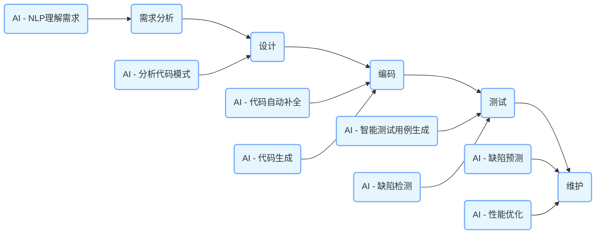

# AI如何推动软件开发的革新

> 关键词：AI、软件开发、革新、自动化编程、代码生成、智能测试、未来趋势

> 摘要：本文深入探讨了AI如何推动软件开发的革新。首先介绍了研究的背景、目的、预期读者和文档结构等内容。接着阐述了AI与软件开发相关的核心概念及其联系，详细讲解了核心算法原理和具体操作步骤，并给出了数学模型和公式。通过项目实战案例展示了AI在软件开发中的具体应用，分析了实际应用场景。同时推荐了相关的学习资源、开发工具框架和论文著作。最后总结了AI推动软件开发革新的未来发展趋势与挑战，还提供了常见问题解答和扩展阅读参考资料，旨在全面呈现AI对软件开发带来的深刻变革。

## 1. 背景介绍 
### 1.1 目的和范围
在当今数字化时代，软件开发的需求呈爆炸式增长，对开发效率、质量和创新性的要求也越来越高。本文章的目的在于全面剖析AI技术如何在软件开发的各个环节发挥作用，推动其实现革新。范围涵盖了从代码生成、测试到项目管理等软件开发的全生命周期，分析AI带来的新方法、新工具和新挑战。

### 1.2 预期读者
本文预期读者包括软件开发人员、软件架构师、CTO等技术从业者，以及对AI和软件开发领域感兴趣的研究人员、学生和行业观察者。希望通过本文，为不同层次的读者提供有价值的见解和信息，帮助他们更好地理解和应用AI技术来提升软件开发的水平。

### 1.3 文档结构概述
本文将按照以下结构进行阐述：首先介绍AI与软件开发相关的核心概念及其联系，让读者对相关技术有初步的认识；接着详细讲解核心算法原理和具体操作步骤，并结合Python代码进行说明；然后给出数学模型和公式，深入剖析其理论基础；通过项目实战案例展示AI在实际开发中的应用；分析AI在软件开发中的实际应用场景；推荐相关的学习资源、开发工具框架和论文著作；最后总结AI推动软件开发革新的未来发展趋势与挑战，还提供常见问题解答和扩展阅读参考资料。

### 1.4 术语表
#### 1.4.1 核心术语定义
- **AI（Artificial Intelligence）**：人工智能，指让计算机系统模拟人类智能的技术和方法，包括机器学习、深度学习、自然语言处理等多个领域。
- **软件开发（Software Development）**：从需求分析、设计、编码、测试到维护等一系列创建和维护软件系统的过程。
- **自动化编程（Automated Programming）**：利用AI技术自动生成代码的过程，减少人工编写代码的工作量。
- **代码生成（Code Generation）**：根据特定的规则或输入，自动生成符合要求的代码片段或完整程序。
- **智能测试（Intelligent Testing）**：使用AI技术进行软件测试，如自动生成测试用例、智能缺陷检测等。

#### 1.4.2 相关概念解释
- **机器学习（Machine Learning）**：AI的一个重要分支，通过让计算机从数据中学习模式和规律，从而实现预测和决策。在软件开发中，可用于代码质量评估、缺陷预测等。
- **深度学习（Deep Learning）**：一种基于神经网络的机器学习方法，能够处理复杂的非线性问题。在图像识别、自然语言处理等方面有广泛应用，在软件开发中可用于代码生成和理解。
- **自然语言处理（Natural Language Processing）**：使计算机能够理解和处理人类语言的技术。在软件开发中，可用于需求分析、文档生成等。

#### 1.4.3 缩略词列表
- **ML（Machine Learning）**：机器学习
- **DL（Deep Learning）**：深度学习
- **NLP（Natural Language Processing）**：自然语言处理
- **IDE（Integrated Development Environment）**：集成开发环境

## 2. 核心概念与联系 
### 核心概念原理
#### AI在软件开发中的角色
AI在软件开发中扮演着多种角色。首先，它可以作为智能助手，帮助开发人员完成一些重复性、繁琐的任务，如代码自动补全、错误检查等。其次，AI可以作为创新推动者，通过分析大量的代码数据，发现新的编程模式和算法，为软件开发带来新的思路和方法。最后，AI还可以作为质量保障者，通过智能测试和缺陷预测，提高软件的可靠性和稳定性。

#### 软件开发的传统流程与AI的融合
传统的软件开发流程包括需求分析、设计、编码、测试和维护等阶段。AI可以在每个阶段发挥作用，实现流程的优化和革新。例如，在需求分析阶段，利用NLP技术理解用户的自然语言需求，自动生成需求文档；在编码阶段，使用代码生成技术根据需求自动生成代码；在测试阶段，通过智能测试用例生成和缺陷检测，提高测试效率和覆盖率。

### 架构的文本示意图
```plaintext
软件开发全生命周期
|-- 需求分析
|   |-- AI辅助：NLP理解需求，生成需求文档
|-- 设计
|   |-- AI辅助：分析代码模式，提供设计建议
|-- 编码
|   |-- AI辅助：代码自动补全，代码生成
|-- 测试
|   |-- AI辅助：智能测试用例生成，缺陷检测
|-- 维护
|   |-- AI辅助：缺陷预测，性能优化
```

### Mermaid流程图


## 3. 核心算法原理 & 具体操作步骤 
### 代码生成算法原理 - 基于深度学习的序列到序列模型
序列到序列（Seq2Seq）模型是一种常用的深度学习模型，用于处理输入序列到输出序列的转换任务，非常适合代码生成。其基本原理是通过编码器将输入序列（如自然语言描述）编码为一个固定长度的向量表示，然后解码器根据这个向量表示生成输出序列（如代码）。

#### Python代码实现
```python
import torch
import torch.nn as nn
import torch.optim as optim

# 定义编码器
class Encoder(nn.Module):
    def __init__(self, input_size, hidden_size):
        super(Encoder, self).__init__()
        self.hidden_size = hidden_size
        self.embedding = nn.Embedding(input_size, hidden_size)
        self.gru = nn.GRU(hidden_size, hidden_size)

    def forward(self, input, hidden):
        embedded = self.embedding(input).view(1, 1, -1)
        output = embedded
        output, hidden = self.gru(output, hidden)
        return output, hidden

    def initHidden(self):
        return torch.zeros(1, 1, self.hidden_size)

# 定义解码器
class Decoder(nn.Module):
    def __init__(self, hidden_size, output_size):
        super(Decoder, self).__init__()
        self.hidden_size = hidden_size
        self.embedding = nn.Embedding(output_size, hidden_size)
        self.gru = nn.GRU(hidden_size, hidden_size)
        self.out = nn.Linear(hidden_size, output_size)
        self.softmax = nn.LogSoftmax(dim=1)

    def forward(self, input, hidden):
        output = self.embedding(input).view(1, 1, -1)
        output = torch.relu(output)
        output, hidden = self.gru(output, hidden)
        output = self.softmax(self.out(output[0]))
        return output, hidden

    def initHidden(self):
        return torch.zeros(1, 1, self.hidden_size)

# 训练函数
def train(input_tensor, target_tensor, encoder, decoder, encoder_optimizer, decoder_optimizer, criterion):
    encoder_hidden = encoder.initHidden()

    encoder_optimizer.zero_grad()
    decoder_optimizer.zero_grad()

    input_length = input_tensor.size(0)
    target_length = target_tensor.size(0)

    encoder_outputs = torch.zeros(input_length, encoder.hidden_size)

    loss = 0

    for ei in range(input_length):
        encoder_output, encoder_hidden = encoder(input_tensor[ei], encoder_hidden)
        encoder_outputs[ei] = encoder_output[0, 0]

    decoder_input = torch.tensor([[0]])
    decoder_hidden = encoder_hidden

    for di in range(target_length):
        decoder_output, decoder_hidden = decoder(decoder_input, decoder_hidden)
        topv, topi = decoder_output.topk(1)
        decoder_input = topi.squeeze().detach()

        loss += criterion(decoder_output, target_tensor[di].unsqueeze(0))
        if decoder_input.item() == 1:
            break

    loss.backward()

    encoder_optimizer.step()
    decoder_optimizer.step()

    return loss.item() / target_length

# 示例使用
input_size = 100
hidden_size = 256
output_size = 100

encoder = Encoder(input_size, hidden_size)
decoder = Decoder(hidden_size, output_size)

encoder_optimizer = optim.SGD(encoder.parameters(), lr=0.01)
decoder_optimizer = optim.SGD(decoder.parameters(), lr=0.01)
criterion = nn.NLLLoss()

# 假设输入和目标张量
input_tensor = torch.randint(0, input_size, (10,))
target_tensor = torch.randint(0, output_size, (10,))

# 训练模型
for i in range(100):
    loss = train(input_tensor, target_tensor, encoder, decoder, encoder_optimizer, decoder_optimizer, criterion)
    print(f'Epoch {i}, Loss: {loss}')
```

### 具体操作步骤
1. **数据准备**：收集大量的代码数据和对应的自然语言描述，将其转换为适合模型输入的格式，如词向量表示。
2. **模型训练**：使用准备好的数据对Seq2Seq模型进行训练，调整模型的参数以最小化损失函数。
3. **代码生成**：将新的自然语言描述输入到训练好的模型中，模型将生成对应的代码。
4. **代码评估和优化**：对生成的代码进行评估，检查其正确性和质量，如有需要，对模型进行进一步的训练和优化。

## 4. 数学模型和公式 & 详细讲解 & 举例说明 
### 序列到序列模型的数学模型
#### 编码器部分
编码器的目标是将输入序列 $\mathbf{x} = (x_1, x_2, \cdots, x_T)$ 编码为一个固定长度的向量 $\mathbf{c}$。通常使用循环神经网络（如GRU）来实现。

对于第 $t$ 个时间步的输入 $x_t$，GRU的更新公式如下：

- 重置门 $r_t$：
$$r_t = \sigma(W_r x_t + U_r h_{t - 1} + b_r)$$
- 更新门 $z_t$：
$$z_t = \sigma(W_z x_t + U_z h_{t - 1} + b_z)$$
- 候选隐藏状态 $\tilde{h}_t$：
$$\tilde{h}_t = \tanh(W_h x_t + r_t \odot U_h h_{t - 1} + b_h)$$
- 隐藏状态 $h_t$：
$$h_t = (1 - z_t) \odot h_{t - 1} + z_t \odot \tilde{h}_t$$

其中，$W$ 和 $U$ 是权重矩阵，$b$ 是偏置向量，$\sigma$ 是sigmoid函数，$\odot$ 表示逐元素相乘。

最终的编码向量 $\mathbf{c}$ 可以取最后一个时间步的隐藏状态 $h_T$。

#### 解码器部分
解码器根据编码向量 $\mathbf{c}$ 生成输出序列 $\mathbf{y} = (y_1, y_2, \cdots, y_{T'})$。同样使用GRU，并且在每个时间步使用softmax函数输出概率分布。

对于第 $t'$ 个时间步的输入 $y_{t' - 1}$（初始时 $y_0$ 通常为起始符号），GRU的更新公式与编码器类似。然后通过全连接层和softmax函数得到输出概率分布：

$$p(y_{t'} | y_{1:t' - 1}, \mathbf{c}) = \text{softmax}(W_o h_{t'} + b_o)$$

其中，$W_o$ 是输出层的权重矩阵，$b_o$ 是偏置向量。

### 损失函数
通常使用交叉熵损失函数来训练模型，目标是最小化真实输出序列和模型预测输出序列之间的差异。

对于一个样本，损失函数定义为：

$$L = - \sum_{t' = 1}^{T'} \log p(y_{t'} | y_{1:t' - 1}, \mathbf{c})$$

### 举例说明
假设输入序列是自然语言描述“计算两个数的和”，经过编码后得到编码向量 $\mathbf{c}$。解码器从起始符号开始，根据 $\mathbf{c}$ 生成代码序列。例如，可能生成的代码序列是 `def add(a, b): return a + b`。在训练过程中，模型会根据真实的代码序列和预测的代码序列之间的差异来调整参数，使得损失函数 $L$ 逐渐减小。

## 5. 项目实战：代码实际案例和详细解释说明 
### 5.1  开发环境搭建
#### 操作系统
可以选择Windows、Linux或macOS等主流操作系统。本案例以Ubuntu 20.04为例。

#### 编程语言和环境
- **Python**：安装Python 3.8及以上版本。可以使用以下命令进行安装：
```bash
sudo apt update
sudo apt install python3.8
```
- **虚拟环境**：建议使用虚拟环境来管理项目依赖。安装 `virtualenv`：
```bash
sudo apt install python3-virtualenv
```
创建并激活虚拟环境：
```bash
virtualenv -p python3.8 myenv
source myenv/bin/activate
```

#### 依赖库安装
安装深度学习框架 `PyTorch` 和其他必要的库：
```bash
pip install torch torchvision
pip install numpy pandas matplotlib
```

### 5.2  源代码详细实现和代码解读
#### 数据准备
假设我们有一个包含自然语言描述和对应Python代码的数据集，存储在CSV文件中。首先，我们需要读取数据并进行预处理。

```python
import pandas as pd
from torch.utils.data import Dataset, DataLoader
from torchtext.data.utils import get_tokenizer
from torchtext.vocab import build_vocab_from_iterator

# 读取数据
data = pd.read_csv('data.csv')
natural_language_texts = data['natural_language'].tolist()
code_texts = data['code'].tolist()

# 分词器
tokenizer = get_tokenizer('basic_english')

# 构建词汇表
def yield_tokens(texts):
    for text in texts:
        yield tokenizer(text)

vocab = build_vocab_from_iterator(yield_tokens(natural_language_texts + code_texts), specials=['<unk>', '<pad>', '<bos>', '<eos>'])
vocab.set_default_index(vocab['<unk>'])

# 定义数据集类
class CodeDataset(Dataset):
    def __init__(self, natural_language_texts, code_texts, vocab, tokenizer):
        self.natural_language_texts = natural_language_texts
        self.code_texts = code_texts
        self.vocab = vocab
        self.tokenizer = tokenizer

    def __len__(self):
        return len(self.natural_language_texts)

    def __getitem__(self, idx):
        natural_language_text = self.natural_language_texts[idx]
        code_text = self.code_texts[idx]

        natural_language_tokens = self.tokenizer(natural_language_text)
        code_tokens = self.tokenizer(code_text)

        natural_language_ids = [self.vocab['<bos>']] + [self.vocab[token] for token in natural_language_tokens] + [self.vocab['<eos>']]
        code_ids = [self.vocab['<bos>']] + [self.vocab[token] for token in code_tokens] + [self.vocab['<eos>']]

        return torch.tensor(natural_language_ids), torch.tensor(code_ids)

# 创建数据集和数据加载器
dataset = CodeDataset(natural_language_texts, code_texts, vocab, tokenizer)
dataloader = DataLoader(dataset, batch_size=32, shuffle=True)
```

#### 模型定义
使用之前定义的编码器和解码器类。

```python
# 编码器和解码器类（同前面代码）
encoder = Encoder(len(vocab), 256)
decoder = Decoder(256, len(vocab))
```

#### 训练模型
```python
import time

encoder_optimizer = optim.SGD(encoder.parameters(), lr=0.01)
decoder_optimizer = optim.SGD(decoder.parameters(), lr=0.01)
criterion = nn.NLLLoss()

num_epochs = 10
for epoch in range(num_epochs):
    start_time = time.time()
    total_loss = 0
    for input_tensor, target_tensor in dataloader:
        input_tensor = input_tensor.squeeze(0)
        target_tensor = target_tensor.squeeze(0)
        loss = train(input_tensor, target_tensor, encoder, decoder, encoder_optimizer, decoder_optimizer, criterion)
        total_loss += loss
    end_time = time.time()
    print(f'Epoch {epoch + 1}/{num_epochs}, Loss: {total_loss / len(dataloader)}, Time: {end_time - start_time}s')
```

### 5.3  代码解读与分析
#### 数据准备部分
- 首先，使用 `pandas` 读取CSV文件中的数据，将自然语言描述和代码文本分别存储在列表中。
- 然后，使用 `torchtext` 的 `get_tokenizer` 对文本进行分词，并使用 `build_vocab_from_iterator` 构建词汇表。
- 定义 `CodeDataset` 类，将文本转换为对应的词汇表索引，并封装成数据集。最后使用 `DataLoader` 进行批量加载。

#### 模型定义部分
定义了编码器和解码器类，使用GRU进行序列处理。编码器将输入序列编码为固定长度的向量，解码器根据该向量生成输出序列。

#### 训练部分
使用随机梯度下降（SGD）优化器和负对数似然损失函数（NLLLoss）进行模型训练。在每个epoch中，遍历数据加载器中的每个批次，调用 `train` 函数进行前向传播、反向传播和参数更新。

## 6. 实际应用场景 
### 代码生成
在软件开发中，开发人员经常需要编写一些重复性的代码，如数据访问层代码、API接口代码等。AI可以根据需求描述自动生成这些代码，大大提高开发效率。例如，根据数据库表结构自动生成SQL查询语句和对应的Python代码。

### 智能测试
传统的软件测试需要手动编写大量的测试用例，效率低下且容易遗漏。AI可以根据代码结构和功能自动生成测试用例，提高测试覆盖率和效率。同时，AI还可以通过分析测试结果，智能地定位软件缺陷，帮助开发人员快速修复问题。

### 需求分析
在软件开发的早期阶段，需求分析是一个关键环节。AI可以利用自然语言处理技术理解用户的自然语言需求，自动提取关键信息，生成需求文档。这有助于减少需求理解的偏差，提高项目的成功率。

### 代码质量评估
AI可以分析代码的语法、结构和逻辑，评估代码的质量。例如，检测代码中的潜在错误、代码重复率、代码复杂度等。通过提供代码质量报告，帮助开发人员优化代码，提高软件的可维护性和可靠性。

### 项目管理
AI可以通过分析项目历史数据，预测项目的进度和风险。例如，根据以往项目的开发时间和资源使用情况，预测当前项目的完成时间和可能遇到的问题。同时，AI还可以根据项目的实时状态，智能地分配任务和资源，提高项目管理的效率。

## 7. 工具和资源推荐
### 7.1 学习资源推荐
#### 7.1.1 书籍推荐
- 《深度学习》（Deep Learning）：由Ian Goodfellow、Yoshua Bengio和Aaron Courville撰写，是深度学习领域的经典教材，涵盖了深度学习的基本原理、算法和应用。
- 《Python深度学习》（Deep Learning with Python）：作者是Francois Chollet，介绍了如何使用Python和Keras框架进行深度学习开发，适合初学者。
- 《自然语言处理入门》（Natural Language Processing with Python）：由Steven Bird、Ewan Klein和Edward Loper编写，详细介绍了自然语言处理的基本概念、方法和工具。

#### 7.1.2 在线课程
- Coursera上的“深度学习专项课程”（Deep Learning Specialization）：由Andrew Ng教授讲授，包括神经网络和深度学习、改善深层神经网络、结构化机器学习项目、卷积神经网络和序列模型等课程。
- edX上的“自然语言处理基础”（Foundations of Natural Language Processing）：介绍了自然语言处理的基本概念、算法和应用。
- Udemy上的“Python实战：从入门到精通”（Python for Beginners: Learn Python Programming）：适合初学者快速掌握Python编程基础。

#### 7.1.3 技术博客和网站
- Medium：有许多关于AI和软件开发的优秀博客文章，如Towards Data Science、The Startup等。
- arXiv：提供了大量的学术论文，涵盖了AI、机器学习、深度学习等领域的最新研究成果。
- GitHub：是开源代码的聚集地，可以找到许多与AI和软件开发相关的项目和代码示例。

### 7.2 开发工具框架推荐
#### 7.2.1 IDE和编辑器
- PyCharm：是一款专门为Python开发设计的集成开发环境，具有代码自动补全、调试、版本控制等功能。
- Visual Studio Code：是一款轻量级的代码编辑器，支持多种编程语言，拥有丰富的插件生态系统，可以用于AI和软件开发。
- Jupyter Notebook：是一个交互式的开发环境，适合进行数据探索、模型训练和实验验证。

#### 7.2.2 调试和性能分析工具
- PDB：Python的内置调试器，可以帮助开发人员定位代码中的错误。
- TensorBoard：是TensorFlow的可视化工具，可以用于可视化模型训练过程中的损失函数、准确率等指标。
- Py-Spy：是一个性能分析工具，可以分析Python程序的CPU和内存使用情况。

#### 7.2.3 相关框架和库
- PyTorch：是一个开源的深度学习框架，具有动态图机制，易于使用和调试，广泛应用于AI和软件开发领域。
- TensorFlow：是另一个流行的深度学习框架，具有强大的分布式训练和部署能力。
- Scikit-learn：是一个用于机器学习的Python库，提供了丰富的机器学习算法和工具，如分类、回归、聚类等。

### 7.3 相关论文著作推荐
#### 7.3.1 经典论文
- “Attention Is All You Need”：提出了Transformer模型，是自然语言处理领域的重要突破，为后续的预训练模型（如BERT、GPT）奠定了基础。
- “Generative Adversarial Networks”：介绍了生成对抗网络（GAN）的基本原理和算法，在图像生成、数据增强等领域有广泛应用。
- “Long Short-Term Memory”：提出了长短期记忆网络（LSTM），解决了传统循环神经网络的梯度消失问题，在序列数据处理中表现出色。

#### 7.3.2 最新研究成果
- 关注顶级学术会议（如NeurIPS、ICML、ACL等）上的论文，了解AI和软件开发领域的最新研究动态。
- 一些知名研究机构（如OpenAI、Google Brain等）的官方网站会发布他们的最新研究成果。

#### 7.3.3 应用案例分析
- 《AI在软件开发中的应用案例集》：收集了大量AI在软件开发各个环节的实际应用案例，分析了其实现方法和效果。
- 一些科技公司的技术博客会分享他们在AI和软件开发方面的实践经验和案例。

## 8. 总结：未来发展趋势与挑战
### 未来发展趋势
#### 更智能的代码生成
随着AI技术的不断发展，代码生成将变得更加智能和灵活。未来的代码生成工具将能够理解更复杂的需求，生成高质量、可维护的代码，甚至可以根据不同的编程风格和项目要求进行定制。

#### 自动化软件开发流程
AI将进一步推动软件开发流程的自动化。从需求分析、设计、编码到测试和部署，各个环节都将实现更高程度的自动化，减少人工干预，提高开发效率和质量。

#### 与其他技术的融合
AI将与物联网、大数据、云计算等技术深度融合，为软件开发带来更多的创新和机遇。例如，在物联网应用开发中，AI可以用于处理和分析大量的传感器数据，实现智能决策和控制。

#### 增强开发人员的能力
AI将作为开发人员的智能助手，增强他们的能力。开发人员可以利用AI工具快速解决问题、获取知识和灵感，专注于更有创造性的工作。

### 挑战
#### 数据质量和隐私问题
AI的发展依赖于大量的数据，但数据的质量和隐私是一个重要的挑战。在软件开发中，涉及到大量的敏感信息，如用户数据、商业机密等，如何保证数据的质量和安全是一个亟待解决的问题。

#### 模型可解释性
深度学习模型通常是黑盒模型，难以解释其决策过程。在软件开发中，特别是在一些关键领域（如医疗、金融等），模型的可解释性至关重要。如何提高模型的可解释性是一个挑战。

#### 人才短缺
AI和软件开发领域的快速发展导致了对相关人才的需求急剧增加，但目前人才供应相对不足。培养既懂AI又懂软件开发的复合型人才是一个长期的挑战。

#### 伦理和法律问题
随着AI在软件开发中的广泛应用，伦理和法律问题也日益凸显。例如，AI生成的代码的版权归属、AI决策的责任界定等问题需要进一步探讨和解决。

## 9. 附录：常见问题与解答
### 问题1：AI生成的代码质量可靠吗？
解答：AI生成的代码质量取决于多个因素，如训练数据的质量、模型的复杂度和训练程度等。在一些简单的场景下，AI可以生成高质量的代码，但在复杂的场景下，可能需要开发人员进行进一步的审查和优化。

### 问题2：AI会取代软件开发人员吗？
解答：AI不会完全取代软件开发人员。虽然AI可以自动化一些重复性的任务，但软件开发仍然需要人类的创造力、判断力和问题解决能力。AI将作为开发人员的助手，帮助他们提高工作效率和质量。

### 问题3：如何选择适合的AI工具和框架？
解答：选择适合的AI工具和框架需要考虑多个因素，如项目的需求、开发人员的技术水平、工具和框架的易用性和性能等。可以根据项目的具体情况进行评估和选择。

### 问题4：AI在软件开发中的应用需要哪些技能？
解答：需要掌握AI相关的基础知识，如机器学习、深度学习、自然语言处理等，同时还需要具备软件开发的技能，如编程语言（Python、Java等）、数据库、算法设计等。

## 10. 扩展阅读 & 参考资料
### 扩展阅读
- 《AI未来简史》：探讨了AI对社会、经济和人类生活的影响，有助于从宏观层面理解AI的发展趋势。
- 《软件测试的艺术》：深入介绍了软件测试的方法和技巧，结合AI在测试中的应用，可以更好地理解智能测试的原理和实践。

### 参考资料
- 相关学术论文和研究报告，如NeurIPS、ICML、ACL等会议的论文。
- 开源项目的文档和代码，如PyTorch、TensorFlow等框架的官方文档。
- 技术博客和网站上的文章，如Medium、Towards Data Science等。