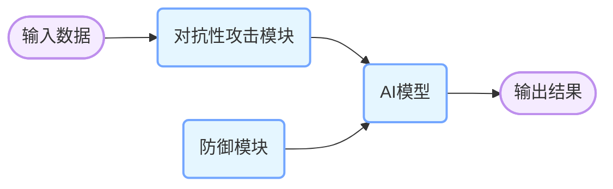

# AI安全性:防御对抗性攻击的新方法

> 关键词：AI安全性、对抗性攻击、防御方法、机器学习、深度学习、鲁棒性、对抗训练

> 摘要：本文聚焦于AI安全性中防御对抗性攻击的新方法。随着人工智能在各个领域的广泛应用，其面临的对抗性攻击威胁日益凸显。文章首先介绍了研究的背景、目的、预期读者和文档结构，对相关术语进行了清晰定义。接着阐述了对抗性攻击和防御的核心概念及联系，通过文本示意图和Mermaid流程图进行直观展示。详细讲解了核心算法原理，结合Python代码进行具体操作步骤的说明，并给出了数学模型和公式。通过项目实战，展示了代码的实际案例和详细解释。分析了实际应用场景，推荐了学习资源、开发工具框架以及相关论文著作。最后总结了未来发展趋势与挑战，解答了常见问题并提供了扩展阅读和参考资料，旨在为提升AI系统的安全性提供全面的指导。

## 1. 背景介绍 
### 1.1 目的和范围
随着人工智能技术的飞速发展，尤其是深度学习在图像识别、自然语言处理、自动驾驶等领域取得了显著的成果。然而，AI系统的安全性问题也逐渐浮出水面，其中对抗性攻击成为了一个严重的威胁。对抗性攻击是指攻击者通过在原始输入数据上添加微小的、人眼难以察觉的扰动，使得AI模型做出错误的决策。这种攻击不仅会影响AI系统的正常运行，还可能在一些关键领域（如医疗诊断、金融交易、自动驾驶等）造成严重的后果。

本文的目的在于深入探讨防御对抗性攻击的新方法，通过介绍相关的核心概念、算法原理、数学模型以及实际应用案例，为研究人员和开发者提供全面的技术指导，提高AI系统的鲁棒性和安全性。文章的范围涵盖了常见的对抗性攻击类型、主流的防御策略、相关的代码实现以及实际应用场景的分析。

### 1.2 预期读者
本文的预期读者主要包括以下几类人群：
- **人工智能研究人员**：对AI安全性和对抗性攻击感兴趣的科研人员，希望通过本文了解最新的防御方法和研究动态，为进一步的研究提供思路。
- **机器学习和深度学习开发者**：在实际项目中需要构建安全可靠的AI系统的开发者，能够从本文中获取实用的技术方案和代码示例，提升自己的开发能力。
- **计算机科学专业的学生**：正在学习人工智能、机器学习等相关课程的学生，通过阅读本文可以加深对AI安全性的理解，拓宽自己的知识面。
- **企业技术决策者**：负责企业AI项目规划和安全评估的决策者，能够从本文中了解对抗性攻击的风险和防御措施，为企业的技术战略提供参考。

### 1.3 文档结构概述
本文将按照以下结构进行组织：
- **核心概念与联系**：介绍对抗性攻击和防御的核心概念，通过文本示意图和Mermaid流程图展示它们之间的关系。
- **核心算法原理 & 具体操作步骤**：详细讲解防御对抗性攻击的核心算法原理，并使用Python代码进行具体操作步骤的说明。
- **数学模型和公式 & 详细讲解 & 举例说明**：给出防御方法的数学模型和公式，并通过具体的例子进行详细讲解。
- **项目实战：代码实际案例和详细解释说明**：通过一个实际的项目案例，展示如何在实际开发中应用防御方法，包括开发环境搭建、源代码实现和代码解读。
- **实际应用场景**：分析防御对抗性攻击在不同领域的实际应用场景。
- **工具和资源推荐**：推荐学习资源、开发工具框架以及相关论文著作。
- **总结：未来发展趋势与挑战**：总结防御对抗性攻击的未来发展趋势和面临的挑战。
- **附录：常见问题与解答**：解答读者在阅读过程中可能遇到的常见问题。
- **扩展阅读 & 参考资料**：提供相关的扩展阅读材料和参考资料，方便读者进一步深入学习。

### 1.4 术语表
#### 1.4.1 核心术语定义
- **对抗性攻击（Adversarial Attack）**：攻击者通过在原始输入数据上添加微小的、精心设计的扰动，使得AI模型做出错误的决策。这种扰动通常是人类难以察觉的，但对模型的输出结果有显著影响。
- **对抗性样本（Adversarial Example）**：经过对抗性攻击处理后的输入数据，包含了攻击者添加的扰动。
- **防御方法（Defense Method）**：用于抵御对抗性攻击的技术和策略，旨在提高AI模型的鲁棒性和安全性。
- **鲁棒性（Robustness）**：AI模型在面对对抗性攻击和其他干扰时，仍能保持正确决策的能力。
- **对抗训练（Adversarial Training）**：一种防御方法，通过在训练过程中引入对抗性样本，使模型学习到对扰动的鲁棒性。

#### 1.4.2 相关概念解释
- **梯度（Gradient）**：在机器学习中，梯度是函数的导数，用于表示函数在某一点的变化率。在对抗性攻击中，攻击者通常会利用模型的梯度信息来生成对抗性扰动。
- **损失函数（Loss Function）**：用于衡量模型预测结果与真实标签之间的差异。在训练过程中，模型的目标是最小化损失函数的值。
- **过拟合（Overfitting）**：模型在训练数据上表现良好，但在测试数据上表现不佳的现象。在防御对抗性攻击时，需要避免模型过拟合对抗性样本，导致在正常数据上的性能下降。

#### 1.4.3 缩略词列表
- **AI：Artificial Intelligence，人工智能**
- **ML：Machine Learning，机器学习**
- **DL：Deep Learning，深度学习**
- **FGSM：Fast Gradient Sign Method，快速梯度符号法**
- **PGD：Projected Gradient Descent，投影梯度下降法**

## 2. 核心概念与联系 
### 核心概念原理
#### 对抗性攻击原理
对抗性攻击的核心思想是利用AI模型的脆弱性，通过在原始输入数据上添加微小的扰动，使得模型的决策发生改变。这种扰动通常是基于模型的梯度信息生成的，因为梯度可以指示模型在输入数据上的变化方向。例如，在图像识别任务中，攻击者可以通过计算图像在模型输出上的梯度，然后沿着梯度的方向添加微小的扰动，使得图像被错误分类。

#### 防御方法原理
防御方法的目标是提高AI模型的鲁棒性，使其能够抵御对抗性攻击。常见的防御方法包括对抗训练、模型蒸馏、输入预处理等。对抗训练是一种通过在训练过程中引入对抗性样本，使模型学习到对扰动的鲁棒性的方法。模型蒸馏则是通过将一个复杂的模型的知识转移到一个简单的模型中，提高简单模型的鲁棒性。输入预处理是指在输入数据进入模型之前，对其进行一些处理，如平滑、滤波等，以减少对抗性扰动的影响。

### 架构的文本示意图
以下是对抗性攻击和防御的架构示意图：

- **输入数据**：原始的输入数据，如图片、文本等。
- **对抗性攻击模块**：攻击者利用模型的梯度信息，在输入数据上添加微小的扰动，生成对抗性样本。
- **AI模型**：接受输入数据或对抗性样本，进行预测和决策。
- **防御模块**：采用各种防御方法，如对抗训练、模型蒸馏等，提高模型的鲁棒性。
- **输出结果**：模型的预测结果，可能是正确的分类标签，也可能是错误的分类标签，取决于是否受到对抗性攻击以及防御方法的有效性。

### Mermaid流程图


## 3. 核心算法原理 & 具体操作步骤 
### 快速梯度符号法（FGSM）攻击原理
FGSM是一种简单而有效的对抗性攻击方法，其核心思想是通过计算输入数据在损失函数上的梯度，然后沿着梯度的符号方向添加一个微小的扰动，生成对抗性样本。具体步骤如下：
1. 定义损失函数 $L(\theta, x, y)$，其中 $\theta$ 是模型的参数，$x$ 是输入数据，$y$ 是真实标签。
2. 计算输入数据 $x$ 在损失函数上的梯度 $\nabla_x L(\theta, x, y)$。
3. 生成对抗性扰动 $\delta = \epsilon \cdot \text{sign}(\nabla_x L(\theta, x, y))$，其中 $\epsilon$ 是扰动的强度。
4. 生成对抗性样本 $x_{adv} = x + \delta$。

### Python代码实现
```python
import torch
import torch.nn as nn
import torch.optim as optim
from torchvision import datasets, transforms

# 定义一个简单的卷积神经网络
class SimpleCNN(nn.Module):
    def __init__(self):
        super(SimpleCNN, self).__init__()
        self.conv1 = nn.Conv2d(1, 10, kernel_size=5)
        self.conv2 = nn.Conv2d(10, 20, kernel_size=5)
        self.fc1 = nn.Linear(320, 50)
        self.fc2 = nn.Linear(50, 10)

    def forward(self, x):
        x = nn.functional.relu(nn.functional.max_pool2d(self.conv1(x), 2))
        x = nn.functional.relu(nn.functional.max_pool2d(self.conv2(x), 2))
        x = x.view(-1, 320)
        x = nn.functional.relu(self.fc1(x))
        x = self.fc2(x)
        return nn.functional.log_softmax(x, dim=1)

# 加载MNIST数据集
train_dataset = datasets.MNIST(root='./data', train=True, transform=transforms.ToTensor(), download=True)
train_loader = torch.utils.data.DataLoader(train_dataset, batch_size=64, shuffle=True)

test_dataset = datasets.MNIST(root='./data', train=False, transform=transforms.ToTensor())
test_loader = torch.utils.data.DataLoader(test_dataset, batch_size=64, shuffle=False)

# 初始化模型、损失函数和优化器
model = SimpleCNN()
criterion = nn.NLLLoss()
optimizer = optim.SGD(model.parameters(), lr=0.01, momentum=0.5)

# 训练模型
def train(model, train_loader, optimizer, epoch):
    model.train()
    for batch_idx, (data, target) in enumerate(train_loader):
        optimizer.zero_grad()
        output = model(data)
        loss = criterion(output, target)
        loss.backward()
        optimizer.step()
        if batch_idx % 100 == 0:
            print('Train Epoch: {} [{}/{} ({:.0f}%)]\tLoss: {:.6f}'.format(
                epoch, batch_idx * len(data), len(train_loader.dataset),
                100. * batch_idx / len(train_loader), loss.item()))

# 测试模型
def test(model, test_loader):
    model.eval()
    test_loss = 0
    correct = 0
    with torch.no_grad():
        for data, target in test_loader:
            output = model(data)
            test_loss += criterion(output, target).item()
            pred = output.argmax(dim=1, keepdim=True)
            correct += pred.eq(target.view_as(pred)).sum().item()

    test_loss /= len(test_loader.dataset)
    print('\nTest set: Average loss: {:.4f}, Accuracy: {}/{} ({:.0f}%)\n'.format(
        test_loss, correct, len(test_loader.dataset),
        100. * correct / len(test_loader.dataset)))

# 训练模型
for epoch in range(1, 5):
    train(model, train_loader, optimizer, epoch)
    test(model, test_loader)

# FGSM攻击函数
def fgsm_attack(image, epsilon, data_grad):
    sign_data_grad = data_grad.sign()
    perturbed_image = image + epsilon * sign_data_grad
    perturbed_image = torch.clamp(perturbed_image, 0, 1)
    return perturbed_image

# 测试FGSM攻击
def test_fgsm(model, test_loader, epsilon):
    correct = 0
    adv_examples = []

    for data, target in test_loader:
        data.requires_grad = True
        output = model(data)
        init_pred = output.argmax(dim=1, keepdim=True)

        if init_pred.item() != target.item():
            continue

        loss = criterion(output, target)
        model.zero_grad()
        loss.backward()
        data_grad = data.grad.data

        perturbed_data = fgsm_attack(data, epsilon, data_grad)
        output = model(perturbed_data)
        final_pred = output.argmax(dim=1, keepdim=True)

        if final_pred.item() == target.item():
            correct += 1
            if (epsilon == 0) and (len(adv_examples) < 5):
                adv_ex = perturbed_data.squeeze().detach().cpu().numpy()
                adv_examples.append((init_pred.item(), final_pred.item(), adv_ex))
        else:
            if len(adv_examples) < 5:
                adv_ex = perturbed_data.squeeze().detach().cpu().numpy()
                adv_examples.append((init_pred.item(), final_pred.item(), adv_ex))

    final_acc = correct / float(len(test_loader))
    print("Epsilon: {}\tTest Accuracy = {} / {} = {:.2f}%".format(epsilon, correct, len(test_loader), 100. * final_acc))

    return final_acc, adv_examples

# 测试不同epsilon值下的FGSM攻击
epsilons = [0, .05, .1, .15, .2, .25, .3]
accuracies = []
examples = []

for eps in epsilons:
    acc, ex = test_fgsm(model, test_loader, eps)
    accuracies.append(acc)
    examples.append(ex)
```

### 代码解释
1. **模型定义**：定义了一个简单的卷积神经网络 `SimpleCNN`，用于MNIST手写数字识别任务。
2. **数据加载**：使用 `torchvision` 加载MNIST数据集，并将其分为训练集和测试集。
3. **模型训练**：使用随机梯度下降（SGD）优化器和负对数似然损失函数（NLLLoss）对模型进行训练。
4. **FGSM攻击函数**：定义了 `fgsm_attack` 函数，用于生成对抗性样本。
5. **测试FGSM攻击**：定义了 `test_fgsm` 函数，用于测试不同 `epsilon` 值下的FGSM攻击效果。
6. **实验结果**：测试不同 `epsilon` 值下的FGSM攻击准确率，并记录一些对抗性样本。

## 4. 数学模型和公式 & 详细讲解 & 举例说明 
### FGSM攻击的数学模型
FGSM攻击的目标是找到一个对抗性样本 $x_{adv}$，使得模型对其的预测结果与真实标签不同。具体来说，FGSM攻击通过以下公式生成对抗性样本：

$$x_{adv} = x + \epsilon \cdot \text{sign}(\nabla_x L(\theta, x, y))$$

其中，$x$ 是原始输入数据，$\epsilon$ 是扰动的强度，$\nabla_x L(\theta, x, y)$ 是输入数据 $x$ 在损失函数 $L(\theta, x, y)$ 上的梯度，$\text{sign}$ 是符号函数。

### 详细讲解
- **梯度计算**：梯度 $\nabla_x L(\theta, x, y)$ 表示损失函数 $L$ 关于输入数据 $x$ 的变化率。在神经网络中，梯度可以通过反向传播算法计算得到。
- **符号函数**：符号函数 $\text{sign}$ 用于将梯度的每个元素转换为其符号（正、负或零）。这样做的目的是为了在每个维度上都添加一个相同方向的扰动，以最大化损失函数的变化。
- **扰动强度**：$\epsilon$ 控制了扰动的大小。$\epsilon$ 越大，对抗性样本与原始输入数据的差异就越大，模型被攻击的可能性也就越高。

### 举例说明
假设我们有一个简单的线性模型 $f(x) = w^T x + b$，其中 $w$ 是权重向量，$b$ 是偏置项。损失函数为交叉熵损失 $L(y, \hat{y}) = - \sum_{i=1}^{n} y_i \log(\hat{y}_i)$，其中 $y$ 是真实标签，$\hat{y}$ 是模型的预测结果。

给定一个输入数据 $x$ 和真实标签 $y$，我们可以计算输入数据 $x$ 在损失函数上的梯度 $\nabla_x L(\theta, x, y)$。假设梯度为 $\nabla_x L(\theta, x, y) = [0.1, -0.2, 0.3]$，扰动强度 $\epsilon = 0.1$。则对抗性扰动为：

$$\delta = \epsilon \cdot \text{sign}(\nabla_x L(\theta, x, y)) = 0.1 \cdot [\text{sign}(0.1), \text{sign}(-0.2), \text{sign}(0.3)] = [0.1, -0.1, 0.1]$$

对抗性样本为：

$$x_{adv} = x + \delta$$

## 5. 项目实战：代码实际案例和详细解释说明 
### 5.1  开发环境搭建
#### 安装Python
首先，需要安装Python 3.x版本。可以从Python官方网站（https://www.python.org/downloads/）下载适合自己操作系统的安装包，并按照安装向导进行安装。

#### 安装深度学习框架
本项目使用PyTorch作为深度学习框架。可以使用以下命令安装PyTorch：
```bash
pip install torch torchvision
```

#### 安装其他依赖库
还需要安装一些其他的依赖库，如 `numpy`、`matplotlib` 等。可以使用以下命令安装：
```bash
pip install numpy matplotlib
```

### 5.2  源代码详细实现和代码解读
以下是一个完整的项目实战代码，包括模型训练、FGSM攻击和对抗训练的实现：

```python
import torch
import torch.nn as nn
import torch.optim as optim
from torchvision import datasets, transforms
import matplotlib.pyplot as plt

# 定义一个简单的卷积神经网络
class SimpleCNN(nn.Module):
    def __init__(self):
        super(SimpleCNN, self).__init__()
        self.conv1 = nn.Conv2d(1, 10, kernel_size=5)
        self.conv2 = nn.Conv2d(10, 20, kernel_size=5)
        self.fc1 = nn.Linear(320, 50)
        self.fc2 = nn.Linear(50, 10)

    def forward(self, x):
        x = nn.functional.relu(nn.functional.max_pool2d(self.conv1(x), 2))
        x = nn.functional.relu(nn.functional.max_pool2d(self.conv2(x), 2))
        x = x.view(-1, 320)
        x = nn.functional.relu(self.fc1(x))
        x = self.fc2(x)
        return nn.functional.log_softmax(x, dim=1)

# 加载MNIST数据集
train_dataset = datasets.MNIST(root='./data', train=True, transform=transforms.ToTensor(), download=True)
train_loader = torch.utils.data.DataLoader(train_dataset, batch_size=64, shuffle=True)

test_dataset = datasets.MNIST(root='./data', train=False, transform=transforms.ToTensor())
test_loader = torch.utils.data.DataLoader(test_dataset, batch_size=64, shuffle=False)

# 初始化模型、损失函数和优化器
model = SimpleCNN()
criterion = nn.NLLLoss()
optimizer = optim.SGD(model.parameters(), lr=0.01, momentum=0.5)

# 训练模型
def train(model, train_loader, optimizer, epoch):
    model.train()
    for batch_idx, (data, target) in enumerate(train_loader):
        optimizer.zero_grad()
        output = model(data)
        loss = criterion(output, target)
        loss.backward()
        optimizer.step()
        if batch_idx % 100 == 0:
            print('Train Epoch: {} [{}/{} ({:.0f}%)]\tLoss: {:.6f}'.format(
                epoch, batch_idx * len(data), len(train_loader.dataset),
                100. * batch_idx / len(train_loader), loss.item()))

# 测试模型
def test(model, test_loader):
    model.eval()
    test_loss = 0
    correct = 0
    with torch.no_grad():
        for data, target in test_loader:
            output = model(data)
            test_loss += criterion(output, target).item()
            pred = output.argmax(dim=1, keepdim=True)
            correct += pred.eq(target.view_as(pred)).sum().item()

    test_loss /= len(test_loader.dataset)
    print('\nTest set: Average loss: {:.4f}, Accuracy: {}/{} ({:.0f}%)\n'.format(
        test_loss, correct, len(test_loader.dataset),
        100. * correct / len(test_loader.dataset)))

# FGSM攻击函数
def fgsm_attack(image, epsilon, data_grad):
    sign_data_grad = data_grad.sign()
    perturbed_image = image + epsilon * sign_data_grad
    perturbed_image = torch.clamp(perturbed_image, 0, 1)
    return perturbed_image

# 测试FGSM攻击
def test_fgsm(model, test_loader, epsilon):
    correct = 0
    adv_examples = []

    for data, target in test_loader:
        data.requires_grad = True
        output = model(data)
        init_pred = output.argmax(dim=1, keepdim=True)

        if init_pred.item() != target.item():
            continue

        loss = criterion(output, target)
        model.zero_grad()
        loss.backward()
        data_grad = data.grad.data

        perturbed_data = fgsm_attack(data, epsilon, data_grad)
        output = model(perturbed_data)
        final_pred = output.argmax(dim=1, keepdim=True)

        if final_pred.item() == target.item():
            correct += 1
            if (epsilon == 0) and (len(adv_examples) < 5):
                adv_ex = perturbed_data.squeeze().detach().cpu().numpy()
                adv_examples.append((init_pred.item(), final_pred.item(), adv_ex))
        else:
            if len(adv_examples) < 5:
                adv_ex = perturbed_data.squeeze().detach().cpu().numpy()
                adv_examples.append((init_pred.item(), final_pred.item(), adv_ex))

    final_acc = correct / float(len(test_loader))
    print("Epsilon: {}\tTest Accuracy = {} / {} = {:.2f}%".format(epsilon, correct, len(test_loader), 100. * final_acc))

    return final_acc, adv_examples

# 对抗训练
def adversarial_train(model, train_loader, optimizer, epoch, epsilon):
    model.train()
    for batch_idx, (data, target) in enumerate(train_loader):
        data.requires_grad = True
        output = model(data)
        loss = criterion(output, target)
        model.zero_grad()
        loss.backward()
        data_grad = data.grad.data

        perturbed_data = fgsm_attack(data, epsilon, data_grad)
        output_adv = model(perturbed_data)
        loss_adv = criterion(output_adv, target)

        total_loss = loss + loss_adv
        optimizer.zero_grad()
        total_loss.backward()
        optimizer.step()

        if batch_idx % 100 == 0:
            print('Adversarial Train Epoch: {} [{}/{} ({:.0f}%)]\tLoss: {:.6f}'.format(
                epoch, batch_idx * len(data), len(train_loader.dataset),
                100. * batch_idx / len(train_loader), total_loss.item()))

# 训练模型
for epoch in range(1, 5):
    train(model, train_loader, optimizer, epoch)
    test(model, test_loader)

# 测试不同epsilon值下的FGSM攻击
epsilons = [0, .05, .1, .15, .2, .25, .3]
accuracies = []
examples = []

for eps in epsilons:
    acc, ex = test_fgsm(model, test_loader, eps)
    accuracies.append(acc)
    examples.append(ex)

# 绘制攻击准确率曲线
plt.figure(figsize=(5, 5))
plt.plot(epsilons, accuracies, "*-")
plt.yticks(np.arange(0, 1.1, step=0.1))
plt.xticks(np.arange(0, .35, step=0.05))
plt.title("Accuracy vs Epsilon")
plt.xlabel("Epsilon")
plt.ylabel("Accuracy")
plt.show()

# 对抗训练
adversarial_model = SimpleCNN()
adversarial_optimizer = optim.SGD(adversarial_model.parameters(), lr=0.01, momentum=0.5)
epsilon = 0.1

for epoch in range(1, 5):
    adversarial_train(adversarial_model, train_loader, adversarial_optimizer, epoch, epsilon)
    test(adversarial_model, test_loader)

# 测试对抗训练后的模型在FGSM攻击下的性能
accuracies_adv = []
examples_adv = []

for eps in epsilons:
    acc, ex = test_fgsm(adversarial_model, test_loader, eps)
    accuracies_adv.append(acc)
    examples_adv.append(ex)

# 绘制对抗训练前后的攻击准确率曲线
plt.figure(figsize=(5, 5))
plt.plot(epsilons, accuracies, "*-", label="Before Adversarial Training")
plt.plot(epsilons, accuracies_adv, "*-", label="After Adversarial Training")
plt.yticks(np.arange(0, 1.1, step=0.1))
plt.xticks(np.arange(0, .35, step=0.05))
plt.title("Accuracy vs Epsilon")
plt.xlabel("Epsilon")
plt.ylabel("Accuracy")
plt.legend()
plt.show()
```

### 5.3  代码解读与分析
#### 模型定义
定义了一个简单的卷积神经网络 `SimpleCNN`，用于MNIST手写数字识别任务。该网络包含两个卷积层和两个全连接层。

#### 数据加载
使用 `torchvision` 加载MNIST数据集，并将其分为训练集和测试集。

#### 模型训练
使用随机梯度下降（SGD）优化器和负对数似然损失函数（NLLLoss）对模型进行训练。

#### FGSM攻击
定义了 `fgsm_attack` 函数，用于生成对抗性样本。在 `test_fgsm` 函数中，测试了不同 `epsilon` 值下的FGSM攻击效果，并记录了一些对抗性样本。

#### 对抗训练
定义了 `adversarial_train` 函数，用于进行对抗训练。在对抗训练过程中，模型不仅学习了正常样本，还学习了对抗性样本，从而提高了模型的鲁棒性。

#### 实验结果分析
通过绘制攻击准确率曲线，可以直观地看到不同 `epsilon` 值下的攻击效果。同时，对比对抗训练前后的攻击准确率曲线，可以看到对抗训练对提高模型鲁棒性的效果。

## 6. 实际应用场景 
### 图像识别
在图像识别领域，对抗性攻击可能会导致人脸识别系统误识身份、自动驾驶系统误判交通标志等问题。防御对抗性攻击的方法可以提高图像识别系统的安全性和可靠性。例如，在人脸识别系统中，通过对抗训练可以使模型对人脸图像上的微小扰动具有鲁棒性，从而避免被攻击者利用。

### 自然语言处理
在自然语言处理领域，对抗性攻击可能会导致文本分类系统误分类、机器翻译系统输出错误的翻译结果等问题。防御方法可以提高自然语言处理系统的鲁棒性。例如，在文本分类任务中，通过输入预处理和模型蒸馏等方法，可以减少对抗性扰动对分类结果的影响。

### 医疗诊断
在医疗诊断领域，AI系统的安全性至关重要。对抗性攻击可能会导致医疗诊断系统误判病情，给患者带来严重的后果。防御对抗性攻击的方法可以提高医疗诊断系统的可靠性。例如，在医学图像诊断中，通过对抗训练和模型融合等方法，可以提高模型对医学图像上的微小扰动的鲁棒性，从而避免误判病情。

### 金融交易
在金融交易领域，AI系统用于风险评估、欺诈检测等任务。对抗性攻击可能会导致金融交易系统误判风险、放过欺诈行为等问题。防御方法可以提高金融交易系统的安全性。例如，在欺诈检测系统中，通过输入过滤和模型监控等方法，可以减少对抗性扰动对检测结果的影响。

## 7. 工具和资源推荐
### 7.1 学习资源推荐
#### 7.1.1 书籍推荐
- 《深度学习》（Deep Learning）：由Ian Goodfellow、Yoshua Bengio和Aaron Courville合著，是深度学习领域的经典教材，涵盖了深度学习的基本原理、算法和应用。
- 《Python深度学习》（Deep Learning with Python）：由Francois Chollet（Keras库的作者）撰写，通过Python代码和实际案例介绍了深度学习的应用。
- 《对抗机器学习》（Adversarial Machine Learning）：由Hao Chen和Xiaojin Zhu编辑，全面介绍了对抗机器学习的理论、算法和应用。

#### 7.1.2 在线课程
- Coursera上的“深度学习专项课程”（Deep Learning Specialization）：由Andrew Ng教授讲授，包括深度学习基础、卷积神经网络、循环神经网络等内容。
- edX上的“人工智能基础”（Introduction to Artificial Intelligence）：由麻省理工学院（MIT）的教师讲授，介绍了人工智能的基本概念、算法和应用。
- Udemy上的“对抗机器学习实战”（Practical Adversarial Machine Learning）：通过实际案例介绍了对抗机器学习的应用和防御方法。

#### 7.1.3 技术博客和网站
- Medium上的“Towards Data Science”：是一个专注于数据科学和机器学习的技术博客，发布了很多关于对抗机器学习的文章。
- arXiv.org：是一个预印本服务器，提供了大量关于对抗机器学习的研究论文。
- OpenAI的官方网站：提供了很多关于人工智能和对抗机器学习的研究成果和技术博客。

### 7.2 开发工具框架推荐
#### 7.2.1 IDE和编辑器
- PyCharm：是一款专门为Python开发设计的集成开发环境（IDE），提供了丰富的代码编辑、调试和项目管理功能。
- Jupyter Notebook：是一个基于Web的交互式计算环境，适合进行数据分析、机器学习实验和代码演示。
- Visual Studio Code：是一款轻量级的代码编辑器，支持多种编程语言和插件，具有强大的代码编辑和调试功能。

#### 7.2.2 调试和性能分析工具
- PyTorch Profiler：是PyTorch提供的性能分析工具，可以帮助开发者分析模型的运行时间、内存使用等性能指标。
- TensorBoard：是TensorFlow提供的可视化工具，可以帮助开发者可视化模型的训练过程、损失函数曲线等。
- NVIDIA Nsight Systems：是一款用于GPU性能分析的工具，可以帮助开发者分析GPU的使用情况和性能瓶颈。

#### 7.2.3 相关框架和库
- PyTorch：是一个开源的深度学习框架，提供了丰富的神经网络层、优化器和损失函数，支持GPU加速。
- TensorFlow：是一个开源的深度学习框架，由Google开发，提供了高效的分布式训练和部署功能。
- Adversarial Robustness Toolbox（ART）：是一个开源的对抗机器学习工具包，提供了多种对抗性攻击和防御方法的实现。

### 7.3 相关论文著作推荐
#### 7.3.1 经典论文
- “Explaining and Harnessing Adversarial Examples”：由Ian Goodfellow等人发表，首次提出了快速梯度符号法（FGSM），开启了对抗机器学习的研究热潮。
- “Towards Deep Learning Models Resistant to Adversarial Attacks”：由Aleksander Madry等人发表，提出了投影梯度下降法（PGD）和对抗训练的方法，提高了模型的鲁棒性。
- “Adversarial Attacks and Defenses in Images, Graphs and Text”：由Hao Chen和Xiaojin Zhu编辑的论文集，全面介绍了对抗机器学习在图像、图和文本领域的研究进展。

#### 7.3.2 最新研究成果
- 关注arXiv.org上的最新研究论文，了解对抗机器学习领域的最新研究动态。
- 参加相关的学术会议，如NeurIPS、ICML、CVPR等，了解最新的研究成果和技术趋势。

#### 7.3.3 应用案例分析
- 研究一些实际应用中的对抗性攻击案例，如人脸识别系统的攻击、自动驾驶系统的攻击等，了解对抗性攻击的实际影响和防御方法。
- 分析一些成功的防御对抗性攻击的应用案例，如金融交易系统的安全防护、医疗诊断系统的可靠性提升等，学习实际应用中的经验和方法。

## 8. 总结：未来发展趋势与挑战
### 未来发展趋势
#### 多模态对抗性攻击和防御
随着人工智能技术的发展，多模态数据（如图像、文本、音频等）的应用越来越广泛。未来的研究将关注多模态对抗性攻击和防御方法，提高AI系统在多模态数据下的安全性。

#### 自适应对抗性攻击和防御
攻击者可能会不断调整攻击策略，以绕过现有的防御方法。未来的防御方法需要具备自适应能力，能够实时检测和应对新的攻击策略。

#### 硬件级防御
目前的防御方法主要集中在软件层面，未来的研究可能会探索硬件级的防御方法，如设计具有抗攻击能力的芯片和硬件架构。

#### 与其他安全技术的融合
将对抗性防御技术与其他安全技术（如加密技术、访问控制技术等）相结合，构建更加全面的AI安全体系。

### 挑战
#### 攻击和防御的不平衡
目前，对抗性攻击的研究相对较为成熟，而防御方法的效果仍然有限。攻击者可以不断提出新的攻击策略，而防御者需要不断跟进和改进防御方法，这导致了攻击和防御之间的不平衡。

#### 模型的复杂性和可解释性
随着深度学习模型的不断发展，模型的复杂性越来越高，这使得模型的可解释性变得困难。在防御对抗性攻击时，需要理解模型的决策过程，以便设计有效的防御方法。然而，复杂模型的可解释性问题给防御带来了挑战。

#### 数据的多样性和隐私性
在实际应用中，数据具有多样性和隐私性。防御方法需要在保证数据隐私的前提下，处理各种类型的数据，这增加了防御的难度。

#### 计算资源的限制
一些防御方法需要大量的计算资源，如对抗训练需要多次迭代和大量的样本。在实际应用中，计算资源的限制可能会影响防御方法的有效性和实用性。

## 9. 附录：常见问题与解答
### 什么是对抗性攻击？
对抗性攻击是指攻击者通过在原始输入数据上添加微小的、精心设计的扰动，使得AI模型做出错误的决策。这种扰动通常是人类难以察觉的，但对模型的输出结果有显著影响。

### 对抗性攻击有哪些类型？
常见的对抗性攻击类型包括快速梯度符号法（FGSM）、投影梯度下降法（PGD）、迭代最小二乘法（ILCM）等。这些攻击方法可以根据不同的目标和约束条件进行分类。

### 如何防御对抗性攻击？
常见的防御方法包括对抗训练、模型蒸馏、输入预处理等。对抗训练是一种通过在训练过程中引入对抗性样本，使模型学习到对扰动的鲁棒性的方法。模型蒸馏则是通过将一个复杂的模型的知识转移到一个简单的模型中，提高简单模型的鲁棒性。输入预处理是指在输入数据进入模型之前，对其进行一些处理，如平滑、滤波等，以减少对抗性扰动的影响。

### 对抗训练会影响模型在正常数据上的性能吗？
在一定程度上，对抗训练可能会影响模型在正常数据上的性能。因为对抗训练引入了对抗性样本，模型需要学习对这些样本的鲁棒性，这可能会导致模型在正常数据上的性能略有下降。然而，通过合理调整训练参数和策略，可以在保证模型鲁棒性的同时，尽量减少对正常数据性能的影响。

### 如何评估防御方法的有效性？
可以通过以下指标评估防御方法的有效性：
- **攻击准确率**：在对抗性攻击下，模型的分类准确率。攻击准确率越低，说明防御方法越有效。
- **鲁棒性指标**：如最小扰动强度、最大容忍扰动等，用于衡量模型对不同强度扰动的鲁棒性。
- **正常数据性能**：在正常数据上，模型的分类准确率。防御方法应该在保证鲁棒性的同时，尽量不影响模型在正常数据上的性能。

## 10. 扩展阅读 & 参考资料
### 扩展阅读
- Goodfellow, I. J., Shlens, J., & Szegedy, C. (2014). Explaining and harnessing adversarial examples. arXiv preprint arXiv:1412.6572.
- Madry, A., Makelov, A., Schmidt, L., Tsipras, D., & Vladu, A. (2017). Towards deep learning models resistant to adversarial attacks. arXiv preprint arXiv:1706.06083.
- Chen, H., & Zhu, X. (Eds.). (2018). Adversarial Attacks and Defenses in Images, Graphs and Text. Springer.

### 参考资料
- PyTorch官方文档：https://pytorch.org/docs/stable/index.html
- TensorFlow官方文档：https://www.tensorflow.org/api_docs
- Adversarial Robustness Toolbox（ART）官方文档：https://adversarial-robustness-toolbox.readthedocs.io/en/latest/