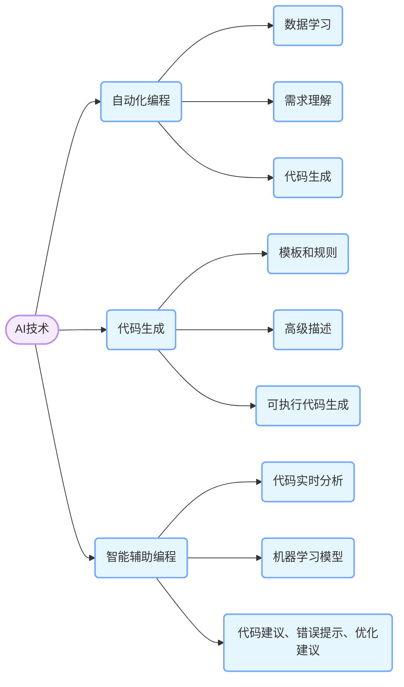

# AI技术助力下的编程职业新机遇

> 关键词：AI技术、编程职业、新机遇、自动化编程、代码生成、智能辅助编程

> 摘要：本文深入探讨了AI技术为编程职业带来的新机遇。首先介绍了文章的背景、目的、预期读者和文档结构，对相关术语进行了定义和解释。接着阐述了AI与编程相关的核心概念及其联系，通过文本示意图和Mermaid流程图进行展示。详细讲解了核心算法原理和具体操作步骤，并给出Python源代码示例。分析了相关的数学模型和公式，并举例说明。通过项目实战，展示了开发环境搭建、源代码实现及代码解读。列举了AI技术在编程领域的实际应用场景，推荐了学习资源、开发工具框架和相关论文著作。最后总结了编程职业在AI技术助力下的未来发展趋势与挑战，提供了常见问题解答和扩展阅读参考资料。

## 1. 背景介绍 
### 1.1 目的和范围
在当今科技飞速发展的时代，AI技术正以前所未有的速度改变着各个行业，编程领域也不例外。本文的目的在于全面探讨AI技术为编程职业带来的新机遇，分析其背后的原理和应用场景，帮助程序员和相关从业者更好地理解和把握这些机遇，提升自身的职业竞争力。文章的范围涵盖了AI技术在编程领域的多个方面，包括自动化编程、代码生成、智能辅助编程等，同时也涉及到相关的算法原理、数学模型、实际应用案例以及未来发展趋势等内容。

### 1.2 预期读者
本文的预期读者主要包括以下几类人群：
- 程序员和软件开发人员：希望了解AI技术如何为编程工作带来便利和新的发展方向，提升自己的编程技能和效率。
- 计算机科学专业的学生：对编程和AI技术感兴趣，希望通过本文了解行业的最新动态和发展趋势，为未来的职业规划提供参考。
- 技术管理者和决策者：需要了解AI技术在编程领域的应用潜力和价值，以便在企业的技术战略和人才培养方面做出明智的决策。
- 对科技发展感兴趣的普通读者：希望通过本文了解AI技术与编程职业的结合，拓宽自己的科技视野。

### 1.3 文档结构概述
本文将按照以下结构进行组织：
- 核心概念与联系：介绍AI技术在编程领域的核心概念，如自动化编程、代码生成、智能辅助编程等，并阐述它们之间的联系，通过文本示意图和Mermaid流程图进行直观展示。
- 核心算法原理 & 具体操作步骤：详细讲解AI技术在编程中应用的核心算法原理，如深度学习中的神经网络算法，并给出具体的操作步骤，同时使用Python源代码进行示例说明。
- 数学模型和公式 & 详细讲解 & 举例说明：分析AI技术在编程中涉及的数学模型和公式，如损失函数、优化算法等，并进行详细讲解，通过具体的例子帮助读者理解。
- 项目实战：通过一个实际的项目案例，展示如何利用AI技术进行编程开发，包括开发环境搭建、源代码详细实现和代码解读。
- 实际应用场景：列举AI技术在编程领域的实际应用场景，如代码自动补全、代码审查、软件测试等，分析其应用效果和优势。
- 工具和资源推荐：推荐学习AI编程的相关资源，包括书籍、在线课程、技术博客和网站等，同时介绍开发工具框架，如IDE和编辑器、调试和性能分析工具、相关框架和库等，以及相关的论文著作。
- 总结：未来发展趋势与挑战：总结AI技术为编程职业带来的新机遇，分析未来的发展趋势，并探讨可能面临的挑战。
- 附录：常见问题与解答：提供一些常见问题的解答，帮助读者更好地理解文章内容。
- 扩展阅读 & 参考资料：列出相关的扩展阅读资料和参考书目，方便读者进一步深入学习。

### 1.4 术语表
#### 1.4.1 核心术语定义
- **AI技术（Artificial Intelligence Technology）**：指让计算机模拟人类智能的技术，包括机器学习、深度学习、自然语言处理等多个领域。
- **自动化编程（Automated Programming）**：利用AI技术自动生成代码的过程，减少人工编写代码的工作量。
- **代码生成（Code Generation）**：通过特定的算法和规则，将高级描述转化为可执行代码的过程。
- **智能辅助编程（Intelligent Programming Assistance）**：利用AI技术为程序员提供实时的代码建议、错误提示、代码优化等辅助功能，提高编程效率和质量。
- **深度学习（Deep Learning）**：一种基于人工神经网络的机器学习技术，通过多层神经网络自动学习数据的特征和模式。
- **自然语言处理（Natural Language Processing）**：研究如何让计算机理解和处理人类自然语言的技术，包括文本分类、情感分析、机器翻译等。

#### 1.4.2 相关概念解释
- **机器学习（Machine Learning）**：是AI技术的一个重要分支，它让计算机通过数据学习模式和规律，从而实现预测和决策。机器学习算法可以分为监督学习、无监督学习和强化学习等。
- **神经网络（Neural Network）**：是深度学习的核心模型，由大量的神经元组成，模拟人类大脑的神经系统。神经网络可以自动学习数据的特征和模式，在图像识别、语音识别、自然语言处理等领域取得了显著的成果。
- **损失函数（Loss Function）**：用于衡量模型预测结果与真实结果之间的差异，是训练模型的重要指标。常见的损失函数包括均方误差、交叉熵损失等。
- **优化算法（Optimization Algorithm）**：用于更新模型的参数，使得损失函数的值最小化。常见的优化算法包括随机梯度下降、Adam等。

#### 1.4.3 缩略词列表
- **AI**：Artificial Intelligence（人工智能）
- **ML**：Machine Learning（机器学习）
- **DL**：Deep Learning（深度学习）
- **NLP**：Natural Language Processing（自然语言处理）
- **SGD**：Stochastic Gradient Descent（随机梯度下降）

## 2. 核心概念与联系 

### 核心概念原理
#### 自动化编程
自动化编程是指利用AI技术自动生成代码的过程。其原理是通过对大量代码数据的学习，让AI模型掌握代码的语法、结构和语义信息。当接收到用户的需求描述时，模型可以根据所学的知识生成相应的代码。例如，在软件开发中，对于一些常见的功能模块，如数据库连接、文件读写等，自动化编程系统可以快速生成代码，减少程序员的重复劳动。

#### 代码生成
代码生成是自动化编程的一个重要环节。它通常基于模板和规则，将高级描述转化为可执行代码。代码生成器可以根据不同的编程语言和开发框架，生成符合要求的代码。例如，在Web开发中，根据数据库设计文档和业务需求，代码生成器可以自动生成数据库访问层、业务逻辑层和表现层的代码。

#### 智能辅助编程
智能辅助编程利用AI技术为程序员提供实时的代码建议、错误提示、代码优化等辅助功能。其原理是通过对代码的实时分析和理解，结合机器学习模型，为程序员提供有针对性的建议。例如，当程序员编写代码时，智能辅助编程工具可以根据上下文自动补全代码，提示可能的函数调用和参数，检查代码中的语法错误和逻辑错误，并提供优化建议。

### 架构的文本示意图
```plaintext
AI技术
|
|-- 自动化编程
|   |-- 数据学习（大量代码数据）
|   |-- 需求理解（用户需求描述）
|   |-- 代码生成（根据学习和需求生成代码）
|
|-- 代码生成
|   |-- 模板和规则
|   |-- 高级描述（如数据库设计、业务需求）
|   |-- 可执行代码生成
|
|-- 智能辅助编程
|   |-- 代码实时分析
|   |-- 机器学习模型
|   |-- 代码建议、错误提示、优化建议
```

### Mermaid流程图


## 3. 核心算法原理 & 具体操作步骤 

### 核心算法原理：深度学习中的神经网络算法
深度学习中的神经网络是AI技术在编程领域应用的核心算法之一。以简单的多层感知机（Multilayer Perceptron，MLP）为例，它由输入层、隐藏层和输出层组成。每个神经元接收来自上一层神经元的输入，经过加权求和和激活函数处理后，将输出传递给下一层神经元。

#### 数学模型
假设输入层有 $n$ 个神经元，隐藏层有 $m$ 个神经元，输出层有 $k$ 个神经元。输入向量为 $\mathbf{x} = [x_1, x_2, \cdots, x_n]^T$，隐藏层的权重矩阵为 $\mathbf{W}_1 \in \mathbb{R}^{m \times n}$，偏置向量为 $\mathbf{b}_1 \in \mathbb{R}^{m}$，输出层的权重矩阵为 $\mathbf{W}_2 \in \mathbb{R}^{k \times m}$，偏置向量为 $\mathbf{b}_2 \in \mathbb{R}^{k}$。

隐藏层的输出 $\mathbf{h}$ 可以表示为：
$$
\mathbf{h} = \sigma(\mathbf{W}_1 \mathbf{x} + \mathbf{b}_1)
$$
其中 $\sigma$ 是激活函数，常用的激活函数有Sigmoid函数、ReLU函数等。

输出层的输出 $\mathbf{y}$ 可以表示为：
$$
\mathbf{y} = \sigma(\mathbf{W}_2 \mathbf{h} + \mathbf{b}_2)
$$

#### 训练过程
神经网络的训练过程就是通过调整权重矩阵 $\mathbf{W}_1$、$\mathbf{W}_2$ 和偏置向量 $\mathbf{b}_1$、$\mathbf{b}_2$，使得模型的输出尽可能接近真实标签。常用的训练方法是反向传播算法（Backpropagation），其基本思想是通过计算损失函数对各个参数的梯度，然后使用优化算法更新参数。

### 具体操作步骤
#### 步骤1：数据准备
首先需要准备训练数据，包括输入数据和对应的真实标签。例如，在代码生成任务中，输入数据可以是代码的需求描述，真实标签可以是对应的代码。

#### 步骤2：模型定义
使用深度学习框架（如PyTorch、TensorFlow等）定义神经网络模型。以下是使用PyTorch定义一个简单的多层感知机的代码示例：

```python
import torch
import torch.nn as nn

class MLP(nn.Module):
    def __init__(self, input_size, hidden_size, output_size):
        super(MLP, self).__init__()
        self.fc1 = nn.Linear(input_size, hidden_size)
        self.relu = nn.ReLU()
        self.fc2 = nn.Linear(hidden_size, output_size)

    def forward(self, x):
        out = self.fc1(x)
        out = self.relu(out)
        out = self.fc2(out)
        return out

# 定义模型参数
input_size = 10
hidden_size = 20
output_size = 5

# 创建模型实例
model = MLP(input_size, hidden_size, output_size)
```

#### 步骤3：损失函数和优化器定义
选择合适的损失函数和优化器。在代码生成任务中，常用的损失函数是交叉熵损失（Cross Entropy Loss），常用的优化器是随机梯度下降（SGD）。

```python
# 定义损失函数和优化器
criterion = nn.CrossEntropyLoss()
optimizer = torch.optim.SGD(model.parameters(), lr=0.01)
```

#### 步骤4：模型训练
使用训练数据对模型进行训练，通过多次迭代更新模型的参数。

```python
# 训练数据
inputs = torch.randn(100, input_size)
labels = torch.randint(0, output_size, (100,))

# 训练模型
num_epochs = 100
for epoch in range(num_epochs):
    # 前向传播
    outputs = model(inputs)
    loss = criterion(outputs, labels)

    # 反向传播和优化
    optimizer.zero_grad()
    loss.backward()
    optimizer.step()

    # 打印训练信息
    if (epoch+1) % 10 == 0:
        print(f'Epoch [{epoch+1}/{num_epochs}], Loss: {loss.item():.4f}')
```

#### 步骤5：模型预测
训练完成后，使用训练好的模型进行预测。

```python
# 测试数据
test_inputs = torch.randn(10, input_size)

# 预测
with torch.no_grad():
    predictions = model(test_inputs)
    _, predicted = torch.max(predictions.data, 1)
    print('Predictions:', predicted)
```

## 4. 数学模型和公式 & 详细讲解 & 举例说明 

### 损失函数
#### 均方误差（Mean Squared Error，MSE）
均方误差是一种常用的损失函数，用于衡量模型预测值与真实值之间的平均平方误差。其数学公式为：
$$
MSE = \frac{1}{n} \sum_{i=1}^{n} (y_i - \hat{y}_i)^2
$$
其中 $n$ 是样本数量，$y_i$ 是第 $i$ 个样本的真实值，$\hat{y}_i$ 是第 $i$ 个样本的预测值。

**详细讲解**：均方误差的优点是计算简单，对异常值比较敏感。它适用于回归问题，例如预测房价、股票价格等。

**举例说明**：假设有一组真实值 $y = [1, 2, 3, 4, 5]$ 和一组预测值 $\hat{y} = [1.1, 1.9, 3.2, 3.8, 5.1]$，则均方误差为：
$$
MSE = \frac{1}{5} \times [(1 - 1.1)^2 + (2 - 1.9)^2 + (3 - 3.2)^2 + (4 - 3.8)^2 + (5 - 5.1)^2] = 0.02
$$

#### 交叉熵损失（Cross Entropy Loss）
交叉熵损失常用于分类问题，用于衡量模型预测的概率分布与真实标签的概率分布之间的差异。对于二分类问题，交叉熵损失的数学公式为：
$$
CE = - \frac{1}{n} \sum_{i=1}^{n} [y_i \log(\hat{y}_i) + (1 - y_i) \log(1 - \hat{y}_i)]
$$
其中 $n$ 是样本数量，$y_i$ 是第 $i$ 个样本的真实标签（取值为0或1），$\hat{y}_i$ 是第 $i$ 个样本的预测概率。

**详细讲解**：交叉熵损失的优点是能够有效地区分不同类别的样本，并且在训练过程中能够更快地收敛。它适用于分类问题，例如图像分类、文本分类等。

**举例说明**：假设有一组真实标签 $y = [1, 0, 1, 0]$ 和一组预测概率 $\hat{y} = [0.9, 0.1, 0.8, 0.2]$，则交叉熵损失为：
$$
CE = - \frac{1}{4} \times [1 \times \log(0.9) + (1 - 1) \times \log(1 - 0.9) + 0 \times \log(0.1) + (1 - 0) \times \log(1 - 0.1) + 1 \times \log(0.8) + (1 - 1) \times \log(1 - 0.8) + 0 \times \log(0.2) + (1 - 0) \times \log(1 - 0.2)] \approx 0.16
$$

### 优化算法
#### 随机梯度下降（Stochastic Gradient Descent，SGD）
随机梯度下降是一种常用的优化算法，用于更新模型的参数。其基本思想是每次从训练数据中随机选择一个样本，计算该样本的损失函数对参数的梯度，然后使用梯度更新参数。其数学公式为：
$$
\theta_{t+1} = \theta_t - \eta \nabla L(\theta_t; x_i, y_i)
$$
其中 $\theta_t$ 是第 $t$ 次迭代时的参数，$\eta$ 是学习率，$\nabla L(\theta_t; x_i, y_i)$ 是第 $i$ 个样本的损失函数对参数的梯度。

**详细讲解**：随机梯度下降的优点是计算效率高，能够在大规模数据集上快速收敛。缺点是可能会陷入局部最优解，并且收敛速度可能较慢。

**举例说明**：假设我们有一个简单的线性回归模型 $y = wx + b$，损失函数为均方误差。我们可以使用随机梯度下降来更新参数 $w$ 和 $b$。以下是使用Python实现的代码示例：

```python
import numpy as np

# 生成数据
x = np.array([1, 2, 3, 4, 5])
y = np.array([2, 4, 6, 8, 10])

# 初始化参数
w = 0
b = 0

# 学习率
learning_rate = 0.01

# 迭代次数
num_epochs = 100

for epoch in range(num_epochs):
    for i in range(len(x)):
        # 计算预测值
        y_pred = w * x[i] + b

        # 计算梯度
        dw = -2 * x[i] * (y[i] - y_pred)
        db = -2 * (y[i] - y_pred)

        # 更新参数
        w = w - learning_rate * dw
        b = b - learning_rate * db

    # 打印训练信息
    if (epoch+1) % 10 == 0:
        print(f'Epoch [{epoch+1}/{num_epochs}], w: {w:.4f}, b: {b:.4f}')
```

#### Adam优化算法
Adam优化算法是一种自适应学习率的优化算法，结合了动量法和自适应梯度算法的优点。其数学公式为：
$$
m_{t+1} = \beta_1 m_t + (1 - \beta_1) \nabla L(\theta_t)
$$
$$
v_{t+1} = \beta_2 v_t + (1 - \beta_2) (\nabla L(\theta_t))^2
$$
$$
\hat{m}_{t+1} = \frac{m_{t+1}}{1 - \beta_1^t}
$$
$$
\hat{v}_{t+1} = \frac{v_{t+1}}{1 - \beta_2^t}
$$
$$
\theta_{t+1} = \theta_t - \eta \frac{\hat{m}_{t+1}}{\sqrt{\hat{v}_{t+1}} + \epsilon}
$$
其中 $m_t$ 和 $v_t$ 分别是梯度的一阶矩估计和二阶矩估计，$\beta_1$ 和 $\beta_2$ 是衰减率，$\epsilon$ 是一个小的常数，用于避免分母为零。

**详细讲解**：Adam优化算法的优点是能够自适应地调整学习率，在不同的参数上使用不同的学习率，从而提高收敛速度和稳定性。它适用于各种类型的神经网络模型。

**举例说明**：在前面的多层感知机模型训练中，我们可以使用Adam优化算法来代替随机梯度下降。以下是修改后的代码示例：

```python
import torch
import torch.nn as nn
import torch.optim as optim

# 定义模型
class MLP(nn.Module):
    def __init__(self, input_size, hidden_size, output_size):
        super(MLP, self).__init__()
        self.fc1 = nn.Linear(input_size, hidden_size)
        self.relu = nn.ReLU()
        self.fc2 = nn.Linear(hidden_size, output_size)

    def forward(self, x):
        out = self.fc1(x)
        out = self.relu(out)
        out = self.fc2(out)
        return out

# 定义模型参数
input_size = 10
hidden_size = 20
output_size = 5

# 创建模型实例
model = MLP(input_size, hidden_size, output_size)

# 定义损失函数和优化器
criterion = nn.CrossEntropyLoss()
optimizer = optim.Adam(model.parameters(), lr=0.001)

# 训练数据
inputs = torch.randn(100, input_size)
labels = torch.randint(0, output_size, (100,))

# 训练模型
num_epochs = 100
for epoch in range(num_epochs):
    # 前向传播
    outputs = model(inputs)
    loss = criterion(outputs, labels)

    # 反向传播和优化
    optimizer.zero_grad()
    loss.backward()
    optimizer.step()

    # 打印训练信息
    if (epoch+1) % 10 == 0:
        print(f'Epoch [{epoch+1}/{num_epochs}], Loss: {loss.item():.4f}')
```

## 5. 项目实战：代码实际案例和详细解释说明 

### 5.1  开发环境搭建
#### 操作系统
本项目可以在Windows、Linux或macOS操作系统上进行开发。建议使用Linux系统，如Ubuntu 18.04及以上版本，因为Linux系统在开发和部署方面具有更好的稳定性和兼容性。

#### Python环境
安装Python 3.7及以上版本。可以从Python官方网站（https://www.python.org/downloads/）下载并安装Python。安装完成后，使用以下命令验证Python版本：
```sh
python --version
```

#### 深度学习框架
本项目使用PyTorch作为深度学习框架。可以使用以下命令安装PyTorch：
```sh
pip install torch torchvision
```

#### 其他依赖库
还需要安装一些其他的依赖库，如NumPy、Pandas、Matplotlib等。可以使用以下命令安装：
```sh
pip install numpy pandas matplotlib
```

### 5.2  源代码详细实现和代码解读
#### 项目背景
本项目的目标是实现一个简单的代码生成器，根据给定的代码需求描述生成相应的Python代码。我们将使用一个简单的多层感知机模型进行训练和预测。

#### 数据准备
首先，我们需要准备训练数据。假设我们有一个包含代码需求描述和对应Python代码的数据集，将其保存为CSV文件，文件名为 `data.csv`，文件格式如下：
```plaintext
需求描述,代码
计算两个数的和,"def add_numbers(a, b):\n    return a + b"
计算两个数的差,"def subtract_numbers(a, b):\n    return a - b"
```

以下是读取数据的代码：
```python
import pandas as pd

# 读取数据
data = pd.read_csv('data.csv')

# 提取需求描述和代码
descriptions = data['需求描述'].tolist()
codes = data['代码'].tolist()
```

#### 数据预处理
为了将文本数据输入到神经网络中，我们需要对其进行预处理。首先，我们使用 `sklearn` 库中的 `CountVectorizer` 将需求描述转换为词袋向量。

```python
from sklearn.feature_extraction.text import CountVectorizer

# 创建词袋向量器
vectorizer = CountVectorizer()

# 转换需求描述为词袋向量
X = vectorizer.fit_transform(descriptions)

# 将词袋向量转换为numpy数组
X = X.toarray()
```

对于代码部分，我们使用 `LabelEncoder` 将代码转换为整数标签。

```python
from sklearn.preprocessing import LabelEncoder

# 创建标签编码器
encoder = LabelEncoder()

# 转换代码为整数标签
y = encoder.fit_transform(codes)
```

#### 模型定义
我们使用前面定义的多层感知机模型。

```python
import torch
import torch.nn as nn

class MLP(nn.Module):
    def __init__(self, input_size, hidden_size, output_size):
        super(MLP, self).__init__()
        self.fc1 = nn.Linear(input_size, hidden_size)
        self.relu = nn.ReLU()
        self.fc2 = nn.Linear(hidden_size, output_size)

    def forward(self, x):
        out = self.fc1(x)
        out = self.relu(out)
        out = self.fc2(out)
        return out

# 定义模型参数
input_size = X.shape[1]
hidden_size = 20
output_size = len(set(y))

# 创建模型实例
model = MLP(input_size, hidden_size, output_size)
```

#### 损失函数和优化器定义
使用交叉熵损失和Adam优化器。

```python
# 定义损失函数和优化器
criterion = nn.CrossEntropyLoss()
optimizer = torch.optim.Adam(model.parameters(), lr=0.001)
```

#### 模型训练
将数据转换为PyTorch张量，并进行模型训练。

```python
# 转换数据为PyTorch张量
X = torch.FloatTensor(X)
y = torch.LongTensor(y)

# 训练模型
num_epochs = 100
for epoch in range(num_epochs):
    # 前向传播
    outputs = model(X)
    loss = criterion(outputs, y)

    # 反向传播和优化
    optimizer.zero_grad()
    loss.backward()
    optimizer.step()

    # 打印训练信息
    if (epoch+1) % 10 == 0:
        print(f'Epoch [{epoch+1}/{num_epochs}], Loss: {loss.item():.4f}')
```

#### 模型预测
使用训练好的模型进行预测。

```python
# 测试需求描述
test_description = ["计算两个数的乘积"]

# 转换测试需求描述为词袋向量
test_X = vectorizer.transform(test_description)
test_X = test_X.toarray()
test_X = torch.FloatTensor(test_X)

# 预测
with torch.no_grad():
    predictions = model(test_X)
    _, predicted = torch.max(predictions.data, 1)

# 将预测标签转换为代码
predicted_code = encoder.inverse_transform(predicted.numpy())
print('预测代码:', predicted_code[0])
```

### 5.3  代码解读与分析
#### 数据预处理
- 使用 `CountVectorizer` 将需求描述转换为词袋向量，这样可以将文本数据转换为数值向量，方便输入到神经网络中。
- 使用 `LabelEncoder` 将代码转换为整数标签，使得代码可以作为分类问题的标签进行训练。

#### 模型定义
- 定义了一个简单的多层感知机模型，包含一个输入层、一个隐藏层和一个输出层。
- 使用ReLU激活函数增加模型的非线性能力。

#### 损失函数和优化器
- 使用交叉熵损失函数，适用于分类问题。
- 使用Adam优化器，自适应地调整学习率，提高模型的收敛速度和稳定性。

#### 模型训练
- 通过多次迭代更新模型的参数，使得模型的输出尽可能接近真实标签。
- 每次迭代中，计算损失函数对参数的梯度，并使用优化器更新参数。

#### 模型预测
- 将测试需求描述转换为词袋向量，输入到训练好的模型中进行预测。
- 使用 `torch.max` 函数获取预测结果的索引，然后使用 `LabelEncoder` 将索引转换为代码。

## 6. 实际应用场景 
### 代码自动补全
AI技术可以实现代码自动补全功能，根据程序员输入的代码片段和上下文信息，自动预测并补全后续的代码。例如，在编写Python代码时，当程序员输入 `for` 关键字后，智能辅助编程工具可以自动补全 `for` 循环的结构，如 `for i in range()`。这种功能可以大大提高编程效率，减少程序员的重复输入。

### 代码审查
AI技术可以用于代码审查，自动检查代码中的语法错误、逻辑错误和潜在的安全漏洞。例如，通过分析代码的结构和语义，AI模型可以发现未使用的变量、空的异常处理块、SQL注入漏洞等问题，并给出相应的建议和修复方案。代码审查工具可以帮助程序员及时发现和解决代码中的问题，提高代码的质量和安全性。

### 软件测试
AI技术可以应用于软件测试领域，自动生成测试用例和执行测试。例如，通过对软件的功能和输入输出进行建模，AI模型可以生成覆盖各种可能情况的测试用例，提高测试的覆盖率和效率。此外，AI技术还可以用于测试结果的分析和故障诊断，帮助开发人员快速定位和解决问题。

### 自动化编程
如前面所述，AI技术可以实现自动化编程，根据用户的需求描述自动生成代码。在一些重复性较高的编程任务中，自动化编程可以大大减少程序员的工作量，提高开发效率。例如，在开发Web应用程序时，自动化编程系统可以根据数据库设计和业务需求，自动生成数据库访问层、业务逻辑层和表现层的代码。

### 智能代码推荐
AI技术可以根据程序员的编程习惯和历史代码，为其推荐相关的代码片段和库。例如，当程序员在编写一个图像处理程序时，智能代码推荐工具可以推荐一些常用的图像处理库和代码示例，帮助程序员快速完成开发任务。

## 7. 工具和资源推荐
### 7.1 学习资源推荐
#### 7.1.1 书籍推荐
- 《深度学习》（Deep Learning）：由Ian Goodfellow、Yoshua Bengio和Aaron Courville合著，是深度学习领域的经典教材，全面介绍了深度学习的基本概念、算法和应用。
- 《Python深度学习》（Deep Learning with Python）：由Francois Chollet著，结合Keras框架介绍了深度学习的实践应用，适合初学者快速入门。
- 《人工智能：一种现代的方法》（Artificial Intelligence: A Modern Approach）：由Stuart Russell和Peter Norvig合著，是人工智能领域的权威教材，涵盖了机器学习、自然语言处理、计算机视觉等多个方面的内容。

#### 7.1.2 在线课程
- Coursera上的“深度学习专项课程”（Deep Learning Specialization）：由Andrew Ng教授主讲，包括五门课程，系统地介绍了深度学习的基础知识和应用。
- edX上的“人工智能导论”（Introduction to Artificial Intelligence）：由MIT教授Patrick Winston主讲，介绍了人工智能的基本概念、算法和应用。
- 哔哩哔哩上的“莫烦Python”系列教程：提供了丰富的Python和深度学习教程，适合初学者快速入门。

#### 7.1.3 技术博客和网站
- Medium：是一个技术博客平台，有很多关于AI和编程的优质文章。
- Towards Data Science：专注于数据科学和机器学习领域的技术博客，提供了很多实用的教程和案例。
- GitHub：是全球最大的代码托管平台，有很多开源的AI和编程项目，可以学习和参考。

### 7.2 开发工具框架推荐
#### 7.2.1 IDE和编辑器
- PyCharm：是一款专门为Python开发设计的集成开发环境（IDE），提供了丰富的代码编辑、调试和部署功能。
- Visual Studio Code：是一款轻量级的代码编辑器，支持多种编程语言，有丰富的插件生态系统，可以用于AI和编程开发。
- Jupyter Notebook：是一个交互式的开发环境，适合进行数据分析、机器学习和深度学习的实验和开发。

#### 7.2.2 调试和性能分析工具
- Py-Spy：是一个Python性能分析工具，可以实时监测Python程序的CPU和内存使用情况，帮助开发人员找出性能瓶颈。
- PDB：是Python自带的调试器，可以在代码中设置断点，逐行调试程序。
- TensorBoard：是TensorFlow的可视化工具，可以用于可视化训练过程中的损失函数、准确率等指标，帮助开发人员分析模型的性能。

#### 7.2.3 相关框架和库
- PyTorch：是一个开源的深度学习框架，具有动态图、易于使用等优点，广泛应用于计算机视觉、自然语言处理等领域。
- TensorFlow：是Google开发的深度学习框架，具有强大的分布式训练和部署能力，在工业界得到了广泛应用。
- Scikit-learn：是一个开源的机器学习库，提供了丰富的机器学习算法和工具，适合初学者快速上手。

### 7.3 相关论文著作推荐
#### 7.3.1 经典论文
- 《ImageNet Classification with Deep Convolutional Neural Networks》：由Alex Krizhevsky、Ilya Sutskever和Geoffrey E. Hinton发表，介绍了AlexNet卷积神经网络，开启了深度学习在计算机视觉领域的应用热潮。
- 《Attention Is All You Need》：由Vaswani等人发表，提出了Transformer模型，在自然语言处理领域取得了巨大的成功。
- 《Generative Adversarial Nets》：由Ian Goodfellow等人发表，提出了生成对抗网络（GAN），为生成式模型的发展做出了重要贡献。

#### 7.3.2 最新研究成果
- 关注顶级学术会议，如NeurIPS（神经信息处理系统大会）、ICML（国际机器学习会议）、CVPR（计算机视觉与模式识别会议）等，这些会议上发表的论文代表了AI领域的最新研究成果。
- 关注知名学术期刊，如Journal of Artificial Intelligence Research（JAIR）、Artificial Intelligence等，这些期刊上发表的论文具有较高的学术水平。

#### 7.3.3 应用案例分析
- 《Hands-On Machine Learning with Scikit-Learn, Keras, and TensorFlow》：由Aurélien Géron著，通过实际案例介绍了机器学习和深度学习的应用，包括图像分类、自然语言处理、推荐系统等。
- 《Deep Learning in Practice》：由Li Deng和Dong Yu主编，收集了深度学习在语音识别、计算机视觉、自然语言处理等领域的应用案例，具有较高的实践参考价值。

## 8. 总结：未来发展趋势与挑战
### 未来发展趋势
#### 更强大的自动化编程能力
随着AI技术的不断发展，自动化编程的能力将越来越强大。未来的自动化编程系统将能够处理更复杂的需求描述，生成更高质量的代码。例如，在软件开发中，自动化编程系统可以根据用户的自然语言描述，自动生成整个软件系统的代码，大大提高开发效率。

#### 智能辅助编程的普及
智能辅助编程将成为程序员的标配工具。未来的智能辅助编程工具将不仅仅提供代码自动补全和错误提示功能，还将能够理解程序员的意图，提供更个性化的编程建议和优化方案。例如，当程序员遇到一个复杂的算法问题时，智能辅助编程工具可以自动搜索相关的解决方案，并提供详细的代码实现和解释。

#### AI与编程教育的融合
AI技术将在编程教育中发挥越来越重要的作用。未来的编程教育将借助AI技术实现个性化教学，根据学生的学习进度和能力提供定制化的学习内容和辅导。例如，AI智能辅导系统可以实时监测学生的编程过程，发现学生的问题并及时给予指导，提高学生的学习效果。

#### 跨领域的编程应用
AI技术将促进编程在更多领域的应用。例如，在医疗领域，编程可以结合AI技术实现疾病诊断和治疗方案的推荐；在金融领域，编程可以结合AI技术实现风险评估和投资策略的优化。未来，编程将成为各个领域创新和发展的重要工具。

### 挑战
#### 数据隐私和安全问题
AI技术在编程领域的应用需要大量的数据支持，但数据隐私和安全问题也随之而来。例如，在代码生成和智能辅助编程过程中，可能会涉及到用户的敏感信息和商业机密。如何保护数据的隐私和安全，防止数据泄露和滥用，是一个亟待解决的问题。

#### 技术门槛和人才短缺
虽然AI技术为编程职业带来了新机遇，但也提高了技术门槛。掌握AI技术需要具备一定的数学基础和编程能力，对于一些传统程序员来说，学习和掌握AI技术可能存在一定的困难。此外，目前市场上AI编程相关的人才短缺，企业难以招聘到合适的人才，这也限制了AI技术在编程领域的应用和发展。

#### 伦理和法律问题
AI技术的应用还带来了一系列伦理和法律问题。例如，在自动化编程过程中，如何确定代码的版权归属？当AI生成的代码出现错误或造成损失时，责任应该由谁来承担？这些问题需要相关的法律法规和伦理准则来规范和解决。

#### 模型可解释性问题
深度学习模型通常是黑盒模型，其决策过程难以解释。在一些对安全性和可靠性要求较高的领域，如医疗、金融等，模型的可解释性问题尤为重要。例如，在疾病诊断中，如果AI模型给出了一个诊断结果，但无法解释其决策依据，医生和患者可能难以信任该结果。如何提高模型的可解释性，是AI技术在编程领域应用的一个重要挑战。

## 9. 附录：常见问题与解答
### 问题1：AI技术会取代程序员吗？
答：不会。虽然AI技术可以实现自动化编程和智能辅助编程，但程序员的角色仍然不可替代。AI技术只能处理一些重复性和规律性的编程任务，而对于复杂的系统设计、算法创新、业务逻辑理解等方面，还需要程序员的专业知识和创造力。此外，程序员还需要对AI生成的代码进行审核和优化，确保代码的质量和安全性。

### 问题2：学习AI编程需要具备哪些基础知识？
答：学习AI编程需要具备一定的数学基础，包括线性代数、概率论、微积分等。此外，还需要掌握一门编程语言，如Python，以及相关的机器学习和深度学习知识。可以通过阅读相关的书籍和在线课程，进行实践项目来逐步掌握这些知识。

### 问题3：如何选择适合的深度学习框架？
答：选择适合的深度学习框架需要考虑多个因素，如项目需求、个人偏好、社区支持等。PyTorch具有动态图、易于使用等优点，适合初学者和研究人员；TensorFlow具有强大的分布式训练和部署能力，在工业界得到了广泛应用。可以根据自己的需求和学习目标选择合适的框架。

### 问题4：AI技术在编程领域的应用会带来哪些风险？
答：AI技术在编程领域的应用可能会带来一些风险，如数据隐私和安全问题、模型可解释性问题、伦理和法律问题等。在应用AI技术时，需要采取相应的措施来降低这些风险，如加强数据保护、提高模型的可解释性、制定相关的法律法规和伦理准则等。

## 10. 扩展阅读 & 参考资料
### 扩展阅读
- 《AI未来进行式》：由李开复和王咏刚著，介绍了AI技术在各个领域的应用和发展趋势。
- 《智能时代》：由吴军著，探讨了AI技术对社会和经济的影响。
- 《深度学习实战》：由魏秀参著，通过实际案例介绍了深度学习的应用和实践。

### 参考资料
- Goodfellow, I., Bengio, Y., & Courville, A. (2016). Deep Learning. MIT Press.
- Chollet, F. (2018). Deep Learning with Python. Manning Publications.
- Russell, S. J., & Norvig, P. (2016). Artificial Intelligence: A Modern Approach. Pearson.
- Krizhevsky, A., Sutskever, I., & Hinton, G. E. (2012). ImageNet Classification with Deep Convolutional Neural Networks. Advances in Neural Information Processing Systems.
- Vaswani, A., Shazeer, N., Parmar, N., Uszkoreit, J., Jones, L., Gomez, A. N., ... & Polosukhin, I. (2017). Attention Is All You Need. Advances in Neural Information Processing Systems.
- Goodfellow, I. J., Pouget-Abadie, J., Mirza, M., Xu, B., Warde-Farley, D., Ozair, S., ... & Bengio, Y. (2014). Generative Adversarial Nets. Advances in Neural Information Processing Systems.