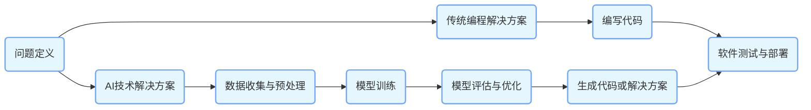

# AI技术对传统编程的颠覆

> 关键词：AI技术、传统编程、颠覆、代码生成、编程范式

> 摘要：本文深入探讨了AI技术对传统编程带来的多方面颠覆。首先介绍了相关背景，包括目的范围、预期读者等内容。接着阐述了AI技术与传统编程的核心概念及联系，分析了AI代码生成等核心算法原理并给出Python示例。通过数学模型进一步理解AI在编程中的作用，结合项目实战展示AI在实际编程中的应用。还探讨了AI技术在不同场景的应用，推荐了学习工具和资源。最后总结了未来发展趋势与挑战，解答常见问题并提供参考资料，旨在让读者全面了解AI技术对传统编程的巨大影响。

## 1. 背景介绍 
### 1.1 目的和范围
本文章旨在全面且深入地剖析AI技术对传统编程所造成的颠覆性影响。范围涵盖从编程的基础概念、算法原理，到实际的项目开发、应用场景等多个层面。通过对这些方面的研究，帮助读者清晰地认识到AI技术如何改变传统编程的方式、流程以及未来的发展方向。

### 1.2 预期读者
预期读者主要包括从事传统编程工作的程序员、软件架构师、CTO等技术人员，他们希望了解AI技术如何与传统编程相结合，以及如何应对这种技术变革。同时，也适合对编程和AI技术感兴趣的初学者、研究人员，帮助他们建立对这一领域的全面认识。

### 1.3 文档结构概述
本文首先介绍了相关背景知识，为后续内容打下基础。接着阐述AI技术与传统编程的核心概念及它们之间的联系，包括原理和架构的示意图。然后详细讲解核心算法原理，并通过Python代码进行说明。再介绍相关的数学模型和公式，并举例说明。通过项目实战展示AI在实际编程中的应用，包括开发环境搭建、代码实现和解读。之后探讨AI技术在不同场景的应用，推荐学习工具和资源。最后总结未来发展趋势与挑战，解答常见问题并提供参考资料。

### 1.4 术语表
#### 1.4.1 核心术语定义
- **AI技术**：即人工智能技术，是一门研究如何使计算机能够模拟人类智能的学科，包括机器学习、深度学习、自然语言处理等多个领域。
- **传统编程**：指的是程序员通过编写明确的指令和逻辑，让计算机按照预定的方式执行任务的编程方式。
- **代码生成**：利用AI技术自动生成符合特定需求的代码。
- **编程范式**：是指编程的基本风格和方法，如面向对象编程、函数式编程等。

#### 1.4.2 相关概念解释
- **机器学习**：是AI技术的一个重要分支，通过让计算机从数据中学习模式和规律，从而实现对未知数据的预测和判断。
- **深度学习**：是一种基于人工神经网络的机器学习方法，通过构建多层神经网络来处理复杂的数据和任务。
- **自然语言处理**：是AI技术的另一个重要领域，旨在让计算机能够理解和处理人类语言，实现人机之间的自然交互。

#### 1.4.3 缩略词列表
- **ML**：Machine Learning，机器学习
- **DL**：Deep Learning，深度学习
- **NLP**：Natural Language Processing，自然语言处理

## 2. 核心概念与联系 

### 传统编程的核心概念
传统编程主要依赖程序员手动编写代码，将问题的解决方案转化为计算机能够理解的指令序列。程序员需要明确地定义数据结构、算法逻辑和控制流程。例如，在编写一个排序程序时，程序员需要选择合适的排序算法（如冒泡排序、快速排序等），并手动实现算法的具体步骤。

### AI技术的核心概念
AI技术的核心在于让计算机具备智能，能够自主地学习和解决问题。机器学习是AI技术的重要实现方式之一，它通过让计算机从大量的数据中学习模式和规律，从而实现对未知数据的预测和判断。深度学习则是机器学习的一个分支，它通过构建多层神经网络，自动提取数据中的特征，从而实现更复杂的任务，如图像识别、语音识别等。

### 核心概念的联系
AI技术与传统编程并不是相互独立的，而是相互融合的。传统编程为AI技术提供了基础的实现手段，例如在开发机器学习模型时，需要使用传统编程来实现数据的预处理、模型的训练和评估等。而AI技术则为传统编程带来了新的思路和方法，例如通过AI代码生成工具，可以自动生成部分代码，提高编程效率。

### 文本示意图
传统编程就像是一个精确的工匠，通过手动操作将各种材料（代码）组合成一个完整的产品（软件）。而AI技术则像是一个智能的助手，能够根据已有的经验（数据）和规则（模型），自动完成一些任务，甚至可以提供一些创造性的解决方案。两者相互协作，共同推动软件行业的发展。

### Mermaid流程图


## 3. 核心算法原理 & 具体操作步骤 

### AI代码生成的核心算法原理
AI代码生成主要基于自然语言处理和机器学习技术。常见的方法是使用预训练的语言模型，如GPT系列。这些模型通过在大规模的文本数据上进行训练，学习到了语言的语法、语义和逻辑结构。当输入一个自然语言描述的编程任务时，模型会根据已有的知识和模式，生成相应的代码。

### 具体操作步骤
1. **数据准备**：收集大量的代码数据和对应的自然语言描述，构建训练数据集。
2. **模型选择**：选择合适的预训练语言模型，如GPT-3、CodeGen等。
3. **微调模型**：使用准备好的数据集对预训练模型进行微调，使其更适合代码生成任务。
4. **输入任务描述**：将需要实现的编程任务用自然语言描述输入到微调后的模型中。
5. **生成代码**：模型根据输入的任务描述生成相应的代码。

### Python源代码详细阐述
以下是一个简单的示例，使用Hugging Face的transformers库来调用预训练的CodeGen模型进行代码生成：

```python
from transformers import AutoTokenizer, AutoModelForCausalLM

# 加载预训练的tokenizer和模型
tokenizer = AutoTokenizer.from_pretrained("Salesforce/codegen-350M-mono")
model = AutoModelForCausalLM.from_pretrained("Salesforce/codegen-350M-mono")

# 定义输入的任务描述
input_text = "Write a Python function to calculate the sum of two numbers."

# 将输入文本转换为模型可以处理的输入格式
input_ids = tokenizer(input_text, return_tensors="pt").input_ids

# 生成代码
generated_ids = model.generate(input_ids, max_length=100, num_beams=5, no_repeat_ngram_size=2)
generated_code = tokenizer.decode(generated_ids[0], skip_special_tokens=True)

print(generated_code)
```

### 代码解释
1. **加载预训练的tokenizer和模型**：使用`AutoTokenizer`和`AutoModelForCausalLM`从Hugging Face的模型库中加载CodeGen模型。
2. **定义输入的任务描述**：将需要实现的编程任务用自然语言描述存储在`input_text`变量中。
3. **将输入文本转换为模型可以处理的输入格式**：使用`tokenizer`将输入文本转换为模型可以处理的输入ID序列。
4. **生成代码**：使用`model.generate`方法生成代码，设置最大长度、束搜索的数量和不重复的n-gram大小等参数。
5. **解码生成的代码**：使用`tokenizer.decode`方法将生成的ID序列解码为文本格式。

## 4. 数学模型和公式 & 详细讲解 & 举例说明 

### 语言模型的数学基础
语言模型的目标是计算给定输入序列的条件概率分布，即预测下一个词的概率。常见的语言模型使用的是自回归模型，其数学公式可以表示为：

$$P(w_1, w_2, \cdots, w_n) = \prod_{i=1}^{n} P(w_i | w_1, w_2, \cdots, w_{i-1})$$

其中，$w_1, w_2, \cdots, w_n$ 是一个词序列，$P(w_i | w_1, w_2, \cdots, w_{i-1})$ 表示在给定前面 $i-1$ 个词的条件下，第 $i$ 个词出现的概率。

### 深度学习模型的损失函数
在训练深度学习模型时，需要定义一个损失函数来衡量模型的预测结果与真实标签之间的差异。常见的损失函数包括交叉熵损失函数，其数学公式可以表示为：

$$L = -\frac{1}{N} \sum_{i=1}^{N} \sum_{j=1}^{C} y_{ij} \log(p_{ij})$$

其中，$N$ 是样本数量，$C$ 是类别数量，$y_{ij}$ 是第 $i$ 个样本的第 $j$ 个类别的真实标签，$p_{ij}$ 是模型对第 $i$ 个样本的第 $j$ 个类别的预测概率。

### 举例说明
假设我们有一个简单的语言模型，用于预测下一个词。输入序列为 "I love"，我们希望预测下一个词是 "coding" 的概率。根据语言模型的公式，我们需要计算 $P(\text{"coding"} | \text{"I love"})$。在训练过程中，我们可以使用交叉熵损失函数来优化模型，使得模型对正确的下一个词的预测概率尽可能高。

## 5. 项目实战：代码实际案例和详细解释说明 

### 5.1 开发环境搭建
#### 安装Python
首先，需要安装Python环境。可以从Python官方网站（https://www.python.org/downloads/）下载适合自己操作系统的Python版本，并按照安装向导进行安装。

#### 创建虚拟环境
为了避免不同项目之间的依赖冲突，建议使用虚拟环境。可以使用`venv`模块创建虚拟环境：

```bash
python -m venv myenv
```

#### 激活虚拟环境
在Windows系统上，激活虚拟环境的命令为：

```bash
myenv\Scripts\activate
```

在Linux或macOS系统上，激活虚拟环境的命令为：

```bash
source myenv/bin/activate
```

#### 安装必要的库
在激活虚拟环境后，安装项目所需的库，如`transformers`、`torch`等：

```bash
pip install transformers torch
```

### 5.2 源代码详细实现和代码解读
以下是一个完整的代码示例，使用AI技术生成一个简单的Python Web应用：

```python
from transformers import AutoTokenizer, AutoModelForCausalLM
import streamlit as st

# 加载预训练的tokenizer和模型
tokenizer = AutoTokenizer.from_pretrained("Salesforce/codegen-350M-mono")
model = AutoModelForCausalLM.from_pretrained("Salesforce/codegen-350M-mono")

# 定义一个函数来生成代码
def generate_code(input_text):
    input_ids = tokenizer(input_text, return_tensors="pt").input_ids
    generated_ids = model.generate(input_ids, max_length=500, num_beams=5, no_repeat_ngram_size=2)
    generated_code = tokenizer.decode(generated_ids[0], skip_special_tokens=True)
    return generated_code

# 使用Streamlit创建一个简单的Web界面
st.title("AI Code Generator")
input_text = st.text_area("Enter your programming task description:")
if st.button("Generate Code"):
    code = generate_code(input_text)
    st.code(code, language='python')
```

### 代码解读
1. **加载预训练的tokenizer和模型**：与前面的示例相同，使用`AutoTokenizer`和`AutoModelForCausalLM`加载CodeGen模型。
2. **定义生成代码的函数**：`generate_code`函数接受一个自然语言描述的编程任务作为输入，调用模型生成相应的代码，并返回生成的代码。
3. **使用Streamlit创建Web界面**：使用`streamlit`库创建一个简单的Web界面，包含一个文本输入框和一个按钮。用户可以在文本输入框中输入编程任务描述，点击按钮后，调用`generate_code`函数生成代码，并将生成的代码显示在界面上。

### 5.3 代码解读与分析
通过这个项目实战，我们可以看到AI技术在代码生成方面的强大能力。用户只需要用自然语言描述编程任务，就可以快速生成相应的代码。同时，使用`streamlit`库可以方便地创建一个Web界面，使得代码生成过程更加直观和易用。然而，需要注意的是，生成的代码可能需要进一步的修改和优化，以满足实际的需求。

## 6. 实际应用场景 
### 快速原型开发
在软件开发的早期阶段，需要快速验证想法和概念。AI技术可以帮助程序员快速生成代码原型，减少开发时间和成本。例如，在开发一个新的Web应用时，程序员可以使用AI代码生成工具快速生成前端界面和后端逻辑的代码框架，然后在此基础上进行进一步的开发和优化。

### 代码补全和修复
在编写代码的过程中，程序员可能会遇到语法错误、逻辑错误等问题。AI技术可以通过分析上下文和已有代码，提供代码补全和修复的建议。例如，当程序员输入一个函数名时，AI代码补全工具可以自动提示函数的参数和返回值，提高编程效率。

### 自动化测试
AI技术可以用于自动化测试，通过生成测试用例和执行测试，帮助程序员发现代码中的缺陷和漏洞。例如，使用机器学习算法可以自动分析代码的结构和逻辑，生成覆盖度高的测试用例，提高软件的质量和可靠性。

### 智能编程助手
AI技术可以开发智能编程助手，为程序员提供实时的编程建议和指导。例如，智能编程助手可以根据程序员的编程习惯和历史记录，推荐合适的编程模式和最佳实践，帮助程序员提高编程水平。

## 7. 工具和资源推荐
### 7.1 学习资源推荐
#### 7.1.1 书籍推荐
- 《人工智能：一种现代的方法》：全面介绍了人工智能的基本概念、算法和应用，是学习人工智能的经典教材。
- 《Python机器学习》：详细介绍了使用Python进行机器学习的方法和技巧，适合初学者入门。
- 《深度学习》：由深度学习领域的三位先驱所著，系统地介绍了深度学习的理论和实践。

#### 7.1.2 在线课程
- Coursera上的“机器学习”课程：由斯坦福大学的Andrew Ng教授主讲，是学习机器学习的经典课程。
- edX上的“深度学习微硕士”课程：提供了深度学习的全面学习路径，适合有一定基础的学习者。
- 吴恩达老师在B站上的“机器学习入门”课程：内容通俗易懂，适合初学者快速入门。

#### 7.1.3 技术博客和网站
- Towards Data Science：一个专注于数据科学和机器学习的技术博客，提供了大量的高质量文章和教程。
- Medium：一个综合性的技术博客平台，有很多关于AI和编程的优秀文章。
- GitHub：一个开源代码托管平台，可以学习到很多优秀的开源项目和代码实现。

### 7.2 开发工具框架推荐
#### 7.2.1 IDE和编辑器
- PyCharm：一个专业的Python集成开发环境，提供了丰富的代码编辑、调试和分析功能。
- Visual Studio Code：一个轻量级的代码编辑器，支持多种编程语言，有丰富的插件扩展。
- Jupyter Notebook：一个交互式的编程环境，适合进行数据探索和模型实验。

#### 7.2.2 调试和性能分析工具
- PDB：Python自带的调试工具，可以帮助程序员定位代码中的问题。
- cProfile：Python的性能分析工具，可以分析代码的执行时间和内存使用情况。
- TensorBoard：一个用于可视化深度学习模型训练过程的工具，可以帮助开发者监控模型的性能和收敛情况。

#### 7.2.3 相关框架和库
- TensorFlow：一个开源的深度学习框架，提供了丰富的工具和库，用于构建和训练深度学习模型。
- PyTorch：另一个流行的深度学习框架，具有动态图的特点，适合快速开发和实验。
- Hugging Face Transformers：一个用于自然语言处理的开源库，提供了大量的预训练模型和工具，方便开发者进行文本处理和代码生成。

### 7.3 相关论文著作推荐
#### 7.3.1 经典论文
- “Attention Is All You Need”：提出了Transformer架构，是自然语言处理领域的重要突破。
- “ImageNet Classification with Deep Convolutional Neural Networks”：介绍了AlexNet模型，开启了深度学习在计算机视觉领域的应用热潮。
- “Generative Adversarial Networks”：提出了生成对抗网络（GAN）的概念，为生成式模型的发展奠定了基础。

#### 7.3.2 最新研究成果
- 关注顶级学术会议（如NeurIPS、ICML、CVPR等）的最新论文，了解AI技术的最新研究动态。
- 一些知名的研究机构（如OpenAI、DeepMind等）会发布他们的最新研究成果，可以关注他们的官方网站。

#### 7.3.3 应用案例分析
- 可以在ACM Digital Library、IEEE Xplore等学术数据库中查找AI技术在不同领域的应用案例分析，学习实际应用中的经验和技巧。

## 8. 总结：未来发展趋势与挑战
### 未来发展趋势
- **更强大的代码生成能力**：随着AI技术的不断发展，代码生成工具将变得更加智能和强大，能够生成更复杂、更高质量的代码。
- **与传统编程工具的深度融合**：AI技术将与传统的编程工具（如IDE、版本控制系统等）深度融合，为程序员提供更加便捷和高效的编程体验。
- **跨领域应用**：AI技术在编程领域的应用将不仅仅局限于软件开发，还将扩展到其他领域，如硬件设计、数据分析等。

### 挑战
- **代码质量和安全性**：AI生成的代码可能存在质量和安全性问题，需要进一步的验证和审查。
- **对程序员技能的要求变化**：随着AI技术的应用，程序员需要掌握更多的AI和机器学习知识，以适应技术的发展。
- **伦理和法律问题**：AI技术的应用可能会带来一些伦理和法律问题，如代码的版权归属、算法的公平性等，需要制定相应的政策和法规来规范。

## 9. 附录：常见问题与解答
### 问题1：AI生成的代码可以直接用于生产环境吗？
答：一般情况下，AI生成的代码不能直接用于生产环境。虽然AI技术可以生成代码框架和基本逻辑，但生成的代码可能存在语法错误、逻辑漏洞等问题，需要程序员进行进一步的修改和优化。同时，还需要进行严格的测试和验证，确保代码的质量和安全性。

### 问题2：AI技术会取代程序员吗？
答：AI技术不会取代程序员，但会对程序员的工作方式和技能要求产生影响。AI技术可以帮助程序员提高编程效率，完成一些重复性和规律性的任务，但在软件设计、架构规划、需求分析等方面，仍然需要程序员的专业知识和经验。因此，程序员需要不断学习和掌握新的技术，与AI技术协同工作。

### 问题3：如何选择适合的AI代码生成工具？
答：选择适合的AI代码生成工具需要考虑多个因素，如工具的功能、性能、易用性、适用场景等。可以根据自己的需求和技术水平，选择一些知名的开源工具（如Hugging Face Transformers）或商业工具（如GitHub Copilot）进行尝试和比较。

## 10. 扩展阅读 & 参考资料
### 扩展阅读
- 《人工智能时代的编程范式变革》
- 《AI与软件开发的未来》

### 参考资料
- Hugging Face官方文档：https://huggingface.co/docs
- TensorFlow官方文档：https://www.tensorflow.org/api_docs
- PyTorch官方文档：https://pytorch.org/docs/stable/index.html