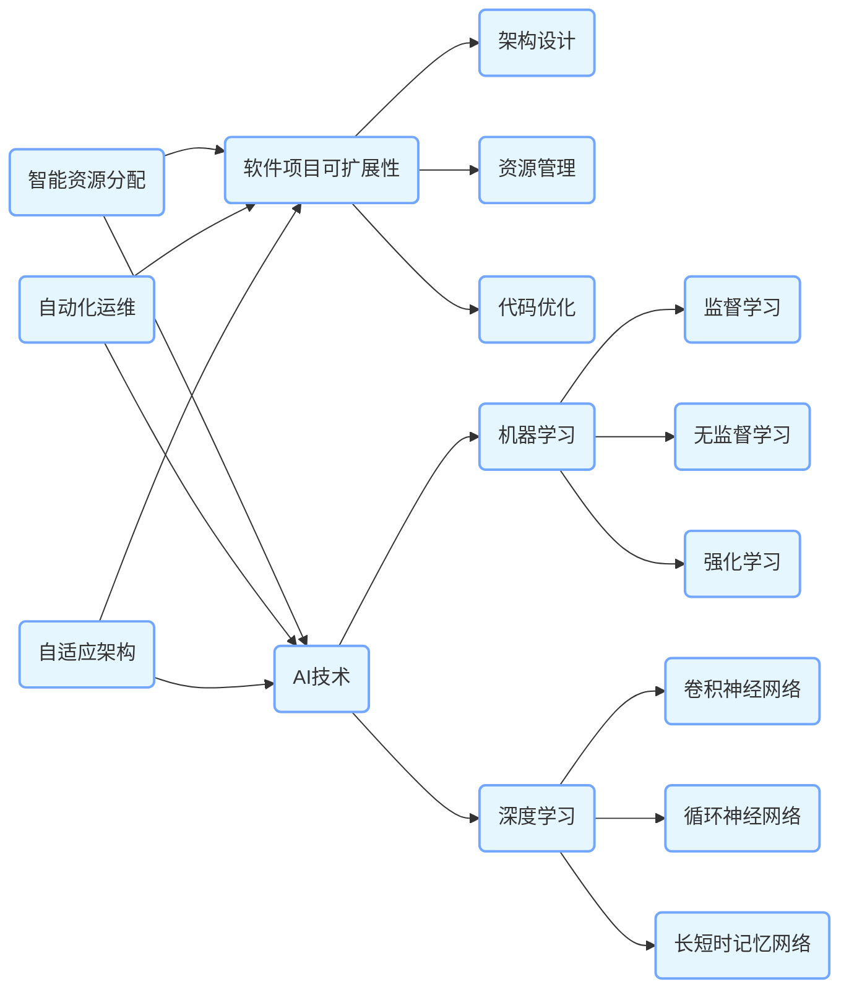

# AI技术提升软件项目可扩展性的策略

> 关键词：AI技术、软件项目、可扩展性、策略、机器学习、深度学习

> 摘要：本文深入探讨了利用AI技术提升软件项目可扩展性的策略。首先介绍了研究的背景、目的、预期读者等基本信息。接着阐述了核心概念与联系，包括AI和软件项目可扩展性的原理及相互关系，并通过示意图和流程图展示。详细讲解了核心算法原理，结合Python代码进行说明，同时给出了相关数学模型和公式。通过项目实战案例，展示了如何在实际开发中运用这些策略。还分析了实际应用场景，推荐了学习资源、开发工具框架以及相关论文著作。最后总结了未来发展趋势与挑战，并提供了常见问题解答和扩展阅读参考资料，旨在为开发者和相关从业者提供全面的指导，以有效利用AI技术增强软件项目的可扩展性。

## 1. 背景介绍 
### 1.1 目的和范围
在当今数字化时代，软件项目面临着不断增长的用户需求和数据量，可扩展性成为衡量软件项目成功与否的关键指标之一。本研究的目的在于探索如何运用AI技术来提升软件项目的可扩展性，涵盖了从核心概念的理解到实际应用的各个方面，包括算法原理、数学模型、项目实战等，旨在为软件开发团队和相关从业者提供全面且实用的策略和方法。

### 1.2 预期读者
本文的预期读者主要包括软件开发者、软件架构师、CTO等技术人员，以及对AI技术在软件项目中应用感兴趣的研究人员和学生。这些读者希望通过本文了解如何利用AI技术解决软件项目可扩展性问题，提升软件的性能和应对变化的能力。

### 1.3 文档结构概述
本文将按照以下结构展开：首先介绍核心概念与联系，明确AI技术和软件项目可扩展性的基本原理和相互关系；接着详细讲解核心算法原理和具体操作步骤，并结合Python代码进行说明；然后给出相关的数学模型和公式，并举例说明；通过项目实战展示如何在实际开发中运用这些策略；分析实际应用场景；推荐学习资源、开发工具框架和相关论文著作；最后总结未来发展趋势与挑战，提供常见问题解答和扩展阅读参考资料。

### 1.4 术语表
#### 1.4.1 核心术语定义
- **AI技术**：人工智能技术，是一门研究如何使计算机能够模拟人类智能的学科，包括机器学习、深度学习、自然语言处理等多个领域。
- **软件项目可扩展性**：指软件系统在面对不断增长的用户需求、数据量和功能要求时，能够通过增加资源（如硬件、软件模块等）来提高性能和处理能力，而不会出现明显的性能下降或系统崩溃的能力。
- **机器学习**：是AI技术的一个重要分支，它让计算机通过数据学习模式和规律，从而能够进行预测和决策，而无需明确的编程指令。
- **深度学习**：是机器学习的一种特殊形式，它基于神经网络模型，特别是深度神经网络，能够自动从大量数据中学习复杂的特征和模式。

#### 1.4.2 相关概念解释
- **自动化运维**：利用AI技术实现软件系统的自动化监控、故障诊断和修复，减少人工干预，提高系统的可靠性和可维护性。
- **智能资源分配**：根据软件系统的实时需求，利用AI算法自动分配计算资源、存储资源等，以提高资源利用率和系统性能。
- **自适应架构**：软件架构能够根据运行时的环境和需求变化自动调整，以适应不同的负载和场景。

#### 1.4.3 缩略词列表
- **AI**：Artificial Intelligence（人工智能）
- **ML**：Machine Learning（机器学习）
- **DL**：Deep Learning（深度学习）
- **NLP**：Natural Language Processing（自然语言处理）
- **DNN**：Deep Neural Network（深度神经网络）

## 2. 核心概念与联系 

### 核心概念原理
#### AI技术原理
AI技术主要基于机器学习和深度学习算法。机器学习通过对大量数据的学习，构建模型来进行预测和分类。例如，在监督学习中，模型通过学习输入数据和对应的标签之间的关系，来对新的输入数据进行预测。深度学习则是利用深度神经网络，自动从数据中提取特征，其网络结构通常包含多个隐藏层，能够学习到非常复杂的模式。

#### 软件项目可扩展性原理
软件项目的可扩展性主要涉及到架构设计、资源管理和代码优化等方面。一个具有良好可扩展性的软件架构应该能够方便地添加新的功能模块，并且在系统负载增加时能够通过增加资源来提高性能。例如，采用分布式架构可以将系统的功能分散到多个节点上，从而提高系统的处理能力。

### 架构的文本示意图
```plaintext
软件项目可扩展性
|-- 架构设计
|   |-- 分布式架构
|   |-- 微服务架构
|   |-- 分层架构
|-- 资源管理
|   |-- 计算资源
|   |-- 存储资源
|   |-- 网络资源
|-- 代码优化
|   |-- 算法优化
|   |-- 数据结构优化
|   |-- 代码复用

AI技术
|-- 机器学习
|   |-- 监督学习
|   |-- 无监督学习
|   |-- 强化学习
|-- 深度学习
|   |-- 卷积神经网络（CNN）
|   |-- 循环神经网络（RNN）
|   |-- 长短时记忆网络（LSTM）

AI技术与软件项目可扩展性的联系
|-- 智能资源分配
|-- 自动化运维
|-- 自适应架构
```

### Mermaid流程图


从流程图中可以看出，AI技术和软件项目可扩展性之间存在着紧密的联系。AI技术可以应用于软件项目的架构设计、资源管理和代码优化等方面，从而提升软件项目的可扩展性。同时，软件项目的可扩展性需求也为AI技术的应用提供了场景和动力。

## 3. 核心算法原理 & 具体操作步骤 

### 核心算法原理
#### 基于机器学习的资源预测算法
在软件项目中，准确预测资源需求对于提高可扩展性至关重要。一种常用的方法是使用机器学习中的回归算法，如线性回归和决策树回归。以线性回归为例，其基本原理是通过对历史资源使用数据的学习，找到输入变量（如时间、用户数量等）和输出变量（如CPU使用率、内存使用率等）之间的线性关系。

线性回归的数学模型可以表示为：

$$y = \theta_0 + \theta_1x_1 + \theta_2x_2 + \cdots + \theta_nx_n$$

其中，$y$ 是预测的资源使用量，$x_1, x_2, \cdots, x_n$ 是输入变量，$\theta_0, \theta_1, \cdots, \theta_n$ 是模型的参数。

#### 基于深度学习的故障诊断算法
深度学习在故障诊断方面具有强大的能力。例如，使用卷积神经网络（CNN）可以对软件系统的日志数据进行分析，识别潜在的故障模式。CNN的核心是卷积层，它通过卷积核在输入数据上滑动，提取局部特征。

### 具体操作步骤
#### 基于机器学习的资源预测算法操作步骤
1. **数据收集**：收集软件系统的历史资源使用数据，包括CPU使用率、内存使用率、网络带宽等，同时记录相关的输入变量，如时间、用户数量等。
2. **数据预处理**：对收集到的数据进行清洗、归一化等处理，以提高模型的训练效果。
3. **模型选择**：根据数据的特点和问题的需求，选择合适的机器学习模型，如线性回归、决策树回归等。
4. **模型训练**：使用预处理后的数据对模型进行训练，调整模型的参数，使其能够准确地预测资源需求。
5. **模型评估**：使用测试数据对训练好的模型进行评估，计算模型的预测误差，如均方误差（MSE）、平均绝对误差（MAE）等。
6. **模型应用**：将训练好的模型应用到实际的软件系统中，实时预测资源需求，并根据预测结果进行资源分配。

#### 基于深度学习的故障诊断算法操作步骤
1. **数据收集**：收集软件系统的日志数据，包括系统日志、应用程序日志等。
2. **数据预处理**：对日志数据进行清洗、分词等处理，将其转换为适合深度学习模型输入的格式。
3. **模型构建**：构建卷积神经网络模型，包括卷积层、池化层、全连接层等。
4. **模型训练**：使用预处理后的数据对模型进行训练，调整模型的参数，使其能够准确地识别故障模式。
5. **模型评估**：使用测试数据对训练好的模型进行评估，计算模型的准确率、召回率等指标。
6. **模型应用**：将训练好的模型应用到实际的软件系统中，实时监测系统的日志数据，及时发现潜在的故障。

### Python源代码示例
#### 基于机器学习的资源预测算法（线性回归）
```python
import numpy as np
from sklearn.linear_model import LinearRegression
from sklearn.model_selection import train_test_split
from sklearn.metrics import mean_squared_error

# 生成示例数据
np.random.seed(0)
X = np.random.rand(100, 2)  # 输入变量
y = 2 * X[:, 0] + 3 * X[:, 1] + np.random.randn(100)  # 资源使用量

# 划分训练集和测试集
X_train, X_test, y_train, y_test = train_test_split(X, y, test_size=0.2, random_state=42)

# 创建线性回归模型
model = LinearRegression()

# 训练模型
model.fit(X_train, y_train)

# 预测
y_pred = model.predict(X_test)

# 评估模型
mse = mean_squared_error(y_test, y_pred)
print(f"Mean Squared Error: {mse}")
```

#### 基于深度学习的故障诊断算法（简单的CNN模型）
```python
import numpy as np
import tensorflow as tf
from tensorflow.keras.models import Sequential
from tensorflow.keras.layers import Conv1D, MaxPooling1D, Flatten, Dense

# 生成示例数据
np.random.seed(0)
X = np.random.rand(100, 10, 1)  # 日志数据
y = np.random.randint(0, 2, 100)  # 故障标签

# 划分训练集和测试集
X_train, X_test, y_train, y_test = train_test_split(X, y, test_size=0.2, random_state=42)

# 创建CNN模型
model = Sequential()
model.add(Conv1D(filters=32, kernel_size=3, activation='relu', input_shape=(10, 1)))
model.add(MaxPooling1D(pool_size=2))
model.add(Flatten())
model.add(Dense(1, activation='sigmoid'))

# 编译模型
model.compile(optimizer='adam', loss='binary_crossentropy', metrics=['accuracy'])

# 训练模型
model.fit(X_train, y_train, epochs=10, batch_size=32, validation_data=(X_test, y_test))

# 评估模型
loss, accuracy = model.evaluate(X_test, y_test)
print(f"Loss: {loss}, Accuracy: {accuracy}")
```

## 4. 数学模型和公式 & 详细讲解 & 举例说明 

### 线性回归模型
#### 数学公式
线性回归的数学模型可以表示为：

$$y = \theta_0 + \theta_1x_1 + \theta_2x_2 + \cdots + \theta_nx_n$$

其中，$y$ 是预测的资源使用量，$x_1, x_2, \cdots, x_n$ 是输入变量，$\theta_0, \theta_1, \cdots, \theta_n$ 是模型的参数。

#### 详细讲解
线性回归的目标是找到一组最优的参数 $\theta_0, \theta_1, \cdots, \theta_n$，使得预测值 $y$ 与实际值之间的误差最小。通常使用最小二乘法来求解这些参数，即最小化误差平方和：

$$J(\theta) = \frac{1}{2m}\sum_{i=1}^{m}(h_{\theta}(x^{(i)}) - y^{(i)})^2$$

其中，$m$ 是样本数量，$h_{\theta}(x^{(i)})$ 是第 $i$ 个样本的预测值，$y^{(i)}$ 是第 $i$ 个样本的实际值。

#### 举例说明
假设我们要预测软件系统的CPU使用率，输入变量包括时间和用户数量。我们收集了100个样本数据，使用线性回归模型进行训练。训练完成后，得到模型的参数 $\theta_0 = 0.1$，$\theta_1 = 0.2$，$\theta_2 = 0.3$。如果当前时间对应的输入变量 $x_1 = 10$，用户数量 $x_2 = 20$，则预测的CPU使用率为：

$$y = 0.1 + 0.2 \times 10 + 0.3 \times 20 = 0.1 + 2 + 6 = 8.1$$

### 卷积神经网络（CNN）模型
#### 数学公式
卷积层的数学公式可以表示为：

$$z_{i,j}^l = \sum_{m=0}^{M-1}\sum_{n=0}^{N-1}w_{m,n}^l \cdot x_{i+m,j+n}^{l-1} + b^l$$

其中，$z_{i,j}^l$ 是第 $l$ 层卷积层的输出，$w_{m,n}^l$ 是卷积核的权重，$x_{i+m,j+n}^{l-1}$ 是第 $l-1$ 层的输入，$b^l$ 是偏置。

#### 详细讲解
卷积层通过卷积核在输入数据上滑动，提取局部特征。每个卷积核可以看作是一个滤波器，它对输入数据的不同区域进行卷积操作，得到一个特征图。池化层则用于减少特征图的尺寸，提高模型的计算效率和泛化能力。

#### 举例说明
假设我们有一个输入图像的尺寸为 $10 \times 10$，使用一个 $3 \times 3$ 的卷积核进行卷积操作。卷积核的权重为：

$$w = \begin{bmatrix}
0.1 & 0.2 & 0.3 \\
0.4 & 0.5 & 0.6 \\
0.7 & 0.8 & 0.9
\end{bmatrix}$$

偏置 $b = 0.1$。在卷积过程中，卷积核在输入图像上滑动，计算每个位置的卷积结果。例如，在输入图像的左上角位置，卷积结果为：

$$z_{0,0} = 0.1 \times x_{0,0} + 0.2 \times x_{0,1} + 0.3 \times x_{0,2} + 0.4 \times x_{1,0} + 0.5 \times x_{1,1} + 0.6 \times x_{1,2} + 0.7 \times x_{2,0} + 0.8 \times x_{2,1} + 0.9 \times x_{2,2} + 0.1$$

## 5. 项目实战：代码实际案例和详细解释说明 

### 5.1  开发环境搭建
#### 操作系统
可以选择Windows、Linux或macOS等常见的操作系统。本项目以Ubuntu 20.04为例。

#### 编程语言和版本
使用Python 3.8及以上版本。可以通过以下命令安装Python：
```bash
sudo apt update
sudo apt install python3.8
```

#### 开发工具
推荐使用Visual Studio Code作为开发工具，它具有丰富的插件和良好的代码编辑体验。可以从官方网站下载并安装。

#### 依赖库安装
安装必要的Python库，如NumPy、Pandas、Scikit-learn、TensorFlow等：
```bash
pip install numpy pandas scikit-learn tensorflow
```

### 5.2  源代码详细实现和代码解读
#### 项目需求
假设我们要开发一个软件系统，用于监控和预测服务器的CPU使用率。我们将使用机器学习算法来预测CPU使用率，并根据预测结果进行资源分配。

#### 代码实现
```python
import numpy as np
import pandas as pd
from sklearn.model_selection import train_test_split
from sklearn.linear_model import LinearRegression
from sklearn.metrics import mean_squared_error

# 数据加载
data = pd.read_csv('cpu_usage.csv')

# 数据预处理
X = data.drop('cpu_usage', axis=1)  # 输入变量
y = data['cpu_usage']  # 输出变量

# 划分训练集和测试集
X_train, X_test, y_train, y_test = train_test_split(X, y, test_size=0.2, random_state=42)

# 创建线性回归模型
model = LinearRegression()

# 训练模型
model.fit(X_train, y_train)

# 预测
y_pred = model.predict(X_test)

# 评估模型
mse = mean_squared_error(y_test, y_pred)
print(f"Mean Squared Error: {mse}")

# 根据预测结果进行资源分配
threshold = 0.8
if np.mean(y_pred) > threshold:
    print("Increase resources")
else:
    print("Keep current resources")
```

#### 代码解读
1. **数据加载**：使用Pandas库读取存储在 `cpu_usage.csv` 文件中的CPU使用率数据。
2. **数据预处理**：将数据分为输入变量 `X` 和输出变量 `y`。
3. **划分训练集和测试集**：使用 `train_test_split` 函数将数据划分为训练集和测试集，测试集占比为20%。
4. **模型创建和训练**：创建线性回归模型，并使用训练集数据对模型进行训练。
5. **预测和评估**：使用训练好的模型对测试集数据进行预测，并计算预测误差（均方误差）。
6. **资源分配决策**：根据预测结果的平均值与阈值进行比较，决定是否增加资源。

### 5.3  代码解读与分析
#### 优点
- **简单易懂**：线性回归模型是一种简单的机器学习模型，易于理解和实现。
- **计算效率高**：线性回归模型的训练和预测速度较快，适用于实时监测和预测。
- **可解释性强**：线性回归模型的参数可以解释输入变量对输出变量的影响程度。

#### 缺点
- **模型复杂度低**：线性回归模型只能处理线性关系，对于复杂的非线性关系可能无法准确建模。
- **对异常值敏感**：线性回归模型对异常值比较敏感，可能会导致模型的性能下降。

#### 改进方向
- **使用更复杂的模型**：可以尝试使用决策树回归、随机森林回归等更复杂的模型，以提高模型的性能。
- **处理异常值**：可以使用数据清洗和异常值检测技术，去除数据中的异常值，提高模型的稳定性。

## 6. 实际应用场景 

### 云计算平台
在云计算平台中，AI技术可以用于智能资源分配。通过对用户的历史使用数据进行分析，预测用户的未来资源需求，从而自动调整虚拟机的配置，提高资源利用率。例如，亚马逊AWS使用机器学习算法来预测用户的计算资源需求，根据预测结果动态分配EC2实例。

### 电商平台
电商平台面临着高并发的用户访问和大量的交易数据。AI技术可以用于自动化运维，实时监测系统的性能指标，如响应时间、吞吐量等，及时发现潜在的故障并进行修复。同时，还可以使用深度学习算法对用户的购买行为进行分析，实现个性化推荐，提高用户的购物体验。

### 金融行业
金融行业的软件系统需要处理大量的交易数据和风险评估。AI技术可以用于风险预测和欺诈检测。通过对历史交易数据的学习，构建风险评估模型，预测潜在的风险。同时，使用深度学习算法对交易数据进行实时监测，识别欺诈行为，保障用户的资金安全。

### 医疗行业
医疗行业的软件系统需要处理大量的医疗数据，如病历、影像等。AI技术可以用于辅助诊断和疾病预测。通过对大量的医疗数据进行分析，构建诊断模型，帮助医生更准确地诊断疾病。同时，使用机器学习算法对患者的健康数据进行监测，预测疾病的发生风险，提前采取预防措施。

## 7. 工具和资源推荐
### 7.1 学习资源推荐
#### 7.1.1 书籍推荐
- 《机器学习》（周志华）：这本书是机器学习领域的经典教材，全面介绍了机器学习的基本概念、算法和应用。
- 《深度学习》（Ian Goodfellow、Yoshua Bengio和Aaron Courville）：这是深度学习领域的权威著作，深入讲解了深度学习的原理和应用。
- 《Python数据分析实战》（Sebastian Raschka）：本书介绍了如何使用Python进行数据分析，包括数据处理、可视化和机器学习等方面。

#### 7.1.2 在线课程
- Coursera上的“机器学习”课程（Andrew Ng）：这是一门非常经典的机器学习课程，由斯坦福大学的Andrew Ng教授授课，适合初学者入门。
- edX上的“深度学习”课程（MIT）：该课程由麻省理工学院的教授授课，深入讲解了深度学习的理论和实践。
- Kaggle上的“机器学习微课程”：这是一系列简短的机器学习课程，适合快速学习和实践。

#### 7.1.3 技术博客和网站
- Medium：上面有很多关于AI和机器学习的技术文章，涵盖了最新的研究成果和实践经验。
- Towards Data Science：专注于数据科学和机器学习领域的技术博客，提供了丰富的教程和案例。
- arXiv：是一个预印本平台，上面可以找到最新的AI和机器学习研究论文。

### 7.2 开发工具框架推荐
#### 7.2.1 IDE和编辑器
- Visual Studio Code：是一款轻量级的代码编辑器，支持多种编程语言和插件，具有良好的代码编辑和调试功能。
- PyCharm：是一款专门为Python开发设计的集成开发环境，提供了丰富的功能和工具，适合专业的Python开发者。
- Jupyter Notebook：是一个交互式的开发环境，适合进行数据探索和模型实验。

#### 7.2.2 调试和性能分析工具
- TensorBoard：是TensorFlow提供的一个可视化工具，用于监控模型的训练过程和性能指标。
- Py-Spy：是一个用于Python代码性能分析的工具，可以帮助开发者找出代码中的性能瓶颈。
- Numba：是一个用于加速Python代码的库，通过即时编译技术提高代码的执行速度。

#### 7.2.3 相关框架和库
- TensorFlow：是一个开源的深度学习框架，提供了丰富的工具和库，支持多种深度学习模型的开发和训练。
- PyTorch：是另一个流行的深度学习框架，具有动态图机制，易于使用和调试。
- Scikit-learn：是一个用于机器学习的Python库，提供了各种机器学习算法和工具，适合初学者和快速开发。

### 7.3 相关论文著作推荐
#### 7.3.1 经典论文
- “Gradient-Based Learning Applied to Document Recognition”（Yann LeCun等）：这篇论文介绍了卷积神经网络（CNN）的基本原理和应用，是深度学习领域的经典之作。
- “Learning Representations by Back-propagating Errors”（David E. Rumelhart等）：这篇论文提出了反向传播算法，为神经网络的训练提供了有效的方法。
- “Playing Atari with Deep Reinforcement Learning”（Volodymyr Mnih等）：这篇论文展示了深度强化学习在游戏中的应用，开启了强化学习的新篇章。

#### 7.3.2 最新研究成果
- 关注顶级学术会议，如NeurIPS（神经信息处理系统大会）、ICML（国际机器学习会议）、CVPR（计算机视觉与模式识别会议）等，这些会议上会发布最新的AI和机器学习研究成果。
- 订阅相关的学术期刊，如Journal of Artificial Intelligence Research（JAIR）、Artificial Intelligence等，获取最新的研究论文。

#### 7.3.3 应用案例分析
- 研究一些知名公司的AI应用案例，如Google的AlphaGo、Facebook的图像识别技术、Amazon的智能推荐系统等，了解AI技术在实际应用中的实现方法和效果。
- 参考一些开源项目，如TensorFlow的官方示例、Keras的应用案例等，学习如何使用AI框架进行项目开发。

## 8. 总结：未来发展趋势与挑战
### 未来发展趋势
#### 融合多种AI技术
未来，软件项目将越来越多地融合多种AI技术，如机器学习、深度学习、自然语言处理、计算机视觉等，以实现更复杂的功能和更高的性能。例如，在智能客服系统中，结合自然语言处理和机器学习技术，实现自动问答和智能推荐。

#### 边缘计算与AI的结合
随着物联网设备的普及，边缘计算与AI的结合将成为一个重要的发展趋势。将AI模型部署到边缘设备上，可以减少数据传输延迟，提高系统的实时性和隐私性。例如，在智能摄像头中，使用边缘计算和计算机视觉技术，实现实时的目标检测和识别。

#### 自动化软件开发
AI技术将越来越多地应用于软件开发过程中，实现自动化的代码生成、测试和部署。例如，使用深度学习模型生成代码，使用强化学习算法优化软件测试用例。

### 挑战
#### 数据隐私和安全
随着AI技术的广泛应用，数据隐私和安全问题变得越来越重要。软件系统需要处理大量的敏感数据，如用户的个人信息、医疗记录等，如何保护这些数据的隐私和安全是一个巨大的挑战。

#### 模型可解释性
深度学习模型通常是黑盒模型，其决策过程难以解释。在一些关键领域，如医疗、金融等，模型的可解释性至关重要。如何提高模型的可解释性，是当前AI研究的一个热点问题。

#### 人才短缺
AI技术的发展需要大量的专业人才，包括机器学习工程师、深度学习专家等。目前，市场上这类人才短缺，如何培养和吸引更多的AI人才是软件行业面临的一个挑战。

## 9. 附录：常见问题与解答
### 问题1：AI技术是否适用于所有类型的软件项目？
解答：不是所有类型的软件项目都适合使用AI技术。AI技术通常适用于处理复杂的、具有不确定性的问题，如预测、分类、识别等。对于一些简单的、确定性的问题，使用传统的编程方法可能更加高效。

### 问题2：如何选择合适的AI算法？
解答：选择合适的AI算法需要考虑多个因素，如问题的类型、数据的特点、模型的复杂度等。一般来说，可以先对问题进行分析，确定是分类问题、回归问题还是其他类型的问题，然后根据数据的规模和特征选择合适的算法。例如，对于小规模的数据，可以选择简单的机器学习算法，如线性回归、逻辑回归等；对于大规模的数据和复杂的问题，可以选择深度学习算法，如卷积神经网络、循环神经网络等。

### 问题3：AI模型的训练需要多长时间？
解答：AI模型的训练时间取决于多个因素，如模型的复杂度、数据的规模、硬件的性能等。简单的机器学习模型可能只需要几分钟或几小时的训练时间，而复杂的深度学习模型可能需要几天甚至几周的训练时间。可以通过优化模型结构、使用更高效的算法和硬件加速等方法来缩短训练时间。

### 问题4：如何评估AI模型的性能？
解答：评估AI模型的性能需要使用合适的评估指标。对于分类问题，常用的评估指标包括准确率、召回率、F1值等；对于回归问题，常用的评估指标包括均方误差、平均绝对误差等。此外，还可以使用交叉验证等方法来评估模型的泛化能力。

## 10. 扩展阅读 & 参考资料
### 扩展阅读
- 《AI未来进行式》（李开复、王咏刚）：这本书介绍了AI技术的发展现状和未来趋势，以及AI在各个领域的应用案例。
- 《智能时代》（吴军）：作者从历史和技术的角度，探讨了AI技术对人类社会的影响和变革。
- 《算法之美：指导工作与生活的算法》（Brian Christian、Tom Griffiths）：本书介绍了一些经典的算法思想，并探讨了如何将这些算法应用到日常生活和工作中。

### 参考资料
- 周志华. 机器学习[M]. 清华大学出版社, 2016.
- Ian Goodfellow, Yoshua Bengio, Aaron Courville. 深度学习[M]. 人民邮电出版社, 2017.
- Sebastian Raschka. Python数据分析实战[M]. 人民邮电出版社, 2018.
- Andrew Ng. Machine Learning [Online Course]. Coursera.
- MIT. Deep Learning [Online Course]. edX.
- Kaggle. Machine Learning Micro-Courses.
- Yann LeCun, Léon Bottou, Yoshua Bengio, Patrick Haffner. Gradient-Based Learning Applied to Document Recognition [J]. Proceedings of the IEEE, 1998, 86(11): 2278-2324.
- David E. Rumelhart, Geoffrey E. Hinton, Ronald J. Williams. Learning Representations by Back-propagating Errors [J]. Nature, 1986, 323(6088): 533-536.
- Volodymyr Mnih, Koray Kavukcuoglu, David Silver, Andrei A. Rusu, Joel Veness, Marc G. Bellemare, Alex Graves, Martin Riedmiller, Andreas K. Fidjeland, Georg Ostrovski, Stig Petersen, Charles Beattie, Amir Sadik, Ioannis Antonoglou, Helen King, Dharshan Kumaran, Daan Wierstra, Shane Legg, Demis Hassabis. Playing Atari with Deep Reinforcement Learning [J]. arXiv preprint arXiv:1312.5602, 2013.